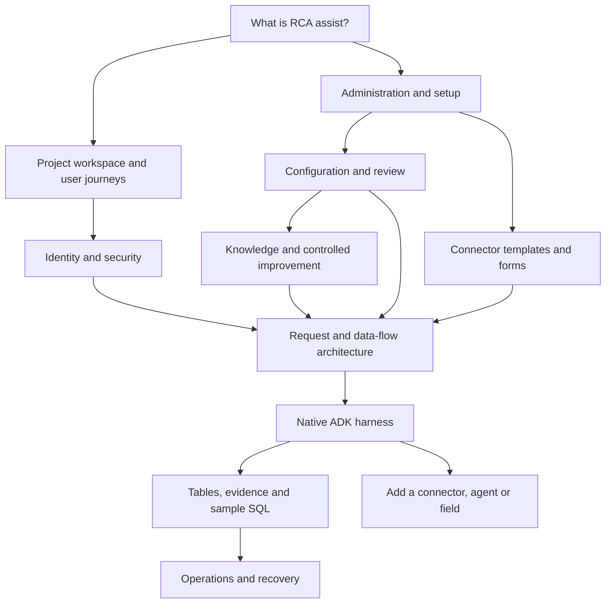

# RCA assist technical handbook

Start here for the complete product, implementation and operating flow. The five primary guides explain the system; five detailed handbooks cover connectors, ADK, data, security and knowledge. All maintained human-facing technical guides live in this folder. Root project/agent instruction entrypoints and runtime skill/storage-layout notes remain beside the files that require them.

## Explore the system

Click a diagram node to open its detailed explanation. The linked reading paths below each graph provide the same navigation in Markdown viewers that disable Mermaid links. Links are relative to the document, so keep the `docs/` layout intact when publishing it. Sequence-diagram participants expose related-document links in renderers that support that feature.

Reading path: [product](project.md) → [pages](project.md#project-page-map) → [security](security.md) → [connectors](connectors.md) → [architecture](architecture.md) → [ADK](harness.md) → [tables/queries](data-model.md) → [operations](operations.md).

## Five primary guides

Chat and metrics development: [product requirements](project.md#chat-and-metrics-development-contract) → [Pi/OpenWorker references and optional CopilotKit integration](architecture.md#chat-integration-with-the-existing-framework) → [configuration and authorization](configuration.md#chat-and-metrics-integration-policy) → [delivery plan](development.md#chat-and-metrics-delivery-plan) and [metric definitions](development.md#metric-definitions-and-acceptance) → [rollout](operations.md#chat-and-metrics-integration-rollout). These sections separate implemented contracts, optional adapter proposals and required target deployment checks.

| Guide | Coverage |
| --- | --- |
| [Project and pages](project.md) | Actors, page-by-page administration/project map, seven-step setup, user journeys and implementation gaps |
| [Architecture and data flow](architecture.md) | System context, request sequence, runtime snapshot, tools/evidence, uploads, streaming, failures and results |
| [Configuration and governance](configuration.md) | Sources of truth, scope precedence, connector enablement, parameters, review and OIDC configuration |
| [Development](development.md) | Contribution, extension delivery, local frontend/ADK entrypoints, verification and documentation maintenance |
| [Operations](operations.md) | Local setup, deployment, configuration rollout, diagnostics, retention and restoration |

## Detailed implementation handbooks

| Handbook | Coverage |
| --- | --- |
| [Connectors](connectors.md) | Object model, exact form groups, all ten seed field/auth dictionaries, ownership, save/test/enable gates, Direct/MCP/Hybrid, native reads and extension workflow |
| [ADK harness](harness.md) | Native classes, conditional stages, graph compiler, sessions/events, model/tool boundaries, authoring, approval and new agent/skill decisions |
| [Data model](data-model.md) | Schema ownership, linked relationship flows, application/native table dictionary, blob lifecycle, consolidated DDL by schema and ten read-only PostgreSQL diagnostic queries |
| [Knowledge and improvement](knowledge.md) | Document lifecycle, Open Knowledge Format integration design, exact retrieval rules, storage/APIs, ADK optimization, evaluation gates and a proposed self-improvement roadmap |
| [Security](security.md) | Identity, roles, project boundaries, OIDC, CSRF, independent review, provider controls, untrusted data, storage and documented gaps |

## Follow one feature end to end

| Start with a question | Follow this path |
| --- | --- |
| How does a saved connector form affect an answer? | [Fields](connectors.md#instance-form) → [binding](connectors.md#project-binding-form) → [test/enable](connectors.md#save-test-and-enable-flow) → [provider](connectors.md#runtime-resolution) → [ADK tool](harness.md#tool-and-model-boundaries) → [evidence table](data-model.md#run-and-evidence-records) |
| How is a new project isolated? | [Creation](project.md#workflow-a-establish-a-project-workspace) → [membership](security.md#roles-and-project-membership) → [setup](project.md#seven-step-project-setup) → [configuration](configuration.md#scope-and-precedence) → [run snapshot](architecture.md#2-resolve-the-contract) |
| How does a new agent become executable? | [Choose extension](harness.md#adding-an-agent-or-skill) → [compile](harness.md#native-graph-compilation) → [review](harness.md#harness-studio-authoring-and-approval) → [activation records](data-model.md#governance-records) → [runtime stages](harness.md#stage-contracts) |
| How does knowledge affect an answer? | [Author and review](knowledge.md#knowledge-from-authoring-to-an-answer) → [keyword retrieval](knowledge.md#exact-knowledge-retrieval-rules) → [storage/evidence](knowledge.md#knowledge-storage-and-ownership) → [troubleshooting](knowledge.md#knowledge-troubleshooting) |
| How does OKF fit the ecosystem? | [Exchange boundary](knowledge.md#position-in-the-rca-ecosystem) → [mapping](knowledge.md#okf-content-model-and-mapping) → [import/export](knowledge.md#proposed-import-and-export-contract) → [ADK](knowledge.md#okf-retrieval-and-adk-contract) → [improvement](knowledge.md#okf-and-self-improvement) |
| How do I investigate a failed run? | [Status](architecture.md#4-synthesis-and-terminal-state) → [trace](architecture.md#streaming-reconnection-and-cancellation) → [queries](data-model.md#read-only-sample-queries) → [runbook](operations.md#runbook-diagnose-a-failed-or-incomplete-investigation) |
| How does the triage board use the live harness? | [Current boundary](project.md#triage-workspace-implementation-boundary) → [separate tables](data-model.md#triage-records-are-a-separate-path) → [security gaps](security.md#known-security-and-implementation-limits) |

## Reading implementation claims

**Implemented** means the cited source contains the behavior, not that your deployment exercised it. **Seed/specification** describes declared configuration or a proposed contract. **Known gap** identifies behavior that differs from the desired policy. **Verified deployment** requires evidence from the actual target environment.

The [reference library](reference/README.md) retains earlier designs and dated reviews in six topic volumes. The complete [connector form specification](reference/connector-specifications.md#connector_form) is retained in the consolidated reference; use the current [connector handbook](connectors.md) to distinguish declared fields from runtime consumers. Historical text never overrides [shared engineering policy](../AGENTS.md).
