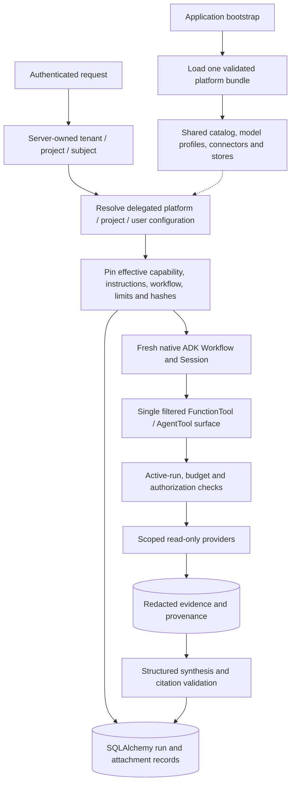
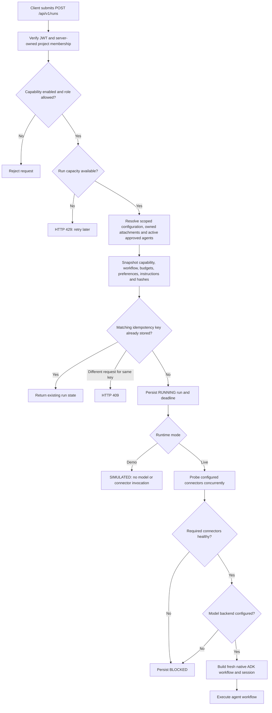
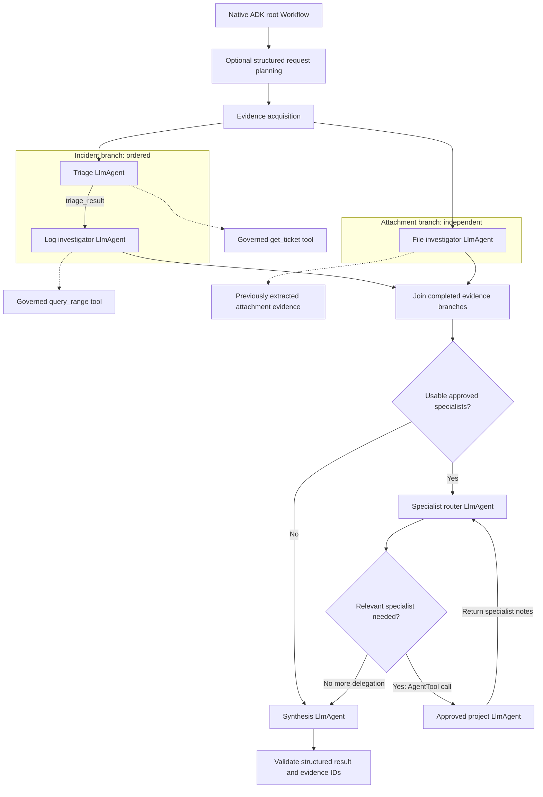
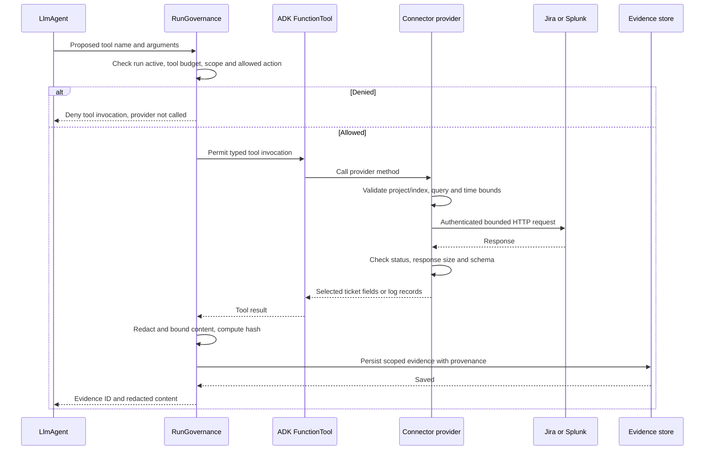
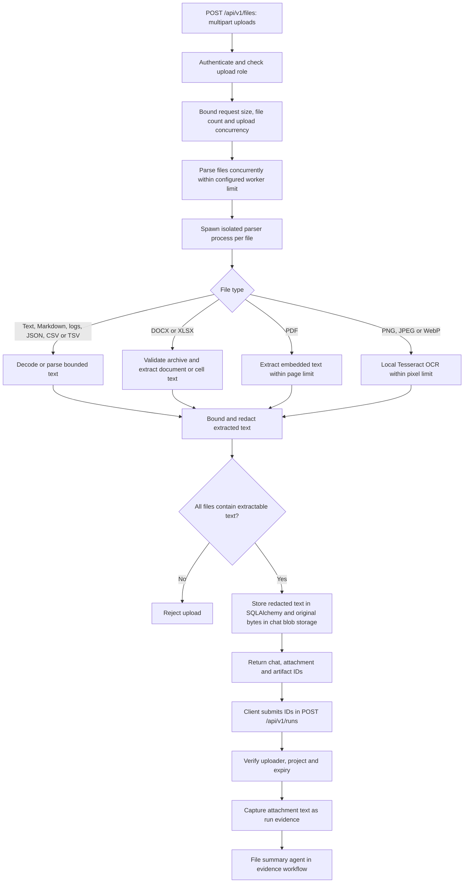
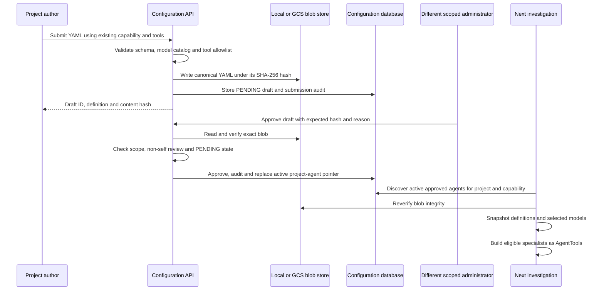
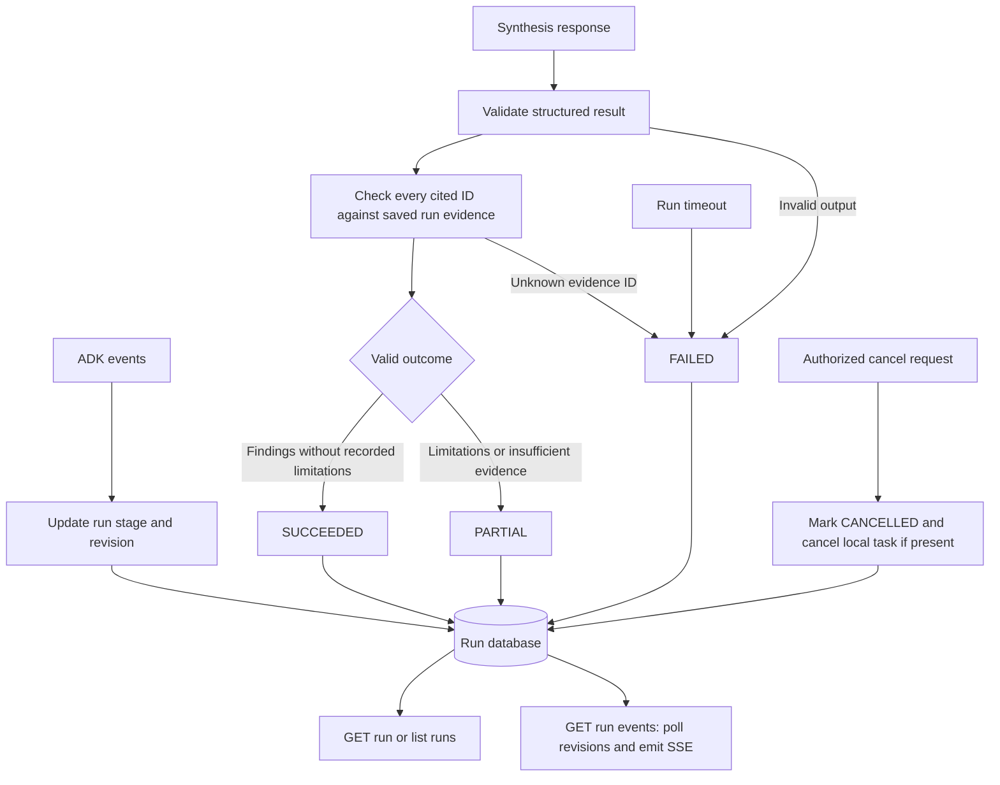

# Architecture and execution flows

This is the implementation reference for the RCA Analyzer harness. Read the [harness guide](harness.md) first for the component map and lifecycle diagrams; this guide explains the same system at package, configuration, and API-flow level.

Start with the [request flow](#1-request-and-preflight-flow), then follow the [agent workflow](#2-agent-workflow) and [connector call](#3-agent-to-connector-flow). Uploads happen separately through the [file flow](#4-file-processing-flow). Project specialists enter new runs through the [approval flow](#5-project-agent-approval-and-discovery). The [result flow](#6-results-progress-and-persistence) explains what the client receives.

These diagrams describe the current backend. A future UI calls the same APIs. Solid arrows show execution or data movement; dotted arrows show configuration or access to stored data. A connector is an API client, not an agent. A tool is the typed interface an agent can call.

## Configuration ownership and inheritance

The entire backend uses a platform/project/user ownership model. Google ADK is pinned to **2.9.0** in [pyproject.toml](../pyproject.toml). Native ADK owns agent/workflow execution; application code owns authentication, resolved permissions, bounded inputs and durable records.

For the selection algorithm and element-by-element precedence rules, see [harness selection rules](harness.md#selection-rules-by-harness-element). This table describes ownership; that section describes how the owned values become one run configuration.

| Area | Platform | Project | User |
|---|---|---|---|
| Identity, tenant/project scope and credentials | Deployment environment and server membership; immutable | Cannot replace | Cannot replace |
| Capability access | Enabled definitions, minimum role and action ceiling | May disable or narrow roles/actions | Cannot grant access |
| Connector access | Implemented Jira/Splunk providers, credentials and resource scope | May disable a provider; required-provider denial disables the capability | Cannot add providers or keys |
| Models | Stage model IDs, settings and profiles in `config/model_profiles.yaml` | Selects only explicitly delegated existing profiles per capability | Cannot select models |
| Execution budgets | Process concurrency and maximum per-run limits | May reduce model/tool calls, deadline, context and evidence limits | Cannot increase budgets |
| Workflow | Native graph, stage availability and mandatory synthesis | May disable planning, attachments, specialists or parallel evidence | Cannot alter graph |
| Stage prompts | Trusted defaults and immutable enforcement outside prompts | May replace delegated stage text; approved optimization is a baseline beneath explicit project text | Cannot replace stage prompts |
| Skills | Instruction defaults, action bindings and override policy | Permitted overrides and further restrictions | Only overrides explicitly permitted by both higher tiers |
| Presentation | Supported metadata formats and detail values | Team defaults and explicit user delegation | Permitted personal presentation/detail preferences |
| Custom agents | Data-only schema and implemented tool catalog | Durable non-self administrator approval and revocation | Cannot bypass approval |
| Persistence, input parsing and telemetry | Scoped SQLAlchemy/ADK stores, local bounded parsers, redaction and metadata export | Cannot disable safety/storage controls | Cannot disable safety/storage controls |

Later instruction/default values take priority only where delegated. Permissions intersect; limits take the smaller value; a lower tier cannot restore a denial. Preferences guide model instructions and are not permission grants. The native workflow is selected by server configuration; model planning contributes notes to synthesis, not authority to rewrite the graph.



## Code and content layout

```text
app/
  api/                 HTTP middleware, request schemas and focused route modules
  configuration/       Platform bundle, typed layers, resolution and agent approval
  capabilities/        Declarative capability registry and authorization
  identity/            RS256 verification and server-owned membership
  runtime/             Resource lifecycle, run snapshots, execution and governance
  agents/              Native ADK graph and stage factories
  tools/               One implemented action catalog and typed domain tools
  connectors/providers/ Network clients, credentials and local/GCS blobs
  persistence/         Async SQLAlchemy run, evidence and attachment store
  inputs/              Bounded local file parsing and OCR
  models/              Stage profiles and model call limiter
  policy/              Role/attribute checks, redaction and enforcement fingerprint
  optimization/        Isolated replay, MLflow evaluation and reviewed promotion
  observability/       Operational telemetry and metrics
blob_local/platform/
  config/              Platform operational defaults and model profiles
  capabilities/        Declarative capability contracts
  skills/              Default instruction assets
  layers/platform.yaml Explicit delegation policy
blob_local/projects/<tenant-key>/<project-key>/
  configuration/project.yaml  Administrator-managed project configuration
  configuration/users/        Explicitly delegated subject configuration
  artifacts/framework/objects/agents/       Immutable agent definitions
  artifacts/framework/uploads/              Content types and approval-stage views
  artifacts/framework/optimizations/objects/ Immutable datasets/evaluated bundles
  artifacts/chats/chat_<id>/uploads/         Raw originals and processed text
  artifacts/chats/chat_<id>/created/         Generated terminal run/evidence exports
  exports/                    Operator-managed exports; not automatic
```

The [ASGI application factory](../app/api/application.py) composes the HTTP boundary. [Application bootstrap](../app/runtime/bootstrap.py) validates and shares the [platform bundle](../app/configuration/platform.py), owns cleanup, and creates connector clients once per process. [Routes](../app/api/routes/) call services; they do not create infrastructure. [Layer resolution](../app/configuration/layers.py) never takes scope or filesystem paths from request bodies. [Investigation persistence](../app/persistence/store.py) owns durable run, evidence and attachment records.

[Project initialization and storage](../blob_local/projects/README.md) · [Project settings reference](../blob_local/platform/layers/projects/README.md) · [User example](../blob_local/platform/layers/users/README.md) · [Delegation policy](../blob_local/platform/layers/platform.yaml)

Scoped YAML requires operator review and restart; there is no new self-service settings API. File names are descriptive only; explicit scope fields select content. Duplicate scopes/keys, aliases, unknown fields, invalid references and unauthorized overrides fail startup. Native guardrails never become optional model tools. The retired plugin registry, disabled database/write tool wrappers, unused circuit breaker and unused mutation/incident/remediation scaffolds are removed.

## 1. Request and preflight flow



Authentication and input errors return HTTP errors before an investigation starts. Once a run exists, execution outcomes are persisted as run statuses. An unavailable optional connector needed by retained actions is omitted and recorded as a limitation; an unavailable required connector blocks execution. Preflight checks model backend configuration, not a successful live model inference.

`POST /runs` executes within its request and normally returns the completed result. It is not a durable job-queue submission. Another request can list runs, read progress, or cancel a running investigation.

**Implementation:** [authentication](../app/identity/auth.py), [API middleware](../app/api/application.py) and [run routes](../app/api/routes/runs.py), [`ExecutionRunner.execute` and `_execute_contract`](../app/runtime/runner.py), [capability resolver](../app/capabilities/resolver.py), [run contract](../app/runtime/run_contract.py).

## 2. Agent workflow

This is the fullest topology for `incident_triage` with healthy Jira and Splunk, attachments, and an approved specialist. The factory omits branches that resolved project controls, capability permissions, enabled stages, inputs or available connectors do not support.



Jira triage precedes log investigation so the log agent can use `triage_result`. File summarization can run alongside the incident branch because its text is already extracted. The join waits for all included evidence branches before routing and synthesis. When the platform or project sets `parallel_evidence: false`, the evidence branches run sequentially. With one branch, no parallel join is needed.

The router can choose relevant specialists from the approved `AgentTool` list; approval does not mean every specialist runs on every request. Specialists can use only their declared existing tools, within the main run's capability permissions and shared budgets. Their results are notes, not automatically authoritative evidence.

| Stage | Receives | Produces | Default balanced profile |
|---|---|---|---|
| Planning | Request and resolved preferences | Typed `request_plan` notes | Selected triage model; no tools |
| Triage | Request, incident ID, selected skill instructions; Jira through a tool | `triage_result` | `triage`: Flash Lite, low thinking |
| Logs | Request, triage notes, configured lookback; Splunk through a tool | `logs_result` | `logs`: Flash, low thinking |
| File summary | Request and recorded attachment text | `file_result` | `extraction`: Flash Lite, minimal thinking |
| Specialist router | Request and captured evidence; approved specialist descriptions | `specialist_result` | Uses the selected profile's triage model |
| Project specialist | Request, captured evidence, approved instructions and tools | Return value to the router | Approved `model_profile` and `stage_model` |
| Synthesis | Stage notes and authoritative captured evidence | Structured findings or insufficient evidence | `synthesis`: Flash, high thinking |

Exact model IDs, thinking settings, output limits and profile mappings are in [model_profiles.yaml](../blob_local/platform/config/model_profiles.yaml). The shared `max_parallel_models` semaphore limits simultaneous model calls across runs in one process. The resolved `max_llm_calls` and the smaller of profile/project tool limits bound each run, including specialist work. These limits do not make dependent stages parallel.

**Implementation:** [`build_root_agent`](../app/agents/root.py), [triage factory](../app/agents/triage.py), [log/file factories](../app/agents/workflows/evidence_acquisition.py), [synthesis factory](../app/agents/rca_synthesizer.py), [model limiter](../app/models/bounded.py), [prompts](../blob_local/platform/config/prompts.yaml).

### How capability selection changes the graph

| Capability | Required connector | Optional connector | Included investigation stages |
|---|---|---|---|
| `incident_triage` | `itsm` | `log_search` | Jira triage, then logs if usable; file summary if supplied and enabled |
| `log_correlation` | `log_search` | `itsm` | Logs; file summary if supplied and enabled. Jira is not attached because this capability does not allow `itsm.get_ticket` |
| `database_rca` | — | — | Disabled; no database investigation runs |

Every enabled capability still reaches synthesis, with the optional approved-specialist router before it. Uploading a file does not waive the selected capability's required-connector checks. See [capability manifests](../blob_local/platform/capabilities/).

## 3. Agent-to-connector flow



The diagram describes the ADK before/after-tool callbacks, not a second network layer. Domain tools contain no HTTP or credential handling. Providers own credentials, HTTPS clients, connection pools, request bounds and external resource scoping. Raw provider responses pass through governance before becoming model-visible tool results.

Provider failures go through `on_tool_error`: the model receives a sanitized unavailable-source message, the run records a limitation, and synthesis may continue. Policy denials fail closed. A later model, timeout or validation failure can still fail the investigation.

| Agent-facing function | Capability action | Provider method | External operation |
|---|---|---|---|
| `get_ticket(ticket_id)` | `itsm.get_ticket` | `JiraConnector.get_ticket` | Read issue from the configured Jira project |
| `query_range(query, time_range)` | `log_search.query_range` | `SplunkConnector.query_logs` | Read bounded search results from the configured Splunk index |

**Implementation:** [governance callbacks](../app/runtime/governance.py), [ITSM tools](../app/tools/domain/itsm.py), [log tools](../app/tools/domain/logs.py), [Jira provider](../app/connectors/providers/jira.py), [Splunk provider](../app/connectors/providers/splunk.py), [evidence store](../app/persistence/store.py). See [connector lifecycle and health flows](connector-onboarding.md).

## 4. File-processing flow



Parsing is local, occurs before investigation, and does not call an LLM. Each parser has a hard timeout and a killable child process. The upload stores redacted extracted text and metadata in SQLAlchemy, plus the exact original bytes under the project’s chat artifact prefix. Only the authenticated chat owner can list or download originals; raw bytes never enter the model context. The later file agent summarizes the stored text using its configured model.

Scanned PDFs without embedded text are rejected; the image OCR path does not automatically rasterize PDFs. Image support extracts text, not visual scene meaning. XLSX formulas are read as text rather than executed or recalculated. File warnings are carried into run limitations.

**Implementation:** [upload route](../app/api/routes/files.py), [`parse_files` and `parse_file`](../app/inputs/files.py), [file limits](../blob_local/platform/config/file_processing.yaml), [`save_attachment` and `get_attachments`](../app/persistence/store.py), [chat artifact catalog](../app/persistence/chat_artifacts.py), [chat routes](../app/api/routes/chats.py).

The [blob storage guide](blob-storage.md) defines framework approval stages, upload processing stages, generated outputs and recovery.

## 5. Project agent approval and discovery



Only `PLATFORM_ADMIN` or `PROJECT_OWNER` can review, within the deployment's tenant/project scope. Authors cannot review their own drafts. Rejecting a draft never activates it. A new approval replaces the active version for that agent ID; previous approved records remain history. Revocation removes that version from future discovery. Already-running investigations retain their pinned snapshot.

### Approved project specialists

```yaml
id: payments_specialist
version: 1.0.0
name: Payments specialist
description: Reviews payment timeout evidence when relevant
instruction: Summarize payment failure evidence and cite recorded evidence IDs.
capability: incident_triage
model_profile: balanced-investigation
stage_model: logs
tools: [log_search.query_range]
```

`stage_model` selects a logical stage in the approved profile or an explicitly named deployment stage. YAML cannot import Python or introduce new network tools. The local/GCS blob provider stores configuration; it is not an investigation tool exposed to the model.

**Implementation:** [configuration endpoints](../app/api/routes/agents.py), [definition schema](../app/configuration/models.py), [approval and active-version service](../app/configuration/service.py), [blob provider](../app/connectors/providers/blob.py), [specialist assembly](../app/agents/root.py). See [lifecycle and endpoints](skill-lifecycle.md).

## 6. Results, progress and persistence



SSE exposes stored progress revisions; it is not a raw token stream. Clients can obtain a run ID from the run listing while a request is active. Terminal records cannot be overwritten by a late agent result. After a process interruption, runs are not resumed; a stale running record becomes failed when read after its deadline.

| Store or export | What it contains | Purpose |
|---|---|---|
| Run database | Immutable contract snapshot, status, stage, result and revisions | Client results, idempotency and progress |
| Evidence records | Redacted content, source/query provenance, content hash and evidence ID | Resolve and validate citations |
| Attachment records | Redacted extracted text, source hash, owner and expiry | Inputs for subsequent runs |
| Native ADK session database | Session state and execution events | ADK conversation/workflow persistence |
| Configuration database and blobs | Drafts, active pointers, review audit and canonical YAML | Approved specialist lifecycle |
| Optional OTLP export | Allowlisted operational metadata and usage | Tracing to a collector or MLflow |

Citation validation checks that IDs exist in the run's evidence; it does not independently prove causal correctness. Metadata-only telemetry is separate from the application/session databases. Retention is an explicit operator action, described in [operations](operations.md).

**Implementation:** [event consumption and final validation](../app/runtime/runner.py), [run/evidence persistence](../app/persistence/store.py), [SSE and cancellation routes](../app/api/routes/runs.py), [telemetry filtering](../app/observability/otel.py).

## Prompt and skill improvement

Native MLflow optimization compares an instruction candidate with the active baseline on a versioned benchmark. A separate administrator must approve a passing comparison before its immutable blob bundle becomes active for new investigations. See [the optimization workflow](optimization.md) for storage, evaluation gates, API examples and MLflow inspection.
