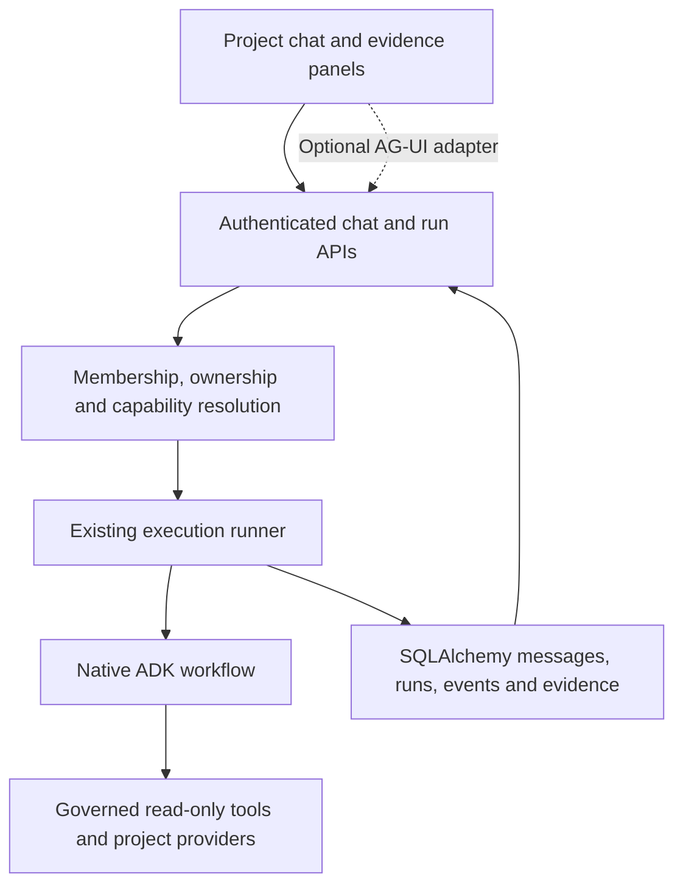
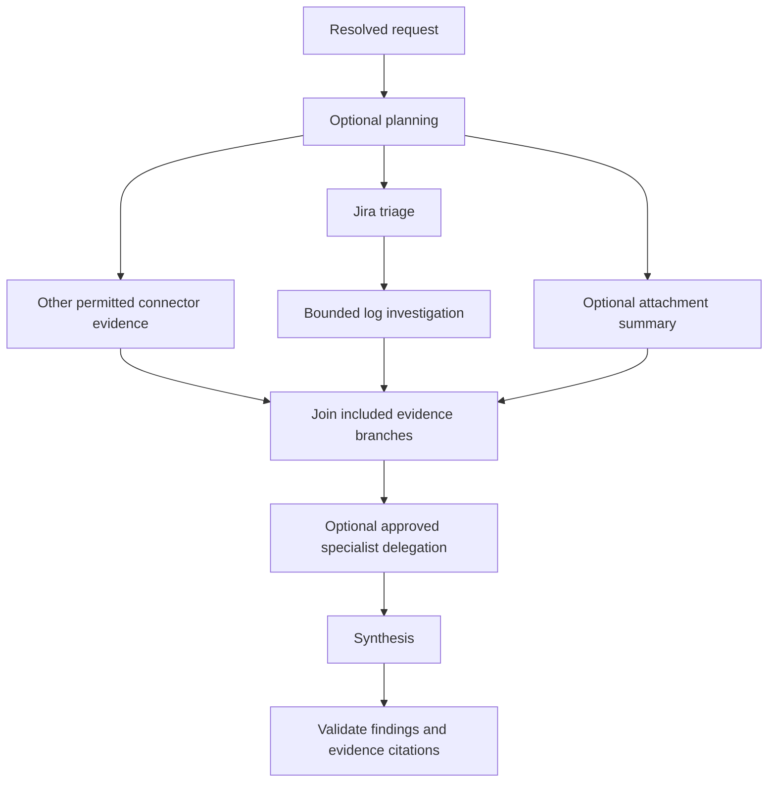
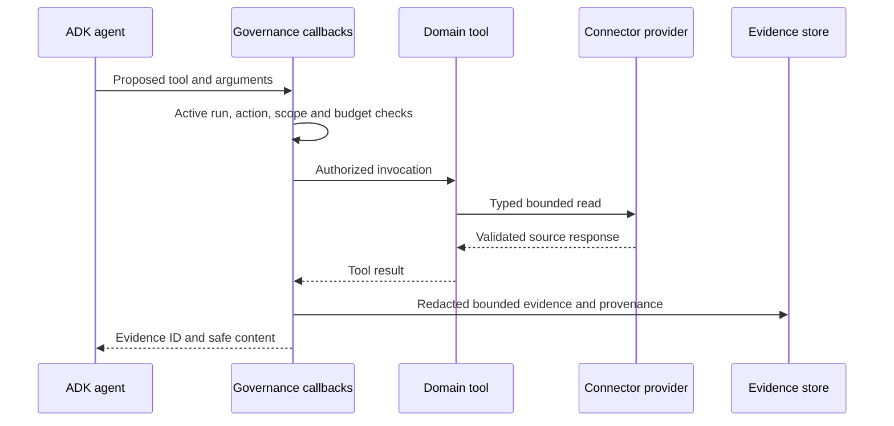
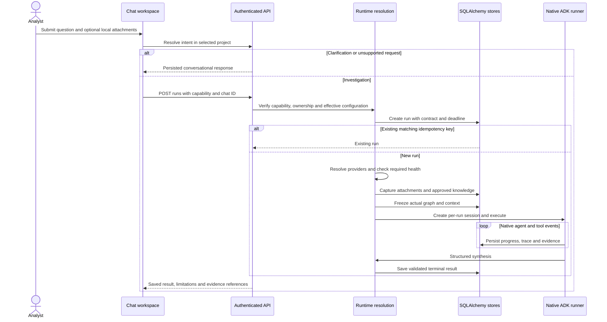

# Architecture and data flow

The request path is **FastAPI → authenticated project scope → capability and configuration resolution → SQLAlchemy run/session persistence → native ADK workflow**. Application code enforces access, budgets and storage; ADK executes agents. A prompt cannot grant permission. Sources: [application](../app/api/application.py), [runner](../app/runtime/runner.py), [root graph](../app/agents/root.py).

## Contents

- [Chat integration with the existing framework](#chat-integration-with-the-existing-framework)

- [System view](#system-view)
- [Request to answer](#request-to-answer)
- [Agent workflow](#agent-workflow)
- [Tool to evidence](#tool-to-evidence)
- [Files, knowledge and conversation context](#files-knowledge-and-conversation-context)
- [Lifecycle and failure boundaries](#lifecycle-and-failure-boundaries)
- [Detailed execution walkthrough](#detailed-execution-walkthrough)
- [Streaming, reconnection and cancellation](#streaming-reconnection-and-cancellation)
- [Detailed handbook reading paths](#detailed-handbook-reading-paths)

## Chat integration with the existing framework

**Implemented transport; optional adapter remains a proposal.** The application uses FastAPI authentication → server-resolved project scope/settings → capability resolution → SQLAlchemy run/session persistence → native ADK root workflow. CopilotKit may supply React interactions and AG-UI transport after compatibility verification; it does not replace authorization, the execution runner or storage.

Anchors: [application](../app/api/application.py), [identity](../app/identity/auth.py), [chat routes](../app/api/routes/chats.py), [run routes](../app/api/routes/runs.py), [runner](../app/runtime/runner.py), [ADK root](../app/agents/root.py), [governance](../app/runtime/governance.py).

| Reference | Intended use | Boundary |
| --- | --- | --- |
| [Pi harness](https://github.com/earendil-works/pi) | Visible agent/tool activity and focused interaction loop | Reference only; no parallel execution runtime, shell toolset or provider layer. |
| [OpenWorker](https://github.com/andrewyng/openworker) | Outcome-oriented conversations, deliverables and auditability | Reference only; do not import desktop execution, source writes, autonomy rules or scheduling. |
| [CopilotKit](https://docs.copilotkit.ai/) | Candidate chat/headless UI and typed component rendering | Preserve application styling, safe rendering and SQLAlchemy history. |
| [CopilotKit ADK](https://docs.copilotkit.ai/google-adk) | Candidate AG-UI bridge | Verify pinned package compatibility against this governed runner; examples are not deployment evidence. |

The adapter must satisfy these requirements:

- Map transport thread/run IDs to authenticated conversation/run IDs server-side. Client identifiers cannot select another owner's conversation or arbitrary native session.
- Reuse admission, idempotency, immutable run contracts and cancellation. One submission must not launch both an adapter agent and the existing runner.
- Keep persisted messages, evidence and run state authoritative. Shared UI state contains allowed presentation context only; revalidate resource IDs. Browser state cannot grant roles, tenant authority or connector access.
- Map real events with stable IDs, ordering, deduplication and terminal outcomes. Progress revisions and trace sequences are separate cursors; preserve truncation. Snapshot progress is not token streaming; emit text deltas only when supplied by the backend.
- Render allowlisted typed evidence/result/activity components. Agent text cannot inject HTML/JavaScript or directly invoke protected connectors from the browser.
- Scope clarification responses to the requesting conversation/turn and validate them before execution. Human input cannot bypass independent configuration approval or enable unsupported source writes.
- Bound history/context and preserve provenance; never silently copy context between projects. Reconnect reads saved state rather than starting another run.

Research checked on 2026-09-16: the [official CopilotKit ADK overview](https://docs.copilotkit.ai/google-adk) describes AG-UI state and activity integration, but its linked ADK quickstart returned HTTP 404. Retain the existing persisted SSE transport until an adapter can demonstrate lower complexity and preserve the authorization, cancellation and persistence contracts above. [ADK sessions](https://adk.dev/sessions/session/) document persistent conversation/event storage; that capability does not automatically resume this application’s interactive investigations. Improvement jobs have their own scoped database leases.

The runner preserves explicit connector selectors in its immutable request, rejects incompatible historical context, and checks an existing idempotent result before rejecting a retry for capacity. Active stream replays use the configured polling interval and terminal delivery waits for recorded cleanup events. Sources: [runner](../app/runtime/runner.py), [conversation context](../app/persistence/store.py), [submission stream](../app/api/routes/runs.py), [runtime regressions](../tests/harness/test_run_controls.py), [stream regressions](../tests/unit/test_run_events.py).

Chat and Harness Studio expose saved instance/environment choices for the selected capability. Required ambiguous sources need an explicit choice; optional sources may remain under automatic server resolution. The client sends only opaque record selectors, and the runner still validates current project membership, environment bindings, credential references and allowed actions. Chat also retrieves older conversations, messages and runs through bounded API pages with stale-response guards. Sources: [source selectors](../frontend/src/components/RunConnectorSelectors.tsx), [chat workspace](../frontend/src/pages/Chat.tsx), [chat service](../frontend/src/services/chat.ts), [Harness Studio](../frontend/src/features/harness-studio/playground/Playground.tsx).

The current submission stream owns in-process execution and cancels unfinished work during cleanup. Preserve that contract or explicitly redesign it before claiming continued execution after disconnect. Durable queueing, scheduling and restart recovery remain outside this release. See [streaming lifecycle](#streaming-reconnection-and-cancellation) and [delivery gates](development.md#chat-and-metrics-delivery-plan).

## System view

```mermaid
flowchart LR
  UI[React workspace] --> API[FastAPI boundary]
  API --> AUTH[Verified identity and project membership]
  AUTH --> CFG[Resolve capability and approved configuration]
  CFG --> RUN[Run contract and execution runner]
  RUN --> ADK[Native ADK workflow]
  ADK --> GOV[Tool governance and budgets]
  GOV --> TOOLS[Typed domain tools]
  TOOLS --> PROVIDERS[Scoped read-only providers]
  PROVIDERS --> SOURCES[Authorized external sources]
  GOV --> DB[(PostgreSQL records and evidence)]
  RUN --> DB
  API --> FILES[Bounded local extraction]
  FILES --> DB
  FILES --> BLOBS[(Local or GCS blobs)]
  DB --> RESULT[Validated findings and citations]
  RESULT --> UI
  click UI "project.md#project-page-map" "Open detailed explanation"
  click API "security.md#request-authorization" "Open detailed explanation"
  click AUTH "security.md#roles-and-project-membership" "Open detailed explanation"
  click CFG "configuration.md#scope-and-precedence" "Open detailed explanation"
  click RUN "harness.md#from-configuration-to-execution" "Open detailed explanation"
  click ADK "harness.md#default-investigation-graph" "Open detailed explanation"
  click GOV "harness.md#tool-and-model-boundaries" "Open detailed explanation"
  click TOOLS "connectors.md#provider-specific-forms" "Open detailed explanation"
  click PROVIDERS "connectors.md#runtime-resolution" "Open detailed explanation"
  click SOURCES "connectors.md#provider-specific-forms" "Open detailed explanation"
  click DB "data-model.md#run-and-evidence-records" "Open detailed explanation"
  click FILES "security.md#files-and-untrusted-content" "Open detailed explanation"
  click BLOBS "data-model.md#storage-lifecycles" "Open detailed explanation"
  click RESULT "architecture.md#4-synthesis-and-terminal-state" "Open detailed explanation"
```

The arrows show logical responsibility and data movement, not separate services. Providers are the network and credential boundary. Database and blob storage are complementary stores, not interchangeable backups. See [configuration and governance](configuration.md).

## Request to answer

1. **Authenticate before processing uploads or runs.** Verify bearer identity or browser session and resolve active project membership. The project header selects context only. [Authentication](../app/identity/auth.py).
2. **Resolve intent when using Chat.** The chat route can persist a clarification or unsupported-request message without launching tools. Direct run requests use their validated capability contract. [Intent service](../app/runtime/intent.py), [chat routes](../app/api/routes/chats.py).
3. **Resolve and freeze the run.** Validate capability access, owned attachments, approved definitions, model profiles, permitted actions and execution limits. Persist the run contract and configuration provenance; reject conflicting idempotency reuse. [Runner](../app/runtime/runner.py), [run contract](../app/runtime/run_contract.py).
4. **Preflight.** Demo execution is explicitly simulated. Live execution checks configured model access and required connector health. Missing required sources block the run; optional-source limitations remain visible. [Runner](../app/runtime/runner.py).
5. **Execute.** Build a fresh native workflow and session using the resolved graph. Share the run's budgets across model calls, tools and specialists. [Root agent](../app/agents/root.py), [model wrapper](../app/models/bounded.py).
6. **Validate and persist.** Capture redacted evidence with IDs and provenance, validate structured findings and citations, and persist terminal results and progress. A failed or insufficient-evidence result must not appear as a successful diagnosis. [Governance](../app/runtime/governance.py), [store](../app/persistence/store.py), [run events](../app/persistence/run_events.py).

`POST /api/v1/runs` executes within the request. Run history, progress and cancellation use persisted state, but persistence does not imply automatic recovery after process failure. Source: [run routes](../app/api/routes/runs.py).

## Agent workflow

The diagram shows the fullest default incident topology. Capability actions, available connectors, uploaded files and resolved stage settings determine which branches are included. An approved Harness Studio bundle can supply a validated data-only graph. Sources: [root factory](../app/agents/root.py), [workflow compiler](../app/configuration/workflow.py), [bundle compiler](../app/configuration/harness_bundles.py).

Triage precedes logs so incident context can inform log retrieval. Attachment text is already extracted and can be summarized independently. Disabling parallel evidence makes branches sequential. Approved specialists become `AgentTool` entries; the router chooses whether to invoke them. Their notes do not replace authoritative captured evidence. The run shares model-call, tool-call, context, evidence and deadline limits. Sources: [root](../app/agents/root.py), [evidence stages](../app/agents/workflows/evidence_acquisition.py), [governance](../app/runtime/governance.py).

## Tool to evidence

Denied operations do not reach the provider. Provider errors become sanitized limitations; policy failures remain fail-closed. Network credentials never belong in model instructions or frontend payloads. Sources: [governance](../app/runtime/governance.py), [tool catalog](../app/tools/catalog.py), [Jira](../app/connectors/providers/jira.py), [Splunk](../app/connectors/providers/splunk.py).

## Files, knowledge and conversation context

| Input | Processing and ownership | Use in a run |
| --- | --- | --- |
| Chat upload | Authenticate → bound count/size → isolated local parser → redact extracted text → persist metadata and original bytes | Verify chat/uploader/project/expiry; capture bounded text as run evidence |
| Project knowledge | Create or upload draft → inspect revision → independent hash-bound review | Retrieve eligible approved excerpts within context/evidence limits; treat as reference guidance |
| Conversation history | Persist owned messages and bounded summaries | Interpret follow-ups; retrieve current evidence again before making incident claims |

Sources: [file route](../app/api/routes/files.py), [parsers](../app/inputs/files.py), [chat artifacts](../app/persistence/chat_artifacts.py), [knowledge](../app/configuration/knowledge.py), [runner](../app/runtime/runner.py).

Raw files never become executable instructions. Image support is local OCR; scanned PDFs without extractable text are not automatically rasterized for OCR. Spreadsheet formulas are not executed. Original downloads have their own ownership checks and retention; they are distinct from redacted previews and evidence excerpts. Sources: [parsers](../app/inputs/files.py), [artifact service](../app/persistence/chat_artifacts.py).

## Lifecycle and failure boundaries

Bootstrap loads validated deployment resources; project runtime management isolates project configuration and clients. Each run pins its effective contract, so editing configuration does not rewrite historical traces. Capacity rejection, preflight blocking, cancellation, deadline expiry and execution errors are separate from diagnostic uncertainty. Interactive investigations have no automatic restart recovery. Improvement jobs use a separate scoped leased queue; retention remains explicit. Sources: [bootstrap](../app/runtime/bootstrap.py), [project runtime](../app/runtime/projects.py), [runner](../app/runtime/runner.py), [cleanup](../scripts/cleanup.py).

For field-level contracts and earlier lifecycle diagrams, see [reference architecture](reference/runtime-and-extension-contracts.md#architecture), [harness lifecycle](reference/runtime-and-extension-contracts.md#harness), and [runtime context](reference/runtime-and-extension-contracts.md#runtime-context). These retained details must be checked against current source before changing behavior.

## Detailed execution walkthrough

Use this walkthrough to trace a real investigation from a browser action to a saved result. The sequence is implemented by [run routes](../app/api/routes/runs.py) and [`ExecutionRunner.execute`](../app/runtime/runner.py). A chat is the conversation container; a run is one bounded investigation; an ADK session belongs to that run.

### 1. Admission and ownership

Before any model work, the runner verifies that the principal's tenant and project match its runtime. It resolves capability authorization without health probing, computes inherited settings, rejects disallowed attachments and excessive prompt length, and obtains a bounded execution slot. Attachments must be accessible and belong to the requested chat; a chat inferred from attachments must pass the same ownership check. Admission failures need not create a run record.

The API maps denied access to `403`, capacity exhaustion to `429` with a retry hint, and configuration/attachment/idempotency conflicts to `409` for ordinary run requests. Streaming start failures use an `error` event once the stream has begun. Do not interpret every start failure as a model failure. Sources: [runner admission](../app/runtime/runner.py), [HTTP and streaming behavior](../app/api/routes/runs.py).

### 2. Resolve the contract

The runner selects eligible approved specialists, effective optimization content, capability skills, stage models and prompts. The effective tool limit cannot exceed the selected profile's limit. It selects approved knowledge within remaining evidence and context capacity, then records configuration provenance.

| Snapshot field group | Why it is retained |
| --- | --- |
| Capability/version/hash and policy hash | Identify the authorized investigation contract |
| Skill, agent and attachment hashes | Identify the exact content selected |
| Stage models, prompts and workflow settings | Explain the agent behavior used for this run |
| Allowed actions, disabled connectors and environments | Explain the resolved permission and execution context |
| Limits and runtime controls | Explain truncation, timeouts and resource ceilings |
| Knowledge revisions and pricing snapshot | Preserve reference selection and cost-estimation inputs |
| Resolved graph and bounded chat history | Explain the actual execution topology and follow-up context |

The initial run is persisted before preflight. After preflight, the runtime adds usable connector controls, selected history and the actual graph, then persists the final snapshot before the first native ADK event. This is a staged freeze; it is not one atomic snapshot of all external systems. Sources: [contract model](../app/runtime/run_contract.py), [execution sequence](../app/runtime/runner.py).

### 3. Preflight and evidence acquisition

Demo mode terminates as `SIMULATED` without invoking live connectors or a model. Live mode resolves runtime providers, checks required connector health and checks model-backend configuration. A missing required connector blocks execution; an unavailable optional source is recorded as a limitation. Uploaded text and selected knowledge enter the evidence store before the native workflow starts.

During execution, governance checks each proposed tool operation, shares budgets across branches, and records safe evidence. Evidence persistence precedes a successful tool-completion event. A source response is not automatically an accepted finding: synthesis must cite evidence IDs captured for the current run. Sources: [runner preflight](../app/runtime/runner.py), [tool governance](../app/runtime/governance.py).

### 4. Synthesis and terminal state

The runtime reads the final structured response from `rca_synthesizer`, validates its schema, verifies that cited IDs exist in the run's evidence, and rejects findings without recorded evidence. It redacts the final result and incorporates connector failures and truncation into uncertainty.

| Saved status | Meaning and next action |
| --- | --- |
| `SIMULATED` | No live investigation occurred; configure live dependencies before seeking a diagnosis |
| `BLOCKED` | Preflight or execution policy prevented completion; inspect the saved reason and correct configuration/access |
| `FAILED` | Timeout, context overflow, invalid synthesis or another execution failure; inspect stage and trace before retrying |
| `CANCELLED` | Execution was cancelled; inspect retained records before starting another run |
| `PARTIAL` | A structured answer exists with limitations or insufficient evidence; resolve missing evidence before relying on a cause |
| `SUCCEEDED` | Structured synthesis passed runtime validation without recorded limitations; assess the cited evidence and uncertainty |

`SUCCEEDED` is an execution result, not proof that a proposed root cause is objectively correct. Source: [terminal result validation](../app/runtime/runner.py).

## Streaming, reconnection and cancellation

`POST /api/v1/runs?stream=true` emits `run`, `progress`, `trace` and `complete` events from persisted state. The stream owns an in-process execution task; its cleanup cancels an unfinished task. It is not a durable job submission interface.

For an existing run, `GET /api/v1/runs/{run_id}` retrieves state, `/events` streams progress revisions, `/trace` returns the graph and recorded events, `/trace/events` streams trace sequences, and `/evidence` returns captured evidence. Progress revisions and trace sequences are separate cursors. Their streaming endpoints accept `Last-Event-ID`; clients must use the cursor for the corresponding stream. A trace response can explicitly indicate truncation.

Cancellation uses `POST /api/v1/runs/{run_id}/cancel` with server-side role checks. The runner tracks local active tasks, finalizes pending tools and closes run-specific connector clients. A database record cannot restart a task lost with the process. Sources: [run API](../app/api/routes/runs.py), [runner cleanup](../app/runtime/runner.py).

## Detailed handbook reading paths

- System view: [workspace](project.md#project-page-map) → [identity](security.md#request-authorization) → [configuration](configuration.md) → [ADK](harness.md) → [data](data-model.md).
- Agent workflow: [stages](harness.md#stage-contracts) → [native compiler](harness.md#native-graph-compilation) → [tool boundaries](harness.md#tool-and-model-boundaries).
- Tool sequence: [actions and providers](connectors.md#provider-specific-forms) → [governance](harness.md#tool-and-model-boundaries) → [evidence records](data-model.md#run-and-evidence-records).

## OKF integration boundary

The [Open Knowledge Format implementation](knowledge.md#position-in-the-rca-ecosystem) places bounded local knowledge import/export around the existing reviewed library. SQLAlchemy, immutable envelopes, local approval and ADK run snapshots remain authoritative. Metadata freshness and lifecycle policy are resolved database-first before retrieval. Imported trust claims never authorize execution. Sources: [OKF service](../app/configuration/knowledge_okf.py), [eligibility and format](../app/configuration/okf.py), [knowledge retrieval](../app/configuration/knowledge.py).

## Scheduled knowledge maintenance

Project-configured schedules dispatch `capture_knowledge` and `track_closures` jobs through the existing improvement worker. Each job rechecks membership, resolves saved source scope and processes bounded pages with a persistent continuation cursor. Source-version receipts deduplicate retries; source-state fences prevent stale reads from reviving withdrawn guidance. Changed content becomes a reviewable draft. Only independently approved, currently eligible content is selected by the normal harness.

Closure monitoring preserves the original live investigation and its Jira source identity, polls open tickets beyond the initial discovery window, and uses a bounded native ADK structured-output call to compare recorded closure facts. Immutable assessments include model/configuration hashes, usage and explicit insufficient-evidence status. Meaningful deviations create internal project alerts; human verification and independent activation remain the gates for subsequent improvements. Sources: [capture](../app/optimization/knowledge_capture.py), [closure comparisons](../app/optimization/closure_tracking.py), [source admission](../app/configuration/knowledge.py), [worker](../app/optimization/improvement.py).
