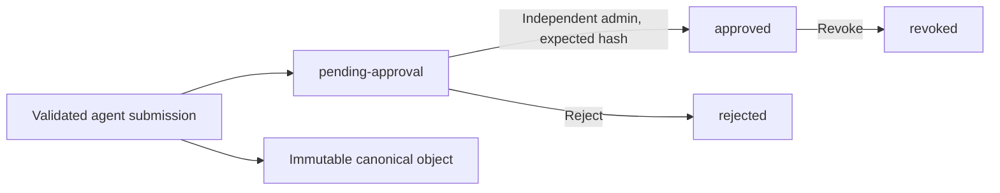

# Blob storage: structure, stages and ownership

Each project has one **framework** area and a separate **chats** area. Framework uploads are grouped by content type and approval stage. Inside each chat, uploaded material and generated material have separate roots. The same relative keys work in local storage and GCS.

The [project initializer](../scripts/init_project.py) creates the local skeleton without overwriting existing data. [project_1](../blob_local/projects/project_1/README.md) and [project_2](../blob_local/projects/project_2/README.md) contain reference folders only, including a nonfunctional `chat_example`. Real scope IDs and chat IDs are assigned separately. The directory vocabulary is defined in [artifact_layout.py](../app/connectors/providers/artifact_layout.py).

## Complete layout

```text
blob_local/
├── platform/                              Shared, deployed framework defaults
│   ├── config/                            Model profiles, prompts, limits, providers
│   ├── capabilities/                      Data-only capability contracts
│   ├── skills/                            Deployed skill instructions
│   └── layers/platform.yaml               Delegation policy
└── projects/
    ├── project_1/                         Reference only
    ├── project_2/                         Reference only
    └── <tenant-key>/<project-key>/
        ├── configuration/                 Active, operator-deployed settings
        │   ├── project.yaml
        │   └── users/<subject-key>.yaml
        ├── artifacts/
        │   ├── framework/
        │   │   ├── uploads/               ONE intake area for framework content
        │   │   │   ├── agents/
        │   │   │   ├── skills/
        │   │   │   ├── prompts/
        │   │   │   ├── capabilities/
        │   │   │   ├── configuration/
        │   │   │   │   # Each type above has:
        │   │   │   │   ├── draft/
        │   │   │   │   ├── pending-approval/
        │   │   │   │   ├── approved/
        │   │   │   │   ├── rejected/
        │   │   │   │   ├── revoked/
        │   │   │   │   └── archived/
        │   │   │   └── files/             Framework reference files, reserved
        │   │   │       ├── raw/
        │   │   │       ├── processed/
        │   │   │       ├── rejected/
        │   │   │       └── archived/
        │   │   ├── objects/
        │   │   │   └── agents/<sha256>.yaml  Immutable canonical versions
        │   │   └── optimizations/
        │   │       └── objects/<sha256>.yaml Immutable JSON datasets/report bundles
        │   └── chats/
        │       └── chat_<id>/
        │           ├── uploads/           Files supplied by the chat owner
        │           │   ├── raw/
        │           │   │   └── artifact_<id>/<sha256>.bin
        │           │   └── processed/
        │           │       └── artifact_<id>/<sha256>.json
        │           └── created/           Files produced from run records
        │               ├── completed/
        │               ├── failed/
        │               └── simulated/
        │                   # Each outcome contains run_<id>/<sha256>.json
        └── exports/                       Operator-managed external exports
```

The content-type directories each contain their own stage directories; the indented comment above abbreviates that repetition. An implemented agent stage file is `framework/uploads/agents/<stage>/draft_<id>/<sha256>.yaml`. Names and titles supplied by users never form storage paths. Tenant/project keys use a readable prefix and the full SHA-256 of the identity. [Path construction](../app/connectors/providers/project_storage.py), [artifact storage](../app/persistence/chat_artifacts.py).

## Framework approval stages

| Stage | Meaning | Current implementation |
|---|---|---|
| `draft` | Work that has not been submitted for review | Reserved; there is no draft-save API |
| `pending-approval` | Validated submission awaiting an independent review | Agent YAML submissions enter here |
| `approved` | Exact content version approved by an administrator | Agent review moves its stage copy here |
| `rejected` | Submitted version rejected by a reviewer | Agent rejection moves its stage copy here |
| `revoked` | Previously approved version withdrawn | Agent revocation moves its stage copy here |
| `archived` | Explicitly retired historical content | Reserved; no archive transition API |

These stage folders exist for agents, skills, prompts, capabilities and configuration. **Only agents currently have an upload/review API and automatic stage movement.** Skills, prompts, capabilities and configuration remain deployed platform/project content, governed by existing configuration validation and restart requirements. Their staged upload folders are reserved and are not read by the runtime. Framework `files` is also reserved; `/api/v1/files` is exclusively for chat uploads. [Agent lifecycle](skill-lifecycle.md), [configuration service](../app/configuration/service.py), [platform loading](../app/configuration/platform.py).



Movement is **copy, verify SHA-256, then delete the previous stage copy**. Canonical content remains in `framework/objects/agents` for audit and pinned run snapshots. Each submission has its own `draft_id`, so reviewing identical content twice does not move another submission's files. SQLAlchemy review records and active pointers decide which version runs; putting a file in `approved` manually never activates it. Previous approved versions can remain in `approved` while a newer version is selected by the active pointer. [Stage provider](../app/connectors/providers/framework_stages.py), [review, revocation and active selection](../app/configuration/service.py).

Database commit and object movement are not one distributed transaction. After a durable review, the service synchronizes the stage view while locking its record. If storage fails, the review remains durable, execution still follows the database, and the error is logged without blob contents. Use the explicit repair command below to finish interrupted moves. During interruption, duplicate or stale stage copies may exist; folders are a review view, not authorization. There is no background synchronizer.

Optimization datasets and reports remain immutable objects under `framework/optimizations/objects`. Their evaluation, review and activation state stays in SQLAlchemy; there are no optimization stage-copy folders or automatic activation from files. The `.yaml` suffix is retained for compatibility with the existing blob provider even though these payloads are JSON. [Optimization implementation](../app/optimization/service.py).

## Chat upload and generated stages

| Branch | Contents | Written when | Retention |
|---|---|---|---|
| `uploads/raw` | Byte-for-byte accepted original | Upload passes existing parsing checks | Fixed at upload using `RCA_RETENTION_DAYS` (default 90 days) |
| `uploads/processed` | Redacted extracted text, source hash, filename/type and parser warnings as JSON | Original storage succeeds; ready status follows verification of both objects | Fixed at upload using `RCA_ATTACHMENT_TTL_SECONDS` (default one day) |
| `created/completed` | Final run result and redacted evidence JSON | `SUCCEEDED` or `PARTIAL` run completes | Follows terminal run retention |
| `created/failed` | Terminal run status and any recorded redacted evidence | `FAILED`, `BLOCKED` or `CANCELLED` run finishes | Follows terminal run retention |
| `created/simulated` | Explicitly simulated run JSON | Demo run finishes | Follows terminal run retention |

Processing creates a **derivative** rather than deleting or relocating the original: both raw and processed content have a purpose and different expiry. The generated branch contains a final export for each run, with no upload originals embedded. Intermediate model events remain in the native ADK run session; no intermediate draft report files are created. Unsupported or textless uploads are rejected before they enter the ready catalog; there is no retained quarantine of rejected uploads. [Upload route](../app/api/routes/files.py), [catalog and exports](../app/persistence/chat_artifacts.py), [runner](../app/runtime/runner.py).

A raw/processed catalog row is written as pending before blob writes and becomes ready only after both immutable objects pass integrity verification. Failed writes remain pending for cleanup. An upload batch can partially persist if storage fails; use an explicit chat ID so completed artifacts can be listed before retrying. An original remains downloadable after processed text expires, until its own expiry. Re-upload it to run extraction again. [Write lifecycle and cleanup](../app/persistence/chat_artifacts.py).

Generated exports are derived from persisted terminal runs and evidence. A failed export does not change a completed investigation into a failure. The download endpoint and manual repair command can recreate missing exports. This does not resume interrupted model work. Runs abandoned before finalization become failed on a later run read; their export can then be generated. [Runner finalization](../app/runtime/runner.py), [run deadline handling](../app/persistence/store.py).

## APIs, ownership and metadata

- `POST /api/v1/chats` creates an owned chat; `GET /api/v1/chats` lists owned chats.
- `POST /api/v1/files` accepts optional multipart `chat_id` and local files. If omitted, a new chat is created after successful parsing. The response provides chat, attachment and artifact IDs.
- `POST /api/v1/runs` accepts optional `chat_id`. Uploaded attachment IDs can supply the chat implicitly; mixing attachments from different chats is rejected.
- `GET /api/v1/chats/{chat_id}/runs` returns persisted chat run history.
- `GET /api/v1/chats/{chat_id}/artifacts` lists original-upload metadata.
- `GET /api/v1/chats/{chat_id}/artifacts/{artifact_id}/download` downloads original bytes.
- `GET /api/v1/chats/{chat_id}/created/{run_id}/download` downloads the generated run/evidence JSON.

Chat routes, original downloads and generated downloads require the authenticated chat owner, including for administrators. Existing run/evidence routes retain their project-level permissions. The database records ownership, hashes, status, filenames, byte sizes, expiry and chat/run links; native ADK sessions remain per-run. Raw originals can include sensitive material removed during extraction and require restricted storage/backup access. They are never passed directly to models or exposed through static web hosting. [Chat routes](../app/api/routes/chats.py), [authentication](../app/api/application.py), [persistence](../app/persistence/store.py), [chat API details](chat-artifacts.md).

## Initialization, cleanup and repair

```bash
# Creates actual scoped local directories; does not overwrite existing content.
python -m scripts.init_project --tenant acme --project payments --subject analyst

# Reports recoverable framework stage views and chat-created outputs.
python -m scripts.sync_artifacts
# Rebuilds them from authoritative database/canonical records.
python -m scripts.sync_artifacts --apply

# Reports expired original chat artifacts and terminal runs.
python -m scripts.cleanup
# Removes expired blobs before removing their database records.
python -m scripts.cleanup --apply
```

The last four commands require configured deployment tenant/project IDs and the same database/blob settings as the running service. They affect only that deployment scope. No real scope has been assigned to the two reference folders. The initializer creates the framework skeleton and chat container; individual chat paths are created when content is written. GCS uses prefixes, so no empty folder-marker objects are required. [Initializer](../scripts/init_project.py), [repair](../scripts/sync_artifacts.py), [retention](../scripts/cleanup.py).

Cleanup deletes expired processed objects independently of raw expiry, then expired originals and their catalog records. It also removes generated run exports before their associated retained run/evidence/session records. If a blob deletion fails, the catalog/run records remain available for retry. Chat containers and empty directories can remain after cleanup. Framework canonical objects, stage copies and approval audits have no automatic deletion policy. Operator exports are managed separately.

## Deployment and existing installations

Default artifact roots are resolved from `RCA_PROJECTS_ROOT` or `RCA_PROJECTS_BLOB_URI`, then the configured tenant/project keys. `RCA_CONTENT_ROOT` and project `configuration` remain local deployed configuration. Provider-owned Application Default Credentials are used for GCS. Keep database volumes, session volumes and local blob volumes durable; back them up together. [Settings](../app/settings.py), [provider](../app/connectors/providers/blob.py), [Compose](../docker-compose.yml).

Explicit `RCA_CONFIG_BLOB_URI` and `RCA_OPTIMIZATION_BLOB_URI` overrides continue pointing to their existing canonical stores; stage views still use the new framework upload prefix. If upgrading from flat defaults or the earlier `artifacts/agent-configurations` / `artifacts/optimizations` defaults, pin those previous absolute locations with the overrides until a verified migration is performed. Changing a root does not move old objects. Neither the initializer nor repair command migrates existing canonical blobs or recreates original uploads discarded by earlier code. New chat and catalog tables are additive; existing run/attachment table columns are unchanged.
