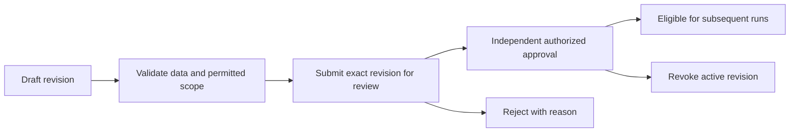

# Configuration and governance

Configuration is database-first. Repository YAML and Markdown are validated seed and deployment templates; editing a template does not automatically change a running deployment. Start with [snapshot loading](../app/configuration/database_bundle.py), [parameters](../app/configuration/parameters.py), and [bootstrap](../app/runtime/bootstrap.py).

## Contents

- [Chat and metrics integration policy](#chat-and-metrics-integration-policy)

- [Sources of truth](#sources-of-truth)
- [Scope and precedence](#scope-and-precedence)
- [All connectors, enabled per project](#all-connectors-enabled-per-project)
- [Identity and authorization](#identity-and-authorization)
- [Reviewed changes](#reviewed-changes)
- [Workflow: connect a project source](#workflow-connect-a-project-source)
- [Workflow: change a scoped parameter](#workflow-change-a-scoped-parameter)
- [Workflow: review reusable knowledge](#workflow-review-reusable-knowledge)
- [Workflow: change an agent or harness](#workflow-change-an-agent-or-harness)
- [Workflow: configure company sign-in](#workflow-configure-company-sign-in)
- [Detailed configuration references](#detailed-configuration-references)

## Chat and metrics integration policy

**Requirements for future integration.** Reuse database-first model profiles, capabilities, prompts, connector templates, limits and parameter definitions with the existing five-level precedence. Add configuration only for real operator needs; frontend defaults must not substitute for missing authorized configuration. Sources: [parameters](../app/configuration/parameters.py), [database bundle](../app/configuration/database_bundle.py), [run contract](../app/runtime/run_contract.py).

CopilotKit/AG-UI must use the existing authenticated request/session path, including applicable CSRF checks. Derive identity, membership and conversation ownership on the server. Keep secrets out of browser state. Project switching must discard stale responses and context. Preserve owner-only chat access unless a separate sharing policy is implemented. Sources: [chat routes](../app/api/routes/chats.py), [authentication](../app/identity/auth.py), [API client](../frontend/src/services/api.ts).

All implemented connectors remain available through saved project enablement and authorized read-only actions. Pi/OpenWorker references do not authorize shell execution or source writes. Custom definitions remain data-only, limited to existing tools, hash-checked and independently approved by a same-scope administrator other than the author. See [reviewed changes](#reviewed-changes).

Metric targets must come from governed configuration where available; missing SLA targets remain unavailable. Model estimates retain historical run pricing snapshots and distinguish unknown usage from zero. Sources: [pricing](../app/configuration/model_pricing.py), [telemetry](../app/persistence/telemetry.py).

**Platform metrics authority:** the [metrics route](../app/api/routes/metrics.py) requires `PLATFORM_ADMIN`. Project ownership alone cannot access tenant totals; [API regressions](../tests/integration/test_metrics_api.py) verify denial.

**Triage SLA policy:** define a JSON parameter with tool `triage` and variable name `sla_targets_seconds` through the existing platform parameter API, then use permitted project overrides. Map recorded priority codes to positive finite seconds. There is no invented default target. Missing priorities remain unknown; zero, negative, boolean and nonnumeric targets are rejected. Values use the same five-level resolution hierarchy as other parameters. Sources: [parameter validation](../app/configuration/parameters.py), [policy resolution](../app/runtime/sla_engine.py), [parameter endpoints](../app/api/routes/parameters.py).

## Sources of truth

| Data | Authoritative storage | Owner |
| --- | --- | --- |
| Configuration bundles and active selections | PostgreSQL `platform.system_configurations` and associated snapshot records | [database bundle](../app/configuration/database_bundle.py) |
| Typed parameter definitions and scoped overrides | PostgreSQL platform/project records | [parameters](../app/configuration/parameters.py) |
| Projects, membership and access requests | Database-managed project and governance records | [projects](../app/configuration/projects.py), [access](../app/configuration/project_access.py) |
| Runs, evidence, chats, messages, feedback and file metadata | Async SQLAlchemy application stores | [persistence](../app/persistence) |
| Native sessions and events | ADK session database | [database initialization](../app/persistence/database.py) |
| Agent definitions, uploaded originals and generated outputs | Content-addressed or scoped local/GCS blobs, with database metadata | [blob provider](../app/connectors/providers/blob.py), [chat artifacts](../app/persistence/chat_artifacts.py) |
| Optimization records and tracking | Application optimization records and native MLflow metadata; artifacts in blobs | [optimization](../app/optimization), [deployment](../scripts/deploy_database.py) |
| Credentials | Deployment secret environment; configuration stores references | [secret resolution](../app/connectors/providers/secrets.py) |

Application schema ownership spans `platform`, `project`, `runtime`, `governance`, and `optimization`. Native ADK and MLflow tables live in their own schemas. Versioned migrations, rather than a hardcoded table count in documentation, define the installed schema. Sources: [migrations](../migrations), [migration runner](../scripts/migrate.py).

## Scope and precedence

Resolve scoped parameter values in this order, most specific first:

1. Project + connector instance + environment.
2. Project + connector instance.
3. Project + environment.
4. Project-wide override.
5. Platform default.

Use explicit nullable scope columns and validated references; do not invent fallback configuration. Platform definitions decide whether project override is permitted. Expected revisions prevent stale edits. Sources: [parameter service](../app/configuration/parameters.py), [parameter API](../app/api/routes/parameters.py).

Instruction and workflow delegation is a separate concern: platform → project → permitted user preferences. Permissions intersect, execution limits narrow, and a lower tier cannot restore a denied action. Trusted deployment settings still govern authentication, credentials and infrastructure. A run freezes its resolved configuration; a saved edit is not proof that an existing process or run has reloaded it. Sources: [layers](../app/configuration/layers.py), [settings](../app/settings.py), [runner](../app/runtime/runner.py).

## All connectors, enabled per project

The project policy is to support **all implemented connectors according to project enablement**, rather than restricting investigations to Jira and Splunk. Enablement must resolve through the project's saved instance, selected environment, authorized resource, credential binding and permitted capability action. A catalog entry alone is not a usable connection.

| Connector | Runtime ID | Agent operation |
| --- | --- | --- |
| Jira | `itsm` | `itsm.get_ticket` |
| Splunk | `log_search` | `log_search.query_range` |
| Confluence | `confluence` | `confluence.read_evidence` |
| SignalFx | `signalfx` | `signalfx.read_evidence` |
| qTest | `qtest` | `qtest.read_evidence` |
| GitLab | `gitlab` | `gitlab.read_evidence` |
| Oracle | `oracle` | `oracle.read_evidence` |
| Kafka | `kafka` | `kafka.read_evidence` |
| Unix/Tuxedo | `unix` | `unix.read_evidence` |
| Kubernetes | `kubernetes` | `kubernetes.read_evidence` |

Sources: [provider registry](../app/connectors/providers/registry.py), [typed action catalog](../app/tools/catalog.py). Direct/MCP routing uses the same governed operation boundary. An A2A registration or connection handshake does not independently grant runtime actions; see [integration probes](../app/connectors/providers/integration_probe.py).

Oracle resolves the saved instance credential reference, selected environment and authorized database username through the same project path as the other providers. Its published template supports `database_password` authentication and an explicit `tcp[s]://host:port/service` Easy Connect DSN in Thin mode; execution uses a fixed, bounded session-diagnostic query with bind variables. Arbitrary SQL, TNS aliases and Thick mode are not supported. Sources: [resolver](../app/connectors/providers/registry.py), [Oracle provider](../app/connectors/providers/oracle.py), [template](../blob_local/platform/config/connector_templates/oracle.yaml).

The eight additional adapters remain disabled in the baseline **deployment configuration** until an operator configures and permits them. This is separate from template availability and project enablement: enabling an adapter does not create a saved project connection or authorize a capability. Existing database-managed deployments must publish/apply the updated configuration through the managed workflow; editing seed files does not change active records. Confirm a fresh scoped connection test and an authorized run before declaring a source live-ready. Sources: [deployment baseline](../blob_local/platform/config/connectors.yaml), [save/test/enable gates](../app/api/routes/connectors_api.py), [database configuration](../app/configuration/database_bundle.py).

Read-only evidence remains the boundary: no Jira mutations, arbitrary SQL, shell commands, or source-system writes. Kafka currently reads partition metadata; Unix reads a configured file over SFTP. Sources: [infrastructure providers](../app/connectors/providers/infrastructure.py), [Oracle](../app/connectors/providers/oracle.py).

## Identity and authorization

- Verify RS256 issuer, audience, signature and expiry; derive subject membership and roles server-side before protected work.
- `RCA_TENANT_ID` identifies the deployment tenant. `RCA_PROJECT_ID` is the bootstrap project. `X-RCA-Project` selects a project and cannot grant membership.
- Bootstrap principals are imported from trusted deployment configuration; ongoing membership is database-managed.
- Browser OIDC requires independently reviewed configuration, PKCE/state/nonce validation, and existing project membership. Secure HttpOnly sessions require origin/CSRF checks for mutations.
- Treat user text, evidence, YAML and model output as untrusted. Do not accept roles, tenant authority or connector authorization scope from request bodies.

Sources: [authentication](../app/identity/auth.py), [OIDC service](../app/configuration/oidc.py), [OIDC provider](../app/connectors/providers/oidc.py), [project service](../app/configuration/projects.py), [policy](../app/policy).

## Reviewed changes

Agent YAML is data-only, uses existing tool names, and is stored by content hash. A same-scope administrator other than the author approves it. Pending, rejected and revoked definitions are excluded from new execution. Reviewed knowledge, managed skills and harness bundles have their own lifecycle services; preserve their exact revision/hash checks rather than assuming identical API fields. Sources: [agent routes](../app/api/routes/agents.py), [knowledge](../app/configuration/knowledge.py), [skills](../app/configuration/skill_catalog.py), [harness workspace](../app/configuration/harness_workspace.py).

Harness bundles compile validated source into native ADK workflows. Uploaded Python is inert source, not executable extension code. Approved configuration does not bypass capability checks, connector restrictions or budgets. Sources: [bundle compiler](../app/configuration/harness_bundles.py), [workflow compiler](../app/configuration/workflow.py).

Detailed retained contracts: [database](reference/data-access-and-operations.md#database), [connector setup](reference/connector-specifications.md#connector-runtime), [Harness Studio](reference/runtime-and-extension-contracts.md#harness-studio), [knowledge and usage](reference/data-access-and-operations.md#knowledge-and-usage), [browser sign-in](reference/data-access-and-operations.md#browser-sign-in).

## Workflow: connect a project source

**Outcome:** a saved connection that an authorized capability can resolve for the intended project and environment. Configuration steps below describe the required policy and resolution path; deployment opt-in and a tested project binding are both required.

| Step | Operator action | Runtime significance |
| --- | --- | --- |
| Select scope | Choose the project and source type | Establishes which project owns the connection |
| Save instance | Configure endpoint, adapter and instance identity | Gives resolution an explicit source instance |
| Bind environment | Associate the supported environment and resource | Prevents treating one environment as another |
| Bind credentials | Save a supported secret reference | Keeps actual secrets in provider/deployment handling |
| Constrain access | Set authorized resources, read actions and limits | Bounds what a capability may request |
| Check readiness | Inspect validation and connection-health results | Confirms only what the particular check exercised |
| Attach capability | Enable the permitted actions for the investigation | Catalog presence alone cannot authorize execution |
| Verify a live run | Inspect resolved source and captured evidence | Establishes the selected path worked in that deployment |

A healthy connection can still be unusable by a capability whose actions or required scope do not match. Conversely, enabling a capability cannot repair missing credentials or an unhealthy endpoint. Direct and MCP paths must preserve the same authorization boundary. Sources: [connector API](../app/api/routes/connectors_api.py), [provider registry](../app/connectors/providers/registry.py), [per-run resolution](../app/runtime/runner.py), [tool catalog](../app/tools/catalog.py).

The detailed form contracts and previous redesign requirements are collected in [connector specifications](reference/connector-specifications.md). Treat their proposed fields and examples as specifications until verified in the current API and saved configuration.

## Workflow: change a scoped parameter

1. Locate the parameter definition and confirm its type, validation constraints and whether project override is allowed.
2. Read the existing effective value and its scope. Choose the narrowest intended scope using the five-level precedence order above.
3. Save the override through the parameter API with the expected revision. Do not invent a platform default when no valid value is available.
4. On a stale-revision conflict, reload the latest record and review the difference before resubmitting.
5. Inspect effective resolution at the intended project/instance/environment combination. Saving a broad project override will not override an existing more-specific value.
6. Follow the setting's reload/activation behavior and start a new run to inspect its resolved contract. Do not expect an edit to rewrite a historical run.

For example, an instance-and-environment override takes precedence over the same instance's project-only override. Removing the narrower override exposes the next configured value in the hierarchy; it does not justify creating an undocumented fallback. Sources: [parameter resolution](../app/configuration/parameters.py), [parameter endpoints](../app/api/routes/parameters.py), [database configuration](../app/configuration/database_bundle.py).

## Workflow: review reusable knowledge

| Action | Required boundary | Effect |
| --- | --- | --- |
| Create or upload | Authorized owner/administrator and bounded local input | Creates draft content |
| Edit or replace | Expected current hash | Creates a new revision requiring review |
| Submit | Exact eligible revision | Makes the revision pending review |
| Approve or reject | Independent authorized reviewer in the same project | Records a hash-bound decision |
| Revoke | Authorized lifecycle action | Stops approved content qualifying for new runs |
| Read history | Authorized access | Shows retained revisions and decisions |

The original uploaded file remains separate from edited text. Downloading an original does not generate a document from subsequent text edits. Deletion is disabled to retain audit history. At investigation time the service verifies eligible revision content, applies bounded keyword selection, and freezes selected excerpts and hashes into the run. Sources: [knowledge service](../app/configuration/knowledge.py), [upload API](../app/api/routes/knowledge_uploads.py), [catalog endpoints](../app/api/routes/catalog.py).

Structured articles use the same lifecycle: bounded topic/summary/blocks generate canonical Markdown and participate in the reviewed hash. Capture jobs organize approved original documents, closed Jira tickets, authorized Confluence pages and verified feedback into separate drafts. The `knowledge.capture_lookback_months` parameter starts at three calendar months and accepts 1–24; the capture settings API uses existing parameter definition/override revision checks. Saved external connector selections and capability permissions remain mandatory. See [capture contracts and source-update behavior](knowledge.md#structured-topics-and-source-capture). Sources: [models](../app/configuration/knowledge_structure.py), [settings and source admission](../app/configuration/knowledge.py), [capture job request](../app/optimization/improvement_models.py).

See the [complete knowledge-base and improvement handbook](knowledge.md) for forms, storage, scoped retrieval, OKF exchange, evaluation and the governed feedback loop. Knowledge scope changes are immutable reviewed revisions. Once approved, required-document rules continue blocking their matching capabilities through edits or revocation until an independently approved revision removes the requirement. Sources: [knowledge service](../app/configuration/knowledge.py), [scope regression](../tests/integration/test_knowledge_associations.py).

## Workflow: change an agent or harness

Author a data-only definition that refers to existing tools and supported graph nodes. Validate against the current schema and capability before review. For Harness Studio, inspect the compiled graph and source diagnostics; source editing does not authorize executable Python plugins. Submit the exact content revision for independent review, then use the lifecycle service's activation path.

New execution resolves approved eligible definitions and still intersects their behavior with capability actions and project restrictions. An approval does not expand credentials, restore a disabled connector, or remove execution budgets. Keep draft, pending, rejected, approved and revoked content distinguishable, and retain hashes for audit and stale-review protection. Sources: [agent endpoints](../app/api/routes/agents.py), [harness workspace](../app/configuration/harness_workspace.py), [bundle compiler](../app/configuration/harness_bundles.py), [workflow validation](../app/configuration/workflow.py).

## Workflow: configure company sign-in

An administrator proposes explicit OIDC endpoints, client identity, callback URL and bounded session lifetime; secret fields contain references. A different authorized administrator reviews the exact hash. The operator registers the exact HTTPS callback with the identity provider and provisions subject membership before sign-in.

The browser flow binds a one-use state transaction to the initiating browser and exchanges the authorization code with PKCE. The server verifies signed identity claims and nonce, then issues a bounded Secure HttpOnly session. Mutations require origin and CSRF checks. Project selection resolves membership again; it does not trust identity-provider role claims as project authority. Logout invalidates the local database session. Sources: [OIDC configuration and session service](../app/configuration/oidc.py), [provider protocol](../app/connectors/providers/oidc.py), [authentication](../app/identity/auth.py).

Real identity-provider setup must be verified in the target deployment. The release has no automatic account provisioning or silent refresh-token renewal. Preserve the documented bearer bootstrap/recovery configuration. Detailed protocol and deployment notes are in [browser sign-in reference](reference/data-access-and-operations.md#browser-sign-in).

## Detailed configuration references

Follow [forms](connectors.md#template-and-form-contract) → [saved records](data-model.md#connector-records) → [review](security.md#independent-review-and-stale-writes) → [ADK resolution](harness.md#from-configuration-to-execution). These are current implementation handbooks; the consolidated reference volumes retain historical detail.

## OKF policy integration

The Knowledge page supports bounded OKF preview, draft import and hash-checked export. Freshness and eligibility use database-managed `knowledge.okf_*` parameter definitions. Portable source lifecycle and verification metadata cannot replace local draft/review/approval state. See [OKF administration](knowledge.md#project-and-administration-experience), [exchange implementation](../app/configuration/knowledge_okf.py) and [policy resolution](../app/configuration/knowledge.py).
