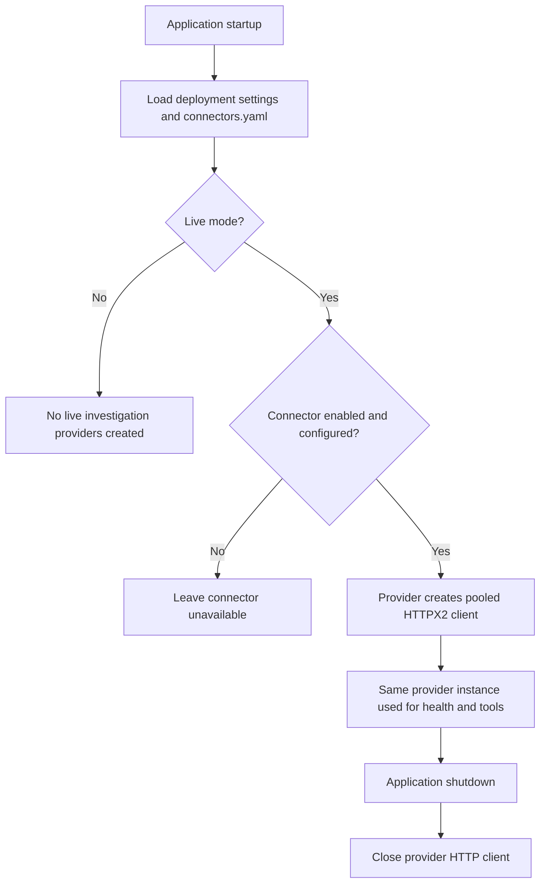
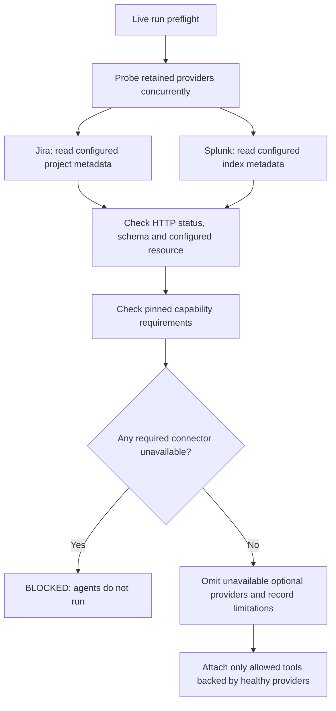

# Connector lifecycle and call flows

An agent reasons about evidence. A domain tool exposes an allowed operation. A connector provider handles the external API. These responsibilities remain separate so credentials and network behavior stay outside model-authored instructions.

## Startup and shutdown



Tests may inject fixture providers. In normal live startup, Jira and Splunk resolve credentials from deployment environment variables. Invalid or missing provider configuration leaves that provider unavailable; run preflight decides whether the chosen capability can proceed.

**Implementation:** [`create_app` lifespan](../app/runtime/bootstrap.py), [connector configuration](../blob_local/platform/config/connectors.yaml), [Jira provider](../app/connectors/providers/jira.py), [Splunk provider](../app/connectors/providers/splunk.py).

## Health checks before investigation



| Provider ID | Credential and scope settings | Health request | Investigation request |
|---|---|---|---|
| `itsm` / Jira | `JIRA_BASE_URL`, `JIRA_USER_EMAIL`, `JIRA_API_TOKEN`, `JIRA_PROJECT_KEY` | `GET /rest/api/2/project/{project_key}` | `GET /rest/api/2/issue/{ticket_id}` |
| `log_search` / Splunk | `SPLUNK_HOST`, `SPLUNK_TOKEN`, `SPLUNK_INDEX` | `GET /services/data/indexes/{index}` | `GET /services/search/jobs/export` with bounded query parameters |

`GET /api/v1/connectors/health` also invokes these probes, excluding project-disabled connectors. Run preflight probes only capability-required providers and providers backing retained actions. `/health` only reports process liveness; `/ready` checks database connectivity and configured authentication. Neither means every connector operation or model call will succeed.

Health is a preflight observation, not a permanent guarantee. A provider can fail after a successful probe. Runtime tool failures are sanitized and recorded as unavailable evidence; the run may finish partial or fail for another reason. The current providers do not implement automatic retries or a circuit-breaker execution path.

## A governed tool call

The complete [agent-to-connector sequence](architecture.md#3-agent-to-connector-flow) shows the forward call and return path:

```text
LlmAgent proposes get_ticket or query_range
  -> RunGovernance checks run state, budget, scope and allowed action
  -> FunctionTool calls a typed provider method
  -> Provider validates external scope and makes bounded HTTP request
  <- Provider validates and selects response data
  <- RunGovernance redacts, bounds, hashes and persists evidence
  <- LlmAgent receives evidence ID plus redacted data
```

Jira rejects issue keys outside its configured project. Splunk builds the search using its configured index, accepts bounded plain search terms, and validates the time window. Both bound response bytes, require successful HTTP status, and disable redirects. Pool and timeout values come from [connectors.yaml](../blob_local/platform/config/connectors.yaml).

**Implementation:** [ITSM tools](../app/tools/domain/itsm.py), [log tools](../app/tools/domain/logs.py), [governance callbacks](../app/runtime/governance.py), [shared response-size reader](../app/connectors/base.py).

## Configuration blob storage is a separate path

```text
Configuration API -> approval service -> ConfigurationBlobStore
                                       -> local directory OR GCS bucket
```

The blob provider writes canonical agent YAML by content hash and verifies it on read. `RCA_CONFIG_BLOB_URI` selects a local directory or `gs://bucket/prefix`; GCS uses Application Default Credentials. It is called by the configuration service, not an agent tool, and is not included in the Jira/Splunk health endpoint. See [approval flow](architecture.md#5-project-agent-approval-and-discovery).

## Adding a new investigation connector

1. Implement protocol, credentials, scope checks, bounded responses and cleanup under [app/connectors/providers](../app/connectors/providers).
2. Expose granular typed `FunctionTool` functions under [app/tools/domain](../app/tools/domain).
3. Register provider construction in the [provider registry](../app/connectors/providers/registry.py) and the action in the [shared tool catalog](../app/tools/catalog.py). Governance, specialist validation and agent assembly share that catalog.
4. Add the connector and permitted actions to the appropriate capability, with required/optional behavior chosen deliberately.
5. Test scope enforcement, health failures, response bounds and the complete governed call. Update these diagrams to show the actual route.

Database, Oracle, ServiceNow, MCP and A2A investigation connectors are not enabled. Investigation writes remain disabled.
