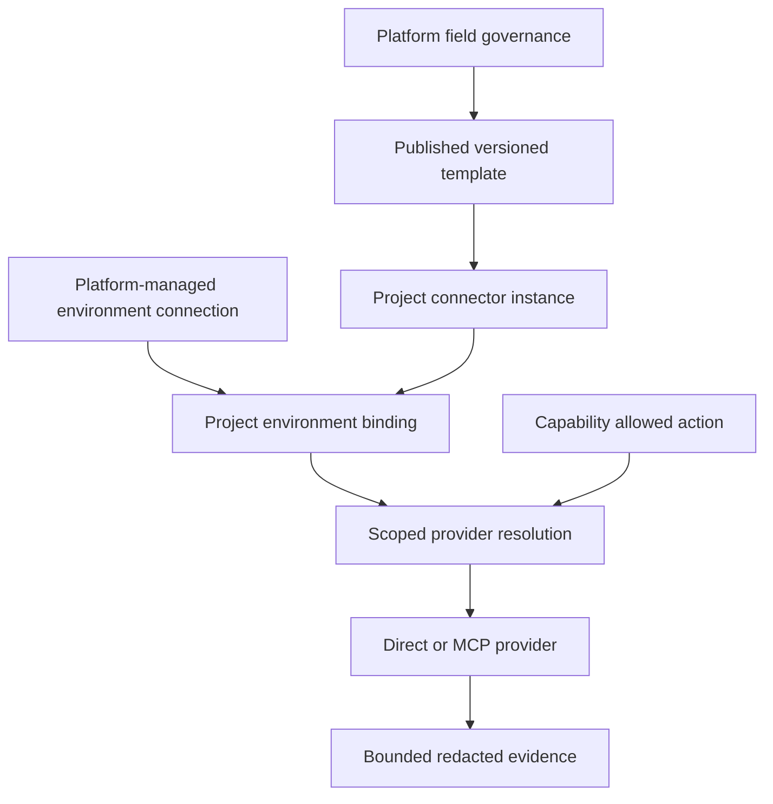
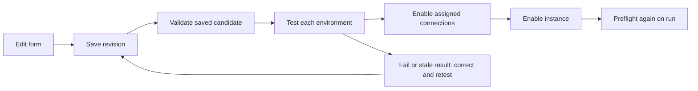

# Connector forms, lifecycle and runtime handbook

A connector is usable only when its implemented adapter, published template, saved instance, environment connection, project binding and capability action agree. This handbook follows those objects from the administration form into a bounded provider call. See [configuration](configuration.md#all-connectors-enabled-per-project) for the supported-project policy and [security](security.md#connector-security-boundary) for enforcement.

## Contents

- [Connector object model](#connector-object-model)
- [Template and form contract](#template-and-form-contract)
- [Field ownership](#field-ownership)
- [Instance form](#instance-form)
- [Environment connection form](#environment-connection-form)
- [Project binding form](#project-binding-form)
- [Save, test and enable flow](#save-test-and-enable-flow)
- [Provider-specific forms](#provider-specific-forms)
- [Jira form and read flow](#jira-form-and-read-flow)
- [Direct, MCP and Hybrid](#direct-mcp-and-hybrid)
- [Runtime resolution](#runtime-resolution)
- [Connector API](#connector-api)
- [Adding a new connector or field](#adding-a-new-connector-or-field)
- [Seed form field dictionary](#seed-form-field-dictionary)
- [Bounded source-query examples](#bounded-source-query-examples)


## Connector object model



Reading path: [template](#template-and-form-contract) → [instance](#instance-form) → [connection](#environment-connection-form) → [binding](#project-binding-form) → [runtime](#runtime-resolution) → [evidence](data-model.md#run-and-evidence-records).

These are separate records, not interchangeable names for one settings object. In particular, the display `system_name` is not a credential, and a binding cannot replace an instance endpoint through a narrowing filter. Sources: [connector API models](../app/api/routes/connectors_api.py), [database records](../app/persistence/platform_admin.py), [resolver](../app/connectors/providers/registry.py).

## Template and form contract

The Tools administration surface loads published connector templates and saved instances. Template metadata describes the form; backend validation and the provider define what actually executes. Repository YAML is a seed specification, while the published database catalog and parameter definitions provide effective runtime/form metadata.

| Metadata | Purpose |
| --- | --- |
| Template ID and version | Bind an instance to a specific available contract |
| Adapter/type | Choose an implemented provider family |
| Parameter name, label, section and order | Identify the persisted value and its placement in the form |
| Value type, required flag and allowed values | Drive input controls and validation |
| Default source/value and nullability | Distinguish inherited, missing and explicit values |
| Ownership, visibility and override permission | Determine which actor can see/edit the field |
| Validation rules | Bound accepted values; server revalidates input |
| Runtime binding | Identify the downstream consumer; a declaration alone does not prove consumption |
| Auth profiles | List profile-specific required/optional credential-reference fields |

Sources: [published catalog](../app/configuration/connector_catalog.py), [parameter definitions](../app/configuration/parameters.py), [template seeds](../blob_local/platform/config/connector_templates.yaml), [Tools page](../frontend/src/pages/Tools.tsx), [form component](../frontend/src/components/connectors/ConnectorsForm.tsx).

## Field ownership

| Tier | Project form | Who changes the value |
| --- | --- | --- |
| `platform_only` | Omitted/protected in project projection | Platform administrator |
| `project_locked` | Visible as inherited/locked | Platform administrator |
| `project_editable` | Delegated editable value | Authorized project administrator within policy |

Connection identity, credentials, route configuration and derived fields cannot be made project-editable simply by changing their visibility. Alias handling maps related fields such as `project_key`/`index`/`namespace` to resource-governance concepts. Saving a governance policy uses an expected revision; removing delegation also removes affected project parameter overrides in the same transaction. This is a consequential policy change, not a cosmetic UI preference. Source: [field-governance service](../app/configuration/connector_governance.py).

## Instance form

The project connector editor composes identity, inherited defaults, environment assignments, source settings, tests and enablement controls. It uses the current server template and instance rather than an arbitrary client-defined schema.

| Request field | Meaning and validation |
| --- | --- |
| `instance_id` | Stable lowercase identifier, up to 64 characters |
| `template_id`, `template_version` | Published template to resolve |
| `system_name` | Configured connection name, up to 128 characters; platform-managed locking can prevent project creation until supplied |
| `environment_dependency` | `dependent` or `independent`; required beyond incomplete draft state |
| `tool_environment` | Explicit source-environment descriptor; required beyond incomplete draft state |
| `expected_revision` | Nonnegative concurrency token; stale updates fail |
| `definition` / `definition_json` | Validated instance settings, not an authorization escape hatch |
| `bindings` | At most 64 project-environment assignments |
| `environment_connections` | At most 64 connection definitions; platform authority required |

Incomplete drafts may be saved, but secret input is still validated. Saving a form does not forge a passing test or activate a connection. Archives use their lifecycle action rather than saving `archived` as an ordinary edit. Sources: [save request and handler](../app/api/routes/connectors_api.py), [editor](../frontend/src/components/ConnectorInstanceEditor.tsx).

## Environment connection form

A platform administrator owns the endpoint/authentication route. A saved environment connection starts disabled, in draft state, with no test result; the request schema prevents clients from supplying successful test status or timestamps.

| Field | Accepted meaning |
| --- | --- |
| `connection_id` | Lowercase letters, numbers, underscore or hyphen; 1–64 characters |
| `connection_name`, `environment_name` | Human name and named source environment |
| `routing_mode` | `direct`, `mcp` or `hybrid` |
| `auth_profile_id` | A supported profile; its required fields must be present |
| `target` | Only endpoint and port keys |
| `credentials` | Credential fields using supported references for secrets |
| `mcp_configuration` | Endpoint, token reference and explicit governed operation bindings |
| `resource_scope` | At most 1,000 unique nonblank allowed resource identifiers, each up to 256 characters |

The server validates, tests and enables the saved record through separate endpoints. A project editor can choose an authorized connection binding but cannot redefine protected endpoint/credential fields. Sources: [connection payload and endpoints](../app/api/routes/connectors_api.py), [connection application](../app/configuration/connection_records.py), [auth-profile UI](../frontend/src/components/connectors/ConnectorAuthProfilesCard.tsx).

## Project binding form

A binding connects `project_env_id` to an `external_resource`, optionally identifying `tool_env_id`, `connection_id` and `credential_binding_id`. It has active/inactive status and optional `narrowing_filters_json`.

The selected project environment must exist and be active. A dependent connector needs an explicit environment and exactly one active matching binding. An independent connector with multiple active assignments also needs an explicit selection. A persisted empty binding list cannot be replaced by stale inline mappings. When connection records exist, the binding must identify its connection explicitly.

Narrowing filters can restrict a supported source query; they cannot override tenant/project identity, endpoint, auth, routing, credentials or runtime limits. The selected external resource must match the provider's explicit resource field. Sources: [binding validation](../app/api/routes/connectors_api.py), [binding resolution and protected fields](../app/connectors/providers/registry.py).

## Save, test and enable flow



Reading path: [edit](#instance-form) → [persist](data-model.md#connector-records) → [test](#connector-api) → [preflight](#runtime-resolution).

Instance enablement reloads the immutable template version and saved candidate, checks deployment enablement, validates each active environment, and requires a matching passing candidate test from the last **900 seconds (15 minutes)**. The hash, project, instance, template version and environment must match. Assigned environment connections must already be active, enabled and passed. Configuration changes invalidate the applicability of old test evidence. Errors distinguish invalid input (`422`), stale/configuration conflicts (`409`), absent passing prerequisites (`412`) and denied policy (`403`). Source: [enable handler](../app/api/routes/connectors_api.py).

## Provider-specific forms

This table describes current native provider consumption. Larger historical form specifications include proposed fields/auth modes and must not be treated as implemented merely because they appear in a reference form.

| Source / action | Resource selection | Native authentication | Actual read |
| --- | --- | --- | --- |
| Jira / `itsm.get_ticket` | Bound Jira project key | Account identifier plus API-token reference; supported Basic profile aliases | Jira Cloud v3 ticket data with bounded ADF/comment context |
| Splunk / `log_search.query_range` | Bound index and bounded time window | Bearer-token reference | Constrained log search; not arbitrary unrestricted SPL |
| Confluence / `confluence.read_evidence` | Configured space identifier | Bearer-token reference | Bounded space page listing with storage-body content |
| SignalFx / `signalfx.read_evidence` | Detector identifier | API-key reference sent as `X-SF-Token` | Detector resource; not a general streaming APM pipeline |
| qTest / `qtest.read_evidence` | Project identifier | Bearer-token reference | Root project test runs |
| GitLab / `gitlab.read_evidence` | Project identifier | API-key reference sent as `PRIVATE-TOKEN` | Recent deployment records |
| Kubernetes / `kubernetes.read_evidence` | Namespace | Service-account token reference | Pod names and status within that namespace |
| Kafka / `kafka.read_evidence` | Topic | SASL SCRAM over TLS, username/password reference | Partition metadata, not general message consumption |
| Unix/Tuxedo / `unix.read_evidence` | Fixed configured file path and SSH host | Username plus password or private-key reference; known-hosts reference | Bounded SFTP file read, not shell/Tuxedo command execution |
| Oracle / `oracle.read_evidence` | One bound database username | Saved database username and password secret reference; Thin mode, explicit Easy Connect DSN | Fixed bounded session wait snapshot; no model-provided SQL |

Sources: [native auth and scope map](../app/connectors/providers/registry.py), [REST providers](../app/connectors/providers/evidence.py), [Kafka/Unix](../app/connectors/providers/infrastructure.py), [Oracle](../app/connectors/providers/oracle.py), [tool signatures](../app/tools/catalog.py).

The eight additional evidence tools are argument-free at the ADK interface: the provider owns destination and resource selection. This prevents the model from supplying an arbitrary endpoint or namespace. Source: [evidence FunctionTool](../app/tools/domain/evidence.py).

## Jira form and read flow

Configure the published Jira template, account/token reference, approved endpoint and project resource binding. The field-mapping card maps source field IDs into supported investigation context. Discovery and JQL preview use the saved connection/environment and must remain project-scoped.

```mermaid
flowchart LR
  F[Jira form and field mapping] --> B[Saved project resource binding]
  B --> Q[Scoped ticket or JQL read]
  Q --> J[Jira Cloud REST v3]
  J --> A[Budgeted ADF and response traversal]
  A --> E[Captured evidence ID]
  click F "connectors.md#instance-form" "Instance fields"
  click B "connectors.md#project-binding-form" "Resource binding"
  click Q "connectors.md#connector-api" "Metadata and preview endpoints"
  click J "connectors.md#provider-specific-forms" "Native provider"
  click A "security.md#files-and-untrusted-content" "Untrusted source text"
  click E "harness.md#tool-and-model-boundaries" "Evidence capture"
```



Reading path: [form](#instance-form) → [binding](#project-binding-form) → [API](#connector-api) → [evidence](harness.md#tool-and-model-boundaries).

Jira uses Cloud REST v3, cursor pagination and bounded ADF traversal. JQL is constrained to the authorized project. The existence of Jira attachment metadata does not authorize remote attachment fetching; local bounded uploads remain the supported attachment input. No Jira mutations are supported. Sources: [Jira provider](../app/connectors/providers/jira.py), [JQL/schema endpoints](../app/api/routes/connectors_api.py), [mapping card](../frontend/src/components/connectors/JiraFieldMappingCard.tsx).

## Direct, MCP and Hybrid

`direct` constructs the native provider. `mcp` resolves a configured MCP endpoint/token and an exact binding for the connector's governed operation. `hybrid` requires an explicit direct-or-MCP route for every governed operation; it does not imply automatic fallback after a failed call.

MCP bindings specify the remote tool name, scope argument, fixed arguments and argument map. Runtime still validates authorized resource scope, host and secret reference. A successful MCP handshake or A2A agent-card probe does not register an unrestricted runtime action. Sources: [route resolver](../app/connectors/providers/registry.py), [MCP evidence provider](../app/connectors/providers/mcp_evidence.py), [integration probes](../app/connectors/providers/integration_probe.py).

## Runtime resolution

The runner starts from capability-required connectors plus connectors named in allowed actions. It loads saved project instances and scoped parameter values, selects environment/resource/connection bindings, validates protected fields and credentials, chooses a route, constructs bounded clients and performs health checks. Required unavailable sources block the run; optional unavailable sources become limitations.

Provider clients created for a run are closed during cleanup. Tool visibility is then restricted to available providers and permitted actions. A model cannot restore a missing connector by naming its tool in text. Sources: [per-run resolution](../app/runtime/runner.py), [provider registry](../app/connectors/providers/registry.py), [tool filtering](../app/tools/catalog.py).

All ten implemented providers participate in the same project save/test/enable and runtime resolution path. Additional providers receive the saved result and response-byte limits in both connection testing and investigation execution. Their baseline deployment switches remain off until an operator configures and permits them; a published template alone does not enable a source. Sources: [API policy gates](../app/api/routes/connectors_api.py), [candidate tests](../app/connectors/candidate_testing.py), [resolver](../app/connectors/providers/registry.py), [deployment baseline](../blob_local/platform/config/connectors.yaml).

## Connector API

These paths are under `/api/v1`. The server derives tenant and author identity; `{project_id}` must match authorized scope.

| Path family | Operations |
| --- | --- |
| `/connectors/templates` | List and save template drafts; get a version; publish/deprecate via lifecycle endpoints |
| `/connectors/templates/{id}/field-governance` | Revision-aware `PUT` for field ownership |
| `/projects/{project_id}/connectors` | List/save instances; fetch one by instance ID |
| `/projects/{project_id}/connectors/{instance_id}/connections` | List/save connection records; test/enable/disable/delete by connection ID |
| `/projects/{project_id}/connectors/{instance_id}/test` | Test saved effective configuration |
| `/projects/{project_id}/connectors/{instance_id}/enable` or `/disable` | Explicit instance lifecycle action |
| `/projects/{project_id}/connectors/{instance_id}/fields` | Jira metadata discovery for the saved environment |
| `/projects/{project_id}/connectors/{instance_id}/jql/preview` | Bounded scoped JQL preview |
| `/connectors/validate`, `/connectors/test` | Candidate validation/probe; not independent authorization to enable |

Source: [endpoint implementation and exact request models](../app/api/routes/connectors_api.py).

## Adding a new connector or field

1. Check whether an existing provider/read operation already supplies the evidence. Reuse it when sufficient.
2. For a new provider, implement typed bounded reads and health checks under `app/connectors/providers`; keep credentials and network handling there. Reject resource/endpoint escape, oversized responses and unsupported writes.
3. Expose a narrow `FunctionTool` under `app/tools/domain`; add the canonical action to the shared tool catalog and native registry. Trace every consumer of the action before modifying shared resolution.
4. Add a validated template and parameter definitions: type, requiredness, ownership, allowed values, default provenance and runtime binding. A new UI field needs a real backend consumer.
5. Wire saved instance, environment connection and project binding resolution. Add scoped credential and host controls, test evidence and enablement gates.
6. Add the capability action and stage eligibility through the approved configuration path. Do not enable it globally or give all projects source access.
7. Verify the full vertical path: save → validation → scoped live probe → enable → ADK tool → persisted evidence → valid citation. Exercise denied project/resource, stale configuration and failure limits.
8. Update this form table, the [data model](data-model.md) if schema changes, and [security boundaries](security.md). Report deployment verification separately from isolated tests.

Sources: [registry](../app/connectors/providers/registry.py), [catalog](../app/tools/catalog.py), [parameter service](../app/configuration/parameters.py), [connector lifecycle checks](../tests/integration/test_connector_lifecycle.py), [transport checks](../tests/integration/test_connector_socket_transport.py).

## Seed form field dictionary

These are the ten checked-in template declarations, included so form authors can find every field and its declared consumer. They are **seed contracts**, not the active database values. Published field governance and protected-identity rules can override these declarations; in particular a seed describing an editable system name does not defeat the server platform lock. A declared runtime binding must still have an implemented consumer. No actual credentials or live project values are included.

### Confluence Knowledge

[Template source](../blob_local/platform/config/connector_templates/confluence.yaml); native behavior: [provider-specific forms](#provider-specific-forms).

Declared limitations: ['Space-scoped page listings only; macros and executable content are blocked.', 'Page editing is disabled.']

| Field | Type / requirement | Declared ownership | Runtime binding / meaning |
| --- | --- | --- | --- |
| `timeout_seconds` | integer; optional/inherited | project_override_allowed | connector.timeout_seconds; {"minimum": 1, "maximum": 60} |
| `system_name` | string; required | project_only | Project-defined connector instance name. Defaults to the connector name and remains editable. |
| `environment_dependency` | string; required | project_only | Explicit project choice between Environment Dependent (environment mappings) and Environment Independent (shared external system).; {"allowed_values": ["dependent", "independent"]} |
| `tool_environment` | string; required | project_only | Authorized external environment name (e.g. Shared for independent, or target tool environment).; {"required_when": "environment_dependency == 'dependent'"} |

| Auth profile | Declared status | Required fields |
| --- | --- | --- |
| `bearer_token` | active | `token_secret_ref` |

### GitLab Source & Deployments

[Template source](../blob_local/platform/config/connector_templates/gitlab.yaml); native behavior: [provider-specific forms](#provider-specific-forms).

Declared limitations: ['Bounded recent deployment records only; pipelines and repository cloning are disabled.']

| Field | Type / requirement | Declared ownership | Runtime binding / meaning |
| --- | --- | --- | --- |
| `timeout_seconds` | integer; optional/inherited | project_override_allowed | connector.timeout_seconds; {"minimum": 1, "maximum": 60} |
| `system_name` | string; required | project_only | Project-defined connector instance name. Defaults to the connector name and remains editable. |
| `environment_dependency` | string; required | project_only | Explicit project choice between Environment Dependent (environment mappings) and Environment Independent (shared external system).; {"allowed_values": ["dependent", "independent"]} |
| `tool_environment` | string; required | project_only | Authorized external environment name (e.g. Shared for independent, or target tool environment).; {"required_when": "environment_dependency == 'dependent'"} |

| Auth profile | Declared status | Required fields |
| --- | --- | --- |
| `api_key_header` | active | `api_key_secret_ref` |

### Jira Cloud Incident Triage

[Template source](../blob_local/platform/config/connector_templates/jira.yaml); native behavior: [provider-specific forms](#provider-specific-forms).

Declared limitations: ['Read-only ticket lookup; comment writes and issue mutations are governance-restricted.', 'Uses Jira Cloud REST API Version 3 with Atlassian Document Format (ADF) rich-text support.', 'JQL preview validates scoped queries; saved custom JQL does not enable queue execution.']

| Field | Type / requirement | Declared ownership | Runtime binding / meaning |
| --- | --- | --- | --- |
| `timeout_seconds` | integer; optional/inherited | project_override_allowed | connector.timeout_seconds; {"minimum": 1, "maximum": 60} |
| `system_name` | string; required | project_only | Project-defined connector instance name. Defaults to the connector name and remains editable. |
| `environment_dependency` | string; required | project_only | Explicit project choice between Environment Dependent (environment mappings) and Environment Independent (shared external system).; {"allowed_values": ["dependent", "independent"]} |
| `tool_environment` | string; required | project_only | Authorized external environment name (e.g. Shared for independent, or target tool environment).; {"required_when": "environment_dependency == 'dependent'"} |
| `custom_jql` | string; optional/inherited | project_override_allowed | Reusable JQL filter clause, up to 4096 characters. Leave empty for no additional filter. Saved configuration only; queue search and scheduled polling are not enabled.; {"max_length": 4096} |
| `custom_field_mapping` | json; optional/inherited | project_override_allowed | jira.custom_field_mapping |
| `attachment_processing` | string; optional/inherited | project_override_allowed | project.attachment_processing; {"allowed_values": ["disabled", "local_upload"]} |

| Auth profile | Declared status | Required fields |
| --- | --- | --- |
| `basic_auth` | active | `account_identifier`, `api_token_secret_ref` |
| `oauth2_1` | planned | `oauth_provider_profile`, `client_id`, `client_secret_ref` |
| `api_token` | active | `account_identifier`, `api_token_secret_ref` |
| `jwt_app` | planned | `app_id`, `private_key_ref` |
| `webhook_ref` | planned | `webhook_url`, `secret_token_ref` |

### Kafka Message Streams

[Template source](../blob_local/platform/config/connector_templates/kafka.yaml); native behavior: [provider-specific forms](#provider-specific-forms).

Declared limitations: ['Native partition metadata only; consumer lag measurement not supported natively.', 'Message consumption, publishing, offset commits, and consumer group changes are blocked.']

| Field | Type / requirement | Declared ownership | Runtime binding / meaning |
| --- | --- | --- | --- |
| `timeout_seconds` | integer; optional/inherited | project_override_allowed | connector.timeout_seconds; {"minimum": 1, "maximum": 60} |
| `system_name` | string; required | project_only | Project-defined connector instance name. Defaults to the connector name and remains editable. |
| `environment_dependency` | string; required | project_only | Explicit project choice between Environment Dependent (environment mappings) and Environment Independent (shared external system).; {"allowed_values": ["dependent", "independent"]} |
| `tool_environment` | string; required | project_only | Authorized external environment name (e.g. Shared for independent, or target tool environment).; {"required_when": "environment_dependency == 'dependent'"} |
| `topic_filter` | string; optional/inherited | project_only | kafka.topic |

| Auth profile | Declared status | Required fields |
| --- | --- | --- |
| `sasl_scram_tls` | active | `username`, `password_secret_ref` |
| `bearer_token` | active | `token_secret_ref` |

### Kubernetes Cluster Health

[Template source](../blob_local/platform/config/connector_templates/kubernetes.yaml); native behavior: [provider-specific forms](#provider-specific-forms).

Declared limitations: ['Namespace-scoped pod status only; reading secrets, container exec, and workload changes are blocked.']

| Field | Type / requirement | Declared ownership | Runtime binding / meaning |
| --- | --- | --- | --- |
| `timeout_seconds` | integer; optional/inherited | project_override_allowed | connector.timeout_seconds; {"minimum": 1, "maximum": 60} |
| `system_name` | string; required | project_only | Project-defined connector instance name. Defaults to the connector name and remains editable. |
| `environment_dependency` | string; required | project_only | Explicit project choice between Environment Dependent (environment mappings) and Environment Independent (shared external system).; {"allowed_values": ["dependent", "independent"]} |
| `tool_environment` | string; required | project_only | Authorized external environment name (e.g. Shared for independent, or target tool environment).; {"required_when": "environment_dependency == 'dependent'"} |

| Auth profile | Declared status | Required fields |
| --- | --- | --- |
| `k8s_service_account_token` | active | `token_secret_ref` |

### Oracle Database

[Template source](../blob_local/platform/config/connector_templates/oracle.yaml); native behavior: [provider-specific forms](#provider-specific-forms).

Only a fixed session wait snapshot is supported. The read-only account needs `SELECT` access to `V_$SESSION`; the bound resource is one database username. The endpoint is one explicit `tcp[s]://host:port/service` Easy Connect DSN. TNS aliases, connection descriptors, Thick mode, arbitrary SQL and mutations are unavailable. Source: [provider](../app/connectors/providers/oracle.py); approach: [official python-oracledb connection documentation](https://python-oracledb.readthedocs.io/en/latest/user_guide/connection_handling.html).

| Field | Type / requirement | Declared ownership | Runtime binding / meaning |
| --- | --- | --- | --- |
| `system_name` | string; required | project_only | Project-defined connector instance name. Defaults to the connector name and remains editable. |
| `environment_dependency` | string; required | project_only | Explicit project choice between Environment Dependent (environment mappings) and Environment Independent (shared external system).; {"allowed_values": ["dependent", "independent"]} |
| `tool_environment` | string; required | project_only | Authorized external environment name (e.g. Shared for independent, or target tool environment).; {"required_when": "environment_dependency == 'dependent'"} |
| `driver_mode` | string; optional/inherited | project_only | oracle.driver_mode; {"allowed_values": ["thin"]} |
| `connection_format` | string; optional/inherited | project_only | oracle.connection_format; {"allowed_values": ["dsn"]} |

| Auth profile | Declared status | Required fields |
| --- | --- | --- |
| `database_password` | active | `database_username`, `password_secret_ref` |

### qTest Test Management

[Template source](../blob_local/platform/config/connector_templates/qtest.yaml); native behavior: [provider-specific forms](#provider-specific-forms).

Declared limitations: ['Root-level project test runs only; recursive folder traversal is not supported.']

| Field | Type / requirement | Declared ownership | Runtime binding / meaning |
| --- | --- | --- | --- |
| `timeout_seconds` | integer; optional/inherited | project_override_allowed | connector.timeout_seconds; {"minimum": 1, "maximum": 60} |
| `system_name` | string; required | project_only | Project-defined connector instance name. Defaults to the connector name and remains editable. |
| `environment_dependency` | string; required | project_only | Explicit project choice between Environment Dependent (environment mappings) and Environment Independent (shared external system).; {"allowed_values": ["dependent", "independent"]} |
| `tool_environment` | string; required | project_only | Authorized external environment name (e.g. Shared for independent, or target tool environment).; {"required_when": "environment_dependency == 'dependent'"} |

| Auth profile | Declared status | Required fields |
| --- | --- | --- |
| `bearer_token` | active | `token_secret_ref` |

### SignalFx APM & Metrics

[Template source](../blob_local/platform/config/connector_templates/signalfx.yaml); native behavior: [provider-specific forms](#provider-specific-forms).

Declared limitations: ['Detector configuration evidence only; no live metric time series ingestion or detector mutations.']

| Field | Type / requirement | Declared ownership | Runtime binding / meaning |
| --- | --- | --- | --- |
| `timeout_seconds` | integer; optional/inherited | project_override_allowed | connector.timeout_seconds; {"minimum": 1, "maximum": 60} |
| `system_name` | string; required | project_only | Project-defined connector instance name. Defaults to the connector name and remains editable. |
| `environment_dependency` | string; required | project_only | Explicit project choice between Environment Dependent (environment mappings) and Environment Independent (shared external system).; {"allowed_values": ["dependent", "independent"]} |
| `tool_environment` | string; required | project_only | Authorized external environment name (e.g. Shared for independent, or target tool environment).; {"required_when": "environment_dependency == 'dependent'"} |

| Auth profile | Declared status | Required fields |
| --- | --- | --- |
| `api_key_header` | active | `api_key_secret_ref` |

### Splunk Infrastructure & Log Mining

[Template source](../blob_local/platform/config/connector_templates/splunk.yaml); native behavior: [provider-specific forms](#provider-specific-forms).

Declared limitations: ['Bounded time window restricted to at most 86,400 seconds (24 hours).', 'Result count capped at 100 entries.', 'Single configured index per client instance.']

| Field | Type / requirement | Declared ownership | Runtime binding / meaning |
| --- | --- | --- | --- |
| `max_response_bytes` | integer; optional/inherited | project_override_allowed | connector.max_response_bytes; {"minimum": 1024, "maximum": 8388608} |
| `max_window_seconds` | integer; optional/inherited | project_override_allowed | connector.max_window_seconds; {"minimum": 60, "maximum": 86400} |
| `max_results` | integer; optional/inherited | project_override_allowed | connector.max_results; {"minimum": 1, "maximum": 1000} |
| `timeout_seconds` | integer; optional/inherited | project_override_allowed | connector.timeout_seconds; {"minimum": 1, "maximum": 60} |
| `system_name` | string; required | project_only | Project-defined connector instance name. Defaults to the connector name and remains editable. |
| `environment_dependency` | string; required | project_only | Explicit project choice between Environment Dependent (environment mappings) and Environment Independent (shared external system).; {"allowed_values": ["dependent", "independent"]} |
| `tool_environment` | string; required | project_only | Authorized external environment name (e.g. Shared for independent, or target tool environment).; {"required_when": "environment_dependency == 'dependent'"} |

| Auth profile | Declared status | Required fields |
| --- | --- | --- |
| `bearer_token` | active | `token_secret_ref` |

### Unix

[Template source](../blob_local/platform/config/connector_templates/unix.yaml); native behavior: [provider-specific forms](#provider-specific-forms).

Declared limitations: ['Bounded SFTP log tail only; arbitrary shell execution, scripts, and service restarts are blocked.', 'PuTTY sessions use standard SSH. Export PPK keys to OpenSSH or PKCS8 before registering the managed key file; PPK is not decoded directly.']

| Field | Type / requirement | Declared ownership | Runtime binding / meaning |
| --- | --- | --- | --- |
| `timeout_seconds` | integer; optional/inherited | project_override_allowed | connector.timeout_seconds; {"minimum": 1, "maximum": 60} |
| `system_name` | string; required | project_only | Project-defined system name. Defaults to Unix; enter Tuxedo here when that is the system being accessed. |
| `environment_dependency` | string; required | project_only | Explicit project choice between Environment Dependent (environment mappings) and Environment Independent (shared external system).; {"allowed_values": ["dependent", "independent"]} |
| `tool_environment` | string; required | project_only | Authorized external environment name (e.g. Shared for independent, or target tool environment).; {"required_when": "environment_dependency == 'dependent'"} |
| `host` | string; optional/inherited | project_only | unix.host |
| `port` | integer; optional/inherited | project_only | unix.port |
| `username` | string; optional/inherited | project_only | unix.username |
| `private_key_ref` | secret_ref; optional/inherited | secret_reference | unix.private_key_ref |
| `known_hosts_ref` | secret_ref; optional/inherited | secret_reference | unix.known_hosts_ref |
| `log_path` | string; optional/inherited | project_only | unix.log_path |

| Auth profile | Declared status | Required fields |
| --- | --- | --- |
| `ssh_private_key` | active | `username`, `private_key_ref`, `known_hosts_ref` |
| `ssh_password` | active | `username`, `password_secret_ref`, `known_hosts_ref` |

## Bounded source-query examples

These examples show request inputs, not fabricated results or live deployment settings. Supply an authorized saved instance/environment through the application. The provider owns the resource scope and credentials.

### Jira typed filter preview

Send this shape to the saved instance's JQL preview endpoint only if its discovered field metadata supports the field, operator and value:

```json
{
  "match": "all",
  "filters": [{"field": "status", "operator": "=", "value": "Open"}],
  "order_by": []
}
```

The builder adds the authorized project constraint server-side. `project` is excluded from user-selectable fields. It validates discovered operators, bounds lists and clause counts, escapes text, and caps generated JQL at 4,096 characters. `Open` is an example status value, not a guarantee that every Jira project has that status. Source: [typed JQL builder](../app/connectors/jql.py).

### Splunk tool arguments

The ADK-facing `query_range` tool accepts bounded plain search terms and a time-range string:

```json
{"query": "timeout", "time_range": "-15m"}
```

The provider inserts the saved authorized index and quotes the search phrase. It rejects pipes, arbitrary SPL syntax and terms containing `OR`, `AND` or `index`. A relative range ends at now and must fit the configured maximum window. This input is not a free-form Splunk query editor. Sources: [tool signature](../app/tools/domain/logs.py), [query and window validation](../app/connectors/providers/splunk.py).

### Other evidence tools

The additional `read_<connector>_evidence` tools take no model-supplied arguments. Their resource, endpoint and bounds come from resolved configuration. Oracle's fixed diagnostic SQL runs through the same saved project binding and credential checks; there is no supported arbitrary Oracle query input. For application database diagnostics, use the separate [read-only PostgreSQL examples](data-model.md#read-only-sample-queries).

## OKF and connector evidence

The [OKF content design](knowledge.md#okf-content-model-and-mapping) can package curated guidance derived from authorized connector evidence. It does not create a connector or permit source URL fetching, arbitrary SQL or executable uploads. Review the [attestation boundary](knowledge.md#okf-security-and-attestation-boundary) before designing any computation integration.
