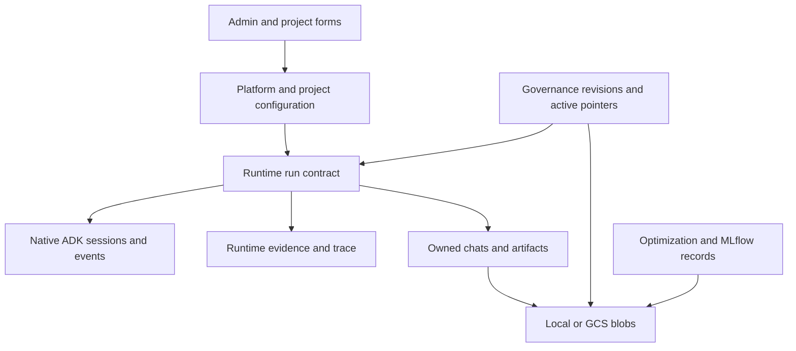
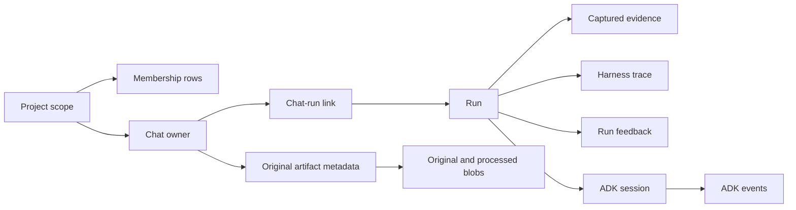
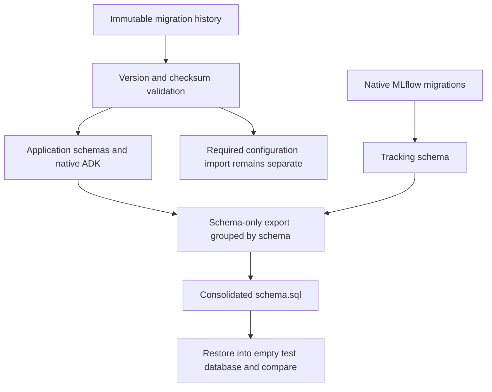

# Data model, table reference and diagnostic queries

This is the application database reference, not an Oracle connector query interface. The examples are read-only operator diagnostics against RCA assist's PostgreSQL database. They do not authorize agents to run SQL or bypass application membership checks. Use [security](security.md#database-and-storage-access) for access boundaries and [operations](operations.md) for migrations, backup and retention.

## Contents

- [Storage ownership map](#storage-ownership-map)
- [Logical relationships](#logical-relationships)
- [Configuration records](#configuration-records)
- [Connector records](#connector-records)
- [Run and evidence records](#run-and-evidence-records)
- [Governance records](#governance-records)
- [Triage records are a separate path](#triage-records-are-a-separate-path)
- [Storage lifecycles](#storage-lifecycles)
- [Read-only sample queries](#read-only-sample-queries)
- [Complete application table inventory](#complete-application-table-inventory)


## Storage ownership map



Reading path: [configuration](#configuration-records) → [governance](#governance-records) → [runs/evidence](#run-and-evidence-records) → [storage](#storage-lifecycles).

| Store/schema | Responsibility | Important distinction |
| --- | --- | --- |
| `platform` | Shared definitions plus many project-scoped administrative records | Schema name does not imply every row is tenant-global |
| `project` | Project scope keys and typed scoped overrides | Scope fields participate in deterministic resolution |
| `runtime` | Runs, captured evidence, chats, artifacts, browser sessions and trace | A persisted run is not a durable queued task |
| `governance` | Reviewable definitions, active selections and audit | Blob presence alone never grants activation |
| `optimization` | Datasets, reviewed revisions and active optimized content | Offline evaluation is not live quality certification |
| `adk` | Native ADK state/session/event tables | Managed through the native session service |
| `mlflow` | Native MLflow tracking schema | Library-owned schema; inspect the installed version rather than inventing a fixed application table list |
| Blob store | Original uploads, extracted artifacts and content-addressed definitions/exports | Database metadata and blobs require coordinated restoration |

Sources: [schema routing](../app/persistence/database.py), [migrations](../migrations/), [database deployment](../scripts/deploy_database.py), [blob ownership](../app/persistence/chat_artifacts.py).

## Logical relationships

This entity diagram shows logical ownership and joins; not every displayed relationship is a physical foreign key. Composite tenant/project predicates remain required. Consult the migrations for actual constraints.



Reading path: [membership](security.md#roles-and-project-membership) → [chat/run records](#run-and-evidence-records) → [native sessions](harness.md#sessions-state-and-events) → [artifacts](#storage-lifecycles).

## Configuration records

`project.projects` supplies the project scope identity used by configuration constraints. `platform.project_catalog` supplies workspace name, description, timezone, status and creator. `platform.project_preferences` records a subject's project preference. Membership and effective roles live in `platform.platform_users`; an entry in a preferences table does not grant membership.

`platform.system_configurations` stores typed document families using tenant, `config_type` and `config_key`. The key/document structure is owned by the corresponding service. Examples include connector field policy and independently reviewed model-pricing/OIDC content. Do not assume every document uses one generic approval schema.

`platform.configuration_bundles` retains hashed file snapshots; `platform.active_configuration` points to a project snapshot. `platform.parameter_definitions` owns typed metadata, defaults, delegation and runtime bindings. `project.parameter_overrides` supplies values at project/instance/environment scope. Existing `platform_settings`, `platform_runtime_stages`, policy, billing and file-limit tables also appear in the administration model; use their service's effective-resolution path rather than declaring every similarly named table equally authoritative.

Sources: [database bundle](../app/configuration/database_bundle.py), [parameters](../app/configuration/parameters.py), [project service](../app/configuration/projects.py), [administration persistence](../app/persistence/platform_admin.py).

## Connector records

| Table | Identity and role |
| --- | --- |
| `platform.connector_templates` | Template ID/version, lifecycle status, definition and checksum |
| `platform.project_connector_instances` | Tenant/project/instance, template version, enabled/status, definition and revision |
| `platform.connector_environment_connections` | Tenant/project/instance/connection, route/auth target, secret references, allowed resources and server-owned test state |
| `platform.project_environment_bindings` | Project environment to external resource/connection assignment |
| `platform.connector_candidate_test_results` | Hash-bound test result, environment/instance/template identity, operation, time and sanitized summary |
| `platform.parameter_definitions` / `project.parameter_overrides` | Shared field contract and effective scoped values |

Connection `credentials_json` contains references where supported; never assume a column named credentials is appropriate to display or bulk export. Test records do not grant capability actions. Sources: [connector migrations](../migrations/history/014_connector_lifecycle.sql), [environment connections](../migrations/history/021_environment_connections.sql), [form lifecycle](connectors.md).

## Run and evidence records

| Table | Interpretation |
| --- | --- |
| `runtime.runs` | Scope, subject, idempotency/request hashes, serialized contract, snapshot hash, deadline, status/stage, result, counts and revision |
| `runtime.evidence` | Scoped run linkage, serialized evidence bundle and content hash |
| `runtime.harness_run_events` | Run sequence, node ID, kind, timestamp and bounded details |
| `runtime.chats` / `runtime.chat_runs` | Conversation ownership and run association |
| `runtime.chat_messages` | Persisted conversation exchanges, clarification choices and attachment references |
| `runtime.run_feedback` | Latest author rating/note and concurrency revision for an eligible run |

`contract_json`, `result_json` and `bundle_json` are serialized application documents; read their model contracts before extracting nested fields. Some are text columns rather than PostgreSQL JSONB, so example queries cast explicitly. Epoch-second business timestamps are distinct from timestamp-typed ETL lineage and native ADK timestamps. Sources: [store definitions](../app/persistence/store.py), [run contract](../app/runtime/run_contract.py), [evidence schema](../app/schemas/evidence.py), [trace](../app/persistence/run_events.py).

## Governance records

Agent drafts and review history use `governance.agent_config_drafts`, `agent_config_audit` and `active_agent_configs`. Harness bundles use `harness_bundles`, `harness_bundle_audit` and `harness_activations`. Their active pointers identify eligible content; history remains separate from current selection.

Knowledge's current document metadata is in `platform.platform_knowledge`; its immutable revisions and audit behavior are owned by the knowledge service. Shared governance audit details also support other reviewed content. Do not invent a `knowledge_revisions` SQL table based on a conceptual lifecycle diagram. Sources: [agent service](../app/configuration/service.py), [harness service](../app/configuration/harness_workspace.py), [knowledge service](../app/configuration/knowledge.py), [review migration](../migrations/history/022_knowledge_review.sql).

## Triage records are a separate path

Migration 028 defines `platform.triage_tickets`, `triage_queue_stays`, `triage_investigations`, `tool_proposals`, `investigation_evidence`, `investigation_findings`, `governed_actions` and `investigation_events`. These are distinct from `runtime.runs` and `runtime.evidence`.

A row in triage `investigation_evidence` is not automatically captured ADK-run evidence. The current triage proposal execution returns synthetic result content; board responses still include static elements; empty projects are no longer seeded. Do not join these concepts by similar names and claim live source provenance. Sources: [triage migration](../migrations/history/028_triage_board.sql), [triage API](../app/api/routes/triage.py).

## Storage lifecycles

An upload has original bytes, processed redacted text, attachment metadata and chat artifact metadata. Original retention and extraction TTL differ. An original can remain downloadable after its extracted text expires. A new run checks ownership and attachment eligibility, then captures bounded evidence from eligible extraction.

Generated terminal exports are derived from retained run/evidence records. Their completed/failed/simulated folder is not an execution state authority. Definition blobs use content hashes while database review state determines eligibility. Manual cleanup and artifact synchronization have separate dry-report/apply actions; there is no automatic all-project cleanup worker. Sources: [artifact service](../app/persistence/chat_artifacts.py), [cleanup](../scripts/cleanup.py), [repair](../scripts/sync_artifacts.py).

## Read-only sample queries

Use a database role with the necessary diagnostic `SELECT` permissions. PostgreSQL access does not call the HTTP authorization layer, so operators must select only the tenant/project they are authorized to inspect. These are examples for manual diagnosis, not runtime SQL tools. They are checked against repository table/column definitions, not executed against a deployed database in this documentation change.

The examples use `psql` variables. Set `tenant_id`, `project_id`, `run_id`, `tool`, `parameter_name`, `instance_id` and `environment_id` to real authorized identifiers using your session's `\set` command. `:'name'` is `psql`'s SQL-literal quoting syntax. Empty instance/environment values in query 7 mean absent scope. Do not paste credentials into these variables or query output.

Run the desired `SELECT` examples inside a bounded read-only transaction:

```sql
BEGIN READ ONLY;
SET LOCAL statement_timeout = '5s';
-- Run the selected SELECT statements below.
ROLLBACK;
```

### 1. Verify installed application migrations

```sql
SELECT version
FROM platform.schema_migrations
ORDER BY version DESC
LIMIT 30;
```

Compare with `SCHEMA_VERSION` in [database startup](../app/persistence/database.py), currently 28. A migration version alone does not prove connector/model readiness.

### 2. Inspect active project membership

```sql
SELECT subject, name, roles, status
FROM platform.platform_users
WHERE tenant_id = :'tenant_id' AND project_id = :'project_id'
ORDER BY subject
LIMIT 100;
```

Membership may change between queries; authentication resolves it again on requests. Avoid exporting email or other personal fields unnecessarily.

### 3. Recent run outcomes

```sql
SELECT run_id, subject, status, stage, reason, evidence_count,
       revision, to_timestamp(created_at) AS started_at
FROM runtime.runs
WHERE tenant_id = :'tenant_id' AND project_id = :'project_id'
ORDER BY created_at DESC
LIMIT 50;
```

### 4. Evidence attached to one authorized run

```sql
SELECT e.evidence_id, e.content_hash,
       e.bundle_json::jsonb AS evidence_bundle
FROM runtime.evidence AS e
JOIN runtime.runs AS r
  ON r.run_id = e.run_id
 AND r.tenant_id = e.tenant_id AND r.project_id = e.project_id
WHERE r.tenant_id = :'tenant_id' AND r.project_id = :'project_id'
  AND r.run_id = :'run_id'
ORDER BY e.evidence_id
LIMIT 100;
```

Even redacted evidence can be sensitive operational data; prefer the scoped evidence API for ordinary users.

### 5. Inspect the frozen workflow and allowed actions

```sql
SELECT run_id, snapshot_hash,
       (contract_json::jsonb ->> 'model_config_json')::jsonb
           -> 'resolved_graph' AS resolved_graph,
       (contract_json::jsonb ->> 'model_config_json')::jsonb
           -> 'allowed_actions' AS allowed_actions
FROM runtime.runs
WHERE tenant_id = :'tenant_id' AND project_id = :'project_id'
  AND run_id = :'run_id'
LIMIT 1;
```

The nested JSON string is why this query casts twice. Historic/incomplete snapshots can lack a requested key.

### 6. Check saved connector assignments

```sql
SELECT i.instance_id, i.template_id, i.template_version,
       i.enabled, i.status, i.revision,
       b.project_env_id, b.external_resource, b.connection_id,
       b.status AS binding_status
FROM platform.project_connector_instances AS i
LEFT JOIN platform.project_environment_bindings AS b
  ON b.tenant_id = i.tenant_id AND b.project_id = i.project_id
 AND b.instance_id = i.instance_id
WHERE i.tenant_id = :'tenant_id' AND i.project_id = :'project_id'
ORDER BY i.instance_id, b.project_env_id
LIMIT 100;
```

Enablement flags alone do not prove a current matching test, healthy source or allowed capability.

### 7. Inspect one parameter's five-level precedence

```sql
WITH candidates AS (
  SELECT o.value, o.revision,
         CASE
           WHEN o.instance_id IS NOT NULL AND o.environment_id IS NOT NULL THEN 1
           WHEN o.instance_id IS NOT NULL THEN 2
           WHEN o.environment_id IS NOT NULL THEN 3
           ELSE 4
         END AS precedence
  FROM project.parameter_overrides AS o
  JOIN platform.parameter_definitions AS d
    ON d.tenant_id = o.tenant_id AND d.tool = o.tool
   AND d.variable_name = o.variable_name
  WHERE o.tenant_id = :'tenant_id' AND o.project_id = :'project_id'
    AND o.tool = :'tool' AND o.variable_name = :'parameter_name'
    AND d.enabled AND d.allow_project_override
    AND (o.instance_id IS NULL OR o.instance_id = NULLIF(:'instance_id', ''))
    AND (o.environment_id IS NULL OR o.environment_id = NULLIF(:'environment_id', ''))
  UNION ALL
  SELECT default_value, revision, 5
  FROM platform.parameter_definitions
  WHERE tenant_id = :'tenant_id' AND tool = :'tool'
    AND variable_name = :'parameter_name' AND enabled
)
SELECT precedence, value, revision
FROM candidates
ORDER BY precedence
LIMIT 5;
```

The first row explains precedence among stored candidates. It does not replace service validation, binding/ownership checks or live activation. No matching configured candidate means missing data, not an invented fallback.

### 8. Inspect reviewable harness revisions

```sql
SELECT draft_id, capability, author_subject, status, reviewer_subject,
       revision, blob_hash, to_timestamp(updated_at) AS updated_at
FROM governance.harness_bundles
WHERE tenant_id = :'tenant_id' AND project_id = :'project_id'
ORDER BY updated_at DESC
LIMIT 50;
```

### 9. Correlate a native ADK session with a run

```sql
SELECT r.run_id, r.status, s.app_name, s.id AS session_id,
       s.create_time, s.update_time
FROM runtime.runs AS r
JOIN adk.sessions AS s ON s.id = r.run_id AND s.app_name = 'app'
WHERE r.tenant_id = :'tenant_id' AND r.project_id = :'project_id'
  AND r.run_id = :'run_id'
LIMIT 10;
```

Preflight-blocked or simulated runs can have no native session. The application also hashes the scoped subject into the native user ID; this query uses the generated run/session identity for diagnosis.

### 10. Follow recorded tool and agent events

```sql
SELECT sequence, node_id, kind, to_timestamp(timestamp) AS occurred_at,
       details_json::jsonb AS details
FROM runtime.harness_run_events
WHERE tenant_id = :'tenant_id' AND project_id = :'project_id'
  AND run_id = :'run_id'
ORDER BY sequence
LIMIT 200;
```

Trace retention/limits can mean this is only part of the execution history. Use the API's coverage/truncation information when presenting it to users.

## Complete application table inventory

The following dictionary is extracted from current SQLAlchemy `Table` declarations and matched to migration-created PostgreSQL schema names. It lists declared business columns and keys; shared ETL lineage fields and migration-only/native tables follow separately. Migrations remain authoritative for physical foreign keys, indexes, checks and database defaults. JSON document fields require their owning service/model for their internal schema.

### governance application tables

#### `governance.active_agent_configs`

Declared primary key: . [Model](../app/configuration/service.py#L49); [creating migration](../migrations/history/001_initial.sql).

`tenant_id` (String(256); required); `project_id` (String(256); required); `agent_id` (String(64); required); `draft_id` (String(128); required); `content_hash` (String(128); required); `updated_at` (Float; required).

#### `governance.agent_config_audit`

Declared primary key: `event_id`. [Model](../app/configuration/service.py#L62); [creating migration](../migrations/history/001_initial.sql).

`event_id` (Integer; required); `draft_id` (String(128); required); `tenant_id` (String(256); required); `project_id` (String(256); required); `event` (String(16); required); `actor_subject` (String(256); required); `reason` (String; required); `created_at` (Float; required).

#### `governance.agent_config_drafts`

Declared primary key: `draft_id`. [Model](../app/configuration/service.py#L34); [creating migration](../migrations/history/001_initial.sql).

`draft_id` (String(128); required); `tenant_id` (String(256); required); `project_id` (String(256); required); `author_subject` (String(256); required); `definition_json` (String; required); `blob_hash` (String(128); required); `status` (String(16); required); `created_at` (Float; required); `reviewed_at` (Float; nullable); `reviewer_subject` (String(256); nullable); `review_reason` (String; nullable).

#### `governance.harness_activations`

Declared primary key: `tenant_id`, `project_id`, `capability`. [Model](../app/configuration/harness_workspace.py#L36); [creating migration](../migrations/history/007_harness_workspace.sql).

`tenant_id` (String(256); required); `project_id` (String(256); required); `capability` (String(128); required); `draft_id` (String(128); required); `revision` (String(128); required).

#### `governance.harness_bundle_audit`

Declared primary key: `id`. [Model](../app/configuration/harness_workspace.py#L42); [creating migration](../migrations/history/007_harness_workspace.sql).

`id` (String(128); required); `draft_id` (String(128); required); `tenant_id` (String(256); required); `project_id` (String(256); required); `actor` (String(256); required); `action` (String(32); required); `revision` (String(128); required); `blob_hash` (String(128); nullable); `timestamp` (Float; required); `reason` (String(2000); required).

#### `governance.harness_bundles`

Declared primary key: `draft_id`. [Model](../app/configuration/harness_workspace.py#L23); [creating migration](../migrations/history/007_harness_workspace.sql).

`draft_id` (String(128); required); `tenant_id` (String(256); required); `project_id` (String(256); required); `capability` (String(128); required); `author_subject` (String(256); required); `blob_hash` (String(128); required); `revision` (String(128); required); `status` (String(32); required); `reviewer_subject` (String(256); nullable); `reason` (String(2000); nullable); `created_at` (Float; required); `updated_at` (Float; required).

#### `governance.parameter_audit`

Declared primary key: `event_id`. [Model](../app/configuration/parameters.py#L118); [creating migration](../migrations/history/001_initial.sql).

`event_id` (Integer; required); `tenant_id` (String(256); required); `project_id` (String(256); nullable); `tool` (String(64); required); `variable_name` (String(64); required); `actor_subject` (String(256); required); `action` (String(32); required); `revision` (Integer; required); `details` (JSON().with_variant(JSONB, 'postgresql'); nullable); `created_at` (Float; required).

### optimization application tables

#### `optimization.active_optimized_content`

Declared primary key: `tenant_id`, `project_id`. [Model](../app/optimization/service.py#L74); [creating migration](../migrations/history/001_initial.sql).

`tenant_id` (String(256); required); `project_id` (String(256); required); `report_hash` (String(128); required); `optimization_id` (String(128); required).

#### `optimization.optimization_datasets`

Declared primary key: `record_id`. [Model](../app/optimization/service.py#L40); [creating migration](../migrations/history/001_initial.sql).

`record_id` (String(128); required); `tenant_id` (String(256); required); `project_id` (String(256); required); `dataset_id` (String(64); required); `version` (String(64); required); `blob_hash` (String(128); required); `purpose` (String(32); required); `metadata_json` (String; required); `author_subject` (String(256); required); `created_at` (Float; required).

#### `optimization.optimization_revisions`

Declared primary key: `optimization_id`. [Model](../app/optimization/service.py#L55); [creating migration](../migrations/history/001_initial.sql).

`optimization_id` (String(128); required); `tenant_id` (String(256); required); `project_id` (String(256); required); `author_subject` (String(256); required); `request_json` (String; required); `dataset_hash` (String(128); required); `parent_hash` (String(128); nullable); `context_hash` (String(128); required); `report_hash` (String(128); nullable); `status` (String(32); required); `reason` (String; nullable); `created_at` (Float; required); `deadline` (Float; required); `reviewer_subject` (String(256); nullable); `reviewed_at` (Float; nullable).

### platform application tables

#### `platform.active_configuration`

Declared primary key: `tenant_id`, `project_id`. [Model](../app/configuration/database_bundle.py#L41); [creating migration](../migrations/history/001_initial.sql).

`tenant_id` (String(256); required); `project_id` (String(256); required); `content_hash` (String(128); required).

#### `platform.configuration_bundles`

Declared primary key: `tenant_id`, `project_id`, `content_hash`. [Model](../app/configuration/database_bundle.py#L32); [creating migration](../migrations/history/001_initial.sql).

`tenant_id` (String(256); required); `project_id` (String(256); required); `content_hash` (String(128); required); `files` (JSON().with_variant(JSONB, 'postgresql'); required); `created_at` (Float; required).

#### `platform.connector_candidate_test_results`

Declared primary key: `candidate_hash`, `tenant_id`, `project_id`, `environment_id`. [Model](../app/persistence/platform_admin.py#L301); [creating migration](../migrations/history/014_connector_lifecycle.sql).

`candidate_hash` (String(64); required); `tenant_id` (String(256); required); `project_id` (String(256); required); `environment_id` (String(64); required); `instance_id` (String(64); required); `template_id` (String(64); required); `template_version` (String(32); required); `operation` (String(64); required); `overall_result` (String(32); required); `stage_results_json` (JSON().with_variant(JSONB, 'postgresql'); required); `latency_ms` (Float; required); `evidence_summary` (String(4096); required); `error_message` (String(4096); required); `tested_at` (Float; required).

#### `platform.connector_environment_connections`

Declared primary key: `tenant_id`, `project_id`, `instance_id`, `connection_id`. [Model](../app/persistence/platform_admin.py#L277); [creating migration](../migrations/history/021_environment_connections.sql).

`tenant_id` (String(256); required); `project_id` (String(256); required); `instance_id` (String(64); required); `connection_id` (String(64); required); `connection_name` (String(128); required); `environment_name` (String(64); required); `enabled` (Boolean; required); `routing_mode` (String(32); required); `auth_profile_id` (String(64); nullable); `target_json` (JSON().with_variant(JSONB, 'postgresql'); required); `credentials_json` (JSON().with_variant(JSONB, 'postgresql'); required); `mcp_config_json` (JSON().with_variant(JSONB, 'postgresql'); required); `resource_scope_json` (JSON().with_variant(JSONB, 'postgresql'); required); `status` (String(32); required); `test_status` (String(32); required); `last_tested_at` (Float; nullable); `created_at` (Float; required); `updated_at` (Float; required).

#### `platform.connector_templates`

Declared primary key: `template_id`, `version`. [Model](../app/persistence/platform_admin.py#L227); [creating migration](../migrations/history/014_connector_lifecycle.sql).

`template_id` (String(64); required); `version` (String(32); required); `status` (String(32); required); `definition_json` (JSON().with_variant(JSONB, 'postgresql'); required); `checksum` (String(64); required); `created_at` (Float; required); `updated_at` (Float; required); `created_by` (String(256); required); `updated_by` (String(256); required).

#### `platform.governed_actions`

Declared primary key: `action_id`. [Model](../app/persistence/triage.py#L143); [creating migration](../migrations/history/028_triage_board.sql).

`action_id` (String(64); required); `investigation_id` (String(64); required); `ticket_id` (String(128); required); `tenant_id` (String(256); required); `project_id` (String(256); required); `action_type` (String(64); required); `title` (String(256); required); `target` (String(128); required); `payload` (JSON().with_variant(JSONB, 'postgresql'); required); `status` (String(32); required); `requested_by` (String(128); required); `approved_by` (String(128); nullable); `executed_at` (Float; nullable); `created_at` (Float; required).

#### `platform.integration_configurations`

Declared primary key: `tenant_id`, `project_id`, `integration_id`. [Model](../app/configuration/integrations.py#L16); [creating migration](../migrations/history/004_integrations.sql).

`tenant_id` (String(256); required); `project_id` (String(256); required); `integration_id` (String(64); required); `definition_json` (String; required); `revision` (String(32); required).

#### `platform.investigation_events`

Declared primary key: `event_id`. [Model](../app/persistence/triage.py#L162); [creating migration](../migrations/history/028_triage_board.sql).

`event_id` (String(64); required); `ticket_id` (String(128); required); `investigation_id` (String(64); nullable); `tenant_id` (String(256); required); `project_id` (String(256); required); `event_type` (String(64); required); `actor_type` (String(16); required); `actor_id` (String(128); required); `summary` (String(512); required); `payload` (JSON().with_variant(JSONB, 'postgresql'); required); `occurred_at` (Float; required).

#### `platform.investigation_evidence`

Declared primary key: `evidence_id`. [Model](../app/persistence/triage.py#L111); [creating migration](../migrations/history/028_triage_board.sql).

`evidence_id` (String(64); required); `investigation_id` (String(64); required); `ticket_id` (String(128); required); `tenant_id` (String(256); required); `project_id` (String(256); required); `source` (String(64); required); `query_ref` (String(256); nullable); `summary` (String(512); required); `payload_json` (JSON().with_variant(JSONB, 'postgresql'); required); `status` (String(32); required); `confidence` (Float; required); `created_at` (Float; required).

#### `platform.investigation_findings`

Declared primary key: `finding_id`. [Model](../app/persistence/triage.py#L128); [creating migration](../migrations/history/028_triage_board.sql).

`finding_id` (String(64); required); `investigation_id` (String(64); required); `ticket_id` (String(128); required); `tenant_id` (String(256); required); `project_id` (String(256); required); `statement` (Text; required); `confidence` (Float; required); `status` (String(32); required); `evidence_refs` (JSON().with_variant(JSONB, 'postgresql'); required); `created_at` (Float; required).

#### `platform.parameter_definitions`

Declared primary key: `tenant_id`, `tool`, `variable_name`. [Model](../app/configuration/parameters.py#L48); [creating migration](../migrations/history/001_initial.sql).

`tenant_id` (String(256); required); `tool` (String(64); required); `variable_name` (String(64); required); `value_type` (String(16); required); `description` (String(2000); required); `default_value` (JSON().with_variant(JSONB, 'postgresql'); required); `enabled` (Boolean; required); `allow_project_override` (Boolean; required); `category` (String(120); required); `subcategory` (String(120); nullable); `allowed_values` (JSON().with_variant(JSONB, 'postgresql'); nullable); `scope` (String(16); required); `icon` (String(64); required); `label` (String(256); nullable); `section` (String(64); nullable); `display_order` (Integer; nullable); `is_required` (Boolean; required); `ownership` (String(32); required); `validation_rules` (JSON().with_variant(JSONB, 'postgresql'); nullable); `runtime_binding` (String(128); nullable); `revision` (Integer; required); `updated_at` (Float; required).

#### `platform.platform_alert_config`

Declared primary key: `tenant_id`, `project_id`. [Model](../app/persistence/platform_admin.py#L148); [creating migration](../migrations/history/006_platform_admin.sql).

`tenant_id` (String(256); required); `project_id` (String(256); required); `mttr_warning_minutes` (Integer; required); `tool_failure_rate_percent` (Integer; required); `probe_latency_warning_ms` (Integer; required); `updated_at` (Float; required).

#### `platform.platform_alerts`

Declared primary key: `alert_id`. [Model](../app/persistence/platform_admin.py#L130); [creating migration](../migrations/history/006_platform_admin.sql).

`alert_id` (String(128); required); `tenant_id` (String(256); required); `project_id` (String(256); required); `severity` (String(32); required); `source` (String(64); required); `component` (String(128); required); `title` (String(256); required); `summary` (String(1000); required); `message` (String; required); `status` (String(32); required); `resolution_note` (String; nullable); `created_at` (Float; required); `resolved_at` (Float; nullable).

#### `platform.platform_billing`

Declared primary key: `tenant_id`, `project_id`. [Model](../app/persistence/platform_admin.py#L59); [creating migration](../migrations/history/006_platform_admin.sql).

`tenant_id` (String(256); required); `project_id` (String(256); required); `tier` (String(64); required); `monthly_spend_budget` (Float; required); `monthly_token_budget` (Integer; required); `max_concurrent_investigations` (Integer; required); `rate_limit_rpm` (Integer; required); `rate_limit_tpm` (Integer; required); `alert_threshold_percent` (Integer; required); `webhook_url` (String(1024); nullable); `pricing_matrix` (JSON().with_variant(JSONB, 'postgresql'); required); `updated_at` (Float; required).

#### `platform.platform_file_limits`

Declared primary key: `tenant_id`, `project_id`. [Model](../app/persistence/platform_admin.py#L87); [creating migration](../migrations/history/006_platform_admin.sql).

`tenant_id` (String(256); required); `project_id` (String(256); required); `max_file_bytes` (Integer; required); `max_files` (Integer; required); `max_text_chars` (Integer; required); `max_pdf_pages` (Integer; required); `max_rows` (Integer; required); `max_cells` (Integer; required); `parser_timeout_seconds` (Integer; required); `concurrency` (Integer; required); `allowed_extensions` (JSON().with_variant(JSONB, 'postgresql'); required); `retention_days` (Integer; required); `auto_prune_enabled` (Boolean; required); `updated_at` (Float; required).

#### `platform.platform_knowledge`

Declared primary key: `doc_id`. [Model](../app/persistence/platform_admin.py#L106); [creating migration](../migrations/history/006_platform_admin.sql).

`doc_id` (String(128); required); `tenant_id` (String(256); required); `project_id` (String(256); required); `title` (String(256); required); `category` (String(128); required); `tags` (JSON().with_variant(JSONB, 'postgresql'); required); `content` (String; required); `media_type` (String(64); required); `upload` (JSON().with_variant(JSONB, 'postgresql'); nullable); `size_bytes` (Integer; required); `status` (String(32); required); `revision` (Integer; required); `content_hash` (String(128); nullable); `author_subject` (String(256); nullable); `reviewer_subject` (String(256); nullable); `reviewed_at` (Float; nullable); `review_reason` (String(2000); nullable); `created_at` (Float; required); `updated_at` (Float; required).

#### `platform.platform_notification_reads`

Declared primary key: `notification_id`, `tenant_id`, `project_id`, `subject`. [Model](../app/persistence/platform_admin.py#L159); [creating migration](../migrations/history/012_notification_reads.sql).

`notification_id` (String(128); required); `tenant_id` (String(256); required); `project_id` (String(256); required); `subject` (String(256); required); `read_at` (Float; required).

#### `platform.platform_policy`

Declared primary key: `tenant_id`, `project_id`. [Model](../app/persistence/platform_admin.py#L76); [creating migration](../migrations/history/006_platform_admin.sql).

`tenant_id` (String(256); required); `project_id` (String(256); required); `redaction_patterns` (JSON().with_variant(JSONB, 'postgresql'); required); `guardrails` (JSON().with_variant(JSONB, 'postgresql'); required); `skill_guardrails` (JSON().with_variant(JSONB, 'postgresql'); required); `updated_at` (Float; required).

#### `platform.platform_roles`

Declared primary key: `role_id`, `tenant_id`. [Model](../app/persistence/platform_admin.py#L46); [creating migration](../migrations/history/006_platform_admin.sql).

`role_id` (String(64); required); `tenant_id` (String(256); required); `name` (String(256); required); `description` (String(1000); required); `permissions` (JSON().with_variant(JSONB, 'postgresql'); required); `is_system` (Boolean; required); `status` (String(32); required); `updated_at` (Float; required).

#### `platform.platform_runtime_stages`

Declared primary key: `stage_id`, `tenant_id`, `project_id`. [Model](../app/persistence/platform_admin.py#L169); [creating migration](../migrations/history/006_platform_admin.sql).

`stage_id` (String(64); required); `tenant_id` (String(256); required); `project_id` (String(256); required); `name` (String(256); required); `model` (String(128); required); `thinking_level` (String(64); required); `thinking_budget` (Integer; required); `output_limit` (Integer; required); `temperature` (Float; required); `tool_limit` (Integer; required); `tools` (JSON().with_variant(JSONB, 'postgresql'); required); `instruction` (String; required); `enabled` (Boolean; required); `updated_at` (Float; required).

#### `platform.platform_settings`

Declared primary key: `tenant_id`, `project_id`. [Model](../app/persistence/platform_admin.py#L188); [creating migration](../migrations/history/006_platform_admin.sql).

`tenant_id` (String(256); required); `project_id` (String(256); required); `run_timeout_seconds` (Integer; required); `max_concurrent_runs` (Integer; required); `max_llm_calls` (Integer; required); `max_input_chars` (Integer; required); `max_context_chars` (Integer; required); `retention_days` (Integer; required); `allowed_extensions` (JSON().with_variant(JSONB, 'postgresql'); required); `mode` (String(32); required); `updated_at` (Float; required).

#### `platform.platform_ui_settings`

Declared primary key: `tenant_id`, `project_id`. [Model](../app/persistence/platform_admin.py#L204); [creating migration](../migrations/history/008_platform_ui_settings.sql).

`tenant_id` (String(256); required); `project_id` (String(256); required); `brand_name` (String(120); required); `workspace_label` (String(120); required); `default_theme` (String(16); required); `default_page` (String(64); required); `welcome_title` (String(200); required); `welcome_description` (String(1000); required); `navigation` (JSON().with_variant(JSONB, 'postgresql'); required); `version` (Integer; required); `updated_at` (Float; required).

#### `platform.platform_users`

Declared primary key: `subject`, `tenant_id`, `project_id`. [Model](../app/persistence/platform_admin.py#L32); [creating migration](../migrations/history/006_platform_admin.sql).

`subject` (String(256); required); `tenant_id` (String(256); required); `project_id` (String(256); required); `name` (String(256); required); `email` (String(256); nullable); `roles` (JSON().with_variant(JSONB, 'postgresql'); required); `status` (String(32); required); `created_at` (Float; required); `updated_at` (Float; required).

#### `platform.project_catalog`

Declared primary key: `tenant_id`, `project_id`. [Model](../app/configuration/projects.py#L20); [creating migration](../migrations/history/026_project_workspaces.sql).

`tenant_id` (String(256); required); `project_id` (String(256); required); `name` (String(200); required); `description` (String(4000); required); `timezone` (String(100); required); `status` (String(32); required); `created_by` (String(256); required); `created_at` (Float; required); `updated_at` (Float; required).

#### `platform.project_connector_instances`

Declared primary key: `tenant_id`, `project_id`, `instance_id`. [Model](../app/persistence/platform_admin.py#L241); [creating migration](../migrations/history/014_connector_lifecycle.sql).

`tenant_id` (String(256); required); `project_id` (String(256); required); `instance_id` (String(64); required); `template_id` (String(64); required); `template_version` (String(32); required); `system_name` (String(128); required); `enabled` (Boolean; required); `status` (String(32); required); `definition_json` (JSON().with_variant(JSONB, 'postgresql'); required); `revision` (Integer; required); `created_at` (Float; required); `updated_at` (Float; required); `created_by` (String(256); required); `updated_by` (String(256); required).

#### `platform.project_editor_drafts`

Declared primary key: `tenant_id`, `project_id`. [Model](../app/persistence/platform_admin.py#L220); [creating migration](../migrations/history/011_project_editor_drafts.sql).

`tenant_id` (String(256); required); `project_id` (String(256); required); `document` (JSON().with_variant(JSONB, 'postgresql'); required); `version` (Integer; required); `updated_at` (Float; required).

#### `platform.project_environment_bindings`

Declared primary key: `tenant_id`, `project_id`, `instance_id`, `project_env_id`. [Model](../app/persistence/platform_admin.py#L260); [creating migration](../migrations/history/014_connector_lifecycle.sql).

`tenant_id` (String(256); required); `project_id` (String(256); required); `instance_id` (String(64); required); `project_env_id` (String(64); required); `tool_env_id` (String(64); required); `external_resource` (String(256); required); `credential_binding_id` (String(128); nullable); `connection_id` (String(64); nullable); `narrowing_filters_json` (JSON().with_variant(JSONB, 'postgresql'); required); `status` (String(32); required); `created_at` (Float; required); `updated_at` (Float; required).

#### `platform.project_preferences`

Declared primary key: `tenant_id`, `subject`. [Model](../app/configuration/projects.py#L30); [creating migration](../migrations/history/026_project_workspaces.sql).

`tenant_id` (String(256); required); `subject` (String(256); required); `project_id` (String(256); required); `last_accessed_at` (Float; required).

#### `platform.project_templates`

Declared primary key: `tenant_id`, `template_id`, `version`. [Model](../app/configuration/project_templates.py#L13); [creating migration](../migrations/history/018_project_templates.sql).

`tenant_id` (String(256); required); `template_id` (String(64); required); `version` (String(32); required); `name` (String(200); required); `definition` (JSON().with_variant(JSONB, 'postgresql'); required); `status` (String(16); required); `revision` (Integer; required); `checksum` (String(128); required); `updated_at` (Float; required); `updated_by` (String(256); required).

#### `platform.system_configurations`

Declared primary key: `tenant_id`, `config_type`, `config_key`. [Model](../app/configuration/parameters.py#L107); [creating migration](../migrations/history/019_database_first_parameters.sql).

`tenant_id` (String(256); required); `config_type` (String(64); required); `config_key` (String(128); required); `content_json` (JSON().with_variant(JSONB, 'postgresql'); required); `revision` (Integer; required); `updated_at` (Float; required).

#### `platform.tool_proposals`

Declared primary key: `proposal_id`. [Model](../app/persistence/triage.py#L89); [creating migration](../migrations/history/028_triage_board.sql).

`proposal_id` (String(64); required); `investigation_id` (String(64); required); `ticket_id` (String(128); required); `tenant_id` (String(256); required); `project_id` (String(256); required); `capability` (String(64); required); `title` (String(256); required); `rationale` (Text; required); `generated_query` (Text; required); `current_query` (Text; required); `parameters` (JSON().with_variant(JSONB, 'postgresql'); required); `status` (String(32); required); `latest_result` (JSON().with_variant(JSONB, 'postgresql'); nullable); `execution_count` (Integer; required); `is_recommended` (Boolean; required); `created_at` (Float; required); `updated_at` (Float; required).

#### `platform.triage_investigations`

Declared primary key: `investigation_id`. [Model](../app/persistence/triage.py#L72); [creating migration](../migrations/history/028_triage_board.sql).

`investigation_id` (String(64); required); `ticket_id` (String(128); required); `tenant_id` (String(256); required); `project_id` (String(256); required); `state` (String(32); required); `owner` (String(128); nullable); `auto_triage_run_id` (String(128); nullable); `auto_triage_summary` (JSON().with_variant(JSONB, 'postgresql'); required); `what_changed` (JSON().with_variant(JSONB, 'postgresql'); required); `created_at` (Float; required); `updated_at` (Float; required); `finalized_at` (Float; nullable).

#### `platform.triage_queue_stays`

Declared primary key: `stay_id`. [Model](../app/persistence/triage.py#L57); [creating migration](../migrations/history/028_triage_board.sql).

`stay_id` (String(64); required); `ticket_id` (String(128); required); `tenant_id` (String(256); required); `project_id` (String(256); required); `entered_at` (Float; required); `exited_at` (Float; nullable); `accountable_duration` (Float; required); `reason` (String(256); required); `previous_team` (String(128); nullable); `created_at` (Float; required).

#### `platform.triage_tickets`

Declared primary key: `ticket_id`, `tenant_id`, `project_id`. [Model](../app/persistence/triage.py#L35); [creating migration](../migrations/history/028_triage_board.sql).

`ticket_id` (String(128); required); `tenant_id` (String(256); required); `project_id` (String(256); required); `summary` (String(512); required); `description` (Text; required); `priority` (String(16); required); `status` (String(64); required); `work_state` (String(64); required); `current_team` (String(128); required); `assignee` (String(128); nullable); `reporter` (String(128); nullable); `environment` (String(64); nullable); `service` (String(128); nullable); `labels` (JSON().with_variant(JSONB, 'postgresql'); required); `custom_fields` (JSON().with_variant(JSONB, 'postgresql'); required); `created_at` (Float; required); `updated_at` (Float; required).

### project application tables

#### `project.parameter_overrides`

Declared primary key: `override_id`. [Model](../app/configuration/parameters.py#L79); [creating migration](../migrations/history/001_initial.sql).

`override_id` (Integer; required); `tenant_id` (String(256); required); `project_id` (String(256); required); `tool` (String(64); required); `variable_name` (String(64); required); `instance_id` (String(128); nullable); `environment_id` (String(64); nullable); `value` (JSON().with_variant(JSONB, 'postgresql'); required); `revision` (Integer; required); `updated_at` (Float; required).

#### `project.projects`

Declared primary key: `tenant_id`, `project_id`. [Model](../app/configuration/parameters.py#L40); [creating migration](../migrations/history/001_initial.sql).

`tenant_id` (String(256); required); `project_id` (String(256); required); `project_name` (String(256); required).

### runtime application tables

#### `runtime.attachments`

Declared primary key: `attachment_id`. [Model](../app/persistence/store.py#L72); [creating migration](../migrations/history/001_initial.sql).

`attachment_id` (String(128); required); `tenant_id` (String(256); required); `project_id` (String(256); required); `subject` (String(256); required); `payload_json` (String; required); `created_at` (Float; required); `expires_at` (Float; required).

#### `runtime.browser_sessions`

Declared primary key: `session_hash`. [Model](../app/configuration/oidc.py#L96); [creating migration](../migrations/history/024_oidc_browser_sessions.sql).

`session_hash` (String(64); required); `tenant_id` (String(256); required); `project_id` (String(256); required); `subject` (String(256); required); `issuer` (String(2048); required); `configuration_hash` (String(128); required); `csrf_hash` (String(64); required); `created_at` (Float; required); `expires_at` (Float; required).

#### `runtime.chat_artifacts`

Declared primary key: `artifact_id`. [Model](../app/persistence/chat_artifacts.py#L27); [creating migration](../migrations/history/001_initial.sql).

`artifact_id` (String(128); required); `chat_id` (String(128); required); `attachment_id` (String(128); required); `tenant_id` (String(256); required); `project_id` (String(256); required); `subject` (String(256); required); `filename` (String; required); `media_type` (String(256); required); `sha256` (String(64); required); `processed_hash` (String(128); required); `processed_expires_at` (Float; required); `size_bytes` (Integer; required); `status` (String(16); required); `created_at` (Float; required); `expires_at` (Float; required).

#### `runtime.chat_messages`

Declared primary key: `sequence`. [Model](../app/persistence/chat_messages.py#L13); [creating migration](../migrations/history/025_chat_messages.sql).

`sequence` (Integer; required); `message_id` (String(64); required); `exchange_id` (String(64); required); `tenant_id` (String(256); required); `project_id` (String(256); required); `subject` (String(256); required); `chat_id` (String(128); required); `role` (String(16); required); `content` (String; required); `kind` (String(32); required); `reason_code` (String(64); nullable); `choices_json` (String; required); `attachment_ids_json` (String; required); `created_at` (Float; required).

#### `runtime.chat_runs`

Declared primary key: `run_id`. [Model](../app/persistence/store.py#L93); [creating migration](../migrations/history/001_initial.sql).

`run_id` (String(128); required); `chat_id` (String(128); required).

#### `runtime.chats`

Declared primary key: `chat_id`. [Model](../app/persistence/store.py#L84); [creating migration](../migrations/history/001_initial.sql).

`chat_id` (String(128); required); `tenant_id` (String(256); required); `project_id` (String(256); required); `subject` (String(256); required); `created_at` (Float; required).

#### `runtime.evidence`

Declared primary key: `evidence_id`. [Model](../app/persistence/store.py#L62); [creating migration](../migrations/history/001_initial.sql).

`evidence_id` (String(128); required); `run_id` (String(128); required); `tenant_id` (String(256); required); `project_id` (String(256); required); `bundle_json` (String; required); `content_hash` (String(128); required).

#### `runtime.harness_run_events`

Declared primary key: `run_id`, `sequence`. [Model](../app/persistence/run_events.py#L30); [creating migration](../migrations/history/007_harness_workspace.sql).

`run_id` (String(128); required); `sequence` (Integer; required); `tenant_id` (String(256); required); `project_id` (String(256); required); `node_id` (String(256); required); `kind` (String(64); required); `timestamp` (Float; required); `details_json` (String; required).

#### `runtime.oidc_login_transactions`

Declared primary key: `state_hash`. [Model](../app/configuration/oidc.py#L90); [creating migration](../migrations/history/024_oidc_browser_sessions.sql).

`state_hash` (String(64); required); `tenant_id` (String(256); required); `project_id` (String(256); required); `browser_hash` (String(64); required); `nonce_hash` (String(64); required); `code_verifier` (String(128); required); `configuration_hash` (String(128); required); `expires_at` (Float; required).

#### `runtime.playground_runs`

Declared primary key: `run_id`. [Model](../app/runtime/playground.py#L30); [creating migration](../migrations/history/017_playground_runs.sql).

`run_id` (String(64); required); `tenant_id` (String(256); required); `owner_key` (String(128); required); `capability` (String(128); required); `status` (String(32); required); `prompt` (String; required); `result` (String; nullable); `created_at` (Float; required); `deadline` (Float; required); `updated_at` (Float; required).

#### `runtime.run_feedback`

Declared primary key: `run_id`. [Model](../app/persistence/feedback.py#L10); [creating migration](../migrations/history/027_run_feedback.sql).

`run_id` (String(128); required); `tenant_id` (String(256); required); `project_id` (String(256); required); `subject` (String(256); required); `rating` (String(32); required); `note` (String; required); `revision` (Integer; required); `created_at` (Float; required); `updated_at` (Float; required).

#### `runtime.runs`

Declared primary key: `run_id`. [Model](../app/persistence/store.py#L40); [creating migration](../migrations/history/001_initial.sql).

`run_id` (String(128); required); `tenant_id` (String(256); required); `project_id` (String(256); required); `subject` (String(256); required); `idempotency_key_hash` (String(64); nullable); `request_hash` (String(128); required); `contract_json` (String; required); `snapshot_hash` (String(128); required); `deadline` (Float; required); `status` (String(32); required); `stage` (String(128); required); `result_json` (String; nullable); `reason` (String; nullable); `trace_id` (String(256); nullable); `evidence_count` (Integer; required); `revision` (Integer; required); `created_at` (Float; required); `updated_at` (Float; required).

### Native, migration and lineage records

| Table | Meaning | Source |
| --- | --- | --- |
| `adk.adk_internal_metadata` | Native ADK schema metadata | [Migration](../migrations/history/001_initial.sql) |
| `adk.app_states` | Native ADK application state | [Migration](../migrations/history/001_initial.sql) |
| `adk.events` | Native ADK event payloads linked to sessions | [Migration](../migrations/history/001_initial.sql) |
| `adk.sessions` | Native ADK per-run session identity/state | [Migration](../migrations/history/001_initial.sql) |
| `adk.user_states` | Native ADK user state | [Migration](../migrations/history/001_initial.sql) |

`platform.schema_migrations` is managed by the migration runner and records applied versions/checksums. Shared lineage columns include `etl_loaded_at`, `etl_source_system` and `etl_batch_id`; tracking migrations add audit/tracking fields where defined. These fields are separate from the business timestamps shown above. Inspect the migration SQL for the exact table coverage, triggers and grants. [Migration runner](../scripts/migrate.py), [initial DDL](../migrations/history/001_initial.sql), [actor tracking](../migrations/history/002_etl_actors.sql), [tracking columns](../migrations/history/003_tracking_columns.sql).

## Proposed OKF persistence extension

The [OKF mapping](knowledge.md#okf-content-model-and-mapping) proposes a versioned metadata envelope and stable concept/import identity attached to existing knowledge records. These are not present columns or tables. A future migration must preserve verification of historical immutable snapshots; never backfill new fields into old hashed content.

## Consolidated DDL and schema design

[Consolidated schema SQL](../migrations/schema.sql) is the complete schema-only reference generated from application migrations plus native MLflow migrations. It groups seven schemas into two dependency-safe passes: tables/sequences/functions first, then constraints/indexes/triggers. Each section explains its ownership and purpose. It includes schema defaults and grants, but no application rows, demo records, migration-ledger values or native version records.

| Schema | Design responsibility |
| --- | --- |
| `platform` | Shared configuration, membership/catalog data, connectors and reviewed knowledge; scope columns distinguish tenant/project ownership |
| `project` | Bootstrap project identity and deterministic parameter overrides; validation depends on platform definitions |
| `runtime` | Runs, evidence, conversations, browser sessions and feedback; foreign keys preserve record relationships |
| `governance` | Reviewed drafts, activation and audit history; hashes bind approval to content |
| `optimization` | Dataset registrations, evaluation revisions and current project content pointer |
| `adk` | Native agent sessions, events and state; upstream metadata requirements remain intact |
| `mlflow` | Native tracking/evaluation and prompt registry objects; upstream migrations own their evolution |



Reading path: [history](../migrations/history) → [migration runner](../scripts/migrate.py) → [schema reference](../migrations/schema.sql) → [restoration test](../tests/integration/test_database_ddl.py) → [operations](operations.md#database-ddl-maintenance-and-seed-policy).

### Migration and data boundaries

The 28 historical SQL files were relocated without changing their bytes; the runner still checks their original versions and hashes. Fresh and existing installations use the same upgrade chain. Add future numbered migrations in `migrations/history` and regenerate the consolidated reference afterward. Do not apply `schema.sql` over an existing database or mark it as migrated: it intentionally contains no ledger/native-version data. The reference is a review/verification artifact, not a replacement deployment command.

Foreign-key constraints are emitted after all tables, because grouping complete schema scripts independently would break references across schemas. Audit functions and triggers remain in the generated DDL. Migration-defined privileges are retained; deployment additionally provisions the restricted role and applies its final grants. Role passwords and role ownership are not exported. Required native metadata and reviewed configuration are deployment data and remain outside this schema-only reference. Sources: [exporter](../scripts/export_database_ddl.py), [deployment](../scripts/deploy_database.py).

### Demo-data removal

The runtime triage seeder was removed. Reading an empty board now returns an empty ticket queue; requesting an unknown ticket returns `404` without populating the project. Persistence/workflow tests create a single explicit fixture under `tests/`, and application code does not import it. Required project/configuration/parameter bootstrap and native ADK/MLflow version metadata remain.

This source cleanup does not delete previously persisted rows in an operator database. Existing demo rows cannot safely be distinguished from later user-edited records by a ticket ID alone; any database cleanup needs a reviewed scoped record list and backups. Static triage response cards and synthetic proposal execution remain separately documented implementation gaps. Sources: [triage handlers](../app/api/routes/triage.py), [empty-board regression](../tests/integration/test_triage_board_api.py), [isolated fixture](../tests/triage_support.py), [triage boundary](project.md#triage-workspace-implementation-boundary).
