# Development guidelines

Read [AGENTS.md](../AGENTS.md) before making changes. Keep changes focused, complete and reviewable. Extend existing services and components before adding a new abstraction or dependency.

## Contents

- [Chat and metrics delivery plan](#chat-and-metrics-delivery-plan)
- [Metric definitions and acceptance](#metric-definitions-and-acceptance)

- [Engineering contract](#engineering-contract)
- [Change workflow](#change-workflow)
- [Frontend standards](#frontend-standards)
- [Verification](#verification)
- [Documentation maintenance](#documentation-maintenance)
- [Workflow: trace a change before implementation](#workflow-trace-a-change-before-implementation)
- [Workflow: deliver a complete vertical change](#workflow-deliver-a-complete-vertical-change)
- [Documentation structure and consolidation rules](#documentation-structure-and-consolidation-rules)
- [Extension delivery reading path](#extension-delivery-reading-path)
- [Local frontend and ADK development entrypoints](#local-frontend-and-adk-development-entrypoints)


## Chat and metrics delivery plan

**Proposed work: extend existing modules.** Follow the [product contract](project.md#chat-and-metrics-development-contract) and [integration architecture](architecture.md#chat-integration-with-the-existing-framework). Trace callers before shared changes; preserve unrelated edits.

| Phase | Work | Exit evidence |
| --- | --- | --- |
| 1. Baseline | Trace Chat → intent/chat/run APIs → runner → ADK → stores; inventory metric fields | Source mapping, authorization matrix, lifecycle semantics and known telemetry gaps |
| 2. Conversations | Extend existing history, pagination, follow-up context and attachments | Owner/project isolation, reload order, bounded context, duplicate-submission protection |
| 3. Investigation UI | Real activity, cancellation, citations and partial failures | Reconnect/deduplication, submission disconnect, cancellation races, terminal outcomes and evidence access verified |
| 4. Optional CopilotKit trial | Pin compatible React/CopilotKit/AG-UI/ADK versions; send one real investigation through the existing runner | Same authorization, history, persistence, events and cancellation; no second runtime/store. Retain current transport if the adapter does not reduce complexity. |
| 5. Project metrics | Extend existing telemetry/metrics service and screen; reconcile Insights | Defined measures, truthful filters/coverage and matching exports/drilldowns |
| 6. Platform metrics | Fix platform authorization and validate tenant aggregation | Project-owner/member denial, tenant isolation, correct aggregate rates/percentiles and bounded query performance |
| 7. Deployment | Required checks and authorized live investigation | Dated source/model evidence, consistent telemetry and documented interruption behavior |

Starting points: [Chat](../frontend/src/pages/Chat.tsx), [chat API](../app/api/routes/chats.py), [run API](../app/api/routes/runs.py), [runner](../app/runtime/runner.py), [Metrics](../frontend/src/pages/Metrics.tsx), [telemetry service](../frontend/src/services/telemetry.ts), [project telemetry](../app/persistence/telemetry.py), [platform aggregation](../app/persistence/platform_metrics.py). Reuse existing tests/dependencies; add migrations only for identified missing measurements.

Verify upstream APIs before adapter installation. The linked CopilotKit ADK quickstart returned 404 during the reference review; its overview does not establish exact setup or package compatibility. No external harness or adapter integration is delivered by this documentation change.

## Metric definitions and acceptance

For each metric record source fields/events, unit, population, numerator/denominator, time attribution, missing-data handling, coverage and supported dimensions. Never infer measurements from decorative UI state.

| Metric | Required definition |
| --- | --- |
| MTTT | Intake to first completed triage; specify timestamps, eligible tickets, exclusions and sample count. |
| MTTR | Incident start to actual resolution, not run completion; define reopened incidents and unresolved backlog. |
| SLA compliance | Eligible obligations met / eligible obligations; specify configured target/version, paused time and ongoing breaches. Burn rate needs a defined SLO/population. |
| Auto-triage | Separate technical completion from analyst acceptance and define retry handling. |
| Accuracy | Require independently verified outcomes and sample counts. Helpfulness and agreement remain separate metrics. |
| Run/stage latency | Recorded durations with exact terminal-status inclusion; waterfall requires actual intervals, including concurrency. |
| Tokens/cache/cost | Preserve provider counter semantics and avoid double-counting overlapping thinking/cached tokens. Distinguish call cache-hit rate from cached-token share; preserve historical prices and unknown coverage. |
| Connector reliability | Production tool executions by recorded connector/instance/environment; report cancellations separately. Candidate tests are validation telemetry. |
| Proposal conversion | Persisted links from proposal to execution to accepted evidence; unlinked records cannot establish conversion. |
| Trends/platform totals | Equal comparison windows and matching eligibility; explain zero prior denominators. Aggregate numerators/denominators and underlying duration populations, never average project percentiles or unweighted rates. |

Existing [telemetry](../app/persistence/telemetry.py) bounds run/event reads and reports coverage. Preserve this in [platform aggregation](../app/persistence/platform_metrics.py); never present a bounded sample as complete totals. Prefer database aggregation where practical, validate indexes/query plans, and bound custom ranges/exports.

**Current window gap:** [metrics routes](../app/api/routes/metrics.py) use date boundaries: `24h` selects yesterday through today inclusively via telemetry, not a rolling 24 hours. Implement UTC timestamp boundaries or relabel honestly. Define half-open intervals, bucket sizes, explicit-date precedence, current backlog versus historical cohorts, and unsupported filter behavior. The platform route currently lacks capability/stage filters; hide those controls or implement them end to end.

Acceptance covers missing/empty data, legacy runs, unfinished calls, missing prices, truncation, UTC boundaries, reopened incidents, retries, revoked membership, project switching, denied platform access and export consistency. Refresh requests must not overlap or overwrite newer scope selections. Provide keyboard-accessible charts with table alternatives, focus, contrast, responsive layout and reduced motion. Exports include authorized scope/coverage and safely encoded CSV cells.

Run [required verification](#verification): `make lint`, `make test`, `make smoke`; for frontend implementation also `npm run lint`, `npm test`, `npm run build` in `frontend/`. Report current results rather than historical test counts. Offline evaluation is not diagnostic accuracy. Update these five guides with delivered behavior and remaining gaps.

## Engineering contract

1. Trace the affected request through API, authorization, configuration, runtime and persistence before changing behavior. Use the repository's graft index where available; inspect callers before changing a shared symbol.
2. Implement real backend behavior first. Application screens must use authenticated APIs and persisted data, including honest loading, empty and failure states. Never substitute fabricated results or synthetic progress.
3. Use native Google ADK agents, workflows, joins, tools, sessions and events. Do not add LangChain or a parallel orchestration framework.
4. Keep network calls and credential resolution in connector providers. Expose typed, bounded domain tools. Make all implemented connectors available through authorized project enablement; preserve read-only actions and fail-closed configuration checks.
5. Resolve durable configuration database-first. Add reviewed migrations for schema changes; never edit an already-applied migration or seed over operator configuration.
6. Preserve authentication, project isolation, input limits, independent approval, content hashes, redaction and audit history. A UI toggle or model instruction cannot replace these checks.
7. Use strict types and existing error contracts. Reject invalid input at boundaries and preserve unsaved work on stale-revision conflicts.
8. Keep `__init__.py` only in active Python packages. Do not scaffold unused directories, speculative endpoints or one-implementation abstractions.

Implementation anchors: [HTTP boundary](../app/api/application.py), [ADK graph](../app/agents/root.py), [providers](../app/connectors/providers), [domain tools](../app/tools/domain), [configuration](../app/configuration), [migration runner](../scripts/migrate.py).

## Change workflow

- Inspect the working tree first and preserve unrelated edits.
- Define the expected user-visible behavior and the smallest complete change.
- Reuse current contracts; if changing one, update its consumers and relevant documentation together.
- Verify both success and consequential failure paths, especially authorization and cross-project boundaries.
- Report what changed, checks performed, actual results and remaining limitations. Do not label a fixture result as live validation.

For Harness Studio contract changes, regenerate the frontend contract with `make harness-types` against the matching API/schema. Do not hand-edit generated types. Sources: [Makefile](../Makefile), [generator](../scripts/generate_harness_types.py).

## Frontend standards

Use the existing [API client](../frontend/src/services/api.ts), [semantic tokens](../frontend/src/styles/tokens.css), and established components. Keep navigation scoped to the selected project; discard stale responses after switching projects. Show concise findings with accessible source inspection, visible uncertainty and a next step. Agent Markdown is untrusted: do not enable raw HTML, scripts or remote image loading. Sources: [workspace shell](../frontend/src/App.tsx), [safe answer rendering](../frontend/src/components/AnswerMarkdown.tsx).

Provide keyboard access, visible focus, meaningful labels, readable contrast, narrow-screen layouts and reduced-motion support. Show actual saved progress and measured usage; unknown values stay unknown. Keep credentials and internal configuration mechanics out of ordinary user flows. Detailed visual direction is retained in [design reference](reference/product-and-workspace-specifications.md#design-previous).

## Verification

Run from the repository root before handoff:

```sh
make lint
make test
make smoke
```

For frontend changes, also run from `frontend/`:

```sh
npm run lint
npm test
npm run build
```

Use the existing test stack and focused regression checks for non-trivial behavior. Isolated test providers and the existing offline fixtures verify contracts; they must never become product fallback data. `make eval` runs four offline fixture contracts through MLflow and does not measure live model accuracy. Sources: [Makefile](../Makefile), [frontend scripts](../frontend/package.json), [evaluation](../scripts/eval.py).

Record blocked checks with their actual cause. Never replace a current verification run with an old report or quietly fix unrelated code to make a documentation change appear green.

## Documentation maintenance

The five guides linked from the [documentation index](README.md) are the primary documentation. Add behavior to the relevant guide instead of creating another overlapping overview. Link implementation claims to source; distinguish supported behavior, policy, implementation gaps, proposals, historical observations and deployment validation.

Use [reference](reference/README.md) for detailed contracts and dated records. Preserved historical prose is not current agent policy. Keep runtime skills and artifact layout notes alongside their actual assets. Keep `CLAUDE.md` and `GEMINI.md` as thin pointers to `AGENTS.md`, so professional project rules have one maintained source.

## Workflow: trace a change before implementation

| Change concerns | Follow this path | Consequential failure to inspect |
| --- | --- | --- |
| Investigation behavior | Route → principal → runner → root workflow → governance → evidence/result store | Unauthorized action, invalid citation, timeout and cancellation |
| Connector behavior | Saved instance/environment/resource → provider resolution → domain tool → provider | Missing binding, denied resource and bounded response failure |
| Configuration | Definition → scoped record → resolution → activation → run snapshot | Stale revision, forbidden override and unapproved content |
| Project workspace | Identity → membership → project runtime → scoped store and blobs | Revoked membership and cross-project access |
| Files and knowledge | Authenticated upload → bounded parser → revision/metadata → evidence selection | Expired extraction, wrong owner and unapproved revision |
| Usage and feedback | Native event/result → persisted counters or rating → API → UI | Missing usage, stale edit and misleading completeness |

Read the existing implementation and its callers before deciding where to edit. Reuse its stores, error contracts and frontend services. The [architecture walkthrough](architecture.md#detailed-execution-walkthrough) explains the main path; the [configuration workflows](configuration.md) explain lifecycle boundaries. Source locations are collected in the [component ownership table](project.md#component-ownership).

## Workflow: deliver a complete vertical change

1. State the user-visible outcome and its authorization boundary.
2. Inspect the working tree and distinguish existing edits from this change.
3. Trace the affected route, service, persistence and consumers. For a shared contract, enumerate callers before changing it.
4. Implement real persistence and backend validation before wiring the user interface. Preserve loading, empty, error and conflict behavior.
5. Add the smallest meaningful regression check for consequential logic using the existing test stack. Verification-only fixtures must not become runtime fallback data.
6. Update the appropriate primary guide with the final behavior and source links. If behavior remains a proposal or implementation gap, label it explicitly.
7. Run the required root checks and any frontend checks triggered by the change. Record failures and blockers separately from passed checks.
8. Handoff the result, actual validation and any unresolved limitation. Do not use an older validation report as current evidence.

Sources: [shared engineering rules](../AGENTS.md), [check targets](../Makefile), [frontend scripts](../frontend/package.json).

## Documentation structure and consolidation rules

The five primary guides have distinct responsibilities:

- **Project:** actors, user journeys, component ownership and supported outcomes.
- **Architecture:** request sequence, agent/tool execution, evidence, persistence and failure semantics.
- **Configuration:** sources of truth, precedence, permissions, approval and activation workflows.
- **Development:** contribution workflow, verification and maintenance standards.
- **Operations:** setup, rollout, diagnosis, retention and recovery procedures.

The [reference library](reference/README.md) groups detailed legacy material into six volumes with contents lists and stable section anchors. Preserve dated observations and proposed requirements as such. Do not turn a historical example into a current deployment claim merely by copying it into a guide.

When consolidating a page, move its useful content first, redirect inbound links to the destination section, and then remove the redundant file. Check both file targets and section anchors. Retain runtime `SKILL.md` files and storage-layout READMEs beside their assets, and keep the shared agent-policy entrypoints. Update an existing guide instead of adding another short overview.

## Extension delivery reading path

For a new element, trace the user-facing editor to the record, resolver and runtime consumer before writing code:

```mermaid
flowchart LR
  NEED[Required user behavior] --> REUSE[Choose existing extension surface]
  REUSE --> CONTRACT[Define validated data and ownership]
  CONTRACT --> STORE[Persist and resolve]
  STORE --> EXEC[Wire real runtime consumer]
  EXEC --> UI[Expose form and lifecycle]
  UI --> VERIFY[Verify complete flow and document]
  click NEED "project.md#administration-page-map" "User-facing surfaces"
  click REUSE "harness.md#adding-an-agent-or-skill" "Extension choices"
  click CONTRACT "connectors.md#template-and-form-contract" "Field contracts"
  click STORE "data-model.md" "Persistence and schema"
  click EXEC "harness.md#tool-and-model-boundaries" "Runtime consumers"
  click UI "connectors.md#save-test-and-enable-flow" "Form lifecycle"
  click VERIFY "development.md#verification" "Required checks"
```



Reading path: [extension choices](harness.md#adding-an-agent-or-skill) → [new connector/field](connectors.md#adding-a-new-connector-or-field) → [tables](data-model.md) → [security](security.md) → [checks](#verification).

A new database field without a runtime consumer is not a working feature. A new component without authenticated API data is not a completed vertical slice. A new agent instruction cannot replace a provider implementation or bypass independent review.

## Local frontend and ADK development entrypoints

The React/TypeScript frontend uses the existing authenticated [API client](../frontend/src/services/api.ts). Follow [local setup and serving](operations.md#local-setup), run frontend checks from `frontend/`, and preserve project switching, conflict handling, accessibility and safe answer rendering.

The package `agents/rca_analyzer` exports `root_agent` for native ADK development inspection:

```sh
adk run agents/rca_analyzer
adk web agents/rca_analyzer
```

This entrypoint is intentionally inert. It does not receive deployment credentials, construct live providers or produce a governed diagnosis. The authenticated API assembles the real graph in [the root factory](../app/agents/root.py). See [ADK execution](harness.md) before treating development CLI behavior as application behavior.

## SQL layout and changes

Review [migrations/schema.sql](../migrations/schema.sql) for the consolidated schema design. Immutable numbered upgrades live under [migrations/history](../migrations/history). After adding a migration, regenerate the schema reference from a disposable migrated PostgreSQL database and run [the restoration/parity test](../tests/integration/test_database_ddl.py). See [the operating procedure](operations.md#database-ddl-maintenance-and-seed-policy). Required bootstrap configuration is separate from DDL; runtime reads must not seed demo records.
