# RCA Analyzer harness

This document is the operational map of the RCA Analyzer harness. The harness is the application boundary that turns an authenticated request into a bounded, evidence-grounded ADK run and a durable result.

It is intentionally split into small components. Each component has one responsibility, one lifecycle, and one authoritative source of state.

## System view

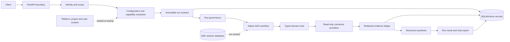

The request path is synchronous from the API caller's perspective, but model and connector work execute asynchronously inside the process. Run records and ADK sessions are durable; abandoned model work is not automatically resumed.

## Component map

| Component | Responsibility | Authoritative state | Lifecycle |
|---|---|---|---|
| HTTP boundary | Authentication ordering, body limits, routing, response headers | Request and response | Request/response |
| Identity and scope | Verify RS256 tokens and server membership | Deployment environment | Startup/request |
| Configuration layers | Merge delegated platform/project/user settings | YAML content and resolved snapshot | Startup/new run |
| Capability resolver | Check enabled capability, role, actions and connectors | Capability YAML | New run |
| Run contract | Freeze input, content hashes, limits and scope | SQLAlchemy run row | Run lifetime |
| ADK workflow | Execute planning, evidence, delegation and synthesis | Native ADK events/session | Run lifetime |
| Governance | Enforce budgets, policy, redaction and evidence bounds | In-memory counters plus DB ledger | Run lifetime |
| Connector providers | Own credentials, network clients and provider behavior | Provider instance | Application lifetime |
| File pipeline | Parse local attachments and retain raw/processed derivatives | Chat artifact catalog and blob objects | Upload/retention |
| Agent approval | Review data-only project specialists | DB review record plus immutable blob | Submission lifecycle |
| Evidence and output | Persist provenance, validate citations and export results | Evidence rows and terminal run result | Run/retention |
| Optimization | Evaluate and approve prompt/skill bundles | Immutable bundle plus DB state | Candidate lifecycle |
| Operations | Health, telemetry, cleanup and repair | Metrics, logs and operator commands | Process/deployment |

## 1. Application lifecycle

The application creates shared resources once and closes them in reverse order. Routes do not create providers, stores or model clients.

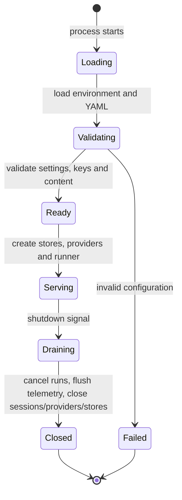

`app/runtime/bootstrap.py` owns this lifecycle. Live mode requires deployment scope, token verification settings and server-side memberships. Demo mode can start without live connector/model credentials, but it returns `SIMULATED` and performs no diagnosis.

## 2. Request lifecycle

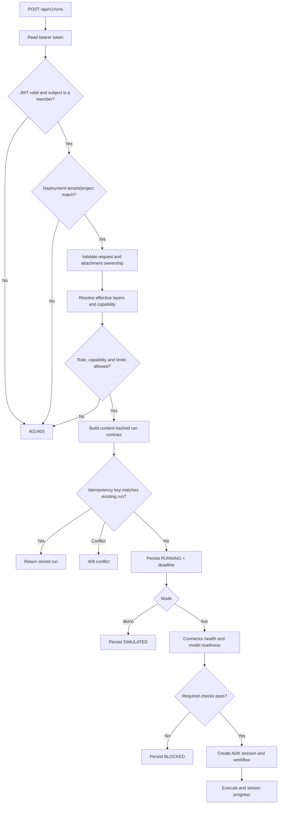

Authentication runs before multipart parsing and upload/model capacity is bounded with semaphores. A request cannot supply its own tenant, project, role, connector, model or approval state.

## 3. Configuration lifecycle

Configuration is data-only. Platform content is loaded at startup; project and user layers are resolved for a principal when a run is assembled. Environment variables own identity, credentials and deployment scope.

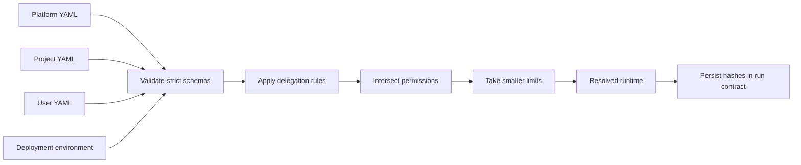

The rules are simple: lower layers may narrow a permission or limit, but cannot restore a denial or introduce a connector/model/tool. Instruction overrides are allowed only where explicitly delegated. A missing layer inherits; an unknown field, duplicate scope, alias, invalid reference or unauthorized override fails validation.

### Selection rules by harness element

The platform is the ceiling, the project selects the effective operating profile, and the user can personalize only fields that the platform and project explicitly delegate.

| Harness element | Platform selects/owns | Project may select or narrow | User may select | Effective selection |
|---|---|---|---|---|
| Deployment identity, tenant, project, credentials | Owns completely through environment and membership | No | No | Server-owned deployment scope |
| Capability availability | Defines manifest, enabled state, roles, actions and safety | Disable, narrow actions/roles, choose delegated model profile | No | Platform capability intersected with project override |
| Required connectors | Defines capability requirements and provider configuration | Disable a connector; this disables capabilities that require it | No | Required must be healthy; optional can be omitted |
| Connector credentials and endpoints | Owns through provider configuration/environment | No | No | Shared provider instance from application startup |
| Model profiles and stage models | Defines profiles, stage IDs and limits | Choose only a profile named in `platform.yaml` | No | Capability profile, replaced only by an allowed project profile |
| Workflow switches | Defines native graph and available stages | Disable planning, attachments, parallel evidence or specialists | No | Native graph filtered by project flags and global ceilings |
| Stage prompts | Defines defaults and stage names | Replace only delegated prompt fields | No | Platform prompt plus permitted project replacement |
| Skills and skill actions | Defines instruction, immutability, actions and override policy | Replace/disable/intersect actions when delegated | Replace/disable/intersect actions only when both tiers delegate | Platform → optimization → project → user |
| User presentation/detail | Defines permitted preference names | Grant permitted preference names and set project defaults | Set own permitted values | Project default overlaid by user value |
| Approved specialists | Defines schema, allowed tools and review rules | Submit and approve project-scoped definitions | No | Active approved definitions matching capability |
| Run budgets | Defines process and safety ceilings | Reduce calls, tools, context, evidence and timeout | No | Minimum of platform settings and project limits |
| File parsing limits | Defines parser formats, size and worker bounds | No | No | Platform parser limits; project can disable attachments |
| Chat and artifact access | Defines storage layout and retention controls | Scope is fixed to deployment project | Own chats and artifacts only | Server scope plus authenticated owner check |
| Optimization | Defines evaluator and approval gates | Own scoped candidates and active pointer | No | Approved active bundle for future runs |

### Resolution sequence

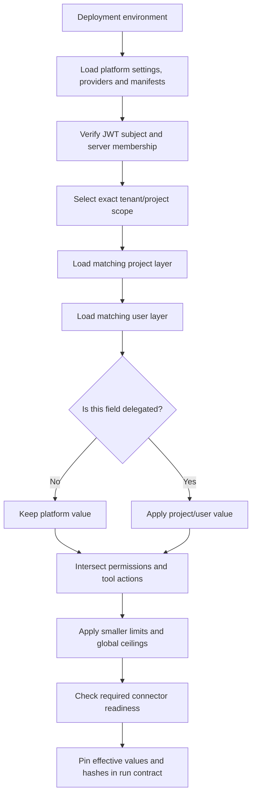

Resolution is keyed by authenticated values, never by a filename supplied by a caller. Project configuration is matched on `(tenant_id, project_id)`; user configuration is matched on `(tenant_id, project_id, subject)`. If no matching project or user layer exists, defaults remain in effect.

### Precedence examples

**Capability and connector selection.** The platform enables `incident_triage` with `itsm.get_ticket` and `log_search.query_range`. A project may disable `log_search`, leaving Jira triage available but recording log investigation as unavailable. A user cannot re-enable it. If the platform-required `itsm` connector is unhealthy, the run is `BLOCKED`.

**Model selection.** The capability starts with `balanced-investigation`. A project may choose `fast-investigation` only if that profile is listed in `platform.yaml`; the user cannot choose a model. The chosen profile and every resolved stage configuration are copied into the run contract.

**Skills.** The platform defines the skill's permitted actions. A delegated project instruction replaces the platform instruction. A delegated user instruction replaces the project instruction, while action sets are intersected at every tier. Setting `enabled: false` at a higher tier cannot be undone below it.

**Budgets and workflow.** The platform process ceiling is 12 model calls and 100 evidence items. A project can reduce either value and can disable attachments or specialists. A user cannot increase limits or change the graph. The run uses the reduced values captured at creation time, even if configuration changes later.

**Optimization.** An approved optimization bundle is inserted beneath explicit project/user instruction overrides and above the platform baseline where the skill is mutable. It never changes tools, capabilities, safety policy or the workflow graph. Its revision hash is pinned per run.

## Which flow runs for which request?

The harness does not currently have one separate root graph per capability. It builds one governed root workflow and filters its branches from the resolved capability, available connectors, attachments, and project workflow flags. This is why the diagrams can look RCA-centric even though the entry points are different.

| Flow | Entry condition | Stages that run | Current status |
|---|---|---|---|
| Incident triage | `capability=incident_triage` | Optional planning → Jira/ITSM triage → optional log investigation → optional attachments → specialists → synthesis | Implemented |
| Log correlation | `capability=log_correlation` | Optional planning → log investigation → optional attachments → optional specialists → synthesis | Implemented through the filtered root graph |
| Database RCA | `capability=database_rca` | None | Disabled; required `database_query` provider and tool are not implemented |
| Attachment-supported analysis | Any enabled capability with attachment IDs and project `workflow.attachments=true` | File extraction branch joins the capability's evidence branch, then synthesis | Implemented; upload/parsing happens before the run |
| Attachment-only request | A request has attachments but no usable connector branch | File extraction → synthesis; result may be `INSUFFICIENT_EVIDENCE` | Supported when the capability remains authorized |
| Project specialist delegation | Approved matching agents exist and `workflow.specialists=true` | Specialist router → selected `AgentTool` specialists → synthesis | Implemented; approval is project-scoped |
| Generic request classification | Any run when `workflow.planning=true` | Orchestrator classifies intent and selects relevant governed actions | Implemented as a plan plus tool-action gating, not as a separate unrestricted graph |
| Prompt/skill optimization | Optimization API, not a run request | Candidate generation → replay/evaluation → review → activation | Separate lifecycle; does not execute in the investigation graph |

### Capability-to-flow routing

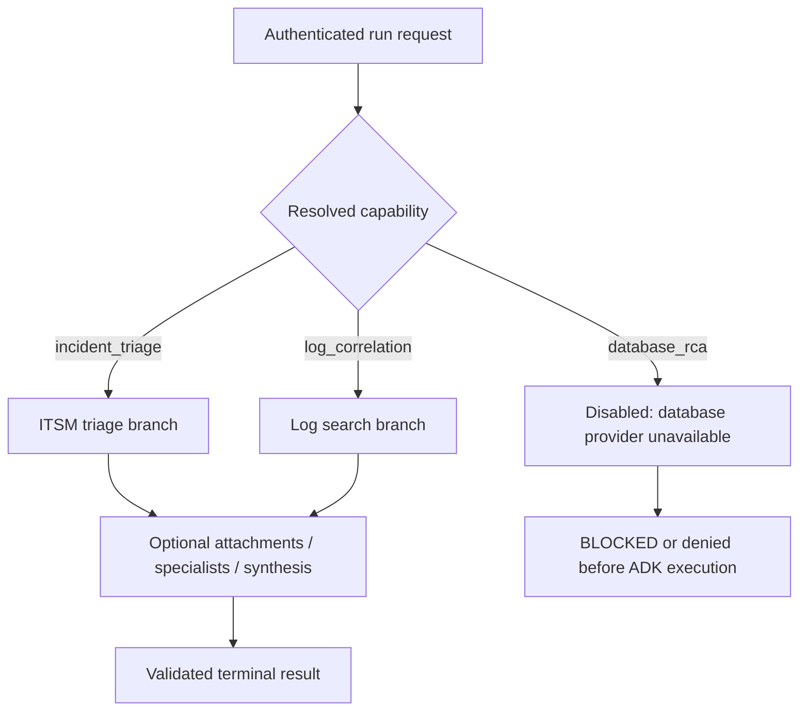

### Why the flows converge

The shared synthesis stage is deliberate: it gives every capability the same evidence, redaction, citation, status, timeout, and persistence guarantees. The specialization happens before synthesis through capability actions and stage availability, and during execution through the request plan. The current code selects `get_ticket` and `query_range` branches from `capability.allowed_actions`; the intent plan then governs whether each action is relevant.

The orchestrator's intent labels control which governed tool actions are relevant. `triage`, `root_cause_analysis`, `tool_data_request`, `metrics`, `sanity_check`, `project_knowledge`, `generic_answer`, `follow_up`, and `rerun` are not separate unrestricted graphs: the shared graph remains fixed, while tool callbacks reject actions that do not match the plan. Metrics currently means bounded log-derived measurements, and project knowledge currently means supplied attachments because those connectors are not enabled. A future connector or specialist must be added to the platform catalog and capability allowlist before it can be selected.

## 4. Capability lifecycle

A capability is a declarative contract connecting a request to skills, actions, required/optional connectors, safety settings and a model profile.

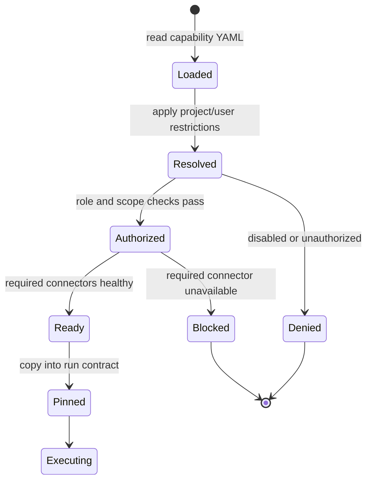

Optional connector failure does not automatically stop execution. It is recorded as a limitation and can produce `PARTIAL`. Required connector failure produces `BLOCKED` before model execution.

## 5. Agent workflow lifecycle

The root graph is assembled fresh for every run from the pinned contract. It uses native Google ADK `LlmAgent`, `Workflow`, `JoinNode`, `AgentTool`, `Runner`, `Session` and `Event` concepts.

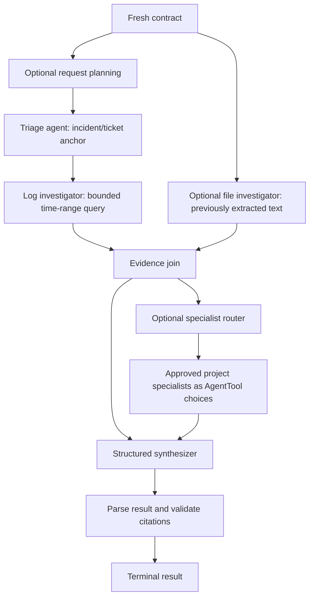

Planning notes and stage notes are untrusted context. The evidence ledger is authoritative. The synthesizer must return the structured result schema and may cite only evidence IDs saved during the same run. A capability or project can disable planning, attachments, parallel evidence or specialists; the server graph remains the authority.

## 6. Tool and connector lifecycle

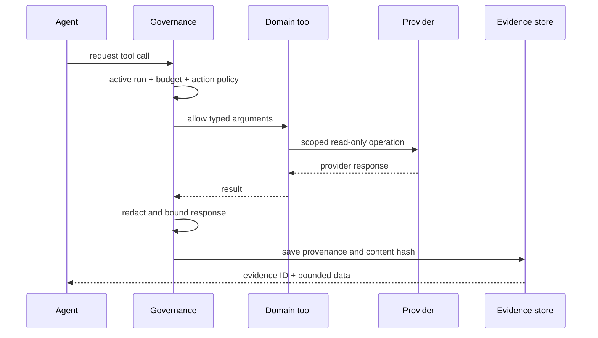

Providers own credentials, timeouts, pooled clients and health probes. Agents never receive a provider client. The current live connector boundary is read-only Jira/ITSM and Splunk/log search; database querying is disabled until its connector is implemented. The action catalog is the allowlist: a YAML action name alone cannot register executable code.

## 7. Attachment lifecycle

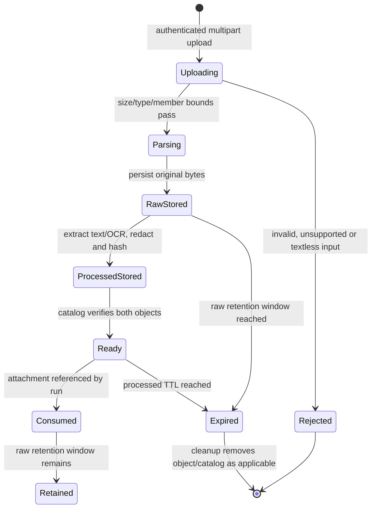

Files are local-only and bounded. Supported extraction includes text/Markdown/logs, JSON, CSV/TSV, DOCX, XLSX, PDF text and image OCR. Images are not sent for visual interpretation. Raw originals and processed text are separate derivatives with separate expiry behavior.

## 8. Project-agent approval lifecycle

Project specialists are submitted as data-only YAML. The definition may reference only existing tool actions and model profiles.

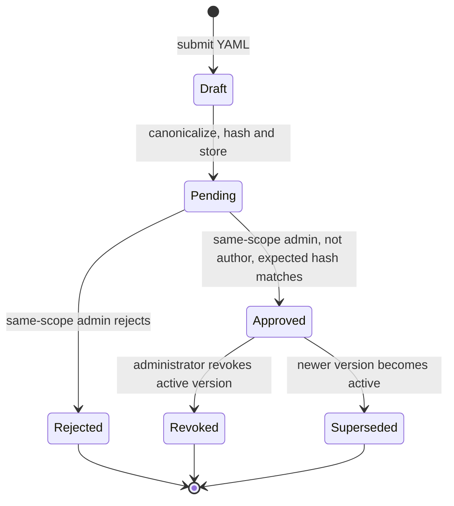

The database review record and active pointer are authoritative. Blob stage folders are synchronized views for operators and audit; manually copying a file into `approved` never activates it. In-flight runs keep their original specialist hashes. New runs discover only the active approved definitions matching the requested capability.

## 9. Run lifecycle and outcomes

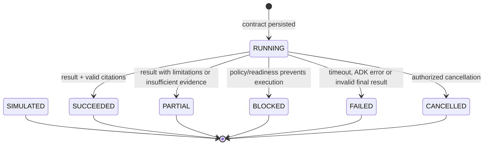

`SIMULATED` is an explicit demo outcome, not a successful diagnosis. Terminal output is saved under the chat's outcome directory when a chat is attached. SSE exposes progress events, while run and evidence endpoints read durable state. A later read marks an abandoned expired run as failed; there is no durable background worker or automatic replay.

## 10. Evidence lifecycle

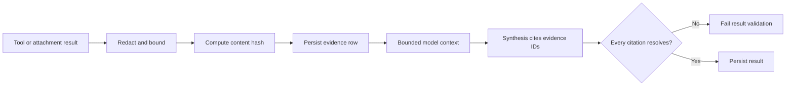

Evidence contains the run, tenant/project scope, source, operation, redacted query/data, observation time and content hash. It is never accepted from a model as authoritative. Findings that cite unknown evidence are rejected.

## 11. Optimization lifecycle

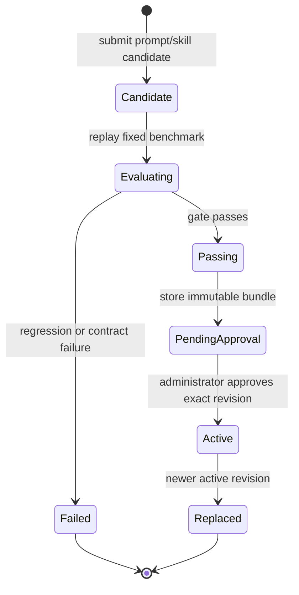

Optimization evaluates candidates in isolation. Approval changes what future runs resolve; it does not mutate an existing run contract. MLflow output is an evaluation/telemetry aid, not a live model-quality guarantee.

## 12. Operator lifecycle

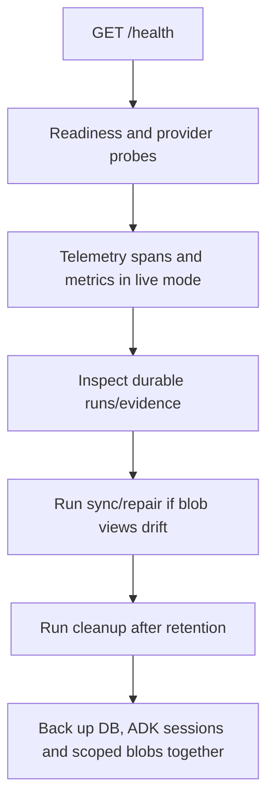

Use `make lint`, `make test`, `make smoke` and `make eval` before handoff. `make eval` checks offline fixture contracts; it is not a live accuracy score. Keep platform content read-only, project artifacts durable, and secrets outside YAML/blob content.

## Source map

| Concern | Primary implementation |
|---|---|
| HTTP and authentication ordering | `app/api/application.py`, `app/identity/auth.py` |
| Startup/shutdown | `app/runtime/bootstrap.py` |
| Run execution and ADK sessions | `app/runtime/runner.py` |
| Graph assembly | `app/agents/root.py` |
| Capability resolution | `app/capabilities/registry.py`, `app/capabilities/resolver.py` |
| Governance and evidence capture | `app/runtime/governance.py` |
| Typed tools | `app/tools/catalog.py`, `app/tools/domain/` |
| Providers | `app/connectors/providers/` |
| Durable records | `app/persistence/` |
| File extraction | `app/inputs/files.py` |
| Project-agent review | `app/configuration/service.py` |
| Declarative content | `blob_local/platform/` |
