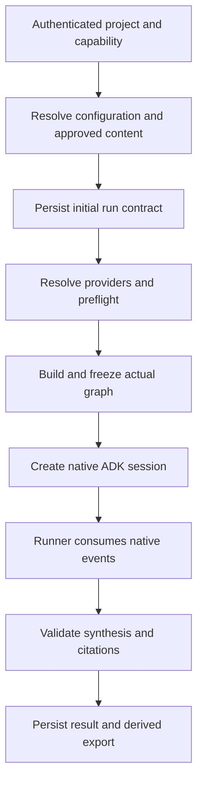
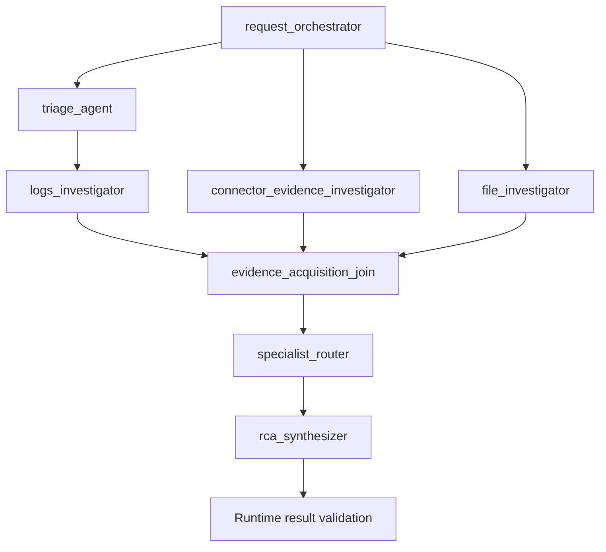

# ADK harness and extension handbook

This handbook explains the implemented native Google ADK execution path and how new governed elements enter it. Read the [architecture](architecture.md) for the request boundary, [connector handbook](connectors.md) for external reads, and [data model](data-model.md) for retained records. The deployed ADK version is reported by the compatibility service from the installed package; a frontend compatibility label is not an independent guarantee of support.

## Contents

- [From configuration to execution](#from-configuration-to-execution)
- [Native building blocks](#native-building-blocks)
- [Default investigation graph](#default-investigation-graph)
- [Stage contracts](#stage-contracts)
- [Native graph compilation](#native-graph-compilation)
- [Sessions, state and events](#sessions-state-and-events)
- [Tool and model boundaries](#tool-and-model-boundaries)
- [Harness Studio authoring and approval](#harness-studio-authoring-and-approval)
- [Harness Studio API](#harness-studio-api)
- [Adding an agent or skill](#adding-an-agent-or-skill)
- [Execution and compatibility limits](#execution-and-compatibility-limits)

## From configuration to execution

Reading path: [authorize](security.md#request-authorization) → [resolve](configuration.md#scope-and-precedence) → [preflight](connectors.md#runtime-resolution) → [compile](#native-graph-compilation) → [execute](#tool-and-model-boundaries) → [persist](data-model.md#run-and-evidence-records).

The harness is application code around ADK, not a second orchestration engine. The application owns identity, configuration, approval, provider scope, deadlines and durable records. ADK owns native workflow traversal, agent invocation, tool interaction and session/event semantics. Sources: [execution runner](../app/runtime/runner.py), [root factory](../app/agents/root.py), [workflow compiler](../app/configuration/workflow.py).

## Native building blocks

| Building block | Use in this application | Boundary |
| --- | --- | --- |
| `LlmAgent` | Planning, triage, logs, other connector evidence, attachment interpretation, specialist routing and synthesis | Only resolved tools/models/instructions are supplied |
| `Workflow` | Sequence, parallel branch and explicit graph execution | Compiled from validated data, with bounded concurrency |
| `JoinNode` | Joins branches before downstream work | Not a model and not an approval decision |
| `FunctionTool` | Exposes a typed read operation to an agent | Provider performs network access; governance authorizes the call |
| `AgentTool` | Makes an approved specialist callable by the router | Delegation shares the run's policy and budgets |
| `Runner` and `App` | Execute the fresh root and consume native events | Created for the run; not a durable background worker |
| `DatabaseSessionService` | Persists native session state and events | PostgreSQL uses the `adk` schema; session ID is the run ID |
| Bounded model wrapper | Checks call capacity and serialized context before model invocation | Character budget is not a token-count estimate |

Sources: [root construction](../app/agents/root.py), [tool catalog](../app/tools/catalog.py), [model wrapper](../app/models/bounded.py), [session service](../app/persistence/database.py).

## Default investigation graph

The graph below shows all possible default branches. It is not the graph every request executes. The capability's allowed actions, enabled stages, healthy providers, attachments and approved specialists determine inclusion.

Reading path: [stages](#stage-contracts) → [connector reads](connectors.md#provider-specific-forms) → [joining](#native-graph-compilation) → [synthesis validation](architecture.md#4-synthesis-and-terminal-state).

If planning or specialists are absent, execution proceeds directly to the remaining steps. Triage precedes logs within the incident-evidence sequence. Other connector evidence and file interpretation are independent branches. Parallel compilation is used only when enabled and there is more than one branch; otherwise evidence is sequenced. Sources: [`default_workflow` and `available_builtins`](../app/configuration/workflow.py), [actual root](../app/agents/root.py).

## Stage contracts

| Stage | Inputs and responsibilities | What its output does not establish |
| --- | --- | --- |
| Request orchestrator | Request, capability, permitted source/action context and planning instruction | A plan is not evidence or additional permission |
| Triage | Bounded Jira read through `get_ticket`; incident context | Ticket prose alone is not proof of root cause |
| Logs | Authorized time-bounded search through `query_range`; triage context when present | A matching log message alone is not causal proof |
| Connector evidence | Allowed `read_<connector>_evidence` tools for usable additional providers | Merely registering a provider does not make it usable |
| File investigator | Previously parsed, redacted attachment context | Images have OCR text only; no visual semantics |
| Specialist router | Eligible approved agents exposed as `AgentTool` entries | It need not call every specialist; notes cannot replace captured evidence |
| Synthesizer | Bounded evidence projection, stage notes, instructions and structured result schema | Runtime validation still checks evidence IDs and result validity |

Stage eligibility uses the configuration compiler and root builder. The extra connector-evidence branch requires the capability's `evidence` stage and at least one additional allowed connector action. The actual post-preflight graph is stored in the contract and returned by the run trace endpoint. Sources: [compiler](../app/configuration/workflow.py), [root instructions](../app/agents/root.py), [trace endpoint](../app/api/routes/runs.py).

## Native graph compilation

The data model accepts `builtin`, `agent`, `sequence`, `parallel`, `graph` and `join` node kinds. IDs are bounded identifiers; the root must exist. Containers require children, leaf nodes cannot own them, references must resolve, and cycles, unreachable nodes, duplicate ownership and duplicate callable references are rejected.

- A **sequence** becomes edges from native `START` through each child in order.
- A **parallel** node connects `START` to all children and each child to an automatically named `JoinNode`.
- A **graph** supplies explicit edges between direct children, or from `START` to a child. Validation rejects cyclic/unreachable structure.
- A **builtin/agent** resolves to an already constructed native agent, optionally renamed for its graph node ID.
- An explicit **join** becomes a native `JoinNode`.

Generated join IDs cannot collide with declared nodes. Custom graphs requiring missing attachment nodes are blocked rather than silently rewired. The visualization is derived from the validated graph; canvas appearance does not authorize unsupported executable behavior. Sources: [`WorkflowDefinition`, `compile_native`, `prune_optional`](../app/configuration/workflow.py), [bundle compiler](../app/configuration/harness_bundles.py).

## Sessions, state and events

The runner creates a fresh session with `session_id=run_id`, `app_name="app"`, and a user identifier hashed from tenant, project and subject. It initializes stage-result state and the contract hash. It then passes the redacted request to native `run_async`, consumes events, updates persisted stage/evidence counts, and records trace events.

Native ADK session/event rows and application harness trace rows serve different purposes. Native state supports ADK execution; application trace records support scoped UI progress and operational inspection. Do not count both independently as distinct model calls for usage totals. Sources: [runner](../app/runtime/runner.py), [event store](../app/persistence/run_events.py), [telemetry aggregation](../app/persistence/telemetry.py).

Follow-up context is a bounded selection of compatible earlier completed runs from the same owner's chat. It is frozen for the new run and helps interpret the question. Old evidence IDs are not imported as fresh observations. Reviewed knowledge is selected separately and captured into current-run evidence. Sources: [chat-context selection](../app/persistence/store.py), [knowledge selection](../app/configuration/knowledge.py).

## Tool and model boundaries

Before a tool is invoked, governance checks the active run, permitted operation, scope and remaining budgets. It captures redacted, bounded evidence with provenance and returns safe context to the model. A successful tool-completion trace follows evidence persistence. Concurrent branches share evidence capacity, call budgets and deadline.

Before a model call, the wrapper considers serialized contents plus generation configuration, instructions, history, tool declarations and response schema. Evidence excerpts can be bounded and rotated among sources; required instructions and interaction history are not silently cut to force a call through. Unfit required input yields `context_limit`. Source records remain unchanged when their model projection is shortened. Sources: [governance](../app/runtime/governance.py), [context projection](../app/runtime/context.py), [bounded model](../app/models/bounded.py).

## Harness Studio authoring and approval

```mermaid
flowchart LR
  A[Load workspace and revision] --> B[Edit or import data-only source]
  B --> C[Validate and inspect compiled graph]
  C --> D[Save draft revision]
  D --> E[Submit exact revision]
  E --> F[Independent authorized review]
  F --> G[Approved active selection]
  F --> X[Rejected revision]
  G --> R[Resolved by a later run]
  G --> V[Revoke]
  click A "harness.md#harness-studio-api" "Workspace API"
  click B "harness.md#adding-an-agent-or-skill" "Authoring boundaries"
  click C "harness.md#native-graph-compilation" "Validation rules"
  click D "data-model.md#governance-records" "Draft and audit records"
  click E "security.md#independent-review-and-stale-writes" "Revision-bound submission"
  click F "security.md#independent-review-and-stale-writes" "Reviewer checks"
  click G "data-model.md#governance-records" "Activation pointers"
  click X "harness.md#harness-studio-api" "Review responses"
  click R "architecture.md#2-resolve-the-contract" "Run snapshot"
  click V "security.md#independent-review-and-stale-writes" "Revocation"
```

Reading path: [workspace API](#harness-studio-api) → [compiler](#native-graph-compilation) → [independent review](security.md#independent-review-and-stale-writes) → [activation records](data-model.md#governance-records).

The server checks capability authorization and whether harness customization is delegated. Approved content remains subject to the capability and project policy. Uploaded source files are not executed as arbitrary Python. The UI's import/export and compatibility views must be interpreted through the server's validation diagnostics. Sources: [workspace service](../app/configuration/harness_workspace.py), [API](../app/api/routes/harness_workspace.py), [Studio page](../frontend/src/features/harness-studio/HarnessStudioPage.tsx).

## Harness Studio API

All endpoints below are authenticated under `/api/v1/harness`; consult the request models for exact fields and revision tokens.

| Endpoint | Purpose |
| --- | --- |
| `GET /workspace` | Current capability workspace, files, graph, compatibility and revisions |
| `POST /validate` | Compile/validate proposed content without treating it as active |
| `PUT /draft` | Save a revision-aware draft |
| `GET /drafts` | List reviewable drafts in scope |
| `POST /drafts/{draft_id}/{submit\|approve\|reject\|revoke}` | Apply the supported lifecycle transition |
| `POST /import` | Import source into the reviewable workspace flow |
| `GET /export` | Export the selected workspace content |

CLI helpers are `make config-validate`, `make config-import`, `make config-export` and `make config-diff`; `CONFIG_PATH` and `CAPABILITY` are supplied where required. Import does not replace independent approval. Sources: [endpoint models](../app/api/routes/harness_workspace.py), [CLI](../scripts/harness_config.py), [Makefile](../Makefile).

## Adding an agent or skill

First decide which existing extension surface is sufficient:

| Desired change | Existing surface | Required work |
| --- | --- | --- |
| Explain domain terminology or investigation guidance | Managed skill | Author bounded content, use the managed review lifecycle and permitted inheritance |
| Add reusable project reference material | Knowledge | Create draft, independently approve, retrieve as reference evidence |
| Change stage instructions or authorized model selection | Existing configuration/profile controls | Validate scope and activation behavior; inspect a new run snapshot |
| Add a specialist using existing tools | Agent configuration | Submit data-only YAML, validate tool names and profile, independently approve |
| Change stage order or parallelism | Harness bundle | Compile a supported graph, review exact content, inspect actual runtime topology |
| Read a genuinely new external system | Connector implementation | Implement provider and typed domain operation, register it, define form and policy, verify full flow |

An agent definition cannot introduce new arbitrary tool names. A new tool/provider is a code change, not something achieved by inserting a form field or prompt. Registering a new table or folder also does not create a lifecycle. Sources: [agent definition service](../app/configuration/service.py), [skills](../app/configuration/skill_catalog.py), [tool catalog](../app/tools/catalog.py), [connector extension procedure](connectors.md#adding-a-new-connector-or-field).

## Execution and compatibility limits

The development `agents/rca_analyzer` entrypoint is intentionally inert. `adk run` or `adk web` on that package does not receive the authenticated API's governed runtime and credentials. Use the application run path for an investigation. Source: [development entrypoint](../agents/rca_analyzer/agent.py).

The release has no durable worker, automatic resumption, arbitrary uploaded-code execution or model-authorized source-system writes. Saved traces make execution inspectable, not resumable by themselves. The triage proposal endpoint is a separate incomplete path, documented in [project workflow gaps](project.md#triage-workspace-implementation-boundary).
