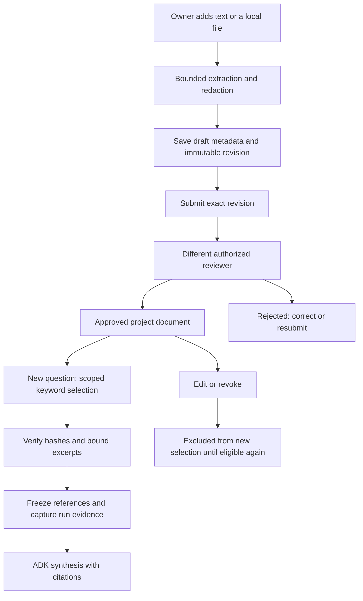
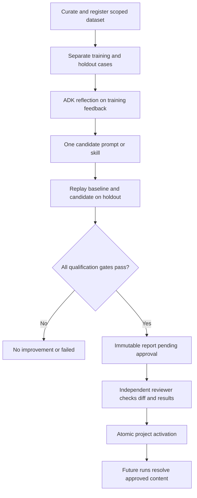
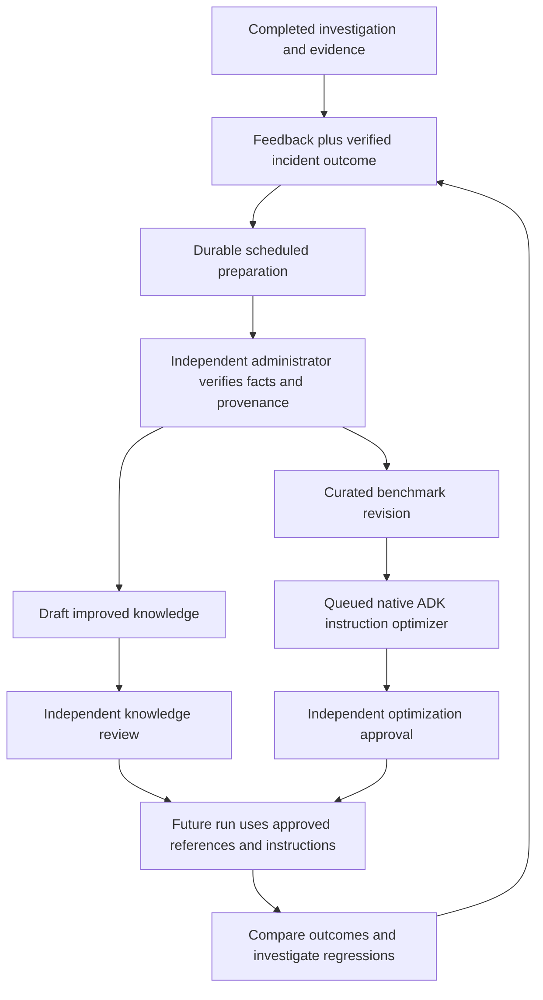

# Knowledge base, Open Knowledge Format and self-improvement

[Handbook home](README.md) · [Configuration](configuration.md#workflow-review-reusable-knowledge) · [ADK harness](harness.md) · [Database reference](data-model.md)

This handbook follows project knowledge from source material to a reviewed reference in an ADK answer, then explains the governed prompt/skill improvement loop. Implementation claims describe the checked-in source; they are not evidence of a successful production deployment.

**OKF means Open Knowledge Format.** See the [implemented OKF integration](#open-knowledge-format-integration-design) for its role, bounded import/export and local review requirements.

## Reading paths

- [Current knowledge lifecycle](#knowledge-from-authoring-to-an-answer) → [retrieval](#exact-knowledge-retrieval-rules) → [storage and APIs](#knowledge-storage-and-ownership).
- [Structured topics and source capture](#structured-topics-and-source-capture) → [source updates](#source-lineage-and-updates).
- [OKF ecosystem design](#open-knowledge-format-integration-design) → [mapping](#okf-content-model-and-mapping) → [import/export](#proposed-import-and-export-contract) → [delivery criteria](#delivery-sequence-and-acceptance-criteria).
- [Existing optimization](#how-the-existing-optimization-framework-works) → [evaluation gates](#qualification-gates) → [approval](#optimization-approval-storage-and-apis).
- [Governed improvement loop](#governed-self-improvement-loop) → [controls](#implementation-milestones) → [measurement](#measurement-and-regression-handling).

## What exists today

| Capability | Current behavior | Boundary |
| --- | --- | --- |
| Project knowledge | Reviewed, versioned documents and structured topic blocks with bounded keyword retrieval | No embeddings/vector index; reference guidance does not establish a current cause |
| Source capture | Queued or scheduled capture from approved project documents, closed Jira tickets, Confluence pages and independently verified feedback | Saved connector authorization, source-version deduplication and independent knowledge review still apply |
| Incident evidence | Read-only connector observations and local attachments captured per run | A runbook is guidance, not proof of the current cause |
| Answer feedback | Run author records `helpful` or `needs_work` and a redacted note | A rating is not a verified outcome or approval |
| Optimization | ADK reflection proposes one prompt or skill change; held-out replay evaluates it | Knowledge documents are not optimization targets |
| Activation | Independent reviewer approves an eligible immutable report; reviewed rollback/revocation restores prior content or platform baseline | No self-approval or unattended promotion |
| Self-improvement | Durable scheduled preparation turns recorded feedback into candidates; verified candidates publish benchmark versions or knowledge drafts; queued evaluations produce reviewable reports | Human outcome verification and independent activation remain required |

Sources: [knowledge service](../app/configuration/knowledge.py), [feedback API](../app/api/routes/feedback.py), [optimization models](../app/optimization/models.py), [evaluation](../app/optimization/evaluation.py), [approval service](../app/optimization/service.py).

## Knowledge from authoring to an answer

Project knowledge is a reviewed document library. It is separate from chat uploads, specalist instructions and conversation history. Documents supply reference guidance; they do not train the model, create a vector index, grant connector access or prove a current incident cause.

The **Project docs & playbooks** reader at `/p/{project_key}/docs` uses this same scoped library. It shows approved, hash-bearing, eligible revisions to readers and administrators alike, with search across titles/content/categories/tags and category/tag filters. The existing Knowledge page retains authoring and review controls. The separate **Platform handbook** at `/admins/platform-docs` contains deployment documentation, not uploaded project guidance. Environment, capability and source associations shown with a project document describe its investigation eligibility; project membership remains the reading boundary. Sources: [project reader](../frontend/src/pages/ProjectDocs.tsx), [Knowledge lifecycle](../app/configuration/knowledge.py), [handbook API](../app/api/routes/documentation.py).

Reading path: [author](project.md#workflow-c-turn-a-document-into-reusable-knowledge) → [store](#knowledge-storage-and-ownership) → [review](#knowledge-review-state-transitions) → [retrieve](#exact-knowledge-retrieval-rules) → [capture](data-model.md#run-and-evidence-records) → [synthesize](harness.md#stage-contracts).

## Knowledge form and upload behavior

A project owner or platform administrator can create text or upload a local file. The editor accepts title, category, tags and text/file content. The service bounds title to 256 characters, category to 128, tags to 32 entries of at most 64 characters, and text to the active extracted-text limit within the model's one-million-character ceiling. The active file configuration decides enabled formats and lower file/parser limits; a form's file picker is not the security check.

Uploads are authenticated before multipart work, parsed locally, and stored with filename, original hash, byte count and extraction warnings. The saved searchable text is redacted. Image content contributes OCR text only. The original binary is retained separately and can contain information removed from the text preview. Text editing preserves the uploaded original; replacing the file replaces its upload metadata through a new revision.

Multiple local files use the same parser and review lifecycle through `POST /api/v1/knowledge/upload/batch`. Supply repeated `files` parts and a `metadata` JSON array in the same order, with each file's title, optional category/tags/associations, and document ID plus expected hash for an explicit replacement. Active file-count, per-file and combined-byte limits are checked before any document is written. Parsing respects the configured concurrency and a bounded request deadline. Outcomes retain input order and report `created`, `duplicate`, or `failed` per file; one extraction failure does not discard other successful files. A saved upload is a draft requiring independent review, never automatically eligible knowledge.

Exact original bytes have a project-local database identity in `platform.knowledge_uploads`. Re-uploading them returns the current document plus the matched immutable revision and hash. A historical match is disclosed as `duplicate_historical`; it does not restore the old content or approval. Single-file uploads expose the same match as `upload_match`. Metadata changes use the ordinary document editor and review workflow. Concurrent identical uploads commit one identity, draft and audit record; failed-file retries therefore do not duplicate prior successes. Migration 032 registers existing current upload revisions without changing their hashes; replaced revisions from before that migration are not retrospectively indexed. Sources: [upload API](../app/api/routes/knowledge_uploads.py), [transactional identity](../app/configuration/knowledge.py), [migration](../migrations/history/032_knowledge_uploads.sql), [mixed results, retries, scope and rollback tests](../tests/integration/test_knowledge_batch_uploads.py).

Sources: [document input/service](../app/configuration/knowledge.py), [upload route](../app/api/routes/knowledge_uploads.py), [request boundary](../app/api/application.py), [editor](../frontend/src/components/KnowledgeDocumentForm.tsx).

## Structured topics and source capture

An article can carry a `structure` with one topic, an optional summary and ordered blocks. Each block has a kind, title and content. Useful kinds include system context, responsibility, process, error, query, sanity check and resolution; bounded custom kinds are allowed. Queries and procedures remain reference text and cannot register tools or execute source-system writes. The server generates canonical Markdown from the structure, so the existing reader, keyword retrieval, evidence capture and review lifecycle consume the same content. Structure participates in the immutable revision hash. Sources: [block model and canonical rendering](../app/configuration/knowledge_structure.py), [knowledge input and snapshot](../app/configuration/knowledge.py).

| Field | Bound |
| --- | --- |
| Topic | 1–128 characters; nonblank |
| Summary | Up to 2,000 characters |
| Blocks | 1–40 per article |
| Block kind | 1–64 characters; nonblank |
| Block title | 1–256 characters; nonblank |
| Block content | 1–16,000 characters; nonblank |

Capture reuses the Improvement queue and schedules with `kind: capture_knowledge`. Its `capture` request selects one or more of `documents`, `closed_tickets`, `confluence` and `feedback`, optionally a topic, a bounded item limit and a lookback override. External sources require saved connector selections and a corresponding authorized capability; a source name alone cannot enable a connector. The initial lookback defaults to **three calendar months**, configurable from 1 to 24. The project setting is the database-first `knowledge.capture_lookback_months` parameter, exposed by `GET`/`PUT /api/v1/knowledge/settings`; changes require the current override and definition revisions. Sources: [request contracts](../app/optimization/improvement_models.py), [capture implementation](../app/optimization/knowledge_capture.py), [setting resolution](../app/configuration/knowledge.py).

| Source | Capture boundary |
| --- | --- |
| Uploaded playbooks and project documents | Current independently approved, eligible original documents; a derived article cannot recursively become another capture source |
| Closed Jira tickets | Read-only, project-scoped historical observations inside the requested resolution window; recorded fields, mapped custom fields and bounded returned comments, with partial-content notices; attachments excluded; closure alone is not proof of a root cause |
| Confluence | Current pages from the saved authorized space, with bounded cursor pagination; embedded links, macros and instructions do not authorize remote fetching or execution |
| Feedback | First prepare new feedback/calibration revisions for independent review, then capture independently verified Improvement candidates; a helpful vote or free-form comment is not a factual outcome |

Capture organizes actual source text into bounded blocks. It does not infer a verified cause merely because a ticket is closed or a heading contains “resolution.” Large Jira records can become explicitly labeled bounded excerpts; comment coverage is disclosed. Structured articles exceeding the block budget fail visibly. Every generated article begins as a draft, then follows ordinary submission and independent approval. Sources: [text structure extraction](../app/configuration/knowledge_structure.py), [source capture](../app/optimization/knowledge_capture.py), [independent candidate verification](../app/optimization/improvement.py).

A capture job freezes its calendar window and resumes its persisted cursor after a worker restart or manual retry. Each claim processes a bounded page (1–100 records; Jira at most 50); successful continuation does not spend the failure retry budget. The 1,000-page bound fails explicitly. Result totals cover processed pages; `document_ids` includes at most the first 100 IDs and discloses that limit. A daily schedule uses the existing interval of 86,400 seconds. New runs observe current records and deduplicate unchanged source content. Sources: [capture checkpoints](../app/optimization/knowledge_capture.py), [leased worker and schedules](../app/optimization/improvement.py).

### Source lineage and updates

The server records a read-only `capture` envelope with source kind, identity, content hash, bounded metadata and capture time. Browser authoring requests cannot assert this provenance. A transactional source-version receipt maps one authenticated project/source/hash to its generated document. Source-state tombstones also persist unavailable observations before the first capture; request-start and source-modification times prevent a late old response from restoring retired knowledge. Retrying the same source version returns `capture_outcome: unchanged` and preserves human edits and review state. A changed source version creates a **separate draft**; it does not silently rewrite a reviewed article. Sources: [`ingest_capture` and capture admission](../app/configuration/knowledge.py), [table declarations](../app/persistence/platform_admin.py).

New selection, approved-reader lists, frozen evaluation corpora and ordinary OKF exports enforce source admission as well as local approval. For a captured project document, editing, revoking or expiring the pinned original removes the derivative's eligibility; its original associations are inherited. Observing a newer captured source hash also makes the older derivative ineligible. Complete Confluence space scans retire captures no longer observed; tracked Jira reopening retires captured closure knowledge. Neither deletes history, and absence from a historical Jira search alone does not prove deletion. Feedback-derived articles depend on the exact still-verified candidate revision. Completed runs retain their frozen historical evidence. Sources: [admission and retrieval](../app/configuration/knowledge.py), [source reconciliation](../app/optimization/knowledge_capture.py), [export admission](../app/configuration/knowledge_okf.py), [lifecycle and native-run regression](../tests/integration/test_structured_knowledge.py).

Source capture is a bounded synchronization workflow, not a live remote permission or deletion check on every answer. Inspect job outcomes and source observations before claiming a complete historical import or current external-source freshness. Approval does not turn source claims into benchmark truth. Evaluation revalidates the live corpus before evaluation and activation; isolated replay uses already-validated immutable snapshots without contacting the source systems. Sources: [capture job](../app/optimization/knowledge_capture.py), [corpus validation](../app/optimization/service.py), [recorded replay](../app/optimization/evaluation.py).

The current [KCS article-structure guidance](https://library.serviceinnovation.org/KCS/Knowledge-Centered_Success_Practices_Guide/301-Evolve_Loop/Practice_5_Content_Health/Technique_5.1) favors a simple issue/environment/resolution structure, optional cause, and reusable knowledge instead of requestor-specific details. Its [reuse guidance](https://library.serviceinnovation.org/KCS/Knowledge-Centered_Success_Practices_Guide/201-Solve_Loop/Practice_1_Reuse/Technique_1.3) supports linking useful existing knowledge rather than duplicating it. These inform the bounded block model and source receipts; they do not replace this project's independent-review policy. Guidance checked on 2026-09-16.

## Tracking investigation outcomes through ticket closure

The `track_closures` Improvement job discovers completed live investigations within the configured initial lookback, provided they recorded valid Jira evidence and the exact saved connector/environment identity. It freezes the original result, snapshot hash and evidence IDs, then continues checking that ticket beyond the discovery window. Runs without the recorded source identity, simulated runs and invalid evidence cannot establish tracking. Each poll rechecks current membership, capability and connector authorization. Owners and administrators can queue a check or save a daily 86,400-second schedule; no schedule is enabled merely by opening the page. Sources: [closure service](../app/optimization/closure_tracking.py), [job contract](../app/optimization/improvement_models.py), [provider authorization](../app/optimization/knowledge_capture.py).

Jira's authoritative status category and timezone-aware update/resolution timestamps determine whether a tracked ticket is open or closed. Closed records are captured through the ordinary source-draft path. A native ADK agent with no tools compares the frozen investigation against recorded closure fields, mapped custom fields and bounded returned comments. It uses the currently configured model stage, one model call and a bounded deadline. Original chat prompts and attachments are excluded from ticket-derived knowledge and internal alerts. Generic labels such as “Fixed” do not establish a causal outcome: the judge can return `INSUFFICIENT_CLOSURE_EVIDENCE` with a null deviation score. Sources: [comparison contract and execution](../app/optimization/closure_tracking.py), [native structured agent](../app/optimization/evaluation.py).

Each judgment stores source/context/prompt hashes, model identity, structured assessment and usage counters. Retrying unchanged content and configuration reuses the judgment. Changed closure content or judge configuration creates a new immutable assessment. Reopening clears the current assessment and resumes open tracking while preserving history. Source timestamps fence older responses, and an in-flight obsolete judgment cannot raise a new deviation alert. Prior internal alerts are resolved when their source changes or reopens. Model assessments never approve knowledge or supply independently verified benchmark labels. Sources: [transactional tracking and alerts](../app/optimization/closure_tracking.py), [schema migration](../migrations/history/034_ticket_closure_tracking.sql), [lifecycle and race tests](../tests/unit/test_closure_tracking.py).

The owner/admin-only `GET /api/v1/knowledge/closures` returns all-project stored counts with a bounded cursor-paginated list. `GET /api/v1/knowledge/closures/{tracking_id}` returns the frozen original and the latest 20 historical judgments. Each tracking record is an investigation/ticket pair, so repeated investigations of one ticket remain separate comparisons. Metrics report tracked/open/closed investigations, assessed/insufficient/pending closures, check errors and recorded alerts (including resolved alerts). Coverage is assessed divided by currently closed tracking records; mean deviation includes only their current scored assessments. Empty denominators and missing scores remain null. A failed check clears its current assessment and records an error; the last observed ticket status remains visible. An authoritative Jira 403/404 additionally retires captured source knowledge. These are **model comparison measures, not verified diagnostic accuracy**. Sources: [API](../app/api/routes/knowledge_closures.py), [aggregates](../app/optimization/closure_tracking.py), [access tests](../tests/integration/test_knowledge_closures_api.py).

| Database-first parameter (`tool: knowledge`) | Initial value | Purpose |
| --- | --- | --- |
| `closure_deviation_threshold` | 0.35 | Minimum model deviation for an internal review alert |
| `closure_min_confidence` | 0.7 | Minimum confidence for that alert |
| `closure_judge_stage` | `synthesis` | Current saved model stage used for comparison |
| `closure_judge_instruction` | Data-only comparison instruction | Bounded review criteria; closure data cannot authorize tools or source writes |

These parameters use the existing definition/override revision checks and project precedence. Alerts are saved in the application; the monitor sends no external notifications. Thresholds change review routing, not the factual status of a model output. Source: [parameter definitions and alert admission](../app/optimization/closure_tracking.py).

## Knowledge review state transitions

| Action | Starting state | Result and control |
| --- | --- | --- |
| Save new text/file | New document | Creates revision 1 as `draft` |
| Edit text or replace file | Existing document with expected current hash | Increments revision, returns to `draft`, clears review fields |
| Submit | `draft` or `rejected` | Moves exact verified revision to `pending` |
| Approve | `pending` | Moves to `approved`; reviewer must differ from revision author |
| Reject | `pending` | Moves to `rejected`; reviewer must differ from revision author |
| Revoke | `approved` | Moves to `revoked`; stops new-run selection |

Review actions require an authorized owner/administrator in the same project, the expected hash and a nonblank bounded reason. State and concurrency checks reject stale writes. A rejected revision can be resubmitted; changing its content creates another draft revision. Legacy records without an immutable content hash require a new save before review. Deletion returns `405`; use revocation to preserve history. Sources: [lifecycle implementation](../app/configuration/knowledge.py), [review endpoints](../app/api/routes/knowledge_uploads.py), [delete boundary](../app/api/routes/catalog.py).

Editing an approved document immediately makes the current document a draft, so the previous approved version is not retained as a fallback for new retrieval. Already frozen references and completed run evidence are not rewritten by later edits or revocation. This is selection-time eligibility, not retroactive cancellation of a run that already captured its reference.

## Exact knowledge retrieval rules

The current implementation uses **literal keyword matching, not embeddings or semantic/vector search**:

1. Extract distinct case-folded alphanumeric terms of 3–64 characters from the question. Take the first 12, then discard the service's common stop words. These terms rank automatic selections; explicit and required selections do not need keyword overlap.
2. Search only the authenticated tenant/project's `approved` documents with a content hash and an independent recorded reviewer. Apply reviewed capability, environment and connector-instance associations against authoritative resolved source identities. Match terms against **title and content**. Category and tags help browsing/organization but do not participate in this runtime relevance score.
3. For each term, add three points for a title match and one for a content match. Build a bounded 500-record candidate set, prioritizing explicitly selected IDs and required documents before keyword rank, update time and document ID. A larger overall catalog does not itself block retrieval.
4. Prioritize explicitly selected IDs and applicable required documents, then automatically ranked matches. Select at most **three documents**, further reduced by remaining evidence capacity. Invalid/unavailable selections or insufficient budget for the requested/required set fail clearly instead of silently dropping references. Unrelated questions without these selections can select none.
5. Verify each selected immutable revision against its current metadata/content snapshot. An integrity mismatch raises a conflict rather than silently trusting altered content.
6. Share the bounded character allowance among selected documents. Position each excerpt near its earliest matching content term; title-only matches start at the beginning. Retain excerpt start and truncation information.
7. Freeze document IDs, revision hashes, reviewer metadata and excerpts into `knowledge_references` in the run contract. During live execution after successful preflight, capture each selected reference into current-run evidence before the ADK agents run.

The runner allocates knowledge at most the smaller of one quarter of `max_context_chars` and `max_evidence_chars`, and reserves evidence capacity for attachments and capability actions. Later whole-request context projection can further bound what a model sees. An approved reference cannot replace a required live connector or turn a preflight-blocked run into a diagnosis. Sources: [`KnowledgeService.relevant`](../app/configuration/knowledge.py), [selection/capture in the runner](../app/runtime/runner.py), [model context projection](../app/runtime/context.py).

The editor's **Where this document can be used** controls accept only saved project environment, capability and connector-instance IDs. Empty association lists are unrestricted within the authenticated project. Chat and Harness Studio expose optional environment/document selectors; execution verifies them again. An explicit environment must agree with resolved connector environments. Source identities and reference hashes are frozen for evaluation replay as well as investigation evidence. Sources: [scope form](../frontend/src/components/KnowledgeDocumentForm.tsx), [run selectors](../frontend/src/components/RunKnowledgeSelector.tsx), [scope API](../app/api/routes/knowledge_uploads.py), [regression](../tests/integration/test_knowledge_associations.py).

Marking a document required becomes operational only after independent approval. Its separately persisted `required_associations` survive a replacement draft and revocation, so those states block matching capabilities. Removing the requirement also requires independent approval of the edited revision. This preserves the existing rule that drafts cannot grant runtime authority. Required-document readiness separately bounds its scan to 500 required records and fails closed if that required set exceeds the limit; ordinary catalog growth does not bypass or disable these checks.

For example, a question mentioning “database timeout” can select a reviewed timeout runbook when those terms occur in its title or content. That document explains possible diagnostic steps. A current database-lock claim still needs supporting incident observations; keyword relevance is not causal evidence or a semantic similarity score.

## Knowledge storage and ownership

| Record/content | Location and purpose |
| --- | --- |
| Current document | `platform.platform_knowledge`: scoped identity, content, title/category/tags, revision, status, author/reviewer, content hash and upload metadata |
| Immutable revision | Content-addressed JSON snapshot through `ConfigurationBlobStore`, at the project knowledge artifact URI |
| Uploaded original | Separate binary blob referenced by `upload.original_blob_hash`; not a redacted text export |
| Exact local-file identity | `platform.knowledge_uploads`: project-local original SHA-256 → document ID and immutable revision/hash; retained across replacements |
| Captured source identity | Source-version receipts link observed source hashes to derived drafts; structure and capture provenance are included in immutable knowledge snapshots |
| Review history | `governance.parameter_audit` with `tool='knowledge'`, document ID as `variable_name`, actor/action/revision and hash/reason details |
| Selected run reference | `knowledge_references` in the serialized run snapshot, then captured `runtime.evidence` for the live run |

Owners/administrators can manage all lifecycle states in their project. Ordinary project members see eligible approved catalog entries; non-approved originals/history are restricted to owners/administrators. The list endpoint caps output at 500 records; per-document history caps output at 100 newest events. Neither is an unlimited audit export. Sources: [knowledge service and blob initialization](../app/configuration/knowledge.py), [project artifact paths](../app/connectors/providers/project_storage.py), [table dictionary](data-model.md#governance-records).

## Knowledge API reading path

| Operation | Endpoint |
| --- | --- |
| List approved or manageable documents | `GET /api/v1/knowledge` |
| Discover authorized association selectors | `GET /api/v1/knowledge/scopes` |
| Read/change project capture lookback | `GET`/`PUT /api/v1/knowledge/settings`; owner/administrator writes with expected revisions |
| Create text draft | `POST /api/v1/knowledge` |
| Edit text with expected hash | `PUT /api/v1/knowledge/{doc_id}` |
| Upload or replace original | `POST /api/v1/knowledge/upload`; replacement requires `doc_id` and `expected_hash` |
| Upload a local batch | `POST /api/v1/knowledge/upload/batch`; ordered per-file metadata and created/duplicate/failed outcomes |
| Submit / approve / reject / revoke | `POST /api/v1/knowledge/{doc_id}/{action}` with `expected_hash` and `reason` |
| Download retained original | `GET /api/v1/knowledge/{doc_id}/download` |
| Read review history | `GET /api/v1/knowledge/{doc_id}/history` |
| Queue or schedule source capture | Existing `/api/v1/improvement/jobs` and `/api/v1/improvement/schedules`, with a `capture_knowledge` job |
| Queue or schedule closure monitoring | Existing Improvement jobs/schedules, with a `track_closures` job; optional capability and bounded page limit |
| Read closure comparison metrics and history | `GET /api/v1/knowledge/closures`, `GET /api/v1/knowledge/closures/{tracking_id}`; owner/administrator only |

Sources: [text/list handlers](../app/api/routes/catalog.py), [upload/review/download/history handlers](../app/api/routes/knowledge_uploads.py), [closure monitoring API](../app/api/routes/knowledge_closures.py).

## Knowledge troubleshooting

| Symptom | Explanation to check |
| --- | --- |
| Saved document does not affect an answer | It may still be draft/pending, unrelated to the question, outside project scope, or excluded by the top-three/evidence/context limits |
| Tags match but nothing is retrieved | Runtime retrieval scores title/content; the UI library search also searches tags/category and is a different search |
| Author cannot approve | A different authorized owner/administrator must review that revision |
| Previously used document disappears after editing | Edits return the document to draft; there is no prior-version retrieval fallback |
| Replacement or approval conflicts | Reload the exact current revision/hash before acting |
| Image upload contributes no useful facts | Only extracted OCR text is supported, not visual interpretation |
| Original differs from displayed edited text | Original download intentionally preserves source bytes; text edits are stored separately |
| Knowledge exists but live run is blocked | Required connector/model preflight still applies |
| Old answer still cites a revoked document | The old run retains its frozen historical evidence; revocation affects later selection |

Sources: [service rules](../app/configuration/knowledge.py), [library UI search](../frontend/src/pages/Knowledge.tsx), [runtime preflight](../app/runtime/runner.py).

## Implementation ownership and security

| Layer | Responsibility | Source |
| --- | --- | --- |
| Knowledge page and editor | Browse, create/edit, upload, review and inspect history; UI filters do not define runtime eligibility | [Page](../frontend/src/pages/Knowledge.tsx), [form](../frontend/src/components/KnowledgeDocumentForm.tsx) |
| HTTP boundary | Authenticate, resolve project membership, bound local uploads, expose lifecycle actions | [Authentication](../app/identity/auth.py), [routes](../app/api/routes/knowledge_uploads.py) |
| Domain service | Scope, redact, hash snapshots, enforce review/concurrency, rank references | [KnowledgeService](../app/configuration/knowledge.py) |
| Persistence | Current metadata plus separate immutable blobs and audit records | [Platform tables](../app/persistence/platform_admin.py), [blob provider](../app/connectors/providers/blob.py) |
| Runtime | Reserve budgets, freeze approved excerpts and capture evidence before ADK | [Runner](../app/runtime/runner.py), [context projection](../app/runtime/context.py) |

`X-RCA-Project` selects a project; it cannot grant membership or roles. Knowledge text is untrusted reference data even after review: embedded instructions must not widen tool permissions or override the harness. Review reduces bad-content risk but does not prove factual correctness. Preserve read-only providers, citation requirements, scope checks and request budgets independently of document content. See [identity and project boundaries](security.md) and [tool/model boundaries](harness.md#tool-and-model-boundaries).

The original file and immutable content remain sensitive artifacts. Hashes establish content identity, not encryption or anonymization. Use the deployment's storage access controls, retention and backup procedures; do not expose blob paths as public download links. Download authorization remains an API responsibility. See [storage and operations](operations.md) and [upload handler](../app/api/routes/knowledge_uploads.py).

## Open Knowledge Format integration design

**Implemented: bounded local OKF Markdown and ZIP preview, atomic draft import, revision-checked export and runtime freshness admission.** The adapter uses upstream OKF v0.2, pinned to [GoogleCloudPlatform/open-knowledge-format commit `0b87c52c6ef999286c745e19998fdfcd03d5dbee`](https://github.com/GoogleCloudPlatform/open-knowledge-format/blob/0b87c52c6ef999286c745e19998fdfcd03d5dbee/SPEC.md). The upstream history and pinned specification were checked on 2026-09-15. This is an interchange adapter for the existing knowledge service, not an upstream agent installation or a replacement runtime. Sources: [format parser](../app/configuration/okf.py), [exchange service](../app/configuration/knowledge_okf.py), [API](../app/api/routes/knowledge_okf.py).

### Specification baseline

A concept is UTF-8 Markdown with YAML frontmatter and a required nonblank `type`. Its bundle-relative path, minus `.md`, is its portable identity. The reserved `index.md` and `log.md` files are navigation/history, not concepts. Missing optional metadata and unknown types are accepted; a bare `verified` mapping becomes a one-element list. Unknown bounded metadata is retained. Imported verification records remain source claims and never satisfy local review.

The application admits Markdown files only. ZIP entries containing executable code, binary assets, nested archives, links or special files are refused under the local upload policy. An attested-computation concept can document code in Markdown or refer to unavailable code, but nothing is executed or fetched. This is an explicit application restriction, not a claim that upstream OKF prohibits those external assets. Broken links and unsupported source version declarations produce diagnostics rather than invented replacement content.

### Position in the RCA ecosystem

OKF feeds the existing `KnowledgeService`: local bytes → bounded data-only parse/redaction → preview → atomic draft save → independent local review → eligible references → the same native ADK evidence capture. Export reads the same verified revisions. No graph database, embedding service, filesystem tool for the model or second approval engine is involved.

Sources: [knowledge service](../app/configuration/knowledge.py), [native run selection and capture](../app/runtime/runner.py), [immutable blob provider](../app/connectors/providers/blob.py).

### OKF content model and mapping

| Input or identity | Implemented mapping | Review/security rule |
| --- | --- | --- |
| Bundle identity | Server-derived `okf_…` identity scoped to authenticated tenant/project | An unchanged new-import preview cannot create duplicate bundles on retry |
| Concept path | `okf_concept_path` with `.md`, unique within tenant/project/bundle | Only explicit same-bundle imports replace an existing mapping |
| Type, title, tags and body | Type is preserved in the envelope; catalog title/tags/content support the existing editor and retrieval | Unknown types create no tools; a metadata-only concept is accepted |
| Unknown keys and source claims | Versioned `okf.metadata`, including normalized verification lists | Redaction is disclosed; unsafe or excessive structures are refused instead of silently truncated |
| Links | Bounded local link index in `okf.links`; relative and bundle-root paths resolve inside the uploaded namespace | Missing references remain diagnostics; cycles do not trigger recursion or network requests |
| Immutable revision | Existing snapshot plus envelope, bundle identity and concept path | Metadata edits change the revision/hash and return to draft; legacy snapshots retain their original hash shape |
| Bundle navigation | Immutable redacted manifest blob plus scoped bundle revision | Export navigation is regenerated from actual selected documents |
| Original bytes | Protected original blob through the existing download mechanism | OKF originals require owner/administrator access because an archive can contain unapproved concepts |

The current-row additions and `platform.knowledge_okf_bundles` are explicit [migration 029](../migrations/history/029_knowledge_okf.sql) and [table declarations](../app/persistence/platform_admin.py). There is no separate OKF approval state. The envelope hash is part of the independently reviewed content snapshot. Sources: [`_snapshot`, `prepare`, `review`](../app/configuration/knowledge.py).

### Proposed import and export contract

The historical heading remains for existing links; the following endpoints are implemented.

| Operation | Contract |
| --- | --- |
| List manageable bundles | `GET /api/v1/knowledge/okf/bundles`; owner/administrator only |
| Preview local content | `POST /api/v1/knowledge/okf/preview`, multipart `file` and optional existing `bundle_id` |
| Import the exact preview | `POST /api/v1/knowledge/okf/import`, same bytes/filename, `preview_hash`, optional `bundle_id`, and JSON `expected_hashes` mapping replacement paths to current hashes |
| Export exact revisions | `POST /api/v1/knowledge/okf/export`, JSON `bundle_id` and/or `document_ids`, `expected_hashes` keyed by document ID, `format: zip|markdown`, optional administrative `include_drafts` |

Preview returns source/preview hashes, mapped concepts, redacted text/metadata, create/update decisions, current hashes, navigation and diagnostics. It does not save documents. Import re-parses the bytes and rechecks current configuration, bundle revision and local document state. Every replacement must have its expected hash. Draft rows, bundle revision and audit records commit in one transaction; conflicts or a failed write roll them all back. Content-addressed blobs prepared before a failed transaction can remain unreferenced; no partial draft becomes active. Unmentioned concepts in an existing bundle remain unchanged.

Exports require current hashes and verify immutable snapshots. Ordinary project members can export independently approved, eligible content. An owner/administrator can explicitly export other local states, marked `status: draft`; imported source lifecycle remains recorded in the export provenance. Markdown export requires exactly one document. ZIP export preserves concept paths and links and rejects mixed imported bundles or colliding paths. Source revision identity and exported artifact identity are separate: ZIP root metadata records source revisions, while `X-Content-SHA256` hashes the returned artifact and `X-OKF-Source-Hash` hashes the selected revision manifest. `X-OKF-Diagnostics` reports diagnostic counts.

Navigation and history prose are regenerated from the exported set, preventing omitted or unapproved documents from appearing through old navigation. Bounded unknown navigation metadata is retained when exporting a complete, consistently reviewed bundle manifest; partial or mixed-revision exports use generated navigation. Imported source navigation/history remains separately retained in the protected original and manifest. Exports contain redacted reviewed text, never original binary bytes, credentials from server configuration or internal storage locations. No referenced URL is fetched.

Sources: [typed routes](../app/api/routes/knowledge_okf.py), [atomic exchange implementation](../app/configuration/knowledge_okf.py), [authentication before body parsing](../app/api/application.py), [role boundary](../app/policy/access.py).

### Example RCA concept

A concept can have `type: Playbook`, a descriptive title, tags and a Markdown body describing which existing read-only observations to collect. Imported `verified` and `status: stable` remain source assertions. The authenticated importer creates a local draft, and a different authorized reviewer must approve its exact hash before any new run can use it. Descriptions of Oracle SQL or executable code cannot widen the fixed bounded connector operations. Source policy: [shared engineering instructions](../AGENTS.md) and [connector runtime](connectors.md#runtime-resolution).

### Project and administration experience

The project Knowledge page uses the existing document editor/review actions alongside the [OKF API](../app/api/routes/knowledge_okf.py). The catalog exposes `okf_bundle_id`, `okf_concept_path`, the complete envelope and `okf_eligibility` so the interface can separate imported claims, local review and freshness. Optional `okf_metadata` in the existing edit request preserves unknown keys while creating a new immutable draft; it cannot move a concept to another bundle or grant approval. Display metadata and source text as untrusted text, without executing HTML, loading remote media or following links automatically.

The following actual consumers are seeded once under `tool=knowledge` in `platform.parameter_definitions`, then resolved through normal database-first platform/project precedence and editable through the Parameters UI:

| Parameter | Default | Hard ceiling / behavior |
| --- | --- | --- |
| `okf_max_files` | 64 | 256 archive entries, including navigation and directories |
| `okf_max_file_bytes` | 1 MiB | 8 MiB per Markdown entry |
| `okf_max_expanded_bytes` | 8 MiB | 32 MiB total; the active file-upload limit also applies |
| `okf_max_path_depth` | 8 | 16 normalized path components |
| `okf_max_metadata_bytes` | 32 KiB | 64 KiB per frontmatter block |
| `okf_export_enabled` | true | Explicit project export admission |
| `okf_exclude_stale` | true | Exclude expired source guidance from new selection |
| `okf_exclude_draft` | true | Exclude source-marked drafts even after local review |
| `okf_exclude_deprecated` | true | Exclude source-deprecated concepts from new selection |

Archive expansion ratio is bounded to 200; metadata has at most 12 nesting levels and 100 items per mapping/list. Aliases, anchors, duplicate keys, dangerous constructors and nonfinite values are refused. Link indexing covers at most 256 distinct references per concept and reports truncation while retaining the original text/metadata. Paths reject traversal, symlinks, ambiguous encoded separators, normalization/case collisions and file/directory collisions. Source parsing is bounded to 30 seconds and never extracts archive paths to disk. Sources: [policy and parser](../app/configuration/okf.py), [parameter validation](../app/configuration/parameters.py), [policy initialization/resolution](../app/configuration/knowledge.py).

### OKF retrieval and ADK contract

Retrieval retains the existing bounded literal title/content scoring. Local independent approval is required in every case. Source `draft`, `deprecated` and expired `stale_after` values are excluded by default under the effective project policy. A missing or invalid timestamp remains explicitly unknown; no current time or expiry is invented. A valid `stale_after` must include a date, time and explicit UTC offset. Unknown source types and missing optional trust metadata remain admissible.

Eligible references freeze bundle/path identity, envelope hash, source metadata, the applied eligibility decision and the bounded excerpt in the existing run snapshot. Native evidence capture and normal model-context budgets remain authoritative. Historical runs retain their frozen references after subsequent edits or revocation. There is no recursive linked-concept retrieval: cycles and broken links remain bounded provenance, and a reference never authorizes access to another project.

`KnowledgeService.frozen_corpus` supplies independently approved, hash-verified eligible row snapshots to isolated evaluation. It rejects unavailable requested IDs, more than the configured document capacity (50 by default, hard 256) or more than 8 MiB of serialized corpus. Source: [knowledge selection/corpus service](../app/configuration/knowledge.py). The improvement sections below describe how evaluation consumes that interface.

### OKF security and attestation boundary

Every imported actor, verification record, source URL, Markdown passage and code reference is untrusted data. Computations remain documentation only: the adapter does not install packages, register ADK tools, execute SQL/shell/code, invoke an executor/attester or infer a successful attestation from an LLM. Local approval applies to one immutable reference revision; it does not prove its factual claims or execute its examples.

Authentication and project-role resolution precede upload body parsing. Preview/import require owner/administrator access. Exports reauthorize their selected project revisions, and originals remain protected separately. Existing provider action/resource/credential controls and model evidence budgets continue to apply independently of knowledge content. Sources: [HTTP boundary](../app/api/application.py), [access policy](../app/policy/access.py), [knowledge service](../app/configuration/knowledge.py).

### OKF and self-improvement

Portable concepts can supply drafts and immutable corpus snapshots to the controlled improvement workflow. Imported verification strings, source popularity, or a user rating are not ground-truth labels. A source change is a new draft requiring review; expiry excludes a reference under policy rather than silently rewriting approved content. Connector scraping, remote bundle fetching and automatic imported computation execution are outside this local interchange contract.

### Delivery sequence and acceptance criteria

The [format tests](../tests/unit/test_okf_format.py) cover unknown fields/types, verification normalization, relative/root links and cycles, invalid YAML, unsafe archive paths, collisions, symlinks and bounds. The [API/integration tests](../tests/integration/test_knowledge_okf.py) cover round-trip metadata, protected originals, local review, actual native ADK evidence, freshness/corpus admission, exact-source/revision conflicts, same-project scope, concurrent duplicate import and transaction rollback. Existing [knowledge lifecycle tests](../tests/integration/test_knowledge_lifecycle.py) continue to verify legacy snapshots, editing, revocation and original uploads. These are local verification contracts, not evidence of production model quality or target deployment success.

## How the existing optimization framework works

Knowledge improves the references an agent can consult. Optimization changes one existing instruction asset: a `prompt` or `skill`. It does not update model weights, register new tools or rewrite approved knowledge documents. The request identifies a registered dataset/version and existing target name. A skill must belong to the selected capability. Sources: [request/dataset models](../app/optimization/models.py), [target selection](../app/optimization/content.py), [service validation](../app/optimization/service.py).

Reading path: [dataset](#datasets-and-replay-boundaries) → [gates](#qualification-gates) → [approval/storage](#optimization-approval-storage-and-apis) → [ADK execution](harness.md#from-configuration-to-execution).

### Datasets and replay boundaries

A dataset has an immutable project-scoped ID/version, capability, purpose (`example` or `benchmark`), and separate `train`/`holdout` cases. Cases carry recorded ticket/log evidence, bounded snapshots for the other implemented read-only connectors, attachment text, expected facts and expected outcome (`FINDINGS` or `INSUFFICIENT_EVIDENCE`). Optional server-verified provenance identifies the candidate revision, run snapshot, evidence IDs and independent verifier. The optional reviewed knowledge corpus stores exact document rows and retrieval policy. Case IDs and content must be distinct; candidate publication additionally rejects multiple examples from the same incident/run. Registration rejects sensitive content, fabricated verification claims, and stale/revoked knowledge. These checks do not establish that a human's factual judgment is correct. Sources: [models](../app/optimization/models.py), [registration and provenance validation](../app/optimization/service.py), [candidate publication](../app/optimization/improvement.py).

The optimizer evaluates training examples, gives their outputs/scores/rationales to a native ADK reflection agent, and proposes one revised instruction. MLflow registers prompt versions and orchestrates optimization/evaluation. Baseline and candidate are then each evaluated on the same held-out cases with configured repeats. Holdout expected answers are used by the evaluator, not supplied as reflection training feedback. Sources: [reflection and replay implementation](../app/optimization/evaluation.py).

Replay creates isolated temporary run/session stores and local blobs. Recorded providers exercise the native ADK workflow without contacting source systems. For knowledge-bearing datasets, replay reconstructs the frozen approved corpus and uses the same `KnowledgeService.relevant` ranking, scope, freshness and excerpt rules under the frozen policy. It evaluates baseline/candidate with that corpus and a baseline without knowledge; reports include both metric sets and the selected reference excerpts/hashes for each case. The same model-call, deadline and artifact bounds apply to all comparisons. Failed investigations remain zero-quality data points. Replay validates orchestration against recorded observations; live provider reachability still requires the connector checks. Sources: [`ReplayEvaluator.run_case` and comparisons](../app/optimization/evaluation.py), [knowledge retrieval](../app/configuration/knowledge.py), [corpus regression test](../tests/unit/test_improvement.py).

### Qualification gates

The configuration model declares the defaults below; inspect effective deployment configuration before assuming those values are active. Sources: [configuration model](../app/optimization/models.py), [comparison rules](../app/optimization/evaluation.py).

| Gate | Declared default/rule |
| --- | --- |
| Dataset | Purpose must be `benchmark`; example datasets cannot qualify |
| Case capacity | At least 3 training and 5 holdout cases; at most 20 per split; 2 holdout repeats |
| Overall quality | Candidate mean correctness/groundedness quality at least 0.8 and gain at least 0.02 |
| Per-case regression | Average quality loss for any case at most 0.1 |
| Hard result checks | Candidate safety, citation integrity and expected-outcome scores must each be 1, without baseline regression |
| Coverage | Baseline/candidate must contain every expected case/repetition |
| Latency | Candidate mean latency no more than 1.5 times baseline |
| Tokens | Complete token accounting required; candidate mean no more than 1.25 times the larger of baseline mean and 1 token |
| Execution bounds | 256 model calls, 1,800-second timeout, 16,000-character instruction and 2 MiB blob bounds |
| Authenticity | Injected test models and unchanged candidate text cannot qualify |

A passing score means observed improvement on these held-out replays. Model-judged correctness/groundedness and safety are fallible; citation integrity alone does not prove a citation supports the claimed cause. Token counts are not dollar cost. The four offline contracts run by `make eval` are separate verification fixtures, not this live-model benchmark and not a production quality score. See [verification](development.md#verification).

### Optimization approval, storage and APIs

Execution writes `RUNNING`, then `PENDING_APPROVAL` for an eligible comparison or `NO_IMPROVEMENT` otherwise; errors/cancellation can produce `FAILED`. An independent authorized administrator reviews the exact report hash and gives a reason. Approval checks the baseline parent and execution-context hashes again; a changed context requires reevaluation. The active project pointer is updated atomically with the decision. A stale baseline cannot silently overwrite newer approved content. Source: [optimization lifecycle](../app/optimization/service.py).

The active bundle is resolved for future execution. A changed platform baseline invalidates an old optimized overlay. Prior frozen runs remain historical records. MLflow contains evaluation artifacts; database review state is the activation authority. An administrator other than the revision author can roll back the exact active report to its recorded approved parent, or revoke it to return to the platform baseline. Both actions require the active hash and reason, use an atomic pointer change and retain a restoration audit. An incompatible/revoked parent cannot be restored. Sources: [effective content, review and restoration](../app/optimization/service.py), [runtime resolution](../app/runtime/runner.py).

The original request-bound optimization endpoint remains available. The Improvement workflow adds SQL-backed jobs and schedules around the same bounded ADK/MLflow evaluator. Jobs have idempotent admission, fenced leases, heartbeat, cooperative stop, manual retry and bounded restart recovery. The deployment worker resolves current membership and leases the correct project runtime before each execution. Evaluation can be repeated after a crash; stale workers cannot finish the job, and no worker approves content. Sources: [job service](../app/optimization/improvement.py), [runtime binding](../app/runtime/bootstrap.py), [cross-project/restart tests](../tests/integration/test_improvement_api.py).

| Record | Purpose |
| --- | --- |
| `optimization.optimization_datasets` | Scoped dataset/version, immutable blob hash, metadata and author |
| `optimization.optimization_revisions` | Request, parent/context/dataset/report hashes, deadline, status and reviewer decision |
| `optimization.active_optimized_content` | Current project report/optimization pointer |
| `optimization.optimization_changes` | Reviewed rollback/revocation, prior/restored hashes and actor |
| `optimization.improvement_jobs` | Immutable request, scope, status, attempt count, lease, stop request and result |
| `optimization.improvement_schedules` | Saved interval, enabled state, request, next execution and edit revision |
| `optimization.improvement_candidates` | Deduplicated feedback revision, frozen source evidence and independently verified expected facts |
| `governance.parameter_audit` with `tool=improvement` | Candidate verification, job start/recovery/control/completion and skipped-source reasons |
| Optimization blobs | Dataset bodies, comparison report, baseline/candidate bundles and diff |
| MLflow experiment | Project-separated evaluation traces, metrics and registered prompt versions |

See the [complete table/column dictionary and diagnostic SQL](data-model.md) and [table declarations](../app/optimization/service.py).

| Operation | Endpoint |
| --- | --- |
| Register/list datasets | `POST /api/v1/optimization-datasets`, `GET /api/v1/optimization-datasets` |
| Start/list optimization | `POST /api/v1/optimizations`, `GET /api/v1/optimizations` |
| Read report/status | `GET /api/v1/optimizations/{optimization_id}` |
| Approve/reject | `POST /api/v1/optimizations/{optimization_id}/approve` or `/reject`, with expected hash and reason |
| Restore/revoke active content | `POST /api/v1/optimizations/{optimization_id}/rollback` or `/revoke`, with expected active hash and reason |
| Queue/list/read work | `POST`/`GET /api/v1/improvement/jobs`, `GET /api/v1/improvement/jobs/{job_id}` |
| Stop/retry work | `POST /api/v1/improvement/jobs/{job_id}/cancel` or `/retry` |
| Create/list/edit schedules | `POST`/`GET /api/v1/improvement/schedules`, `PUT /api/v1/improvement/schedules/{schedule_id}` with expected revision |
| Inspect/verify candidates | `GET /api/v1/improvement/candidates`, `GET /{candidate_id}`, `POST /{candidate_id}/verify` under that collection |
| Prepare knowledge draft | `POST /api/v1/improvement/candidates/{candidate_id}/knowledge` |
| Publish verified benchmark | `POST /api/v1/improvement/datasets` with separate training/holdout candidate IDs and optional approved document IDs |

The [Optimization page](../frontend/src/pages/Optimization.tsx) and [Improvement workspace](../frontend/src/pages/Improvement.tsx) consume the [optimization API](../app/api/routes/optimization.py). A completed report does not change provider scopes or credentials.

## Feedback and verified learning signals

The run author can read/write feedback through `GET`/`PUT /api/v1/runs/{run_id}/feedback`. A write requires a terminal run, same tenant/project/subject ownership, `helpful` or `needs_work`, a note of at most 2,000 characters and `expected_revision`. Notes are redacted; concurrent edits conflict. The table keeps the latest feedback and revision, not an immutable sequence of every prior note. Sources: [feedback API](../app/api/routes/feedback.py), [feedback persistence](../app/persistence/feedback.py).

A preparation job consumes new run-feedback revisions and calibration events with an explicit recorded `source_run_id`. It admits only same-project completed live investigations, validates run/evidence hashes, freezes bounded evidence and stores `NEEDS_REVIEW` candidates. Historical calibration events without a recorded run link are skipped with an audit reason; the current ticket source is never substituted for missing historical provenance. A positive rating is user sentiment, not a confirmed root cause. An administrator other than the source author and candidate preparer must supply verified facts, outcome and reason before publication. Sources: [preparation and independent verification](../app/optimization/improvement.py), [calibration persistence](../app/persistence/triage.py), [end-to-end API test](../tests/integration/test_improvement_api.py).

## Governed self-improvement loop

The implemented loop automates bounded source capture, candidate preparation and evaluation while preserving explicit human verification and independent review. It accumulates validated references and measured instruction improvements; it does not retrain model weights, rewrite safety policy, approve its own work or mutate connected systems. SQL state survives API restarts. Apply the current [ordered migrations](../migrations/history) before enabling the application; the existing lifespan starts the tenant-scoped worker. Sources: [job/candidate service](../app/optimization/improvement.py), [source capture](../app/optimization/knowledge_capture.py), [bootstrap](../app/runtime/bootstrap.py).

Reading path: [signals](#feedback-and-verified-learning-signals) → [milestones](#implementation-milestones) → [review](#knowledge-review-state-transitions) → [evaluation](#qualification-gates) → [measurement](#measurement-and-regression-handling).

### Implementation milestones

| Phase | Delivery and reuse | Acceptance boundary |
| --- | --- | --- |
| 1. Recorded signals | Feedback revisions and calibration run references become deduplicated, immutable-source candidates | Source and evidence hashes, current capability authorization and project scope are checked |
| 2. Verified curation | Independent facts/outcome review; publish separate train/holdout cases or a knowledge draft | Same-incident leakage and forged/stale verification claims are rejected; drafts require the existing knowledge review |
| 3. Knowledge evaluation | Frozen approved corpus/policy, native ADK replay, baseline/candidate and without-knowledge comparisons | Current eligibility is rechecked at registration, evaluation and promotion; snapshots remain local during replay |
| 4. Controlled release | Independent exact-hash approval and project activation; reviewed rollback to approved parent or revocation to baseline | Concurrent/stale activation and self-review fail; restoration records remain auditable |
| 5. Durable operation | SQL queue, scheduled intervals, heartbeat leases, cancellation and retry | Current membership is resolved for each job; expired leases retry at most three times; no automatic approval |

Schedules persist intervals of 300–2,678,400 seconds and coalesce missed intervals instead of replaying a backlog. At most one pending job from the same schedule revision is admitted. Pausing a schedule stops future admissions; cancel a queued/running job separately. The worker polls every two seconds, renews its 60-second lease every 20 seconds, and reclaims an expired lease using a fresh token. Cooperative cancellation waits for the bounded active model call to stop. Clean shutdown requeues interrupted work; process crashes recover after lease expiration. Job history records automated transitions and operator actions. These are at-least-once evaluations, never exactly-once model calls. Sources: [worker and schedule implementation](../app/optimization/improvement.py), [recovery/cancellation tests](../tests/unit/test_improvement.py).

The implementation retains the repository's installed Google ADK 2.9.0, MLflow 3.16.0, SQLAlchemy 2.0.52 and asyncpg 0.31.0. The researched approach follows PostgreSQL's queue-oriented [`SKIP LOCKED`](https://www.postgresql.org/docs/current/sql-select.html#SQL-FOR-UPDATE-SHARE), MLflow's [training/validation separation](https://mlflow.org/docs/latest/genai/prompt-registry/optimize-prompts/), and ADK's [agent evaluation guidance](https://adk.dev/evaluate/). Local verification exercises those versions; it is not a claim that a production deployment or live-model benchmark has run.

### Measurement and regression handling

Before each experiment, define a held-out incident set and success criteria. Split by incident family/time where practical so copies of one outage cannot leak across training and holdout. Keep curator access to holdout answers separate from candidate-generation feedback. Exact-duplicate rejection is a starting check; use human review for near duplicates and repeated benchmark tuning.

Reports expose selected knowledge references/excerpts and with/without-corpus answer metrics. Inspect whether the selected passage supports the answer and whether abstention is appropriate; there is no invented relevance score when the benchmark does not label relevant documents. Existing quality, safety, citation and expected-outcome gates apply to baseline/candidate answers. Compare latency and token usage on like-for-like runs and inspect individual held-out regressions. Sources: [comparison report](../app/optimization/evaluation.py), [qualification rules](#qualification-gates).

For a bad knowledge update, revoke it to exclude it from later selection, then submit a corrected revision for independent approval. Inspect affected run hashes rather than rewriting old answers. For a bad optimized instruction, use the reviewed rollback or revoke action against the current report hash, and pause the relevant schedule while investigating. Automatic lease recovery resumes evaluation work; it never performs automatic promotion or content rollback. A few helpful votes or passing fixtures do not establish live quality improvement. Sources: [restoration service](../app/optimization/service.py), [restoration/recovery tests](../tests/unit/test_improvement.py).

### Worked learning cycle

Consider a user reporting that a timeout answer missed a relevant diagnostic step. First inspect the actual run evidence and selected knowledge hashes. Determine whether the cause was missing source observations, absent guidance, keyword retrieval, excerpt truncation or synthesis. These require different corrections: changing a prompt cannot supply a missing connector observation.

Run a preparation job or enable a feedback-preparation schedule. A separate administrator reviews the candidate's frozen evidence and records the verified outcome. If guidance was absent, create a knowledge draft from the verified candidate, then submit it through independent knowledge review. For instruction changes, select distinct verified incidents for training and holdout, optionally freeze approved knowledge, publish a benchmark version and queue evaluation. An eligible report still requires independent promotion. If retrieval failed, edit and review the document's factual title/content or make a reviewed retrieval-code change; the prompt optimizer does not modify the keyword algorithm.

Finally, run a new authorized investigation and inspect its frozen references, citations and outcome. Preserve the old answer and review trail. This is a repeatable improvement loop using present capabilities, with human verification connecting its parts.

## Verification and operator checklist

- Verify tenant/project membership, independent approval, stale-hash conflicts and blob integrity before enabling knowledge use.
- Exercise text upload, replacement, original download, edit-to-draft, reject/resubmit and revocation; inspect extraction warnings and reference budgets.
- Confirm a relevant approved document is captured with its revision/hash in a new live run, and that irrelevant or unauthorized documents are excluded.
- For optimization, inspect the benchmark provenance, full holdout coverage, candidate diff, limits, context hash and independent reviewer before activation.
- Run repository checks described in [development](development.md#verification), including [knowledge lifecycle](../tests/integration/test_knowledge_lifecycle.py), [feedback](../tests/integration/test_feedback.py), [improvement/replay/rollback](../tests/unit/test_improvement.py), and [API, membership, multi-project worker and restart recovery](../tests/integration/test_improvement_api.py). Passing local tests does not replace target-deployment verification.

The original complete connector form reference remains preserved at [connector specification](reference/connector-specifications.md#connector_form); its duplicate text export was removed only after a substantive-content comparison. Knowledge and optimization details here supplement the five primary guides without restoring fragmented short documents.
