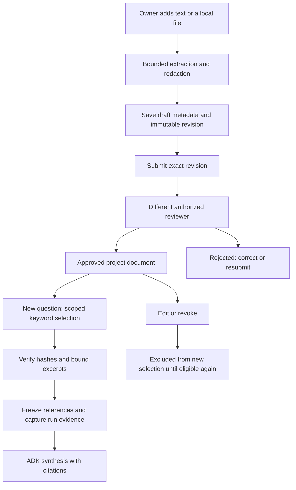
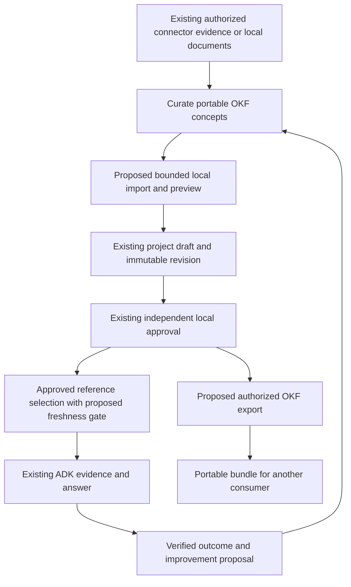
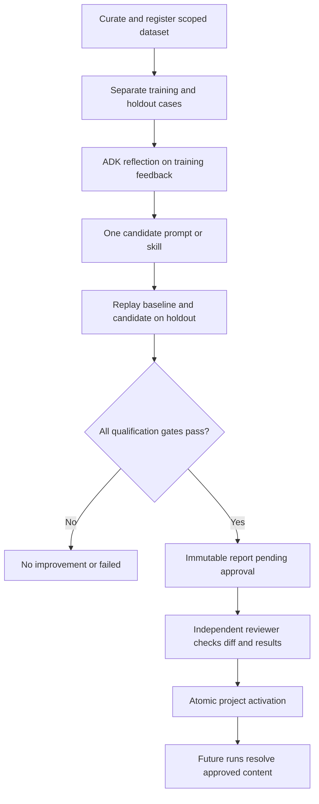
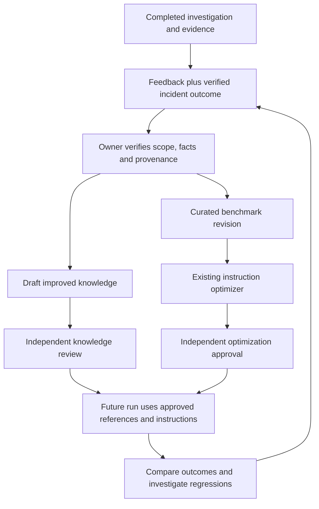

# Knowledge base, Open Knowledge Format and self-improvement

[Handbook home](README.md) · [Configuration](configuration.md#workflow-review-reusable-knowledge) · [ADK harness](harness.md) · [Database reference](data-model.md)

This handbook follows project knowledge from a local document to a reviewed reference in an ADK answer, then explains the existing prompt/skill optimizer and the work needed for a controlled improvement loop. Implementation claims describe the checked-in source; they are not evidence of a successful production deployment.

**OKF means Open Knowledge Format.** See the [researched OKF integration design](#open-knowledge-format-integration-design) for its role in the ecosystem. Application import/export remains proposed.

## Reading paths

- [Current knowledge lifecycle](#knowledge-from-authoring-to-an-answer) → [retrieval](#exact-knowledge-retrieval-rules) → [storage and APIs](#knowledge-storage-and-ownership).
- [OKF ecosystem design](#open-knowledge-format-integration-design) → [mapping](#okf-content-model-and-mapping) → [import/export](#proposed-import-and-export-contract) → [delivery criteria](#delivery-sequence-and-acceptance-criteria).
- [Existing optimization](#how-the-existing-optimization-framework-works) → [evaluation gates](#qualification-gates) → [approval](#optimization-approval-storage-and-apis).
- [Proposed improvement loop](#proposed-self-improvement-loop) → [milestones](#implementation-milestones) → [measurement](#measurement-and-regression-handling).

## What exists today

| Capability | Current behavior | Boundary |
| --- | --- | --- |
| Project knowledge | Reviewed, versioned documents with bounded keyword retrieval | No embeddings/vector index or automatic ingestion from connectors |
| Incident evidence | Read-only connector observations and local attachments captured per run | A runbook is guidance, not proof of the current cause |
| Answer feedback | Run author records `helpful` or `needs_work` and a redacted note | A rating is not a verified outcome or approval |
| Optimization | ADK reflection proposes one prompt or skill change; held-out replay evaluates it | Knowledge documents are not optimization targets |
| Activation | Independent reviewer approves an eligible immutable report | No self-approval, autonomous rollout or automatic rollback API |
| Self-improvement | Humans can curate better knowledge and evaluate instruction changes | Automated feedback-to-dataset and feedback-to-knowledge pipelines are future work |

Sources: [knowledge service](../app/configuration/knowledge.py), [feedback API](../app/api/routes/feedback.py), [optimization models](../app/optimization/models.py), [evaluation](../app/optimization/evaluation.py), [approval service](../app/optimization/service.py).

## Knowledge from authoring to an answer

Project knowledge is a reviewed document library. It is separate from chat uploads, specalist instructions and conversation history. Documents supply reference guidance; they do not train the model, create a vector index, grant connector access or prove a current incident cause.



Reading path: [author](project.md#workflow-c-turn-a-document-into-reusable-knowledge) → [store](#knowledge-storage-and-ownership) → [review](#knowledge-review-state-transitions) → [retrieve](#exact-knowledge-retrieval-rules) → [capture](data-model.md#run-and-evidence-records) → [synthesize](harness.md#stage-contracts).

## Knowledge form and upload behavior

A project owner or platform administrator can create text or upload a local file. The editor accepts title, category, tags and text/file content. The service bounds title to 256 characters, category to 128, tags to 32 entries of at most 64 characters, and text to the active extracted-text limit within the model's one-million-character ceiling. The active file configuration decides enabled formats and lower file/parser limits; a form's file picker is not the security check.

Uploads are authenticated before multipart work, parsed locally, and stored with filename, original hash, byte count and extraction warnings. The saved searchable text is redacted. Image content contributes OCR text only. The original binary is retained separately and can contain information removed from the text preview. Text editing preserves the uploaded original; replacing the file replaces its upload metadata through a new revision.

Sources: [document input/service](../app/configuration/knowledge.py), [upload route](../app/api/routes/knowledge_uploads.py), [request boundary](../app/api/application.py), [editor](../frontend/src/components/KnowledgeDocumentForm.tsx).

## Knowledge review state transitions

| Action | Starting state | Result and control |
| --- | --- | --- |
| Save new text/file | New document | Creates revision 1 as `draft` |
| Edit text or replace file | Existing document with expected current hash | Increments revision, returns to `draft`, clears review fields |
| Submit | `draft` or `rejected` | Moves exact verified revision to `pending` |
| Approve | `pending` | Moves to `approved`; reviewer must differ from revision author |
| Reject | `pending` | Moves to `rejected`; reviewer must differ from revision author |
| Revoke | `approved` | Moves to `revoked`; stops new-run selection |

Review actions require an authorized owner/administrator in the same project, the expected hash and a nonblank bounded reason. State and concurrency checks reject stale writes. A rejected revision can be resubmitted; changing its content creates another draft revision. Legacy records without an immutable content hash require a new save before review. Deletion returns `405`; use revocation to preserve history. Sources: [lifecycle implementation](../app/configuration/knowledge.py), [review endpoints](../app/api/routes/knowledge_uploads.py), [delete boundary](../app/api/routes/catalog.py).

Editing an approved document immediately makes the current document a draft, so the previous approved version is not retained as a fallback for new retrieval. Already frozen references and completed run evidence are not rewritten by later edits or revocation. This is selection-time eligibility, not retroactive cancellation of a run that already captured its reference.

## Exact knowledge retrieval rules

The current implementation uses **literal keyword matching, not embeddings or semantic/vector search**:

1. Extract distinct case-folded alphanumeric terms of 3–64 characters from the question. Take the first 12, then discard the service's common stop words. With no remaining terms, no evidence slots, or less than 128 characters of reference budget, select nothing.
2. Search only the authenticated tenant/project's `approved` documents with a content hash and an independent recorded reviewer. Match terms against **title and content**. Category and tags help browsing/organization but do not participate in this runtime relevance score.
3. For each term, add three points for a title match and one for a content match. Order by total score, then most recently updated document, then document ID.
4. Select at most **three documents**, further reduced by remaining evidence capacity. Unrelated questions can select none; adding a document does not guarantee it will appear in every answer.
5. Verify each selected immutable revision against its current metadata/content snapshot. An integrity mismatch raises a conflict rather than silently trusting altered content.
6. Share the bounded character allowance among selected documents. Position each excerpt near its earliest matching content term; title-only matches start at the beginning. Retain excerpt start and truncation information.
7. Freeze document IDs, revision hashes, reviewer metadata and excerpts into `knowledge_references` in the run contract. During live execution after successful preflight, capture each selected reference into current-run evidence before the ADK agents run.

The runner allocates knowledge at most the smaller of one quarter of `max_context_chars` and `max_evidence_chars`, and reserves evidence capacity for attachments and capability actions. Later whole-request context projection can further bound what a model sees. An approved reference cannot replace a required live connector or turn a preflight-blocked run into a diagnosis. Sources: [`KnowledgeService.relevant`](../app/configuration/knowledge.py), [selection/capture in the runner](../app/runtime/runner.py), [model context projection](../app/runtime/context.py).

For example, a question mentioning “database timeout” can select a reviewed timeout runbook when those terms occur in its title or content. That document explains possible diagnostic steps. A current database-lock claim still needs supporting incident observations; keyword relevance is not causal evidence or a semantic similarity score.

## Knowledge storage and ownership

| Record/content | Location and purpose |
| --- | --- |
| Current document | `platform.platform_knowledge`: scoped identity, content, title/category/tags, revision, status, author/reviewer, content hash and upload metadata |
| Immutable revision | Content-addressed JSON snapshot through `ConfigurationBlobStore`, at the project knowledge artifact URI |
| Uploaded original | Separate binary blob referenced by `upload.original_blob_hash`; not a redacted text export |
| Review history | `governance.parameter_audit` with `tool='knowledge'`, document ID as `variable_name`, actor/action/revision and hash/reason details |
| Selected run reference | `knowledge_references` in the serialized run snapshot, then captured `runtime.evidence` for the live run |

Owners/administrators can manage all lifecycle states in their project. Ordinary project members see eligible approved catalog entries; non-approved originals/history are restricted to owners/administrators. The list endpoint caps output at 500 records; per-document history caps output at 100 newest events. Neither is an unlimited audit export. Sources: [knowledge service and blob initialization](../app/configuration/knowledge.py), [project artifact paths](../app/connectors/providers/project_storage.py), [table dictionary](data-model.md#governance-records).

## Knowledge API reading path

| Operation | Endpoint |
| --- | --- |
| List approved or manageable documents | `GET /api/v1/knowledge` |
| Create text draft | `POST /api/v1/knowledge` |
| Edit text with expected hash | `PUT /api/v1/knowledge/{doc_id}` |
| Upload or replace original | `POST /api/v1/knowledge/upload`; replacement requires `doc_id` and `expected_hash` |
| Submit / approve / reject / revoke | `POST /api/v1/knowledge/{doc_id}/{action}` with `expected_hash` and `reason` |
| Download retained original | `GET /api/v1/knowledge/{doc_id}/download` |
| Read review history | `GET /api/v1/knowledge/{doc_id}/history` |

Sources: [text/list handlers](../app/api/routes/catalog.py), [upload/review/download/history handlers](../app/api/routes/knowledge_uploads.py).

## Knowledge troubleshooting

| Symptom | Explanation to check |
| --- | --- |
| Saved document does not affect an answer | It may still be draft/pending, unrelated to the question, outside project scope, or excluded by the top-three/evidence/context limits |
| Tags match but nothing is retrieved | Runtime retrieval scores title/content; the UI library search also searches tags/category and is a different search |
| Author cannot approve | A different authorized owner/administrator must review that revision |
| Previously used document disappears after editing | Edits return the document to draft; there is no prior-version retrieval fallback |
| Replacement or approval conflicts | Reload the exact current revision/hash before acting |
| Image upload contributes no useful facts | Only extracted OCR text is supported, not visual interpretation |
| Original differs from displayed edited text | Original download intentionally preserves source bytes; text edits are stored separately |
| Knowledge exists but live run is blocked | Required connector/model preflight still applies |
| Old answer still cites a revoked document | The old run retains its frozen historical evidence; revocation affects later selection |

Sources: [service rules](../app/configuration/knowledge.py), [library UI search](../frontend/src/pages/Knowledge.tsx), [runtime preflight](../app/runtime/runner.py).

## Implementation ownership and security

| Layer | Responsibility | Source |
| --- | --- | --- |
| Knowledge page and editor | Browse, create/edit, upload, review and inspect history; UI filters do not define runtime eligibility | [Page](../frontend/src/pages/Knowledge.tsx), [form](../frontend/src/components/KnowledgeDocumentForm.tsx) |
| HTTP boundary | Authenticate, resolve project membership, bound local uploads, expose lifecycle actions | [Authentication](../app/identity/auth.py), [routes](../app/api/routes/knowledge_uploads.py) |
| Domain service | Scope, redact, hash snapshots, enforce review/concurrency, rank references | [KnowledgeService](../app/configuration/knowledge.py) |
| Persistence | Current metadata plus separate immutable blobs and audit records | [Platform tables](../app/persistence/platform_admin.py), [blob provider](../app/connectors/providers/blob.py) |
| Runtime | Reserve budgets, freeze approved excerpts and capture evidence before ADK | [Runner](../app/runtime/runner.py), [context projection](../app/runtime/context.py) |

`X-RCA-Project` selects a project; it cannot grant membership or roles. Knowledge text is untrusted reference data even after review: embedded instructions must not widen tool permissions or override the harness. Review reduces bad-content risk but does not prove factual correctness. Preserve read-only providers, citation requirements, scope checks and request budgets independently of document content. See [identity and project boundaries](security.md) and [tool/model boundaries](harness.md#tool-and-model-boundaries).

The original file and immutable content remain sensitive artifacts. Hashes establish content identity, not encryption or anonymization. Use the deployment's storage access controls, retention and backup procedures; do not expose blob paths as public download links. Download authorization remains an API responsibility. See [storage and operations](operations.md) and [upload handler](../app/api/routes/knowledge_uploads.py).

## Open Knowledge Format integration design

**Status: proposed integration; no OKF importer, exporter or runtime graph traversal is implemented by this documentation change.** OKF means **Open Knowledge Format**, distinct from the ADK/MLflow optimizer. Research checked on 2026-09-15 uses the canonical [Google Cloud repository](https://github.com/GoogleCloudPlatform/open-knowledge-format) and [v0.2 specification](https://github.com/GoogleCloudPlatform/open-knowledge-format/blob/main/SPEC.md). Pin the upstream commit in an implementation change; `main` remains a moving reference.

### Specification baseline

OKF packages knowledge as Markdown with YAML frontmatter. Concept identity is its bundle path without `.md`; `type` is required. `index.md` and `log.md` are reserved navigation/history files. The root index may declare `okf_version: "0.2"`. Optional metadata includes `sources`, `generated`, `verified`, `status` and `stale_after`. Consumers tolerate unknown types/keys, absent optional metadata and broken links; a single verification mapping is normalized to a list. Links can be relative or bundle-root-relative. Trust signals do not grant access. Attested computations describe execution and checking; the format itself does not execute them. Read the [normative specification](https://github.com/GoogleCloudPlatform/open-knowledge-format/blob/main/SPEC.md) for complete field and conformance rules.

### Position in the RCA ecosystem

Use OKF at the import/export boundary of the existing project knowledge service. Keep SQLAlchemy records, immutable blobs, local review and ADK run snapshots as execution authorities. A portable bundle is an exchange artifact, not a replacement database, connector, agent framework or second configuration store.



Reading path: [mapping](#okf-content-model-and-mapping) → [import/review/export](#proposed-import-and-export-contract) → [ADK](#okf-retrieval-and-adk-contract) → [security](#okf-security-and-attestation-boundary) → [improvement](#okf-and-self-improvement).

### OKF content model and mapping

The following is an **RCA adapter design**, not an additional upstream schema. Keep portable metadata separate from server-controlled authorization and lifecycle fields.

| Input or identity | Proposed RCA mapping | Existing boundary to preserve |
| --- | --- | --- |
| Bundle identity and concept path | A server-owned project import identity plus normalized concept path maps to a local `doc_id` | Paths from unrelated bundles/projects cannot overwrite each other |
| `type`, title, tags and Markdown body | Store original type explicitly; use title/tags/content for the current editor/search, with a filename-derived title when omitted | Category remains an organizational field; arbitrary types cannot create tools |
| Description and unfamiliar metadata | Preserve bounded data in the immutable OKF envelope; surface a summary for reviewers | Never discard unknown metadata silently or execute YAML constructors |
| Source references and claim links | Retain provenance with bundle identity and content hashes; resolve local links through authorized document mappings | Source URLs cannot bypass connector scope or initiate upload-time fetching |
| Producer and verification metadata | Keep imported assertions visibly separate from the authenticated importer and local reviewer | A claimed human verifier cannot satisfy local independent approval |
| Portable lifecycle and freshness | Preserve source lifecycle separately; project admission/review determines run eligibility | Imported `stable` never maps directly to local `approved` |
| Immutable revision | Hash the complete normalized envelope, body and source mapping alongside local scope/revision | Metadata edits also require a new review; old snapshots must remain verifiable |
| Original material | Retain original bytes separately under existing protected blob storage | Export reviewed content by default, not unredacted uploaded originals |

Today, `KnowledgeInput` has title/category/tags/content/media type and draft status; `_snapshot` has no structured OKF envelope. The upload route extracts text and supplies form metadata, rather than interpreting frontmatter. A Markdown upload is therefore not evidence of OKF support. Sources: [knowledge model and snapshot](../app/configuration/knowledge.py), [upload route](../app/api/routes/knowledge_uploads.py).

For implementation, add a versioned optional envelope and stable import mapping through an explicit migration. Include the envelope in new immutable snapshots, while verifying legacy snapshots using their original shape. Do not rewrite old hashes in place. Reuse `platform.platform_knowledge`, the existing audit service and blob provider; introduce a separate bundle table only if atomic multi-document lifecycle or querying requires one. These additions are proposed, not existing columns. See [data model](data-model.md#governance-records).

### Proposed import and export contract

**Import:** extend the knowledge workflow with a preview that shows mapped concepts, original versus redacted content, source claims, missing references and conflicts. Authenticate and derive project membership before parsing. In the first application slice, accept one bounded local concept at a time and clearly label that limited support. Do not advertise complete bundle import until multi-document path mapping and transaction behavior are implemented.

A later bundle importer should enumerate entries without extracting arbitrary paths, bound total expanded bytes/file count/depth, and reject symlinks, traversal, duplicate normalized paths and unsafe YAML structures. Validate the full request before committing documents. Save every admitted concept as a local draft through the existing service; local review remains mandatory. Report format diagnostics separately from application admission restrictions. An unknown type, optional field or unresolved knowledge link alone is not an application security failure. Oversized or unsafe content can be refused under the stated local input policy.

**Update:** map an existing concept only within the same server-established bundle/project identity. Require the expected current hash for every replacement. Report duplicate/new/conflicting concepts explicitly; do not overwrite based only on a filename supplied by the uploader. A partial or cancelled import must not activate a subset. Use atomic commit for a bounded bundle, or an explicitly staged import with a manifest before committing any drafts.

**Export:** reauthorize the requester and verify the exact revisions selected. Export approved, eligible content by default; any administrative draft export must clearly retain draft semantics. Preserve safe unknown metadata and concept identities, and generate navigation from the actual exported set. Do not include credentials, internal storage URIs, unrelated project documents or unredacted originals. Preserve unresolved links as visible diagnostics; never fetch their targets to “complete” a bundle. If filtering removes a linked document, show that omission instead of silently substituting another source.

A proposed `rca` extension can carry source document/revision/hash identity for an authorized export, but another project must treat it as provenance, not authorization. Redaction or privacy filtering changes the exported artifact: retain separate source-revision and exported-artifact hashes and disclose transformations. An export is not byte-for-byte original recovery; the existing original-download API already serves that separate purpose.

Proposed API shape: `POST /api/v1/knowledge/okf/preview`, `POST /api/v1/knowledge/okf/import`, and `POST /api/v1/knowledge/okf/export`. These routes **do not exist today**. Preview should return diagnostics and a content hash; import must revalidate those exact bytes and expected local revisions. Export should return a bounded downloadable artifact. Reuse existing error conventions and lifecycle endpoints rather than inventing a second approval system. Source integration points: [knowledge routes](../app/api/routes/knowledge_uploads.py), [catalog](../app/api/routes/catalog.py).

### Example RCA concept

The following proposed export content describes the existing read-only policy. It is documentation, not an imported production record. A real export must derive provenance and revision identifiers from the authorized saved record; this example deliberately makes no approval or successful-execution claim.

```yaml
---
type: Playbook
title: Investigate Oracle symptoms using bounded diagnostics
description: Collect authorized diagnostic observations before drawing a causal conclusion.
tags: [oracle, diagnostics]
status: draft
---
```

The Markdown body would explain the observed symptoms, the project/environment to inspect, which existing diagnostic actions apply, evidence needed for a conclusion, and when to return insufficient evidence. It must not contain instructions to run arbitrary model-generated SQL. Related concepts can describe the saved resource and relevant table semantics, with links resolved within the exported bundle. Source policy: [shared engineering instructions](../AGENTS.md), [connector runtime](connectors.md#runtime-resolution).

### Project and administration experience

The project Knowledge page should offer an OKF import preview, concept detail, source references, local review state and export of selected eligible revisions. Show “Imported verification claim” separately from “Approved in this project.” Make unresolved links, pending review and expired guidance understandable without exposing storage details. The existing text/file editor and review dialog remain the foundation. Sources: [Knowledge page](../frontend/src/pages/Knowledge.tsx), [editor](../frontend/src/components/KnowledgeDocumentForm.tsx).

Administrators should manage import limits, retention, export permission and freshness policy through the existing database-first configuration system and normal approval rules. Propose parameter definitions only for actual runtime consumers; do not add decorative settings. Project owners curate content and resolve conflicts. Ordinary members consume approved material within their existing access; OKF does not add a new role or permit cross-project sharing automatically. See [administration map](project.md#administration-page-map), [scope precedence](configuration.md#scope-and-precedence) and [security](security.md#roles-and-project-membership).

### OKF retrieval and ADK contract

Preserve bounded title/content matching for the initial adapter. Import alone does not provide semantic search, graph retrieval or a larger context window. Before selection, the proposed runtime checks local approval plus an explicit freshness/lifecycle policy; stale or deprecated references should be excluded from new diagnostic context by default and shown to owners for review. Missing freshness data must be displayed as unknown, not invented as an expiry or rejected as an invalid OKF concept.

Freeze bundle/concept identity, envelope hash, local document revision, source references and selected excerpts into the run contract before ADK execution. Record which freshness decision was applied. Keep source claim links usable when excerpts are truncated, and distinguish guidance citations from current connector observations. Historical runs retain their captured material even if the source bundle later changes.

If linked-concept retrieval is added later, bound hop count, visited concepts, evidence slots, bytes and deadline; detect cycles; verify scope, revision and eligibility for every hop. Broken links produce diagnostics, not network requests. A link to a different project must not disclose its title or existence. Reuse the current evidence-capture path rather than adding unrestricted filesystem-reading tools to agents. Sources: [current retrieval](../app/configuration/knowledge.py), [runner](../app/runtime/runner.py), [context bounds](../app/runtime/context.py).

### OKF security and attestation boundary

Imported frontmatter, Markdown, actor strings, links and referenced code are all untrusted input. Parse YAML as bounded data, reject dangerous constructors, and constrain recursion/aliases before expanding them. Keep active HTML and remote media out of the UI. A leading slash in a concept link must resolve inside the bundle namespace, never the server filesystem or arbitrary application route.

For this ecosystem, an imported computation is **documentation only**. Its executor/attester references cannot install code, register an ADK tool, issue SQL or run a shell. Oracle remains restricted to fixed bounded diagnostics; other connectors retain their saved project/action/resource policies. A future execution feature would require separately reviewed, preinstalled provider implementations with typed parameters and deterministic receipt validation. It must never run code shipped in a knowledge upload. See [connector boundary](security.md#connector-security-boundary) and [provider policy](connectors.md#runtime-resolution).

Local review establishes approval of one content revision; it does not establish that any described computation ran correctly. A future attestation result would need per-run evidence linking a registered implementation, parameter values, result and deterministic verdict. Until that exists, label computations “not executed/attested by RCA,” never infer an attestation from imported metadata or an LLM judgment.

### OKF and self-improvement

OKF supplies a portable representation for proposed knowledge changes. It does not close the learning loop by itself. Start with verified incident evidence, curate a candidate concept with provenance, compare it to the approved local revision, run knowledge-specific evaluation, and submit the exact revision for independent approval. Export the reviewed material only within sharing policy. The existing prompt/skill optimizer remains a separate mechanism.

For repeatable evaluation, extend the proposed corpus-aware replay input to include the exact bundle/concept hashes and local eligibility decisions. Test retrieval against both baseline and candidate corpora using incident-disjoint holdouts. Measure missing guidance, irrelevant references, unsupported citations, stale-source use and abstention. Avoid treating source popularity, imported verification strings or user ratings as ground truth.

A source change or freshness deadline should create a review proposal, not silently edit approved content. Automated connector refresh, scheduled import, knowledge evaluation and durable proposal processing are all future work. Reuse the [self-improvement milestones](#implementation-milestones), with OKF import/export as a portability step and corpus-aware evaluation as a prerequisite for claims of measured knowledge improvement.

### Delivery sequence and acceptance criteria

| Slice | Concrete delivery | Required verification |
| --- | --- | --- |
| Metadata foundation | Versioned envelope, bounded parsing, migration and immutable review coverage | Unknown-field preservation, missing optional metadata, legacy-hash compatibility, no imported approval |
| Single-concept workflow | Real import preview, draft save and authorized export in the existing Knowledge page | Round-trip semantics, redaction disclosure, hash conflicts, original separation, unauthorized access |
| Bundle workflow | Stable concept mappings, navigation, staged/atomic bounded import and export | Traversal/symlinks, collisions, archive expansion limits, missing links, cycles and cross-project isolation |
| Runtime use | Freshness admission and provenance in bounded evidence snapshots | Tampering, expired references, edit/revoke behavior, excerpt attribution and deterministic budgets |
| Improvement measurement | Frozen-corpus baseline/candidate replay and independent review | Holdout leakage checks, retrieval/answer regression gates and verifiable source outcomes |

Do not add a graph database, embedding service, upstream reference agent or new orchestration dependency merely to support the interchange format. Existing storage and native ADK remain adequate until measured requirements show otherwise.

## How the existing optimization framework works

Knowledge improves the references an agent can consult. Optimization changes one existing instruction asset: a `prompt` or `skill`. It does not update model weights, register new tools or rewrite approved knowledge documents. The request identifies a registered dataset/version and existing target name. A skill must belong to the selected capability. Sources: [request/dataset models](../app/optimization/models.py), [target selection](../app/optimization/content.py), [service validation](../app/optimization/service.py).



Reading path: [dataset](#datasets-and-replay-boundaries) → [gates](#qualification-gates) → [approval/storage](#optimization-approval-storage-and-apis) → [ADK execution](harness.md#from-configuration-to-execution).

### Datasets and replay boundaries

A dataset has an immutable project-scoped ID/version, capability, purpose (`example` or `benchmark`), and separate `train`/`holdout` cases. Each case records a prompt, incident ID, recorded ticket/log evidence, attachment text, expected facts and expected outcome (`FINDINGS` or `INSUFFICIENT_EVIDENCE`). Case IDs must be unique across splits; exact duplicate case content is rejected. Registration rejects content that would change under redaction, so curators must sanitize it before registration. These checks do not detect all near-duplicate incidents or establish that expected facts are correct. Sources: [models](../app/optimization/models.py), [dataset registration](../app/optimization/service.py).

The optimizer evaluates training examples, gives their outputs/scores/rationales to a native ADK reflection agent, and proposes one revised instruction. MLflow registers prompt versions and orchestrates optimization/evaluation. Baseline and candidate are then each evaluated on the same held-out cases with configured repeats. Holdout expected answers are used by the evaluator, not supplied as reflection training feedback. Sources: [reflection and replay implementation](../app/optimization/evaluation.py).

Replay creates temporary isolated run/session stores and uses recorded `itsm` and `log_search` connector responses plus recorded attachment text. It exercises the ADK execution path with configured model calls; it does not contact those live source systems. This replay coverage must not be presented as verification of all ten providers or production knowledge retrieval. The case schema has no knowledge-library snapshot input, and the temporary replay runner is not connected to the production knowledge service. Failed investigations remain zero-quality data points rather than disappearing from the comparison. Source: [`ReplayEvaluator.run_case`](../app/optimization/evaluation.py).

### Qualification gates

The configuration model declares the defaults below; inspect effective deployment configuration before assuming those values are active. Sources: [configuration model](../app/optimization/models.py), [comparison rules](../app/optimization/evaluation.py).

| Gate | Declared default/rule |
| --- | --- |
| Dataset | Purpose must be `benchmark`; example datasets cannot qualify |
| Case capacity | At least 3 training and 5 holdout cases; at most 20 per split; 2 holdout repeats |
| Overall quality | Candidate mean correctness/groundedness quality at least 0.8 and gain at least 0.02 |
| Per-case regression | Average quality loss for any case at most 0.1 |
| Hard result checks | Candidate safety, citation integrity and expected-outcome scores must each be 1, without baseline regression |
| Coverage | Baseline/candidate must contain every expected case/repetition |
| Latency | Candidate mean latency no more than 1.5 times baseline |
| Tokens | Complete token accounting required; candidate mean no more than 1.25 times the larger of baseline mean and 1 token |
| Execution bounds | 256 model calls, 1,800-second timeout, 16,000-character instruction and 2 MiB blob bounds |
| Authenticity | Injected test models and unchanged candidate text cannot qualify |

A passing score means observed improvement on these held-out replays. Model-judged correctness/groundedness and safety are fallible; citation integrity alone does not prove a citation supports the claimed cause. Token counts are not dollar cost. The four offline contracts run by `make eval` are separate verification fixtures, not this live-model benchmark and not a production quality score. See [verification](development.md#verification).

### Optimization approval, storage and APIs

Execution writes `RUNNING`, then `PENDING_APPROVAL` for an eligible comparison or `NO_IMPROVEMENT` otherwise; errors/cancellation can produce `FAILED`. An independent authorized administrator reviews the exact report hash and gives a reason. Approval checks the baseline parent and execution-context hashes again; a changed context requires reevaluation. The active project pointer is updated atomically with the decision. A stale baseline cannot silently overwrite newer approved content. Source: [optimization lifecycle](../app/optimization/service.py).

The active bundle is resolved for future execution. A changed platform baseline invalidates the old optimized overlay, so an optimization cannot hide newer trusted platform content. Prior frozen runs remain historical records. MLflow contains evaluation artifacts; database review state is the authority for activation. There is no exposed optimization revoke/rollback endpoint. Jobs are bounded in-process work with a process-wide optimization lock, not durable queued jobs with restart recovery. Sources: [effective content and lifecycle](../app/optimization/service.py), [runtime resolution](../app/runtime/runner.py).

| Record | Purpose |
| --- | --- |
| `optimization.optimization_datasets` | Scoped dataset/version, immutable blob hash, metadata and author |
| `optimization.optimization_revisions` | Request, parent/context/dataset/report hashes, deadline, status and reviewer decision |
| `optimization.active_optimized_content` | Current project report/optimization pointer |
| Optimization blobs | Dataset bodies, comparison report, baseline/candidate bundles and diff |
| MLflow experiment | Project-separated evaluation traces, metrics and registered prompt versions |

See the [complete table/column dictionary and diagnostic SQL](data-model.md) and [table declarations](../app/optimization/service.py).

| Operation | Endpoint |
| --- | --- |
| Register/list datasets | `POST /api/v1/optimization-datasets`, `GET /api/v1/optimization-datasets` |
| Start/list optimization | `POST /api/v1/optimizations`, `GET /api/v1/optimizations` |
| Read report/status | `GET /api/v1/optimizations/{optimization_id}` |
| Approve/reject | `POST /api/v1/optimizations/{optimization_id}/approve` or `/reject`, with expected hash and reason |

The [Optimization page](../frontend/src/pages/Optimization.tsx) consumes the [optimization API](../app/api/routes/optimization.py). A completed report is not permission to change provider scopes or credentials.

## Feedback and verified learning signals

The run author can read/write feedback through `GET`/`PUT /api/v1/runs/{run_id}/feedback`. A write requires a terminal run, same tenant/project/subject ownership, `helpful` or `needs_work`, a note of at most 2,000 characters and `expected_revision`. Notes are redacted; concurrent edits conflict. The table keeps the latest feedback and revision, not an immutable sequence of every prior note. Sources: [feedback API](../app/api/routes/feedback.py), [feedback persistence](../app/persistence/feedback.py).

A terminal status is broader than a successful live diagnosis; dataset curators must verify run mode, outcome and evidence before using a rating. No current handler automatically creates a knowledge draft, registers a dataset or launches optimization from feedback. A positive rating is user sentiment, not a confirmed root cause. Triage-board calibration and any previously seeded records are a separate implementation path and must not be treated as verified outcomes. See [triage boundary](project.md#triage-workspace-implementation-boundary).

## Proposed self-improvement loop

**This section is a design roadmap, not implemented automation.** The smallest useful system is a human-operated loop using existing knowledge review and optimization APIs. Automate candidate preparation only after provenance and quality checks are reliable. “Self-improving” means accumulating validated reference content and measured, approved instruction improvements; it does not mean a model rewriting its own safety rules or retraining itself online.



Reading path: [signals](#feedback-and-verified-learning-signals) → [milestones](#implementation-milestones) → [review](#knowledge-review-state-transitions) → [evaluation](#qualification-gates) → [measurement](#measurement-and-regression-handling).

### Implementation milestones

| Phase | Delivery and reuse | Acceptance boundary |
| --- | --- | --- |
| 1. Manual curation | Use existing run evidence, feedback, knowledge drafts and immutable dataset registration. Record incident/run IDs, evidence references, source time, reviewer and confirmed outcome in curated material | No unverified causal claim becomes an expected fact; no secret or cross-project content enters a dataset |
| 2. Candidate assistance | Add a bounded service that suggests document corrections from authorized evidence; save suggestions as drafts through the existing lifecycle | Generated material cannot approve itself; deduplicate proposals and record exact source/content hashes; treat source text as untrusted |
| 3. Knowledge evaluation | Extend replay inputs to freeze a reviewed knowledge corpus and measure retrieval/excerpt behavior with and without a proposed revision | This capability is missing today. Test irrelevant, revoked, tampered and cross-project references, budget exhaustion, stale guidance and appropriate abstention |
| 4. Controlled release | Add explicit reviewed restoration/rollback and rollout controls before automated activation is considered | Current knowledge revocation exists; optimization rollback/canary does not. No direct database edits as a routine release mechanism |
| 5. Scheduled operation | Only when needed, introduce durable jobs, idempotency, retries, cancellation and recovery for candidate preparation/evaluation | Current in-process work is insufficient for a restart-safe unattended loop; replay must never bypass review or modify source systems |

Reuse existing current-document, audit, dataset, optimization and evidence records. If a durable proposal queue or rollout history becomes necessary, design and migrate those records explicitly; neither a `knowledge_revisions` SQL table nor a learning-job table exists merely because a diagram names the concept. Preserve the [database-first configuration contract](configuration.md#scope-and-precedence).

### Measurement and regression handling

Before each experiment, define a held-out incident set and success criteria. Split by incident family/time where practical so copies of one outage cannot leak across training and holdout. Keep curator access to holdout answers separate from candidate-generation feedback. Exact-duplicate rejection is a starting check; use human review for near duplicates and repeated benchmark tuning.

For knowledge retrieval, measure whether an approved relevant document was selected, whether the excerpt contains the needed passage, irrelevant-reference rate, citation support and abstention when guidance is insufficient. These metrics require the proposed corpus-aware evaluation extension; the existing optimizer does not report them. For answers, retain the current quality/safety/outcome gates and add independently verified incident outcomes. Compare latency and token usage on like-for-like runs, and segment by capability, project and incident type.

For a bad knowledge update, revoke it to exclude it from later selection, then submit a corrected revision for independent approval. Inspect affected run hashes rather than rewriting old answers. For a bad optimized instruction, pause further approval and follow an operator-reviewed recovery plan; implement and verify an explicit rollback path before claiming automatic recovery. Monitor rate changes only with adequate samples and report uncertainty: a few helpful votes or passing fixtures do not demonstrate improvement.

### Worked learning cycle

Consider a user reporting that a timeout answer missed a relevant diagnostic step. First inspect the actual run evidence and selected knowledge hashes. Determine whether the cause was missing source observations, absent guidance, keyword retrieval, excerpt truncation or synthesis. These require different corrections: changing a prompt cannot supply a missing connector observation.

If validated guidance was absent, an owner writes a scoped runbook draft citing the confirmed incident evidence; another authorized reviewer approves it. If synthesis ignored available evidence, a curator creates sanitized training and holdout cases, evaluates one prompt/skill revision and submits an eligible report for independent review. If retrieval failed, improve the document's factual title/content or make a separately reviewed retrieval-code change; the existing prompt optimizer cannot modify the keyword algorithm.

Finally, run a new authorized investigation and inspect its frozen references, citations and outcome. Preserve the old answer and review trail. This is a repeatable improvement loop using present capabilities, with human verification connecting its parts.

## Verification and operator checklist

- Verify tenant/project membership, independent approval, stale-hash conflicts and blob integrity before enabling knowledge use.
- Exercise text upload, replacement, original download, edit-to-draft, reject/resubmit and revocation; inspect extraction warnings and reference budgets.
- Confirm a relevant approved document is captured with its revision/hash in a new live run, and that irrelevant or unauthorized documents are excluded.
- For optimization, inspect the benchmark provenance, full holdout coverage, candidate diff, limits, context hash and independent reviewer before activation.
- Run repository checks described in [development](development.md#verification). Existing [knowledge lifecycle tests](../tests/integration/test_knowledge_lifecycle.py), [feedback tests](../tests/integration/test_feedback.py) and [evaluation implementation](../app/optimization/evaluation.py) are starting evidence, not a substitute for target-deployment verification.

The original complete connector form reference remains preserved at [connector specification](reference/connector-specifications.md#connector_form); its duplicate text export was removed only after a substantive-content comparison. Knowledge and optimization details here supplement the five primary guides without restoring fragmented short documents.
