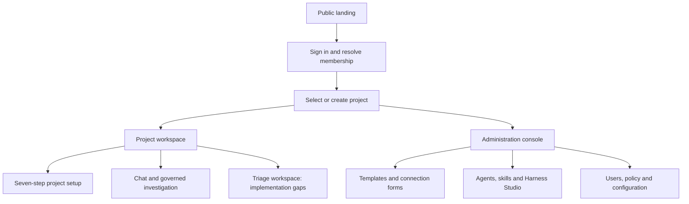
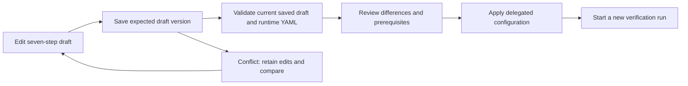
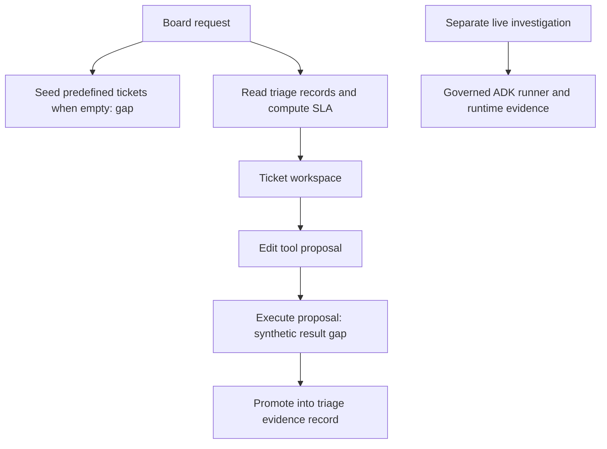

# Project and components

RCA assist helps a team investigate incidents using bounded, attributable evidence. Its useful output is a finding with sources, uncertainty, and a next step—not merely a successful workflow status. The product entry is the [React application](../frontend/src/App.tsx); execution is owned by the [runtime runner](../app/runtime/runner.py).

## Contents

- [Chat and metrics development contract](#chat-and-metrics-development-contract)

- [User journey](#user-journey)
- [Component ownership](#component-ownership)
- [Roles and workspaces](#roles-and-workspaces)
- [Release boundary](#release-boundary)
- [Workflow A: establish a project workspace](#workflow-a-establish-a-project-workspace)
- [Workflow B: investigate and inspect an answer](#workflow-b-investigate-and-inspect-an-answer)
- [Workflow C: turn a document into reusable knowledge](#workflow-c-turn-a-document-into-reusable-knowledge)
- [Workflow D: evaluate usefulness and recorded usage](#workflow-d-evaluate-usefulness-and-recorded-usage)
- [Administration and project navigation flow](#administration-and-project-navigation-flow)
- [Administration page map](#administration-page-map)
- [Project page map](#project-page-map)
- [Seven-step project setup](#seven-step-project-setup)
- [Triage workspace implementation boundary](#triage-workspace-implementation-boundary)

## Chat and metrics development contract

**Status: development requirements, not verified deployment behavior.** Extend existing Chat, Insights and Metrics. CopilotKit adoption is conditional on the [compatibility trial](development.md#chat-and-metrics-delivery-plan); native ADK and SQLAlchemy remain authoritative.

The target chat journey is:

1. Open an authorized project and private conversation. Show environment and capability; reuse relevant saved context and clarify missing essentials before investigation.
2. Submit text and bounded local attachments. Persist the turn and associate each investigation with the conversation. Repeated submission must not duplicate execution.
3. Show recorded activity, tool outcomes, elapsed time and failures. Label this **Activity** or **Investigation steps**, without fabricated stages or private model reasoning.
4. Return findings with citations, uncertainty and next checks. Open evidence and artifacts from the answer. Follow-ups create linked runs while preserving earlier findings and identifying new evidence.
5. Stop through backend cancellation, reopen saved history and reconnect with the correct stream cursor. Reconnection does not imply background execution or process-restart recovery.

Starting points: [Chat](../frontend/src/pages/Chat.tsx), [chat service](../frontend/src/services/chat.ts), [chat routes](../app/api/routes/chats.py), [intent resolver](../app/runtime/intent.py), [message store](../app/persistence/chat_messages.py), [runner](../app/runtime/runner.py), [safe answer renderer](../frontend/src/components/AnswerMarkdown.tsx). These are implementation anchors, not end-to-end acceptance evidence.

| Metrics surface | Required behavior |
| --- | --- |
| Project `/p/:projectKey/metrics` | Scoped backlog, priorities, triage/resolution times and SLA coverage where recorded; investigation outcomes, stage/tool latency, tokens/cache/cost and feedback. Scope carries through charts, drilldowns and exports. |
| Platform `/admins/metrics` | Explicitly authorized tenant totals and project comparisons. Links open accessible project views. Project membership or ownership alone must not grant tenant-wide measurements. |

Show definitions, sample counts, coverage and last update. Support time range, capability and recorded environment/instance dimensions only where the API implements them. Distinguish no records from unavailable measurements. Demo filters persisted simulated runs; it does not generate dashboard data. See [metric definitions](development.md#metric-definitions-and-acceptance).

The current [Metrics page](../frontend/src/pages/Metrics.tsx) and [metrics routes](../app/api/routes/metrics.py) already exist; project metrics reuse [telemetry](../app/persistence/telemetry.py). Reconcile overlap with [Insights](../frontend/src/pages/Insights.tsx) through shared calculations and an explicit navigation decision. Preserve direct links, project switching, browser history and Command Palette discovery.

## User journey

1. Sign in and open an accessible project. Project selection never grants access.
2. Ask a question in Chat, optionally attaching local files. Intent resolution can request clarification without calling investigation tools.
3. For a supported investigation, the server resolves approved configuration and available sources, then executes the native ADK workflow.
4. Read the answer, inspect cited sources and saved activity, and reopen the conversation later.
5. Add reusable documents through Knowledge's independent review flow. Inspect measured usage in Insights and give feedback on eligible answers.

Sources: [project access](../app/identity/auth.py), [intent routing](../app/runtime/intent.py), [Chat](../frontend/src/pages/Chat.tsx), [knowledge](../app/configuration/knowledge.py), [telemetry](../app/persistence/telemetry.py), [feedback](../app/persistence/feedback.py).

## Component ownership

| Component | Responsibility | Implementation |
| --- | --- | --- |
| Workspace | Project navigation, conversation, source inspection, administration | [frontend/src](../frontend/src) |
| HTTP boundary | Request limits, authentication, route composition, responses | [application](../app/api/application.py), [routes](../app/api/routes) |
| Identity and access | Verified identity, active database membership, server-derived roles | [identity](../app/identity), [access policy](../app/policy/access.py) |
| Configuration | Validated bundles, delegated settings, parameters, reviewed definitions | [configuration](../app/configuration) |
| Capability resolution | Determines which approved investigation and actions may run | [capabilities](../app/capabilities) |
| Runtime | Project resources, preflight, immutable run contract, budgets, outcomes | [runtime](../app/runtime) |
| ADK agents | Planning, evidence stages, specialist delegation, synthesis | [root graph](../app/agents/root.py) |
| Domain tools | Typed operations exposed to agents | [tools](../app/tools/domain) |
| Providers | Network clients, credentials, external resource limits, blob access | [providers](../app/connectors/providers) |
| Input processing | Bounded local parsing and text extraction, image OCR | [inputs](../app/inputs) |
| Persistence | Runs, evidence, chats, membership, configuration and audit records | [persistence](../app/persistence), [migrations](../migrations) |
| Evaluation and telemetry | Offline contracts, reviewed optimization, recorded timings and usage | [optimization](../app/optimization), [observability](../app/observability) |

The [ADK CLI entrypoint](../agents/rca_analyzer/agent.py) is inert development scaffolding. The authenticated API constructs the governed investigation graph.

## Roles and workspaces

A deployment has one tenant and multiple database-managed projects. Users see active projects where they hold active membership. Administrators create projects; project owners manage delegated settings and reviews within their scope. A requested role is not an effective role until an authorized review grants it. Existing configuration and knowledge are not copied from another team's workspace when creating a project. Sources: [projects](../app/configuration/projects.py), [access requests](../app/configuration/project_access.py).

## Release boundary

| Area | Current interpretation |
| --- | --- |
| Connector policy | All ten implemented connector types are available according to project enablement, capability actions, credentials and resource constraints |
| Runtime gaps | The registry includes all ten providers, but Oracle is still blocked by an old policy guard and baseline templates disable the eight additional providers; see [configuration](configuration.md#all-connectors-enabled-per-project) |
| Database and external writes | Oracle scope is fixed read-only diagnostics; arbitrary/model-supplied SQL, Jira mutations and other source-system writes remain unsupported |
| Files | Local uploads and bounded extraction; image OCR only, no remote URLs, macros, or arbitrary execution |
| Knowledge | Reviewed reference documents; keyword retrieval is not general semantic memory or fresh incident observation |
| Execution | API-process execution with persisted records; no durable queue, automatic resumption, or recovery worker |
| Measurements | Recorded timings and provider usage; missing values remain unknown; feedback is not an accuracy score |
| Triage workspace | Persisted workflow with static response data and synthetic proposal execution; see the [implementation boundary](#triage-workspace-implementation-boundary) |
| Demo and tests | Explicit simulations and isolated checks; neither proves live diagnosis quality or production readiness |

Sources: [provider inventory](../app/connectors/providers/registry.py), [project policy](../AGENTS.md), [parsers](../app/inputs/files.py), [knowledge retrieval](../app/configuration/knowledge.py), [runner](../app/runtime/runner.py), [telemetry](../app/persistence/telemetry.py), [offline evaluation](../scripts/eval.py).

For implementation flow, continue to [architecture](architecture.md). Detailed requirements and historical findings are indexed under [references](reference/README.md).

## Workflow A: establish a project workspace

**Actors:** platform administrator, project owner and project member. **Outcome:** an authorized workspace with configured investigation capabilities.

1. The administrator creates a project with its key, name, description and timezone through the project API. The server checks creation authority and initializes the workspace; existing private project knowledge is not copied.
2. The member opens the project list and selects an accessible project. Selection verifies active membership and derives effective roles from database records.
3. If access is missing, the user submits an access request with the desired project, role and reason. Requesting a role does not grant it.
4. An authorized independent reviewer checks the exact request hash and approves or rejects it. After approval, subsequent requests resolve the updated membership.
5. The owner configures project sources and permitted capabilities using the [configuration workflow](configuration.md#workflow-connect-a-project-source). A project existing in the database does not mean its connectors are ready.

Project selection changes the scope for subsequent work. It does not transfer another project's conversations, files, credentials or approval authority. Sources: [project service](../app/configuration/projects.py), [access review](../app/configuration/project_access.py), [project runtime](../app/runtime/projects.py).

## Workflow B: investigate and inspect an answer

**Actor:** an authorized analyst. **Prerequisites:** selected project, usable capability, configured live dependencies when live evidence is required.

1. Open Chat and describe the incident, affected environment and relevant time window. Attach local files when useful; review extraction warnings before relying on their content.
2. Submit the question. Intent resolution may ask for clarification or explain an unsupported request. That response is a valid conversation outcome and does not mean an investigation ran.
3. When investigation starts, retain the run ID and inspect saved activity. Stages reflect actual recorded progress; they are not a guaranteed percentage-complete estimate.
4. Read the result status before the answer. A simulation, blocked run or failed run does not establish a cause. A partial answer may still help identify what evidence is missing.
5. Open the cited sources. Check that observations concern the intended incident, environment and time range. Separate observations from hypotheses and reference guidance.
6. Follow up with a narrower question or obtain missing source access. Prior conversation helps interpretation, but the new run must capture evidence for new incident claims.
7. Reopen the owned chat to inspect messages, runs and artifacts. Download retained originals separately from generated run/evidence output.

Sources: [intent routing](../app/runtime/intent.py), [Chat interface](../frontend/src/pages/Chat.tsx), [run and evidence API](../app/api/routes/runs.py), [chat artifacts](../app/api/routes/chats.py).

### How to read the investigation record

| Surface | Question it answers | Interpretation limit |
| --- | --- | --- |
| Answer and findings | What does the investigation conclude? | Read uncertainty and source support before acting |
| Evidence | Which observations support the finding? | Bounded excerpts can omit source content |
| Activity and graph | Which agents and tools actually ran? | Execution success does not prove a diagnosis |
| Uploaded original | What file did the user supply? | Original bytes are distinct from redacted extracted text |
| Generated output | What terminal run/evidence content was exported? | Export is a derived view of retained records |
| Insights | What usage and timing were recorded? | Missing coverage remains unknown |
| Feedback | Did the author find this answer useful? | It is subjective feedback, not measured accuracy |

Sources: [run routes](../app/api/routes/runs.py), [artifact service](../app/persistence/chat_artifacts.py), [telemetry](../app/persistence/telemetry.py), [feedback](../app/persistence/feedback.py).

## Workflow C: turn a document into reusable knowledge

An owner or administrator saves text or uploads a local document as a draft. The author submits its exact revision; a different authorized reviewer in the same project approves or rejects it. Only eligible approved revisions can be selected for later investigations. Editing or replacing content requires a new review, and revocation removes eligibility for new runs.

Knowledge is bounded keyword-selected reference material. It can explain a system or runbook, but does not establish the current incident's cause or grant access to a connector. An unrelated question can select no document. Historical runs keep their selected revision provenance. See the [complete linked knowledge flow](knowledge.md#knowledge-from-authoring-to-an-answer), including [retrieval rules](knowledge.md#exact-knowledge-retrieval-rules) and [storage](knowledge.md#knowledge-storage-and-ownership). Sources: [knowledge lifecycle](../app/configuration/knowledge.py), [knowledge upload](../app/api/routes/knowledge_uploads.py).

## Workflow D: evaluate usefulness and recorded usage

The investigation author can rate an eligible completed live answer and add a bounded note. Updates use revision checks so a stale editor cannot silently overwrite a newer rating. Insights aggregates recorded model usage and timings; administrator-approved rates support estimates when coverage permits. Neither ratings nor usage automatically changes an agent, approves a prompt or creates a live-model accuracy score.

When reviewing performance, first check selected dates, project and mode; then inspect reporting coverage and the relevant run traces. Treat unknown token counters and unavailable complete cost estimates as missing information. Sources: [feedback API](../app/api/routes/feedback.py), [telemetry API](../app/api/routes/telemetry.py), [pricing lifecycle](../app/configuration/model_pricing.py).

## Administration and project navigation flow

The public landing page is `/`. The authenticated application recognizes `/workspace`, project paths such as `/p/{project_key}/{page}`, and administration paths. Page availability is filtered by saved UI navigation and user context; the API remains the authorization boundary. A direct URL is not a permission grant. Source: [application routing](../frontend/src/App.tsx), [sidebar filtering](../frontend/src/components/Sidebar.tsx).

Reading path: [membership](security.md#request-authorization) → [project setup](#seven-step-project-setup) → [administration](#administration-page-map) → [runtime](architecture.md#detailed-execution-walkthrough).

## Administration page map

Each row links the page's user responsibility to its actual API/service. Display names may follow the configured navigation. The mere presence of a setting does not prove a scheduler, enforcement loop or provider integration consumes it.

| Page | What the administrator does | Backend/data path |
| --- | --- | --- |
| Overview | Inspect readiness and navigate to configuration needs | [Overview](../frontend/src/pages/Overview.tsx), [health/catalog API](../app/api/routes/catalog.py) |
| Tools | Manage templates, instance forms, connections, field governance and probes | [Tools](../frontend/src/pages/Tools.tsx), [connector API](../app/api/routes/connectors_api.py), [connector records](data-model.md#connector-records) |
| Parameters | Inspect typed definitions, ownership, scoped overrides and effective values | [Parameter Studio](../frontend/src/pages/ParameterStudio.tsx), [parameter API](../app/api/routes/parameters.py) |
| Capabilities | Inspect available investigation contracts and allowed actions | [Capabilities](../frontend/src/pages/Capabilities.tsx), [capability resolution](../app/capabilities/registry.py) |
| Agents / Harness Library | Inspect/select governed agent content and review workspace configuration | [Agents](../frontend/src/pages/Agents.tsx), [Harness Library](../frontend/src/pages/HarnessLibrary.tsx), [harness handbook](harness.md) |
| Skills | Manage eligible skills, inheritance and revisions | [Skills](../frontend/src/pages/Skills.tsx), [skill lifecycle](../app/configuration/skill_catalog.py) |
| Runtime | Inspect/configure supported stage models, instructions and limits | [Runtime](../frontend/src/pages/Runtime.tsx), [stage endpoints](../app/api/routes/catalog.py) |
| Users / roles | Manage server-side membership and permitted role operations | [Users](../frontend/src/pages/Users.tsx), [identity checks](security.md#roles-and-project-membership) |
| Policy / Governance | Review policy and audit/review information | [Policy](../frontend/src/pages/Policy.tsx), [Governance](../frontend/src/pages/Governance.tsx), [review boundaries](security.md#independent-review-and-stale-writes) |
| Settings | Configure supported deployment/UI/authentication settings through their distinct services | [Settings](../frontend/src/pages/Settings.tsx), [deployment API](../app/api/routes/deployment_settings.py), [OIDC](../app/configuration/oidc.py) |
| Persistence | Inspect file limits/retention and explicit maintenance controls | [Persistence](../frontend/src/pages/Persistence.tsx), [operations runbook](operations.md#runbook-retention-and-restoration) |
| Billing | Inspect recorded usage/configuration and governed price inputs where available | [Billing](../frontend/src/pages/Billing.tsx), [telemetry](../app/api/routes/telemetry.py); estimates are not invoices |
| Health checks / Alerts | Inspect probes, persisted alerts and supported status changes | [Health checks](../frontend/src/pages/HealthChecks.tsx), [Alerts](../frontend/src/pages/Alerts.tsx), [catalog endpoints](../app/api/routes/catalog.py) |
| Optimization | Manage existing evaluation/optimization and reviewed promotion flow | [Optimization](../frontend/src/pages/Optimization.tsx), [optimization service](../app/optimization/service.py) |

Most project administrative editing uses owner/platform authority, while protected connection identity and platform settings require platform authority. Refer to the endpoint for exact roles and revision fields; UI visibility is not the authoritative permission matrix.

## Project page map

| Page | What the user follows | Data and interpretation |
| --- | --- | --- |
| Chat | Question → clarification or investigation → answer and cited sources | [Chat](../frontend/src/pages/Chat.tsx), [intent service](../app/runtime/intent.py), [run API](../app/api/routes/runs.py) |
| Runs | Saved execution status, result and trace | [Runs](../frontend/src/pages/Runs.tsx); persisted execution is not crash recovery |
| Knowledge | Draft/upload → independent review → eligible reference | [Knowledge](../frontend/src/pages/Knowledge.tsx), [knowledge lifecycle](configuration.md#workflow-review-reusable-knowledge) |
| Insights | Recorded usage, timing, coverage and feedback | [Insights](../frontend/src/pages/Insights.tsx); missing metrics remain unknown |
| Artifacts | Owned uploaded originals and generated run outputs | [Artifacts](../frontend/src/pages/Artifacts.tsx), [chat artifact API](../app/api/routes/chats.py) |
| Orchestration | Inspect the selected run graph/activity | [Orchestration](../frontend/src/pages/Orchestration.tsx), [run trace API](../app/api/routes/runs.py) |
| Triage board / Tickets | Queue state, ticket workspace and operational actions | [Board](../frontend/src/pages/TriageBoard.tsx), [Tickets](../frontend/src/pages/ProjectTickets.tsx); see gaps below |
| RCA workbench | Investigation/proposal/evidence workflow around triage records | [Workbench](../frontend/src/pages/RCAWorkbench.tsx); distinct from the governed run path |
| Feedback | Project feedback views | [Project feedback](../frontend/src/pages/ProjectFeedback.tsx); inspect which feedback service supplies the record |
| Docs | In-application reference surface | [Docs page](../frontend/src/pages/Docs.tsx); repository technical handbook starts at [docs index](README.md) |
| Project setup | Edit delegated workspace configuration | [Project setup](../frontend/src/pages/ProjectSetup.tsx), seven-step flow below |

## Seven-step project setup

Project creation and project setup are separate. Creation establishes the authorized workspace identity; setup edits the saved draft and delegated runtime configuration. Connector credentials/instances use their own endpoints, and adding documents uses the independently reviewed knowledge flow.

| Step | Fields/tasks | Save or validation consequence |
| --- | --- | --- |
| 1. Basic information | Name, responsibility, objective, timezone, tags and status | Bounded metadata; project ID must match selected workspace |
| 2. Setup | Environments, owners/managers/analysts, policy references | Members reference actual subjects; active owners required before applying |
| 3. Connectors & tools | Select/configure source instances and environment assignments | Uses published templates and separate connector lifecycle |
| 4. Parameter setup | Review inherited values and permitted overrides | Resolves the five-level scope hierarchy |
| 5. Monitoring setup | Review query/availability configuration | Saved declaration alone does not establish a background monitoring worker |
| 6. Agent setup | Select eligible harness/agent resources | Must remain inside delegated capability/tool restrictions |
| 7. Review & apply | Save draft, validate schema/policy, inspect current revision, apply | Only a validation matching the current editor snapshot is actionable |

The editor saves `/api/v1/project/editor` with `expected_version`. Server validation checks required metadata, matching project identity, valid timezone, bounded document size, unique member references and active owners. Runtime setup uses `/api/v1/project/validate` and `/api/v1/project/setup`. The draft is not a credential or authorization scope source. Sources: [editor service](../app/api/routes/project_editor.py), [setup endpoints](../app/api/routes/catalog.py), [frontend steps and submit logic](../frontend/src/pages/ProjectSetup.tsx).

Reading path: [draft](#seven-step-project-setup) → [scope](configuration.md#scope-and-precedence) → [connector readiness](connectors.md#save-test-and-enable-flow) → [run](architecture.md#detailed-execution-walkthrough).

## Triage workspace implementation boundary

The triage workspace currently has persisted ticket, queue-stay, investigation, proposal, evidence, finding, action and event records. The board computes SLA state from ticket/stay inputs and ranks the queue. However, its read path leaves empty projects empty but still returns hardcoded team/health cards and related-ticket examples, and the proposal execution endpoint saves a synthetic result instead of invoking a governed connector.

Reading path: [triage tables](data-model.md#triage-records-are-a-separate-path) → [known controls/gaps](security.md#known-security-and-implementation-limits); for real source investigation use the [ADK run path](architecture.md#detailed-execution-walkthrough).

These are implementation gaps against the project's no-mock-data policy. The documentation does not certify the triage board as live-integrated, its status cards as measured health, or its approve/escalate actions as source-system writes. They must be reconciled separately. Sources: [triage API](../app/api/routes/triage.py), [SLA calculations](../app/runtime/sla_engine.py), [triage store](../app/persistence/triage.py).
