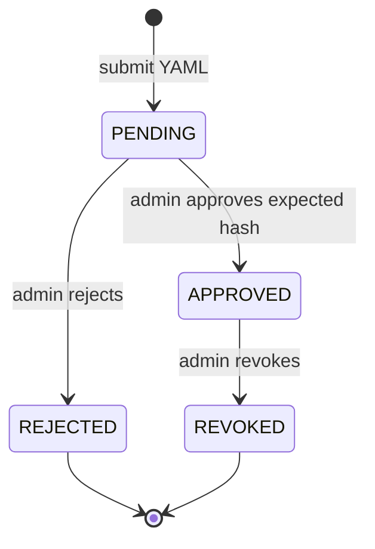

# Configuration and review contracts

This consolidated reference preserves earlier contracts, proposals and dated observations. It is not a statement that every feature is implemented or deployed. Use the [five current guides](../../README.md) for current workflows and [AGENTS.md](../../AGENTS.md) for engineering policy. Earlier connector restrictions do not override project enablement policy.

## Contents
- [admin management](#admin-management)
- [platform library](#platform-library)
- [capability authoring](#capability-authoring)
- [skill inheritance](#skill-inheritance)
- [skill lifecycle](#skill-lifecycle)
- [optimization](#optimization)
- [tool template backend](#tool-template-backend)

---

<a id="admin-management"></a>

<a id="admin-management--workspace-administration"></a>
## Workspace administration

Sign in as `PLATFORM_ADMIN` or `PROJECT_OWNER` to edit administrative settings.
The server verifies the token and scope before accepting writes.
Viewer and Manager roles can start read-only triage and view project data;
Generic User has a separate personal playground. See the
[backend access model](data-access-and-operations.md#project-access-model) for permissions and API contracts.

Administration opens at `/admin/` and page navigation stays at `/admin/#<page>`.
Signing in does not redirect administrators into their session's project URL.
The header identifies this surface as Administration for template and
configuration setup. Explicit `/p/<project_key>/` links remain project workspaces
and still reject a project key outside the authenticated scope.

The deployment boundary is shown in setup and settings instead of repeated
page-header scope badges. Session details show identity and assigned roles.
This presentation does not make saved
project configuration global: the server still applies its configured tenant and
project. Deployment identifiers come from configuration, not UI defaults.

Sources: [navigation](../../frontend/src/App.tsx),
[header](../../frontend/src/components/Topbar.tsx),
[deployment details](../../frontend/src/pages/Settings.tsx),
[authentication](../../app/identity/auth.py).

<a id="admin-management--workspace-presentation"></a>
### Workspace presentation

Open **Platform settings → Workspace presentation** to edit brand and workspace
names, the overview heading and description, the default theme and landing page,
and navigation labels, descriptions, groups, ordering, and visibility. Changes
apply immediately and reload from scoped SQL storage in subsequent sessions.
Overview and Settings stay visible so administrators retain access. Hidden links
do not change authorization. Stale saves return a conflict and require reloading.

Sources: [editor](../../frontend/src/pages/Settings.tsx),
[shell](../../frontend/src/App.tsx), [API](../../app/api/routes/ui_settings.py),
[storage](../../app/persistence/platform_admin.py),
[migration](../../migrations/history/008_platform_ui_settings.sql).

<a id="admin-management--project-settings"></a>
### Project settings

The project editor manages actual execution limits, workflow switches, report
preferences, and delegated environments. The full configuration editor exposes
other delegated sections, including capability, prompt, skill, and harness
overrides. The backend validates policy before saving. The form preserves
unchanged sections and omits sections not delegated by the deployment.
Tenant and project are taken from the authenticated snapshot.

The setup page no longer presents example people, environments, connector health,
or schedules as saved configuration. Membership, connectors, skills, and
capabilities use their dedicated screens. There is no background scheduler or
recovery worker in this release.

Sources: [editor](../../frontend/src/pages/ProjectSetup.tsx),
[contract](../../app/configuration/models.py),
[validation and persistence](../../app/api/routes/catalog.py).

<a id="admin-management--runtime-settings"></a>
### Runtime settings

Runtime model tuning reads the active `config/model_profiles.yaml`. Model,
thinking configuration, output limit, temperature, and enabled state are
validated and saved to the active configuration source. Content hashes reject
stale edits; referenced synthesis stages cannot be disabled. Agent instructions
and tool permissions retain their existing configuration and review flow.

Operational limits persist across restart and apply to subsequent investigations.
Concurrency changes require idle investigations. Credentials, authentication,
deployment scope, and demo/live mode remain deployment settings. Live updates
apply within one API process; there is no distributed refresh coordinator.

Sources: [runtime editor](../../frontend/src/pages/Runtime.tsx),
[API](../../app/api/routes/catalog.py),
[configuration loading](../../app/configuration/database_bundle.py),
[runner](../../app/runtime/runner.py).

<a id="admin-management--operator-notes"></a>
### Operator notes

Tool operator notes now persist as scoped project knowledge and can also be
managed from Knowledge. Catalog failures no longer manufacture fallback agents
or editable parameter revisions.

Sources: [tools](../../frontend/src/pages/Tools.tsx),
[agents](../../frontend/src/pages/Agents.tsx),
[knowledge API](../../app/api/routes/catalog.py).

<a id="admin-management--membership"></a>
### Membership

User role and status edits are resolved from server-side SQL membership on the
next verified request. Revocation persists as an inactive membership so a
deployment bootstrap entry cannot silently restore access. Project owners cannot
modify platform administrators or grant that role; administrators cannot remove
their own management access. Membership assignments use supported system roles.
Custom role catalog entries remain descriptive; they do not add new runtime roles.

Sources: [authentication](../../app/identity/auth.py),
[membership API](../../app/api/routes/catalog.py),
[membership editor](../../frontend/src/pages/Users.tsx).

<a id="admin-management--platform-configuration-and-parameter-scope"></a>
### Platform configuration and parameter scope

Platform settings retains its existing seven-tab layout. Additional runtime and
optimization controls are inside Platform Execution & Boundaries. Attachment
controls remain in File Processing & Formats, and restart-applied connection
settings are inside Deployment Export.
Attachment settings and Persistence use the same active configuration document;
new uploads use the saved values. Optimization changes require a restart.
Deployment settings expose mode, configuration storage selection, storage paths,
and database/session/MLflow credential references. Secret values remain in the
deployment environment; the editor saves references, never secret contents.
Authentication trust and tenant/project identity remain deployment-owned.
Storage path changes do not migrate existing data.

Parameter definitions have an explicit scope:

- **Platform default:** project-visible, inherited, and read-only in the project.
- **Project workspace:** project-visible and overridable by a project owner or administrator.
- **Platform only:** excluded from the project API view and project pane.

Administrators choose scope in Parameters. Project settings includes a parameter
pane with inherited/effective values. Scope changes remove incompatible project
overrides. Revision checks protect against conflicting edits.
Runtime parameters persist in SQL and are loaded at startup. Most changes apply
to subsequent requests; model concurrency, upload concurrency, and agent YAML
storage bounds remain pending until restart. Settings shows pending active values.
There is no multi-process live-refresh coordinator.

Sources: [settings page](../../frontend/src/pages/Settings.tsx),
[parameter editor](../../frontend/src/pages/ParameterStudio.tsx),
[project pane](../../frontend/src/components/ParameterSettingsPanel.tsx),
[scope API](../../app/api/routes/parameters.py),
[definitions](../../app/configuration/parameters.py),
[scope migration](../../migrations/history/010_parameter_scopes.sql),
[configuration API](../../app/api/routes/platform_configuration.py),
[deployment API](../../app/api/routes/deployment_settings.py),
[startup](../../app/settings.py),
[deployment persistence](../../app/configuration/deployment_settings.py).

The original six-step Project Setup wizard is retained. Its authoring metadata,
team planning, query templates, and scheduling drafts persist through the
[project editor API](../../app/api/routes/project_editor.py) with version conflicts.
These drafts do not grant membership, register connector scopes, or launch jobs.
Supported executable project settings continue through the existing validated
ProjectLayer API. [Wizard source](../../frontend/src/pages/ProjectSetup.tsx),
[draft migration](../../migrations/history/011_project_editor_drafts.sql).

---

<a id="platform-library"></a>

<a id="platform-library--shared-platform-library"></a>
## Shared platform library

Start with [Extend RCA assist with skills](runtime-and-extension-contracts.md#extending-the-framework) to choose between
a skill, a specialist agent and a workflow change. The Harness Library groups
registered capabilities, skills, specialist templates and data-only bundles.
Its contents come from the [library API](../../app/api/routes/harness.py) and
[catalog resolver](../../app/configuration/harness.py).

<a id="platform-library--select-resources-for-a-project"></a>
### Select resources for a project

Open **Harness Library**. Authorized project owners and platform administrators
can include or exclude inherited resources, save the selection and reset it to
inheritance. Exclusions are stored instead of copying the platform catalog, so
future platform additions remain inherited unless excluded by policy.

A disabled bundle excludes its referenced capabilities, skills and agent IDs;
another enabled bundle cannot restore a denial. Existing project instruction
customizations remain separate. Writes check the platform revision and project
revision to prevent overwriting a changed selection. Sources:
[library UI](../../frontend/src/pages/HarnessLibrary.tsx),
[selection validation](../../app/configuration/harness.py),
[library API](../../app/api/routes/harness.py).

<a id="platform-library--add-or-customize-a-skill"></a>
### Add or customize a skill

Platform administrators create reusable skills through **Skills**, associating
them with existing capabilities and permitted actions. Project owners can tailor
only delegated skills. The available catalog is derived from loaded baseline
resources and database registrations; do not rely on a fixed skill count.
See the [creation workflow](runtime-and-extension-contracts.md#extending-the-framework--create-a-skill),
[Skills UI](../../frontend/src/pages/Skills.tsx) and
[catalog API](../../app/api/routes/catalog.py).

<a id="platform-library--specialist-templates-need-review"></a>
### Specialist templates need review

Including a specialist template makes it available for project submission. It
does not approve or activate the agent. Submit its data-only definition through
the [agent API](../../app/api/routes/agents.py); a different authorized administrator
in the same scope must approve its exact content hash. Editing a shared template
does not rewrite an already approved revision. See
[specialist lifecycle](configuration-and-review-contracts.md#skill-lifecycle).

<a id="platform-library--persistence-and-boundaries"></a>
### Persistence and boundaries

Platform administrators can edit the specialist-template and bundle catalog in
the library. Database-configured deployments save library and project selection
changes in versioned configuration bundles; each run snapshots the selected
configuration. A bundle groups existing resources. It cannot install a package,
execute a script, create a network client or enable an unsupported operation.
Sources: [database bundles](../../app/configuration/database_bundle.py),
[library API](../../app/api/routes/harness.py), [run snapshots](../../app/runtime/runner.py).

The running deployment retains its server-configured tenant/project scope.
Library inclusion does not bypass authentication, project permissions, connector
health checks or agent approval. Sources: [authentication](../../app/identity/auth.py),
[inheritance](../../app/configuration/layers.py), [run preflight](../../app/runtime/runner.py).

<a id="platform-library--verification-references"></a>
### Verification references

[Selection tests](../../tests/harness/test_platform_library.py) cover inheritance
and exclusions. [Persistence tests](../../tests/integration/test_harness_persistence.py)
cover restart persistence without activating unapproved specialist templates.
These are application contracts, not a live-model quality measurement.

---

<a id="capability-authoring"></a>

<a id="capability-authoring--capability-authoring"></a>
## Capability authoring

Capabilities are validated contracts with baseline templates in
[capabilities](../../blob_local/platform/capabilities). A capability names its skills,
minimum role, required/optional connectors, safety profile, and stage model profile.
Database-configured deployments load the active configuration snapshot;
administrator-created [skills](runtime-and-extension-contracts.md#extending-the-framework--create-a-skill) can be
associated with existing capabilities without editing those templates. Skill
associations never expand a capability's allowed actions.

```yaml
id: incident_triage
version: 2.1.0
enabled: true
name: "Incident Triage & Anchor Resolution"
description: "Ingests incident reports, extracts temporal anchors, classifies severity, and maps to owning teams."
category: triage

skills:
  - incident-triage
  - log-correlation

requires:
  connectors:
    - itsm

optional:
  connectors:
    - log_search

permissions:
  minimum_role: PROJECT_ANALYST
  allowed_roles:
    - PLATFORM_ADMIN
    - PROJECT_OWNER
    - PROJECT_MANAGER
    - PROJECT_ANALYST
  allowed_actions:
    - itsm.get_ticket
    - log_search.query_range

safety_profile:
  tool_mutations: approval_required
  pii_access: project_scoped
  raw_payload_access: restricted
  external_network: connector_allowlist

model_profile: balanced-investigation
```

Keep required connectors limited to services the workflow actually needs. A missing required connector blocks the run; an unavailable optional connector permits partial progress. Capability resolution does not grant identity: authentication and deployment tenant/project scope are checked separately.

Platform manifests define the maximum capability contract. A project can disable the capability, remove actions, reduce allowed roles, or choose a delegated model profile; it cannot add actions, roles, connectors, or models. Users cannot change capability selection. The complete platform → project → user selection matrix is in the [harness guide](runtime-and-extension-contracts.md#harness--selection-rules-by-harness-element).

Validate changes with `make lint`, `make test`, and `make smoke`.


Baseline skill-to-tool bindings and override permissions live in
[platform skill policy](../../blob_local/platform/layers/platform.yaml); registered
skills carry their validated policy in
[database records](../../app/configuration/skill_catalog.py). The
[inheritance resolver](configuration-and-review-contracts.md#skill-inheritance) intersects these with capability
actions before ADK assembly.

<a id="capability-authoring--platform-capability-matrix"></a>
### Platform capability matrix

The following enabled capabilities are the platform catalog. The YAML manifests are the source of truth; the API projection is implemented by [`app/api/routes/catalog.py`](../../app/api/routes/catalog.py), and approved project specialists appear under each capability's `agent_bindings` field.

| Capability | Source agents | Required connector | Optional connector | Actions | Dedicated attachment agent |
| --- | --- | --- | --- | --- | --- |
| `ticket_review` | `triage` ([`triage.py`](../../app/agents/triage.py)) | `itsm` (Jira) | — | `itsm.get_ticket` | No |
| `incident_timeline` | `triage`, `logs` ([`triage.py`](../../app/agents/triage.py), [`evidence_acquisition.py`](../../app/agents/workflows/evidence_acquisition.py)) | `itsm` (Jira) | `log_search` (Splunk) | `itsm.get_ticket`, `log_search.query_range` | No |
| `attachment_review` | `file` ([`evidence_acquisition.py`](../../app/agents/workflows/evidence_acquisition.py)) | — | — | — | Yes (local attachments) |
| `incident_triage` | `triage`, `logs`, `file` ([`triage.py`](../../app/agents/triage.py), [`evidence_acquisition.py`](../../app/agents/workflows/evidence_acquisition.py)) | `itsm` (Jira) | `log_search` (Splunk) | `itsm.get_ticket`, `log_search.query_range` | Yes (workflow dependent) |
| `log_correlation` | `logs`, `file` ([`evidence_acquisition.py`](../../app/agents/workflows/evidence_acquisition.py)) | `log_search` (Splunk) | `itsm` (Jira) | `log_search.query_range` | Yes (workflow dependent) |

The manifests for these contracts live in [`blob_local/platform/capabilities`](../../blob_local/platform/capabilities). `database_rca` remains disabled because its `database_query` connector and `database.query_readonly` action are not implemented.

`agent_stages` selects the native source branches in [`root.py`](../../app/agents/root.py); planning and synthesis remain shared workflow stages. Source branches still require their permitted tool actions, declared connectors, and enabled model stages. Supplied attachments can contribute captured evidence to synthesis even when a dedicated file agent is not selected.

Catalog specialist bindings describe configuration eligibility, not a successful live health probe. [`runner.py`](../../app/runtime/runner.py) checks connector health before each live run. Demo runs do not invoke connectors or models.

The `evidence` source stage attaches bounded snapshot tools for Confluence, SignalFx, qTest, GitLab, Oracle, Kafka, Unix/Tuxedo and Kubernetes. Each has a shipped `<connector>_review` capability and skill; see [connector runtime setup](connector-specifications.md#connector-runtime). Native and MCP transports use the same action names. Implementation: [tool inventory](../../app/tools/catalog.py) and [source assembly](../../app/agents/root.py).

---

<a id="skill-inheritance"></a>

<a id="skill-inheritance--skill-inheritance-within-the-application-architecture"></a>
## Skill inheritance within the application architecture

Skills use the same [platform/project/user configuration resolver](runtime-and-extension-contracts.md#architecture--configuration-ownership-and-inheritance) as capabilities, connector restrictions, budgets, workflow options and presentation preferences. They are one part of the application configuration, not a separate architecture.

At run creation, the resolver selects the exact project by authenticated tenant/project and the exact user layer by authenticated subject. The platform defines the skill and its delegation policy; project and user values are applied only when those fields are delegated. See the [selection sequence and element matrix](runtime-and-extension-contracts.md#harness--selection-rules-by-harness-element).

Shipped default instructions live in [platform skills](../../blob_local/platform/skills).
Administrators can also register database-backed skills through the
[creation workflow](runtime-and-extension-contracts.md#extending-the-framework--create-a-skill). The platform
catalog maps each skill to existing actions and controls whether project/user
overrides are permitted; the shipped policy is in
[platform.yaml](../../blob_local/platform/layers/platform.yaml). Project overrides
use the [catalog API](../../app/api/routes/catalog.py) and, in database-configured
deployments, the [active database bundle](../../app/configuration/database_bundle.py).
Local materialized files are inputs to the existing validator, not another durable
configuration authority. Legacy `layers/projects/` and `layers/users/` remain
readable; examples are in the [project](../../blob_local/platform/layers/projects/README.md)
and [user](../../blob_local/platform/layers/users/README.md) folders.

| Decision | Rule |
|---|---|
| Instruction text | Permitted user text replaces explicit project text, which replaces permitted approved optimization text, which replaces platform defaults. |
| Tool actions | Each layer may narrow the skill's action set. Contributions from enabled skills are deduplicated and intersected with the resolved capability permissions. |
| Disabling a skill | `enabled: false` removes its text and tool contribution. A user cannot restore a project-disabled skill. |
| Shared actions | A tool remains available if another enabled skill legitimately contributes the same permitted action. |
| Immutable skill | Lower tiers and project optimization cannot replace its instruction. Native security controls are independently immutable. |
| Missing rule/layer | Inherit defaults; no implicit override grant. |
| Conflicts | Unknown fields, actions or skills, duplicate YAML keys/scopes, aliases and unauthorized overrides fail startup. |

Instructions are bounded data; no script execution, dynamic Python imports, remote resource fetching or credential handling is added. Both native stages and approved `AgentTool` specialists use the same filtered [tool catalog](../../app/tools/catalog.py), and [governance](../../app/runtime/governance.py) checks calls again. Selected hashes and decisions are persisted in the [run contract](../../app/runtime/runner.py).

Implementation: [configuration models](../../app/configuration/models.py), [layer resolver](../../app/configuration/layers.py), [capability resolver](../../app/capabilities/resolver.py), [ADK assembly](../../app/agents/root.py). Verification: [native execution](../../tests/harness/test_skill_inheritance.py).

Existing mounted bundles using `skill_layers/` must rename that directory to `layers/`, update the platform policy for any newly delegated sections, and restart. Startup rejects the old layout instead of silently dropping its restrictions.

---

<a id="skill-lifecycle"></a>

<a id="skill-lifecycle--skill-and-agent-configuration-lifecycle"></a>
## Skill and agent configuration lifecycle

For creating reusable skills and associating them with existing capabilities, start
with [Extend RCA assist with skills](runtime-and-extension-contracts.md#extending-the-framework). Platform registrations
are database-backed; shipped Markdown supplies baseline skill templates. Delegated
project customization uses the Skills editor.

<a id="skill-lifecycle--managed-instruction-skills"></a>
### Managed instruction skills

`POST /api/v1/skills` creates a `PENDING` database record. A different platform
administrator in the author's project can approve or reject its exact content
hash. Approval adds it to the selected existing capabilities; revocation removes
it from future capability resolution. The database serializes concurrent review
and revalidates combined instruction limits before publication. Existing runs keep
their snapshot. These new definitions are immutable and creation-only; an updated
definition uses a new ID and independent review. Shipped delegated skills retain
the separate project customization endpoint. Sources: [models](../../app/configuration/models.py),
[review and publication](../../app/configuration/skill_catalog.py),
[registry](../../app/capabilities/registry.py).

<a id="skill-lifecycle--specialist-agent-definitions"></a>
### Specialist agent definitions

The following describes **specialist agent definitions**, which have a separate
approval lifecycle. The [approval and discovery sequence](runtime-and-extension-contracts.md#architecture--5-project-agent-approval-and-discovery)
shows how storage, review and the orchestrator interact:



Definitions contain only data (`id`, `version`, `name`, `description`, `instruction`, `capability`, `model_profile`, `stage_model`, and existing tool names). They are canonicalized, hashed, and written to the local blob store or configured GCS before the draft record is created. Pending, rejected, and revoked definitions never reach orchestration. Approval requires same tenant/project scope, an administrator role, a matching `expected_hash`, and a reviewer different from the author.

A skill change must:

1. keep tool and output instructions consistent with the current ADK workflow;
2. avoid credentials, remote URL fetching, macros, and code execution;
3. preserve evidence citations and configured tenant/project scope;
4. pass `make lint`, `make test`, and `make smoke`;
5. be reviewed before use in live mode.

Specialist agent definitions have a durable approval/revocation record and are
loaded from their content-addressed blob. There is no traffic-splitting controller
or background recovery worker. Repository baseline template publication has its
own [database publication workflow](data-access-and-operations.md#database--publishing-template-changes).

Agent submissions also create a `framework/uploads/agents/pending-approval/<draft_id>/` stage copy. Review moves that copy to `approved` or `rejected`; revocation moves it to `revoked`. The immutable canonical version remains for audit. Folder placement never grants approval, and previous approved versions may be inactive. Reserved skill/prompt stage folders do not provide an alternative activation mechanism. See [storage stages and repair](data-access-and-operations.md#blob-storage).

<a id="skill-lifecycle--api-steps"></a>
### API steps

All paths below begin with `/api/v1/agent-configurations` and require authentication.

| Step | Endpoint | Input and effect |
|---|---|---|
| Discover fields | `GET /schema` | Returns the data-only agent JSON schema |
| Submit | `POST` | JSON body with a `yaml` string; creates a canonical blob and `PENDING` draft |
| Review definitions | `GET` | Lists project-scoped draft definitions and review state for permitted roles |
| Approve | `POST /{draft_id}/approve` | `expected_hash` and `reason`; activates the exact reviewed version |
| Reject | `POST /{draft_id}/reject` | `expected_hash` and `reason`; leaves the definition inactive |
| Revoke | `POST /{draft_id}/revoke` | `reason`; removes that version from future active discovery |

Approval history and active selection are distinct: one version per agent ID is active in a project. Approving a replacement does not delete the previous approved record. Revoking an older version does not remove a newer active version. In-flight runs retain their approved snapshot; new runs discover the updated active selection.

After discovery, only definitions matching the requested capability are considered. A specialist with a disabled stage or an unavailable declared tool is omitted and recorded as a limitation. Other eligible specialists become `AgentTool` choices for the router. See the [agent workflow](runtime-and-extension-contracts.md#architecture--2-agent-workflow) for when delegation happens.

**Implementation:** [configuration service](../../app/configuration/service.py), [blob provider](../../app/connectors/providers/blob.py), [API routes](../../app/api/routes/agents.py), [run snapshot](../../app/runtime/runner.py), [AgentTool assembly](../../app/agents/root.py).

<a id="skill-lifecycle--skill-inheritance"></a>
### Skill inheritance

Platform defaults, scoped project layers and permitted user layers resolve through the [three-tier inheritance policy](configuration-and-review-contracts.md#skill-inheritance). These deployed data-only layers have a separate lifecycle from approved agent definitions described above.

---

<a id="optimization"></a>

<a id="optimization--prompt-and-skill-optimization"></a>
## Prompt and skill optimization

The backend supports an explicit evaluate → review → activate cycle. It uses native MLflow `genai.optimize_prompts`, Prompt Registry and `genai.evaluate`, with a native ADK reflection agent. No LangChain dependency is introduced. One job revises one prompt or one skill body; skill frontmatter, tools, capabilities and policies stay outside the optimizer's authority.

<a id="optimization--storage-and-write-back"></a>
### Storage and write-back

`blob_local/platform` holds the shipped baseline. Dataset bodies and complete evaluated content bundles are immutable, hash-addressed blobs under `RCA_OPTIMIZATION_BLOB_URI` (default `blob_local/optimizations`; GCS is also supported). The application database stores scoped dataset metadata, optimization/review records and the active bundle pointer. MLflow stores prompt versions, evaluation runs, traces, metrics and comparison artifacts in `RCA_OPTIMIZATION_TRACKING_URI`.

Approval atomically moves the tenant/project pointer to the evaluated bundle. Every subsequent investigation reads that bundle and saves its revision, prompt snapshot and skill hashes in its immutable run contract. Existing investigations keep their snapshots. Baseline files are not overwritten. Changing platform files or approved agent definitions invalidates pending approvals; platform changes require restart and re-evaluation. The database is authoritative for approval state; MLflow's `evaluation_status` tag describes the evaluation result at completion.

<a id="optimization--benchmark-and-decision"></a>
### Benchmark and decision

Start with `blob_local/platform/evaluation/datasets/rca-example.json` as a format example. It is synthetic and has purpose `example`, which always blocks activation. A benchmark should contain sanitized, resolved incidents with recorded tickets, logs and attachment text, reviewed expected facts, and expected outcomes. Separate training and held-out incidents; use distinct incidents from different failure families, include insufficient-evidence cases, and reserve fresh incidents for future evaluations. Exact duplicate cases are rejected, but curators must detect near duplicates and avoid tuning repeatedly against the same holdout.

The reflection model receives training feedback only. Baseline and candidate each run through the actual ADK investigation pipeline on repeated held-out cases. Replay connectors serve recorded evidence without live network calls. Log replay returns the recorded case logs; this evaluates reasoning over supplied evidence, not production search retrieval accuracy. A separate judge scores correctness, groundedness and safety; deterministic checks cover outcome and citation integrity. Judge scores remain estimates that require human inspection.

Defaults in `blob_local/platform/config/optimization.yaml` require at least 3 training and 5 held-out cases, with 2 held-out repetitions. Approval eligibility requires quality ≥ 0.8, quality gain ≥ 0.02, all safety/citation/outcome checks passing, no case quality drop above 0.1, latency ≤ 1.5× baseline and token usage ≤ 1.25× baseline. Missing token usage blocks qualification. These are initial operational gates, not statistically validated claims. Inspect individual cases and calibrate the judge against human labels before trusting production comparisons. Injected test models and example data can never qualify.

<a id="optimization--api-workflow"></a>
### API workflow

Use an authenticated project owner/author to register a dataset:

```sh
curl -X POST "$API/api/v1/optimization-datasets" \
  -H "Authorization: Bearer $AUTHOR_TOKEN" -H 'Content-Type: application/json' \
  --data-binary @blob_local/platform/evaluation/datasets/rca-example.json
```

Start a comparison (this request waits for completion):

```sh
curl -X POST "$API/api/v1/optimizations" \
  -H "Authorization: Bearer $AUTHOR_TOKEN" -H 'Content-Type: application/json' \
  --data '{"dataset_id":"rca-example","dataset_version":"1.0.0","target_kind":"prompt","target_name":"synthesis"}'
```

Use the registered dataset's actual ID/version. For a skill, use `target_kind: "skill"` and `target_name: "incident-triage"`. Model credentials must be configured. Jobs have explicit time and model-call budgets; only one optimization runs per API process. They are request-bound, not a durable background queue. After a process failure, expired RUNNING records become FAILED on inspection; submit another comparison explicitly.

`GET /api/v1/optimizations` lists scoped history. `GET /api/v1/optimizations/{id}` returns the review state, immutable report hash, exact instruction diff, before/after metrics, case details, gating reasons, model/config snapshots, and MLflow run/version IDs. The report is the reviewable result; frontend work remains separate.

A different administrator may approve a passing `PENDING_APPROVAL` record:

```sh
curl -X POST "$API/api/v1/optimizations/$OPTIMIZATION_ID/approve" \
  -H "Authorization: Bearer $REVIEWER_TOKEN" -H 'Content-Type: application/json' \
  --data '{"expected_hash":"sha256:REPLACE_WITH_REPORT_HASH","reason":"Reviewed held-out evidence and regressions"}'
```

Use `/reject` with the same body to reject. Authors cannot review their own revision. Hash mismatches, stale parent revisions and changed runtime context fail closed. NO_IMPROVEMENT and FAILED records cannot be approved. Rejection does not change active content.

<a id="optimization--inspect-in-mlflow"></a>
### Inspect in MLflow

For the default local tracking database, run from the project directory:

```sh
uv run mlflow ui --backend-store-uri sqlite:///./data/optimization-mlflow.db --host 127.0.0.1 --port 5000
```

Open the project experiment and the run ID returned by the API. Inspect the held-out baseline/candidate evaluation runs, `comparison.json`, `instruction.diff`, quality metrics, usage and prompt versions. Preserve the MLflow artifact store as well as the tracking database. For remote deployments, configure an authenticated MLflow server and its durable artifact store. Project experiment naming is organizational separation; MLflow access control must independently restrict who can inspect evidence and traces. API role checks do not secure a separately exposed MLflow server.

No real quality improvement is claimed from the offline fixture tests. They verify the integration, comparison rules, approval restrictions, and use of approved content in subsequent ADK runs.

---

<a id="tool-template-backend"></a>

<a id="tool-template-backend--shared-tool-template-parameters"></a>
## Shared tool template parameters

See [Connector form and harness contract](connector-specifications.md#connector-redesign) for the current form redesign and explicit remaining specification boundaries. Earlier frontend recommendations below describe the preceding implementation stage.

The [template parameter API](../../app/api/routes/parameters.py) exposes `GET /api/v1/parameters?view=template` to platform administrators. It returns fields explicitly marked `template_editable: true` in published connector definitions, including connector-specific labels and bounds. The bundled declarations expose timeouts, Splunk response/result/window bounds, Jira field mapping, attachment-processing mode and custom JQL. Instance URLs, credentials, resource identifiers and environment bindings are excluded.

The [parameter store](../../app/configuration/parameters.py) reads shared defaults without joining a selected project's overrides. Template rows omit tenant/project identity and override values. Save through the existing `PUT /api/v1/parameters/{tool}/{name}/definition` endpoint with `expected_revision`. Type validation, administrator authorization, audit recording, durable storage and conflict responses remain in that path.

The [connector catalog API](../../app/api/routes/connectors_api.py) includes `shared_parameters` in template list/detail responses for platform administrators, sourced from the same parameter records. These are mutable shared defaults, separate from the immutable, versioned template definition and its checksum. Do not submit `shared_parameters` as part of a versioned template definition.

[The Jira template](../../blob_local/platform/config/connector_templates.yaml) declares an empty custom JQL default. The backend accepts at most 4096 characters and rejects non-text/control characters. This is saved configuration, not a JQL parser or a queue execution API. Queue search and scheduled polling are not enabled. Jira-hosted attachment downloads and mutations remain unavailable.

<a id="tool-template-backend--atomic-save-for-the-existing-form"></a>
### Atomic save for the existing form

`PUT /api/v1/parameters/{tool}/template` accepts a bounded `changes` object. Each key is a declared shared parameter name and each value contains `value` and `expected_revision`. The [parameter store](../../app/configuration/parameters.py) uses one SQLAlchemy transaction for all values and audit entries, reusing the single-field validation path. Any invalid value or revision conflict rolls back the entire form. Unknown controls and instance fields are rejected. Template saves cannot modify parameter types, authorization policy, or ownership.

Jira custom field mappings use the [provider's validator](../../app/connectors/providers/jira.py) before persistence: canonical field IDs, nonempty display names, at most 100 entries and unique display names. Saving a mapping does not assert that the field exists on Jira; use the existing scoped discovery endpoint for that.

<a id="tool-template-backend--frontend-recommendations-not-implemented"></a>
### Frontend recommendations (not implemented)

- Preserve the existing layout, navigation, sections, buttons, and input elements. Replace hardcoded values with the template catalog and `shared_parameters`, or the template parameter view. No page redesign or replacement editor is needed.
- Remove project/environment selectors, owners, groups, invented connection status, OAuth URLs, cache/webhook switches and write permissions from template editing.
- Map the existing timeout, result-limit, field-mapping and query inputs to `timeout_seconds`, `max_results`, `custom_field_mapping` and `custom_jql`. Keep the existing input elements. Expose only supported authentication profiles as descriptive metadata.
- Connect the existing Save button to the atomic template endpoint with changed values and their revisions. Display API errors, preserve unsaved edits on failure, and refresh both views after success. Never swallow failed saves or show a successful connection test without a real result.
- Keep instance endpoints, credentials and resource bindings in the existing connector-instance editor. Label custom JQL as saved configuration until a scoped search API is implemented.

[Integration coverage](../../tests/integration/test_template_parameter_sync.py) checks authorization, field exclusion, save conflicts, JQL bounds, persistence after restart, override isolation and equality between catalog and parameter responses.

Atomic-save coverage also verifies whole-form rollback on invalid values and stale revisions, administrator-only writes and rejection of instance-only fields. The Tools page environment dropdown and Environment Overrides block have been removed, including their hardcoded environment defaults and inaccurate automatic-scoping claim. Field discovery uses backend binding resolution; an ambiguous binding returns an error. Other frontend elements and styling are preserved.


<a id="tool-template-backend--multiple-configuration-scenarios"></a>
### Multiple configuration scenarios

[Connector field contracts](../../app/configuration/models.py) now declare shared editability, numeric minimum/maximum and string length limits. Shared fields must have nonsecret, non-null static defaults and shared ownership. Instance-only or credential fields cannot opt into the template form. Constraints apply to atomic saves and individual definition/override API edits in [parameters.py](../../app/api/routes/parameters.py).

[Catalog resolution](../../app/configuration/connector_catalog.py) merges bundled and database templates by identity/version. Persisted lifecycle records override their bundled counterpart. Drafts, retired and deprecated versions are excluded from active shared defaults; publication checks compatible shared contracts and existing stored defaults before activation. Published versions share parameter records by system/name, so incompatible types, bounds, override permissions or allowed values require an explicit migration rather than silent coexistence. Creating a template does not register a new executable provider.

| Scenario | Backend behavior |
| --- | --- |
| New connector-specific shared control | Declare a typed, shared field in the template; no Python UI allowlist change is required. |
| Several compatible published versions | Reuse shared definitions without duplicate parameter rows. Catalog responses include only fields declared on that version. |
| Draft or deprecated version | Excluded from active template edits; existing records are retained. |
| Invalid field or stale revision in a multi-field save | Roll back all value and audit writes in the transaction. |
| Project override and saved instance value | For supported runtime controls, permitted instance values take precedence over resolved project/platform defaults. |
| Disabled or platform-locked control | Reject invalid runtime use; do not silently bypass policy. |
| Multiple enabled instances or ambiguous environment bindings | Continue to reject execution until an authenticated selection contract exists. No environment is guessed. |

[The runner](../../app/runtime/runner.py) resolves published templates and parameter values for saved managed instances on each run. [Parameter resolution](../../app/configuration/parameters.py) merges only supported safe runtime controls, without modifying endpoints, credentials, resource scope or environment bindings. [Provider construction](../../app/connectors/providers/registry.py) now forwards Splunk window/response limits as well as result count and timeout. Existing explicit instance values remain authoritative when overrides are permitted. Deployed native clients are reconstructed for subsequent runs from shared operational controls without mutating active clients; explicitly injected clients remain caller-owned. See the [Harness configuration contract](runtime-and-extension-contracts.md#harness-configuration-backend) for project-template application and synchronized provenance.

Custom JQL remains configuration-only; automatic polling, queue execution, arbitrary provider code, database querying and automatic selection across multiple instances are not introduced.


<a id="tool-template-backend--dynamic-jql-preview"></a>
### Dynamic JQL preview

The [connector API](../../app/api/routes/connectors_api.py) exposes:

- `GET /api/v1/projects/{project_id}/connectors/{instance_id}/fields?include_schema=true`: existing field discovery plus supported query fields, value types, operators and sorting metadata.
- `POST /api/v1/projects/{project_id}/connectors/{instance_id}/jql/preview`: accepts `filters` (field ID, operator, value), `match` (`all` or `any`) and optional `order_by` (field ID and ASC/DESC). An optional `environment_id` query parameter must select an existing authorized binding; ambiguity is rejected.

The [typed compiler](../../app/connectors/jql.py) supports a conservative subset of Jira field types: text, choices, numbers, dates and datetimes. Custom field IDs become `cf[id]` references. Text searches use literal phrases; values are quoted and escaped. ALL/ANY clauses stay inside a mandatory project restriction taken from the resolved provider, never from request-body scope. Unknown fields, mismatched operators/types, control characters and oversized queries are rejected. Bounds: 30 filters, 50 list values per filter, 3 sort fields, 512 characters per input string, and 4096 characters for generated JQL. Empty filters return only the authorized project restriction.

The [Jira provider](../../app/connectors/providers/jira.py) verifies project access, fetches field schemas and Jira's JQL operator reference, then submits generated queries to `/rest/api/2/jql/parse?validation=strict`. A successful preview returns `validation: jira_strict` and `execution_enabled: false`. Unsupported metadata/parser APIs, timeouts and Jira validation failures return errors. It does not search issues, persist queries, enable connectors or write to Jira. Dates without a timezone follow Jira's configured timezone. Unsupported plugin field types and JQL functions are not guessed.

Keep reusable filter definitions separate from a resolved query: generated JQL includes an instance-specific project restriction and must not become a platform-wide default. Frontend wiring is separate; this change adds no UI elements.

References: [Atlassian JQL reference and parser APIs](https://developer.atlassian.com/cloud/jira/platform/rest/v2/api-group-jql/), [JQL operators](https://support.atlassian.com/jira-service-management-cloud/docs/jql-operators/). Regression coverage: [compiler tests](../../tests/unit/test_jql.py) and [scoped API integration tests](../../tests/integration/test_connector_lifecycle.py).
