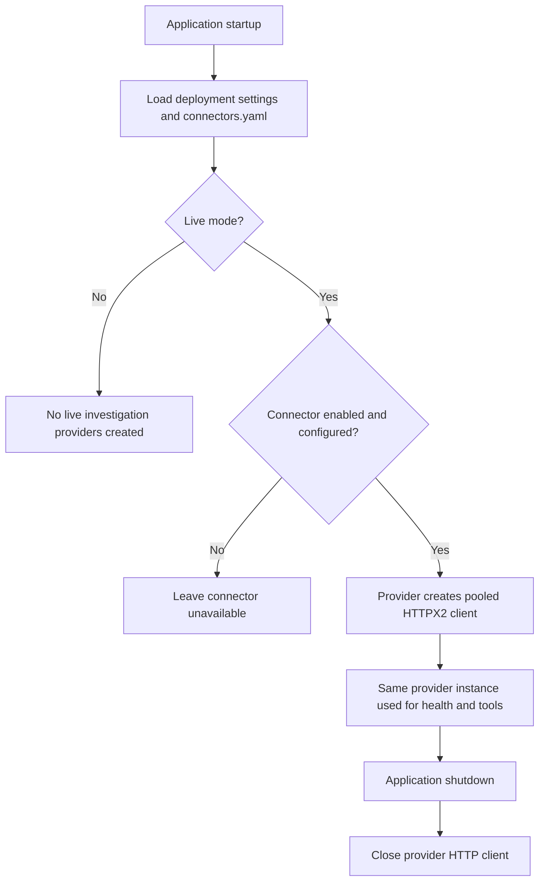
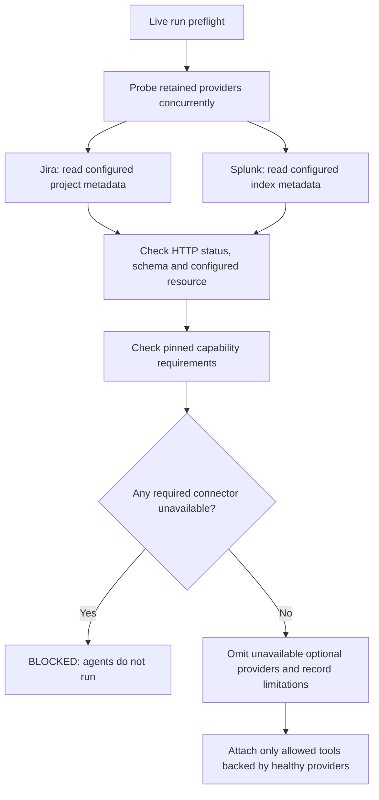

# Connector specifications

This consolidated reference preserves earlier contracts, proposals and dated observations. It is not a statement that every feature is implemented or deployed. Use the [five current guides](../../README.md) for current workflows and [AGENTS.md](../../AGENTS.md) for engineering policy. Earlier connector restrictions do not override project enablement policy.

## Contents
- [connector runtime](#connector-runtime)
- [connector onboarding](#connector-onboarding)
- [connector redesign](#connector-redesign)
- [connector forms](#connector-forms)
- [connector_form](#connector_form)
- [connector template requirements](#connector-template-requirements)

---

<a id="connector-runtime"></a>

<a id="connector-runtime--configuring-connectors-and-attaching-them-to-agents"></a>
## Configuring connectors and attaching them to agents

All ten connectors have native read-only providers and can alternatively use an explicitly configured MCP binding. They are registered in the [provider inventory](../../app/connectors/providers/registry.py); [typed tools](../../app/tools/catalog.py), [governance](../../app/runtime/governance.py), and [ADK assembly](../../app/agents/root.py) share the same action names. New connectors are disabled in the shipped configuration until deployment settings are supplied. Implementation does not imply a successful connection to your environment.

<a id="connector-runtime--native-connections"></a>
### Native connections

Set `enabled: true` and `transport: native` for the connector in the active [connectors.yaml](../../blob_local/platform/config/connectors.yaml). Endpoints, credentials, and external resource scopes below are environment variables owned by the deployment. Request bodies and agent instructions cannot change them. In a database-backed deployment, update the active [configuration bundle](../../app/configuration/database_bundle.py) and restart the API.

| Connector | Required environment variables | Implemented evidence |
| --- | --- | --- |
| Jira (`itsm`) | `JIRA_BASE_URL`, `JIRA_USER_EMAIL`, `JIRA_API_TOKEN`, `JIRA_PROJECT_KEY` | Project-scoped ticket lookup |
| Splunk (`log_search`) | `SPLUNK_HOST`, `SPLUNK_TOKEN`, `SPLUNK_INDEX` | Bounded literal log searches |
| Confluence | `CONFLUENCE_ENDPOINT` (ending `/wiki`), `CONFLUENCE_TOKEN` (Bearer), `CONFLUENCE_SCOPE` (numeric space ID) | First page of current pages, including storage text |
| SignalFx | `SIGNALFX_ENDPOINT` (API realm origin), `SIGNALFX_TOKEN`, `SIGNALFX_SCOPE` (detector ID) | Detector definition and rules; not metric samples or alert history |
| qTest | `QTEST_ENDPOINT` (ending `/api/v3`), `QTEST_TOKEN`, `QTEST_SCOPE` (project ID) | Root-level test runs; not recursive suite traversal |
| GitLab | `GITLAB_ENDPOINT` (ending `/api/v4`), `GITLAB_TOKEN`, `GITLAB_SCOPE` (numeric project ID) | Recent deployment records |
| Kubernetes | `KUBERNETES_ENDPOINT` (API origin), `KUBERNETES_TOKEN`, `KUBERNETES_SCOPE` (namespace) | Pod status, without pod specs or secrets |
| Oracle | `ORACLE_DSN`, `ORACLE_USER`, `ORACLE_PASSWORD`, `ORACLE_SCOPE` (database username to inspect) | Current `v$session` wait/blocking snapshot |
| Kafka | `KAFKA_BOOTSTRAP_SERVERS`, `KAFKA_USERNAME`, `KAFKA_PASSWORD`, `KAFKA_SCOPE` (topic) | Partition metadata, not messages or consumer lag |
| Unix/Tuxedo | `UNIX_HOST`, `UNIX_USER`, `UNIX_CLIENT_KEY` (key file), `UNIX_KNOWN_HOSTS` (host-key file), `UNIX_LOG_PATH` (absolute remote log path) | Bounded tail of one file over SFTP; no shell execution |

The [REST providers](../../app/connectors/providers/evidence.py) verify TLS, disable redirects/proxy inheritance, bound response bytes and elapsed time, and report possible truncation. An optional `<CONNECTOR>_CA_FILE` supplies a private CA certificate. Oracle uses [fixed, bound SQL](../../app/connectors/providers/oracle.py) in a read-only transaction; grant the account only the required session-view access. Arbitrary database queries remain disabled. [Kafka](../../app/connectors/providers/infrastructure.py) uses SASL_SSL with SCRAM-SHA-512 and optional `KAFKA_CA_FILE`; it does not create a consumer group or commit offsets. Unix uses AsyncSSH with mandatory host-key verification; optional `UNIX_PORT` defaults to 22. Neither provider accepts model-authored commands or paths.

<a id="connector-runtime--mcp-as-an-alternative-for-any-connector"></a>
### MCP as an alternative for any connector

Set `transport: mcp` for the existing connector ID. MCP uses HTTPS Streamable HTTP, including JSON and SSE responses, with a bounded request/session lifetime. It does not launch local processes. Supply `<ID>_ENDPOINT`, `<ID>_TOKEN`, `<ID>_SCOPE`, and optionally `<ID>_CA_FILE`; Jira uses the prefix `ITSM`, and Splunk uses `LOG_SEARCH`. These MCP settings are separate from the native API settings.

Add `mcp_tools` to that connector's configuration. The mapping key is `get_ticket` for Jira, `query_range` for Splunk, and `read_evidence` for every other connector. Each binding contains:

- `name`: the actual tool name advertised by your MCP server.
- `scope_argument`: the remote argument that receives the deployment scope, always imposed by the provider.
- `arguments`: fixed, deployment-approved arguments, including any remote result or time limits.
- `argument_map`: optional renaming of agent inputs to the remote schema. Jira supplies `ticket_id`; Splunk supplies `query`, `start_time`, and `end_time`.

These are real server contract values, not universal MCP tool names. The remote operation must be narrowly read-only and accept the imposed scope. A broad shell, arbitrary SQL, arbitrary URL, or unrestricted search tool is unsuitable. If the server does not expose a scoped operation, implement that server-side operation before binding it. Tools must advertise `readOnlyHint: true` and no destructive hint, but deployment approval of the actual operation is still required. Annotations alone do not authorize execution.

The [MCP provider](../../app/connectors/providers/mcp_evidence.py) initializes a session, discovers the configured tool, checks its input schema, applies fixed scope, calls only that operation, accepts text/structured evidence, and closes the session. Remote schema references and media/resource content are rejected. Currently the bound tool must appear on the first discovery page. Connection health checks validate discovery; each actual call validates arguments and execution separately. Saved generic MCP/A2A registrations remain connection-test records and do not automatically grant agent access.

<a id="connector-runtime--agent-binding"></a>
### Agent binding

Each new connector has a corresponding enabled `<connector>_review` [capability](../../blob_local/platform/capabilities) and `<connector>-review` [skill](../../blob_local/platform/skills). Required-connector preflight blocks execution when the connector is disabled, unconfigured, or unhealthy. The evidence source stage attaches the permitted tool automatically. Changing native/MCP transport preserves the capability action name.

To add a project specialist, submit a data-only definition through `/api/v1/agent-configurations`, using the capability ID and its exact tool action. For example, a GitLab specialist uses `capability: gitlab_review`, `tools: [gitlab.read_evidence]`, and an existing model profile/stage. The [approval service](../../app/configuration/service.py) requires a different same-scope administrator to approve the expected content hash before discovery. Do not put credentials, endpoints, or external scope into its instruction.

Native Jira/Splunk actions remain `itsm.get_ticket` and `log_search.query_range`. Other connectors use `<connector>.read_evidence`. A combined platform capability can declare several required/optional connectors, the matching skills and allowed actions, and `agent_stages: [evidence]` (plus `triage`/`logs` when using Jira/Splunk). Platform loading rejects actions whose connector is undeclared. Project overrides may reduce platform permissions, never expand them.

<a id="connector-runtime--validation-and-api-references"></a>
### Validation and API references

[Transport integration checks](../../tests/integration/test_connector_transports.py) exercise real local TLS MCP servers (JSON and SSE) and an authenticated AsyncSSH/SFTP server reading repository files. [Inventory checks](../../tests/unit/test_connector_inventory.py) cover the capability/skill/action contract and missing credentials. Live Jira, Confluence, Splunk, SignalFx, qTest, GitLab, Oracle, Kafka and Kubernetes service access still requires deployment-specific acceptance testing.

Implementations follow [Confluence v2](https://developer.atlassian.com/cloud/confluence/rest/v2/), [GitLab deployments](https://docs.gitlab.com/api/deployments/), [qTest test runs](https://docs.tricentis.com/qtest-latest/content/apis/apis/test_run_apis.htm), [SignalFx retrieval](https://dev.splunk.com/observability/docs/apibasics/retrieve_data_basics), [Kubernetes API concepts](https://kubernetes.io/docs/reference/using-api/api-concepts), [python-oracledb](https://python-oracledb.readthedocs.io/en/latest/api_manual/async_connection.html), [aiokafka](https://aiokafka.readthedocs.io/en/latest/api.html), and [AsyncSSH](https://asyncssh.readthedocs.io/en/latest/api.html).

<a id="connector-runtime--add-a-connection-from-a-command-or-json"></a>
### Add a connection from a command or JSON

**Tools & Connectors → Add integration** keeps the existing connection form and adds **Paste command** and **Import JSON**. Both import paths validate on the server, then let you choose a connection and review its editable fields before using the existing save operation. Multiple `mcpServers` entries can be reviewed; save each connection separately. Import alone neither persists nor executes anything.

Accepted JSON is either a Claude/Cursor-style `mcpServers` object or one server object. Remote servers use `url`, optional `type` (`http`, `streamable-http`, `streamable_http`, or `sse`), and an optional Authorization bearer reference. Command servers use `command`, an `args` array, and an optional `env` object; `type: stdio` is inferred from `command`. A URL ending in `/sse` defaults to SSE when its type is omitted. Other URLs default to Streamable HTTP. Optional `name`, `description`, and `timeout` (seconds) are supported. Unsupported fields are rejected rather than silently ignored.

Environment values and bearer headers accept `${TOKEN_NAME}`, `${env:TOKEN_NAME}`, or `env://TOKEN_NAME`, converted to server-side environment references. Raw secret values are rejected. Other custom headers, OAuth client configuration, and variable substitution in URLs are not supported by this importer. Paste command supports quoted arguments, using shell-like tokenization without shell execution; pipes, redirects, assignments and shell expansion are not interpreted. Put credentials in environment references rather than command arguments.

Saved command registrations use **Command (stdio)** and can be tested through **Test saved connection**. Commands run on the API host, not in the browser. Deployment-owned `RCA_MCP_STDIO_ALLOWLIST` must contain an exact profile before any process is launched: a JSON array of objects, each with `command` (executable), `args` (ordered string array), and `env` (map of variable names to `env://` references, or `{}`). The saved executable, complete arguments and environment references must match a profile. Nothing is allowlisted by default. Install the server and its dependencies on the API host before testing; prefer pinned versions and absolute executable paths in approved profiles.

The [process probe](../../app/connectors/providers/stdio_probe.py) launches without a shell, inherits only basic process-path/temp settings, resolves approved references, bounds initialization time and response bytes, suppresses child stderr, and terminates the process group after testing on POSIX. It initializes MCP only; it does not call the server's tools. Connection registration and testing still do not grant automatic agent access. These stdio registrations are separate from the native/remote-MCP runtime bindings described above.

Implementation: [JSON/command parser](../../app/configuration/mcp_import.py), [preview API](../../app/api/routes/integrations.py), [registration schema and store](../../app/configuration/integrations.py), and [connection form](../../frontend/src/components/IntegrationForm.tsx). [Integration checks](../../tests/integration/test_mcp_import.py) cover parsing, secret-reference handling, persistence, role enforcement and a real MCP subprocess handshake. Format references: [Claude Code MCP](https://code.claude.com/docs/en/mcp) and [Cursor MCP](https://prod.cursor.com/help/customization/mcp).


<a id="connector-runtime--project-availability-controls"></a>
#### Project availability controls

Project owners and platform administrators can enable or disable native connector
use in Tools and capabilities in Capabilities. These switches persist the existing
project YAML policy through the [catalog API](../../app/api/routes/catalog.py).
The project setting is separate from deployment configuration and connection health;
enabling it does not provision credentials or activate an arbitrary MCP registration.
The [capability resolver](../../app/configuration/layers.py) removes disabled connector
actions and blocks capabilities with disabled required connectors. Changes apply to
subsequent resolution/preflight; they do not cancel already-running investigations.


<a id="connector-runtime--saved-environment-connections-and-run-selection"></a>
### Saved environment connections and run selection

Platform administrators manage each connection’s target, active authentication profile,
credential references, allowed resources and MCP configuration through the
[connector API](../../app/api/routes/connectors_api.py). Project administrators select approved
connection IDs in project environment bindings. A missing ID never falls back to another
connection or to the legacy instance identity. Each connection save disables it and clears
its validation result. Test and enable it before enabling the parent connector. Activation
requires a passing test within 15 minutes; edits invalidate in-flight results.

`POST /api/v1/projects/{project_id}/connectors/{instance_id}/test?environment_id={id}`
tests the saved configuration without exposing its credential references to the caller.
For a connection shared across environments, each selected project binding is tested
separately. The existing `test_all_environments` operation covers all submitted saved
bindings. Native/MCP probes and results retain the existing timeout and size limits.

A saved connection's `mcp_configuration` contains `endpoint`, `token_secret_ref`,
`mcp_tools` (the same governed binding contract above), and `operation_routes`.
Hybrid requires exactly one route for the connector’s registered operation:
`get_ticket`, `query_range`, or `read_evidence`. The route is `direct` or `mcp`;
there is no automatic fallback. Hybrid tests validate both configured identities; a successful MCP probe cannot conceal a failing native login. MCP-only execution resolves only the MCP credential.
Additional per-environment references can be approved for a host through the existing deployment-owned `RCA_INTEGRATION_SECRET_REFERENCES` mapping. They are resolved only for that host in addition to the connector’s deployment defaults. Currently this path supports HTTPS Streamable HTTP with Bearer authentication.
Native authentication options remain those reported by `native_auth_profile_ids`.
This does not implement OAuth consent/refresh or every profile in the proposed forms.

The [run request](../../app/runtime/run_contract.py) accepts an optional
`connector_selections` map keyed by connector adapter ID. Each value contains a saved
`instance_id` and optional `environment_id`. These are record selectors, not target or
scope definitions. [Runtime resolution](../../app/runtime/runner.py) checks the authenticated
project, capability, published template, deployment enablement and active environment
binding before constructing a provider. Omit selectors only when the saved configuration
is unambiguous. Selected identities are captured in the persisted run request.

[Record and selection tests](../../tests/integration/test_connection_record_contract.py)
cover persistence, stale tests, scope rejection, credential visibility and multiple
instances. [Transport tests](../../tests/integration/test_connector_transports.py) exercise
saved Hybrid configuration with a real local TLS MCP server and repository content.

---

<a id="connector-onboarding"></a>

<a id="connector-onboarding--connector-lifecycle-and-call-flows"></a>
## Connector lifecycle and call flows

An agent reasons about evidence. A domain tool exposes an allowed operation. A connector provider handles the external API. These responsibilities remain separate so credentials and network behavior stay outside model-authored instructions.

<a id="connector-onboarding--connector-catalog"></a>
### Connector catalog

The [catalog templates](../../blob_local/platform/config/connector_templates.yaml) cover all ten connector bindings in the [reference sample](../../references/sample.yaml): Jira, Confluence, Splunk, SignalFx, qTest, GitLab, Oracle, Kafka, Unix/Tuxedo, and Kubernetes. Jira and Splunk retain their runtime IDs, `itsm` and `log_search`. Kafka and Unix/Tuxedo support native clients and optional MCP bindings. Placeholder endpoints are reference metadata, not configured services.

All ten connectors now have executable native providers and optional deployment-approved MCP bindings. See [runtime setup and supported operations](connector-specifications.md#connector-runtime) for exact configuration, agent binding, and current limitations. New providers ship disabled until deployment access is configured.

<a id="connector-onboarding--startup-and-shutdown"></a>
### Startup and shutdown

<a id="connector-onboarding--admin-managed-mcp-and-a2a-configuration"></a>
#### Admin-managed MCP and A2A configuration

Use **Tools & Connectors → Add MCP / A2A** to save an HTTPS endpoint, protocol, authentication reference, description, and timeout. Platform administrators can save tenant-wide platform defaults and permit project overrides. Project owners and managers can create project-only registrations or override an unlocked default. Identity and scope come from the authenticated principal, not the request body. Revision checks prevent stale saves; **Use platform defaults** removes the project override. These are database records, not changes to the reference YAML. See the [registration API](../../app/api/routes/integrations.py), [SQLAlchemy store](../../app/configuration/integrations.py), and [migration](../../migrations/history/004_integrations.sql).

**Test connection** reads the saved effective project configuration. It performs an MCP initialization handshake (Streamable HTTP or legacy SSE), or retrieves and validates an A2A agent card. An A2A endpoint uses `/.well-known/agent-card.json`; a supplied `.json` URL is used directly. It does not call remote tools or run agent tasks. A successful connection test does not enable runtime execution or approve a specialist. Manual tests are available in demo mode; demo investigations still perform no external calls. See the [bounded probe implementation](../../app/connectors/providers/integration_probe.py), [real HTTPS tests](../../tests/integration/test_integration_probe.py), [MCP lifecycle specification](https://modelcontextprotocol.io/specification/2025-11-25/basic/lifecycle), and [A2A specification](https://a2a-protocol.org/latest/specification/).

Connection tests require the destination hostname in deployment-owned `RCA_INTEGRATION_ALLOWED_HOSTS`. Bearer authentication additionally requires a per-host credential reference in `RCA_INTEGRATION_SECRET_REFERENCES`, for example `{"mcp.example.com":["env://MCP_API_TOKEN"]}`. Credentials are resolved only in the provider; redirects and proxy environment inheritance are disabled, TLS is verified, and responses and deadlines are bounded. Registration does not itself permit network access.

<a id="connector-onboarding--editing-native-connector-and-operational-values"></a>
#### Editing native connector and operational values

**Parameter Studio** lets platform administrators edit persisted defaults, descriptions, and project override policy. Authorized project owners can save permitted overrides. The catalog displays these saved values. Runtime settings and explicit saved native endpoint, Jira service user, timeout, and result/response limits are applied on the next API restart; untouched sample catalog defaults are not used as live connection settings. Native endpoint and service-user edits require a platform administrator. Jira project scope and Splunk index remain deployment-owned. Retry/rate labels and other reference-only metadata do not add runtime features. See the [parameter API](../../app/api/routes/parameters.py), [validation and persistence](../../app/configuration/parameters.py), [provider construction](../../app/connectors/providers/registry.py), and [startup](../../app/runtime/bootstrap.py).



Tests may inject fixture providers. In normal live startup, Jira and Splunk resolve credentials from deployment environment variables. Invalid or missing provider configuration leaves that provider unavailable; run preflight decides whether the chosen capability can proceed.

**Implementation:** [`create_app` lifespan](../../app/runtime/bootstrap.py), [connector configuration](../../blob_local/platform/config/connectors.yaml), [Jira provider](../../app/connectors/providers/jira.py), [Splunk provider](../../app/connectors/providers/splunk.py).

<a id="connector-onboarding--health-checks-before-investigation"></a>
### Health checks before investigation



| Provider ID | Credential and scope settings | Health request | Investigation request |
|---|---|---|---|
| `itsm` / Jira | `JIRA_BASE_URL`, `JIRA_USER_EMAIL`, `JIRA_API_TOKEN`, `JIRA_PROJECT_KEY` | `GET /rest/api/2/project/{project_key}` | `GET /rest/api/2/issue/{ticket_id}` |
| `log_search` / Splunk | `SPLUNK_HOST`, `SPLUNK_TOKEN`, `SPLUNK_INDEX` | `GET /services/data/indexes/{index}` | `GET /services/search/jobs/export` with bounded query parameters |

`GET /api/v1/connectors/health` also invokes these probes, excluding project-disabled connectors. Run preflight probes only capability-required providers and providers backing retained actions. `/health` only reports process liveness; `/ready` checks database connectivity and configured authentication. Neither means every connector operation or model call will succeed.

Health is a preflight observation, not a permanent guarantee. A provider can fail after a successful probe. Runtime tool failures are sanitized and recorded as unavailable evidence; the run may finish partial or fail for another reason. The current providers do not implement automatic retries or a circuit-breaker execution path.

<a id="connector-onboarding--a-governed-tool-call"></a>
### A governed tool call

The complete [agent-to-connector sequence](runtime-and-extension-contracts.md#architecture--3-agent-to-connector-flow) shows the forward call and return path:

```text
LlmAgent proposes get_ticket or query_range
  -> RunGovernance checks run state, budget, scope and allowed action
  -> FunctionTool calls a typed provider method
  -> Provider validates external scope and makes bounded HTTP request
  <- Provider validates and selects response data
  <- RunGovernance redacts, bounds, hashes and persists evidence
  <- LlmAgent receives evidence ID plus redacted data
```

Jira rejects issue keys outside its configured project. Splunk builds the search using its configured index, accepts bounded plain search terms, and validates the time window. Both bound response bytes, require successful HTTP status, and disable redirects. Pool and timeout values come from [connectors.yaml](../../blob_local/platform/config/connectors.yaml).

**Implementation:** [ITSM tools](../../app/tools/domain/itsm.py), [log tools](../../app/tools/domain/logs.py), [governance callbacks](../../app/runtime/governance.py), [shared response-size reader](../../app/connectors/base.py).

<a id="connector-onboarding--configuration-blob-storage-is-a-separate-path"></a>
### Configuration blob storage is a separate path

```text
Configuration API -> approval service -> ConfigurationBlobStore
                                       -> local directory OR GCS bucket
```

The blob provider writes canonical agent YAML by content hash and verifies it on read. `RCA_CONFIG_BLOB_URI` selects a local directory or `gs://bucket/prefix`; GCS uses Application Default Credentials. It is called by the configuration service, not an agent tool, and is not included in the Jira/Splunk health endpoint. See [approval flow](runtime-and-extension-contracts.md#architecture--5-project-agent-approval-and-discovery).

<a id="connector-onboarding--adding-a-new-investigation-connector"></a>
### Adding a new investigation connector

1. Implement protocol, credentials, scope checks, bounded responses and cleanup under [app/connectors/providers](../../app/connectors/providers).
2. Expose granular typed `FunctionTool` functions under [app/tools/domain](../../app/tools/domain).
3. Register provider construction in the [provider registry](../../app/connectors/providers/registry.py) and the action in the [shared tool catalog](../../app/tools/catalog.py). Governance, specialist validation and agent assembly share that catalog.
4. Add the connector and permitted actions to the appropriate capability, with required/optional behavior chosen deliberately.
5. Test scope enforcement, health failures, response bounds and the complete governed call. Update these diagrams to show the actual route.

Oracle fixed session reads and deployment-approved MCP bindings are implemented; arbitrary SQL, ServiceNow, generic A2A execution, and investigation writes remain unavailable. See [supported operations](connector-specifications.md#connector-runtime).

---

<a id="connector-redesign"></a>

<a id="connector-redesign--connector-form-and-harness-contract"></a>
## Connector form and harness contract

The supplied RCA assist ten-connector specification is a target design. This implementation builds on the existing versioned catalog, saved connector instances and parameter store. It does not enable every authentication method or operation described in the specification.

<a id="connector-redesign--form-responsibilities"></a>
### Form responsibilities

The [template editor](../../frontend/src/components/connectors/ConnectorsForm.tsx) renders shared controls declared by each published template. [The Tools page](../../frontend/src/pages/Tools.tsx) submits changed values through the existing atomic parameter endpoint with their expected revisions. Connector-specific field types and bounds come from the catalog; targets, credentials, environment assignments and connection tests belong to the [instance editor](../../frontend/src/components/ConnectorInstanceEditor.tsx).

The [catalog API](../../app/api/routes/connectors_api.py) adds `native_auth_profile_ids`, the intersection of active template profiles and installed native authentication support. This is implementation metadata, not proof of connectivity or deployment enablement. Kafka's MCP profile is not a native authentication option; Oracle remains blocked by release policy. Persisted catalog lifecycle rows remain authoritative over bundled declarations.

Fields explicitly marked `visible_in_project: false` are excluded from project-facing template fields and corresponding defaults. Instance reads, saves and enable/disable responses apply the same declared field visibility policy. Platform administrators retain the platform view. Project responses also omit instance endpoints, credentials, authentication selection, credential-binding IDs and environment connection target/credential details. Connection identities and routes are managed by platform administrators. Credentials currently resolve through deployment-approved environment references; this is not a credential-vault creation service.

<a id="connector-redesign--validation-and-execution"></a>
### Validation and execution

[Candidate validation](../../app/connectors/candidate_testing.py) checks the selected template identity/version, explicit project identity and environment choices, authentication profile, credential references and numeric bounds before testing. Hidden credential fields are rejected. MCP and Hybrid tests use the governed MCP provider with an explicit operation route, scoped arguments and a separately authorized MCP credential. Conflicting route selections are rejected. [Template validation](../../app/configuration/models.py) rejects duplicate and overlapping conditional authentication field declarations.

The [runner](../../app/runtime/runner.py) resolves published configuration for each run and applies permitted parameter values for the saved instance and its explicitly selected environment. [Provider resolution](../../app/connectors/providers/registry.py) retains endpoint, credential, scope and deployment gates. Changing shared defaults takes effect through resolution for subsequent runs; it does not mutate an active provider client.

<a id="connector-redesign--local-startup-repair"></a>
### Local startup repair

The API refuses to start when the schema ledger differs from [the required version](../../app/persistence/database.py). The local migration 18 had a permissions block appended after deployment. Its original contents were recovered and verified against the database's recorded checksum; that permissions block now belongs to [migration 20](../../migrations/history/020_configuration_runtime_privileges.sql), alongside access needed for migration 19's configuration table and override sequence. The [migration runner](../../scripts/migrate.py) continues to validate every applied checksum before changing anything. Run `make db-migrate` with the deployment migration identity before restarting the API.

[Session verification](../../frontend/src/services/api.ts) now times out after 15 seconds when the server does not respond. The [sign-in dialog](../../frontend/src/components/SessionModal.tsx) reports that failure and retains the entered token for a retry after a network failure; tokens remain in memory only.

<a id="connector-redesign--remaining-specification-boundaries"></a>
### Remaining specification boundaries

- Repeatable environment connections are persisted and resolved by explicit connection ID. See [the shared record contract](../../app/configuration/connection_records.py), [store](../../app/persistence/platform_admin.py) and [API](../../app/api/routes/connectors_api.py). Saves reset validation and disable the connection; a test completing after an edit cannot mark the edited record as passed.
- Runs accept optional saved instance/environment selectors in [the request contract](../../app/runtime/run_contract.py). [The runner](../../app/runtime/runner.py) resolves these only from the authenticated project and active bindings. Ambiguous selections, disabled records and IDs outside the capability/project are rejected.
- Hybrid routing is implemented for each connector’s existing governed read operation. Separate write identities remain unavailable under release policy. New OAuth consent/refresh flows, the additional vendor authentication profiles in the specification, and credential-vault creation remain unimplemented; deployment identities and the credential service still need to be specified.
- Jira mutations, database querying, arbitrary Unix execution and other write/export capabilities remain unavailable under the current release policy. A vendor's API support does not enable those operations in this application.
- Existing published database templates are not silently rewritten. The bundled Jira declaration corrects the account-email requirement for API-token authentication, marks webhook setup as planned, and removes the invented service-account default. Apply catalog changes using the established reviewed publication/configuration workflow.

Jira account-token authentication uses account email and an API token, and Jira's external OAuth integration uses the authorization-code flow: [Atlassian Basic authentication](https://developer.atlassian.com/cloud/jira/platform/basic-auth-for-rest-apis/) and [Atlassian OAuth 2.0 (3LO)](https://developer.atlassian.com/cloud/jira/platform/oauth-2-3lo-apps/). MCP authentication concerns the MCP server connection; see the [MCP authorization specification](https://modelcontextprotocol.io/specification/2025-06-18/basic/authorization).

<a id="connector-redesign--connector-workspace"></a>
### Connector workspace

The [Tools page](../../frontend/src/pages/Tools.tsx) loads the published catalog, shared parameter rows, saved project connections, and project environments from authenticated APIs. Its searchable connector picker opens one continuous two-column page with template defaults, supported authentication methods, project connections, scope, field mapping, availability, and testing. Template fields are declared by the backend; only platform administrators can change shared defaults. The [template form](../../frontend/src/components/connectors/ConnectorsForm.tsx) retains failed edits, offers discard, and guards connector changes and browser reloads.

The [connection editor](../../frontend/src/components/ConnectorInstanceEditor.tsx) reuses project connection persistence, environment assignments, saved-connection testing, and explicit enable/disable actions. Platform administrators manage environment targets and approved `env://` references; project owners manage project settings within server-enforced permissions. MCP configuration uses the HTTP endpoint, token reference, operation mapping, and explicit hybrid route supported by the provider. It does not offer shell commands or local process transports.

The [API adapter](../../frontend/src/services/api.ts) maps database JSON columns into form fields and submits edited environment connections as untested, disabled drafts. Test and enablement metadata do not count as unsaved configuration changes. The [disable endpoint](../../app/api/routes/connectors_api.py) preserves connection settings and credentials while disabling execution. Oracle remains policy-restricted; catalog publication does not imply a successful live connection test.

The [project capability section](../../frontend/src/components/connectors/ConnectorProjectPolicy.tsx) reads actual capability requirements and updates the existing project availability API with expected-state checks. [Runtime availability descriptions](../../app/connectors/runtime_support.py) distinguish implemented provider behavior from unavailable writes, schedulers, webhooks, and interactive identity flows. Jira project field mappings serialize to the canonical field-ID-to-label dictionary consumed by the native provider.

<a id="connector-redesign--persistent-field-access"></a>
### Persistent field access

The connector admin page includes **Field access** with Platform Only, Project Editable,
and Project Non-Editable choices. Saves use an expected revision, write tenant-scoped
`platform.system_configurations` records, synchronize existing parameter definitions,
and append audit events in one transaction. Removing delegation clears the field's
project parameter overrides. See [policy storage](../../app/configuration/connector_governance.py)
and [admin control](../../frontend/src/components/connectors/ConnectorFieldGovernance.tsx).

Project reads redact hidden fields, including nested parameter and resource aliases.
Project saves reject changes to locked fields and preserve omitted platform values.
Saved instance values become non-editable when policy is locked; shared runtime limits
that conflict with platform values fail closed until an administrator repairs the
connection. Credential and routing edits still require platform authority. The
[harness workspace](../../app/configuration/harness_workspace.py) and
[runner](../../app/runtime/runner.py) read current persisted policies for new execution;
existing in-flight run snapshots are unchanged. Tests cover restart persistence,
role boundaries, stale revisions, hidden values, aliases and runtime enforcement in
[test_connector_field_governance.py](../../tests/integration/test_connector_field_governance.py).

---

<a id="connector-forms"></a>

<a id="connector-forms--connector-forms--tool-by-tool-review"></a>
## Connector Forms — Tool-by-Tool Review

**Status:** Proposed form layouts, not functioning connection forms.  
**Field rules and auth extensions:** [Connector Template Requirements](connector-specifications.md#connector-template-requirements)

`*` Required · `○` Optional · `🔒` Inherited/read-only · `[Select…]` Dropdown/reference picker · `[Enter…]` Text input

**Mandatory project-only identity:** every connector instance, including every MCP instance, has these three mandatory identity/environment fields: **System Name**, **Environment Dependent/Independent**, and **Tool Environment**. System Name initially defaults to the selected connector's display name and remains editable; for MCP, use the selected registered MCP connector/server display name. Persist it as a project instance value, not a live inherited setting. The two environment fields require explicit project selection. Other connection/authentication fields may also be mandatory. Incomplete drafts may be saved; testing/enabling requires completed valid values.

Authentication fields change with the selected method. Secret inputs select an authorized **secret reference**, never display a resolved credential. Planned methods stay unavailable until their provider and real connection test are implemented. Every form has the shared header and footer shown below; the tool-specific sections are its middle content.

<a id="connector-forms--navigation"></a>
### Navigation

[Jira](#connector-forms--1-jira) · [Splunk](#connector-forms--2-splunk) · [Confluence](#connector-forms--3-confluence) · [SignalFx](#connector-forms--4-signalfx) · [qTest](#connector-forms--5-qtest) · [GitLab](#connector-forms--6-gitlab) · [Oracle](#connector-forms--7-oracle) · [Kafka](#connector-forms--8-kafka) · [Unix](#connector-forms--9-unix) · [Kubernetes](#connector-forms--10-kubernetes) · [MCP](#connector-forms--11-custom-mcp) · [A2A](#connector-forms--12-a2a)

<a id="connector-forms--shared-form-header--appears-for-every-tool"></a>
### Shared form header — appears for every tool

**Connector:** selected tool · **State:** Draft · **Health:** Not tested

`Overview` | `Connection` | `Authentication` | `Environments & scope` | `Fields & operations` | `Data & monitoring` | `Runbooks & artifacts` | `Test & review`

<a id="connector-forms--overview"></a>
#### Overview

| Field | Form control |
|---|---|
| Template / version 🔒 | Selected published template |
| Instance ID 🔒 | Assigned by server |
| System Name * | `[Selected connector name — editable]` |
| Environment Dependent/Independent * | `( ) Environment Dependent  ( ) Environment Independent` — explicit project choice |
| Tool Environment * | `[Select authorized external environment…]` — explicit `Shared` choice for an Independent instance; never automatically filled |
| Owner * | `[Select project member…]` |
| Description ○ | `[Describe what this connection is used for…]` |
| Tags ○ | `[Add tags…]` |
| Usage * | `[ ] Evidence  [ ] Knowledge  [ ] Monitoring` — only supported modes selectable |

Initialize System Name only when creating/selecting a connector for a new instance, preserving any user-edited name. Later catalog renames must not overwrite the saved project name. If the initial name already exists in the project, show an inline duplicate-name error and require a distinguishing edit before testing/enabling; keep the stable instance ID separate.

<a id="connector-forms--environment-mappings--visible-for-environment-dependent"></a>
#### Environment mappings — visible for Environment Dependent

| Project Environment * | External Resource * | Tool Environment * | Credential Binding * | Actions |
|---|---|---|---|---|
| `[Select…]` | `[Select authorized resource…]` | `[Select…]` | `[Inherit instance / Select binding…]` | Remove |

**[+ Add environment mapping]**

Each row selects an authorized resource/credential combination. One row's successful connection test does not validate the others. If different environments need different auth methods or adapters, use separate instances.

---

<a id="connector-forms--1-jira"></a>
### 1. Jira

<a id="connector-forms--connection"></a>
#### Connection

| Field | Form control |
|---|---|
| Jira connection resource * | `[Select approved Jira site…]` |
| Site base URL 🔒 | Resolved from resource; provider appends the API path |
| API/deployment profile 🔒 | Native adapter profile |
| Browser URL ○ | `[Select approved Jira UI reference…]` |
| Request timeout * | `[Inherited value] seconds` |

<a id="connector-forms--authentication"></a>
#### Authentication

**Auth Type *** → `[Basic — Email + API token ▾]`

| Visible field | Form control |
|---|---|
| Credential source * | `( ) Inherit  ( ) Select approved binding` |
| Account email * | `[Enter account email…]` — read-only if inherited |
| API-token secret reference * | `[Select secret reference…]` — read-only if inherited |
| Credential status 🔒 | Not tested |

**Planned alternative:** OAuth 2.0. Selecting it after implementation opens the [OAuth conditional form](#connector-forms--oauth-conditional-form). Password and Bearer fields do not appear for the current Basic API-token profile.

<a id="connector-forms--environments--scope"></a>
#### Environments & scope

| Field | Form control |
|---|---|
| Authorized Jira project * | `[Select deployment-authorized Jira project…]` |
| Issue types ○ | `[Select allowed issue types…]` |
| Member identity mapping ○ | `[Project member] → [Jira account]` — required for member-based queues |

<a id="connector-forms--fields--operations"></a>
#### Fields & operations

**Fields**

| Source | Jira Field ID * | Field Name * | Type * | Available Options | Actions |
|---|---|---|---|---|---|
| Platform 🔒 | Inherited | Inherited | Inherited | Provider metadata | View |
| Project | `[Enter field ID…]` | `[Enter display name…]` | `[Select…]` | `[Provider values…]` | Validate / Remove |

**[+ Add project custom field]** · **[Validate field mappings]**

<a id="connector-forms--jira-custom-field-setup"></a>
##### Jira custom-field setup

| Field | Form control / rule |
|---|---|
| Field source 🔒 | Platform inherited or Project added |
| Jira field selector * | `[Select from this Jira instance's verified metadata…]` |
| Jira REST field ID * | `[customfield_<ID>]` — derived from verified selection; manual entry requires validation |
| JQL field reference 🔒 | Corresponding `cf[<ID>]` when supported by the field |
| Field name * | Provider name; optional separate project display label |
| Field type * | Provider-verified text, number, date/time, user, option, multi-option, or supported structured type |
| Options/context 🔒 | Actual issue-type/project context and provider options, where available |
| Use for * | `[ ] Evidence extraction  [ ] Queue filtering  [ ] Semantic mapping` — at least one permitted purpose |
| Semantic target * for mapping | `[Queue / Service / Severity / Environment / Ownership / Registered target ▾]` |
| Missing-value behavior * | `[Allow missing with notice / Require for selected operation ▾]` |
| Processing enabled * | `[Yes / No ▾]` — independent of Jira field existence |

**[Load Jira fields] [+ Add project field] [Validate selected fields] [Preview extraction from test issue]**

Show inherited platform fields and merge project additions by canonical Jira field ID for this connector instance. Reject incompatible redefinitions; a project label must not alter inherited meaning. This setup configures use of existing Jira fields—it does not create or edit fields in Jira. Missing/forbidden metadata is shown explicitly. Preview the real selected values with policy redaction, and feed verified fields/types into the JQL builder.

The existing native provider returns non-null `customfield_*` values from an issue, but verified discovery, configurable extraction/mapping, and queue search require backend extensions. [Jira provider](../../app/connectors/providers/jira.py).

<a id="connector-forms--jira-attachment-processing"></a>
##### Jira attachment processing

| Field | Form control / rule |
|---|---|
| Process attachments * | `( ) Disabled  ( ) Enabled` |
| Attachment source * when Enabled | `[Local upload associated with Jira issue / Project library reference ▾]` |
| Jira issue association * | `[Select/enter an issue within this instance's authorized project…]` |
| Files * for Local upload | `[Choose local files…]` |
| Artifact/version * for Library reference | `[Select permitted Ready artifact and version…]` |
| Allowed file types * | `[Select a subset of platform-supported formats…]` |
| Maximum files / file bytes / total bytes * | `[Platform-bounded limits]` |
| Extract text * | Enabled for supported text/document formats |
| Image handling * when images allowed | `[OCR text only]` |
| Parsing deadline / text bounds * | `[Inherited platform bounds or permitted lower limits]` |
| Failure policy * | `[Continue with explicit partial evidence / Fail when required attachment is unusable ▾]` |
| Required evidence * | `[Optional / Required for selected operation ▾]` |
| Capability association ○ | `[Select compatible enabled capabilities…]` |
| Retention / redaction 🔒 | Effective project/platform policy |

**[Validate attachment settings] [Process selected files] [Preview extracted evidence]**

Results show per-file state, name, size, hash, issue/instance association, extraction warnings, truncation, and version/evidence references. No uploaded file means Not run, never successful processing. An attachment is not an executable script or an agent instruction.

**Jira-hosted attachments:** automatic retrieval is a distinct requested extension, not established support. The current Jira provider returns only `attachments_count`; it does not download or parse Jira attachment bytes. Current repository rules permit local attachment processing only. Keep remote retrieval unavailable until explicitly authorized and implemented as a scoped provider operation, with attachment-ID authorization and bounded retrieval—not arbitrary URL fetching. Local files can still be linked to an authorized Jira issue and processed under the form above.

<a id="connector-forms--data--monitoring"></a>
#### Data & monitoring

| Field | Form control |
|---|---|
| Queue name * when monitoring | `[Enter queue name…]` |
| Query mode * | `( ) Visual Builder  ( ) Custom JQL` |
| Builder condition * in Builder | `[Field ▾] [Operator ▾] [Value…]` |
| Condition grouping | `[AND / OR ▾]` **[+ Condition] [+ Group]** |
| Assignee source ○ | `[Specific Jira accounts / Project members / Project group ▾]` |
| Generated JQL 🔒 in Builder | Generated from validated conditions; not seeded |
| Custom JQL * in Custom mode | `[Enter scoped JQL…]` |
| Execution capability * for monitoring | `[Select compatible enabled capability…]` |

**[Test query]** — available only when real scoped search is implemented. Scheduling uses the shared footer.

<a id="connector-forms--test--review"></a>
#### Test & review

`Test issue key * [Enter an issue in the authorized project…]`

**[Validate form] [Test Jira connection] [Test ticket read]**

Success confirms access to the selected project/issue. It does not confirm automatic queue polling or Jira writes.

---

<a id="connector-forms--2-splunk"></a>
### 2. Splunk

<a id="connector-forms--connection-1"></a>
#### Connection

| Field | Form control |
|---|---|
| Splunk resource * | `[Select approved Splunk instance…]` |
| Management API endpoint 🔒 | Resolved API endpoint |
| Browser URL ○ | `[Select approved Splunk UI reference…]` |
| Timeout * | `[Inherited value] seconds` |
| Maximum results * | `[Inherited bounded value] records` |
| Maximum search window * | `[Inherited bounded value] seconds` |

<a id="connector-forms--authentication-1"></a>
#### Authentication

**Auth Type *** → `[Bearer token ▾]`

| Visible field | Form control |
|---|---|
| Credential source * | `[Inherit / Select approved binding ▾]` |
| Token secret reference * | `[Select secret reference…]` |
| Authorization header 🔒 | Generated by provider |

Username/password fields are hidden. OAuth or client-certificate options are planned profiles, not current alternatives.

<a id="connector-forms--environments--scope-1"></a>
#### Environments & scope

`Authorized index * [Select index…]`

The current native client uses one configured index. Multiple bindings need an implemented instance resolver; a multi-select alone is insufficient.

<a id="connector-forms--fields--operations--data--monitoring"></a>
#### Fields & operations / Data & monitoring

| Field | Form control |
|---|---|
| Query name ○ | `[Enter name…]` |
| Search query * | `[Enter supported bounded log query…]` |
| Start time * | `[Date/time picker]` |
| End time / window * | `[Date/time or supported bounded duration]` |
| Execution capability ○ | `[Select compatible capability…]` |
| Use as data source ○ | `[ ] Enable when ingestion backend is available` |

<a id="connector-forms--test--review-1"></a>
#### Test & review

**[Validate form] [Test Splunk connection] [Test bounded search]**

Results show index, actual time range, count, truncation and redacted errors.

---

<a id="connector-forms--3-confluence"></a>
### 3. Confluence

<a id="connector-forms--connection-2"></a>
#### Connection

| Field | Form control |
|---|---|
| Confluence resource * | `[Select approved site…]` |
| Wiki API base 🔒 | Resolved provider-compatible base |
| API/deployment profile 🔒 | Selected adapter profile |
| Maximum pages * | `[Inherited bounded value]` |

<a id="connector-forms--authentication-2"></a>
#### Authentication

**Auth Type *** → `[Bearer token ▾]` — implemented adapter contract; deployment compatibility still requires testing.

`Credential source * [Inherit / Select binding ▾]`  
`Token secret reference * [Select…]`

**Planned: Basic API token** → `Account email *`, `API-token secret reference *`.  
**Planned: OAuth 2.0** → [OAuth conditional form](#connector-forms--oauth-conditional-form).

Only the selected supported profile's fields render; none of these methods is silently substituted for another.

<a id="connector-forms--environments--scope--fields--operations"></a>
#### Environments & scope / Fields & operations

| Field | Form control |
|---|---|
| Authorized space ID * | `[Select space…]` |
| Read operation 🔒 | Current pages in selected space |
| Extracted fields 🔒 | Page ID, title, version, body and status |
| Page/label filters ○, planned | `[Available only with implemented filtering…]` |
| Capability associations ○ | `[Select enabled capabilities…]` |

<a id="connector-forms--data--monitoring-1"></a>
#### Data & monitoring

`Knowledge source ○ [ ]` · `Refresh schedule [Unavailable until implemented]`

<a id="connector-forms--test--review-2"></a>
#### Test & review

**[Validate form] [Test Confluence connection] [Read bounded pages]**

Show actual space, page coverage and extraction limits. Macros remain untrusted reference text.

---

<a id="connector-forms--4-signalfx"></a>
### 4. SignalFx

<a id="connector-forms--connection-3"></a>
#### Connection

`SignalFx API resource * [Select…]`  
`API endpoint 🔒 [Resolved]`  
`Realm ○ [Resolved from approved resource, where applicable]`  
`Timeout * [Inherited value] seconds`

<a id="connector-forms--authentication-3"></a>
#### Authentication

**Auth Type *** → `[API key — X-SF-Token ▾]`

| Visible field | Form control |
|---|---|
| Credential source * | `[Inherit / Select binding ▾]` |
| API-key secret reference * | `[Select…]` |
| Header name 🔒 | `X-SF-Token` |

<a id="connector-forms--environments--scope--fields--operations-1"></a>
#### Environments & scope / Fields & operations

`Authorized detector ID * [Select…]`  
`Operation 🔒 Read detector definition`  
`Returned fields 🔒 Name, rules, thresholds, tags, last update`

<a id="connector-forms--data--monitoring-2"></a>
#### Data & monitoring

`Definition refresh [Manual; automatic refresh planned]`  
`Live metric streams / alert webhooks [Unavailable in current provider]`

<a id="connector-forms--test--review-3"></a>
#### Test & review

**[Validate form] [Test connection] [Read detector definition]**

Success means detector configuration was retrieved, not that live alert monitoring is active.

---

<a id="connector-forms--5-qtest"></a>
### 5. qTest

<a id="connector-forms--connection-4"></a>
#### Connection

`qTest resource * [Select…]`  
`API base / version 🔒 [Resolved]`  
`Timeout * [Inherited value] seconds`  
`Maximum results * [Inherited bounded value]`

<a id="connector-forms--authentication-4"></a>
#### Authentication

**Auth Type *** → `[Bearer token ▾]`

`Credential source * [Inherit / Select binding ▾]`  
`Token secret reference * [Select…]`

Managed username/password token acquisition or OAuth requires a new implemented profile.

<a id="connector-forms--environments--scope--fields--operations-2"></a>
#### Environments & scope / Fields & operations

`Authorized qTest project * [Select…]`  
`Coverage 🔒 Root-level test runs`  
`Operation 🔒 Read test-run evidence`  
`Capability association ○ [Select…]`

<a id="connector-forms--data--monitoring-3"></a>
#### Data & monitoring

`Data refresh [Manual; scheduling planned]`  
`Recursive folder/release/cycle filters [Planned]`

<a id="connector-forms--test--review-4"></a>
#### Test & review

**[Validate form] [Test connection] [Read root-level test runs]**

Show returned execution metadata and coverage; missing results are unknown, not passed tests.

---

<a id="connector-forms--6-gitlab"></a>
### 6. GitLab

<a id="connector-forms--connection-5"></a>
#### Connection

`GitLab resource * [Select…]`  
`API base 🔒 [Resolved]`  
`Browser URL ○ [Approved UI reference…]`  
`Maximum deployment records * [Inherited bounded value]`

<a id="connector-forms--authentication-5"></a>
#### Authentication

**Auth Type *** → `[API key — PRIVATE-TOKEN ▾]`

| Visible field | Form control |
|---|---|
| Credential source * | `[Inherit / Select binding ▾]` |
| Token secret reference * | `[Select…]` |
| Header name 🔒 | `PRIVATE-TOKEN` |

OAuth Bearer is a planned separate profile. A different token label must be verified for the same required deployment-read permission.

<a id="connector-forms--environments--scope--fields--operations-3"></a>
#### Environments & scope / Fields & operations

`Authorized GitLab project * [Select…]`  
`Deployment environment filter ○ [Planned narrowing filter]`  
`Operation 🔒 Read recent deployment records`  
`Returned fields 🔒 Deployment ID, SHA, ref, status, timestamps, environment`

<a id="connector-forms--data--monitoring-4"></a>
#### Data & monitoring

`Refresh [Manual]` · `Deployment webhook [Planned]` · `Execution capability ○ [Select…]`

<a id="connector-forms--test--review-5"></a>
#### Test & review

**[Validate form] [Test connection] [Read recent deployments]**

Source browsing, pipeline execution and deployment changes are not implied operations.

---

<a id="connector-forms--7-oracle"></a>
### 7. Oracle

**Updated scope:** include local Oracle connection/authentication testing as requested. Production query enablement remains separately controlled; local testing does not create an arbitrary SQL interface.

<a id="connector-forms--connection-6"></a>
#### Connection

`Database resource * [Select approved resource…]`  
`DSN / service 🔒 [Resolved without credentials]`  
`Connection timeout * [Inherited value] seconds`  
`Query timeout * [Inherited value] seconds`

<a id="connector-forms--local-client-setup"></a>
#### Local client setup

| Field | Form control / condition |
|---|---|
| Test execution location * | `[Select approved local backend runtime…]` — the machine running the test, not necessarily the browser |
| Driver profile * | `[Thin / Thick — Oracle Client libraries ▾]` — compatible runtime profiles only |
| Connection format * | `[Host + port + service / Approved DSN / TNS alias ▾]` |
| Host / port / service name * for direct connection | Resolved from selected approved database resource; hidden for alias/DSN mode |
| DSN reference * for DSN mode | `[Select approved connection reference…]` |
| TNS alias * for alias mode | `[Select approved alias…]` |
| Network configuration reference * for alias mode | `[Select configured tnsnames directory/profile…]` |
| `oracle_client_lib` * for explicit-library Thick profile | `[Select registered local Oracle Client library directory…]`; hidden and omitted in Thin mode |
| Client library loading mode * for Thick | `[Registered directory / System-managed library search ▾]` — platform-compatible choices |
| Effective driver mode / driver version 🔒 | Actual backend inspection |
| Loaded client version 🔒 | Actual library version for Thick; Not applicable for Thin |

**Terminology:** python-oracledb Thin mode does not load Oracle Client libraries. If `oracle_client_lib` identifies an Instant Client/native library directory, that is a **Thick** profile. The form covers both; it must not silently switch modes. Driver mode is fixed for the lifetime of a Python process, so tests select compatible runtime profiles rather than changing a shared process per request. [Oracle initialization documentation](https://python-oracledb.readthedocs.io/en/latest/user_guide/initialization.html).

The current provider uses `connect_async`; python-oracledb asyncio is Thin-only. Thick local testing therefore requires a separate bounded synchronous test adapter/runtime path, not the addition of `lib_dir` to the current async call. [Oracle asyncio documentation](https://python-oracledb.readthedocs.io/en/latest/user_guide/asyncio.html).

<a id="connector-forms--authentication-6"></a>
#### Authentication

**Auth Type *** → `[Database username + password ▾]`

`Database username * [Enter / inherit account…]`  
`Password secret reference * [Select…]`

| Planned selection | Required fields shown | Fields hidden |
|---|---|---|
| Managed wallet | Wallet reference *; wallet password * if encrypted/required | Password-account fields unless the implemented wallet profile also requires them |
| External identity | Approved identity profile * | Password and wallet fields |
| TLS client identity overlay | [TLS conditional form](#connector-forms--tls-conditional-form) | Inapplicable certificate formats |

<a id="connector-forms--environments--scope--fields--operations-4"></a>
#### Environments & scope / Fields & operations

`Authorized evidence username/schema * [Select…]`  
`Operation 🔒 Fixed current-session wait snapshot`  
`Maximum rows * [Inherited bounded value]`

No SQL editor or custom scripts.

<a id="connector-forms--test--review-6"></a>
#### Test & review

**[Validate form] [Check local client setup] [Test local Oracle connection]** · **[Read session snapshot — separately policy gated]**

Local test implementation must verify actual driver mode, library readiness when applicable, target resolution and authentication; record the exact runtime and candidate revision. Missing/incompatible libraries are setup failures, distinct from rejected database credentials. The designed controls are not working until the backend adapter and credential bindings are implemented.

---

<a id="connector-forms--8-kafka"></a>
### 8. Kafka

<a id="connector-forms--connection-7"></a>
#### Connection

**Transport *** → `( ) Native Kafka  ( ) Approved MCP`

| Native Kafka field | Form control |
|---|---|
| Cluster resource * | `[Select approved Kafka cluster…]` |
| Bootstrap servers 🔒 | Resolved from cluster resource |
| Security protocol 🔒 | `SASL_SSL` for current native profile |
| CA trust reference | `[System trust / Approved CA ▾]` |
| CA bundle * for Approved CA | `[Select managed CA…]` |
| Timeout * | `[Inherited value] seconds` |

MCP transport replaces native connection/auth fields with the [MCP form](#connector-forms--11-custom-mcp).

<a id="connector-forms--authentication-7"></a>
#### Authentication

**Auth Type *** → `[SASL SCRAM over TLS ▾]`

`Mechanism 🔒 SCRAM-SHA-512`  
`Username * [Enter / inherit…]`  
`Password secret reference * [Select…]`

| Planned mechanism | Conditional form |
|---|---|
| SCRAM-SHA-256 / PLAIN | Username *; password reference *; approved TLS * |
| OAUTHBEARER | Approved OAuth profile *; provider/grant-specific fields; username/password hidden |
| GSSAPI | Identity profile *; principal/realm/service identity *; keytab reference * when keytab mode |

<a id="connector-forms--environments--scope--fields--operations-5"></a>
#### Environments & scope / Fields & operations

`Authorized topic scope 🔒 [Server-approved topic set]`  
`Operation 🔒 Describe topic partitions`  
`Maximum partitions returned * [Inherited bounded value]`

<a id="connector-forms--topic-filters"></a>
#### Topic filters

| Field | Form control / condition |
|---|---|
| Topic selection mode * | `( ) Select topics  ( ) Filter topic names` |
| Selected topics * for Select topics | `[Multi-select from authorized topics…]` |
| Include filters * for Filter names | `[Equals / Starts with / Contains / Glob ▾] [Value…]` **[+ Include filter]** |
| Exclude filters ○ | `[Equals / Starts with / Contains / Glob ▾] [Value…]` **[+ Exclude filter]** |
| Maximum matched topics * | `[Platform-bounded count]` |
| Matching topics 🔒 | Actual authorized preview after testing |
| Selection refresh policy * | `[Resolve current authorized matches at each execution]` |

**[Preview matching topics] [Test filtered metadata read]**

Filters match **topic names**, not message content. Include rows combine with OR; exclusions take precedence. Glob supports a defined bounded `*`/`?` grammar, not executable expressions or unrestricted regex. The result is always intersected with the server-approved topic set. Zero matches is a valid empty result; it never falls back to all topics. Over-limit results require narrowing and are not silently truncated into an active selection. Native code currently reads one topic, so multi-topic discovery/filtering and bounded fan-out are explicit implementation work.

<a id="connector-forms--data--monitoring-5"></a>
#### Data & monitoring

`Metadata refresh [Manual]` · `Consumer lag / message consumption [Not supplied by native provider]`

<a id="connector-forms--test--review-7"></a>
#### Test & review

**[Validate form] [Test Kafka connection] [Preview matching topics] [Describe matched authorized topics]**

No message publication, consumption, offset commits or consumer-group changes during testing.

---

<a id="connector-forms--9-unix"></a>
### 9. Unix

**Connector type:** Unix (`unix`). **System Name:** user-defined; Tuxedo may be entered here when that is the system being accessed. It is not a separate connector type or auth method.

<a id="connector-forms--connection-8"></a>
#### Connection

**Transport *** → `( ) SFTP  ( ) Approved MCP`

`Host resource * [Select approved host…]`  
`Host / port 🔒 [Resolved]`  
`Connection timeout * [Inherited value] seconds`

`Connection profile * [Standard SSH/SFTP / PuTTY-compatible SSH ▾]`

PuTTY-compatible is the user-facing connection profile. Its underlying SSH authentication remains password or public key; PuTTY itself is a client, not an authentication protocol. See [PuTTY public-key authentication](https://www.puttyssh.org/0.83/htmldoc/Chapter8.html).

<a id="connector-forms--authentication-8"></a>
#### Authentication

**Auth Type *** → `[SSH private key ▾]`

| Visible field | Form control |
|---|---|
| Username * | `[Enter / inherit…]` |
| Private-key reference * | `[Select managed key…]` |
| Known-hosts reference * | `[Select approved host trust…]` |
| Key passphrase * if encrypted | `[Select secret…]` — encrypted-key support must be implemented first |

| Planned selection | Fields shown |
|---|---|
| SSH password | Username *; password reference *; known-hosts reference *; key fields hidden |
| SSH certificate | Username *; private-key reference *; SSH certificate reference *; known-hosts reference *; passphrase conditional |

<a id="connector-forms--putty-compatible-authentication-form"></a>
#### PuTTY-compatible authentication form

Render when Connection profile = PuTTY-compatible SSH. This requested profile requires backend support before becoming selectable as a working connection.

| Field | Form control / condition |
|---|---|
| PuTTY session label ○ | `[Enter session label…]` — descriptive only; does not execute/import registry sessions |
| Host / port * | Resolved approved host and SSH port |
| Login username * | `[Enter / inherit username…]` |
| Authentication method * | `[Password / PuTTY private key (.ppk) ▾]` |
| Password secret reference * for Password | `[Select…]`; hidden for PPK |
| PPK private-key reference * for PPK | `[Select managed PuTTY key…]`; hidden for Password |
| PPK version / encryption 🔒 | Inspected by the credential service; unsupported formats fail validation |
| Key passphrase reference * for encrypted PPK | `[Select…]`; hidden when unencrypted |
| Host trust reference * | `[Select approved known-hosts / verified host-key binding…]` |
| Expected host-key fingerprint 🔒 | Derived from the approved trust binding |
| Timeout * | `[Inherited bounded value] seconds` |

**[Validate PuTTY profile] [Test SSH authentication] [Test approved SFTP read]**

The backend must support the chosen PPK format directly or use a vetted managed conversion during credential onboarding; it cannot pass an unsupported PPK file as though it were an OpenSSH key. No dependency on a user's desktop PuTTY window, Pageant session, saved password, or arbitrary command is implied. Host-key changes fail verification until the approved trust binding is updated.

<a id="connector-forms--environments--scope--fields--operations-6"></a>
#### Environments & scope / Fields & operations

`Approved absolute log path * [Select deployment-authorized file…]`  
`Maximum tail bytes * [Inherited bounded value]`  
`Operation 🔒 Read bounded log tail`

<a id="connector-forms--data--monitoring-6"></a>
#### Data & monitoring

`Refresh [Manual]` · `Scheduled tailing / rotation tracking [Planned]`

<a id="connector-forms--test--review-8"></a>
#### Test & review

**[Validate form] [Test SFTP connection] [Read approved log tail]**

No command/script field. A System Name such as Tuxedo does not add process administration operations to the Unix connector.

---

<a id="connector-forms--10-kubernetes"></a>
### 10. Kubernetes

<a id="connector-forms--connection-9"></a>
#### Connection

`Cluster resource * [Select approved cluster…]`  
`API endpoint 🔒 [Resolved]`  
`Server trust * [System / Approved CA ▾]`  
`CA bundle reference * if Approved CA [Select…]`  
`Timeout * [Inherited value] seconds`

<a id="connector-forms--authentication-9"></a>
#### Authentication

**Auth Type *** → `[Service-account token ▾]`

`Token secret reference * [Select…]`  
`Token expiry 🔒 [Known expiry or Unknown]`

| Planned selection | Fields shown |
|---|---|
| Workload identity | Approved deployment identity profile *; audience/resource conditional; static-token field hidden |
| Client certificate | Managed certificate/key or bundle fields from the [TLS form](#connector-forms--tls-conditional-form) |

<a id="connector-forms--environments--scope--fields--operations-7"></a>
#### Environments & scope / Fields & operations

`Authorized namespace * [Select…]`  
`Operation 🔒 List pod status`  
`Maximum pods * [Inherited bounded value]`  
`Label selectors ○ [Planned filtering extension]`

<a id="connector-forms--data--monitoring-7"></a>
#### Data & monitoring

`Status refresh [Manual]` · `Watch / automatic polling [Planned]`

<a id="connector-forms--test--review-9"></a>
#### Test & review

**[Validate form] [Test cluster connection] [Read namespace pod status]**

No secret reads, workload modifications, executable kubeconfig helpers or container exec.

---

<a id="connector-forms--11-custom-mcp"></a>
### 11. Custom MCP

<a id="connector-forms--project-identity--required-when-adding-mcp"></a>
#### Project identity — required when adding MCP

| Field | Form control |
|---|---|
| System Name * | `[Selected MCP connector/server name — editable]` |
| Environment Dependent/Independent * | `( ) Environment Dependent  ( ) Environment Independent` |
| Tool Environment * | `[Select authorized tool environment / Explicit Shared…]` |

These are the shared header fields repeated here for visibility, not a second set of stored values. The selected registered connector/server name initializes System Name; it remains editable and project-owned. Multiple project instances may reference the same approved MCP registration and require distinct System Names and stable instance IDs. Environment fields still require explicit selection.

<a id="connector-forms--connection-10"></a>
#### Connection

| Field | Form control |
|---|---|
| Integration reference * | `[Select authorized registration…]` |
| Transport * | `[Streamable HTTP / SSE / Approved stdio profile ▾]` — runtime/policy availability applies |
| HTTPS endpoint * for HTTP/SSE | `[Resolved approved resource]` |
| Executable profile * for stdio | `[Platform-approved reference]` — no unrestricted project command entry |
| Timeout * | `[Inherited bounded value] seconds` |

Existing stdio registration does not authorize adding project code execution under current release rules.

<a id="connector-forms--authentication-10"></a>
#### Authentication

**Auth Type *** → `[None / Bearer token ▾]` for compatible registered HTTP/SSE profiles.

| Selection | Visible fields |
|---|---|
| None | Platform permission 🔒; credential fields hidden |
| Bearer | Token secret reference * |
| Approved stdio environment | Environment variable name 🔒; authorized `env://` reference * for every required variable; HTTP auth fields hidden |
| OAuth / mTLS, planned | Respective conditional form after implementation |

None at registration does not guarantee unauthenticated evidence-runtime support; validate the selected approved operation's requirements.

<a id="connector-forms--environments--scope--fields--operations-8"></a>
#### Environments & scope / Fields & operations

| Field | Form control |
|---|---|
| Authorized resource scope * | `[Select…]` |
| Discovered tools 🔒 | Real discovery output; empty until tested |
| Platform operation * | `[Select permitted operation…]` |
| Approved tool binding * | `[Select approved exact tool…]` |
| Project tool label 🔒 | `System Name / Discovered tool name` |
| Input mapping * where required | `[Source field] → [Allowed argument]` |
| Fixed scope argument 🔒 | Server-owned binding |
| Response schema / bounds 🔒 | Published operation contract |

<a id="connector-forms--data--monitoring-8"></a>
#### Data & monitoring

`Available modes 🔒 Derived from approved operation support` — discovery does not establish scheduling or ingestion.

<a id="connector-forms--test--review-10"></a>
#### Test & review

**[Validate registration] [Test protocol connection] [Discover tools] [Test approved read]**

Discovery and invocation are separate actions. Newly discovered tools require policy validation and approved bindings before execution.

Group discovered tools under their project System Name. Display System Name, Tool Environment and tool name in selectors, previews, test results and run provenance. Use instance ID + binding ID + exact remote tool name for execution identity; display names cannot grant scope, collide across servers or change tool permissions. Renaming System Name changes presentation only and preserves historic instance references.

---

<a id="connector-forms--12-a2a"></a>
### 12. A2A

<a id="connector-forms--connection-11"></a>
#### Connection

`Integration reference * [Select authorized registration…]`  
`Transport * [A2A JSON-RPC / A2A REST ▾]`  
`HTTPS endpoint 🔒 [Approved resource]`  
`Timeout * [Inherited bounded value] seconds`

<a id="connector-forms--authentication-11"></a>
#### Authentication

**Auth Type *** → `[None / Bearer token ▾]`

`None → Platform permission 🔒; credential fields hidden`  
`Bearer → Token secret reference * [Select…]`

OAuth, mTLS and workload identity are planned profiles with their complete conditional forms, not generic token aliases.

<a id="connector-forms--environments--scope--fields--operations-9"></a>
#### Environments & scope / Fields & operations

`Approved external agent * [Select…]`  
`Environment binding * [Select…]`  
`Allowed skill IDs * for future execution [Select approved skills…]`  
`Data-sharing policy * for future execution [Select approved policy…]`  
`Request/response schema 🔒 [Published contract]`  
`Maximum payload / deadline * [Platform-bounded values]`

<a id="connector-forms--data--monitoring-9"></a>
#### Data & monitoring

`Automatic execution [Unavailable until approved adapter and worker support exist]`

<a id="connector-forms--test--review-11"></a>
#### Test & review

**[Validate registration]** · **[Test protocol — requires implemented adapter]** · **[Test approved task — requires execution contract]**

Registration alone does not authorize remote delegation or transmission of project files.

---

<a id="connector-forms--shared-conditional-forms"></a>
### Shared conditional forms

<a id="connector-forms--oauth-conditional-form"></a>
#### OAuth conditional form

Render inside the selected tool's Authentication tab only when its OAuth profile is implemented.

| Field | Form control / conditional rule |
|---|---|
| Provider profile * | `[Select approved identity provider…]` |
| Grant type * | `[Client Credentials / Authorization Code + PKCE / Device Authorization ▾]` — supported choices only |
| Client ID * | `[Enter / inherit registered client ID…]` |
| Client authentication * | `[None / Secret Basic / Secret Post / Private Key JWT / mTLS ▾]` — compatible choices only |
| Client secret * for Secret Basic/Post | `[Select secret reference…]`; hidden for None/key/cert modes |
| Assertion key * for Private Key JWT | `[Select signing key…]`; algorithm/key ID follow provider-required rules |
| Client certificate identity * for mTLS | `[Select managed identity…]`; renders TLS identity fields |
| Authorization/token/device endpoint 🔒 | Approved provider endpoints; only relevant endpoints visible |
| Redirect URI 🔒 for Authorization Code | Server-owned registered callback |
| Scopes * when provider requires | `[Select allowed scopes…]` |
| Audience/resource | `[Select…]`; required only when provider profile specifies |
| Connected identity 🔒 | Not connected / actual acquired identity |
| Token expiry/refresh state 🔒 | Actual backend lifecycle status, not entered token text |

**[Connect account]** for consent-based grants · **[Acquire token & test]** for Client Credentials · **[Reconnect]** when required

No manual refresh-token field. Provider-issued access/refresh credentials remain backend-managed.

<a id="connector-forms--tls-conditional-form"></a>
#### TLS conditional form

Render as transport security independently of application auth, so a connector can require both mTLS and Bearer/OAuth/Basic.

| Field | Form control / conditional rule |
|---|---|
| Server trust * | `[System trust / Approved CA ▾]` |
| CA bundle * if Approved CA | `[Select managed trust reference…]` |
| Client identity format * when mTLS selected | `[PEM pair / PKCS#12 bundle ▾]` — implemented choices only |
| Certificate reference * for PEM | `[Select…]` |
| Private-key reference * for PEM | `[Select…]` |
| Bundle reference * for PKCS#12 | `[Select…]`; PEM fields hidden |
| Key/bundle password * when encrypted | `[Select secret reference…]` |
| Certificate subject / expiry 🔒 | Real inspected metadata |
| Hostname verification 🔒 | Enforced |

---

<a id="connector-forms--shared-form-footer--appears-for-every-tool"></a>
### Shared form footer — appears for every tool

<a id="connector-forms--data--monitoring-execution-settings"></a>
#### Data & monitoring: execution settings

Visible only for supported operations. Scheduling fields may be saved as proposed draft settings, but automatic execution remains unavailable until the backend exists.

| Field | Form control |
|---|---|
| Trigger * when enabled | `( ) Manual  ( ) Polling  ( ) Webhook` — unavailable modes labeled |
| Frequency * for interval polling | `[Value] [Minutes / Hours ▾]` |
| Cron * for cron polling | `[Enter validated cron…]` — alternative to interval |
| Timezone * for schedule | `[Select IANA timezone…]` |
| Webhook signing reference * for verified webhook | `[Select provider-compatible secret reference…]` |
| Webhook destination 🔒 | Backend-managed endpoint when implemented |
| Execution capability * for automated analysis | `[Select compatible capability…]` |
| Next run / last success 🔒 | Actual scheduler records, otherwise Not scheduled / Never run |

<a id="connector-forms--runbooks--artifacts"></a>
#### Runbooks & artifacts

**[Upload local files] [Select from project library]**

| Field | Form control |
|---|---|
| Artifact title * for upload | `[Enter title…]` |
| Type * | `[Runbook / Supporting artifact ▾]` |
| File * for upload | `[Choose local file…]` |
| Existing artifact * for selection | `[Select Ready artifact…]` |
| Version * | `[Select version…]` / generated for new upload |
| Environment association * | `[All permitted / Selected environments ▾]` |
| Connector association 🔒 | This instance |
| Capability association ○ | `[Select…]` |
| Owner * | `[Select project member…]` |
| Description / tags ○ | `[Enter…]` |

Show the uploaded/selected records below the form with actual processing state. Credentials, keys and certificate bundles belong in managed credential bindings, not the runbook library.

<a id="connector-forms--test--review-result-panel"></a>
#### Test & review: result panel

**[Validate form] [Test selected environment] [Test all configured environments] [View redacted YAML] [Save draft] [Enable]**

| Check | Result before testing |
|---|---|
| Required fields and conditional rules | Not run |
| Selected destination and TLS/host trust | Not run |
| Credential resolution / acquisition | Not run |
| Authentication | Not run |
| Scoped permissions | Not run |
| Selected read operation and response schema | Not run |
| Environment coverage | Not run |

After testing, replace these states with actual results: Passed, Failed, Partial, Not applicable, or Not independently verified. Include candidate revision/hash, environment, operation, UTC time, duration, count/coverage, safe error details and test reference.

**Enable rule:** all required fields valid, platform permission present, approved operation implemented, and a fresh successful scoped test for each required binding. Testing current unsaved values must not change the active configuration. A passing connection test does not prove scheduling or end-to-end agent execution.

<a id="connector-forms--review-checklist"></a>
### Review checklist

- Does each tool expose the right connection target, scope and operations?
- Does every offered auth selection show all required credential fields and hide irrelevant ones?
- Can each supported choice run a real candidate connection and scoped-read test?
- Are inherited values and authorized project overrides clear?
- Are environment-specific credentials and test results independent?
- Are runbook references reusable and versioned?
- Are unavailable provider/auth/scheduler features visibly distinguished from working choices?

These forms are the visual field layout companion to the [full template contract](connector-specifications.md#connector-template-requirements), which defines extension profiles such as Kerberos, workload identity and signed requests, and the detailed schema/test acceptance criteria.

---

<a id="connector_form"></a>

<a id="connector_form--rca-assist-connector-form-templates"></a>
## RCA assist connector form templates

Ten connector forms • Authentication research checked 14 September 2026

This specification expands the supplied Jira, Confluence, Splunk, SignalFx and qTest forms and adds GitLab, Kafka, Kubernetes, Oracle and Unix. It is a proposed RCA assist form design, not a claim that these capabilities are already implemented. Vendor authentication facts are linked beside the applicable profiles; visibility, icons, defaults and override policies are proposed product decisions.

<a id="connector_form--how-to-read-the-tables"></a>
### How to read the tables

Every field table has ten columns, including Mandatory / Optional, Applies When / Dependency, Default Value and Allowed Values. Evaluate these together: a field is required only when its dependency is satisfied. Hidden fields are inactive and are not submitted or validated. Icon values are suggested semantic icon names, not required library dependencies.

- **Platform only = Yes:** hidden from project forms and project configuration responses. Managed by platform administrators; Project Override is always Disable.
- **Platform only = No, Override = Enable:** visible to the project with an inherited platform default. An authorized project administrator may override it within platform limits. Provide “Use platform default” and “Override” controls.
- **Platform only = No, Override = Disable:** an inherited field is read-only. In **Project Setup** and its report editor, it is instead a project-owned editable value; Disable means inheritance override does not apply.
- Authentication fields are platform-only. Projects can select a preapproved connection binding without seeing its endpoint, credential contents or secret identifiers. Project-specific identities are separate platform-managed bindings.
- Defaults below are proposed RCA assist form defaults, not vendor defaults, unless explicitly described as system-derived or protocol-defined. Numeric ranges are proposed RCA assist ceilings and may be reduced by platform policy. Mandatory fields with no default must be completed before the applicable feature is activated; an empty optional list never broadens access. Inherited values use the platform configuration once provisioned. Repeated endpoint or identity labels within a form refer to the same bound control, not duplicate independently editable values. Mandatory / Optional states whether an input is required, conditionally required, optional, or system-managed. Allowed Values lists fixed options or the validated source/registry catalog for dynamic choices. Only fields for the active authentication method are shown and validated. Secret references open a masked credential picker/create dialog; saved secret values are never returned to the form.
- Boolean field values and override permissions are separate: a capability can currently be disabled while Project Override is Enable.

<a id="connector_form--access-and-inheritance-behavior"></a>
### Access and inheritance behavior

A project can narrow platform resource scope, role access and capabilities, but cannot widen them. Effective authorization is the intersection of platform policy, project policy, RCA assist user permissions, upstream credentials, and the selected direct/MCP route. Write Access alone never enables a specific write operation. Minimum Role assumes a defined RCA assist role hierarchy; otherwise use an explicit allowed-role selector.

Per-tool rules may assign separate platform-managed credentials for read and write operations. Native grants and MCP tool availability must be checked per operation. Capability classification is platform-managed and cannot be changed from Write to Read by a project. All capabilities start disabled until validated and enabled by a platform administrator. Read access can be enabled independently; write, execution and data-export capabilities remain separate decisions. Rate, size, timeout and result overrides stay within platform ceilings. Generic Viewer Access means authorized project viewers can see permitted results; it never means public access or bypassing source permissions.

<a id="connector_form--multiple-environments-per-connector"></a>
### Multiple environments per connector

Every connector contains a repeatable **Environment Connections** collection. **Add Environment** opens the connector-specific connection and authentication form for another environment. Target fields and secret bindings are stored on the selected environment connection, not as one shared login for all environments.

For Unix password login, an environment record contains **Environment Name, Host Name / IP Address, Port (default 22), Username, Password, host trust configuration and connection-test status**. Selecting key login replaces Password with Private Key and conditional Key Passphrase. Additional Unix hosts may use additional connection records under the same environment label. For example, QA can have both `unix-qa-app01` and `unix-qa-app02`, with separately assigned identities.

The same pattern applies to all connectors: Jira/Confluence/qTest/GitLab use per-environment sites or instances; Splunk uses the environment's API target and index scope; SignalFx uses realm, organization and dimension scope; Kafka uses bootstrap servers, security profile and topic/group scope; Kubernetes uses the cluster API target and identity; Oracle uses database target/service and login profile. MCP routes likewise use an environment-specific endpoint and authentication binding.

Each project environment maps to one or more assigned Environment Connection IDs. Each tool has its own allowed environment connections and per-environment credential mapping. A tool may have read access in PROD and write access in QA through different approved bindings. Its effective gates and role permissions are evaluated for the selected environment; credentials and permissions are never copied automatically to a newly added environment. For environment-independent connections, multiple project environments may reference the same explicitly assigned connection record.

<a id="connector_form--direct-and-mcp-access"></a>
### Direct and MCP access

Every connector form includes **Access Mode = Direct / MCP / Hybrid**. MCP means that RCA assist accesses the tool through a compatible MCP server. It does not mean every vendor has a universal hosted MCP endpoint or that a configured server exposes every native capability.

There are two distinct connections: **RCA assist → MCP server**, authenticated using the server's accepted method; and **MCP server → underlying tool**, authenticated with native credentials managed by that server or a supported delegated identity flow. Do not automatically forward an MCP access token to the underlying API. In Hybrid mode, assign each capability an explicit route and credential binding; no silent fallback between identities.

The MCP block in every form references the detailed shared MCP authentication profiles at the end of this document. Vendor-specific MCP profiles take precedence over the shared extension profiles.

<a id="connector_form--forms"></a>
### Forms

- [Jira](#connector_form--jira)
- [Confluence](#connector_form--confluence)
- [Splunk](#connector_form--splunk)
- [SignalFx](#connector_form--signalfx)
- [qTest](#connector_form--qtest)
- [GitLab](#connector_form--gitlab)
- [Kafka](#connector_form--kafka)
- [Kubernetes](#connector_form--kubernetes)
- [Oracle](#connector_form--oracle)
- [Unix](#connector_form--unix)

<a id="jira"></a>

<a id="connector_form--jira"></a>
### Jira

Connect RCA assist to Jira Cloud for incident search, related-ticket investigation, and controlled issue creation or updates.

Connector icon: **ticket**.

<a id="connector_form--basic-information"></a>
#### Basic Information

General details and connection routing for Jira. Connector Name, Connector Type, Description and Tags identify the connector. Endpoint, Access Mode and authentication-dependent connection fields belong to the currently selected Environment Connection below. Direct-only fields are hidden in MCP-only mode unless needed for target validation.

| Field | Type | Mandatory / Optional | Applies When / Dependency | Default Value | Allowed Values | Description | Icon | Platform only (not visible for project) | Project Override allowed |
|---|---|---|---|---|---|---|---|---|---|
| Connector Name | Text | Mandatory | Applicable connector form section | No default; leave unset | Text 1–128 characters; unique at platform level | Required. Platform-unique connector name. | tag | No | Disable |
| Connector Type | Read-only select | System-managed (fixed) | Applicable connector form section | Jira | Jira | Fixed to Jira. | plug | No | Disable |
| Environment Dependency | Select | Mandatory | Applicable connector form section | Environment-dependent | Independent; Environment-dependent | Required. Independent or environment-dependent binding. | network | Yes | Disable |
| Access Mode | Select | Mandatory | Applicable connector form section | Direct | Direct; MCP; Hybrid (implemented routes only) | Required. Direct (REST API), MCP, or Hybrid. | route | Yes | Disable |
| Jira Site URL | URL | Conditional mandatory — see Description | Applicable connector form section. Access Mode = Direct or Hybrid; hidden in MCP-only mode unless needed for target validation | No default; leave unset | Valid approved HTTPS URL without embedded credentials | Required for direct REST. Jira Cloud site; OAuth/scoped-token gateway routing is resolved by the authentication profile. | link | Yes | Disable |
| Presentation URL | URL | Optional | Applicable connector form section | No default; leave unset | Valid approved HTTPS URL without embedded credentials | Optional user-facing destination for source links; not a credential or query API. | external-link | No | Disable |
| Description | Textarea | Optional | Applicable connector form section | Empty | Plain text; 0–2,000 characters | Explain connector purpose and intended data. | file-text | No | Enable |
| Tags | Tag list | Optional | Applicable connector form section | [] | 0–20 tags, each 1–64 characters | Searchable project labels. | tags | No | Enable |
| Use as Data Source | Toggle | Mandatory (default supplied) | Applicable connector form section | Disable | Enable; Disable | Allow permitted content to participate in RCA assist retrieval. | database | No | Enable |
| Generic Viewer Access | Toggle | Mandatory (default supplied) | Applicable connector form section | Disable | Enable; Disable | Permit authorized project viewers to see scoped results. | eye | No | Enable |
| Backend API Version | Read-only text | System-managed (fixed) | Applicable connector form section | 3 | 3 for the Jira Cloud direct adapter | Direct Jira Cloud adapter uses REST v3. | code | Yes | Disable |

<a id="connector_form--environment-connections--repeatable"></a>
#### Environment Connections — Repeatable

Select Add Environment to create another connection record. Each environment connection owns its target, authentication, MCP route and validation status. DEV, QA, STAGING and PROD are examples, not a fixed environment list. Connection secrets remain platform-managed; projects and tools select approved records.

| Field | Type | Mandatory / Optional | Applies When / Dependency | Default Value | Allowed Values | Description | Icon | Platform only (not visible for project) | Project Override allowed |
|---|---|---|---|---|---|---|---|---|---|
| Add Environment | Action + read-only result | Optional action | Applicable connector form section | No extra connection | Create another environment connection; at least one active connection is needed for use | Create another environment connection row with its own profile and target. | plus | Yes | Disable |
| Environment Connection ID | Read-only text | System-managed (no user input) | Applicable connector form section | System-derived; not user-editable | Values returned by validated discovery, authentication or platform policy | Generated stable identifier used by project and per-tool bindings. | fingerprint | Yes | Disable |
| Environment Connection Name | Text | Mandatory | Applicable connector form section | None | Text 1–128 characters; unique within this connector | Required. Unique label within this connector; for example unix-qa-app01. | tag | Yes | Disable |
| Environment Name | Text | Mandatory | Applicable connector form section | None | Organization-defined environment label, 1–64 characters; multiple connections may share a label | Required. Organization environment label; for example QA or QLAB01. | globe | Yes | Disable |
| Environment Connection Enabled | Toggle | Mandatory (default supplied) | Applicable connector form section | Disable | Enable; Disable | Activate only after the selected target and authentication profile pass validation. | toggle-right | Yes | Disable |
| Environment Target | Managed reference | Conditional mandatory — selected access route requires a target | Applicable connector form section. Selected environment connection; native target required in Direct/Hybrid; MCP-only target resolved by its MCP configuration | None | Structured native target fields defined for this connector, or server-managed target binding in MCP-only mode | Required. Connection target fields from Basic Information, including Unix hostname/IP and port, stored on this environment record. | server | Yes | Disable |
| Environment Authentication Profile | Select | Conditional mandatory — see Description | Applicable connector form section. Access Mode = Direct or Hybrid for the selected environment record | No default | Native authentication profiles supported by this connector and the selected environment target | Required for Direct/Hybrid. Select a native method from this connector; fill its conditional credential fields on this environment record. | key | Yes | Disable |
| Environment MCP Configuration | Managed reference | Conditional mandatory — see Description | Applicable connector form section. Access Mode = MCP or Hybrid for the selected environment record | No default; leave unset | Compatible entries from the platform-approved registry assigned to this project/connection | Required for MCP/Hybrid. Store endpoint, transport and server-authentication binding separately for this environment. | plug | Yes | Disable |
| Environment Resource Scope | Allowlist editor | Mandatory | Applicable connector form section | [] / no rows | Rows matching the declared typed schema; unique keys; references constrained to assigned scope | Required. Maximum resources available through this environment connection. | filter | Yes | Disable |
| Environment Connection Test | Action + read-only result | Action (mandatory before activation) | Applicable connector form section | Not tested | Not tested; Passed; Failed; Missing permissions; Expired | Test this target, identity and resource scope independently; changing this environment does not validate others. | check | Yes | Disable |

<a id="connector_form--authentication"></a>
#### Authentication

Configure how RCA assist authenticates with Jira, or with the selected MCP server. Choose one active native profile for direct access and one active MCP profile for MCP access. Hybrid requires both.

| Field | Type | Mandatory / Optional | Applies When / Dependency | Default Value | Allowed Values | Description | Icon | Platform only (not visible for project) | Project Override allowed |
|---|---|---|---|---|---|---|---|---|---|
| Supported Authentication Profiles | Read-only list | System-managed (no user input) | Applicable connector form section | System-derived; not user-editable | Values returned by validated discovery, authentication or platform policy | Methods implemented by the installed adapter and target deployment. | list | Yes | Disable |
| Active Native Profile | Select | Mandatory when Direct or Hybrid is selected | Applicable connector form section. Access Mode = Direct or Hybrid; list only profiles implemented by this connector and deployment | No default | Implemented direct profiles listed in this connector’s Authentication section | Required for Direct/Hybrid; select one profile below. | key | Yes | Disable |
| Credential Owner / Binding | Managed reference | Mandatory for each active connection route | Applicable connector form section | No default; leave unset | Compatible entries from the platform-approved registry assigned to this project/connection | Required. Platform identity or assigned connection record. | user | Yes | Disable |
| Connection Test | Action + read-only result | Action (mandatory before activation) | Applicable connector form section | Not tested | Not tested; Passed; Failed; Missing permissions; Expired | Verify authentication and a scoped read. Show status, identity and missing permissions without secrets. | check | Yes | Disable |

<a id="connector_form--rest--email--api-token"></a>
##### REST — Email + API Token

Use for an approved API-token integration. The API token is the password component of HTTP Basic authentication; it is not a separate Basic-password profile.

Source: [Atlassian Jira Basic authentication](https://developer.atlassian.com/cloud/jira/platform/basic-auth-for-rest-apis/).

| Field | Type | Mandatory / Optional | Applies When / Dependency | Default Value | Allowed Values | Description | Icon | Platform only (not visible for project) | Project Override allowed |
|---|---|---|---|---|---|---|---|---|---|
| Account Email | Email | Mandatory for the selected account API-token profile | Selected environment connection. Active profile = REST — Email + API Token; Direct route (or native upstream profile managed by an MCP server). Selected account-token method uses email + token; hidden for service-account Bearer API keys | No default; leave unset | Valid account email address | Required. Atlassian account that owns the token. | user | Yes | Disable |
| API Token | Secret reference | Mandatory for selected profile | Selected environment connection. Active profile = REST — Email + API Token; Direct route (or native upstream profile managed by an MCP server) | None — credentials are never prefilled | Authorized vault entry of the required credential type; never an inline saved secret | Required. Store the token in the credential vault. | key | Yes | Disable |
| Token Routing | Select | Mandatory for selected profile | Selected environment connection. Active profile = REST — Email + API Token; Direct route (or native upstream profile managed by an MCP server). Account API-token REST profile; selection follows token type | No default | Site URL; Scoped-token gateway (match token type) | Required. Site URL or scoped-token gateway; match issued token requirements. | route | Yes | Disable |
| Cloud ID | Text | Conditional mandatory — see Description | Selected environment connection. Active profile = REST — Email + API Token; Direct route (or native upstream profile managed by an MCP server). Selected token/gateway route requires a cloud ID | No default; leave unset | Text 1–255 characters when supplied; validate resource identity with source | Required when the selected gateway route needs the site cloud ID. | cloud | Yes | Disable |

<a id="connector_form--rest--oauth-20-authorization-code-3lo"></a>
##### REST — OAuth 2.0 Authorization Code (3LO)

Register the integration, obtain user consent, exchange the authorization code, and retain the returned token set. Request offline access when scheduled work needs refresh tokens.

Source: [Atlassian REST OAuth 2.0 (3LO)](https://developer.atlassian.com/cloud/jira/platform/oauth-2-3lo-apps/).

| Field | Type | Mandatory / Optional | Applies When / Dependency | Default Value | Allowed Values | Description | Icon | Platform only (not visible for project) | Project Override allowed |
|---|---|---|---|---|---|---|---|---|---|
| Client ID | Text | Mandatory when the selected profile requires a registered client ID | Selected environment connection. Active profile = REST — OAuth 2.0 Authorization Code (3LO); Direct route (or native upstream profile managed by an MCP server) | No default; leave unset | Text 1–255 characters when supplied; validate resource identity with source | Required. Registered application identifier. | fingerprint | Yes | Disable |
| Client Secret | Secret reference | Conditional mandatory — selected client authentication requires a secret | Selected environment connection. Active profile = REST — OAuth 2.0 Authorization Code (3LO); Direct route (or native upstream profile managed by an MCP server). Selected OAuth client is confidential and uses secret-based client authentication; otherwise hidden | None — credentials are never prefilled | Authorized vault entry of the required credential type; never an inline saved secret | Required for a confidential client; omit for a supported public client. | lock | Yes | Disable |
| Redirect URI | URL | Mandatory for selected profile | Selected environment connection. Active profile = REST — OAuth 2.0 Authorization Code (3LO); Direct route (or native upstream profile managed by an MCP server) | No default; leave unset | Exact registered callback; HTTPS, or loopback HTTP only when supported by the OAuth flow | Required. Exact callback registered for this application. | link | Yes | Disable |
| Requested Scopes | Multi-select | Mandatory for selected profile | Selected environment connection. Active profile = REST — OAuth 2.0 Authorization Code (3LO); Direct route (or native upstream profile managed by an MCP server) | No default — derive from enabled operations and selected provider | Scopes supported by the active REST — OAuth 2.0 Authorization Code (3LO) and required by enabled tools; requesting scopes does not grant them | Required. Select scopes needed for enabled operations. | list-checks | Yes | Disable |
| Connected Account | Read-only identity | System-managed (no user input) | Selected environment connection. Active profile = REST — OAuth 2.0 Authorization Code (3LO); Direct route (or native upstream profile managed by an MCP server) | System-derived; not user-editable | Values returned by validated discovery, authentication or platform policy | Populated after consent; identifies whose permissions apply. | user | Yes | Disable |
| Token Set | Managed secret reference | System-managed (no user input) | Selected environment connection. Active profile = REST — OAuth 2.0 Authorization Code (3LO); Direct route (or native upstream profile managed by an MCP server) | System-derived; not user-editable | Values returned by validated discovery, authentication or platform policy | Generated access and refresh tokens; never entered as ordinary text. | key | Yes | Disable |
| Token Expiry | Read-only datetime | System-managed (no user input) | Selected environment connection. Active profile = REST — OAuth 2.0 Authorization Code (3LO); Direct route (or native upstream profile managed by an MCP server) | System-derived; not user-editable | Values returned by validated discovery, authentication or platform policy | Generated from token response; reauthorization shown if renewal fails. | clock | Yes | Disable |

<a id="connector_form--mcp--oauth-21"></a>
##### MCP — OAuth 2.1

Show only when MCP is selected. Connect through the MCP authorization flow; do not reuse REST OAuth settings automatically.

Source: [Atlassian MCP authentication](https://support.atlassian.com/atlassian-ai-gateway/docs/authentication-and-authorization/).

| Field | Type | Mandatory / Optional | Applies When / Dependency | Default Value | Allowed Values | Description | Icon | Platform only (not visible for project) | Project Override allowed |
|---|---|---|---|---|---|---|---|---|---|
| MCP Endpoint | URL | Mandatory for selected profile | Selected environment connection. Active profile = MCP — OAuth 2.1; MCP route. Access Mode = MCP or Hybrid and MCP Transport = Streamable HTTP | https://mcp.atlassian.com/v2/mcp | Valid approved HTTPS URL without embedded credentials | Required. Approved endpoint; Atlassian documents https://mcp.atlassian.com/v2/mcp. | link | Yes | Disable |
| Client Registration | Select | Mandatory for selected profile | Selected environment connection. Active profile = MCP — OAuth 2.1; MCP route | No default | Server-supported registration modes: pre-registered or dynamic | Required. Registration mode supported by the MCP server and client. | app-window | Yes | Disable |
| OAuth Client Configuration | Managed reference | Mandatory for selected profile | Selected environment connection. Active profile = MCP — OAuth 2.1; MCP route | No default; leave unset | Compatible entries from the platform-approved registry assigned to this project/connection | Required. Registered client metadata and callback configuration. | settings | Yes | Disable |
| Connected Account | Read-only identity | System-managed (no user input) | Selected environment connection. Active profile = MCP — OAuth 2.1; MCP route | System-derived; not user-editable | Values returned by validated discovery, authentication or platform policy | Populated after the browser authorization flow. | user | Yes | Disable |
| OAuth Token Set | Managed secret reference | System-managed (no user input) | Selected environment connection. Active profile = MCP — OAuth 2.1; MCP route | System-derived; not user-editable | Values returned by validated discovery, authentication or platform policy | Generated access/refresh credentials and expiry metadata. | key | Yes | Disable |

<a id="connector_form--mcp--api-token--api-key"></a>
##### MCP — API Token / API Key

Show only when the organization permits this method. Credential format determines the authorization header; available tools depend on token scopes.

Source: [Atlassian MCP API-token configuration](https://support.atlassian.com/atlassian-ai-gateway/docs/configure-authentication-via-api-token/).

| Field | Type | Mandatory / Optional | Applies When / Dependency | Default Value | Allowed Values | Description | Icon | Platform only (not visible for project) | Project Override allowed |
|---|---|---|---|---|---|---|---|---|---|
| MCP Endpoint | URL | Mandatory for selected profile | Selected environment connection. Active profile = MCP — API Token / API Key; MCP route. Access Mode = MCP or Hybrid and MCP Transport = Streamable HTTP | https://mcp.atlassian.com/v2/mcp | Valid approved HTTPS URL without embedded credentials | Required. Approved Atlassian MCP endpoint. | link | Yes | Disable |
| Credential Kind | Select | Mandatory for selected profile | Selected environment connection. Active profile = MCP — API Token / API Key; MCP route | No default | Account API token; Supported service-account API key | Required. Account API token or supported service-account API key. | list | Yes | Disable |
| Account Email | Email | Mandatory for the selected account API-token profile | Selected environment connection. Active profile = MCP — API Token / API Key; MCP route. Selected account-token method uses email + token; hidden for service-account Bearer API keys | No default; leave unset | Valid account email address | Required for account API-token Basic authentication. | user | Yes | Disable |
| Token / API Key | Secret reference | Mandatory for selected profile | Selected environment connection. Active profile = MCP — API Token / API Key; MCP route | None — credentials are never prefilled | Authorized vault entry of the required credential type; never an inline saved secret | Required. Basic email:token for account tokens; Bearer for the documented API-key flow. | key | Yes | Disable |

Legacy app note: JWT belongs to an existing Atlassian Connect installation, not a generic API-token field. Offer a separate legacy adapter only if RCA assist already supports that app lifecycle; its installation identity and shared secret must be managed by the installation flow. Webhooks are configured under Project Setup, independently of outbound authentication.

<a id="connector_form--mcp-access"></a>
#### MCP Access

Atlassian Rovo MCP has documented access for Jira. Use the method-specific MCP profiles above. All supported methods have conditional field details in the shared MCP profiles below.

| Field | Type | Mandatory / Optional | Applies When / Dependency | Default Value | Allowed Values | Description | Icon | Platform only (not visible for project) | Project Override allowed |
|---|---|---|---|---|---|---|---|---|---|
| MCP Server Source | Select | Mandatory when MCP or Hybrid is selected | Access Mode = MCP or Hybrid. Required for MCP/Hybrid | No default | Vendor; Organization-managed; Third-party | Required for MCP/Hybrid. Vendor, organization-managed, or third-party. | server | Yes | Disable |
| MCP Transport | Select | Mandatory when MCP or Hybrid is selected | Access Mode = MCP or Hybrid | Streamable HTTP | Streamable HTTP; Managed stdio | Required. Streamable HTTP or supported managed stdio runtime. | network | Yes | Disable |
| MCP Endpoint | URL | Conditional mandatory — see Description | Access Mode = MCP or Hybrid. Access Mode = MCP or Hybrid and MCP Transport = Streamable HTTP | https://mcp.atlassian.com/v2/mcp | Valid approved HTTPS URL without embedded credentials | Required for HTTP. Verified endpoint; no guessed vendor URL. | link | Yes | Disable |
| Managed MCP Runtime | Managed reference | Conditional mandatory — see Description | Access Mode = MCP or Hybrid. Access Mode = MCP or Hybrid and MCP Transport = Managed stdio | No default; leave unset | Compatible entries from the platform-approved registry assigned to this project/connection | Required for stdio; registered runtime launch configuration. | terminal | Yes | Disable |
| MCP Authentication Method | Select | Mandatory when MCP or Hybrid is selected | Access Mode = MCP or Hybrid | No default | Server-supported vendor profiles or shared MCP A–F profiles | Required. Vendor profile or supported shared MCP profile. | key | Yes | Disable |
| MCP Authentication Binding | Managed reference | Mandatory when MCP or Hybrid is selected | Access Mode = MCP or Hybrid | No default; leave unset | Compatible entries from the platform-approved registry assigned to this project/connection | Required. Selected method-specific credentials/configuration. | lock | Yes | Disable |
| Upstream Connection Binding | Managed reference | Mandatory when the selected MCP server requires an upstream binding | Access Mode = MCP or Hybrid. Conditional | No default; leave unset | Compatible entries from the platform-approved registry assigned to this project/connection | Conditional. Server-side native identity binding; not an MCP token passthrough. | link | Yes | Disable |
| Allowed MCP Tools | Multi-select | Mandatory when enabling MCP capabilities | Access Mode = MCP or Hybrid. Re-evaluate after authentication, scopes, target or route changes | [] | Discovered and platform-approved MCP tool IDs, bound to capability rules | Select discovered tool IDs; enforce against project scope. | list-checks | Yes | Disable |
| Capability Route Mapping | Row editor | Mandatory in Hybrid mode | Access Mode = MCP or Hybrid. Access Mode = Hybrid; each enabled capability needs an explicit route | [] / no rows | Rows matching the declared typed schema; unique keys; references constrained to assigned scope | Required in Hybrid. Capability → Direct/MCP → approved binding. | route | Yes | Disable |
| MCP Validation Status | Read-only status | System-managed (no user input) | Access Mode = MCP or Hybrid | System-derived; not user-editable | Values returned by validated discovery, authentication or platform policy | Handshake, tool discovery and scoped read validated separately. | check | Yes | Disable |

<a id="connector_form--investigation-settings"></a>
#### Investigation Settings

Defaults for collecting and searching connector data. All values remain bounded by platform scope and resource limits.

| Field | Type | Mandatory / Optional | Applies When / Dependency | Default Value | Allowed Values | Description | Icon | Platform only (not visible for project) | Project Override allowed |
|---|---|---|---|---|---|---|---|---|---|
| Default Lookback Period | Duration | Optional | Applicable connector form section | 24 hours | Duration 1 minute–30 days, within source retention | Default historical search window. | history | No | Enable |
| Attachment Processing Mode | Select | Optional | Applicable connector form section | Disabled | Disabled; Metadata only; Text extraction | Disabled, metadata only, or text extraction. | paperclip | No | Enable |
| Max Ticket Results | Integer | Optional | Applicable connector form section | 100 | Integer 1–1,000 | Maximum tickets returned per investigation. | list | No | Enable |
| Saved JQL Filter | Query editor | Optional | Applicable connector form section | No default; leave unset | Validated connector query or approved query template; assigned resources only | Default JQL, always constrained to permitted project keys. | search | No | Enable |
| Allow Dynamic JQL | Toggle | Mandatory (default supplied) | Applicable connector form section | Disable | Enable; Disable | Default Disable. Allow validated runtime filters within scope. | code | No | Enable |
| Search Fields | Multi-select | Optional | Applicable connector form section | [] | Verified Jira fields within the assigned projects | Fields included in retrieval and matching. | list | No | Enable |
| Include Comments | Toggle | Mandatory (default supplied) | Applicable connector form section | Disable | Enable; Disable | Include authorized issue comments. | message-square | No | Enable |
| Include Linked Issues | Toggle | Mandatory (default supplied) | Applicable connector form section | Disable | Enable; Disable | Follow links only to permitted issues. | link | No | Enable |
| Include qTest Links | Toggle | Mandatory (default supplied) | Applicable connector form section | Disable | Enable; Disable | Resolve links using an authorized qTest connection. | link | No | Enable |
| Historically Related Tickets | Toggle | Mandatory (default supplied) | Applicable connector form section | Disable | Enable; Disable | Include earlier incidents within permitted scope. | history | No | Enable |

<a id="connector_form--permissions--access"></a>
#### Permissions & Access

Connector operations and access governance. Project overrides can restrict access only.

| Field | Type | Mandatory / Optional | Applies When / Dependency | Default Value | Allowed Values | Description | Icon | Platform only (not visible for project) | Project Override allowed |
|---|---|---|---|---|---|---|---|---|---|
| Read Access | Toggle | Mandatory (default supplied) | Applicable connector form section | Disable | Enable; Disable | Allow permitted read operations. | eye | No | Enable |
| Read Roles | Multi-select | Mandatory when Read Access is enabled | Applicable connector form section. Read Access = Enable | [] / no access until explicitly assigned | Existing RCA assist project roles, restricted to platform-authorized roles | Required if read is enabled; select existing RCA assist project roles. | users | No | Enable |
| Write Access | Toggle | Mandatory (default supplied) | Applicable connector form section | Disable | Enable; Disable | Default Disable. Parent gate for source-changing operations. | pencil | No | Enable |
| Minimum Write Role | Role select | Mandatory when Write Access is enabled | Applicable connector form section. Write Access = Enable | [] / no access until explicitly assigned | Existing RCA assist roles at or above the platform minimum; explicit role list if hierarchy is undefined | Required if write is enabled; suggested Project Analyst if present in the role hierarchy. | shield | No | Enable |
| Execution Access | Toggle | Mandatory (default supplied) | Applicable connector form section | Disable | Enable; Disable | Default Disable. Required for commands, procedures, pipelines or other executable actions. | play | No | Enable |
| Minimum Execution Role | Role select | Mandatory when Execution Access is enabled | Applicable connector form section. Execution Access = Enable | [] / no access until explicitly assigned | Existing RCA assist roles at or above the platform minimum; explicit role list if hierarchy is undefined | Required if execution is enabled; choose from configured RCA assist roles. | shield | No | Enable |
| Platform Resource Scope | Allowlist editor | Mandatory | Applicable connector form section | [] (deny all until assigned) | Rows matching the declared typed schema; unique keys; references constrained to assigned scope | Required. Maximum assignable Jira project keys. | list-checks | Yes | Disable |
| Data Masking Policy | Managed reference | Mandatory (platform-provisioned) | Applicable connector form section | Platform policy assigned during provisioning | Compatible entries from the platform-approved registry assigned to this project/connection | Platform masking rules applied before results are stored or displayed. | eye-off | Yes | Disable |

<a id="connector_form--field-mapping"></a>
#### Field Mapping

Map standard incident fields to verified Jira fields; custom fields must match customfield_[0-9]+. Show All Fields, Common Fields and Project Custom Fields tabs.

| Field | Type | Mandatory / Optional | Applies When / Dependency | Default Value | Allowed Values | Description | Icon | Platform only (not visible for project) | Project Override allowed |
|---|---|---|---|---|---|---|---|---|---|
| Mapping Profile | Managed reference | Optional | Applicable connector form section | Connector’s approved standard mapping, if provisioned | Compatible entries from the platform-approved registry assigned to this project/connection | Default mapping profile; project may select a compatible approved profile. | shuffle | No | Enable |
| Standard Field | Select | Mandatory for each mapping row | Applicable connector form section. Required for each mapping row | No default | Fields in the selected RCA assist incident, knowledge or evidence schema | Required for each mapping row. RCA assist target field. | tag | No | Enable |
| Source Field / Path | Select or validated path | Mandatory for each mapping row | Applicable connector form section. Required for each mapping row | No default; leave unset | Verified source field identifier/path compatible with the target field type | Required for each mapping row. Verified source schema field/path. | braces | No | Enable |
| Transform | Select | Optional | Applicable connector form section | None | None; Trim; Case normalization; Timestamp parse; Numeric parse; Registered conversion | Optional approved conversion; no arbitrary code in a mapping row. | wand | No | Enable |
| Unmapped Field Handling | Select | Optional | Applicable connector form section | Ignore | Ignore; Include approved fields | Ignore or include approved fields; masking and scope always apply. | filter | No | Enable |

<a id="connector_form--advanced-settings"></a>
#### Advanced Settings

Timeouts, size limits and audit telemetry. These are proposed RCA assist defaults; tune for the actual deployment.

| Field | Type | Mandatory / Optional | Applies When / Dependency | Default Value | Allowed Values | Description | Icon | Platform only (not visible for project) | Project Override allowed |
|---|---|---|---|---|---|---|---|---|---|
| Request / Operation Timeout | Integer (seconds) | Mandatory (platform default supplied) | Applicable connector form section | 30 | Integer 1–300 seconds | Default 30; platform policy defines the upper bound. | timer | No | Enable |
| Retry Attempts | Integer | Mandatory (platform default supplied) | Applicable connector form section | 3 | Integer 0–5 | Default 3 for safe retryable reads; never blindly retry side-effecting operations. | refresh-cw | No | Enable |
| Retry Backoff | Select + duration | Mandatory (platform default supplied) | Applicable connector form section | Exponential with jitter; 1 second initial delay | Exponential with jitter; initial delay 1–30 seconds; honor provider retry instructions | Exponential delay with jitter; honor provider retry instructions. | clock | No | Enable |
| Operation Rate Limit | Integer / minute | Mandatory (platform default supplied) | Applicable connector form section | 60 | Integer 1–6,000 operations/minute | RCA assist throttle; API requests, database operations or commands as applicable. | gauge | No | Enable |
| Maximum Response Size | Integer (MB) | Mandatory (platform default supplied) | Applicable connector form section | 10 | Integer 1–100 MB | Upper bound for returned content. | file | No | Enable |
| Platform Resource Ceilings | Policy row editor | Mandatory (platform-provisioned) | Applicable connector form section | Platform policy assigned during provisioning | Rows matching the declared typed schema; unique keys; references constrained to assigned scope | Required. Maximum results, bytes, runtime, rates and concurrency. | gauge | Yes | Disable |
| Audit Telemetry | Read-only policy | System-managed (no user input) | Applicable connector form section | System-derived; not user-editable | Values returned by validated discovery, authentication or platform policy | Record actor, project, route, action, scope and result; exclude credentials. | clipboard-list | Yes | Disable |
| Network / TLS Policy | Managed reference | Mandatory (platform-provisioned) | Applicable connector form section | Platform policy assigned during provisioning | Compatible entries from the platform-approved registry assigned to this project/connection | Platform-managed trust, proxy and connection policy. | shield | Yes | Disable |

<a id="connector_form--project-setup--project-only"></a>
#### Project Setup — Project Only

These fields exist only on the project form. They are editable project-owned values, so Project Override is Disable rather than an inheritance setting.

| Field | Type | Mandatory / Optional | Applies When / Dependency | Default Value | Allowed Values | Description | Icon | Platform only (not visible for project) | Project Override allowed |
|---|---|---|---|---|---|---|---|---|---|
| System Name | Text | Mandatory | Project form only | No default; leave unset | Text 1–255 characters when supplied; validate resource identity with source | Required. Project-specific application/system label. | app-window | No | Disable |
| Tool Environment | Select | Mandatory for environment-dependent connections; optional otherwise | Project form only. Project Setup; required for Environment Dependency = Environment-dependent | No default | Project environment catalog (for example DEV, QA, STAGING, PROD) | Required for environment-dependent connections; otherwise optional label. | globe | No | Disable |
| Connection Assignment | Managed reference | Optional | Project form only | No default; leave unset | Compatible entries from the platform-approved registry assigned to this project/connection | Required per project environment. Select an approved Environment Connection ID; show safe label/status only. | plug | No | Disable |
| Project Keys | Multi-select | Mandatory | Project form only | [] | One or more verified source resources from the platform-assigned catalog; [] allowed only when optional | Required. Jira keys permitted for this RCA assist project. | folder | No | Disable |
| Monitoring JQL | Query editor | Mandatory when Jira monitoring is enabled | Project form only | No default; leave unset | Validated connector query or approved query template; assigned resources only | Project monitoring filter; validated against allowed keys. | search | No | Disable |
| Default Write Project Key | Select | Conditional mandatory — see Description | Project form only. Jira Create Issue capability and Write Access are enabled | No default | One value from this project’s selected Jira Project Keys | Required if issue creation is enabled; one selected project key. | pencil | No | Disable |
| Monitoring Enabled | Toggle | Mandatory (default supplied) | Project form only | Disable | Enable; Disable | Enable scheduled checks for this project. | activity | No | Disable |
| Polling Schedule | Schedule + timezone | Mandatory when Monitoring Enabled is Enable | Project form only. Monitoring Enabled = Enable | Disabled / no schedule | Valid schedule supported by RCA assist plus an IANA timezone; polling no faster than 1 minute | Required if monitoring is enabled. Include named timezone. | calendar-clock | No | Disable |
| Reports | Repeatable form | Optional | Project form only | [] / no rows | Rows matching the declared typed schema; unique keys; references constrained to assigned scope | Optional. Add report rows using the shared project report editor below. | file-chart | No | Disable |
| Inbound Event / Webhook Binding | Managed reference | Optional | Project form only | No default; leave unset | Compatible entries from the platform-approved registry assigned to this project/connection | Optional. Select an approved event receiver if supported; separate from outbound authentication. | webhook | No | Disable |

<a id="connector_form--capabilities"></a>
#### Capabilities

One Enable/Disable toggle per capability. Show only capabilities implemented by the chosen adapter and route. Source-changing actions also require Write Access; executable actions also require Execution Access.

| Field | Type | Mandatory / Optional | Applies When / Dependency | Default Value | Allowed Values | Description | Icon | Platform only (not visible for project) | Project Override allowed |
|---|---|---|---|---|---|---|---|---|---|
| Search Issues | Toggle | Mandatory (default supplied) | Adapter/route implements this capability and the selected credential grants the required operation; otherwise disabled | Disable | Enable; Disable | Enable search issues within assigned resources; default Disable. | toggle-right | No | Enable |
| Read Issue Details | Toggle | Mandatory (default supplied) | Adapter/route implements this capability and the selected credential grants the required operation; otherwise disabled | Disable | Enable; Disable | Enable read issue details within assigned resources; default Disable. | toggle-right | No | Enable |
| Read Comments | Toggle | Mandatory (default supplied) | Adapter/route implements this capability and the selected credential grants the required operation; otherwise disabled | Disable | Enable; Disable | Enable read comments within assigned resources; default Disable. | toggle-right | No | Enable |
| Read Attachments | Toggle | Mandatory (default supplied) | Adapter/route implements this capability and the selected credential grants the required operation; otherwise disabled | Disable | Enable; Disable | Enable read attachments within assigned resources; default Disable. | toggle-right | No | Enable |
| Create Issue | Toggle | Mandatory (default supplied) | Adapter/route implements this capability and the selected credential grants the required operation; otherwise disabled | Disable | Enable; Disable | Enable create issue within assigned resources; default Disable. | toggle-right | No | Enable |
| Update Issue | Toggle | Mandatory (default supplied) | Adapter/route implements this capability and the selected credential grants the required operation; otherwise disabled | Disable | Enable; Disable | Enable update issue within assigned resources; default Disable. | toggle-right | No | Enable |
| Add Comment | Toggle | Mandatory (default supplied) | Adapter/route implements this capability and the selected credential grants the required operation; otherwise disabled | Disable | Enable; Disable | Enable add comment within assigned resources; default Disable. | toggle-right | No | Enable |
| Transition Issue | Toggle | Mandatory (default supplied) | Adapter/route implements this capability and the selected credential grants the required operation; otherwise disabled | Disable | Enable; Disable | Enable transition issue within assigned resources; default Disable. | toggle-right | No | Enable |

<a id="connector_form--tool--operation-access-matrix"></a>
##### Tool / operation access matrix

Each row is a distinct permission rule. Tool IDs below are proposed RCA assist logical IDs, not asserted vendor/MCP tool names. Map actual discovered MCP tools to these rules. “Required” means that access gate must be enabled; “Not required” never grants that access. All rows also require the capability toggle and an authorized per-tool role.

| Capability | Logical tool ID | Read Access gate | Write Access gate | Execution Access gate | Default | Allowed Values | Source permission / scope requirement |
|---|---|---|---|---|---|---|---|
| Search Issues | jira.search_issues | Required | Not required | Not required | Disable | Enable; Disable | Assigned Jira project/issue; source issue permissions for this operation |
| Read Issue Details | jira.read_issue_details | Required | Not required | Not required | Disable | Enable; Disable | Assigned Jira project/issue; source issue permissions for this operation |
| Read Comments | jira.read_comments | Required | Not required | Not required | Disable | Enable; Disable | Assigned Jira project/issue; source issue permissions for this operation |
| Read Attachments | jira.read_attachments | Required | Not required | Not required | Disable | Enable; Disable | Assigned Jira project/issue; source issue permissions for this operation |
| Create Issue | jira.create_issue | Not required | Required | Not required | Disable | Enable; Disable | Assigned Jira project/issue; source issue permissions for this operation |
| Update Issue | jira.update_issue | Not required | Required | Not required | Disable | Enable; Disable | Assigned Jira project/issue; source issue permissions for this operation |
| Add Comment | jira.add_comment | Not required | Required | Not required | Disable | Enable; Disable | Assigned Jira project/issue; source issue permissions for this operation |
| Transition Issue | jira.transition_issue | Not required | Required | Not required | Disable | Enable; Disable | Assigned Jira project/issue; source issue permissions for this operation |

<a id="connector_form--per-tool-access-rules"></a>
#### Per-Tool Access Rules

Repeat one rule for every enabled logical operation, mapped native/MCP tool and selected environment connection. Read/Write/Execution gates can be narrowed separately in each environment rule. A connector-wide gate is a prerequisite, not a grant to all tools.

| Field | Type | Mandatory / Optional | Applies When / Dependency | Default Value | Allowed Values | Description | Icon | Platform only (not visible for project) | Project Override allowed |
|---|---|---|---|---|---|---|---|---|---|
| Logical Capability | Read-only select | System-managed (fixed) | Applicable connector form section | Current operation from the capability matrix | Exactly one logical capability defined for this connector | Fixed to the operation being configured; access classification comes from the matrix. | list | No | Disable |
| Source / MCP Tool ID | Managed reference | Mandatory | Applicable connector form section | No default; leave unset | Compatible entries from the platform-approved registry assigned to this project/connection | Required. Verified native operation or discovered MCP tool mapped to this capability. | plug | Yes | Disable |
| Environment Read Access | Toggle | Mandatory (default supplied) | Applicable connector form section. Tool/environment rule requires Read Access; connector/project Read Access must also be enabled | Disable | Enable; Disable | Allow this tool’s read operation in the selected environment only when connector/project Read Access also permits it. | eye | No | Enable |
| Environment Write Access | Toggle | Mandatory (default supplied) | Applicable connector form section. Tool/environment rule requires Write Access; connector/project Write Access must also be enabled | Disable | Enable; Disable | Allow this tool’s write operation in the selected environment only when connector/project Write Access also permits it. | pencil | No | Enable |
| Environment Execution Access | Toggle | Mandatory (default supplied) | Applicable connector form section. Tool/environment rule requires Execution Access; connector/project Execution Access must also be enabled | Disable | Enable; Disable | Allow this tool’s executable operation in the selected environment only when connector/project Execution Access also permits it. | play | No | Enable |
| Tool Enabled | Toggle | Mandatory (default supplied) | Applicable connector form section. Re-evaluate after authentication, scopes, target or route changes | Disable | Enable; Disable | Enable this individual operation only when its connector capability and access gates allow it. | toggle-right | No | Enable |
| Tool Allowed Roles | Multi-select | Conditional mandatory — see Description | Applicable connector form section. Tool Enabled = Enable; role catalog narrowed by this tool’s access gates | [] | Existing RCA assist project roles permitted by connector policy and applicable minimum role | Required when Tool Enabled is Enable; subset of connector roles, with the applicable write/execution minimum enforced. | users | No | Enable |
| Tool Resource Scope | Allowlist editor | Conditional mandatory — see Description | Applicable connector form section. Tool Enabled = Enable; must be a subset of connector and project scope | [] / no rows | Rows matching the declared typed schema; unique keys; references constrained to assigned scope | Required when Tool Enabled is Enable; may only narrow the connector/project scope. | filter | No | Enable |
| Tool Credential Binding | Managed reference | Conditional mandatory — see Description | Applicable connector form section. Tool Enabled = Enable; binding grants must satisfy this operation’s gates | No default; leave unset | Compatible entries from the platform-approved registry assigned to this project/connection | Required for enabled operations. Platform-assigned identity with the needed read/write grants; may differ by tool. | key | Yes | Disable |
| Tool Environment Connections | Multi-select | Conditional mandatory — see Description | Applicable connector form section. Tool Enabled = Enable; use only project-assigned environment records | [] | Approved Environment Connection IDs assigned to this project; each tool/environment pair requires its own permission rule | Required when Tool Enabled is Enable. Select assigned environment connections in which this tool can run. | globe | No | Enable |
| Tool Default Environment Connection | Select | Optional | Applicable connector form section. Optional; must be in Tool Environment Connections | None — require explicit caller selection | One entry from Tool Environment Connections; empty is allowed | Optional. One allowed environment connection; when unset the caller must select one explicitly. | target | No | Enable |
| Tool Environment Credential Mapping | Row editor | Conditional mandatory — see Description | Applicable connector form section. Each enabled tool/environment pair; identity grants must match that pair’s read/write/execution policy | [] / no rows | Rows matching the declared typed schema; unique keys; references constrained to assigned scope | Required for enabled tool/environment pairs. Bind each pair to the platform-approved identity and its validated read/write grants. | key | Yes | Disable |
| Tool Access Route | Select | Mandatory when Tool Enabled is Enable | Applicable connector form section. Tool Enabled = Enable; Access Mode and actual tool support determine allowed routes | No default | Direct; MCP — only routes implemented for this tool and enabled by Access Mode | Required for enabled operations. Direct or MCP according to implemented route mapping. | route | Yes | Disable |
| Tool Permission Test | Action + read-only result | Action (mandatory before activation) | Applicable connector form section | Not tested | Not tested; Passed; Failed; Missing permissions; Expired | Validate expected grants without performing a source-changing action. | check | Yes | Disable |

Backend note: use Jira Cloud REST v3 and enhanced JQL search at /rest/api/3/search/jql. Rich-text issue fields handled by v3 must use Atlassian Document Format where required. Source: [Jira REST v3](https://developer.atlassian.com/cloud/jira/platform/rest/v3/intro/), [enhanced JQL search](https://developer.atlassian.com/cloud/jira/platform/rest/v3/api-group-issue-search/).

<a id="confluence"></a>

<a id="connector_form--confluence"></a>
### Confluence

Connect RCA assist to Confluence Cloud to search knowledge, retrieve page context, and publish controlled documentation updates.

Connector icon: **book-open**.

<a id="connector_form--basic-information-1"></a>
#### Basic Information

General details and connection routing for Confluence. Connector Name, Connector Type, Description and Tags identify the connector. Endpoint, Access Mode and authentication-dependent connection fields belong to the currently selected Environment Connection below. Direct-only fields are hidden in MCP-only mode unless needed for target validation.

| Field | Type | Mandatory / Optional | Applies When / Dependency | Default Value | Allowed Values | Description | Icon | Platform only (not visible for project) | Project Override allowed |
|---|---|---|---|---|---|---|---|---|---|
| Connector Name | Text | Mandatory | Applicable connector form section | No default; leave unset | Text 1–128 characters; unique at platform level | Required. Platform-unique connector name. | tag | No | Disable |
| Connector Type | Read-only select | System-managed (fixed) | Applicable connector form section | Confluence | Confluence | Fixed to Confluence. | plug | No | Disable |
| Environment Dependency | Select | Mandatory | Applicable connector form section | Environment-dependent | Independent; Environment-dependent | Required. Independent or environment-dependent binding. | network | Yes | Disable |
| Access Mode | Select | Mandatory | Applicable connector form section | Direct | Direct; MCP; Hybrid (implemented routes only) | Required. Direct (REST API), MCP, or Hybrid. | route | Yes | Disable |
| Confluence Site URL | URL | Conditional mandatory — see Description | Applicable connector form section. Access Mode = Direct or Hybrid; hidden in MCP-only mode unless needed for target validation | No default; leave unset | Valid approved HTTPS URL without embedded credentials | Required for direct REST. Site URL; adapter resolves wiki API paths and authentication-dependent routing. | link | Yes | Disable |
| Presentation URL | URL | Optional | Applicable connector form section | No default; leave unset | Valid approved HTTPS URL without embedded credentials | Optional user-facing destination for source links; not a credential or query API. | external-link | No | Disable |
| Description | Textarea | Optional | Applicable connector form section | Empty | Plain text; 0–2,000 characters | Explain connector purpose and intended data. | file-text | No | Enable |
| Tags | Tag list | Optional | Applicable connector form section | [] | 0–20 tags, each 1–64 characters | Searchable project labels. | tags | No | Enable |
| Use as Data Source | Toggle | Mandatory (default supplied) | Applicable connector form section | Disable | Enable; Disable | Allow permitted content to participate in RCA assist retrieval. | database | No | Enable |
| Generic Viewer Access | Toggle | Mandatory (default supplied) | Applicable connector form section | Disable | Enable; Disable | Permit authorized project viewers to see scoped results. | eye | No | Enable |

<a id="connector_form--environment-connections--repeatable-1"></a>
#### Environment Connections — Repeatable

Select Add Environment to create another connection record. Each environment connection owns its target, authentication, MCP route and validation status. DEV, QA, STAGING and PROD are examples, not a fixed environment list. Connection secrets remain platform-managed; projects and tools select approved records.

| Field | Type | Mandatory / Optional | Applies When / Dependency | Default Value | Allowed Values | Description | Icon | Platform only (not visible for project) | Project Override allowed |
|---|---|---|---|---|---|---|---|---|---|
| Add Environment | Action + read-only result | Optional action | Applicable connector form section | No extra connection | Create another environment connection; at least one active connection is needed for use | Create another environment connection row with its own profile and target. | plus | Yes | Disable |
| Environment Connection ID | Read-only text | System-managed (no user input) | Applicable connector form section | System-derived; not user-editable | Values returned by validated discovery, authentication or platform policy | Generated stable identifier used by project and per-tool bindings. | fingerprint | Yes | Disable |
| Environment Connection Name | Text | Mandatory | Applicable connector form section | None | Text 1–128 characters; unique within this connector | Required. Unique label within this connector; for example unix-qa-app01. | tag | Yes | Disable |
| Environment Name | Text | Mandatory | Applicable connector form section | None | Organization-defined environment label, 1–64 characters; multiple connections may share a label | Required. Organization environment label; for example QA or QLAB01. | globe | Yes | Disable |
| Environment Connection Enabled | Toggle | Mandatory (default supplied) | Applicable connector form section | Disable | Enable; Disable | Activate only after the selected target and authentication profile pass validation. | toggle-right | Yes | Disable |
| Environment Target | Managed reference | Conditional mandatory — selected access route requires a target | Applicable connector form section. Selected environment connection; native target required in Direct/Hybrid; MCP-only target resolved by its MCP configuration | None | Structured native target fields defined for this connector, or server-managed target binding in MCP-only mode | Required. Connection target fields from Basic Information, including Unix hostname/IP and port, stored on this environment record. | server | Yes | Disable |
| Environment Authentication Profile | Select | Conditional mandatory — see Description | Applicable connector form section. Access Mode = Direct or Hybrid for the selected environment record | No default | Native authentication profiles supported by this connector and the selected environment target | Required for Direct/Hybrid. Select a native method from this connector; fill its conditional credential fields on this environment record. | key | Yes | Disable |
| Environment MCP Configuration | Managed reference | Conditional mandatory — see Description | Applicable connector form section. Access Mode = MCP or Hybrid for the selected environment record | No default; leave unset | Compatible entries from the platform-approved registry assigned to this project/connection | Required for MCP/Hybrid. Store endpoint, transport and server-authentication binding separately for this environment. | plug | Yes | Disable |
| Environment Resource Scope | Allowlist editor | Mandatory | Applicable connector form section | [] / no rows | Rows matching the declared typed schema; unique keys; references constrained to assigned scope | Required. Maximum resources available through this environment connection. | filter | Yes | Disable |
| Environment Connection Test | Action + read-only result | Action (mandatory before activation) | Applicable connector form section | Not tested | Not tested; Passed; Failed; Missing permissions; Expired | Test this target, identity and resource scope independently; changing this environment does not validate others. | check | Yes | Disable |

<a id="connector_form--authentication-1"></a>
#### Authentication

Configure how RCA assist authenticates with Confluence, or with the selected MCP server. Choose one active native profile for direct access and one active MCP profile for MCP access. Hybrid requires both.

| Field | Type | Mandatory / Optional | Applies When / Dependency | Default Value | Allowed Values | Description | Icon | Platform only (not visible for project) | Project Override allowed |
|---|---|---|---|---|---|---|---|---|---|
| Supported Authentication Profiles | Read-only list | System-managed (no user input) | Applicable connector form section | System-derived; not user-editable | Values returned by validated discovery, authentication or platform policy | Methods implemented by the installed adapter and target deployment. | list | Yes | Disable |
| Active Native Profile | Select | Mandatory when Direct or Hybrid is selected | Applicable connector form section. Access Mode = Direct or Hybrid; list only profiles implemented by this connector and deployment | No default | Implemented direct profiles listed in this connector’s Authentication section | Required for Direct/Hybrid; select one profile below. | key | Yes | Disable |
| Credential Owner / Binding | Managed reference | Mandatory for each active connection route | Applicable connector form section | No default; leave unset | Compatible entries from the platform-approved registry assigned to this project/connection | Required. Platform identity or assigned connection record. | user | Yes | Disable |
| Connection Test | Action + read-only result | Action (mandatory before activation) | Applicable connector form section | Not tested | Not tested; Passed; Failed; Missing permissions; Expired | Verify authentication and a scoped read. Show status, identity and missing permissions without secrets. | check | Yes | Disable |

<a id="connector_form--rest--email--api-token-1"></a>
##### REST — Email + API Token

Use for an approved API-token integration. The API token is the password component of HTTP Basic authentication; it is not a separate Basic-password profile.

Source: [Atlassian Confluence Basic authentication](https://developer.atlassian.com/cloud/confluence/basic-auth-for-rest-apis/).

| Field | Type | Mandatory / Optional | Applies When / Dependency | Default Value | Allowed Values | Description | Icon | Platform only (not visible for project) | Project Override allowed |
|---|---|---|---|---|---|---|---|---|---|
| Account Email | Email | Mandatory for the selected account API-token profile | Selected environment connection. Active profile = REST — Email + API Token; Direct route (or native upstream profile managed by an MCP server). Selected account-token method uses email + token; hidden for service-account Bearer API keys | No default; leave unset | Valid account email address | Required. Atlassian account that owns the token. | user | Yes | Disable |
| API Token | Secret reference | Mandatory for selected profile | Selected environment connection. Active profile = REST — Email + API Token; Direct route (or native upstream profile managed by an MCP server) | None — credentials are never prefilled | Authorized vault entry of the required credential type; never an inline saved secret | Required. Store the token in the credential vault. | key | Yes | Disable |
| Token Routing | Select | Mandatory for selected profile | Selected environment connection. Active profile = REST — Email + API Token; Direct route (or native upstream profile managed by an MCP server). Account API-token REST profile; selection follows token type | No default | Site URL; Scoped-token gateway (match token type) | Required. Site URL or scoped-token gateway; match issued token requirements. | route | Yes | Disable |
| Cloud ID | Text | Conditional mandatory — see Description | Selected environment connection. Active profile = REST — Email + API Token; Direct route (or native upstream profile managed by an MCP server). Selected token/gateway route requires a cloud ID | No default; leave unset | Text 1–255 characters when supplied; validate resource identity with source | Required when the selected gateway route needs the site cloud ID. | cloud | Yes | Disable |

<a id="connector_form--rest--oauth-20-authorization-code-3lo-1"></a>
##### REST — OAuth 2.0 Authorization Code (3LO)

Register the integration, obtain user consent, exchange the authorization code, and retain the returned token set. Request offline access when scheduled work needs refresh tokens.

Source: [Atlassian REST OAuth 2.0 (3LO)](https://developer.atlassian.com/cloud/jira/platform/oauth-2-3lo-apps/).

| Field | Type | Mandatory / Optional | Applies When / Dependency | Default Value | Allowed Values | Description | Icon | Platform only (not visible for project) | Project Override allowed |
|---|---|---|---|---|---|---|---|---|---|
| Client ID | Text | Mandatory when the selected profile requires a registered client ID | Selected environment connection. Active profile = REST — OAuth 2.0 Authorization Code (3LO); Direct route (or native upstream profile managed by an MCP server) | No default; leave unset | Text 1–255 characters when supplied; validate resource identity with source | Required. Registered application identifier. | fingerprint | Yes | Disable |
| Client Secret | Secret reference | Conditional mandatory — selected client authentication requires a secret | Selected environment connection. Active profile = REST — OAuth 2.0 Authorization Code (3LO); Direct route (or native upstream profile managed by an MCP server). Selected OAuth client is confidential and uses secret-based client authentication; otherwise hidden | None — credentials are never prefilled | Authorized vault entry of the required credential type; never an inline saved secret | Required for a confidential client; omit for a supported public client. | lock | Yes | Disable |
| Redirect URI | URL | Mandatory for selected profile | Selected environment connection. Active profile = REST — OAuth 2.0 Authorization Code (3LO); Direct route (or native upstream profile managed by an MCP server) | No default; leave unset | Exact registered callback; HTTPS, or loopback HTTP only when supported by the OAuth flow | Required. Exact callback registered for this application. | link | Yes | Disable |
| Requested Scopes | Multi-select | Mandatory for selected profile | Selected environment connection. Active profile = REST — OAuth 2.0 Authorization Code (3LO); Direct route (or native upstream profile managed by an MCP server) | No default — derive from enabled operations and selected provider | Scopes supported by the active REST — OAuth 2.0 Authorization Code (3LO) and required by enabled tools; requesting scopes does not grant them | Required. Select scopes needed for enabled operations. | list-checks | Yes | Disable |
| Connected Account | Read-only identity | System-managed (no user input) | Selected environment connection. Active profile = REST — OAuth 2.0 Authorization Code (3LO); Direct route (or native upstream profile managed by an MCP server) | System-derived; not user-editable | Values returned by validated discovery, authentication or platform policy | Populated after consent; identifies whose permissions apply. | user | Yes | Disable |
| Token Set | Managed secret reference | System-managed (no user input) | Selected environment connection. Active profile = REST — OAuth 2.0 Authorization Code (3LO); Direct route (or native upstream profile managed by an MCP server) | System-derived; not user-editable | Values returned by validated discovery, authentication or platform policy | Generated access and refresh tokens; never entered as ordinary text. | key | Yes | Disable |
| Token Expiry | Read-only datetime | System-managed (no user input) | Selected environment connection. Active profile = REST — OAuth 2.0 Authorization Code (3LO); Direct route (or native upstream profile managed by an MCP server) | System-derived; not user-editable | Values returned by validated discovery, authentication or platform policy | Generated from token response; reauthorization shown if renewal fails. | clock | Yes | Disable |

<a id="connector_form--mcp--oauth-21-1"></a>
##### MCP — OAuth 2.1

Show only when MCP is selected. Connect through the MCP authorization flow; do not reuse REST OAuth settings automatically.

Source: [Atlassian MCP authentication](https://support.atlassian.com/atlassian-ai-gateway/docs/authentication-and-authorization/).

| Field | Type | Mandatory / Optional | Applies When / Dependency | Default Value | Allowed Values | Description | Icon | Platform only (not visible for project) | Project Override allowed |
|---|---|---|---|---|---|---|---|---|---|
| MCP Endpoint | URL | Mandatory for selected profile | Selected environment connection. Active profile = MCP — OAuth 2.1; MCP route. Access Mode = MCP or Hybrid and MCP Transport = Streamable HTTP | https://mcp.atlassian.com/v2/mcp | Valid approved HTTPS URL without embedded credentials | Required. Approved endpoint; Atlassian documents https://mcp.atlassian.com/v2/mcp. | link | Yes | Disable |
| Client Registration | Select | Mandatory for selected profile | Selected environment connection. Active profile = MCP — OAuth 2.1; MCP route | No default | Server-supported registration modes: pre-registered or dynamic | Required. Registration mode supported by the MCP server and client. | app-window | Yes | Disable |
| OAuth Client Configuration | Managed reference | Mandatory for selected profile | Selected environment connection. Active profile = MCP — OAuth 2.1; MCP route | No default; leave unset | Compatible entries from the platform-approved registry assigned to this project/connection | Required. Registered client metadata and callback configuration. | settings | Yes | Disable |
| Connected Account | Read-only identity | System-managed (no user input) | Selected environment connection. Active profile = MCP — OAuth 2.1; MCP route | System-derived; not user-editable | Values returned by validated discovery, authentication or platform policy | Populated after the browser authorization flow. | user | Yes | Disable |
| OAuth Token Set | Managed secret reference | System-managed (no user input) | Selected environment connection. Active profile = MCP — OAuth 2.1; MCP route | System-derived; not user-editable | Values returned by validated discovery, authentication or platform policy | Generated access/refresh credentials and expiry metadata. | key | Yes | Disable |

<a id="connector_form--mcp--api-token--api-key-1"></a>
##### MCP — API Token / API Key

Show only when the organization permits this method. Credential format determines the authorization header; available tools depend on token scopes.

Source: [Atlassian MCP API-token configuration](https://support.atlassian.com/atlassian-ai-gateway/docs/configure-authentication-via-api-token/).

| Field | Type | Mandatory / Optional | Applies When / Dependency | Default Value | Allowed Values | Description | Icon | Platform only (not visible for project) | Project Override allowed |
|---|---|---|---|---|---|---|---|---|---|
| MCP Endpoint | URL | Mandatory for selected profile | Selected environment connection. Active profile = MCP — API Token / API Key; MCP route. Access Mode = MCP or Hybrid and MCP Transport = Streamable HTTP | https://mcp.atlassian.com/v2/mcp | Valid approved HTTPS URL without embedded credentials | Required. Approved Atlassian MCP endpoint. | link | Yes | Disable |
| Credential Kind | Select | Mandatory for selected profile | Selected environment connection. Active profile = MCP — API Token / API Key; MCP route | No default | Account API token; Supported service-account API key | Required. Account API token or supported service-account API key. | list | Yes | Disable |
| Account Email | Email | Mandatory for the selected account API-token profile | Selected environment connection. Active profile = MCP — API Token / API Key; MCP route. Selected account-token method uses email + token; hidden for service-account Bearer API keys | No default; leave unset | Valid account email address | Required for account API-token Basic authentication. | user | Yes | Disable |
| Token / API Key | Secret reference | Mandatory for selected profile | Selected environment connection. Active profile = MCP — API Token / API Key; MCP route | None — credentials are never prefilled | Authorized vault entry of the required credential type; never an inline saved secret | Required. Basic email:token for account tokens; Bearer for the documented API-key flow. | key | Yes | Disable |

Legacy app note: JWT belongs to an existing Atlassian Connect installation, not a generic API-token field. Offer a separate legacy adapter only if RCA assist already supports that app lifecycle; its installation identity and shared secret must be managed by the installation flow. Webhooks are configured under Project Setup, independently of outbound authentication.

<a id="connector_form--mcp-access-1"></a>
#### MCP Access

Atlassian Rovo MCP has documented access for Confluence. Use the method-specific MCP profiles above. All supported methods have conditional field details in the shared MCP profiles below.

| Field | Type | Mandatory / Optional | Applies When / Dependency | Default Value | Allowed Values | Description | Icon | Platform only (not visible for project) | Project Override allowed |
|---|---|---|---|---|---|---|---|---|---|
| MCP Server Source | Select | Mandatory when MCP or Hybrid is selected | Access Mode = MCP or Hybrid. Required for MCP/Hybrid | No default | Vendor; Organization-managed; Third-party | Required for MCP/Hybrid. Vendor, organization-managed, or third-party. | server | Yes | Disable |
| MCP Transport | Select | Mandatory when MCP or Hybrid is selected | Access Mode = MCP or Hybrid | Streamable HTTP | Streamable HTTP; Managed stdio | Required. Streamable HTTP or supported managed stdio runtime. | network | Yes | Disable |
| MCP Endpoint | URL | Conditional mandatory — see Description | Access Mode = MCP or Hybrid. Access Mode = MCP or Hybrid and MCP Transport = Streamable HTTP | https://mcp.atlassian.com/v2/mcp | Valid approved HTTPS URL without embedded credentials | Required for HTTP. Verified endpoint; no guessed vendor URL. | link | Yes | Disable |
| Managed MCP Runtime | Managed reference | Conditional mandatory — see Description | Access Mode = MCP or Hybrid. Access Mode = MCP or Hybrid and MCP Transport = Managed stdio | No default; leave unset | Compatible entries from the platform-approved registry assigned to this project/connection | Required for stdio; registered runtime launch configuration. | terminal | Yes | Disable |
| MCP Authentication Method | Select | Mandatory when MCP or Hybrid is selected | Access Mode = MCP or Hybrid | No default | Server-supported vendor profiles or shared MCP A–F profiles | Required. Vendor profile or supported shared MCP profile. | key | Yes | Disable |
| MCP Authentication Binding | Managed reference | Mandatory when MCP or Hybrid is selected | Access Mode = MCP or Hybrid | No default; leave unset | Compatible entries from the platform-approved registry assigned to this project/connection | Required. Selected method-specific credentials/configuration. | lock | Yes | Disable |
| Upstream Connection Binding | Managed reference | Mandatory when the selected MCP server requires an upstream binding | Access Mode = MCP or Hybrid. Conditional | No default; leave unset | Compatible entries from the platform-approved registry assigned to this project/connection | Conditional. Server-side native identity binding; not an MCP token passthrough. | link | Yes | Disable |
| Allowed MCP Tools | Multi-select | Mandatory when enabling MCP capabilities | Access Mode = MCP or Hybrid. Re-evaluate after authentication, scopes, target or route changes | [] | Discovered and platform-approved MCP tool IDs, bound to capability rules | Select discovered tool IDs; enforce against project scope. | list-checks | Yes | Disable |
| Capability Route Mapping | Row editor | Mandatory in Hybrid mode | Access Mode = MCP or Hybrid. Access Mode = Hybrid; each enabled capability needs an explicit route | [] / no rows | Rows matching the declared typed schema; unique keys; references constrained to assigned scope | Required in Hybrid. Capability → Direct/MCP → approved binding. | route | Yes | Disable |
| MCP Validation Status | Read-only status | System-managed (no user input) | Access Mode = MCP or Hybrid | System-derived; not user-editable | Values returned by validated discovery, authentication or platform policy | Handshake, tool discovery and scoped read validated separately. | check | Yes | Disable |

<a id="connector_form--investigation-settings-1"></a>
#### Investigation Settings

Defaults for collecting and searching connector data. All values remain bounded by platform scope and resource limits.

| Field | Type | Mandatory / Optional | Applies When / Dependency | Default Value | Allowed Values | Description | Icon | Platform only (not visible for project) | Project Override allowed |
|---|---|---|---|---|---|---|---|---|---|
| Default Lookback Period | Duration | Optional | Applicable connector form section | 24 hours | Duration 1 minute–30 days, within source retention | Default modified-content window. | history | No | Enable |
| Max Page Results | Integer | Optional | Applicable connector form section | 100 | Integer 1–1,000 | Maximum pages per search. | list | No | Enable |
| Saved CQL Filter | Query editor | Optional | Applicable connector form section | No default; leave unset | Validated connector query or approved query template; assigned resources only | Default content query constrained by selected spaces. | search | No | Enable |
| Allow Dynamic CQL | Toggle | Mandatory (default supplied) | Applicable connector form section | Disable | Enable; Disable | Default Disable. Permit runtime filters within project scope. | code | No | Enable |
| Include Child Pages | Toggle | Mandatory (default supplied) | Applicable connector form section | Disable | Enable; Disable | Traverse permitted child pages. | files | No | Enable |
| Include Comments | Toggle | Mandatory (default supplied) | Applicable connector form section | Disable | Enable; Disable | Retrieve authorized comments. | message-square | No | Enable |
| Attachment Processing Mode | Select | Optional | Applicable connector form section | Disabled | Disabled; Metadata only; Text extraction | Disabled, metadata only, or text extraction. | paperclip | No | Enable |

<a id="connector_form--permissions--access-1"></a>
#### Permissions & Access

Connector operations and access governance. Project overrides can restrict access only.

| Field | Type | Mandatory / Optional | Applies When / Dependency | Default Value | Allowed Values | Description | Icon | Platform only (not visible for project) | Project Override allowed |
|---|---|---|---|---|---|---|---|---|---|
| Read Access | Toggle | Mandatory (default supplied) | Applicable connector form section | Disable | Enable; Disable | Allow permitted read operations. | eye | No | Enable |
| Read Roles | Multi-select | Mandatory when Read Access is enabled | Applicable connector form section. Read Access = Enable | [] / no access until explicitly assigned | Existing RCA assist project roles, restricted to platform-authorized roles | Required if read is enabled; select existing RCA assist project roles. | users | No | Enable |
| Write Access | Toggle | Mandatory (default supplied) | Applicable connector form section | Disable | Enable; Disable | Default Disable. Parent gate for source-changing operations. | pencil | No | Enable |
| Minimum Write Role | Role select | Mandatory when Write Access is enabled | Applicable connector form section. Write Access = Enable | [] / no access until explicitly assigned | Existing RCA assist roles at or above the platform minimum; explicit role list if hierarchy is undefined | Required if write is enabled; suggested Project Analyst if present in the role hierarchy. | shield | No | Enable |
| Execution Access | Toggle | Mandatory (default supplied) | Applicable connector form section | Disable | Enable; Disable | Default Disable. Required for commands, procedures, pipelines or other executable actions. | play | No | Enable |
| Minimum Execution Role | Role select | Mandatory when Execution Access is enabled | Applicable connector form section. Execution Access = Enable | [] / no access until explicitly assigned | Existing RCA assist roles at or above the platform minimum; explicit role list if hierarchy is undefined | Required if execution is enabled; choose from configured RCA assist roles. | shield | No | Enable |
| Platform Resource Scope | Allowlist editor | Mandatory | Applicable connector form section | [] (deny all until assigned) | Rows matching the declared typed schema; unique keys; references constrained to assigned scope | Required. Maximum assignable Confluence spaces. | list-checks | Yes | Disable |
| Data Masking Policy | Managed reference | Mandatory (platform-provisioned) | Applicable connector form section | Platform policy assigned during provisioning | Compatible entries from the platform-approved registry assigned to this project/connection | Platform masking rules applied before results are stored or displayed. | eye-off | Yes | Disable |

<a id="connector_form--field-mapping-1"></a>
#### Field Mapping

Map title, body, labels, page ID, URL, owner and modified timestamp to RCA assist knowledge fields.

| Field | Type | Mandatory / Optional | Applies When / Dependency | Default Value | Allowed Values | Description | Icon | Platform only (not visible for project) | Project Override allowed |
|---|---|---|---|---|---|---|---|---|---|
| Mapping Profile | Managed reference | Optional | Applicable connector form section | Connector’s approved standard mapping, if provisioned | Compatible entries from the platform-approved registry assigned to this project/connection | Default mapping profile; project may select a compatible approved profile. | shuffle | No | Enable |
| Standard Field | Select | Mandatory for each mapping row | Applicable connector form section. Required for each mapping row | No default | Fields in the selected RCA assist incident, knowledge or evidence schema | Required for each mapping row. RCA assist target field. | tag | No | Enable |
| Source Field / Path | Select or validated path | Mandatory for each mapping row | Applicable connector form section. Required for each mapping row | No default; leave unset | Verified source field identifier/path compatible with the target field type | Required for each mapping row. Verified source schema field/path. | braces | No | Enable |
| Transform | Select | Optional | Applicable connector form section | None | None; Trim; Case normalization; Timestamp parse; Numeric parse; Registered conversion | Optional approved conversion; no arbitrary code in a mapping row. | wand | No | Enable |
| Unmapped Field Handling | Select | Optional | Applicable connector form section | Ignore | Ignore; Include approved fields | Ignore or include approved fields; masking and scope always apply. | filter | No | Enable |

<a id="connector_form--advanced-settings-1"></a>
#### Advanced Settings

Timeouts, size limits and audit telemetry. These are proposed RCA assist defaults; tune for the actual deployment.

| Field | Type | Mandatory / Optional | Applies When / Dependency | Default Value | Allowed Values | Description | Icon | Platform only (not visible for project) | Project Override allowed |
|---|---|---|---|---|---|---|---|---|---|
| Request / Operation Timeout | Integer (seconds) | Mandatory (platform default supplied) | Applicable connector form section | 30 | Integer 1–300 seconds | Default 30; platform policy defines the upper bound. | timer | No | Enable |
| Retry Attempts | Integer | Mandatory (platform default supplied) | Applicable connector form section | 3 | Integer 0–5 | Default 3 for safe retryable reads; never blindly retry side-effecting operations. | refresh-cw | No | Enable |
| Retry Backoff | Select + duration | Mandatory (platform default supplied) | Applicable connector form section | Exponential with jitter; 1 second initial delay | Exponential with jitter; initial delay 1–30 seconds; honor provider retry instructions | Exponential delay with jitter; honor provider retry instructions. | clock | No | Enable |
| Operation Rate Limit | Integer / minute | Mandatory (platform default supplied) | Applicable connector form section | 60 | Integer 1–6,000 operations/minute | RCA assist throttle; API requests, database operations or commands as applicable. | gauge | No | Enable |
| Maximum Response Size | Integer (MB) | Mandatory (platform default supplied) | Applicable connector form section | 10 | Integer 1–100 MB | Upper bound for returned content. | file | No | Enable |
| Platform Resource Ceilings | Policy row editor | Mandatory (platform-provisioned) | Applicable connector form section | Platform policy assigned during provisioning | Rows matching the declared typed schema; unique keys; references constrained to assigned scope | Required. Maximum results, bytes, runtime, rates and concurrency. | gauge | Yes | Disable |
| Audit Telemetry | Read-only policy | System-managed (no user input) | Applicable connector form section | System-derived; not user-editable | Values returned by validated discovery, authentication or platform policy | Record actor, project, route, action, scope and result; exclude credentials. | clipboard-list | Yes | Disable |
| Network / TLS Policy | Managed reference | Mandatory (platform-provisioned) | Applicable connector form section | Platform policy assigned during provisioning | Compatible entries from the platform-approved registry assigned to this project/connection | Platform-managed trust, proxy and connection policy. | shield | Yes | Disable |

<a id="connector_form--project-setup--project-only-1"></a>
#### Project Setup — Project Only

These fields exist only on the project form. They are editable project-owned values, so Project Override is Disable rather than an inheritance setting.

| Field | Type | Mandatory / Optional | Applies When / Dependency | Default Value | Allowed Values | Description | Icon | Platform only (not visible for project) | Project Override allowed |
|---|---|---|---|---|---|---|---|---|---|
| System Name | Text | Mandatory | Project form only | No default; leave unset | Text 1–255 characters when supplied; validate resource identity with source | Required. Project-specific application/system label. | app-window | No | Disable |
| Tool Environment | Select | Mandatory for environment-dependent connections; optional otherwise | Project form only. Project Setup; required for Environment Dependency = Environment-dependent | No default | Project environment catalog (for example DEV, QA, STAGING, PROD) | Required for environment-dependent connections; otherwise optional label. | globe | No | Disable |
| Connection Assignment | Managed reference | Optional | Project form only | No default; leave unset | Compatible entries from the platform-approved registry assigned to this project/connection | Required per project environment. Select an approved Environment Connection ID; show safe label/status only. | plug | No | Disable |
| Space Keys / IDs | Multi-select | Mandatory | Project form only | [] | One or more verified source resources from the platform-assigned catalog; [] allowed only when optional | Required. Select accessible spaces; these are not Jira project keys. | folder | No | Disable |
| Default Write Space | Select | Conditional mandatory — see Description | Project form only. Confluence Create Page capability and Write Access are enabled | No default | One value from this project’s selected Confluence spaces | Required for page creation; selected space only. | pencil | No | Disable |
| Parent Page ID | Text | Optional | Project form only | No default; leave unset | Text 1–255 characters when supplied; validate resource identity with source | Optional default parent in the write space. | file | No | Disable |
| Monitoring CQL | Query editor | Mandatory when Confluence monitoring is enabled | Project form only | No default; leave unset | Validated connector query or approved query template; assigned resources only | Project-specific page monitoring query. | search | No | Disable |
| Monitoring Enabled | Toggle | Mandatory (default supplied) | Project form only | Disable | Enable; Disable | Enable scheduled checks for this project. | activity | No | Disable |
| Polling Schedule | Schedule + timezone | Mandatory when Monitoring Enabled is Enable | Project form only. Monitoring Enabled = Enable | Disabled / no schedule | Valid schedule supported by RCA assist plus an IANA timezone; polling no faster than 1 minute | Required if monitoring is enabled. Include named timezone. | calendar-clock | No | Disable |
| Reports | Repeatable form | Optional | Project form only | [] / no rows | Rows matching the declared typed schema; unique keys; references constrained to assigned scope | Optional. Add report rows using the shared project report editor below. | file-chart | No | Disable |
| Inbound Event / Webhook Binding | Managed reference | Optional | Project form only | No default; leave unset | Compatible entries from the platform-approved registry assigned to this project/connection | Optional. Select an approved event receiver if supported; separate from outbound authentication. | webhook | No | Disable |

<a id="connector_form--capabilities-1"></a>
#### Capabilities

One Enable/Disable toggle per capability. Show only capabilities implemented by the chosen adapter and route. Source-changing actions also require Write Access; executable actions also require Execution Access.

| Field | Type | Mandatory / Optional | Applies When / Dependency | Default Value | Allowed Values | Description | Icon | Platform only (not visible for project) | Project Override allowed |
|---|---|---|---|---|---|---|---|---|---|
| Search Pages | Toggle | Mandatory (default supplied) | Adapter/route implements this capability and the selected credential grants the required operation; otherwise disabled | Disable | Enable; Disable | Enable search pages within assigned resources; default Disable. | toggle-right | No | Enable |
| Read Pages | Toggle | Mandatory (default supplied) | Adapter/route implements this capability and the selected credential grants the required operation; otherwise disabled | Disable | Enable; Disable | Enable read pages within assigned resources; default Disable. | toggle-right | No | Enable |
| Read Attachments | Toggle | Mandatory (default supplied) | Adapter/route implements this capability and the selected credential grants the required operation; otherwise disabled | Disable | Enable; Disable | Enable read attachments within assigned resources; default Disable. | toggle-right | No | Enable |
| Create Page | Toggle | Mandatory (default supplied) | Adapter/route implements this capability and the selected credential grants the required operation; otherwise disabled | Disable | Enable; Disable | Enable create page within assigned resources; default Disable. | toggle-right | No | Enable |
| Update Page | Toggle | Mandatory (default supplied) | Adapter/route implements this capability and the selected credential grants the required operation; otherwise disabled | Disable | Enable; Disable | Enable update page within assigned resources; default Disable. | toggle-right | No | Enable |
| Add Comment | Toggle | Mandatory (default supplied) | Adapter/route implements this capability and the selected credential grants the required operation; otherwise disabled | Disable | Enable; Disable | Enable add comment within assigned resources; default Disable. | toggle-right | No | Enable |

<a id="connector_form--tool--operation-access-matrix-1"></a>
##### Tool / operation access matrix

Each row is a distinct permission rule. Tool IDs below are proposed RCA assist logical IDs, not asserted vendor/MCP tool names. Map actual discovered MCP tools to these rules. “Required” means that access gate must be enabled; “Not required” never grants that access. All rows also require the capability toggle and an authorized per-tool role.

| Capability | Logical tool ID | Read Access gate | Write Access gate | Execution Access gate | Default | Allowed Values | Source permission / scope requirement |
|---|---|---|---|---|---|---|---|
| Search Pages | confluence.search_pages | Required | Not required | Not required | Disable | Enable; Disable | Assigned space/page; source content permissions for this operation |
| Read Pages | confluence.read_pages | Required | Not required | Not required | Disable | Enable; Disable | Assigned space/page; source content permissions for this operation |
| Read Attachments | confluence.read_attachments | Required | Not required | Not required | Disable | Enable; Disable | Assigned space/page; source content permissions for this operation |
| Create Page | confluence.create_page | Not required | Required | Not required | Disable | Enable; Disable | Assigned space/page; source content permissions for this operation |
| Update Page | confluence.update_page | Not required | Required | Not required | Disable | Enable; Disable | Assigned space/page; source content permissions for this operation |
| Add Comment | confluence.add_comment | Not required | Required | Not required | Disable | Enable; Disable | Assigned space/page; source content permissions for this operation |

<a id="connector_form--per-tool-access-rules-1"></a>
#### Per-Tool Access Rules

Repeat one rule for every enabled logical operation, mapped native/MCP tool and selected environment connection. Read/Write/Execution gates can be narrowed separately in each environment rule. A connector-wide gate is a prerequisite, not a grant to all tools.

| Field | Type | Mandatory / Optional | Applies When / Dependency | Default Value | Allowed Values | Description | Icon | Platform only (not visible for project) | Project Override allowed |
|---|---|---|---|---|---|---|---|---|---|
| Logical Capability | Read-only select | System-managed (fixed) | Applicable connector form section | Current operation from the capability matrix | Exactly one logical capability defined for this connector | Fixed to the operation being configured; access classification comes from the matrix. | list | No | Disable |
| Source / MCP Tool ID | Managed reference | Mandatory | Applicable connector form section | No default; leave unset | Compatible entries from the platform-approved registry assigned to this project/connection | Required. Verified native operation or discovered MCP tool mapped to this capability. | plug | Yes | Disable |
| Environment Read Access | Toggle | Mandatory (default supplied) | Applicable connector form section. Tool/environment rule requires Read Access; connector/project Read Access must also be enabled | Disable | Enable; Disable | Allow this tool’s read operation in the selected environment only when connector/project Read Access also permits it. | eye | No | Enable |
| Environment Write Access | Toggle | Mandatory (default supplied) | Applicable connector form section. Tool/environment rule requires Write Access; connector/project Write Access must also be enabled | Disable | Enable; Disable | Allow this tool’s write operation in the selected environment only when connector/project Write Access also permits it. | pencil | No | Enable |
| Environment Execution Access | Toggle | Mandatory (default supplied) | Applicable connector form section. Tool/environment rule requires Execution Access; connector/project Execution Access must also be enabled | Disable | Enable; Disable | Allow this tool’s executable operation in the selected environment only when connector/project Execution Access also permits it. | play | No | Enable |
| Tool Enabled | Toggle | Mandatory (default supplied) | Applicable connector form section. Re-evaluate after authentication, scopes, target or route changes | Disable | Enable; Disable | Enable this individual operation only when its connector capability and access gates allow it. | toggle-right | No | Enable |
| Tool Allowed Roles | Multi-select | Conditional mandatory — see Description | Applicable connector form section. Tool Enabled = Enable; role catalog narrowed by this tool’s access gates | [] | Existing RCA assist project roles permitted by connector policy and applicable minimum role | Required when Tool Enabled is Enable; subset of connector roles, with the applicable write/execution minimum enforced. | users | No | Enable |
| Tool Resource Scope | Allowlist editor | Conditional mandatory — see Description | Applicable connector form section. Tool Enabled = Enable; must be a subset of connector and project scope | [] / no rows | Rows matching the declared typed schema; unique keys; references constrained to assigned scope | Required when Tool Enabled is Enable; may only narrow the connector/project scope. | filter | No | Enable |
| Tool Credential Binding | Managed reference | Conditional mandatory — see Description | Applicable connector form section. Tool Enabled = Enable; binding grants must satisfy this operation’s gates | No default; leave unset | Compatible entries from the platform-approved registry assigned to this project/connection | Required for enabled operations. Platform-assigned identity with the needed read/write grants; may differ by tool. | key | Yes | Disable |
| Tool Environment Connections | Multi-select | Conditional mandatory — see Description | Applicable connector form section. Tool Enabled = Enable; use only project-assigned environment records | [] | Approved Environment Connection IDs assigned to this project; each tool/environment pair requires its own permission rule | Required when Tool Enabled is Enable. Select assigned environment connections in which this tool can run. | globe | No | Enable |
| Tool Default Environment Connection | Select | Optional | Applicable connector form section. Optional; must be in Tool Environment Connections | None — require explicit caller selection | One entry from Tool Environment Connections; empty is allowed | Optional. One allowed environment connection; when unset the caller must select one explicitly. | target | No | Enable |
| Tool Environment Credential Mapping | Row editor | Conditional mandatory — see Description | Applicable connector form section. Each enabled tool/environment pair; identity grants must match that pair’s read/write/execution policy | [] / no rows | Rows matching the declared typed schema; unique keys; references constrained to assigned scope | Required for enabled tool/environment pairs. Bind each pair to the platform-approved identity and its validated read/write grants. | key | Yes | Disable |
| Tool Access Route | Select | Mandatory when Tool Enabled is Enable | Applicable connector form section. Tool Enabled = Enable; Access Mode and actual tool support determine allowed routes | No default | Direct; MCP — only routes implemented for this tool and enabled by Access Mode | Required for enabled operations. Direct or MCP according to implemented route mapping. | route | Yes | Disable |
| Tool Permission Test | Action + read-only result | Action (mandatory before activation) | Applicable connector form section | Not tested | Not tested; Passed; Failed; Missing permissions; Expired | Validate expected grants without performing a source-changing action. | check | Yes | Disable |

Backend note: use supported Confluence Cloud v2 content endpoints; resolve CQL/search through the documented endpoint supported by the adapter. Source: [Confluence REST v2](https://developer.atlassian.com/cloud/confluence/rest/v2/intro/).

<a id="splunk"></a>

<a id="connector_form--splunk"></a>
### Splunk

Connect RCA assist to Splunk Platform for scoped log search, saved-search execution, and incident evidence retrieval.

Connector icon: **search**.

<a id="connector_form--basic-information-2"></a>
#### Basic Information

General details and connection routing for Splunk. Connector Name, Connector Type, Description and Tags identify the connector. Endpoint, Access Mode and authentication-dependent connection fields belong to the currently selected Environment Connection below. Direct-only fields are hidden in MCP-only mode unless needed for target validation.

| Field | Type | Mandatory / Optional | Applies When / Dependency | Default Value | Allowed Values | Description | Icon | Platform only (not visible for project) | Project Override allowed |
|---|---|---|---|---|---|---|---|---|---|
| Connector Name | Text | Mandatory | Applicable connector form section | No default; leave unset | Text 1–128 characters; unique at platform level | Required. Platform-unique connector name. | tag | No | Disable |
| Connector Type | Read-only select | System-managed (fixed) | Applicable connector form section | Splunk | Splunk | Fixed to Splunk. | plug | No | Disable |
| Environment Dependency | Select | Mandatory | Applicable connector form section | Environment-dependent | Independent; Environment-dependent | Required. Independent or environment-dependent binding. | network | Yes | Disable |
| Access Mode | Select | Mandatory | Applicable connector form section | Direct | Direct; MCP; Hybrid (implemented routes only) | Required. Direct (REST API), MCP, or Hybrid. | route | Yes | Disable |
| Splunk Management API URL | URL | Conditional mandatory — see Description | Applicable connector form section. Access Mode = Direct or Hybrid; hidden in MCP-only mode unless needed for target validation | No default; leave unset | Valid approved HTTPS URL without embedded credentials | Required for REST. Deployment REST endpoint; distinct from the Splunk Web presentation URL. | link | Yes | Disable |
| Presentation URL | URL | Optional | Applicable connector form section | No default; leave unset | Valid approved HTTPS URL without embedded credentials | Optional user-facing destination for source links; not a credential or query API. | external-link | No | Disable |
| Description | Textarea | Optional | Applicable connector form section | Empty | Plain text; 0–2,000 characters | Explain connector purpose and intended data. | file-text | No | Enable |
| Tags | Tag list | Optional | Applicable connector form section | [] | 0–20 tags, each 1–64 characters | Searchable project labels. | tags | No | Enable |
| Use as Data Source | Toggle | Mandatory (default supplied) | Applicable connector form section | Disable | Enable; Disable | Allow permitted content to participate in RCA assist retrieval. | database | No | Enable |
| Generic Viewer Access | Toggle | Mandatory (default supplied) | Applicable connector form section | Disable | Enable; Disable | Permit authorized project viewers to see scoped results. | eye | No | Enable |

<a id="connector_form--environment-connections--repeatable-2"></a>
#### Environment Connections — Repeatable

Select Add Environment to create another connection record. Each environment connection owns its target, authentication, MCP route and validation status. DEV, QA, STAGING and PROD are examples, not a fixed environment list. Connection secrets remain platform-managed; projects and tools select approved records.

| Field | Type | Mandatory / Optional | Applies When / Dependency | Default Value | Allowed Values | Description | Icon | Platform only (not visible for project) | Project Override allowed |
|---|---|---|---|---|---|---|---|---|---|
| Add Environment | Action + read-only result | Optional action | Applicable connector form section | No extra connection | Create another environment connection; at least one active connection is needed for use | Create another environment connection row with its own profile and target. | plus | Yes | Disable |
| Environment Connection ID | Read-only text | System-managed (no user input) | Applicable connector form section | System-derived; not user-editable | Values returned by validated discovery, authentication or platform policy | Generated stable identifier used by project and per-tool bindings. | fingerprint | Yes | Disable |
| Environment Connection Name | Text | Mandatory | Applicable connector form section | None | Text 1–128 characters; unique within this connector | Required. Unique label within this connector; for example unix-qa-app01. | tag | Yes | Disable |
| Environment Name | Text | Mandatory | Applicable connector form section | None | Organization-defined environment label, 1–64 characters; multiple connections may share a label | Required. Organization environment label; for example QA or QLAB01. | globe | Yes | Disable |
| Environment Connection Enabled | Toggle | Mandatory (default supplied) | Applicable connector form section | Disable | Enable; Disable | Activate only after the selected target and authentication profile pass validation. | toggle-right | Yes | Disable |
| Environment Target | Managed reference | Conditional mandatory — selected access route requires a target | Applicable connector form section. Selected environment connection; native target required in Direct/Hybrid; MCP-only target resolved by its MCP configuration | None | Structured native target fields defined for this connector, or server-managed target binding in MCP-only mode | Required. Connection target fields from Basic Information, including Unix hostname/IP and port, stored on this environment record. | server | Yes | Disable |
| Environment Authentication Profile | Select | Conditional mandatory — see Description | Applicable connector form section. Access Mode = Direct or Hybrid for the selected environment record | No default | Native authentication profiles supported by this connector and the selected environment target | Required for Direct/Hybrid. Select a native method from this connector; fill its conditional credential fields on this environment record. | key | Yes | Disable |
| Environment MCP Configuration | Managed reference | Conditional mandatory — see Description | Applicable connector form section. Access Mode = MCP or Hybrid for the selected environment record | No default; leave unset | Compatible entries from the platform-approved registry assigned to this project/connection | Required for MCP/Hybrid. Store endpoint, transport and server-authentication binding separately for this environment. | plug | Yes | Disable |
| Environment Resource Scope | Allowlist editor | Mandatory | Applicable connector form section | [] / no rows | Rows matching the declared typed schema; unique keys; references constrained to assigned scope | Required. Maximum resources available through this environment connection. | filter | Yes | Disable |
| Environment Connection Test | Action + read-only result | Action (mandatory before activation) | Applicable connector form section | Not tested | Not tested; Passed; Failed; Missing permissions; Expired | Test this target, identity and resource scope independently; changing this environment does not validate others. | check | Yes | Disable |

<a id="connector_form--authentication-2"></a>
#### Authentication

Configure how RCA assist authenticates with Splunk, or with the selected MCP server. Choose one active native profile for direct access and one active MCP profile for MCP access. Hybrid requires both.

| Field | Type | Mandatory / Optional | Applies When / Dependency | Default Value | Allowed Values | Description | Icon | Platform only (not visible for project) | Project Override allowed |
|---|---|---|---|---|---|---|---|---|---|
| Supported Authentication Profiles | Read-only list | System-managed (no user input) | Applicable connector form section | System-derived; not user-editable | Values returned by validated discovery, authentication or platform policy | Methods implemented by the installed adapter and target deployment. | list | Yes | Disable |
| Active Native Profile | Select | Mandatory when Direct or Hybrid is selected | Applicable connector form section. Access Mode = Direct or Hybrid; list only profiles implemented by this connector and deployment | No default | Implemented direct profiles listed in this connector’s Authentication section | Required for Direct/Hybrid; select one profile below. | key | Yes | Disable |
| Credential Owner / Binding | Managed reference | Mandatory for each active connection route | Applicable connector form section | No default; leave unset | Compatible entries from the platform-approved registry assigned to this project/connection | Required. Platform identity or assigned connection record. | user | Yes | Disable |
| Connection Test | Action + read-only result | Action (mandatory before activation) | Applicable connector form section | Not tested | Not tested; Passed; Failed; Missing permissions; Expired | Verify authentication and a scoped read. Show status, identity and missing permissions without secrets. | check | Yes | Disable |

<a id="connector_form--rest--splunk-authentication-token"></a>
##### REST — Splunk Authentication Token

Use a native Splunk authentication token for REST requests with a Bearer header.

Source: [Splunk REST authentication](https://help.splunk.com/en/splunk-enterprise/leverage-rest-apis/rest-api-user-manual/9.0/rest-api-user-manual/basic-concepts-about-the-splunk-platform-rest-api).

| Field | Type | Mandatory / Optional | Applies When / Dependency | Default Value | Allowed Values | Description | Icon | Platform only (not visible for project) | Project Override allowed |
|---|---|---|---|---|---|---|---|---|---|
| Authentication Token | Secret reference | Mandatory for selected profile | Selected environment connection. Active profile = REST — Splunk Authentication Token; Direct route (or native upstream profile managed by an MCP server) | None — credentials are never prefilled | Authorized vault entry of the required credential type; never an inline saved secret | Required. Native REST token, not an MCP encrypted token or HEC token. | key | Yes | Disable |
| Token Owner | Text | Optional | Selected environment connection. Active profile = REST — Splunk Authentication Token; Direct route (or native upstream profile managed by an MCP server) | No default; leave unset | Text 1–255 characters when supplied; validate resource identity with source | Optional account label for administration. | user | Yes | Disable |
| Token Expiry | Datetime | Optional | Selected environment connection. Active profile = REST — Splunk Authentication Token; Direct route (or native upstream profile managed by an MCP server) | No default; leave unset | Non-empty text when supplied; validate against source configuration | Optional recorded expiry, or discovered metadata. | clock | Yes | Disable |

<a id="connector_form--rest--basic-username--password"></a>
##### REST — Basic Username + Password

Show only where this deployment allows Basic authentication. The account still requires the relevant Splunk roles and capabilities.

Source: [Splunk REST authentication](https://help.splunk.com/en/splunk-enterprise/leverage-rest-apis/rest-api-user-manual/9.0/rest-api-user-manual/basic-concepts-about-the-splunk-platform-rest-api).

| Field | Type | Mandatory / Optional | Applies When / Dependency | Default Value | Allowed Values | Description | Icon | Platform only (not visible for project) | Project Override allowed |
|---|---|---|---|---|---|---|---|---|---|
| Username | Text | Mandatory for selected profile | Selected environment connection. Active profile = REST — Basic Username + Password; Direct route (or native upstream profile managed by an MCP server) | No default; leave unset | Text 1–255 characters when supplied; validate resource identity with source | Required. Splunk account name. | user | Yes | Disable |
| Password | Secret reference | Mandatory for selected profile | Selected environment connection. Active profile = REST — Basic Username + Password; Direct route (or native upstream profile managed by an MCP server) | None — credentials are never prefilled | Authorized vault entry of the required credential type; never an inline saved secret | Required. Account password. | lock | Yes | Disable |

<a id="connector_form--mcp--encrypted-token"></a>
##### MCP — Encrypted Token

Generate an encrypted token in the Splunk MCP Server app. This token is specific to MCP and cannot authenticate direct REST requests.

Source: [Splunk MCP token setup](https://help.splunk.com/en/splunk-enterprise/mcp-server-for-splunk-platform/1.0/connecting-to-the-mcp-server-and-settings).

| Field | Type | Mandatory / Optional | Applies When / Dependency | Default Value | Allowed Values | Description | Icon | Platform only (not visible for project) | Project Override allowed |
|---|---|---|---|---|---|---|---|---|---|
| MCP Endpoint | URL | Mandatory for selected profile | Selected environment connection. Active profile = MCP — Encrypted Token; MCP route. Access Mode = MCP or Hybrid and MCP Transport = Streamable HTTP | No default — use verified server endpoint | Valid approved HTTPS URL without embedded credentials | Required. Copy from the installed MCP app. | link | Yes | Disable |
| Encrypted MCP Token | Secret reference | Mandatory for selected profile | Selected environment connection. Active profile = MCP — Encrypted Token; MCP route | None — credentials are never prefilled | Authorized vault entry of the required credential type; never an inline saved secret | Required. Send as the MCP Bearer credential. | key | Yes | Disable |
| MCP App Version | Read-only text | System-managed (no user input) | Selected environment connection. Active profile = MCP — Encrypted Token; MCP route | System-derived; not user-editable | Values returned by validated discovery, authentication or platform policy | Discovered or administrator-verified compatibility information. | info | Yes | Disable |

<a id="connector_form--mcp--oauth-21-2"></a>
##### MCP — OAuth 2.1

Show only for supported Splunk Cloud deployments and MCP app versions/regions. Follow the server-advertised authorization settings.

Source: [Splunk MCP OAuth](https://help.splunk.com/en/splunk-enterprise/mcp-server-for-splunk-platform/1.2/oauth-for-mcp-server).

| Field | Type | Mandatory / Optional | Applies When / Dependency | Default Value | Allowed Values | Description | Icon | Platform only (not visible for project) | Project Override allowed |
|---|---|---|---|---|---|---|---|---|---|
| MCP Endpoint | URL | Mandatory for selected profile | Selected environment connection. Active profile = MCP — OAuth 2.1; MCP route. Access Mode = MCP or Hybrid and MCP Transport = Streamable HTTP | No default — use verified server endpoint | Valid approved HTTPS URL without embedded credentials | Required. Deployment endpoint. | link | Yes | Disable |
| Client ID | Text | Mandatory when the selected profile requires a registered client ID | Selected environment connection. Active profile = MCP — OAuth 2.1; MCP route. Required when using a registered client | No default; leave unset | Text 1–255 characters when supplied; validate resource identity with source | Required when using a registered client. | fingerprint | Yes | Disable |
| Client Secret | Secret reference | Conditional mandatory — selected client authentication requires a secret | Selected environment connection. Active profile = MCP — OAuth 2.1; MCP route. Selected OAuth client is confidential and uses secret-based client authentication; otherwise hidden | None — credentials are never prefilled | Authorized vault entry of the required credential type; never an inline saved secret | Conditional. Only if the registered client requires it. | lock | Yes | Disable |
| Redirect URI | URL | Mandatory for selected profile | Selected environment connection. Active profile = MCP — OAuth 2.1; MCP route | No default; leave unset | Exact registered callback; HTTPS, or loopback HTTP only when supported by the OAuth flow | Required. Match registered client configuration. | link | Yes | Disable |
| Requested Scopes | Multi-select | Optional | Selected environment connection. Active profile = MCP — OAuth 2.1; MCP route | No default — derive from enabled operations and selected provider | Scopes supported by the active MCP — OAuth 2.1 and required by enabled tools; requesting scopes does not grant them | Use scopes supported by the deployment; do not hardcode generic OIDC scopes. | list-checks | Yes | Disable |
| OAuth Token Set | Managed secret reference | System-managed (no user input) | Selected environment connection. Active profile = MCP — OAuth 2.1; MCP route | System-derived; not user-editable | Values returned by validated discovery, authentication or platform policy | Generated after authorization; includes renewal metadata. | key | Yes | Disable |

Browser SAML/SSO and authentication scripts are deployment identity configuration, not interchangeable connector credential profiles. A webhook or HEC ingestion token also does not grant search access.

<a id="connector_form--mcp-access-2"></a>
#### MCP Access

Splunk Platform MCP is documented. Its encrypted tokens and OAuth profiles are distinct from direct REST authentication. All supported methods have conditional field details in the shared MCP profiles below.

| Field | Type | Mandatory / Optional | Applies When / Dependency | Default Value | Allowed Values | Description | Icon | Platform only (not visible for project) | Project Override allowed |
|---|---|---|---|---|---|---|---|---|---|
| MCP Server Source | Select | Mandatory when MCP or Hybrid is selected | Access Mode = MCP or Hybrid. Required for MCP/Hybrid | No default | Vendor; Organization-managed; Third-party | Required for MCP/Hybrid. Vendor, organization-managed, or third-party. | server | Yes | Disable |
| MCP Transport | Select | Mandatory when MCP or Hybrid is selected | Access Mode = MCP or Hybrid | Streamable HTTP | Streamable HTTP; Managed stdio | Required. Streamable HTTP or supported managed stdio runtime. | network | Yes | Disable |
| MCP Endpoint | URL | Conditional mandatory — see Description | Access Mode = MCP or Hybrid. Access Mode = MCP or Hybrid and MCP Transport = Streamable HTTP | No default; leave unset | Valid approved HTTPS URL without embedded credentials | Required for HTTP. Verified endpoint; no guessed vendor URL. | link | Yes | Disable |
| Managed MCP Runtime | Managed reference | Conditional mandatory — see Description | Access Mode = MCP or Hybrid. Access Mode = MCP or Hybrid and MCP Transport = Managed stdio | No default; leave unset | Compatible entries from the platform-approved registry assigned to this project/connection | Required for stdio; registered runtime launch configuration. | terminal | Yes | Disable |
| MCP Authentication Method | Select | Mandatory when MCP or Hybrid is selected | Access Mode = MCP or Hybrid | No default | Server-supported vendor profiles or shared MCP A–F profiles | Required. Vendor profile or supported shared MCP profile. | key | Yes | Disable |
| MCP Authentication Binding | Managed reference | Mandatory when MCP or Hybrid is selected | Access Mode = MCP or Hybrid | No default; leave unset | Compatible entries from the platform-approved registry assigned to this project/connection | Required. Selected method-specific credentials/configuration. | lock | Yes | Disable |
| Upstream Connection Binding | Managed reference | Mandatory when the selected MCP server requires an upstream binding | Access Mode = MCP or Hybrid. Conditional | No default; leave unset | Compatible entries from the platform-approved registry assigned to this project/connection | Conditional. Server-side native identity binding; not an MCP token passthrough. | link | Yes | Disable |
| Allowed MCP Tools | Multi-select | Mandatory when enabling MCP capabilities | Access Mode = MCP or Hybrid. Re-evaluate after authentication, scopes, target or route changes | [] | Discovered and platform-approved MCP tool IDs, bound to capability rules | Select discovered tool IDs; enforce against project scope. | list-checks | Yes | Disable |
| Capability Route Mapping | Row editor | Mandatory in Hybrid mode | Access Mode = MCP or Hybrid. Access Mode = Hybrid; each enabled capability needs an explicit route | [] / no rows | Rows matching the declared typed schema; unique keys; references constrained to assigned scope | Required in Hybrid. Capability → Direct/MCP → approved binding. | route | Yes | Disable |
| MCP Validation Status | Read-only status | System-managed (no user input) | Access Mode = MCP or Hybrid | System-derived; not user-editable | Values returned by validated discovery, authentication or platform policy | Handshake, tool discovery and scoped read validated separately. | check | Yes | Disable |

<a id="connector_form--investigation-settings-2"></a>
#### Investigation Settings

Defaults for collecting and searching connector data. All values remain bounded by platform scope and resource limits.

| Field | Type | Mandatory / Optional | Applies When / Dependency | Default Value | Allowed Values | Description | Icon | Platform only (not visible for project) | Project Override allowed |
|---|---|---|---|---|---|---|---|---|---|
| Default Lookback Period | Duration | Optional | Applicable connector form section | 24 hours | Duration 1 minute–30 days, within source retention | Default log-search time range. | history | No | Enable |
| Saved SPL Query | Query editor | Optional | Applicable connector form section | No default; leave unset | Validated connector query or approved query template; assigned resources only | Default validated SPL constrained to permitted indexes. | search | No | Enable |
| Allow Dynamic SPL | Toggle | Mandatory (default supplied) | Applicable connector form section | Disable | Enable; Disable | Default Disable. Allow supported queries within the enforced scope. | code | No | Enable |
| Maximum Search Results | Integer | Optional | Applicable connector form section | 100 | Integer 1–1,000 | Limit returned events. | list | No | Enable |
| Search Job Timeout | Duration | Optional | Applicable connector form section | 60 seconds | Duration 1–300 seconds | Maximum time waiting for completion. | timer | No | Enable |

<a id="connector_form--permissions--access-2"></a>
#### Permissions & Access

Connector operations and access governance. Project overrides can restrict access only.

| Field | Type | Mandatory / Optional | Applies When / Dependency | Default Value | Allowed Values | Description | Icon | Platform only (not visible for project) | Project Override allowed |
|---|---|---|---|---|---|---|---|---|---|
| Read Access | Toggle | Mandatory (default supplied) | Applicable connector form section | Disable | Enable; Disable | Allow permitted read operations. | eye | No | Enable |
| Read Roles | Multi-select | Mandatory when Read Access is enabled | Applicable connector form section. Read Access = Enable | [] / no access until explicitly assigned | Existing RCA assist project roles, restricted to platform-authorized roles | Required if read is enabled; select existing RCA assist project roles. | users | No | Enable |
| Write Access | Toggle | Mandatory (default supplied) | Applicable connector form section | Disable | Enable; Disable | Default Disable. Parent gate for source-changing operations. | pencil | No | Enable |
| Minimum Write Role | Role select | Mandatory when Write Access is enabled | Applicable connector form section. Write Access = Enable | [] / no access until explicitly assigned | Existing RCA assist roles at or above the platform minimum; explicit role list if hierarchy is undefined | Required if write is enabled; suggested Project Analyst if present in the role hierarchy. | shield | No | Enable |
| Execution Access | Toggle | Mandatory (default supplied) | Applicable connector form section | Disable | Enable; Disable | Default Disable. Required for commands, procedures, pipelines or other executable actions. | play | No | Enable |
| Minimum Execution Role | Role select | Mandatory when Execution Access is enabled | Applicable connector form section. Execution Access = Enable | [] / no access until explicitly assigned | Existing RCA assist roles at or above the platform minimum; explicit role list if hierarchy is undefined | Required if execution is enabled; choose from configured RCA assist roles. | shield | No | Enable |
| Platform Resource Scope | Allowlist editor | Mandatory | Applicable connector form section | [] (deny all until assigned) | Rows matching the declared typed schema; unique keys; references constrained to assigned scope | Required. Maximum assignable Splunk indexes. | list-checks | Yes | Disable |
| Data Masking Policy | Managed reference | Mandatory (platform-provisioned) | Applicable connector form section | Platform policy assigned during provisioning | Compatible entries from the platform-approved registry assigned to this project/connection | Platform masking rules applied before results are stored or displayed. | eye-off | Yes | Disable |

<a id="connector_form--field-mapping-2"></a>
#### Field Mapping

Map timestamp, host, source, sourcetype, severity, message and correlation ID to incident evidence.

| Field | Type | Mandatory / Optional | Applies When / Dependency | Default Value | Allowed Values | Description | Icon | Platform only (not visible for project) | Project Override allowed |
|---|---|---|---|---|---|---|---|---|---|
| Mapping Profile | Managed reference | Optional | Applicable connector form section | Connector’s approved standard mapping, if provisioned | Compatible entries from the platform-approved registry assigned to this project/connection | Default mapping profile; project may select a compatible approved profile. | shuffle | No | Enable |
| Standard Field | Select | Mandatory for each mapping row | Applicable connector form section. Required for each mapping row | No default | Fields in the selected RCA assist incident, knowledge or evidence schema | Required for each mapping row. RCA assist target field. | tag | No | Enable |
| Source Field / Path | Select or validated path | Mandatory for each mapping row | Applicable connector form section. Required for each mapping row | No default; leave unset | Verified source field identifier/path compatible with the target field type | Required for each mapping row. Verified source schema field/path. | braces | No | Enable |
| Transform | Select | Optional | Applicable connector form section | None | None; Trim; Case normalization; Timestamp parse; Numeric parse; Registered conversion | Optional approved conversion; no arbitrary code in a mapping row. | wand | No | Enable |
| Unmapped Field Handling | Select | Optional | Applicable connector form section | Ignore | Ignore; Include approved fields | Ignore or include approved fields; masking and scope always apply. | filter | No | Enable |

<a id="connector_form--advanced-settings-2"></a>
#### Advanced Settings

Timeouts, size limits and audit telemetry. These are proposed RCA assist defaults; tune for the actual deployment.

| Field | Type | Mandatory / Optional | Applies When / Dependency | Default Value | Allowed Values | Description | Icon | Platform only (not visible for project) | Project Override allowed |
|---|---|---|---|---|---|---|---|---|---|
| Request / Operation Timeout | Integer (seconds) | Mandatory (platform default supplied) | Applicable connector form section | 30 | Integer 1–300 seconds | Default 30; platform policy defines the upper bound. | timer | No | Enable |
| Retry Attempts | Integer | Mandatory (platform default supplied) | Applicable connector form section | 3 | Integer 0–5 | Default 3 for safe retryable reads; never blindly retry side-effecting operations. | refresh-cw | No | Enable |
| Retry Backoff | Select + duration | Mandatory (platform default supplied) | Applicable connector form section | Exponential with jitter; 1 second initial delay | Exponential with jitter; initial delay 1–30 seconds; honor provider retry instructions | Exponential delay with jitter; honor provider retry instructions. | clock | No | Enable |
| Operation Rate Limit | Integer / minute | Mandatory (platform default supplied) | Applicable connector form section | 60 | Integer 1–6,000 operations/minute | RCA assist throttle; API requests, database operations or commands as applicable. | gauge | No | Enable |
| Maximum Response Size | Integer (MB) | Mandatory (platform default supplied) | Applicable connector form section | 10 | Integer 1–100 MB | Upper bound for returned content. | file | No | Enable |
| Platform Resource Ceilings | Policy row editor | Mandatory (platform-provisioned) | Applicable connector form section | Platform policy assigned during provisioning | Rows matching the declared typed schema; unique keys; references constrained to assigned scope | Required. Maximum results, bytes, runtime, rates and concurrency. | gauge | Yes | Disable |
| Audit Telemetry | Read-only policy | System-managed (no user input) | Applicable connector form section | System-derived; not user-editable | Values returned by validated discovery, authentication or platform policy | Record actor, project, route, action, scope and result; exclude credentials. | clipboard-list | Yes | Disable |
| Network / TLS Policy | Managed reference | Mandatory (platform-provisioned) | Applicable connector form section | Platform policy assigned during provisioning | Compatible entries from the platform-approved registry assigned to this project/connection | Platform-managed trust, proxy and connection policy. | shield | Yes | Disable |

<a id="connector_form--project-setup--project-only-2"></a>
#### Project Setup — Project Only

These fields exist only on the project form. They are editable project-owned values, so Project Override is Disable rather than an inheritance setting.

| Field | Type | Mandatory / Optional | Applies When / Dependency | Default Value | Allowed Values | Description | Icon | Platform only (not visible for project) | Project Override allowed |
|---|---|---|---|---|---|---|---|---|---|
| System Name | Text | Mandatory | Project form only | No default; leave unset | Text 1–255 characters when supplied; validate resource identity with source | Required. Project-specific application/system label. | app-window | No | Disable |
| Tool Environment | Select | Mandatory for environment-dependent connections; optional otherwise | Project form only. Project Setup; required for Environment Dependency = Environment-dependent | No default | Project environment catalog (for example DEV, QA, STAGING, PROD) | Required for environment-dependent connections; otherwise optional label. | globe | No | Disable |
| Connection Assignment | Managed reference | Optional | Project form only | No default; leave unset | Compatible entries from the platform-approved registry assigned to this project/connection | Required per project environment. Select an approved Environment Connection ID; show safe label/status only. | plug | No | Disable |
| Allowed Indexes | Multi-select | Mandatory | Project form only | [] | One or more verified source resources from the platform-assigned catalog; [] allowed only when optional | Required. Subset of platform-approved indexes. | database | No | Disable |
| Wildcard Allowed | Toggle | Mandatory (default supplied) | Project form only | Disable | Enable; Disable | Default Disable. Patterns may resolve only within platform scope. | asterisk | No | Disable |
| Monitoring SPL | Query editor | Mandatory when Splunk monitoring is enabled | Project form only | No default; leave unset | Validated connector query or approved query template; assigned resources only | Project log-monitoring search. | search | No | Disable |
| Saved Search References | Multi-select | Optional | Project form only | [] | One or more verified source resources from the platform-assigned catalog; [] allowed only when optional | Select approved saved searches. | bookmark | No | Disable |
| Monitoring Enabled | Toggle | Mandatory (default supplied) | Project form only | Disable | Enable; Disable | Enable scheduled checks for this project. | activity | No | Disable |
| Polling Schedule | Schedule + timezone | Mandatory when Monitoring Enabled is Enable | Project form only. Monitoring Enabled = Enable | Disabled / no schedule | Valid schedule supported by RCA assist plus an IANA timezone; polling no faster than 1 minute | Required if monitoring is enabled. Include named timezone. | calendar-clock | No | Disable |
| Reports | Repeatable form | Optional | Project form only | [] / no rows | Rows matching the declared typed schema; unique keys; references constrained to assigned scope | Optional. Add report rows using the shared project report editor below. | file-chart | No | Disable |
| Inbound Event / Webhook Binding | Managed reference | Optional | Project form only | No default; leave unset | Compatible entries from the platform-approved registry assigned to this project/connection | Optional. Select an approved event receiver if supported; separate from outbound authentication. | webhook | No | Disable |

<a id="connector_form--capabilities-2"></a>
#### Capabilities

One Enable/Disable toggle per capability. Show only capabilities implemented by the chosen adapter and route. Source-changing actions also require Write Access; executable actions also require Execution Access.

| Field | Type | Mandatory / Optional | Applies When / Dependency | Default Value | Allowed Values | Description | Icon | Platform only (not visible for project) | Project Override allowed |
|---|---|---|---|---|---|---|---|---|---|
| Run Read-Only Search | Toggle | Mandatory (default supplied) | Adapter/route implements this capability and the selected credential grants the required operation; otherwise disabled | Disable | Enable; Disable | Enable run read-only search within assigned resources; default Disable. | toggle-right | No | Enable |
| Read Search Results | Toggle | Mandatory (default supplied) | Adapter/route implements this capability and the selected credential grants the required operation; otherwise disabled | Disable | Enable; Disable | Enable read search results within assigned resources; default Disable. | toggle-right | No | Enable |
| Run Approved Saved Search | Toggle | Mandatory (default supplied) | Adapter/route implements this capability and the selected credential grants the required operation; otherwise disabled | Disable | Enable; Disable | Enable run approved saved search within assigned resources; default Disable. | toggle-right | No | Enable |
| Create Saved Search | Toggle | Mandatory (default supplied) | Adapter/route implements this capability and the selected credential grants the required operation; otherwise disabled | Disable | Enable; Disable | Enable create saved search within assigned resources; default Disable. | toggle-right | No | Enable |
| Update Saved Search | Toggle | Mandatory (default supplied) | Adapter/route implements this capability and the selected credential grants the required operation; otherwise disabled | Disable | Enable; Disable | Enable update saved search within assigned resources; default Disable. | toggle-right | No | Enable |

<a id="connector_form--tool--operation-access-matrix-2"></a>
##### Tool / operation access matrix

Each row is a distinct permission rule. Tool IDs below are proposed RCA assist logical IDs, not asserted vendor/MCP tool names. Map actual discovered MCP tools to these rules. “Required” means that access gate must be enabled; “Not required” never grants that access. All rows also require the capability toggle and an authorized per-tool role.

| Capability | Logical tool ID | Read Access gate | Write Access gate | Execution Access gate | Default | Allowed Values | Source permission / scope requirement |
|---|---|---|---|---|---|---|---|
| Run Read-Only Search | splunk.run_read_only_search | Required | Not required | Not required | Disable | Enable; Disable | Assigned indexes/search objects; credential has required Splunk search or management capabilities |
| Read Search Results | splunk.read_search_results | Required | Not required | Not required | Disable | Enable; Disable | Assigned indexes/search objects; credential has required Splunk search or management capabilities |
| Run Approved Saved Search | splunk.run_approved_saved_search | Required | Not required | Required | Disable | Enable; Disable | Approved read-only saved search. Mutating saved searches require a separately classified Write + Execute rule |
| Create Saved Search | splunk.create_saved_search | Not required | Required | Not required | Disable | Enable; Disable | Assigned indexes/search objects; credential has required Splunk search or management capabilities |
| Update Saved Search | splunk.update_saved_search | Not required | Required | Not required | Disable | Enable; Disable | Assigned indexes/search objects; credential has required Splunk search or management capabilities |

<a id="connector_form--per-tool-access-rules-2"></a>
#### Per-Tool Access Rules

Repeat one rule for every enabled logical operation, mapped native/MCP tool and selected environment connection. Read/Write/Execution gates can be narrowed separately in each environment rule. A connector-wide gate is a prerequisite, not a grant to all tools.

| Field | Type | Mandatory / Optional | Applies When / Dependency | Default Value | Allowed Values | Description | Icon | Platform only (not visible for project) | Project Override allowed |
|---|---|---|---|---|---|---|---|---|---|
| Logical Capability | Read-only select | System-managed (fixed) | Applicable connector form section | Current operation from the capability matrix | Exactly one logical capability defined for this connector | Fixed to the operation being configured; access classification comes from the matrix. | list | No | Disable |
| Source / MCP Tool ID | Managed reference | Mandatory | Applicable connector form section | No default; leave unset | Compatible entries from the platform-approved registry assigned to this project/connection | Required. Verified native operation or discovered MCP tool mapped to this capability. | plug | Yes | Disable |
| Environment Read Access | Toggle | Mandatory (default supplied) | Applicable connector form section. Tool/environment rule requires Read Access; connector/project Read Access must also be enabled | Disable | Enable; Disable | Allow this tool’s read operation in the selected environment only when connector/project Read Access also permits it. | eye | No | Enable |
| Environment Write Access | Toggle | Mandatory (default supplied) | Applicable connector form section. Tool/environment rule requires Write Access; connector/project Write Access must also be enabled | Disable | Enable; Disable | Allow this tool’s write operation in the selected environment only when connector/project Write Access also permits it. | pencil | No | Enable |
| Environment Execution Access | Toggle | Mandatory (default supplied) | Applicable connector form section. Tool/environment rule requires Execution Access; connector/project Execution Access must also be enabled | Disable | Enable; Disable | Allow this tool’s executable operation in the selected environment only when connector/project Execution Access also permits it. | play | No | Enable |
| Tool Enabled | Toggle | Mandatory (default supplied) | Applicable connector form section. Re-evaluate after authentication, scopes, target or route changes | Disable | Enable; Disable | Enable this individual operation only when its connector capability and access gates allow it. | toggle-right | No | Enable |
| Tool Allowed Roles | Multi-select | Conditional mandatory — see Description | Applicable connector form section. Tool Enabled = Enable; role catalog narrowed by this tool’s access gates | [] | Existing RCA assist project roles permitted by connector policy and applicable minimum role | Required when Tool Enabled is Enable; subset of connector roles, with the applicable write/execution minimum enforced. | users | No | Enable |
| Tool Resource Scope | Allowlist editor | Conditional mandatory — see Description | Applicable connector form section. Tool Enabled = Enable; must be a subset of connector and project scope | [] / no rows | Rows matching the declared typed schema; unique keys; references constrained to assigned scope | Required when Tool Enabled is Enable; may only narrow the connector/project scope. | filter | No | Enable |
| Tool Credential Binding | Managed reference | Conditional mandatory — see Description | Applicable connector form section. Tool Enabled = Enable; binding grants must satisfy this operation’s gates | No default; leave unset | Compatible entries from the platform-approved registry assigned to this project/connection | Required for enabled operations. Platform-assigned identity with the needed read/write grants; may differ by tool. | key | Yes | Disable |
| Tool Environment Connections | Multi-select | Conditional mandatory — see Description | Applicable connector form section. Tool Enabled = Enable; use only project-assigned environment records | [] | Approved Environment Connection IDs assigned to this project; each tool/environment pair requires its own permission rule | Required when Tool Enabled is Enable. Select assigned environment connections in which this tool can run. | globe | No | Enable |
| Tool Default Environment Connection | Select | Optional | Applicable connector form section. Optional; must be in Tool Environment Connections | None — require explicit caller selection | One entry from Tool Environment Connections; empty is allowed | Optional. One allowed environment connection; when unset the caller must select one explicitly. | target | No | Enable |
| Tool Environment Credential Mapping | Row editor | Conditional mandatory — see Description | Applicable connector form section. Each enabled tool/environment pair; identity grants must match that pair’s read/write/execution policy | [] / no rows | Rows matching the declared typed schema; unique keys; references constrained to assigned scope | Required for enabled tool/environment pairs. Bind each pair to the platform-approved identity and its validated read/write grants. | key | Yes | Disable |
| Tool Access Route | Select | Mandatory when Tool Enabled is Enable | Applicable connector form section. Tool Enabled = Enable; Access Mode and actual tool support determine allowed routes | No default | Direct; MCP — only routes implemented for this tool and enabled by Access Mode | Required for enabled operations. Direct or MCP according to implemented route mapping. | route | Yes | Disable |
| Tool Permission Test | Action + read-only result | Action (mandatory before activation) | Applicable connector form section | Not tested | Not tested; Passed; Failed; Missing permissions; Expired | Validate expected grants without performing a source-changing action. | check | Yes | Disable |

<a id="signalfx"></a>

<a id="connector_form--signalfx"></a>
### SignalFx

Connect RCA assist to Splunk Observability Cloud (SignalFx) for metrics, detector alerts, SignalFlow analysis, and infrastructure health.

Connector icon: **activity**.

<a id="connector_form--basic-information-3"></a>
#### Basic Information

General details and connection routing for SignalFx. Connector Name, Connector Type, Description and Tags identify the connector. Endpoint, Access Mode and authentication-dependent connection fields belong to the currently selected Environment Connection below. Direct-only fields are hidden in MCP-only mode unless needed for target validation.

| Field | Type | Mandatory / Optional | Applies When / Dependency | Default Value | Allowed Values | Description | Icon | Platform only (not visible for project) | Project Override allowed |
|---|---|---|---|---|---|---|---|---|---|
| Connector Name | Text | Mandatory | Applicable connector form section | No default; leave unset | Text 1–128 characters; unique at platform level | Required. Platform-unique connector name. | tag | No | Disable |
| Connector Type | Read-only select | System-managed (fixed) | Applicable connector form section | SignalFx | SignalFx | Fixed to SignalFx. | plug | No | Disable |
| Environment Dependency | Select | Mandatory | Applicable connector form section | Environment-dependent | Independent; Environment-dependent | Required. Independent or environment-dependent binding. | network | Yes | Disable |
| Access Mode | Select | Mandatory | Applicable connector form section | Direct | Direct; MCP; Hybrid (implemented routes only) | Required. Direct (REST / SignalFlow), MCP, or Hybrid. | route | Yes | Disable |
| API Endpoint | URL | Conditional mandatory — see Description | Applicable connector form section. Access Mode = Direct or Hybrid; hidden in MCP-only mode unless needed for target validation | No default; leave unset | Valid approved HTTPS URL without embedded credentials | Required for direct access. Copy the realm-specific API URL from organization settings. | link | Yes | Disable |
| Presentation URL | URL | Optional | Applicable connector form section | No default; leave unset | Valid approved HTTPS URL without embedded credentials | Optional user-facing destination for source links; not a credential or query API. | external-link | No | Disable |
| Description | Textarea | Optional | Applicable connector form section | Empty | Plain text; 0–2,000 characters | Explain connector purpose and intended data. | file-text | No | Enable |
| Tags | Tag list | Optional | Applicable connector form section | [] | 0–20 tags, each 1–64 characters | Searchable project labels. | tags | No | Enable |
| Use as Data Source | Toggle | Mandatory (default supplied) | Applicable connector form section | Disable | Enable; Disable | Allow permitted content to participate in RCA assist retrieval. | database | No | Enable |
| Generic Viewer Access | Toggle | Mandatory (default supplied) | Applicable connector form section | Disable | Enable; Disable | Permit authorized project viewers to see scoped results. | eye | No | Enable |
| Realm | Text | Mandatory | Applicable connector form section | No default; leave unset | Text 1–255 characters when supplied; validate resource identity with source | Required. Organization realm, such as us0. | globe | Yes | Disable |
| Organization ID | Text | Mandatory | Applicable connector form section | No default; leave unset | Text 1–255 characters when supplied; validate resource identity with source | Required. Organization identifier. | building | Yes | Disable |
| Streaming Analytics Endpoint | URL | Conditional mandatory — see Description | Applicable connector form section. SignalFlow streaming is enabled on the Direct route | No default; leave unset | Valid approved HTTPS URL without embedded credentials | Required for streaming; copy realm-specific stream URL. | activity | Yes | Disable |
| Real-time Ingest Endpoint | URL | Optional | Applicable connector form section. SignalFx Ingest Metrics is enabled on the Direct route | No default; leave unset | Valid approved HTTPS URL without embedded credentials | Required only when metric ingestion is enabled. | upload | Yes | Disable |
| Historical Backfill Endpoint | URL | Optional | Applicable connector form section. SignalFx Backfill Metrics is enabled on the Direct route | No default; leave unset | Valid approved HTTPS URL without embedded credentials | Required only when backfill is enabled. | history | Yes | Disable |

<a id="connector_form--environment-connections--repeatable-3"></a>
#### Environment Connections — Repeatable

Select Add Environment to create another connection record. Each environment connection owns its target, authentication, MCP route and validation status. DEV, QA, STAGING and PROD are examples, not a fixed environment list. Connection secrets remain platform-managed; projects and tools select approved records.

| Field | Type | Mandatory / Optional | Applies When / Dependency | Default Value | Allowed Values | Description | Icon | Platform only (not visible for project) | Project Override allowed |
|---|---|---|---|---|---|---|---|---|---|
| Add Environment | Action + read-only result | Optional action | Applicable connector form section | No extra connection | Create another environment connection; at least one active connection is needed for use | Create another environment connection row with its own profile and target. | plus | Yes | Disable |
| Environment Connection ID | Read-only text | System-managed (no user input) | Applicable connector form section | System-derived; not user-editable | Values returned by validated discovery, authentication or platform policy | Generated stable identifier used by project and per-tool bindings. | fingerprint | Yes | Disable |
| Environment Connection Name | Text | Mandatory | Applicable connector form section | None | Text 1–128 characters; unique within this connector | Required. Unique label within this connector; for example unix-qa-app01. | tag | Yes | Disable |
| Environment Name | Text | Mandatory | Applicable connector form section | None | Organization-defined environment label, 1–64 characters; multiple connections may share a label | Required. Organization environment label; for example QA or QLAB01. | globe | Yes | Disable |
| Environment Connection Enabled | Toggle | Mandatory (default supplied) | Applicable connector form section | Disable | Enable; Disable | Activate only after the selected target and authentication profile pass validation. | toggle-right | Yes | Disable |
| Environment Target | Managed reference | Conditional mandatory — selected access route requires a target | Applicable connector form section. Selected environment connection; native target required in Direct/Hybrid; MCP-only target resolved by its MCP configuration | None | Structured native target fields defined for this connector, or server-managed target binding in MCP-only mode | Required. Connection target fields from Basic Information, including Unix hostname/IP and port, stored on this environment record. | server | Yes | Disable |
| Environment Authentication Profile | Select | Conditional mandatory — see Description | Applicable connector form section. Access Mode = Direct or Hybrid for the selected environment record | No default | Native authentication profiles supported by this connector and the selected environment target | Required for Direct/Hybrid. Select a native method from this connector; fill its conditional credential fields on this environment record. | key | Yes | Disable |
| Environment MCP Configuration | Managed reference | Conditional mandatory — see Description | Applicable connector form section. Access Mode = MCP or Hybrid for the selected environment record | No default; leave unset | Compatible entries from the platform-approved registry assigned to this project/connection | Required for MCP/Hybrid. Store endpoint, transport and server-authentication binding separately for this environment. | plug | Yes | Disable |
| Environment Resource Scope | Allowlist editor | Mandatory | Applicable connector form section | [] / no rows | Rows matching the declared typed schema; unique keys; references constrained to assigned scope | Required. Maximum resources available through this environment connection. | filter | Yes | Disable |
| Environment Connection Test | Action + read-only result | Action (mandatory before activation) | Applicable connector form section | Not tested | Not tested; Passed; Failed; Missing permissions; Expired | Test this target, identity and resource scope independently; changing this environment does not validate others. | check | Yes | Disable |

<a id="connector_form--authentication-3"></a>
#### Authentication

Configure how RCA assist authenticates with SignalFx, or with the selected MCP server. Choose one active native profile for direct access and one active MCP profile for MCP access. Hybrid requires both.

| Field | Type | Mandatory / Optional | Applies When / Dependency | Default Value | Allowed Values | Description | Icon | Platform only (not visible for project) | Project Override allowed |
|---|---|---|---|---|---|---|---|---|---|
| Supported Authentication Profiles | Read-only list | System-managed (no user input) | Applicable connector form section | System-derived; not user-editable | Values returned by validated discovery, authentication or platform policy | Methods implemented by the installed adapter and target deployment. | list | Yes | Disable |
| Active Native Profile | Select | Mandatory when Direct or Hybrid is selected | Applicable connector form section. Access Mode = Direct or Hybrid; list only profiles implemented by this connector and deployment | No default | Implemented direct profiles listed in this connector’s Authentication section | Required for Direct/Hybrid; select one profile below. | key | Yes | Disable |
| Credential Owner / Binding | Managed reference | Mandatory for each active connection route | Applicable connector form section | No default; leave unset | Compatible entries from the platform-approved registry assigned to this project/connection | Required. Platform identity or assigned connection record. | user | Yes | Disable |
| Connection Test | Action + read-only result | Action (mandatory before activation) | Applicable connector form section | Not tested | Not tested; Passed; Failed; Missing permissions; Expired | Verify authentication and a scoped read. Show status, identity and missing permissions without secrets. | check | Yes | Disable |

<a id="connector_form--rest--signalflow--organization-access-token"></a>
##### REST / SignalFlow — Organization Access Token

Use a token with the permissions required by the selected API or ingestion operation.

Source: [Organization access tokens](https://help.splunk.com/en/splunk-observability-cloud/administer/authentication-and-security/authentication-tokens/org-access-tokens).

| Field | Type | Mandatory / Optional | Applies When / Dependency | Default Value | Allowed Values | Description | Icon | Platform only (not visible for project) | Project Override allowed |
|---|---|---|---|---|---|---|---|---|---|
| Organization Token | Secret reference | Mandatory for selected profile | Selected environment connection. Active profile = REST / SignalFlow — Organization Access Token; Direct route (or native upstream profile managed by an MCP server) | None — credentials are never prefilled | Authorized vault entry of the required credential type; never an inline saved secret | Required. Sent in X-SF-TOKEN. | key | Yes | Disable |
| Token Permissions | Read-only list | System-managed (no user input) | Selected environment connection. Active profile = REST / SignalFlow — Organization Access Token; Direct route (or native upstream profile managed by an MCP server) | System-derived; not user-editable | Values returned by validated discovery, authentication or platform policy | Verified permissions such as API or ingest; selection here cannot grant them. | shield | Yes | Disable |
| Organization ID | Text | Mandatory for selected profile | Selected environment connection. Active profile = REST / SignalFlow — Organization Access Token; Direct route (or native upstream profile managed by an MCP server) | No default; leave unset | Text 1–255 characters when supplied; validate resource identity with source | Required. Expected organization used for validation. | building | Yes | Disable |

<a id="connector_form--rest--signalflow--user-api--session-token"></a>
##### REST / SignalFlow — User API / Session Token

Use an authorized user token for supported API operations. Ingestion requires an organization token.

Source: [API access tokens](https://help.splunk.com/en?resourceId=admin_authentication_authentication-tokens_api-access-tokens).

| Field | Type | Mandatory / Optional | Applies When / Dependency | Default Value | Allowed Values | Description | Icon | Platform only (not visible for project) | Project Override allowed |
|---|---|---|---|---|---|---|---|---|---|
| User API Token | Secret reference | Mandatory for selected profile | Selected environment connection. Active profile = REST / SignalFlow — User API / Session Token; Direct route (or native upstream profile managed by an MCP server) | None — credentials are never prefilled | Authorized vault entry of the required credential type; never an inline saved secret | Required. User/session token sent in X-SF-TOKEN. | key | Yes | Disable |
| Account Label | Text | Optional | Selected environment connection. Active profile = REST / SignalFlow — User API / Session Token; Direct route (or native upstream profile managed by an MCP server) | No default; leave unset | Text 1–255 characters when supplied; validate resource identity with source | Optional owner label. | user | Yes | Disable |
| Expiry / Reauthentication Status | Read-only status | System-managed (no user input) | Selected environment connection. Active profile = REST / SignalFlow — User API / Session Token; Direct route (or native upstream profile managed by an MCP server) | System-derived; not user-editable | Values returned by validated discovery, authentication or platform policy | Indicates when user access must be renewed. | clock | Yes | Disable |

<a id="connector_form--observability-mcp-gateway--user-session-token"></a>
##### Observability MCP Gateway — User Session Token

Use the hosted Observability gateway contract. Its documented Observability headers are X-SF-REALM and X-SF-TOKEN; do not substitute a Splunk Platform MCP encrypted token.

Source: [Observability MCP setup](https://help.splunk.com/en/splunk-observability-cloud/splunk-ai-assistant/interact-with-your-observability-data-using-the-splunk-mcp-server).

| Field | Type | Mandatory / Optional | Applies When / Dependency | Default Value | Allowed Values | Description | Icon | Platform only (not visible for project) | Project Override allowed |
|---|---|---|---|---|---|---|---|---|---|
| Observability MCP Endpoint | URL | Mandatory for selected profile | Selected environment connection. Active profile = Observability MCP Gateway — User Session Token; MCP route | No default; leave unset | Valid approved HTTPS URL without embedded credentials | Required. Copy the supported-region gateway endpoint. | link | Yes | Disable |
| Realm | Text | Mandatory for selected profile | Selected environment connection. Active profile = Observability MCP Gateway — User Session Token; MCP route | No default; leave unset | Text 1–255 characters when supplied; validate resource identity with source | Required. Sent in X-SF-REALM. | globe | Yes | Disable |
| User Session Token | Secret reference | Mandatory for selected profile | Selected environment connection. Active profile = Observability MCP Gateway — User Session Token; MCP route | None — credentials are never prefilled | Authorized vault entry of the required credential type; never an inline saved secret | Required. Sent in X-SF-TOKEN for Observability gateway access. | key | Yes | Disable |
| Service Compatibility | Read-only status | System-managed (no user input) | Selected environment connection. Active profile = Observability MCP Gateway — User Session Token; MCP route | System-derived; not user-editable | Values returned by validated discovery, authentication or platform policy | Validate realm, gateway, user context and available tools. | check | Yes | Disable |

A service account describes credential ownership, not a separate wire protocol. Do not offer a generic stored-password or SAML-XML login profile without a supported deployment-specific implementation.

<a id="connector_form--mcp-access-3"></a>
#### MCP Access

Observability MCP access is documented separately from Splunk Platform MCP. Use its service-specific endpoint and accepted token. All supported methods have conditional field details in the shared MCP profiles below.

| Field | Type | Mandatory / Optional | Applies When / Dependency | Default Value | Allowed Values | Description | Icon | Platform only (not visible for project) | Project Override allowed |
|---|---|---|---|---|---|---|---|---|---|
| MCP Server Source | Select | Mandatory when MCP or Hybrid is selected | Access Mode = MCP or Hybrid. Required for MCP/Hybrid | No default | Vendor; Organization-managed; Third-party | Required for MCP/Hybrid. Vendor, organization-managed, or third-party. | server | Yes | Disable |
| MCP Transport | Select | Mandatory when MCP or Hybrid is selected | Access Mode = MCP or Hybrid | Streamable HTTP | Streamable HTTP; Managed stdio | Required. Streamable HTTP or supported managed stdio runtime. | network | Yes | Disable |
| MCP Endpoint | URL | Conditional mandatory — see Description | Access Mode = MCP or Hybrid. Access Mode = MCP or Hybrid and MCP Transport = Streamable HTTP | No default; leave unset | Valid approved HTTPS URL without embedded credentials | Required for HTTP. Verified endpoint; no guessed vendor URL. | link | Yes | Disable |
| Managed MCP Runtime | Managed reference | Conditional mandatory — see Description | Access Mode = MCP or Hybrid. Access Mode = MCP or Hybrid and MCP Transport = Managed stdio | No default; leave unset | Compatible entries from the platform-approved registry assigned to this project/connection | Required for stdio; registered runtime launch configuration. | terminal | Yes | Disable |
| MCP Authentication Method | Select | Mandatory when MCP or Hybrid is selected | Access Mode = MCP or Hybrid | No default | Server-supported vendor profiles or shared MCP A–F profiles | Required. Vendor profile or supported shared MCP profile. | key | Yes | Disable |
| MCP Authentication Binding | Managed reference | Mandatory when MCP or Hybrid is selected | Access Mode = MCP or Hybrid | No default; leave unset | Compatible entries from the platform-approved registry assigned to this project/connection | Required. Selected method-specific credentials/configuration. | lock | Yes | Disable |
| Upstream Connection Binding | Managed reference | Mandatory when the selected MCP server requires an upstream binding | Access Mode = MCP or Hybrid. Conditional | No default; leave unset | Compatible entries from the platform-approved registry assigned to this project/connection | Conditional. Server-side native identity binding; not an MCP token passthrough. | link | Yes | Disable |
| Allowed MCP Tools | Multi-select | Mandatory when enabling MCP capabilities | Access Mode = MCP or Hybrid. Re-evaluate after authentication, scopes, target or route changes | [] | Discovered and platform-approved MCP tool IDs, bound to capability rules | Select discovered tool IDs; enforce against project scope. | list-checks | Yes | Disable |
| Capability Route Mapping | Row editor | Mandatory in Hybrid mode | Access Mode = MCP or Hybrid. Access Mode = Hybrid; each enabled capability needs an explicit route | [] / no rows | Rows matching the declared typed schema; unique keys; references constrained to assigned scope | Required in Hybrid. Capability → Direct/MCP → approved binding. | route | Yes | Disable |
| MCP Validation Status | Read-only status | System-managed (no user input) | Access Mode = MCP or Hybrid | System-derived; not user-editable | Values returned by validated discovery, authentication or platform policy | Handshake, tool discovery and scoped read validated separately. | check | Yes | Disable |

<a id="connector_form--investigation-settings-3"></a>
#### Investigation Settings

Defaults for collecting and searching connector data. All values remain bounded by platform scope and resource limits.

| Field | Type | Mandatory / Optional | Applies When / Dependency | Default Value | Allowed Values | Description | Icon | Platform only (not visible for project) | Project Override allowed |
|---|---|---|---|---|---|---|---|---|---|
| Default Lookback Period | Duration | Optional | Applicable connector form section | 24 hours | Duration 1 minute–30 days, within source retention | Default metrics investigation window. | history | No | Enable |
| SignalFlow Program | Query editor | Mandatory when running a saved SignalFlow investigation | Applicable connector form section | No default; leave unset | Validated connector query or approved query template; assigned resources only | Saved metric analysis with enforced dimension filters. | code | No | Enable |
| Allow Dynamic SignalFlow | Toggle | Mandatory (default supplied) | Applicable connector form section | Disable | Enable; Disable | Default Disable. Permit supported runtime programs within scope. | code | No | Enable |
| Metric Resolution | Duration | Optional | Applicable connector form section | 60 seconds | Source-supported resolution from 1 second–1 hour | Requested time-series granularity. | chart-line | No | Enable |
| Maximum Time Series | Integer | Optional | Applicable connector form section | 100 | Integer 1–1,000 | Bound returned metric series. | list | No | Enable |
| Infrastructure Health Check | Toggle | Mandatory (default supplied) | Applicable connector form section | Disable | Enable; Disable | Enable project-scoped health evaluation. | heart-pulse | No | Enable |
| Health Rule Set | Managed reference | Mandatory when Infrastructure Health Check is enabled | Applicable connector form section | No default; leave unset | Compatible entries from the platform-approved registry assigned to this project/connection | Select metric thresholds and freshness rules. | list-checks | No | Enable |

<a id="connector_form--permissions--access-3"></a>
#### Permissions & Access

Connector operations and access governance. Project overrides can restrict access only.

| Field | Type | Mandatory / Optional | Applies When / Dependency | Default Value | Allowed Values | Description | Icon | Platform only (not visible for project) | Project Override allowed |
|---|---|---|---|---|---|---|---|---|---|
| Read Access | Toggle | Mandatory (default supplied) | Applicable connector form section | Disable | Enable; Disable | Allow permitted read operations. | eye | No | Enable |
| Read Roles | Multi-select | Mandatory when Read Access is enabled | Applicable connector form section. Read Access = Enable | [] / no access until explicitly assigned | Existing RCA assist project roles, restricted to platform-authorized roles | Required if read is enabled; select existing RCA assist project roles. | users | No | Enable |
| Write Access | Toggle | Mandatory (default supplied) | Applicable connector form section | Disable | Enable; Disable | Default Disable. Parent gate for source-changing operations. | pencil | No | Enable |
| Minimum Write Role | Role select | Mandatory when Write Access is enabled | Applicable connector form section. Write Access = Enable | [] / no access until explicitly assigned | Existing RCA assist roles at or above the platform minimum; explicit role list if hierarchy is undefined | Required if write is enabled; suggested Project Analyst if present in the role hierarchy. | shield | No | Enable |
| Execution Access | Toggle | Mandatory (default supplied) | Applicable connector form section | Disable | Enable; Disable | Default Disable. Required for commands, procedures, pipelines or other executable actions. | play | No | Enable |
| Minimum Execution Role | Role select | Mandatory when Execution Access is enabled | Applicable connector form section. Execution Access = Enable | [] / no access until explicitly assigned | Existing RCA assist roles at or above the platform minimum; explicit role list if hierarchy is undefined | Required if execution is enabled; choose from configured RCA assist roles. | shield | No | Enable |
| Platform Resource Scope | Allowlist editor | Mandatory | Applicable connector form section | [] (deny all until assigned) | Rows matching the declared typed schema; unique keys; references constrained to assigned scope | Required. Maximum assignable organizations and approved dimension values. | list-checks | Yes | Disable |
| Data Masking Policy | Managed reference | Mandatory (platform-provisioned) | Applicable connector form section | Platform policy assigned during provisioning | Compatible entries from the platform-approved registry assigned to this project/connection | Platform masking rules applied before results are stored or displayed. | eye-off | Yes | Disable |

<a id="connector_form--field-mapping-3"></a>
#### Field Mapping

Map metric dimensions and detector fields to environment, namespace, service, host, severity and incident correlation.

| Field | Type | Mandatory / Optional | Applies When / Dependency | Default Value | Allowed Values | Description | Icon | Platform only (not visible for project) | Project Override allowed |
|---|---|---|---|---|---|---|---|---|---|
| Mapping Profile | Managed reference | Optional | Applicable connector form section | Connector’s approved standard mapping, if provisioned | Compatible entries from the platform-approved registry assigned to this project/connection | Default mapping profile; project may select a compatible approved profile. | shuffle | No | Enable |
| Standard Field | Select | Mandatory for each mapping row | Applicable connector form section. Required for each mapping row | No default | Fields in the selected RCA assist incident, knowledge or evidence schema | Required for each mapping row. RCA assist target field. | tag | No | Enable |
| Source Field / Path | Select or validated path | Mandatory for each mapping row | Applicable connector form section. Required for each mapping row | No default; leave unset | Verified source field identifier/path compatible with the target field type | Required for each mapping row. Verified source schema field/path. | braces | No | Enable |
| Transform | Select | Optional | Applicable connector form section | None | None; Trim; Case normalization; Timestamp parse; Numeric parse; Registered conversion | Optional approved conversion; no arbitrary code in a mapping row. | wand | No | Enable |
| Unmapped Field Handling | Select | Optional | Applicable connector form section | Ignore | Ignore; Include approved fields | Ignore or include approved fields; masking and scope always apply. | filter | No | Enable |

<a id="connector_form--advanced-settings-3"></a>
#### Advanced Settings

Timeouts, size limits and audit telemetry. These are proposed RCA assist defaults; tune for the actual deployment.

| Field | Type | Mandatory / Optional | Applies When / Dependency | Default Value | Allowed Values | Description | Icon | Platform only (not visible for project) | Project Override allowed |
|---|---|---|---|---|---|---|---|---|---|
| Request / Operation Timeout | Integer (seconds) | Mandatory (platform default supplied) | Applicable connector form section | 30 | Integer 1–300 seconds | Default 30; platform policy defines the upper bound. | timer | No | Enable |
| Retry Attempts | Integer | Mandatory (platform default supplied) | Applicable connector form section | 3 | Integer 0–5 | Default 3 for safe retryable reads; never blindly retry side-effecting operations. | refresh-cw | No | Enable |
| Retry Backoff | Select + duration | Mandatory (platform default supplied) | Applicable connector form section | Exponential with jitter; 1 second initial delay | Exponential with jitter; initial delay 1–30 seconds; honor provider retry instructions | Exponential delay with jitter; honor provider retry instructions. | clock | No | Enable |
| Operation Rate Limit | Integer / minute | Mandatory (platform default supplied) | Applicable connector form section | 60 | Integer 1–6,000 operations/minute | RCA assist throttle; API requests, database operations or commands as applicable. | gauge | No | Enable |
| Maximum Response Size | Integer (MB) | Mandatory (platform default supplied) | Applicable connector form section | 10 | Integer 1–100 MB | Upper bound for returned content. | file | No | Enable |
| Platform Resource Ceilings | Policy row editor | Mandatory (platform-provisioned) | Applicable connector form section | Platform policy assigned during provisioning | Rows matching the declared typed schema; unique keys; references constrained to assigned scope | Required. Maximum results, bytes, runtime, rates and concurrency. | gauge | Yes | Disable |
| Audit Telemetry | Read-only policy | System-managed (no user input) | Applicable connector form section | System-derived; not user-editable | Values returned by validated discovery, authentication or platform policy | Record actor, project, route, action, scope and result; exclude credentials. | clipboard-list | Yes | Disable |
| Network / TLS Policy | Managed reference | Mandatory (platform-provisioned) | Applicable connector form section | Platform policy assigned during provisioning | Compatible entries from the platform-approved registry assigned to this project/connection | Platform-managed trust, proxy and connection policy. | shield | Yes | Disable |

<a id="connector_form--project-setup--project-only-3"></a>
#### Project Setup — Project Only

These fields exist only on the project form. They are editable project-owned values, so Project Override is Disable rather than an inheritance setting.

| Field | Type | Mandatory / Optional | Applies When / Dependency | Default Value | Allowed Values | Description | Icon | Platform only (not visible for project) | Project Override allowed |
|---|---|---|---|---|---|---|---|---|---|
| System Name | Text | Mandatory | Project form only | No default; leave unset | Text 1–255 characters when supplied; validate resource identity with source | Required. Project-specific application/system label. | app-window | No | Disable |
| Tool Environment | Select | Mandatory for environment-dependent connections; optional otherwise | Project form only. Project Setup; required for Environment Dependency = Environment-dependent | No default | Project environment catalog (for example DEV, QA, STAGING, PROD) | Required for environment-dependent connections; otherwise optional label. | globe | No | Disable |
| Connection Assignment | Managed reference | Optional | Project form only | No default; leave unset | Compatible entries from the platform-approved registry assigned to this project/connection | Required per project environment. Select an approved Environment Connection ID; show safe label/status only. | plug | No | Disable |
| Environment-to-Dimension Mapping | Key/value row editor | Optional | Project form only | [] / no rows | Rows matching the declared typed schema; unique keys; references constrained to assigned scope | Map environments to filters; for example QLAB01 → k8s.namespace.name=qlab. | network | No | Disable |
| Metric / Detector Scope | Multi-select | Optional | Project form only | [] | One or more verified source resources from the platform-assigned catalog; [] allowed only when optional | Select permitted metrics and detector IDs. | activity | No | Disable |
| Health Check Targets | Multi-select | Mandatory when Infrastructure Health Check is enabled | Project form only | [] | One or more verified source resources from the platform-assigned catalog; [] allowed only when optional | Select hosts, services or clusters within dimension scope. | server | No | Disable |
| Monitoring Enabled | Toggle | Mandatory (default supplied) | Project form only | Disable | Enable; Disable | Enable scheduled checks for this project. | activity | No | Disable |
| Polling Schedule | Schedule + timezone | Mandatory when Monitoring Enabled is Enable | Project form only. Monitoring Enabled = Enable | Disabled / no schedule | Valid schedule supported by RCA assist plus an IANA timezone; polling no faster than 1 minute | Required if monitoring is enabled. Include named timezone. | calendar-clock | No | Disable |
| Reports | Repeatable form | Optional | Project form only | [] / no rows | Rows matching the declared typed schema; unique keys; references constrained to assigned scope | Optional. Add report rows using the shared project report editor below. | file-chart | No | Disable |
| Inbound Event / Webhook Binding | Managed reference | Optional | Project form only | No default; leave unset | Compatible entries from the platform-approved registry assigned to this project/connection | Optional. Select an approved event receiver if supported; separate from outbound authentication. | webhook | No | Disable |

<a id="connector_form--capabilities-3"></a>
#### Capabilities

One Enable/Disable toggle per capability. Show only capabilities implemented by the chosen adapter and route. Source-changing actions also require Write Access; executable actions also require Execution Access.

| Field | Type | Mandatory / Optional | Applies When / Dependency | Default Value | Allowed Values | Description | Icon | Platform only (not visible for project) | Project Override allowed |
|---|---|---|---|---|---|---|---|---|---|
| Read Metrics | Toggle | Mandatory (default supplied) | Adapter/route implements this capability and the selected credential grants the required operation; otherwise disabled | Disable | Enable; Disable | Enable read metrics within assigned resources; default Disable. | toggle-right | No | Enable |
| Run SignalFlow | Toggle | Mandatory (default supplied) | Adapter/route implements this capability and the selected credential grants the required operation; otherwise disabled | Disable | Enable; Disable | Enable run signalflow within assigned resources; default Disable. | toggle-right | No | Enable |
| Read Detectors | Toggle | Mandatory (default supplied) | Adapter/route implements this capability and the selected credential grants the required operation; otherwise disabled | Disable | Enable; Disable | Enable read detectors within assigned resources; default Disable. | toggle-right | No | Enable |
| Read Alerts | Toggle | Mandatory (default supplied) | Adapter/route implements this capability and the selected credential grants the required operation; otherwise disabled | Disable | Enable; Disable | Enable read alerts within assigned resources; default Disable. | toggle-right | No | Enable |
| Check Infrastructure Health | Toggle | Mandatory (default supplied) | Adapter/route implements this capability and the selected credential grants the required operation; otherwise disabled | Disable | Enable; Disable | Enable check infrastructure health within assigned resources; default Disable. | toggle-right | No | Enable |
| Update Detector | Toggle | Mandatory (default supplied) | Adapter/route implements this capability and the selected credential grants the required operation; otherwise disabled | Disable | Enable; Disable | Enable update detector within assigned resources; default Disable. | toggle-right | No | Enable |
| Ingest Metrics | Toggle | Mandatory (default supplied) | Adapter/route implements this capability and the selected credential grants the required operation; otherwise disabled | Disable | Enable; Disable | Enable ingest metrics within assigned resources; default Disable. | toggle-right | No | Enable |
| Backfill Metrics | Toggle | Mandatory (default supplied) | Adapter/route implements this capability and the selected credential grants the required operation; otherwise disabled | Disable | Enable; Disable | Enable backfill metrics within assigned resources; default Disable. | toggle-right | No | Enable |

<a id="connector_form--tool--operation-access-matrix-3"></a>
##### Tool / operation access matrix

Each row is a distinct permission rule. Tool IDs below are proposed RCA assist logical IDs, not asserted vendor/MCP tool names. Map actual discovered MCP tools to these rules. “Required” means that access gate must be enabled; “Not required” never grants that access. All rows also require the capability toggle and an authorized per-tool role.

| Capability | Logical tool ID | Read Access gate | Write Access gate | Execution Access gate | Default | Allowed Values | Source permission / scope requirement |
|---|---|---|---|---|---|---|---|
| Read Metrics | signalfx.read_metrics | Required | Not required | Not required | Disable | Enable; Disable | Assigned organization/dimensions; token and source role permit this API operation |
| Run SignalFlow | signalfx.run_signalflow | Required | Not required | Not required | Disable | Enable; Disable | Assigned organization/dimensions; token and source role permit this API operation |
| Read Detectors | signalfx.read_detectors | Required | Not required | Not required | Disable | Enable; Disable | Assigned organization/dimensions; token and source role permit this API operation |
| Read Alerts | signalfx.read_alerts | Required | Not required | Not required | Disable | Enable; Disable | Assigned organization/dimensions; token and source role permit this API operation |
| Check Infrastructure Health | signalfx.check_infrastructure_health | Required | Not required | Not required | Disable | Enable; Disable | Assigned organization/dimensions; token and source role permit this API operation |
| Update Detector | signalfx.update_detector | Not required | Required | Not required | Disable | Enable; Disable | Assigned organization/dimensions; token and source role permit this API operation |
| Ingest Metrics | signalfx.ingest_metrics | Not required | Required | Not required | Disable | Enable; Disable | Assigned organization/dimensions; token and source role permit this API operation |
| Backfill Metrics | signalfx.backfill_metrics | Not required | Required | Not required | Disable | Enable; Disable | Assigned organization/dimensions; token and source role permit this API operation |

<a id="connector_form--per-tool-access-rules-3"></a>
#### Per-Tool Access Rules

Repeat one rule for every enabled logical operation, mapped native/MCP tool and selected environment connection. Read/Write/Execution gates can be narrowed separately in each environment rule. A connector-wide gate is a prerequisite, not a grant to all tools.

| Field | Type | Mandatory / Optional | Applies When / Dependency | Default Value | Allowed Values | Description | Icon | Platform only (not visible for project) | Project Override allowed |
|---|---|---|---|---|---|---|---|---|---|
| Logical Capability | Read-only select | System-managed (fixed) | Applicable connector form section | Current operation from the capability matrix | Exactly one logical capability defined for this connector | Fixed to the operation being configured; access classification comes from the matrix. | list | No | Disable |
| Source / MCP Tool ID | Managed reference | Mandatory | Applicable connector form section | No default; leave unset | Compatible entries from the platform-approved registry assigned to this project/connection | Required. Verified native operation or discovered MCP tool mapped to this capability. | plug | Yes | Disable |
| Environment Read Access | Toggle | Mandatory (default supplied) | Applicable connector form section. Tool/environment rule requires Read Access; connector/project Read Access must also be enabled | Disable | Enable; Disable | Allow this tool’s read operation in the selected environment only when connector/project Read Access also permits it. | eye | No | Enable |
| Environment Write Access | Toggle | Mandatory (default supplied) | Applicable connector form section. Tool/environment rule requires Write Access; connector/project Write Access must also be enabled | Disable | Enable; Disable | Allow this tool’s write operation in the selected environment only when connector/project Write Access also permits it. | pencil | No | Enable |
| Environment Execution Access | Toggle | Mandatory (default supplied) | Applicable connector form section. Tool/environment rule requires Execution Access; connector/project Execution Access must also be enabled | Disable | Enable; Disable | Allow this tool’s executable operation in the selected environment only when connector/project Execution Access also permits it. | play | No | Enable |
| Tool Enabled | Toggle | Mandatory (default supplied) | Applicable connector form section. Re-evaluate after authentication, scopes, target or route changes | Disable | Enable; Disable | Enable this individual operation only when its connector capability and access gates allow it. | toggle-right | No | Enable |
| Tool Allowed Roles | Multi-select | Conditional mandatory — see Description | Applicable connector form section. Tool Enabled = Enable; role catalog narrowed by this tool’s access gates | [] | Existing RCA assist project roles permitted by connector policy and applicable minimum role | Required when Tool Enabled is Enable; subset of connector roles, with the applicable write/execution minimum enforced. | users | No | Enable |
| Tool Resource Scope | Allowlist editor | Conditional mandatory — see Description | Applicable connector form section. Tool Enabled = Enable; must be a subset of connector and project scope | [] / no rows | Rows matching the declared typed schema; unique keys; references constrained to assigned scope | Required when Tool Enabled is Enable; may only narrow the connector/project scope. | filter | No | Enable |
| Tool Credential Binding | Managed reference | Conditional mandatory — see Description | Applicable connector form section. Tool Enabled = Enable; binding grants must satisfy this operation’s gates | No default; leave unset | Compatible entries from the platform-approved registry assigned to this project/connection | Required for enabled operations. Platform-assigned identity with the needed read/write grants; may differ by tool. | key | Yes | Disable |
| Tool Environment Connections | Multi-select | Conditional mandatory — see Description | Applicable connector form section. Tool Enabled = Enable; use only project-assigned environment records | [] | Approved Environment Connection IDs assigned to this project; each tool/environment pair requires its own permission rule | Required when Tool Enabled is Enable. Select assigned environment connections in which this tool can run. | globe | No | Enable |
| Tool Default Environment Connection | Select | Optional | Applicable connector form section. Optional; must be in Tool Environment Connections | None — require explicit caller selection | One entry from Tool Environment Connections; empty is allowed | Optional. One allowed environment connection; when unset the caller must select one explicitly. | target | No | Enable |
| Tool Environment Credential Mapping | Row editor | Conditional mandatory — see Description | Applicable connector form section. Each enabled tool/environment pair; identity grants must match that pair’s read/write/execution policy | [] / no rows | Rows matching the declared typed schema; unique keys; references constrained to assigned scope | Required for enabled tool/environment pairs. Bind each pair to the platform-approved identity and its validated read/write grants. | key | Yes | Disable |
| Tool Access Route | Select | Mandatory when Tool Enabled is Enable | Applicable connector form section. Tool Enabled = Enable; Access Mode and actual tool support determine allowed routes | No default | Direct; MCP — only routes implemented for this tool and enabled by Access Mode | Required for enabled operations. Direct or MCP according to implemented route mapping. | route | Yes | Disable |
| Tool Permission Test | Action + read-only result | Action (mandatory before activation) | Applicable connector form section | Not tested | Not tested; Passed; Failed; Missing permissions; Expired | Validate expected grants without performing a source-changing action. | check | Yes | Disable |

Endpoint note: copy realm-specific URLs from the organization profile. The documented signalfx.com and newer observability.splunkcloud.com service domains coexist; a homepage is not an API or MCP endpoint. Source: [realm and endpoint settings](https://help.splunk.com/en/splunk-observability-cloud/administer/org-reference-info/view-your-realm-api-endpoints-and-organization).

<a id="qtest"></a>

<a id="connector_form--qtest"></a>
### qTest

Connect RCA assist to qTest Manager for test evidence, execution status, defect correlation, and controlled test-result updates.

Connector icon: **list-checks**.

<a id="connector_form--basic-information-4"></a>
#### Basic Information

General details and connection routing for qTest. Connector Name, Connector Type, Description and Tags identify the connector. Endpoint, Access Mode and authentication-dependent connection fields belong to the currently selected Environment Connection below. Direct-only fields are hidden in MCP-only mode unless needed for target validation.

| Field | Type | Mandatory / Optional | Applies When / Dependency | Default Value | Allowed Values | Description | Icon | Platform only (not visible for project) | Project Override allowed |
|---|---|---|---|---|---|---|---|---|---|
| Connector Name | Text | Mandatory | Applicable connector form section | No default; leave unset | Text 1–128 characters; unique at platform level | Required. Platform-unique connector name. | tag | No | Disable |
| Connector Type | Read-only select | System-managed (fixed) | Applicable connector form section | qTest | qTest | Fixed to qTest. | plug | No | Disable |
| Environment Dependency | Select | Mandatory | Applicable connector form section | Environment-dependent | Independent; Environment-dependent | Required. Independent or environment-dependent binding. | network | Yes | Disable |
| Access Mode | Select | Mandatory | Applicable connector form section | Direct | Direct; MCP; Hybrid (implemented routes only) | Required. Direct (REST API), MCP, or Hybrid. | route | Yes | Disable |
| qTest Manager Base URL | URL | Conditional mandatory — see Description | Applicable connector form section. Access Mode = Direct or Hybrid; hidden in MCP-only mode unless needed for target validation | No default; leave unset | Valid approved HTTPS URL without embedded credentials | Required for REST. Tenant base URL used by the Manager API. | link | Yes | Disable |
| Presentation URL | URL | Optional | Applicable connector form section | No default; leave unset | Valid approved HTTPS URL without embedded credentials | Optional user-facing destination for source links; not a credential or query API. | external-link | No | Disable |
| Description | Textarea | Optional | Applicable connector form section | Empty | Plain text; 0–2,000 characters | Explain connector purpose and intended data. | file-text | No | Enable |
| Tags | Tag list | Optional | Applicable connector form section | [] | 0–20 tags, each 1–64 characters | Searchable project labels. | tags | No | Enable |
| Use as Data Source | Toggle | Mandatory (default supplied) | Applicable connector form section | Disable | Enable; Disable | Allow permitted content to participate in RCA assist retrieval. | database | No | Enable |
| Generic Viewer Access | Toggle | Mandatory (default supplied) | Applicable connector form section | Disable | Enable; Disable | Permit authorized project viewers to see scoped results. | eye | No | Enable |

<a id="connector_form--environment-connections--repeatable-4"></a>
#### Environment Connections — Repeatable

Select Add Environment to create another connection record. Each environment connection owns its target, authentication, MCP route and validation status. DEV, QA, STAGING and PROD are examples, not a fixed environment list. Connection secrets remain platform-managed; projects and tools select approved records.

| Field | Type | Mandatory / Optional | Applies When / Dependency | Default Value | Allowed Values | Description | Icon | Platform only (not visible for project) | Project Override allowed |
|---|---|---|---|---|---|---|---|---|---|
| Add Environment | Action + read-only result | Optional action | Applicable connector form section | No extra connection | Create another environment connection; at least one active connection is needed for use | Create another environment connection row with its own profile and target. | plus | Yes | Disable |
| Environment Connection ID | Read-only text | System-managed (no user input) | Applicable connector form section | System-derived; not user-editable | Values returned by validated discovery, authentication or platform policy | Generated stable identifier used by project and per-tool bindings. | fingerprint | Yes | Disable |
| Environment Connection Name | Text | Mandatory | Applicable connector form section | None | Text 1–128 characters; unique within this connector | Required. Unique label within this connector; for example unix-qa-app01. | tag | Yes | Disable |
| Environment Name | Text | Mandatory | Applicable connector form section | None | Organization-defined environment label, 1–64 characters; multiple connections may share a label | Required. Organization environment label; for example QA or QLAB01. | globe | Yes | Disable |
| Environment Connection Enabled | Toggle | Mandatory (default supplied) | Applicable connector form section | Disable | Enable; Disable | Activate only after the selected target and authentication profile pass validation. | toggle-right | Yes | Disable |
| Environment Target | Managed reference | Conditional mandatory — selected access route requires a target | Applicable connector form section. Selected environment connection; native target required in Direct/Hybrid; MCP-only target resolved by its MCP configuration | None | Structured native target fields defined for this connector, or server-managed target binding in MCP-only mode | Required. Connection target fields from Basic Information, including Unix hostname/IP and port, stored on this environment record. | server | Yes | Disable |
| Environment Authentication Profile | Select | Conditional mandatory — see Description | Applicable connector form section. Access Mode = Direct or Hybrid for the selected environment record | No default | Native authentication profiles supported by this connector and the selected environment target | Required for Direct/Hybrid. Select a native method from this connector; fill its conditional credential fields on this environment record. | key | Yes | Disable |
| Environment MCP Configuration | Managed reference | Conditional mandatory — see Description | Applicable connector form section. Access Mode = MCP or Hybrid for the selected environment record | No default; leave unset | Compatible entries from the platform-approved registry assigned to this project/connection | Required for MCP/Hybrid. Store endpoint, transport and server-authentication binding separately for this environment. | plug | Yes | Disable |
| Environment Resource Scope | Allowlist editor | Mandatory | Applicable connector form section | [] / no rows | Rows matching the declared typed schema; unique keys; references constrained to assigned scope | Required. Maximum resources available through this environment connection. | filter | Yes | Disable |
| Environment Connection Test | Action + read-only result | Action (mandatory before activation) | Applicable connector form section | Not tested | Not tested; Passed; Failed; Missing permissions; Expired | Test this target, identity and resource scope independently; changing this environment does not validate others. | check | Yes | Disable |

<a id="connector_form--authentication-4"></a>
#### Authentication

Configure how RCA assist authenticates with qTest, or with the selected MCP server. Choose one active native profile for direct access and one active MCP profile for MCP access. Hybrid requires both.

| Field | Type | Mandatory / Optional | Applies When / Dependency | Default Value | Allowed Values | Description | Icon | Platform only (not visible for project) | Project Override allowed |
|---|---|---|---|---|---|---|---|---|---|
| Supported Authentication Profiles | Read-only list | System-managed (no user input) | Applicable connector form section | System-derived; not user-editable | Values returned by validated discovery, authentication or platform policy | Methods implemented by the installed adapter and target deployment. | list | Yes | Disable |
| Active Native Profile | Select | Mandatory when Direct or Hybrid is selected | Applicable connector form section. Access Mode = Direct or Hybrid; list only profiles implemented by this connector and deployment | No default | Implemented direct profiles listed in this connector’s Authentication section | Required for Direct/Hybrid; select one profile below. | key | Yes | Disable |
| Credential Owner / Binding | Managed reference | Mandatory for each active connection route | Applicable connector form section | No default; leave unset | Compatible entries from the platform-approved registry assigned to this project/connection | Required. Platform identity or assigned connection record. | user | Yes | Disable |
| Connection Test | Action + read-only result | Action (mandatory before activation) | Applicable connector form section | Not tested | Not tested; Passed; Failed; Missing permissions; Expired | Verify authentication and a scoped read. Show status, identity and missing permissions without secrets. | check | Yes | Disable |

<a id="connector_form--qtest-manager--existing-bearer-token"></a>
##### qTest Manager — Existing Bearer Token

Acquire the API token through the supported qTest account/resource flow and use it for API requests.

Source: [qTest API specifications](https://docs.tricentis.com/qtest-latest/content/apis/overview/qtest_api_specification.htm).

| Field | Type | Mandatory / Optional | Applies When / Dependency | Default Value | Allowed Values | Description | Icon | Platform only (not visible for project) | Project Override allowed |
|---|---|---|---|---|---|---|---|---|---|
| Bearer Token | Secret reference | Mandatory for selected profile | Selected environment connection. Active profile = qTest Manager — Existing Bearer Token; Direct route (or native upstream profile managed by an MCP server) | None — credentials are never prefilled | Authorized vault entry of the required credential type; never an inline saved secret | Required. qTest Manager API token. | key | Yes | Disable |
| Account Label | Text | Optional | Selected environment connection. Active profile = qTest Manager — Existing Bearer Token; Direct route (or native upstream profile managed by an MCP server) | No default; leave unset | Text 1–255 characters when supplied; validate resource identity with source | Optional credential owner label. | user | Yes | Disable |

<a id="connector_form--qtest-manager--usernamepassword-token-exchange"></a>
##### qTest Manager — Username/Password Token Exchange

For deployments that permit this documented login flow: request /oauth/token with grant_type=password, then use the returned Bearer token. It is not a browser authorization-code flow.

Source: [qTest Common APIs — Login](https://docs.tricentis.com/qtest-saas/content/apis/apis/common_apis.htm).

| Field | Type | Mandatory / Optional | Applies When / Dependency | Default Value | Allowed Values | Description | Icon | Platform only (not visible for project) | Project Override allowed |
|---|---|---|---|---|---|---|---|---|---|
| API Client Name | Text | Mandatory for selected profile | Selected environment connection. Active profile = qTest Manager — Username/Password Token Exchange; Direct route (or native upstream profile managed by an MCP server) | No default; leave unset | Text 1–255 characters when supplied; validate resource identity with source | Required. Client label encoded in the Basic login header as client-name:. | app-window | Yes | Disable |
| Username | Text | Mandatory for selected profile | Selected environment connection. Active profile = qTest Manager — Username/Password Token Exchange; Direct route (or native upstream profile managed by an MCP server) | No default; leave unset | Text 1–255 characters when supplied; validate resource identity with source | Required. qTest account username. | user | Yes | Disable |
| Password | Secret reference | Mandatory for selected profile | Selected environment connection. Active profile = qTest Manager — Username/Password Token Exchange; Direct route (or native upstream profile managed by an MCP server) | None — credentials are never prefilled | Authorized vault entry of the required credential type; never an inline saved secret | Required. Account password used only for token acquisition. | lock | Yes | Disable |
| Token Endpoint | Read-only URL | System-managed (no user input) | Selected environment connection. Active profile = qTest Manager — Username/Password Token Exchange; Direct route (or native upstream profile managed by an MCP server) | System-derived; not user-editable | Values returned by validated discovery, authentication or platform policy | Derived from tenant base URL plus /oauth/token. | link | Yes | Disable |
| Access Token | Managed secret reference | System-managed (no user input) | Selected environment connection. Active profile = qTest Manager — Username/Password Token Exchange; Direct route (or native upstream profile managed by an MCP server) | System-derived; not user-editable | Values returned by validated discovery, authentication or platform policy | Generated after login; subsequent API calls use Bearer authentication. | key | Yes | Disable |

SSO-only users may be unable to use the password flow. Show the token-exchange profile only after tenant support is confirmed. These templates target qTest Manager; other qTest products require their own API adapter.

<a id="connector_form--mcp-access-4"></a>
#### MCP Access

MCP access can be provided through an approved qTest adapter/server. This research does not establish a universal qTest-hosted MCP endpoint. All supported methods have conditional field details in the shared MCP profiles below.

| Field | Type | Mandatory / Optional | Applies When / Dependency | Default Value | Allowed Values | Description | Icon | Platform only (not visible for project) | Project Override allowed |
|---|---|---|---|---|---|---|---|---|---|
| MCP Server Source | Select | Mandatory when MCP or Hybrid is selected | Access Mode = MCP or Hybrid. Required for MCP/Hybrid | No default | Vendor; Organization-managed; Third-party | Required for MCP/Hybrid. Vendor, organization-managed, or third-party. | server | Yes | Disable |
| MCP Transport | Select | Mandatory when MCP or Hybrid is selected | Access Mode = MCP or Hybrid | Streamable HTTP | Streamable HTTP; Managed stdio | Required. Streamable HTTP or supported managed stdio runtime. | network | Yes | Disable |
| MCP Endpoint | URL | Conditional mandatory — see Description | Access Mode = MCP or Hybrid. Access Mode = MCP or Hybrid and MCP Transport = Streamable HTTP | No default; leave unset | Valid approved HTTPS URL without embedded credentials | Required for HTTP. Verified endpoint; no guessed vendor URL. | link | Yes | Disable |
| Managed MCP Runtime | Managed reference | Conditional mandatory — see Description | Access Mode = MCP or Hybrid. Access Mode = MCP or Hybrid and MCP Transport = Managed stdio | No default; leave unset | Compatible entries from the platform-approved registry assigned to this project/connection | Required for stdio; registered runtime launch configuration. | terminal | Yes | Disable |
| MCP Authentication Method | Select | Mandatory when MCP or Hybrid is selected | Access Mode = MCP or Hybrid | No default | Server-supported vendor profiles or shared MCP A–F profiles | Required. Vendor profile or supported shared MCP profile. | key | Yes | Disable |
| MCP Authentication Binding | Managed reference | Mandatory when MCP or Hybrid is selected | Access Mode = MCP or Hybrid | No default; leave unset | Compatible entries from the platform-approved registry assigned to this project/connection | Required. Selected method-specific credentials/configuration. | lock | Yes | Disable |
| Upstream Connection Binding | Managed reference | Mandatory when the selected MCP server requires an upstream binding | Access Mode = MCP or Hybrid. Conditional | No default; leave unset | Compatible entries from the platform-approved registry assigned to this project/connection | Conditional. Server-side native identity binding; not an MCP token passthrough. | link | Yes | Disable |
| Allowed MCP Tools | Multi-select | Mandatory when enabling MCP capabilities | Access Mode = MCP or Hybrid. Re-evaluate after authentication, scopes, target or route changes | [] | Discovered and platform-approved MCP tool IDs, bound to capability rules | Select discovered tool IDs; enforce against project scope. | list-checks | Yes | Disable |
| Capability Route Mapping | Row editor | Mandatory in Hybrid mode | Access Mode = MCP or Hybrid. Access Mode = Hybrid; each enabled capability needs an explicit route | [] / no rows | Rows matching the declared typed schema; unique keys; references constrained to assigned scope | Required in Hybrid. Capability → Direct/MCP → approved binding. | route | Yes | Disable |
| MCP Validation Status | Read-only status | System-managed (no user input) | Access Mode = MCP or Hybrid | System-derived; not user-editable | Values returned by validated discovery, authentication or platform policy | Handshake, tool discovery and scoped read validated separately. | check | Yes | Disable |

<a id="connector_form--investigation-settings-4"></a>
#### Investigation Settings

Defaults for collecting and searching connector data. All values remain bounded by platform scope and resource limits.

| Field | Type | Mandatory / Optional | Applies When / Dependency | Default Value | Allowed Values | Description | Icon | Platform only (not visible for project) | Project Override allowed |
|---|---|---|---|---|---|---|---|---|---|
| Default Lookback Period | Duration | Optional | Applicable connector form section | 24 hours | Duration 1 minute–30 days, within source retention | Default execution-history window. | history | No | Enable |
| Maximum Test Results | Integer | Optional | Applicable connector form section | 100 | Integer 1–1,000 | Limit returned test evidence. | list | No | Enable |
| Include Test Steps | Toggle | Mandatory (default supplied) | Applicable connector form section | Disable | Enable; Disable | Retrieve permitted step-level evidence. | list-checks | No | Enable |
| Include Execution Logs | Toggle | Mandatory (default supplied) | Applicable connector form section | Disable | Enable; Disable | Retrieve execution details and logs. | file-text | No | Enable |
| Attachment Processing Mode | Select | Optional | Applicable connector form section | Disabled | Disabled; Metadata only; Text extraction | Disabled, metadata only, or text extraction. | paperclip | No | Enable |
| Include Linked Defects | Toggle | Mandatory (default supplied) | Applicable connector form section | Disable | Enable; Disable | Follow defect references only through authorized connectors. | bug | No | Enable |

<a id="connector_form--permissions--access-4"></a>
#### Permissions & Access

Connector operations and access governance. Project overrides can restrict access only.

| Field | Type | Mandatory / Optional | Applies When / Dependency | Default Value | Allowed Values | Description | Icon | Platform only (not visible for project) | Project Override allowed |
|---|---|---|---|---|---|---|---|---|---|
| Read Access | Toggle | Mandatory (default supplied) | Applicable connector form section | Disable | Enable; Disable | Allow permitted read operations. | eye | No | Enable |
| Read Roles | Multi-select | Mandatory when Read Access is enabled | Applicable connector form section. Read Access = Enable | [] / no access until explicitly assigned | Existing RCA assist project roles, restricted to platform-authorized roles | Required if read is enabled; select existing RCA assist project roles. | users | No | Enable |
| Write Access | Toggle | Mandatory (default supplied) | Applicable connector form section | Disable | Enable; Disable | Default Disable. Parent gate for source-changing operations. | pencil | No | Enable |
| Minimum Write Role | Role select | Mandatory when Write Access is enabled | Applicable connector form section. Write Access = Enable | [] / no access until explicitly assigned | Existing RCA assist roles at or above the platform minimum; explicit role list if hierarchy is undefined | Required if write is enabled; suggested Project Analyst if present in the role hierarchy. | shield | No | Enable |
| Execution Access | Toggle | Mandatory (default supplied) | Applicable connector form section | Disable | Enable; Disable | Default Disable. Required for commands, procedures, pipelines or other executable actions. | play | No | Enable |
| Minimum Execution Role | Role select | Mandatory when Execution Access is enabled | Applicable connector form section. Execution Access = Enable | [] / no access until explicitly assigned | Existing RCA assist roles at or above the platform minimum; explicit role list if hierarchy is undefined | Required if execution is enabled; choose from configured RCA assist roles. | shield | No | Enable |
| Platform Resource Scope | Allowlist editor | Mandatory | Applicable connector form section | [] (deny all until assigned) | Rows matching the declared typed schema; unique keys; references constrained to assigned scope | Required. Maximum assignable qTest project IDs. | list-checks | Yes | Disable |
| Data Masking Policy | Managed reference | Mandatory (platform-provisioned) | Applicable connector form section | Platform policy assigned during provisioning | Compatible entries from the platform-approved registry assigned to this project/connection | Platform masking rules applied before results are stored or displayed. | eye-off | Yes | Disable |

<a id="connector_form--field-mapping-4"></a>
#### Field Mapping

Map test case, run, execution status, timestamps and defect reference fields to RCA assist evidence fields.

| Field | Type | Mandatory / Optional | Applies When / Dependency | Default Value | Allowed Values | Description | Icon | Platform only (not visible for project) | Project Override allowed |
|---|---|---|---|---|---|---|---|---|---|
| Mapping Profile | Managed reference | Optional | Applicable connector form section | Connector’s approved standard mapping, if provisioned | Compatible entries from the platform-approved registry assigned to this project/connection | Default mapping profile; project may select a compatible approved profile. | shuffle | No | Enable |
| Standard Field | Select | Mandatory for each mapping row | Applicable connector form section. Required for each mapping row | No default | Fields in the selected RCA assist incident, knowledge or evidence schema | Required for each mapping row. RCA assist target field. | tag | No | Enable |
| Source Field / Path | Select or validated path | Mandatory for each mapping row | Applicable connector form section. Required for each mapping row | No default; leave unset | Verified source field identifier/path compatible with the target field type | Required for each mapping row. Verified source schema field/path. | braces | No | Enable |
| Transform | Select | Optional | Applicable connector form section | None | None; Trim; Case normalization; Timestamp parse; Numeric parse; Registered conversion | Optional approved conversion; no arbitrary code in a mapping row. | wand | No | Enable |
| Unmapped Field Handling | Select | Optional | Applicable connector form section | Ignore | Ignore; Include approved fields | Ignore or include approved fields; masking and scope always apply. | filter | No | Enable |

<a id="connector_form--advanced-settings-4"></a>
#### Advanced Settings

Timeouts, size limits and audit telemetry. These are proposed RCA assist defaults; tune for the actual deployment.

| Field | Type | Mandatory / Optional | Applies When / Dependency | Default Value | Allowed Values | Description | Icon | Platform only (not visible for project) | Project Override allowed |
|---|---|---|---|---|---|---|---|---|---|
| Request / Operation Timeout | Integer (seconds) | Mandatory (platform default supplied) | Applicable connector form section | 30 | Integer 1–300 seconds | Default 30; platform policy defines the upper bound. | timer | No | Enable |
| Retry Attempts | Integer | Mandatory (platform default supplied) | Applicable connector form section | 3 | Integer 0–5 | Default 3 for safe retryable reads; never blindly retry side-effecting operations. | refresh-cw | No | Enable |
| Retry Backoff | Select + duration | Mandatory (platform default supplied) | Applicable connector form section | Exponential with jitter; 1 second initial delay | Exponential with jitter; initial delay 1–30 seconds; honor provider retry instructions | Exponential delay with jitter; honor provider retry instructions. | clock | No | Enable |
| Operation Rate Limit | Integer / minute | Mandatory (platform default supplied) | Applicable connector form section | 60 | Integer 1–6,000 operations/minute | RCA assist throttle; API requests, database operations or commands as applicable. | gauge | No | Enable |
| Maximum Response Size | Integer (MB) | Mandatory (platform default supplied) | Applicable connector form section | 10 | Integer 1–100 MB | Upper bound for returned content. | file | No | Enable |
| Platform Resource Ceilings | Policy row editor | Mandatory (platform-provisioned) | Applicable connector form section | Platform policy assigned during provisioning | Rows matching the declared typed schema; unique keys; references constrained to assigned scope | Required. Maximum results, bytes, runtime, rates and concurrency. | gauge | Yes | Disable |
| Audit Telemetry | Read-only policy | System-managed (no user input) | Applicable connector form section | System-derived; not user-editable | Values returned by validated discovery, authentication or platform policy | Record actor, project, route, action, scope and result; exclude credentials. | clipboard-list | Yes | Disable |
| Network / TLS Policy | Managed reference | Mandatory (platform-provisioned) | Applicable connector form section | Platform policy assigned during provisioning | Compatible entries from the platform-approved registry assigned to this project/connection | Platform-managed trust, proxy and connection policy. | shield | Yes | Disable |

<a id="connector_form--project-setup--project-only-4"></a>
#### Project Setup — Project Only

These fields exist only on the project form. They are editable project-owned values, so Project Override is Disable rather than an inheritance setting.

| Field | Type | Mandatory / Optional | Applies When / Dependency | Default Value | Allowed Values | Description | Icon | Platform only (not visible for project) | Project Override allowed |
|---|---|---|---|---|---|---|---|---|---|
| System Name | Text | Mandatory | Project form only | No default; leave unset | Text 1–255 characters when supplied; validate resource identity with source | Required. Project-specific application/system label. | app-window | No | Disable |
| Tool Environment | Select | Mandatory for environment-dependent connections; optional otherwise | Project form only. Project Setup; required for Environment Dependency = Environment-dependent | No default | Project environment catalog (for example DEV, QA, STAGING, PROD) | Required for environment-dependent connections; otherwise optional label. | globe | No | Disable |
| Connection Assignment | Managed reference | Optional | Project form only | No default; leave unset | Compatible entries from the platform-approved registry assigned to this project/connection | Required per project environment. Select an approved Environment Connection ID; show safe label/status only. | plug | No | Disable |
| Allow All Assigned Projects | Toggle | Mandatory (default supplied) | Project form only | Disable | Enable; Disable | Default Disable. All platform-assigned projects only. | folders | No | Disable |
| Specific Project IDs | Multi-select | Mandatory unless Allow All Assigned Projects is Enable | Project form only. Allow All Assigned Projects = Disable; otherwise hidden and scope uses assigned project catalog | [] | One or more verified source resources from the platform-assigned catalog; [] allowed only when optional | Required unless all assigned projects is enabled. | folder | No | Disable |
| Release / Cycle IDs | Multi-select | Optional | Project form only | [] | One or more verified source resources from the platform-assigned catalog; [] allowed only when optional | Optional filters inside selected projects. | tag | No | Disable |
| Default Write Project | Select | Conditional mandatory — see Description | Project form only. At least one supported project-scoped write capability is enabled | No default | One value from this project’s selected source project IDs | Required for writes; choose one selected project. | pencil | No | Disable |
| Monitoring Enabled | Toggle | Mandatory (default supplied) | Project form only | Disable | Enable; Disable | Enable scheduled checks for this project. | activity | No | Disable |
| Polling Schedule | Schedule + timezone | Mandatory when Monitoring Enabled is Enable | Project form only. Monitoring Enabled = Enable | Disabled / no schedule | Valid schedule supported by RCA assist plus an IANA timezone; polling no faster than 1 minute | Required if monitoring is enabled. Include named timezone. | calendar-clock | No | Disable |
| Reports | Repeatable form | Optional | Project form only | [] / no rows | Rows matching the declared typed schema; unique keys; references constrained to assigned scope | Optional. Add report rows using the shared project report editor below. | file-chart | No | Disable |
| Inbound Event / Webhook Binding | Managed reference | Optional | Project form only | No default; leave unset | Compatible entries from the platform-approved registry assigned to this project/connection | Optional. Select an approved event receiver if supported; separate from outbound authentication. | webhook | No | Disable |

<a id="connector_form--capabilities-4"></a>
#### Capabilities

One Enable/Disable toggle per capability. Show only capabilities implemented by the chosen adapter and route. Source-changing actions also require Write Access; executable actions also require Execution Access.

| Field | Type | Mandatory / Optional | Applies When / Dependency | Default Value | Allowed Values | Description | Icon | Platform only (not visible for project) | Project Override allowed |
|---|---|---|---|---|---|---|---|---|---|
| Read Test Cases | Toggle | Mandatory (default supplied) | Adapter/route implements this capability and the selected credential grants the required operation; otherwise disabled | Disable | Enable; Disable | Enable read test cases within assigned resources; default Disable. | toggle-right | No | Enable |
| Read Test Runs | Toggle | Mandatory (default supplied) | Adapter/route implements this capability and the selected credential grants the required operation; otherwise disabled | Disable | Enable; Disable | Enable read test runs within assigned resources; default Disable. | toggle-right | No | Enable |
| Read Execution Logs | Toggle | Mandatory (default supplied) | Adapter/route implements this capability and the selected credential grants the required operation; otherwise disabled | Disable | Enable; Disable | Enable read execution logs within assigned resources; default Disable. | toggle-right | No | Enable |
| Read Linked Defects | Toggle | Mandatory (default supplied) | Adapter/route implements this capability and the selected credential grants the required operation; otherwise disabled | Disable | Enable; Disable | Enable read linked defects within assigned resources; default Disable. | toggle-right | No | Enable |
| Create Test Case | Toggle | Mandatory (default supplied) | Adapter/route implements this capability and the selected credential grants the required operation; otherwise disabled | Disable | Enable; Disable | Enable create test case within assigned resources; default Disable. | toggle-right | No | Enable |
| Update Test Case | Toggle | Mandatory (default supplied) | Adapter/route implements this capability and the selected credential grants the required operation; otherwise disabled | Disable | Enable; Disable | Enable update test case within assigned resources; default Disable. | toggle-right | No | Enable |
| Submit Test Results | Toggle | Mandatory (default supplied) | Adapter/route implements this capability and the selected credential grants the required operation; otherwise disabled | Disable | Enable; Disable | Enable submit test results within assigned resources; default Disable. | toggle-right | No | Enable |

<a id="connector_form--tool--operation-access-matrix-4"></a>
##### Tool / operation access matrix

Each row is a distinct permission rule. Tool IDs below are proposed RCA assist logical IDs, not asserted vendor/MCP tool names. Map actual discovered MCP tools to these rules. “Required” means that access gate must be enabled; “Not required” never grants that access. All rows also require the capability toggle and an authorized per-tool role.

| Capability | Logical tool ID | Read Access gate | Write Access gate | Execution Access gate | Default | Allowed Values | Source permission / scope requirement |
|---|---|---|---|---|---|---|---|
| Read Test Cases | qtest.read_test_cases | Required | Not required | Not required | Disable | Enable; Disable | Assigned qTest project and test objects; account permits this operation |
| Read Test Runs | qtest.read_test_runs | Required | Not required | Not required | Disable | Enable; Disable | Assigned qTest project and test objects; account permits this operation |
| Read Execution Logs | qtest.read_execution_logs | Required | Not required | Not required | Disable | Enable; Disable | Assigned qTest project and test objects; account permits this operation |
| Read Linked Defects | qtest.read_linked_defects | Required | Not required | Not required | Disable | Enable; Disable | Assigned qTest project and test objects; account permits this operation |
| Create Test Case | qtest.create_test_case | Not required | Required | Not required | Disable | Enable; Disable | Assigned qTest project and test objects; account permits this operation |
| Update Test Case | qtest.update_test_case | Not required | Required | Not required | Disable | Enable; Disable | Assigned qTest project and test objects; account permits this operation |
| Submit Test Results | qtest.submit_test_results | Not required | Required | Not required | Disable | Enable; Disable | Assigned qTest project and test objects; account permits this operation |

<a id="connector_form--per-tool-access-rules-4"></a>
#### Per-Tool Access Rules

Repeat one rule for every enabled logical operation, mapped native/MCP tool and selected environment connection. Read/Write/Execution gates can be narrowed separately in each environment rule. A connector-wide gate is a prerequisite, not a grant to all tools.

| Field | Type | Mandatory / Optional | Applies When / Dependency | Default Value | Allowed Values | Description | Icon | Platform only (not visible for project) | Project Override allowed |
|---|---|---|---|---|---|---|---|---|---|
| Logical Capability | Read-only select | System-managed (fixed) | Applicable connector form section | Current operation from the capability matrix | Exactly one logical capability defined for this connector | Fixed to the operation being configured; access classification comes from the matrix. | list | No | Disable |
| Source / MCP Tool ID | Managed reference | Mandatory | Applicable connector form section | No default; leave unset | Compatible entries from the platform-approved registry assigned to this project/connection | Required. Verified native operation or discovered MCP tool mapped to this capability. | plug | Yes | Disable |
| Environment Read Access | Toggle | Mandatory (default supplied) | Applicable connector form section. Tool/environment rule requires Read Access; connector/project Read Access must also be enabled | Disable | Enable; Disable | Allow this tool’s read operation in the selected environment only when connector/project Read Access also permits it. | eye | No | Enable |
| Environment Write Access | Toggle | Mandatory (default supplied) | Applicable connector form section. Tool/environment rule requires Write Access; connector/project Write Access must also be enabled | Disable | Enable; Disable | Allow this tool’s write operation in the selected environment only when connector/project Write Access also permits it. | pencil | No | Enable |
| Environment Execution Access | Toggle | Mandatory (default supplied) | Applicable connector form section. Tool/environment rule requires Execution Access; connector/project Execution Access must also be enabled | Disable | Enable; Disable | Allow this tool’s executable operation in the selected environment only when connector/project Execution Access also permits it. | play | No | Enable |
| Tool Enabled | Toggle | Mandatory (default supplied) | Applicable connector form section. Re-evaluate after authentication, scopes, target or route changes | Disable | Enable; Disable | Enable this individual operation only when its connector capability and access gates allow it. | toggle-right | No | Enable |
| Tool Allowed Roles | Multi-select | Conditional mandatory — see Description | Applicable connector form section. Tool Enabled = Enable; role catalog narrowed by this tool’s access gates | [] | Existing RCA assist project roles permitted by connector policy and applicable minimum role | Required when Tool Enabled is Enable; subset of connector roles, with the applicable write/execution minimum enforced. | users | No | Enable |
| Tool Resource Scope | Allowlist editor | Conditional mandatory — see Description | Applicable connector form section. Tool Enabled = Enable; must be a subset of connector and project scope | [] / no rows | Rows matching the declared typed schema; unique keys; references constrained to assigned scope | Required when Tool Enabled is Enable; may only narrow the connector/project scope. | filter | No | Enable |
| Tool Credential Binding | Managed reference | Conditional mandatory — see Description | Applicable connector form section. Tool Enabled = Enable; binding grants must satisfy this operation’s gates | No default; leave unset | Compatible entries from the platform-approved registry assigned to this project/connection | Required for enabled operations. Platform-assigned identity with the needed read/write grants; may differ by tool. | key | Yes | Disable |
| Tool Environment Connections | Multi-select | Conditional mandatory — see Description | Applicable connector form section. Tool Enabled = Enable; use only project-assigned environment records | [] | Approved Environment Connection IDs assigned to this project; each tool/environment pair requires its own permission rule | Required when Tool Enabled is Enable. Select assigned environment connections in which this tool can run. | globe | No | Enable |
| Tool Default Environment Connection | Select | Optional | Applicable connector form section. Optional; must be in Tool Environment Connections | None — require explicit caller selection | One entry from Tool Environment Connections; empty is allowed | Optional. One allowed environment connection; when unset the caller must select one explicitly. | target | No | Enable |
| Tool Environment Credential Mapping | Row editor | Conditional mandatory — see Description | Applicable connector form section. Each enabled tool/environment pair; identity grants must match that pair’s read/write/execution policy | [] / no rows | Rows matching the declared typed schema; unique keys; references constrained to assigned scope | Required for enabled tool/environment pairs. Bind each pair to the platform-approved identity and its validated read/write grants. | key | Yes | Disable |
| Tool Access Route | Select | Mandatory when Tool Enabled is Enable | Applicable connector form section. Tool Enabled = Enable; Access Mode and actual tool support determine allowed routes | No default | Direct; MCP — only routes implemented for this tool and enabled by Access Mode | Required for enabled operations. Direct or MCP according to implemented route mapping. | route | Yes | Disable |
| Tool Permission Test | Action + read-only result | Action (mandatory before activation) | Applicable connector form section | Not tested | Not tested; Passed; Failed; Missing permissions; Expired | Validate expected grants without performing a source-changing action. | check | Yes | Disable |

<a id="gitlab"></a>

<a id="connector_form--gitlab"></a>
### GitLab

Connect RCA assist to GitLab to correlate code changes, issues, merge requests and CI/CD failures with incidents.

Connector icon: **git-branch**.

<a id="connector_form--basic-information-5"></a>
#### Basic Information

General details and connection routing for GitLab. Connector Name, Connector Type, Description and Tags identify the connector. Endpoint, Access Mode and authentication-dependent connection fields belong to the currently selected Environment Connection below. Direct-only fields are hidden in MCP-only mode unless needed for target validation.

| Field | Type | Mandatory / Optional | Applies When / Dependency | Default Value | Allowed Values | Description | Icon | Platform only (not visible for project) | Project Override allowed |
|---|---|---|---|---|---|---|---|---|---|
| Connector Name | Text | Mandatory | Applicable connector form section | No default; leave unset | Text 1–128 characters; unique at platform level | Required. Platform-unique connector name. | tag | No | Disable |
| Connector Type | Read-only select | System-managed (fixed) | Applicable connector form section | GitLab | GitLab | Fixed to GitLab. | plug | No | Disable |
| Environment Dependency | Select | Mandatory | Applicable connector form section | Environment-dependent | Independent; Environment-dependent | Required. Independent or environment-dependent binding. | network | Yes | Disable |
| Access Mode | Select | Mandatory | Applicable connector form section | Direct | Direct; MCP; Hybrid (implemented routes only) | Required. Direct (REST API), MCP, or Hybrid. | route | Yes | Disable |
| GitLab Instance URL | URL | Conditional mandatory — see Description | Applicable connector form section. Access Mode = Direct or Hybrid; hidden in MCP-only mode unless needed for target validation | No default; leave unset | Valid approved HTTPS URL without embedded credentials | Required for REST. GitLab.com or self-managed instance; adapter uses API v4 paths. | link | Yes | Disable |
| Presentation URL | URL | Optional | Applicable connector form section | No default; leave unset | Valid approved HTTPS URL without embedded credentials | Optional user-facing destination for source links; not a credential or query API. | external-link | No | Disable |
| Description | Textarea | Optional | Applicable connector form section | Empty | Plain text; 0–2,000 characters | Explain connector purpose and intended data. | file-text | No | Enable |
| Tags | Tag list | Optional | Applicable connector form section | [] | 0–20 tags, each 1–64 characters | Searchable project labels. | tags | No | Enable |
| Use as Data Source | Toggle | Mandatory (default supplied) | Applicable connector form section | Disable | Enable; Disable | Allow permitted content to participate in RCA assist retrieval. | database | No | Enable |
| Generic Viewer Access | Toggle | Mandatory (default supplied) | Applicable connector form section | Disable | Enable; Disable | Permit authorized project viewers to see scoped results. | eye | No | Enable |

<a id="connector_form--environment-connections--repeatable-5"></a>
#### Environment Connections — Repeatable

Select Add Environment to create another connection record. Each environment connection owns its target, authentication, MCP route and validation status. DEV, QA, STAGING and PROD are examples, not a fixed environment list. Connection secrets remain platform-managed; projects and tools select approved records.

| Field | Type | Mandatory / Optional | Applies When / Dependency | Default Value | Allowed Values | Description | Icon | Platform only (not visible for project) | Project Override allowed |
|---|---|---|---|---|---|---|---|---|---|
| Add Environment | Action + read-only result | Optional action | Applicable connector form section | No extra connection | Create another environment connection; at least one active connection is needed for use | Create another environment connection row with its own profile and target. | plus | Yes | Disable |
| Environment Connection ID | Read-only text | System-managed (no user input) | Applicable connector form section | System-derived; not user-editable | Values returned by validated discovery, authentication or platform policy | Generated stable identifier used by project and per-tool bindings. | fingerprint | Yes | Disable |
| Environment Connection Name | Text | Mandatory | Applicable connector form section | None | Text 1–128 characters; unique within this connector | Required. Unique label within this connector; for example unix-qa-app01. | tag | Yes | Disable |
| Environment Name | Text | Mandatory | Applicable connector form section | None | Organization-defined environment label, 1–64 characters; multiple connections may share a label | Required. Organization environment label; for example QA or QLAB01. | globe | Yes | Disable |
| Environment Connection Enabled | Toggle | Mandatory (default supplied) | Applicable connector form section | Disable | Enable; Disable | Activate only after the selected target and authentication profile pass validation. | toggle-right | Yes | Disable |
| Environment Target | Managed reference | Conditional mandatory — selected access route requires a target | Applicable connector form section. Selected environment connection; native target required in Direct/Hybrid; MCP-only target resolved by its MCP configuration | None | Structured native target fields defined for this connector, or server-managed target binding in MCP-only mode | Required. Connection target fields from Basic Information, including Unix hostname/IP and port, stored on this environment record. | server | Yes | Disable |
| Environment Authentication Profile | Select | Conditional mandatory — see Description | Applicable connector form section. Access Mode = Direct or Hybrid for the selected environment record | No default | Native authentication profiles supported by this connector and the selected environment target | Required for Direct/Hybrid. Select a native method from this connector; fill its conditional credential fields on this environment record. | key | Yes | Disable |
| Environment MCP Configuration | Managed reference | Conditional mandatory — see Description | Applicable connector form section. Access Mode = MCP or Hybrid for the selected environment record | No default; leave unset | Compatible entries from the platform-approved registry assigned to this project/connection | Required for MCP/Hybrid. Store endpoint, transport and server-authentication binding separately for this environment. | plug | Yes | Disable |
| Environment Resource Scope | Allowlist editor | Mandatory | Applicable connector form section | [] / no rows | Rows matching the declared typed schema; unique keys; references constrained to assigned scope | Required. Maximum resources available through this environment connection. | filter | Yes | Disable |
| Environment Connection Test | Action + read-only result | Action (mandatory before activation) | Applicable connector form section | Not tested | Not tested; Passed; Failed; Missing permissions; Expired | Test this target, identity and resource scope independently; changing this environment does not validate others. | check | Yes | Disable |

<a id="connector_form--authentication-5"></a>
#### Authentication

Configure how RCA assist authenticates with GitLab, or with the selected MCP server. Choose one active native profile for direct access and one active MCP profile for MCP access. Hybrid requires both.

| Field | Type | Mandatory / Optional | Applies When / Dependency | Default Value | Allowed Values | Description | Icon | Platform only (not visible for project) | Project Override allowed |
|---|---|---|---|---|---|---|---|---|---|
| Supported Authentication Profiles | Read-only list | System-managed (no user input) | Applicable connector form section | System-derived; not user-editable | Values returned by validated discovery, authentication or platform policy | Methods implemented by the installed adapter and target deployment. | list | Yes | Disable |
| Active Native Profile | Select | Mandatory when Direct or Hybrid is selected | Applicable connector form section. Access Mode = Direct or Hybrid; list only profiles implemented by this connector and deployment | No default | Implemented direct profiles listed in this connector’s Authentication section | Required for Direct/Hybrid; select one profile below. | key | Yes | Disable |
| Credential Owner / Binding | Managed reference | Mandatory for each active connection route | Applicable connector form section | No default; leave unset | Compatible entries from the platform-approved registry assigned to this project/connection | Required. Platform identity or assigned connection record. | user | Yes | Disable |
| Connection Test | Action + read-only result | Action (mandatory before activation) | Applicable connector form section | Not tested | Not tested; Passed; Failed; Missing permissions; Expired | Verify authentication and a scoped read. Show status, identity and missing permissions without secrets. | check | Yes | Disable |

<a id="connector_form--personal-access-token"></a>
##### Personal Access Token

Acts within the owning user’s access. Use the PRIVATE-TOKEN header.

Source: [GitLab REST authentication](https://docs.gitlab.com/api/rest/authentication/).

| Field | Type | Mandatory / Optional | Applies When / Dependency | Default Value | Allowed Values | Description | Icon | Platform only (not visible for project) | Project Override allowed |
|---|---|---|---|---|---|---|---|---|---|
| Account Username | Text | Mandatory for selected profile | Selected environment connection. Active profile = Personal Access Token; Direct route (or native upstream profile managed by an MCP server) | No default; leave unset | Text 1–255 characters when supplied; validate resource identity with source | Required. Expected credential owner or resource binding. | user | Yes | Disable |
| Personal Access Token | Secret reference | Mandatory for selected profile | Selected environment connection. Active profile = Personal Access Token; Direct route (or native upstream profile managed by an MCP server) | None — credentials are never prefilled | Authorized vault entry of the required credential type; never an inline saved secret | Required. Issued GitLab token. | key | Yes | Disable |
| Granted Scopes | Read-only list | System-managed (no user input) | Selected environment connection. Active profile = Personal Access Token; Direct route (or native upstream profile managed by an MCP server) | System-derived; not user-editable | Values returned by validated discovery, authentication or platform policy | Verify required scopes; field does not grant permissions. | shield | Yes | Disable |
| Expires At | Datetime | Optional | Selected environment connection. Active profile = Personal Access Token; Direct route (or native upstream profile managed by an MCP server) | No default; leave unset | Non-empty text when supplied; validate against source configuration | Optional recorded expiry or discovered token metadata. | clock | Yes | Disable |

<a id="connector_form--project-access-token"></a>
##### Project Access Token

Restricted by the owning GitLab project and token permissions. Use the PRIVATE-TOKEN header.

Source: [GitLab REST authentication](https://docs.gitlab.com/api/rest/authentication/).

| Field | Type | Mandatory / Optional | Applies When / Dependency | Default Value | Allowed Values | Description | Icon | Platform only (not visible for project) | Project Override allowed |
|---|---|---|---|---|---|---|---|---|---|
| Token Project ID | Text | Mandatory for selected profile | Selected environment connection. Active profile = Project Access Token; Direct route (or native upstream profile managed by an MCP server) | No default; leave unset | Text 1–255 characters when supplied; validate resource identity with source | Required. Expected credential owner or resource binding. | user | Yes | Disable |
| Project Access Token | Secret reference | Mandatory for selected profile | Selected environment connection. Active profile = Project Access Token; Direct route (or native upstream profile managed by an MCP server) | None — credentials are never prefilled | Authorized vault entry of the required credential type; never an inline saved secret | Required. Issued GitLab token. | key | Yes | Disable |
| Granted Scopes | Read-only list | System-managed (no user input) | Selected environment connection. Active profile = Project Access Token; Direct route (or native upstream profile managed by an MCP server) | System-derived; not user-editable | Values returned by validated discovery, authentication or platform policy | Verify required scopes; field does not grant permissions. | shield | Yes | Disable |
| Expires At | Datetime | Optional | Selected environment connection. Active profile = Project Access Token; Direct route (or native upstream profile managed by an MCP server) | No default; leave unset | Non-empty text when supplied; validate against source configuration | Optional recorded expiry or discovered token metadata. | clock | Yes | Disable |

<a id="connector_form--group-access-token"></a>
##### Group Access Token

Restricted by the owning GitLab group and token permissions. Use the PRIVATE-TOKEN header.

Source: [GitLab REST authentication](https://docs.gitlab.com/api/rest/authentication/).

| Field | Type | Mandatory / Optional | Applies When / Dependency | Default Value | Allowed Values | Description | Icon | Platform only (not visible for project) | Project Override allowed |
|---|---|---|---|---|---|---|---|---|---|
| Token Group ID | Text | Mandatory for selected profile | Selected environment connection. Active profile = Group Access Token; Direct route (or native upstream profile managed by an MCP server) | No default; leave unset | Text 1–255 characters when supplied; validate resource identity with source | Required. Expected credential owner or resource binding. | user | Yes | Disable |
| Group Access Token | Secret reference | Mandatory for selected profile | Selected environment connection. Active profile = Group Access Token; Direct route (or native upstream profile managed by an MCP server) | None — credentials are never prefilled | Authorized vault entry of the required credential type; never an inline saved secret | Required. Issued GitLab token. | key | Yes | Disable |
| Granted Scopes | Read-only list | System-managed (no user input) | Selected environment connection. Active profile = Group Access Token; Direct route (or native upstream profile managed by an MCP server) | System-derived; not user-editable | Values returned by validated discovery, authentication or platform policy | Verify required scopes; field does not grant permissions. | shield | Yes | Disable |
| Expires At | Datetime | Optional | Selected environment connection. Active profile = Group Access Token; Direct route (or native upstream profile managed by an MCP server) | No default; leave unset | Non-empty text when supplied; validate against source configuration | Optional recorded expiry or discovered token metadata. | clock | Yes | Disable |

<a id="connector_form--oauth-20-authorization-code--pkce"></a>
##### OAuth 2.0 Authorization Code + PKCE

Register an application and obtain user consent. Use the instance OAuth endpoints; generate PKCE and state values internally.

Source: [GitLab OAuth flows](https://docs.gitlab.com/api/oauth2/).

| Field | Type | Mandatory / Optional | Applies When / Dependency | Default Value | Allowed Values | Description | Icon | Platform only (not visible for project) | Project Override allowed |
|---|---|---|---|---|---|---|---|---|---|
| Client ID | Text | Mandatory when the selected profile requires a registered client ID | Selected environment connection. Active profile = OAuth 2.0 Authorization Code + PKCE; Direct route (or native upstream profile managed by an MCP server) | No default; leave unset | Text 1–255 characters when supplied; validate resource identity with source | Required. Registered application identifier. | fingerprint | Yes | Disable |
| Client Secret | Secret reference | Conditional mandatory — selected client authentication requires a secret | Selected environment connection. Active profile = OAuth 2.0 Authorization Code + PKCE; Direct route (or native upstream profile managed by an MCP server). Selected OAuth client is confidential and uses secret-based client authentication; otherwise hidden | None — credentials are never prefilled | Authorized vault entry of the required credential type; never an inline saved secret | Required for a confidential client; omit for a supported public client. | lock | Yes | Disable |
| Redirect URI | URL | Mandatory for selected profile | Selected environment connection. Active profile = OAuth 2.0 Authorization Code + PKCE; Direct route (or native upstream profile managed by an MCP server) | No default; leave unset | Exact registered callback; HTTPS, or loopback HTTP only when supported by the OAuth flow | Required. Exact callback registered for this application. | link | Yes | Disable |
| Requested Scopes | Multi-select | Mandatory for selected profile | Selected environment connection. Active profile = OAuth 2.0 Authorization Code + PKCE; Direct route (or native upstream profile managed by an MCP server) | No default — derive from enabled operations and selected provider | Scopes supported by the active OAuth 2.0 Authorization Code + PKCE and required by enabled tools; requesting scopes does not grant them | Required. Select scopes needed for enabled operations. | list-checks | Yes | Disable |
| Connected Account | Read-only identity | System-managed (no user input) | Selected environment connection. Active profile = OAuth 2.0 Authorization Code + PKCE; Direct route (or native upstream profile managed by an MCP server) | System-derived; not user-editable | Values returned by validated discovery, authentication or platform policy | Populated after consent; identifies whose permissions apply. | user | Yes | Disable |
| Token Set | Managed secret reference | System-managed (no user input) | Selected environment connection. Active profile = OAuth 2.0 Authorization Code + PKCE; Direct route (or native upstream profile managed by an MCP server) | System-derived; not user-editable | Values returned by validated discovery, authentication or platform policy | Generated access and refresh tokens; never entered as ordinary text. | key | Yes | Disable |
| Token Expiry | Read-only datetime | System-managed (no user input) | Selected environment connection. Active profile = OAuth 2.0 Authorization Code + PKCE; Direct route (or native upstream profile managed by an MCP server) | System-derived; not user-editable | Values returned by validated discovery, authentication or platform policy | Generated from token response; reauthorization shown if renewal fails. | clock | Yes | Disable |

<a id="connector_form--cicd-job-token--runtime-only"></a>
##### CI/CD Job Token — Runtime Only

Show only for a connector running inside an authorized CI job. Job tokens support a limited set of API endpoints.

Source: [GitLab REST authentication](https://docs.gitlab.com/api/rest/authentication/).

| Field | Type | Mandatory / Optional | Applies When / Dependency | Default Value | Allowed Values | Description | Icon | Platform only (not visible for project) | Project Override allowed |
|---|---|---|---|---|---|---|---|---|---|
| Runtime Credential Binding | Managed reference | Mandatory for selected profile | Selected environment connection. Active profile = CI/CD Job Token — Runtime Only; Direct route (or native upstream profile managed by an MCP server) | No default; leave unset | Compatible entries from the platform-approved registry assigned to this project/connection | Required. Read CI_JOB_TOKEN from the current job context. | key | Yes | Disable |
| Origin Project ID | Text | Mandatory for selected profile | Selected environment connection. Active profile = CI/CD Job Token — Runtime Only; Direct route (or native upstream profile managed by an MCP server) | No default; leave unset | Text 1–255 characters when supplied; validate resource identity with source | Required. Project that owns the running job. | folder | Yes | Disable |
| Target Project Scope | Multi-select | Mandatory for selected profile | Selected environment connection. Active profile = CI/CD Job Token — Runtime Only; Direct route (or native upstream profile managed by an MCP server) | [] | One or more verified source resources from the platform-assigned catalog; [] allowed only when optional | Required. Targets permitted by job-token access configuration. | list-checks | Yes | Disable |

<a id="connector_form--gitlab-mcp--oauth"></a>
##### GitLab MCP — OAuth

Use the instance MCP endpoint with browser authorization and supported dynamic client registration. Enable MCP access for the target group or instance.

Source: [GitLab MCP server](https://docs.gitlab.com/user/model_context_protocol/mcp_server/).

| Field | Type | Mandatory / Optional | Applies When / Dependency | Default Value | Allowed Values | Description | Icon | Platform only (not visible for project) | Project Override allowed |
|---|---|---|---|---|---|---|---|---|---|
| MCP Endpoint | URL | Mandatory for selected profile | Selected environment connection. Active profile = GitLab MCP — OAuth; MCP route. Access Mode = MCP or Hybrid and MCP Transport = Streamable HTTP | Derived from approved instance: /api/v4/mcp | Valid approved HTTPS URL without embedded credentials | Required. https://<gitlab-host>/api/v4/mcp. | link | Yes | Disable |
| Client Registration | Managed reference | System-managed (no user input) | Selected environment connection. Active profile = GitLab MCP — OAuth; MCP route | System-derived; not user-editable | Values returned by validated discovery, authentication or platform policy | Generated or registered OAuth client configuration. | app-window | Yes | Disable |
| Redirect URI | URL | Mandatory for selected profile | Selected environment connection. Active profile = GitLab MCP — OAuth; MCP route | No default; leave unset | Exact registered callback; HTTPS, or loopback HTTP only when supported by the OAuth flow | Required. Callback used by the registered client. | link | Yes | Disable |
| Connected Account | Read-only identity | System-managed (no user input) | Selected environment connection. Active profile = GitLab MCP — OAuth; MCP route | System-derived; not user-editable | Values returned by validated discovery, authentication or platform policy | Generated after consent. | user | Yes | Disable |
| Token Set | Managed secret reference | System-managed (no user input) | Selected environment connection. Active profile = GitLab MCP — OAuth; MCP route | System-derived; not user-editable | Values returned by validated discovery, authentication or platform policy | Generated access/refresh credentials. | key | Yes | Disable |

GitLab deploy tokens and SSH deploy keys serve repository/package use cases and are not general REST API authentication. Keep a future Git-over-SSH adapter separate from this REST form.

<a id="connector_form--mcp-access-5"></a>
#### MCP Access

GitLab documents an instance MCP server at /api/v4/mcp with OAuth registration. Confirm target version, access settings and available tools before activation. All supported methods have conditional field details in the shared MCP profiles below.

| Field | Type | Mandatory / Optional | Applies When / Dependency | Default Value | Allowed Values | Description | Icon | Platform only (not visible for project) | Project Override allowed |
|---|---|---|---|---|---|---|---|---|---|
| MCP Server Source | Select | Mandatory when MCP or Hybrid is selected | Access Mode = MCP or Hybrid. Required for MCP/Hybrid | No default | Vendor; Organization-managed; Third-party | Required for MCP/Hybrid. Vendor, organization-managed, or third-party. | server | Yes | Disable |
| MCP Transport | Select | Mandatory when MCP or Hybrid is selected | Access Mode = MCP or Hybrid | Streamable HTTP | Streamable HTTP; Managed stdio | Required. Streamable HTTP or supported managed stdio runtime. | network | Yes | Disable |
| MCP Endpoint | URL | Conditional mandatory — see Description | Access Mode = MCP or Hybrid. Access Mode = MCP or Hybrid and MCP Transport = Streamable HTTP | Derived from approved instance: /api/v4/mcp | Valid approved HTTPS URL without embedded credentials | Required for HTTP. Verified endpoint; no guessed vendor URL. | link | Yes | Disable |
| Managed MCP Runtime | Managed reference | Conditional mandatory — see Description | Access Mode = MCP or Hybrid. Access Mode = MCP or Hybrid and MCP Transport = Managed stdio | No default; leave unset | Compatible entries from the platform-approved registry assigned to this project/connection | Required for stdio; registered runtime launch configuration. | terminal | Yes | Disable |
| MCP Authentication Method | Select | Mandatory when MCP or Hybrid is selected | Access Mode = MCP or Hybrid | No default | Server-supported vendor profiles or shared MCP A–F profiles | Required. Vendor profile or supported shared MCP profile. | key | Yes | Disable |
| MCP Authentication Binding | Managed reference | Mandatory when MCP or Hybrid is selected | Access Mode = MCP or Hybrid | No default; leave unset | Compatible entries from the platform-approved registry assigned to this project/connection | Required. Selected method-specific credentials/configuration. | lock | Yes | Disable |
| Upstream Connection Binding | Managed reference | Mandatory when the selected MCP server requires an upstream binding | Access Mode = MCP or Hybrid. Conditional | No default; leave unset | Compatible entries from the platform-approved registry assigned to this project/connection | Conditional. Server-side native identity binding; not an MCP token passthrough. | link | Yes | Disable |
| Allowed MCP Tools | Multi-select | Mandatory when enabling MCP capabilities | Access Mode = MCP or Hybrid. Re-evaluate after authentication, scopes, target or route changes | [] | Discovered and platform-approved MCP tool IDs, bound to capability rules | Select discovered tool IDs; enforce against project scope. | list-checks | Yes | Disable |
| Capability Route Mapping | Row editor | Mandatory in Hybrid mode | Access Mode = MCP or Hybrid. Access Mode = Hybrid; each enabled capability needs an explicit route | [] / no rows | Rows matching the declared typed schema; unique keys; references constrained to assigned scope | Required in Hybrid. Capability → Direct/MCP → approved binding. | route | Yes | Disable |
| MCP Validation Status | Read-only status | System-managed (no user input) | Access Mode = MCP or Hybrid | System-derived; not user-editable | Values returned by validated discovery, authentication or platform policy | Handshake, tool discovery and scoped read validated separately. | check | Yes | Disable |

<a id="connector_form--investigation-settings-5"></a>
#### Investigation Settings

Defaults for collecting and searching connector data. All values remain bounded by platform scope and resource limits.

| Field | Type | Mandatory / Optional | Applies When / Dependency | Default Value | Allowed Values | Description | Icon | Platform only (not visible for project) | Project Override allowed |
|---|---|---|---|---|---|---|---|---|---|
| Default Lookback Period | Duration | Optional | Applicable connector form section | 24 hours | Duration 1 minute–30 days, within source retention | Default change and pipeline history window. | history | No | Enable |
| Maximum Results | Integer | Optional | Applicable connector form section | 100 | Integer 1–1,000 | Maximum issues, changes or pipelines per request. | list | No | Enable |
| Include Commits | Toggle | Mandatory (default supplied) | Applicable connector form section | Disable | Enable; Disable | Retrieve authorized commit metadata. | git-commit | No | Enable |
| Include Merge Requests | Toggle | Mandatory (default supplied) | Applicable connector form section | Disable | Enable; Disable | Include merge request context. | git-pull-request | No | Enable |
| Include Pipeline / Job Logs | Toggle | Mandatory (default supplied) | Applicable connector form section | Disable | Enable; Disable | Include logs from permitted projects. | file-text | No | Enable |
| Include Artifacts | Toggle | Mandatory (default supplied) | Applicable connector form section | Disable | Enable; Disable | Retrieve artifacts within configured size limits. | package | No | Enable |

<a id="connector_form--permissions--access-5"></a>
#### Permissions & Access

Connector operations and access governance. Project overrides can restrict access only.

| Field | Type | Mandatory / Optional | Applies When / Dependency | Default Value | Allowed Values | Description | Icon | Platform only (not visible for project) | Project Override allowed |
|---|---|---|---|---|---|---|---|---|---|
| Read Access | Toggle | Mandatory (default supplied) | Applicable connector form section | Disable | Enable; Disable | Allow permitted read operations. | eye | No | Enable |
| Read Roles | Multi-select | Mandatory when Read Access is enabled | Applicable connector form section. Read Access = Enable | [] / no access until explicitly assigned | Existing RCA assist project roles, restricted to platform-authorized roles | Required if read is enabled; select existing RCA assist project roles. | users | No | Enable |
| Write Access | Toggle | Mandatory (default supplied) | Applicable connector form section | Disable | Enable; Disable | Default Disable. Parent gate for source-changing operations. | pencil | No | Enable |
| Minimum Write Role | Role select | Mandatory when Write Access is enabled | Applicable connector form section. Write Access = Enable | [] / no access until explicitly assigned | Existing RCA assist roles at or above the platform minimum; explicit role list if hierarchy is undefined | Required if write is enabled; suggested Project Analyst if present in the role hierarchy. | shield | No | Enable |
| Execution Access | Toggle | Mandatory (default supplied) | Applicable connector form section | Disable | Enable; Disable | Default Disable. Required for commands, procedures, pipelines or other executable actions. | play | No | Enable |
| Minimum Execution Role | Role select | Mandatory when Execution Access is enabled | Applicable connector form section. Execution Access = Enable | [] / no access until explicitly assigned | Existing RCA assist roles at or above the platform minimum; explicit role list if hierarchy is undefined | Required if execution is enabled; choose from configured RCA assist roles. | shield | No | Enable |
| Platform Resource Scope | Allowlist editor | Mandatory | Applicable connector form section | [] (deny all until assigned) | Rows matching the declared typed schema; unique keys; references constrained to assigned scope | Required. Maximum assignable GitLab group and project IDs. | list-checks | Yes | Disable |
| Data Masking Policy | Managed reference | Mandatory (platform-provisioned) | Applicable connector form section | Platform policy assigned during provisioning | Compatible entries from the platform-approved registry assigned to this project/connection | Platform masking rules applied before results are stored or displayed. | eye-off | Yes | Disable |

<a id="connector_form--field-mapping-5"></a>
#### Field Mapping

Map project, commit SHA, branch, pipeline, job status, author, timestamp and issue references to RCA assist evidence.

| Field | Type | Mandatory / Optional | Applies When / Dependency | Default Value | Allowed Values | Description | Icon | Platform only (not visible for project) | Project Override allowed |
|---|---|---|---|---|---|---|---|---|---|
| Mapping Profile | Managed reference | Optional | Applicable connector form section | Connector’s approved standard mapping, if provisioned | Compatible entries from the platform-approved registry assigned to this project/connection | Default mapping profile; project may select a compatible approved profile. | shuffle | No | Enable |
| Standard Field | Select | Mandatory for each mapping row | Applicable connector form section. Required for each mapping row | No default | Fields in the selected RCA assist incident, knowledge or evidence schema | Required for each mapping row. RCA assist target field. | tag | No | Enable |
| Source Field / Path | Select or validated path | Mandatory for each mapping row | Applicable connector form section. Required for each mapping row | No default; leave unset | Verified source field identifier/path compatible with the target field type | Required for each mapping row. Verified source schema field/path. | braces | No | Enable |
| Transform | Select | Optional | Applicable connector form section | None | None; Trim; Case normalization; Timestamp parse; Numeric parse; Registered conversion | Optional approved conversion; no arbitrary code in a mapping row. | wand | No | Enable |
| Unmapped Field Handling | Select | Optional | Applicable connector form section | Ignore | Ignore; Include approved fields | Ignore or include approved fields; masking and scope always apply. | filter | No | Enable |

<a id="connector_form--advanced-settings-5"></a>
#### Advanced Settings

Timeouts, size limits and audit telemetry. These are proposed RCA assist defaults; tune for the actual deployment.

| Field | Type | Mandatory / Optional | Applies When / Dependency | Default Value | Allowed Values | Description | Icon | Platform only (not visible for project) | Project Override allowed |
|---|---|---|---|---|---|---|---|---|---|
| Request / Operation Timeout | Integer (seconds) | Mandatory (platform default supplied) | Applicable connector form section | 30 | Integer 1–300 seconds | Default 30; platform policy defines the upper bound. | timer | No | Enable |
| Retry Attempts | Integer | Mandatory (platform default supplied) | Applicable connector form section | 3 | Integer 0–5 | Default 3 for safe retryable reads; never blindly retry side-effecting operations. | refresh-cw | No | Enable |
| Retry Backoff | Select + duration | Mandatory (platform default supplied) | Applicable connector form section | Exponential with jitter; 1 second initial delay | Exponential with jitter; initial delay 1–30 seconds; honor provider retry instructions | Exponential delay with jitter; honor provider retry instructions. | clock | No | Enable |
| Operation Rate Limit | Integer / minute | Mandatory (platform default supplied) | Applicable connector form section | 60 | Integer 1–6,000 operations/minute | RCA assist throttle; API requests, database operations or commands as applicable. | gauge | No | Enable |
| Maximum Response Size | Integer (MB) | Mandatory (platform default supplied) | Applicable connector form section | 10 | Integer 1–100 MB | Upper bound for returned content. | file | No | Enable |
| Platform Resource Ceilings | Policy row editor | Mandatory (platform-provisioned) | Applicable connector form section | Platform policy assigned during provisioning | Rows matching the declared typed schema; unique keys; references constrained to assigned scope | Required. Maximum results, bytes, runtime, rates and concurrency. | gauge | Yes | Disable |
| Audit Telemetry | Read-only policy | System-managed (no user input) | Applicable connector form section | System-derived; not user-editable | Values returned by validated discovery, authentication or platform policy | Record actor, project, route, action, scope and result; exclude credentials. | clipboard-list | Yes | Disable |
| Network / TLS Policy | Managed reference | Mandatory (platform-provisioned) | Applicable connector form section | Platform policy assigned during provisioning | Compatible entries from the platform-approved registry assigned to this project/connection | Platform-managed trust, proxy and connection policy. | shield | Yes | Disable |

<a id="connector_form--project-setup--project-only-5"></a>
#### Project Setup — Project Only

These fields exist only on the project form. They are editable project-owned values, so Project Override is Disable rather than an inheritance setting.

| Field | Type | Mandatory / Optional | Applies When / Dependency | Default Value | Allowed Values | Description | Icon | Platform only (not visible for project) | Project Override allowed |
|---|---|---|---|---|---|---|---|---|---|
| System Name | Text | Mandatory | Project form only | No default; leave unset | Text 1–255 characters when supplied; validate resource identity with source | Required. Project-specific application/system label. | app-window | No | Disable |
| Tool Environment | Select | Mandatory for environment-dependent connections; optional otherwise | Project form only. Project Setup; required for Environment Dependency = Environment-dependent | No default | Project environment catalog (for example DEV, QA, STAGING, PROD) | Required for environment-dependent connections; otherwise optional label. | globe | No | Disable |
| Connection Assignment | Managed reference | Optional | Project form only | No default; leave unset | Compatible entries from the platform-approved registry assigned to this project/connection | Required per project environment. Select an approved Environment Connection ID; show safe label/status only. | plug | No | Disable |
| Group IDs | Multi-select | Optional | Project form only | [] | One or more verified source resources from the platform-assigned catalog; [] allowed only when optional | Optional grouping within assigned scope. | folders | No | Disable |
| Project IDs / Paths | Multi-select | Mandatory | Project form only | [] | One or more verified source resources from the platform-assigned catalog; [] allowed only when optional | Required. GitLab projects assigned to this RCA assist project. | folder | No | Disable |
| Branch / Tag Filters | Text list | Optional | Project form only | [] | Unique non-empty strings; every resolved resource must remain within assigned scope | Optional references to include. | git-branch | No | Disable |
| Pipeline Status Filters | Multi-select | Optional | Project form only | [] | Discovered statuses supported by the GitLab adapter; select any subset | Statuses to monitor. | activity | No | Disable |
| Default Write Project | Select | Conditional mandatory — see Description | Project form only. At least one supported project-scoped write capability is enabled | No default | One value from this project’s selected source project IDs | Required for writes; choose one permitted project. | pencil | No | Disable |
| Monitoring Enabled | Toggle | Mandatory (default supplied) | Project form only | Disable | Enable; Disable | Enable scheduled checks for this project. | activity | No | Disable |
| Polling Schedule | Schedule + timezone | Mandatory when Monitoring Enabled is Enable | Project form only. Monitoring Enabled = Enable | Disabled / no schedule | Valid schedule supported by RCA assist plus an IANA timezone; polling no faster than 1 minute | Required if monitoring is enabled. Include named timezone. | calendar-clock | No | Disable |
| Reports | Repeatable form | Optional | Project form only | [] / no rows | Rows matching the declared typed schema; unique keys; references constrained to assigned scope | Optional. Add report rows using the shared project report editor below. | file-chart | No | Disable |
| Inbound Event / Webhook Binding | Managed reference | Optional | Project form only | No default; leave unset | Compatible entries from the platform-approved registry assigned to this project/connection | Optional. Select an approved event receiver if supported; separate from outbound authentication. | webhook | No | Disable |

<a id="connector_form--capabilities-5"></a>
#### Capabilities

One Enable/Disable toggle per capability. Show only capabilities implemented by the chosen adapter and route. Source-changing actions also require Write Access; executable actions also require Execution Access.

| Field | Type | Mandatory / Optional | Applies When / Dependency | Default Value | Allowed Values | Description | Icon | Platform only (not visible for project) | Project Override allowed |
|---|---|---|---|---|---|---|---|---|---|
| Read Repository | Toggle | Mandatory (default supplied) | Adapter/route implements this capability and the selected credential grants the required operation; otherwise disabled | Disable | Enable; Disable | Enable read repository within assigned resources; default Disable. | toggle-right | No | Enable |
| Read Issues | Toggle | Mandatory (default supplied) | Adapter/route implements this capability and the selected credential grants the required operation; otherwise disabled | Disable | Enable; Disable | Enable read issues within assigned resources; default Disable. | toggle-right | No | Enable |
| Read Merge Requests | Toggle | Mandatory (default supplied) | Adapter/route implements this capability and the selected credential grants the required operation; otherwise disabled | Disable | Enable; Disable | Enable read merge requests within assigned resources; default Disable. | toggle-right | No | Enable |
| Read Pipelines | Toggle | Mandatory (default supplied) | Adapter/route implements this capability and the selected credential grants the required operation; otherwise disabled | Disable | Enable; Disable | Enable read pipelines within assigned resources; default Disable. | toggle-right | No | Enable |
| Read Job Logs | Toggle | Mandatory (default supplied) | Adapter/route implements this capability and the selected credential grants the required operation; otherwise disabled | Disable | Enable; Disable | Enable read job logs within assigned resources; default Disable. | toggle-right | No | Enable |
| Create Issue | Toggle | Mandatory (default supplied) | Adapter/route implements this capability and the selected credential grants the required operation; otherwise disabled | Disable | Enable; Disable | Enable create issue within assigned resources; default Disable. | toggle-right | No | Enable |
| Add Comment | Toggle | Mandatory (default supplied) | Adapter/route implements this capability and the selected credential grants the required operation; otherwise disabled | Disable | Enable; Disable | Enable add comment within assigned resources; default Disable. | toggle-right | No | Enable |
| Trigger Pipeline | Toggle | Mandatory (default supplied) | Adapter/route implements this capability and the selected credential grants the required operation; otherwise disabled | Disable | Enable; Disable | Enable trigger pipeline within assigned resources; default Disable. | toggle-right | No | Enable |

<a id="connector_form--tool--operation-access-matrix-5"></a>
##### Tool / operation access matrix

Each row is a distinct permission rule. Tool IDs below are proposed RCA assist logical IDs, not asserted vendor/MCP tool names. Map actual discovered MCP tools to these rules. “Required” means that access gate must be enabled; “Not required” never grants that access. All rows also require the capability toggle and an authorized per-tool role.

| Capability | Logical tool ID | Read Access gate | Write Access gate | Execution Access gate | Default | Allowed Values | Source permission / scope requirement |
|---|---|---|---|---|---|---|---|
| Read Repository | gitlab.read_repository | Required | Not required | Not required | Disable | Enable; Disable | Assigned GitLab project; token scope and source project role permit this operation |
| Read Issues | gitlab.read_issues | Required | Not required | Not required | Disable | Enable; Disable | Assigned GitLab project; token scope and source project role permit this operation |
| Read Merge Requests | gitlab.read_merge_requests | Required | Not required | Not required | Disable | Enable; Disable | Assigned GitLab project; token scope and source project role permit this operation |
| Read Pipelines | gitlab.read_pipelines | Required | Not required | Not required | Disable | Enable; Disable | Assigned GitLab project; token scope and source project role permit this operation |
| Read Job Logs | gitlab.read_job_logs | Required | Not required | Not required | Disable | Enable; Disable | Assigned GitLab project; token scope and source project role permit this operation |
| Create Issue | gitlab.create_issue | Not required | Required | Not required | Disable | Enable; Disable | Assigned GitLab project; token scope and source project role permit this operation |
| Add Comment | gitlab.add_comment | Not required | Required | Not required | Disable | Enable; Disable | Assigned GitLab project; token scope and source project role permit this operation |
| Trigger Pipeline | gitlab.trigger_pipeline | Not required | Required | Required | Disable | Enable; Disable | Assigned GitLab project; token scope and source project role permit this operation |

<a id="connector_form--per-tool-access-rules-5"></a>
#### Per-Tool Access Rules

Repeat one rule for every enabled logical operation, mapped native/MCP tool and selected environment connection. Read/Write/Execution gates can be narrowed separately in each environment rule. A connector-wide gate is a prerequisite, not a grant to all tools.

| Field | Type | Mandatory / Optional | Applies When / Dependency | Default Value | Allowed Values | Description | Icon | Platform only (not visible for project) | Project Override allowed |
|---|---|---|---|---|---|---|---|---|---|
| Logical Capability | Read-only select | System-managed (fixed) | Applicable connector form section | Current operation from the capability matrix | Exactly one logical capability defined for this connector | Fixed to the operation being configured; access classification comes from the matrix. | list | No | Disable |
| Source / MCP Tool ID | Managed reference | Mandatory | Applicable connector form section | No default; leave unset | Compatible entries from the platform-approved registry assigned to this project/connection | Required. Verified native operation or discovered MCP tool mapped to this capability. | plug | Yes | Disable |
| Environment Read Access | Toggle | Mandatory (default supplied) | Applicable connector form section. Tool/environment rule requires Read Access; connector/project Read Access must also be enabled | Disable | Enable; Disable | Allow this tool’s read operation in the selected environment only when connector/project Read Access also permits it. | eye | No | Enable |
| Environment Write Access | Toggle | Mandatory (default supplied) | Applicable connector form section. Tool/environment rule requires Write Access; connector/project Write Access must also be enabled | Disable | Enable; Disable | Allow this tool’s write operation in the selected environment only when connector/project Write Access also permits it. | pencil | No | Enable |
| Environment Execution Access | Toggle | Mandatory (default supplied) | Applicable connector form section. Tool/environment rule requires Execution Access; connector/project Execution Access must also be enabled | Disable | Enable; Disable | Allow this tool’s executable operation in the selected environment only when connector/project Execution Access also permits it. | play | No | Enable |
| Tool Enabled | Toggle | Mandatory (default supplied) | Applicable connector form section. Re-evaluate after authentication, scopes, target or route changes | Disable | Enable; Disable | Enable this individual operation only when its connector capability and access gates allow it. | toggle-right | No | Enable |
| Tool Allowed Roles | Multi-select | Conditional mandatory — see Description | Applicable connector form section. Tool Enabled = Enable; role catalog narrowed by this tool’s access gates | [] | Existing RCA assist project roles permitted by connector policy and applicable minimum role | Required when Tool Enabled is Enable; subset of connector roles, with the applicable write/execution minimum enforced. | users | No | Enable |
| Tool Resource Scope | Allowlist editor | Conditional mandatory — see Description | Applicable connector form section. Tool Enabled = Enable; must be a subset of connector and project scope | [] / no rows | Rows matching the declared typed schema; unique keys; references constrained to assigned scope | Required when Tool Enabled is Enable; may only narrow the connector/project scope. | filter | No | Enable |
| Tool Credential Binding | Managed reference | Conditional mandatory — see Description | Applicable connector form section. Tool Enabled = Enable; binding grants must satisfy this operation’s gates | No default; leave unset | Compatible entries from the platform-approved registry assigned to this project/connection | Required for enabled operations. Platform-assigned identity with the needed read/write grants; may differ by tool. | key | Yes | Disable |
| Tool Environment Connections | Multi-select | Conditional mandatory — see Description | Applicable connector form section. Tool Enabled = Enable; use only project-assigned environment records | [] | Approved Environment Connection IDs assigned to this project; each tool/environment pair requires its own permission rule | Required when Tool Enabled is Enable. Select assigned environment connections in which this tool can run. | globe | No | Enable |
| Tool Default Environment Connection | Select | Optional | Applicable connector form section. Optional; must be in Tool Environment Connections | None — require explicit caller selection | One entry from Tool Environment Connections; empty is allowed | Optional. One allowed environment connection; when unset the caller must select one explicitly. | target | No | Enable |
| Tool Environment Credential Mapping | Row editor | Conditional mandatory — see Description | Applicable connector form section. Each enabled tool/environment pair; identity grants must match that pair’s read/write/execution policy | [] / no rows | Rows matching the declared typed schema; unique keys; references constrained to assigned scope | Required for enabled tool/environment pairs. Bind each pair to the platform-approved identity and its validated read/write grants. | key | Yes | Disable |
| Tool Access Route | Select | Mandatory when Tool Enabled is Enable | Applicable connector form section. Tool Enabled = Enable; Access Mode and actual tool support determine allowed routes | No default | Direct; MCP — only routes implemented for this tool and enabled by Access Mode | Required for enabled operations. Direct or MCP according to implemented route mapping. | route | Yes | Disable |
| Tool Permission Test | Action + read-only result | Action (mandatory before activation) | Applicable connector form section | Not tested | Not tested; Passed; Failed; Missing permissions; Expired | Validate expected grants without performing a source-changing action. | check | Yes | Disable |

<a id="kafka"></a>

<a id="connector_form--kafka"></a>
### Kafka

Connect RCA assist to Apache Kafka for cluster metadata, consumer lag investigation, scoped message sampling and controlled publishing.

Connector icon: **radio-tower**.

<a id="connector_form--basic-information-6"></a>
#### Basic Information

General details and connection routing for Kafka. Connector Name, Connector Type, Description and Tags identify the connector. Endpoint, Access Mode and authentication-dependent connection fields belong to the currently selected Environment Connection below. Direct-only fields are hidden in MCP-only mode unless needed for target validation.

| Field | Type | Mandatory / Optional | Applies When / Dependency | Default Value | Allowed Values | Description | Icon | Platform only (not visible for project) | Project Override allowed |
|---|---|---|---|---|---|---|---|---|---|
| Connector Name | Text | Mandatory | Applicable connector form section | No default; leave unset | Text 1–128 characters; unique at platform level | Required. Platform-unique connector name. | tag | No | Disable |
| Connector Type | Read-only select | System-managed (fixed) | Applicable connector form section | Kafka | Kafka | Fixed to Kafka. | plug | No | Disable |
| Environment Dependency | Select | Mandatory | Applicable connector form section | Environment-dependent | Independent; Environment-dependent | Required. Independent or environment-dependent binding. | network | Yes | Disable |
| Access Mode | Select | Mandatory | Applicable connector form section | Direct | Direct; MCP; Hybrid (implemented routes only) | Required. Direct (Kafka protocol), MCP, or Hybrid. | route | Yes | Disable |
| Bootstrap Servers | Text list | Conditional mandatory — see Description | Applicable connector form section. Access Mode = Direct or Hybrid; hidden in MCP-only mode unless needed for target validation | [] | One or more distinct host:port entries; ports 1–65,535; broker listener addresses only | Required for native access. List of broker host:port addresses; not an HTTP URL. | link | Yes | Disable |
| Presentation URL | URL | Optional | Applicable connector form section | No default; leave unset | Valid approved HTTPS URL without embedded credentials | Optional user-facing destination for source links; not a credential or query API. | external-link | No | Disable |
| Description | Textarea | Optional | Applicable connector form section | Empty | Plain text; 0–2,000 characters | Explain connector purpose and intended data. | file-text | No | Enable |
| Tags | Tag list | Optional | Applicable connector form section | [] | 0–20 tags, each 1–64 characters | Searchable project labels. | tags | No | Enable |
| Use as Data Source | Toggle | Mandatory (default supplied) | Applicable connector form section | Disable | Enable; Disable | Allow permitted content to participate in RCA assist retrieval. | database | No | Enable |
| Generic Viewer Access | Toggle | Mandatory (default supplied) | Applicable connector form section | Disable | Enable; Disable | Permit authorized project viewers to see scoped results. | eye | No | Enable |
| Security Protocol | Select | Mandatory for Direct/Hybrid Kafka | Applicable connector form section. Access Mode = Direct or Hybrid; hidden in MCP-only mode unless needed for target validation. Recompute from active Kafka profile; reject incompatible protocol values | SSL if mTLS; SASL_SSL if a SASL profile is selected | mTLS: SSL only. SCRAM, PLAIN, OAUTHBEARER or GSSAPI: SASL_SSL only. No value until profile selected | Required for native access. SSL for mTLS; SASL_SSL for SASL profiles. | shield | Yes | Disable |
| Truststore / CA Bundle | Secure file reference | Conditional mandatory — see Description | Applicable connector form section. Access Mode = Direct or Hybrid; hidden in MCP-only mode unless needed for target validation | No default; leave unset | Approved managed file of the format required by the selected profile | Required when broker trust is not supplied by the managed runtime. | file-check | Yes | Disable |
| Truststore Password | Secret reference | Conditional mandatory — see Description | Applicable connector form section. Selected truststore is password-protected | None — credentials are never prefilled | Authorized vault entry of the required credential type; never an inline saved secret | Conditional. Required for a protected truststore. | lock | Yes | Disable |
| Client ID | Text | Mandatory when the selected profile requires a registered client ID | Applicable connector form section. Access Mode = Direct or Hybrid; hidden in MCP-only mode unless needed for target validation | Generated RCA assist connector identifier | Non-empty unique client identifier; no credentials | Required. Stable RCA assist Kafka client identifier. | fingerprint | Yes | Disable |

<a id="connector_form--environment-connections--repeatable-6"></a>
#### Environment Connections — Repeatable

Select Add Environment to create another connection record. Each environment connection owns its target, authentication, MCP route and validation status. DEV, QA, STAGING and PROD are examples, not a fixed environment list. Connection secrets remain platform-managed; projects and tools select approved records.

| Field | Type | Mandatory / Optional | Applies When / Dependency | Default Value | Allowed Values | Description | Icon | Platform only (not visible for project) | Project Override allowed |
|---|---|---|---|---|---|---|---|---|---|
| Add Environment | Action + read-only result | Optional action | Applicable connector form section | No extra connection | Create another environment connection; at least one active connection is needed for use | Create another environment connection row with its own profile and target. | plus | Yes | Disable |
| Environment Connection ID | Read-only text | System-managed (no user input) | Applicable connector form section | System-derived; not user-editable | Values returned by validated discovery, authentication or platform policy | Generated stable identifier used by project and per-tool bindings. | fingerprint | Yes | Disable |
| Environment Connection Name | Text | Mandatory | Applicable connector form section | None | Text 1–128 characters; unique within this connector | Required. Unique label within this connector; for example unix-qa-app01. | tag | Yes | Disable |
| Environment Name | Text | Mandatory | Applicable connector form section | None | Organization-defined environment label, 1–64 characters; multiple connections may share a label | Required. Organization environment label; for example QA or QLAB01. | globe | Yes | Disable |
| Environment Connection Enabled | Toggle | Mandatory (default supplied) | Applicable connector form section | Disable | Enable; Disable | Activate only after the selected target and authentication profile pass validation. | toggle-right | Yes | Disable |
| Environment Target | Managed reference | Conditional mandatory — selected access route requires a target | Applicable connector form section. Selected environment connection; native target required in Direct/Hybrid; MCP-only target resolved by its MCP configuration | None | Structured native target fields defined for this connector, or server-managed target binding in MCP-only mode | Required. Connection target fields from Basic Information, including Unix hostname/IP and port, stored on this environment record. | server | Yes | Disable |
| Environment Authentication Profile | Select | Conditional mandatory — see Description | Applicable connector form section. Access Mode = Direct or Hybrid for the selected environment record | No default | Native authentication profiles supported by this connector and the selected environment target | Required for Direct/Hybrid. Select a native method from this connector; fill its conditional credential fields on this environment record. | key | Yes | Disable |
| Environment MCP Configuration | Managed reference | Conditional mandatory — see Description | Applicable connector form section. Access Mode = MCP or Hybrid for the selected environment record | No default; leave unset | Compatible entries from the platform-approved registry assigned to this project/connection | Required for MCP/Hybrid. Store endpoint, transport and server-authentication binding separately for this environment. | plug | Yes | Disable |
| Environment Resource Scope | Allowlist editor | Mandatory | Applicable connector form section | [] / no rows | Rows matching the declared typed schema; unique keys; references constrained to assigned scope | Required. Maximum resources available through this environment connection. | filter | Yes | Disable |
| Environment Connection Test | Action + read-only result | Action (mandatory before activation) | Applicable connector form section | Not tested | Not tested; Passed; Failed; Missing permissions; Expired | Test this target, identity and resource scope independently; changing this environment does not validate others. | check | Yes | Disable |

<a id="connector_form--authentication-6"></a>
#### Authentication

Configure how RCA assist authenticates with Kafka, or with the selected MCP server. Choose one active native profile for direct access and one active MCP profile for MCP access. Hybrid requires both.

| Field | Type | Mandatory / Optional | Applies When / Dependency | Default Value | Allowed Values | Description | Icon | Platform only (not visible for project) | Project Override allowed |
|---|---|---|---|---|---|---|---|---|---|
| Supported Authentication Profiles | Read-only list | System-managed (no user input) | Applicable connector form section | System-derived; not user-editable | Values returned by validated discovery, authentication or platform policy | Methods implemented by the installed adapter and target deployment. | list | Yes | Disable |
| Active Native Profile | Select | Mandatory when Direct or Hybrid is selected | Applicable connector form section. Access Mode = Direct or Hybrid; list only profiles implemented by this connector and deployment | No default | Implemented direct profiles listed in this connector’s Authentication section | Required for Direct/Hybrid; select one profile below. | key | Yes | Disable |
| Credential Owner / Binding | Managed reference | Mandatory for each active connection route | Applicable connector form section | No default; leave unset | Compatible entries from the platform-approved registry assigned to this project/connection | Required. Platform identity or assigned connection record. | user | Yes | Disable |
| Connection Test | Action + read-only result | Action (mandatory before activation) | Applicable connector form section | Not tested | Not tested; Passed; Failed; Missing permissions; Expired | Verify authentication and a scoped read. Show status, identity and missing permissions without secrets. | check | Yes | Disable |

<a id="connector_form--tls-client-certificate-mtls"></a>
##### TLS Client Certificate (mTLS)

Authenticate using the client certificate accepted by the Kafka listener.

Source: [Apache Kafka SSL configuration](https://kafka.apache.org/41/security/encryption-and-authentication-using-ssl/).

| Field | Type | Mandatory / Optional | Applies When / Dependency | Default Value | Allowed Values | Description | Icon | Platform only (not visible for project) | Project Override allowed |
|---|---|---|---|---|---|---|---|---|---|
| Client Certificate / Keystore | Secure file reference | Mandatory for selected profile | Selected environment connection. Active profile = TLS Client Certificate (mTLS); Direct route (or native upstream profile managed by an MCP server) | No default; leave unset | Approved managed file of the format required by the selected profile | Required. Client identity material in a supported format. | file-key | Yes | Disable |
| Private Key | Secret reference | Mandatory when selected profile uses a separate private key | Selected environment connection. Active profile = TLS Client Certificate (mTLS); Direct route (or native upstream profile managed by an MCP server). Selected certificate profile uses a separate key; not required if key is included in the managed keystore | None — credentials are never prefilled | Authorized vault entry of the required credential type; never an inline saved secret | Required for separate PEM key; otherwise supplied by keystore. | key | Yes | Disable |
| Key / Keystore Password | Secret reference | Conditional mandatory — see Description | Selected environment connection. Active profile = TLS Client Certificate (mTLS); Direct route (or native upstream profile managed by an MCP server). Selected key/keystore is encrypted and requires unlocking | None — credentials are never prefilled | Authorized vault entry of the required credential type; never an inline saved secret | Conditional. Unlock encrypted identity material. | lock | Yes | Disable |

<a id="connector_form--saslscram-over-tls"></a>
##### SASL/SCRAM over TLS

Select the SCRAM mechanism configured on the broker.

Source: [Apache Kafka SASL authentication](https://kafka.apache.org/43/security/authentication-using-sasl/).

| Field | Type | Mandatory / Optional | Applies When / Dependency | Default Value | Allowed Values | Description | Icon | Platform only (not visible for project) | Project Override allowed |
|---|---|---|---|---|---|---|---|---|---|
| SCRAM Mechanism | Select | Mandatory for selected profile | Selected environment connection. Active profile = SASL/SCRAM over TLS; Direct route (or native upstream profile managed by an MCP server) | No default — match broker | SCRAM-SHA-256; SCRAM-SHA-512 | Required. SCRAM-SHA-256 or SCRAM-SHA-512. | list | Yes | Disable |
| SASL Username | Text | Mandatory for selected profile | Selected environment connection. Active profile = SASL/SCRAM over TLS; Direct route (or native upstream profile managed by an MCP server). SASL/PLAIN or SASL/SCRAM only; hidden for mTLS, OAUTHBEARER and GSSAPI | None | Non-empty broker-provisioned SASL username; provider API key only when documented | Required. Provision this identity on the broker or identity backend; client setting sasl.jaas.config username. RCA assist must preserve the exact supplied value. | user | Yes | Disable |
| SASL Password | Secret reference | Mandatory for selected profile | Selected environment connection. Active profile = SASL/SCRAM over TLS; Direct route (or native upstream profile managed by an MCP server). SASL/PLAIN or SASL/SCRAM only; hidden for mTLS, OAUTHBEARER and GSSAPI | None | Vault secret containing the matching broker password or documented provider API secret | Required. Password matching the provisioned SCRAM username; resolve from vault for sasl.jaas.config password. Never log the resolved JAAS configuration. | key | Yes | Disable |

<a id="connector_form--saslplain-over-tls"></a>
##### SASL/PLAIN over TLS

Use when the broker authenticates with PLAIN.

Source: [Apache Kafka SASL authentication](https://kafka.apache.org/43/security/authentication-using-sasl/).

| Field | Type | Mandatory / Optional | Applies When / Dependency | Default Value | Allowed Values | Description | Icon | Platform only (not visible for project) | Project Override allowed |
|---|---|---|---|---|---|---|---|---|---|
| SASL Username | Text | Mandatory for selected profile | Selected environment connection. Active profile = SASL/PLAIN over TLS; Direct route (or native upstream profile managed by an MCP server). SASL/PLAIN or SASL/SCRAM only; hidden for mTLS, OAUTHBEARER and GSSAPI | None | Non-empty broker-provisioned SASL username; provider API key only when documented | Required. PLAIN identity recognized by the listener; a provider API key only if its documentation specifies that mapping. Client JAAS username. | user | Yes | Disable |
| SASL Password | Secret reference | Mandatory for selected profile | Selected environment connection. Active profile = SASL/PLAIN over TLS; Direct route (or native upstream profile managed by an MCP server). SASL/PLAIN or SASL/SCRAM only; hidden for mTLS, OAUTHBEARER and GSSAPI | None | Vault secret containing the matching broker password or documented provider API secret | Required. Matching listener password, or provider API secret where documented. Resolve from vault into client JAAS password; never log it. | key | Yes | Disable |

<a id="connector_form--sasloauthbearer"></a>
##### SASL/OAUTHBEARER

Use an identity-provider integration supported by the selected Kafka client and broker.

Source: [Apache Kafka SASL authentication](https://kafka.apache.org/43/security/authentication-using-sasl/).

| Field | Type | Mandatory / Optional | Applies When / Dependency | Default Value | Allowed Values | Description | Icon | Platform only (not visible for project) | Project Override allowed |
|---|---|---|---|---|---|---|---|---|---|
| Token Endpoint | URL | Conditional mandatory — see Description | Selected environment connection. Active profile = SASL/OAUTHBEARER; Direct route (or native upstream profile managed by an MCP server). Required for token acquisition | No default; leave unset | Valid approved HTTPS URL without embedded credentials | Required for token acquisition. | link | Yes | Disable |
| Client ID | Text | Mandatory when the selected profile requires a registered client ID | Selected environment connection. Active profile = SASL/OAUTHBEARER; Direct route (or native upstream profile managed by an MCP server). Required for the chosen client-credentials flow | Generated RCA assist connector identifier | Non-empty unique client identifier; no credentials | Required for the chosen client-credentials flow. | fingerprint | Yes | Disable |
| Client Secret | Secret reference | Conditional mandatory — selected client authentication requires a secret | Selected environment connection. Active profile = SASL/OAUTHBEARER; Direct route (or native upstream profile managed by an MCP server). Selected OAuth client is confidential and uses secret-based client authentication; otherwise hidden | None — credentials are never prefilled | Authorized vault entry of the required credential type; never an inline saved secret | Required when secret-based client authentication is used. | key | Yes | Disable |
| Scopes | Text list | Conditional mandatory — see Description | Selected environment connection. Active profile = SASL/OAUTHBEARER; Direct route (or native upstream profile managed by an MCP server). Conditional | No default — derive from enabled operations and selected provider | Scopes supported by the active SASL/OAUTHBEARER and required by enabled tools; requesting scopes does not grant them | Conditional. Provider-required scopes. | list | Yes | Disable |
| Token Provider Configuration | Managed reference | Mandatory for selected profile | Selected environment connection. Active profile = SASL/OAUTHBEARER; Direct route (or native upstream profile managed by an MCP server) | No default; leave unset | Compatible entries from the platform-approved registry assigned to this project/connection | Required. Approved callback/provider and any audience settings. | settings | Yes | Disable |

<a id="connector_form--saslgssapi-kerberos"></a>
##### SASL/GSSAPI (Kerberos)

Use a Kerberos-enabled broker and a prepared connector runtime.

Source: [Apache Kafka SASL authentication](https://kafka.apache.org/43/security/authentication-using-sasl/).

| Field | Type | Mandatory / Optional | Applies When / Dependency | Default Value | Allowed Values | Description | Icon | Platform only (not visible for project) | Project Override allowed |
|---|---|---|---|---|---|---|---|---|---|
| Principal | Text | Mandatory for selected profile | Selected environment connection. Active profile = SASL/GSSAPI (Kerberos); Direct route (or native upstream profile managed by an MCP server) | No default; leave unset | Text 1–255 characters when supplied; validate resource identity with source | Required. Client Kerberos principal. | user | Yes | Disable |
| Keytab | Secret file reference | Conditional mandatory — see Description | Selected environment connection. Active profile = SASL/GSSAPI (Kerberos); Direct route (or native upstream profile managed by an MCP server). Required for unattended keytab login | None — credentials are never prefilled | Authorized vault entry of the required credential type; never an inline saved secret | Required for unattended keytab login. | file-key | Yes | Disable |
| Kerberos Configuration | Managed file reference | Mandatory for selected profile | Selected environment connection. Active profile = SASL/GSSAPI (Kerberos); Direct route (or native upstream profile managed by an MCP server) | No default; leave unset | Approved managed file of the format required by the selected profile | Required. Realm/KDC configuration. | settings | Yes | Disable |
| Service Name | Text | Mandatory for selected profile | Selected Kafka environment connection; SASL/GSSAPI profile only | No default; leave unset | Text 1–255 characters when supplied; validate resource identity with source | Required. Broker Kerberos service name. | server | Yes | Disable |

Kafka username/password rule: SASL/PLAIN and SASL/SCRAM both require a username and matching password, with no credential defaults. mTLS uses certificate/key fields; OAUTHBEARER uses identity-provider credentials; GSSAPI uses a principal and Kerberos credentials. Hide SASL Username and SASL Password for those other profiles. A keystore password unlocks a file and is not a broker login password.

All profiles use the TLS connection fields below. This proposed form omits unauthenticated and plaintext production profiles. Provider-specific IAM mechanisms can be added only with a verified client adapter. Schema Registry and REST proxies have separate credentials; they do not replace native broker authentication.

<a id="connector_form--mcp-access-6"></a>
#### MCP Access

MCP requires a server/adapter that exposes Kafka operations. Broker SASL or certificates belong to the server-to-Kafka connection, not automatically to RCA assist-to-MCP. All supported methods have conditional field details in the shared MCP profiles below.

| Field | Type | Mandatory / Optional | Applies When / Dependency | Default Value | Allowed Values | Description | Icon | Platform only (not visible for project) | Project Override allowed |
|---|---|---|---|---|---|---|---|---|---|
| MCP Server Source | Select | Mandatory when MCP or Hybrid is selected | Access Mode = MCP or Hybrid. Required for MCP/Hybrid | No default | Vendor; Organization-managed; Third-party | Required for MCP/Hybrid. Vendor, organization-managed, or third-party. | server | Yes | Disable |
| MCP Transport | Select | Mandatory when MCP or Hybrid is selected | Access Mode = MCP or Hybrid | Streamable HTTP | Streamable HTTP; Managed stdio | Required. Streamable HTTP or supported managed stdio runtime. | network | Yes | Disable |
| MCP Endpoint | URL | Conditional mandatory — see Description | Access Mode = MCP or Hybrid. Access Mode = MCP or Hybrid and MCP Transport = Streamable HTTP | No default; leave unset | Valid approved HTTPS URL without embedded credentials | Required for HTTP. Verified endpoint; no guessed vendor URL. | link | Yes | Disable |
| Managed MCP Runtime | Managed reference | Conditional mandatory — see Description | Access Mode = MCP or Hybrid. Access Mode = MCP or Hybrid and MCP Transport = Managed stdio | No default; leave unset | Compatible entries from the platform-approved registry assigned to this project/connection | Required for stdio; registered runtime launch configuration. | terminal | Yes | Disable |
| MCP Authentication Method | Select | Mandatory when MCP or Hybrid is selected | Access Mode = MCP or Hybrid | No default | Server-supported vendor profiles or shared MCP A–F profiles | Required. Vendor profile or supported shared MCP profile. | key | Yes | Disable |
| MCP Authentication Binding | Managed reference | Mandatory when MCP or Hybrid is selected | Access Mode = MCP or Hybrid | No default; leave unset | Compatible entries from the platform-approved registry assigned to this project/connection | Required. Selected method-specific credentials/configuration. | lock | Yes | Disable |
| Upstream Connection Binding | Managed reference | Mandatory when the selected MCP server requires an upstream binding | Access Mode = MCP or Hybrid. Conditional | No default; leave unset | Compatible entries from the platform-approved registry assigned to this project/connection | Conditional. Server-side native identity binding; not an MCP token passthrough. | link | Yes | Disable |
| Allowed MCP Tools | Multi-select | Mandatory when enabling MCP capabilities | Access Mode = MCP or Hybrid. Re-evaluate after authentication, scopes, target or route changes | [] | Discovered and platform-approved MCP tool IDs, bound to capability rules | Select discovered tool IDs; enforce against project scope. | list-checks | Yes | Disable |
| Capability Route Mapping | Row editor | Mandatory in Hybrid mode | Access Mode = MCP or Hybrid. Access Mode = Hybrid; each enabled capability needs an explicit route | [] / no rows | Rows matching the declared typed schema; unique keys; references constrained to assigned scope | Required in Hybrid. Capability → Direct/MCP → approved binding. | route | Yes | Disable |
| MCP Validation Status | Read-only status | System-managed (no user input) | Access Mode = MCP or Hybrid | System-derived; not user-editable | Values returned by validated discovery, authentication or platform policy | Handshake, tool discovery and scoped read validated separately. | check | Yes | Disable |

<a id="connector_form--investigation-settings-6"></a>
#### Investigation Settings

Defaults for collecting and searching connector data. All values remain bounded by platform scope and resource limits.

| Field | Type | Mandatory / Optional | Applies When / Dependency | Default Value | Allowed Values | Description | Icon | Platform only (not visible for project) | Project Override allowed |
|---|---|---|---|---|---|---|---|---|---|
| Maximum Sample Messages | Integer | Optional | Applicable connector form section | 100 | Integer 1–1,000 | Limit messages inspected per investigation. | list | No | Enable |
| Message Start Position | Select | Optional | Applicable connector form section | Latest | Latest; Earliest; Timestamp; Explicit offsets | Latest, earliest, timestamp, or explicit offsets. | history | No | Enable |
| Message Format | Select | Optional | Applicable connector form section | JSON | Text; JSON. Avro/Protobuf only if decoder and required schema lookup are configured | Text, JSON, or adapter-supported serialized format. | braces | No | Enable |
| Schema Registry Binding | Managed reference | Optional | Applicable connector form section. Chosen message decoder requires external schema lookup | No default; leave unset | Compatible entries from the platform-approved registry assigned to this project/connection | Optional separate connection for schema lookup. | database | No | Enable |
| Include Message Payload | Toggle | Mandatory (default supplied) | Applicable connector form section. Kafka Sample Messages capability is enabled and payload access is permitted | Disable | Enable; Disable | Default Disable; sampling permission is required. | file-text | No | Enable |
| Consumer Lag Threshold | Integer | Optional | Applicable connector form section | 1000 | Integer 0–1,000,000 messages | Project default threshold for lag evaluation. | activity | No | Enable |

<a id="connector_form--permissions--access-6"></a>
#### Permissions & Access

Connector operations and access governance. Project overrides can restrict access only.

| Field | Type | Mandatory / Optional | Applies When / Dependency | Default Value | Allowed Values | Description | Icon | Platform only (not visible for project) | Project Override allowed |
|---|---|---|---|---|---|---|---|---|---|
| Read Access | Toggle | Mandatory (default supplied) | Applicable connector form section | Disable | Enable; Disable | Allow permitted read operations. | eye | No | Enable |
| Read Roles | Multi-select | Mandatory when Read Access is enabled | Applicable connector form section. Read Access = Enable | [] / no access until explicitly assigned | Existing RCA assist project roles, restricted to platform-authorized roles | Required if read is enabled; select existing RCA assist project roles. | users | No | Enable |
| Write Access | Toggle | Mandatory (default supplied) | Applicable connector form section | Disable | Enable; Disable | Default Disable. Parent gate for source-changing operations. | pencil | No | Enable |
| Minimum Write Role | Role select | Mandatory when Write Access is enabled | Applicable connector form section. Write Access = Enable | [] / no access until explicitly assigned | Existing RCA assist roles at or above the platform minimum; explicit role list if hierarchy is undefined | Required if write is enabled; suggested Project Analyst if present in the role hierarchy. | shield | No | Enable |
| Execution Access | Toggle | Mandatory (default supplied) | Applicable connector form section | Disable | Enable; Disable | Default Disable. Required for commands, procedures, pipelines or other executable actions. | play | No | Enable |
| Minimum Execution Role | Role select | Mandatory when Execution Access is enabled | Applicable connector form section. Execution Access = Enable | [] / no access until explicitly assigned | Existing RCA assist roles at or above the platform minimum; explicit role list if hierarchy is undefined | Required if execution is enabled; choose from configured RCA assist roles. | shield | No | Enable |
| Platform Resource Scope | Allowlist editor | Mandatory | Applicable connector form section | [] (deny all until assigned) | Rows matching the declared typed schema; unique keys; references constrained to assigned scope | Required. Maximum assignable Kafka topics and consumer groups. | list-checks | Yes | Disable |
| Data Masking Policy | Managed reference | Mandatory (platform-provisioned) | Applicable connector form section | Platform policy assigned during provisioning | Compatible entries from the platform-approved registry assigned to this project/connection | Platform masking rules applied before results are stored or displayed. | eye-off | Yes | Disable |

<a id="connector_form--field-mapping-6"></a>
#### Field Mapping

Map message key, approved payload paths, headers, event timestamp and topic/partition/offset to evidence.

| Field | Type | Mandatory / Optional | Applies When / Dependency | Default Value | Allowed Values | Description | Icon | Platform only (not visible for project) | Project Override allowed |
|---|---|---|---|---|---|---|---|---|---|
| Mapping Profile | Managed reference | Optional | Applicable connector form section | Connector’s approved standard mapping, if provisioned | Compatible entries from the platform-approved registry assigned to this project/connection | Default mapping profile; project may select a compatible approved profile. | shuffle | No | Enable |
| Standard Field | Select | Mandatory for each mapping row | Applicable connector form section. Required for each mapping row | No default | Fields in the selected RCA assist incident, knowledge or evidence schema | Required for each mapping row. RCA assist target field. | tag | No | Enable |
| Source Field / Path | Select or validated path | Mandatory for each mapping row | Applicable connector form section. Required for each mapping row | No default; leave unset | Verified source field identifier/path compatible with the target field type | Required for each mapping row. Verified source schema field/path. | braces | No | Enable |
| Transform | Select | Optional | Applicable connector form section | None | None; Trim; Case normalization; Timestamp parse; Numeric parse; Registered conversion | Optional approved conversion; no arbitrary code in a mapping row. | wand | No | Enable |
| Unmapped Field Handling | Select | Optional | Applicable connector form section | Ignore | Ignore; Include approved fields | Ignore or include approved fields; masking and scope always apply. | filter | No | Enable |

<a id="connector_form--advanced-settings-6"></a>
#### Advanced Settings

Timeouts, size limits and audit telemetry. These are proposed RCA assist defaults; tune for the actual deployment.

| Field | Type | Mandatory / Optional | Applies When / Dependency | Default Value | Allowed Values | Description | Icon | Platform only (not visible for project) | Project Override allowed |
|---|---|---|---|---|---|---|---|---|---|
| Request / Operation Timeout | Integer (seconds) | Mandatory (platform default supplied) | Applicable connector form section | 30 | Integer 1–300 seconds | Default 30; platform policy defines the upper bound. | timer | No | Enable |
| Retry Attempts | Integer | Mandatory (platform default supplied) | Applicable connector form section | 3 | Integer 0–5 | Default 3 for safe retryable reads; never blindly retry side-effecting operations. | refresh-cw | No | Enable |
| Retry Backoff | Select + duration | Mandatory (platform default supplied) | Applicable connector form section | Exponential with jitter; 1 second initial delay | Exponential with jitter; initial delay 1–30 seconds; honor provider retry instructions | Exponential delay with jitter; honor provider retry instructions. | clock | No | Enable |
| Operation Rate Limit | Integer / minute | Mandatory (platform default supplied) | Applicable connector form section | 60 | Integer 1–6,000 operations/minute | RCA assist throttle; API requests, database operations or commands as applicable. | gauge | No | Enable |
| Maximum Response Size | Integer (MB) | Mandatory (platform default supplied) | Applicable connector form section | 10 | Integer 1–100 MB | Upper bound for returned content. | file | No | Enable |
| Platform Resource Ceilings | Policy row editor | Mandatory (platform-provisioned) | Applicable connector form section | Platform policy assigned during provisioning | Rows matching the declared typed schema; unique keys; references constrained to assigned scope | Required. Maximum results, bytes, runtime, rates and concurrency. | gauge | Yes | Disable |
| Audit Telemetry | Read-only policy | System-managed (no user input) | Applicable connector form section | System-derived; not user-editable | Values returned by validated discovery, authentication or platform policy | Record actor, project, route, action, scope and result; exclude credentials. | clipboard-list | Yes | Disable |
| Network / TLS Policy | Managed reference | Mandatory (platform-provisioned) | Applicable connector form section | Platform policy assigned during provisioning | Compatible entries from the platform-approved registry assigned to this project/connection | Platform-managed trust, proxy and connection policy. | shield | Yes | Disable |

<a id="connector_form--project-setup--project-only-6"></a>
#### Project Setup — Project Only

These fields exist only on the project form. They are editable project-owned values, so Project Override is Disable rather than an inheritance setting.

| Field | Type | Mandatory / Optional | Applies When / Dependency | Default Value | Allowed Values | Description | Icon | Platform only (not visible for project) | Project Override allowed |
|---|---|---|---|---|---|---|---|---|---|
| System Name | Text | Mandatory | Project form only | No default; leave unset | Text 1–255 characters when supplied; validate resource identity with source | Required. Project-specific application/system label. | app-window | No | Disable |
| Tool Environment | Select | Mandatory for environment-dependent connections; optional otherwise | Project form only. Project Setup; required for Environment Dependency = Environment-dependent | No default | Project environment catalog (for example DEV, QA, STAGING, PROD) | Required for environment-dependent connections; otherwise optional label. | globe | No | Disable |
| Connection Assignment | Managed reference | Optional | Project form only | No default; leave unset | Compatible entries from the platform-approved registry assigned to this project/connection | Required per project environment. Select an approved Environment Connection ID; show safe label/status only. | plug | No | Disable |
| Topic Names / Patterns | Text list | Mandatory | Project form only | [] | Unique non-empty strings; every resolved resource must remain within assigned scope | Required. Resolve only inside platform topic scope. | list | No | Disable |
| Consumer Group IDs | Text list | Mandatory when Read Consumer Lag is enabled | Project form only | [] | Unique non-empty strings; every resolved resource must remain within assigned scope | Groups that may be inspected. | users | No | Disable |
| Sampling Consumer Group | Text | Mandatory when Sample Messages is enabled | Project form only. Kafka Sample Messages capability and Read Access are enabled | No default — provision dedicated group | Dedicated RCA assist diagnostic group in assigned scope; never an application group | Dedicated RCA assist group; must not use an application consumer group. | user | No | Disable |
| Partition Filter | Integer list | Optional | Project form only | [] (all permitted partitions) | Unique integers ≥0 that exist in the selected topic | Optional partitions within approved topics. | split | No | Disable |
| Publish Topic | Select | Conditional mandatory — see Description | Project form only. Kafka Publish Messages capability and Write Access are enabled | No default | One platform-approved publish topic assigned to this project | Required for publishing; select an approved topic. | send | No | Disable |
| Monitoring Enabled | Toggle | Mandatory (default supplied) | Project form only | Disable | Enable; Disable | Enable scheduled checks for this project. | activity | No | Disable |
| Polling Schedule | Schedule + timezone | Mandatory when Monitoring Enabled is Enable | Project form only. Monitoring Enabled = Enable | Disabled / no schedule | Valid schedule supported by RCA assist plus an IANA timezone; polling no faster than 1 minute | Required if monitoring is enabled. Include named timezone. | calendar-clock | No | Disable |
| Reports | Repeatable form | Optional | Project form only | [] / no rows | Rows matching the declared typed schema; unique keys; references constrained to assigned scope | Optional. Add report rows using the shared project report editor below. | file-chart | No | Disable |
| Inbound Event / Webhook Binding | Managed reference | Optional | Project form only | No default; leave unset | Compatible entries from the platform-approved registry assigned to this project/connection | Optional. Select an approved event receiver if supported; separate from outbound authentication. | webhook | No | Disable |

<a id="connector_form--capabilities-6"></a>
#### Capabilities

One Enable/Disable toggle per capability. Show only capabilities implemented by the chosen adapter and route. Source-changing actions also require Write Access; executable actions also require Execution Access.

| Field | Type | Mandatory / Optional | Applies When / Dependency | Default Value | Allowed Values | Description | Icon | Platform only (not visible for project) | Project Override allowed |
|---|---|---|---|---|---|---|---|---|---|
| Read Cluster Metadata | Toggle | Mandatory (default supplied) | Adapter/route implements this capability and the selected credential grants the required operation; otherwise disabled | Disable | Enable; Disable | Enable read cluster metadata within assigned resources; default Disable. | toggle-right | No | Enable |
| Describe Topics | Toggle | Mandatory (default supplied) | Adapter/route implements this capability and the selected credential grants the required operation; otherwise disabled | Disable | Enable; Disable | Enable describe topics within assigned resources; default Disable. | toggle-right | No | Enable |
| Read Consumer Lag | Toggle | Mandatory (default supplied) | Adapter/route implements this capability and the selected credential grants the required operation; otherwise disabled | Disable | Enable; Disable | Enable read consumer lag within assigned resources; default Disable. | toggle-right | No | Enable |
| Sample Messages | Toggle | Mandatory (default supplied) | Adapter/route implements this capability and the selected credential grants the required operation; otherwise disabled | Disable | Enable; Disable | Enable sample messages within assigned resources; default Disable. | toggle-right | No | Enable |
| Publish Messages | Toggle | Mandatory (default supplied) | Adapter/route implements this capability and the selected credential grants the required operation; otherwise disabled | Disable | Enable; Disable | Enable publish messages within assigned resources; default Disable. | toggle-right | No | Enable |
| Create Topic | Toggle | Mandatory (default supplied) | Adapter/route implements this capability and the selected credential grants the required operation; otherwise disabled | Disable | Enable; Disable | Enable create topic within assigned resources; default Disable. | toggle-right | No | Enable |
| Alter Topic Configuration | Toggle | Mandatory (default supplied) | Adapter/route implements this capability and the selected credential grants the required operation; otherwise disabled | Disable | Enable; Disable | Enable alter topic configuration within assigned resources; default Disable. | toggle-right | No | Enable |

<a id="connector_form--tool--operation-access-matrix-6"></a>
##### Tool / operation access matrix

Each row is a distinct permission rule. Tool IDs below are proposed RCA assist logical IDs, not asserted vendor/MCP tool names. Map actual discovered MCP tools to these rules. “Required” means that access gate must be enabled; “Not required” never grants that access. All rows also require the capability toggle and an authorized per-tool role.

| Capability | Logical tool ID | Read Access gate | Write Access gate | Execution Access gate | Default | Allowed Values | Source permission / scope requirement |
|---|---|---|---|---|---|---|---|
| Read Cluster Metadata | kafka.read_cluster_metadata | Required | Not required | Not required | Disable | Enable; Disable | Assigned topics/groups; Kafka ACLs permit the exact protocol requests |
| Describe Topics | kafka.describe_topics | Required | Not required | Not required | Disable | Enable; Disable | Assigned topics/groups; Kafka ACLs permit the exact protocol requests |
| Read Consumer Lag | kafka.read_consumer_lag | Required | Not required | Not required | Disable | Enable; Disable | Group/topic DESCRIBE permissions needed by the selected lag APIs |
| Sample Messages | kafka.sample_messages | Required | Not required | Not required | Disable | Enable; Disable | Topic READ and applicable group READ; dedicated diagnostic consumer only |
| Publish Messages | kafka.publish_messages | Not required | Required | Not required | Disable | Enable; Disable | Topic WRITE; verify additional transactional/idempotent producer permissions if used |
| Create Topic | kafka.create_topic | Not required | Required | Not required | Disable | Enable; Disable | Topic/cluster CREATE as required by the request; restrict approved names |
| Alter Topic Configuration | kafka.alter_topic_configuration | Not required | Required | Not required | Disable | Enable; Disable | Topic ALTER_CONFIGS for approved settings |

Kafka native permission basis: [Kafka authorization and ACLs](https://kafka.apache.org/42/security/authorization-and-acls/). Verify the exact requests made by the configured client before granting ACLs.

<a id="connector_form--per-tool-access-rules-6"></a>
#### Per-Tool Access Rules

Repeat one rule for every enabled logical operation, mapped native/MCP tool and selected environment connection. Read/Write/Execution gates can be narrowed separately in each environment rule. A connector-wide gate is a prerequisite, not a grant to all tools.

| Field | Type | Mandatory / Optional | Applies When / Dependency | Default Value | Allowed Values | Description | Icon | Platform only (not visible for project) | Project Override allowed |
|---|---|---|---|---|---|---|---|---|---|
| Logical Capability | Read-only select | System-managed (fixed) | Applicable connector form section | Current operation from the capability matrix | Exactly one logical capability defined for this connector | Fixed to the operation being configured; access classification comes from the matrix. | list | No | Disable |
| Source / MCP Tool ID | Managed reference | Mandatory | Applicable connector form section | No default; leave unset | Compatible entries from the platform-approved registry assigned to this project/connection | Required. Verified native operation or discovered MCP tool mapped to this capability. | plug | Yes | Disable |
| Environment Read Access | Toggle | Mandatory (default supplied) | Applicable connector form section. Tool/environment rule requires Read Access; connector/project Read Access must also be enabled | Disable | Enable; Disable | Allow this tool’s read operation in the selected environment only when connector/project Read Access also permits it. | eye | No | Enable |
| Environment Write Access | Toggle | Mandatory (default supplied) | Applicable connector form section. Tool/environment rule requires Write Access; connector/project Write Access must also be enabled | Disable | Enable; Disable | Allow this tool’s write operation in the selected environment only when connector/project Write Access also permits it. | pencil | No | Enable |
| Environment Execution Access | Toggle | Mandatory (default supplied) | Applicable connector form section. Tool/environment rule requires Execution Access; connector/project Execution Access must also be enabled | Disable | Enable; Disable | Allow this tool’s executable operation in the selected environment only when connector/project Execution Access also permits it. | play | No | Enable |
| Tool Enabled | Toggle | Mandatory (default supplied) | Applicable connector form section. Re-evaluate after authentication, scopes, target or route changes | Disable | Enable; Disable | Enable this individual operation only when its connector capability and access gates allow it. | toggle-right | No | Enable |
| Tool Allowed Roles | Multi-select | Conditional mandatory — see Description | Applicable connector form section. Tool Enabled = Enable; role catalog narrowed by this tool’s access gates | [] | Existing RCA assist project roles permitted by connector policy and applicable minimum role | Required when Tool Enabled is Enable; subset of connector roles, with the applicable write/execution minimum enforced. | users | No | Enable |
| Tool Resource Scope | Allowlist editor | Conditional mandatory — see Description | Applicable connector form section. Tool Enabled = Enable; must be a subset of connector and project scope | [] / no rows | Rows matching the declared typed schema; unique keys; references constrained to assigned scope | Required when Tool Enabled is Enable; may only narrow the connector/project scope. | filter | No | Enable |
| Tool Credential Binding | Managed reference | Conditional mandatory — see Description | Applicable connector form section. Tool Enabled = Enable; binding grants must satisfy this operation’s gates | No default; leave unset | Compatible entries from the platform-approved registry assigned to this project/connection | Required for enabled operations. Platform-assigned identity with the needed read/write grants; may differ by tool. | key | Yes | Disable |
| Tool Environment Connections | Multi-select | Conditional mandatory — see Description | Applicable connector form section. Tool Enabled = Enable; use only project-assigned environment records | [] | Approved Environment Connection IDs assigned to this project; each tool/environment pair requires its own permission rule | Required when Tool Enabled is Enable. Select assigned environment connections in which this tool can run. | globe | No | Enable |
| Tool Default Environment Connection | Select | Optional | Applicable connector form section. Optional; must be in Tool Environment Connections | None — require explicit caller selection | One entry from Tool Environment Connections; empty is allowed | Optional. One allowed environment connection; when unset the caller must select one explicitly. | target | No | Enable |
| Tool Environment Credential Mapping | Row editor | Conditional mandatory — see Description | Applicable connector form section. Each enabled tool/environment pair; identity grants must match that pair’s read/write/execution policy | [] / no rows | Rows matching the declared typed schema; unique keys; references constrained to assigned scope | Required for enabled tool/environment pairs. Bind each pair to the platform-approved identity and its validated read/write grants. | key | Yes | Disable |
| Tool Access Route | Select | Mandatory when Tool Enabled is Enable | Applicable connector form section. Tool Enabled = Enable; Access Mode and actual tool support determine allowed routes | No default | Direct; MCP — only routes implemented for this tool and enabled by Access Mode | Required for enabled operations. Direct or MCP according to implemented route mapping. | route | Yes | Disable |
| Tool Permission Test | Action + read-only result | Action (mandatory before activation) | Applicable connector form section | Not tested | Not tested; Passed; Failed; Missing permissions; Expired | Validate expected grants without performing a source-changing action. | check | Yes | Disable |

Sampling note: use an isolated diagnostic consumer and avoid committing offsets to application groups. The Kafka connector here means a RCA assist integration, not a Kafka Connect source/sink plugin.

<a id="kubernetes"></a>

<a id="connector_form--kubernetes"></a>
### Kubernetes

Connect RCA assist to a Kubernetes cluster for workload health, events, logs and explicitly enabled remediation operations.

Connector icon: **boxes**.

<a id="connector_form--basic-information-7"></a>
#### Basic Information

General details and connection routing for Kubernetes. Connector Name, Connector Type, Description and Tags identify the connector. Endpoint, Access Mode and authentication-dependent connection fields belong to the currently selected Environment Connection below. Direct-only fields are hidden in MCP-only mode unless needed for target validation.

| Field | Type | Mandatory / Optional | Applies When / Dependency | Default Value | Allowed Values | Description | Icon | Platform only (not visible for project) | Project Override allowed |
|---|---|---|---|---|---|---|---|---|---|
| Connector Name | Text | Mandatory | Applicable connector form section | No default; leave unset | Text 1–128 characters; unique at platform level | Required. Platform-unique connector name. | tag | No | Disable |
| Connector Type | Read-only select | System-managed (fixed) | Applicable connector form section | Kubernetes | Kubernetes | Fixed to Kubernetes. | plug | No | Disable |
| Environment Dependency | Select | Mandatory | Applicable connector form section | Environment-dependent | Independent; Environment-dependent | Required. Independent or environment-dependent binding. | network | Yes | Disable |
| Access Mode | Select | Mandatory | Applicable connector form section | Direct | Direct; MCP; Hybrid (implemented routes only) | Required. Direct (Kubernetes API), MCP, or Hybrid. | route | Yes | Disable |
| API Server URL | URL | Conditional mandatory — see Description | Applicable connector form section. Access Mode = Direct or Hybrid; hidden in MCP-only mode unless needed for target validation | No default; leave unset | Valid approved HTTPS URL without embedded credentials | Required for direct access. HTTPS endpoint of the configured cluster. | link | Yes | Disable |
| Presentation URL | URL | Optional | Applicable connector form section | No default; leave unset | Valid approved HTTPS URL without embedded credentials | Optional user-facing destination for source links; not a credential or query API. | external-link | No | Disable |
| Description | Textarea | Optional | Applicable connector form section | Empty | Plain text; 0–2,000 characters | Explain connector purpose and intended data. | file-text | No | Enable |
| Tags | Tag list | Optional | Applicable connector form section | [] | 0–20 tags, each 1–64 characters | Searchable project labels. | tags | No | Enable |
| Use as Data Source | Toggle | Mandatory (default supplied) | Applicable connector form section | Disable | Enable; Disable | Allow permitted content to participate in RCA assist retrieval. | database | No | Enable |
| Generic Viewer Access | Toggle | Mandatory (default supplied) | Applicable connector form section | Disable | Enable; Disable | Permit authorized project viewers to see scoped results. | eye | No | Enable |
| Cluster Name / ID | Text | Mandatory | Applicable connector form section | No default; leave unset | Text 1–255 characters when supplied; validate resource identity with source | Required. Expected target cluster. | boxes | Yes | Disable |
| Cluster CA Certificate | Secure file reference | Conditional mandatory — see Description | Applicable connector form section. Access Mode = Direct or Hybrid; hidden in MCP-only mode unless needed for target validation | No default; leave unset | Approved managed file of the format required by the selected profile | Required unless a managed system trust configuration validates the server. | file-check | Yes | Disable |

<a id="connector_form--environment-connections--repeatable-7"></a>
#### Environment Connections — Repeatable

Select Add Environment to create another connection record. Each environment connection owns its target, authentication, MCP route and validation status. DEV, QA, STAGING and PROD are examples, not a fixed environment list. Connection secrets remain platform-managed; projects and tools select approved records.

| Field | Type | Mandatory / Optional | Applies When / Dependency | Default Value | Allowed Values | Description | Icon | Platform only (not visible for project) | Project Override allowed |
|---|---|---|---|---|---|---|---|---|---|
| Add Environment | Action + read-only result | Optional action | Applicable connector form section | No extra connection | Create another environment connection; at least one active connection is needed for use | Create another environment connection row with its own profile and target. | plus | Yes | Disable |
| Environment Connection ID | Read-only text | System-managed (no user input) | Applicable connector form section | System-derived; not user-editable | Values returned by validated discovery, authentication or platform policy | Generated stable identifier used by project and per-tool bindings. | fingerprint | Yes | Disable |
| Environment Connection Name | Text | Mandatory | Applicable connector form section | None | Text 1–128 characters; unique within this connector | Required. Unique label within this connector; for example unix-qa-app01. | tag | Yes | Disable |
| Environment Name | Text | Mandatory | Applicable connector form section | None | Organization-defined environment label, 1–64 characters; multiple connections may share a label | Required. Organization environment label; for example QA or QLAB01. | globe | Yes | Disable |
| Environment Connection Enabled | Toggle | Mandatory (default supplied) | Applicable connector form section | Disable | Enable; Disable | Activate only after the selected target and authentication profile pass validation. | toggle-right | Yes | Disable |
| Environment Target | Managed reference | Conditional mandatory — selected access route requires a target | Applicable connector form section. Selected environment connection; native target required in Direct/Hybrid; MCP-only target resolved by its MCP configuration | None | Structured native target fields defined for this connector, or server-managed target binding in MCP-only mode | Required. Connection target fields from Basic Information, including Unix hostname/IP and port, stored on this environment record. | server | Yes | Disable |
| Environment Authentication Profile | Select | Conditional mandatory — see Description | Applicable connector form section. Access Mode = Direct or Hybrid for the selected environment record | No default | Native authentication profiles supported by this connector and the selected environment target | Required for Direct/Hybrid. Select a native method from this connector; fill its conditional credential fields on this environment record. | key | Yes | Disable |
| Environment MCP Configuration | Managed reference | Conditional mandatory — see Description | Applicable connector form section. Access Mode = MCP or Hybrid for the selected environment record | No default; leave unset | Compatible entries from the platform-approved registry assigned to this project/connection | Required for MCP/Hybrid. Store endpoint, transport and server-authentication binding separately for this environment. | plug | Yes | Disable |
| Environment Resource Scope | Allowlist editor | Mandatory | Applicable connector form section | [] / no rows | Rows matching the declared typed schema; unique keys; references constrained to assigned scope | Required. Maximum resources available through this environment connection. | filter | Yes | Disable |
| Environment Connection Test | Action + read-only result | Action (mandatory before activation) | Applicable connector form section | Not tested | Not tested; Passed; Failed; Missing permissions; Expired | Test this target, identity and resource scope independently; changing this environment does not validate others. | check | Yes | Disable |

<a id="connector_form--authentication-7"></a>
#### Authentication

Configure how RCA assist authenticates with Kubernetes, or with the selected MCP server. Choose one active native profile for direct access and one active MCP profile for MCP access. Hybrid requires both.

| Field | Type | Mandatory / Optional | Applies When / Dependency | Default Value | Allowed Values | Description | Icon | Platform only (not visible for project) | Project Override allowed |
|---|---|---|---|---|---|---|---|---|---|
| Supported Authentication Profiles | Read-only list | System-managed (no user input) | Applicable connector form section | System-derived; not user-editable | Values returned by validated discovery, authentication or platform policy | Methods implemented by the installed adapter and target deployment. | list | Yes | Disable |
| Active Native Profile | Select | Mandatory when Direct or Hybrid is selected | Applicable connector form section. Access Mode = Direct or Hybrid; list only profiles implemented by this connector and deployment | No default | Implemented direct profiles listed in this connector’s Authentication section | Required for Direct/Hybrid; select one profile below. | key | Yes | Disable |
| Credential Owner / Binding | Managed reference | Mandatory for each active connection route | Applicable connector form section | No default; leave unset | Compatible entries from the platform-approved registry assigned to this project/connection | Required. Platform identity or assigned connection record. | user | Yes | Disable |
| Connection Test | Action + read-only result | Action (mandatory before activation) | Applicable connector form section | Not tested | Not tested; Passed; Failed; Missing permissions; Expired | Verify authentication and a scoped read. Show status, identity and missing permissions without secrets. | check | Yes | Disable |

<a id="connector_form--in-cluster-service-account"></a>
##### In-Cluster Service Account

Use the identity mounted into the RCA assist workload; allow the client to reload rotated credentials.

Source: [Kubernetes authentication](https://kubernetes.io/docs/reference/access-authn-authz/authentication/).

| Field | Type | Mandatory / Optional | Applies When / Dependency | Default Value | Allowed Values | Description | Icon | Platform only (not visible for project) | Project Override allowed |
|---|---|---|---|---|---|---|---|---|---|
| Service Account Binding | Managed reference | Mandatory for selected profile | Selected environment connection. Active profile = In-Cluster Service Account; Direct route (or native upstream profile managed by an MCP server) | No default; leave unset | Compatible entries from the platform-approved registry assigned to this project/connection | Required. RCA assist workload service account. | user | Yes | Disable |
| Projected Token Source | Managed file reference | Mandatory for selected profile | Selected environment connection. Active profile = In-Cluster Service Account; Direct route (or native upstream profile managed by an MCP server) | No default; leave unset | Approved managed file of the format required by the selected profile | Required. Runtime-mounted token source. | key | Yes | Disable |
| Expected Audience | Text | Conditional mandatory — see Description | Selected environment connection. Active profile = In-Cluster Service Account; Direct route (or native upstream profile managed by an MCP server). Conditional | No default; leave unset | Text 1–255 characters when supplied; validate resource identity with source | Conditional. Must be accepted by the target API server. | target | Yes | Disable |

<a id="connector_form--external-bearer-token"></a>
##### External Bearer Token

Use an administrator-provisioned token and a renewal arrangement appropriate to its issuer.

Source: [Kubernetes authentication](https://kubernetes.io/docs/reference/access-authn-authz/authentication/).

| Field | Type | Mandatory / Optional | Applies When / Dependency | Default Value | Allowed Values | Description | Icon | Platform only (not visible for project) | Project Override allowed |
|---|---|---|---|---|---|---|---|---|---|
| Bearer Token | Secret reference | Mandatory for selected profile | Selected environment connection. Active profile = External Bearer Token; Direct route (or native upstream profile managed by an MCP server) | None — credentials are never prefilled | Authorized vault entry of the required credential type; never an inline saved secret | Required. Token accepted by the API server. | key | Yes | Disable |
| Renewal Binding | Managed reference | Conditional mandatory — see Description | Selected environment connection. Active profile = External Bearer Token; Direct route (or native upstream profile managed by an MCP server). Required for expiring unattended credentials | No default; leave unset | Compatible entries from the platform-approved registry assigned to this project/connection | Required for expiring unattended credentials. | refresh-cw | Yes | Disable |
| Expires At | Read-only datetime | System-managed (no user input) | Selected environment connection. Active profile = External Bearer Token; Direct route (or native upstream profile managed by an MCP server) | System-derived; not user-editable | Values returned by validated discovery, authentication or platform policy | Discovered expiry where available. | clock | Yes | Disable |

<a id="connector_form--x509-client-certificate"></a>
##### X.509 Client Certificate

Use a certificate trusted for client authentication by the API server.

Source: [Kubernetes authentication](https://kubernetes.io/docs/reference/access-authn-authz/authentication/).

| Field | Type | Mandatory / Optional | Applies When / Dependency | Default Value | Allowed Values | Description | Icon | Platform only (not visible for project) | Project Override allowed |
|---|---|---|---|---|---|---|---|---|---|
| Client Certificate | Secure file reference | Mandatory for selected profile | Selected environment connection. Active profile = X.509 Client Certificate; Direct route (or native upstream profile managed by an MCP server) | No default; leave unset | Approved managed file of the format required by the selected profile | Required. Client certificate chain. | file-key | Yes | Disable |
| Private Key | Secret reference | Mandatory when selected profile uses a separate private key | Selected environment connection. Active profile = X.509 Client Certificate; Direct route (or native upstream profile managed by an MCP server). Selected certificate profile uses a separate key; not required if key is included in the managed keystore | None — credentials are never prefilled | Authorized vault entry of the required credential type; never an inline saved secret | Required. Matching private key. | key | Yes | Disable |

<a id="connector_form--exec-credential-provider--oidc--cloud-identity"></a>
##### Exec Credential Provider / OIDC / Cloud Identity

Use an approved client credential plugin for the configured cluster identity system.

Source: [Kubernetes authentication](https://kubernetes.io/docs/reference/access-authn-authz/authentication/).

| Field | Type | Mandatory / Optional | Applies When / Dependency | Default Value | Allowed Values | Description | Icon | Platform only (not visible for project) | Project Override allowed |
|---|---|---|---|---|---|---|---|---|---|
| Provider Configuration | Managed reference | Mandatory for selected profile | Selected environment connection. Active profile = Exec Credential Provider / OIDC / Cloud Identity; Direct route (or native upstream profile managed by an MCP server) | No default; leave unset | Compatible entries from the platform-approved registry assigned to this project/connection | Required. Preconfigured OIDC or cloud credential provider. | settings | Yes | Disable |
| Runtime Identity Binding | Managed reference | Optional | Selected environment connection. Active profile = Exec Credential Provider / OIDC / Cloud Identity; Direct route (or native upstream profile managed by an MCP server) | No default; leave unset | Compatible entries from the platform-approved registry assigned to this project/connection | Required where the provider uses workload or cloud identity. | user | Yes | Disable |
| Interactive Login State | Read-only status | System-managed (no user input) | Selected environment connection. Active profile = Exec Credential Provider / OIDC / Cloud Identity; Direct route (or native upstream profile managed by an MCP server) | System-derived; not user-editable | Values returned by validated discovery, authentication or platform policy | Shown if the configured provider requires user sign-in. | log-in | Yes | Disable |

Kubeconfig is an import container, not another authentication protocol. If import is offered, extract the server, CA, context and one supported identity profile. Treat embedded exec commands as executable configuration and accept only registered providers.

<a id="connector_form--mcp-access-7"></a>
#### MCP Access

MCP requires an approved Kubernetes server/adapter. Keep its cluster identity and RBAC separate from MCP caller authentication. All supported methods have conditional field details in the shared MCP profiles below.

| Field | Type | Mandatory / Optional | Applies When / Dependency | Default Value | Allowed Values | Description | Icon | Platform only (not visible for project) | Project Override allowed |
|---|---|---|---|---|---|---|---|---|---|
| MCP Server Source | Select | Mandatory when MCP or Hybrid is selected | Access Mode = MCP or Hybrid. Required for MCP/Hybrid | No default | Vendor; Organization-managed; Third-party | Required for MCP/Hybrid. Vendor, organization-managed, or third-party. | server | Yes | Disable |
| MCP Transport | Select | Mandatory when MCP or Hybrid is selected | Access Mode = MCP or Hybrid | Streamable HTTP | Streamable HTTP; Managed stdio | Required. Streamable HTTP or supported managed stdio runtime. | network | Yes | Disable |
| MCP Endpoint | URL | Conditional mandatory — see Description | Access Mode = MCP or Hybrid. Access Mode = MCP or Hybrid and MCP Transport = Streamable HTTP | No default; leave unset | Valid approved HTTPS URL without embedded credentials | Required for HTTP. Verified endpoint; no guessed vendor URL. | link | Yes | Disable |
| Managed MCP Runtime | Managed reference | Conditional mandatory — see Description | Access Mode = MCP or Hybrid. Access Mode = MCP or Hybrid and MCP Transport = Managed stdio | No default; leave unset | Compatible entries from the platform-approved registry assigned to this project/connection | Required for stdio; registered runtime launch configuration. | terminal | Yes | Disable |
| MCP Authentication Method | Select | Mandatory when MCP or Hybrid is selected | Access Mode = MCP or Hybrid | No default | Server-supported vendor profiles or shared MCP A–F profiles | Required. Vendor profile or supported shared MCP profile. | key | Yes | Disable |
| MCP Authentication Binding | Managed reference | Mandatory when MCP or Hybrid is selected | Access Mode = MCP or Hybrid | No default; leave unset | Compatible entries from the platform-approved registry assigned to this project/connection | Required. Selected method-specific credentials/configuration. | lock | Yes | Disable |
| Upstream Connection Binding | Managed reference | Mandatory when the selected MCP server requires an upstream binding | Access Mode = MCP or Hybrid. Conditional | No default; leave unset | Compatible entries from the platform-approved registry assigned to this project/connection | Conditional. Server-side native identity binding; not an MCP token passthrough. | link | Yes | Disable |
| Allowed MCP Tools | Multi-select | Mandatory when enabling MCP capabilities | Access Mode = MCP or Hybrid. Re-evaluate after authentication, scopes, target or route changes | [] | Discovered and platform-approved MCP tool IDs, bound to capability rules | Select discovered tool IDs; enforce against project scope. | list-checks | Yes | Disable |
| Capability Route Mapping | Row editor | Mandatory in Hybrid mode | Access Mode = MCP or Hybrid. Access Mode = Hybrid; each enabled capability needs an explicit route | [] / no rows | Rows matching the declared typed schema; unique keys; references constrained to assigned scope | Required in Hybrid. Capability → Direct/MCP → approved binding. | route | Yes | Disable |
| MCP Validation Status | Read-only status | System-managed (no user input) | Access Mode = MCP or Hybrid | System-derived; not user-editable | Values returned by validated discovery, authentication or platform policy | Handshake, tool discovery and scoped read validated separately. | check | Yes | Disable |

<a id="connector_form--investigation-settings-7"></a>
#### Investigation Settings

Defaults for collecting and searching connector data. All values remain bounded by platform scope and resource limits.

| Field | Type | Mandatory / Optional | Applies When / Dependency | Default Value | Allowed Values | Description | Icon | Platform only (not visible for project) | Project Override allowed |
|---|---|---|---|---|---|---|---|---|---|
| Event Lookback Period | Duration | Optional | Applicable connector form section | 24 hours | Duration 1 minute–30 days, within source retention | Default event investigation window. | history | No | Enable |
| Maximum Log Lines | Integer | Optional | Applicable connector form section | 1000 | Integer 1–10,000 | Bound pod log retrieval. | list | No | Enable |
| Include Previous Container Logs | Toggle | Mandatory (default supplied) | Applicable connector form section | Disable | Enable; Disable | Include available previous-container logs. | history | No | Enable |
| Include Events | Toggle | Mandatory (default supplied) | Applicable connector form section | Disable | Enable; Disable | Collect events for scoped resources. | activity | No | Enable |
| Include Resource Metrics | Toggle | Mandatory (default supplied) | Applicable connector form section | Disable | Enable; Disable | Use only when a metrics API/adapter is available. | chart-line | No | Enable |
| Infrastructure Health Rules | Managed reference | Mandatory when workload health checks are enabled | Applicable connector form section | No default; leave unset | Compatible entries from the platform-approved registry assigned to this project/connection | Approved checks for workload readiness and failures. | heart-pulse | No | Enable |

<a id="connector_form--permissions--access-7"></a>
#### Permissions & Access

Connector operations and access governance. Project overrides can restrict access only.

| Field | Type | Mandatory / Optional | Applies When / Dependency | Default Value | Allowed Values | Description | Icon | Platform only (not visible for project) | Project Override allowed |
|---|---|---|---|---|---|---|---|---|---|
| Read Access | Toggle | Mandatory (default supplied) | Applicable connector form section | Disable | Enable; Disable | Allow permitted read operations. | eye | No | Enable |
| Read Roles | Multi-select | Mandatory when Read Access is enabled | Applicable connector form section. Read Access = Enable | [] / no access until explicitly assigned | Existing RCA assist project roles, restricted to platform-authorized roles | Required if read is enabled; select existing RCA assist project roles. | users | No | Enable |
| Write Access | Toggle | Mandatory (default supplied) | Applicable connector form section | Disable | Enable; Disable | Default Disable. Parent gate for source-changing operations. | pencil | No | Enable |
| Minimum Write Role | Role select | Mandatory when Write Access is enabled | Applicable connector form section. Write Access = Enable | [] / no access until explicitly assigned | Existing RCA assist roles at or above the platform minimum; explicit role list if hierarchy is undefined | Required if write is enabled; suggested Project Analyst if present in the role hierarchy. | shield | No | Enable |
| Execution Access | Toggle | Mandatory (default supplied) | Applicable connector form section | Disable | Enable; Disable | Default Disable. Required for commands, procedures, pipelines or other executable actions. | play | No | Enable |
| Minimum Execution Role | Role select | Mandatory when Execution Access is enabled | Applicable connector form section. Execution Access = Enable | [] / no access until explicitly assigned | Existing RCA assist roles at or above the platform minimum; explicit role list if hierarchy is undefined | Required if execution is enabled; choose from configured RCA assist roles. | shield | No | Enable |
| Platform Resource Scope | Allowlist editor | Mandatory | Applicable connector form section | [] (deny all until assigned) | Rows matching the declared typed schema; unique keys; references constrained to assigned scope | Required. Maximum assignable Kubernetes namespaces and resource kinds. | list-checks | Yes | Disable |
| Data Masking Policy | Managed reference | Mandatory (platform-provisioned) | Applicable connector form section | Platform policy assigned during provisioning | Compatible entries from the platform-approved registry assigned to this project/connection | Platform masking rules applied before results are stored or displayed. | eye-off | Yes | Disable |

<a id="connector_form--field-mapping-7"></a>
#### Field Mapping

Map cluster, namespace, workload, pod, container, labels, events and status to infrastructure evidence.

| Field | Type | Mandatory / Optional | Applies When / Dependency | Default Value | Allowed Values | Description | Icon | Platform only (not visible for project) | Project Override allowed |
|---|---|---|---|---|---|---|---|---|---|
| Mapping Profile | Managed reference | Optional | Applicable connector form section | Connector’s approved standard mapping, if provisioned | Compatible entries from the platform-approved registry assigned to this project/connection | Default mapping profile; project may select a compatible approved profile. | shuffle | No | Enable |
| Standard Field | Select | Mandatory for each mapping row | Applicable connector form section. Required for each mapping row | No default | Fields in the selected RCA assist incident, knowledge or evidence schema | Required for each mapping row. RCA assist target field. | tag | No | Enable |
| Source Field / Path | Select or validated path | Mandatory for each mapping row | Applicable connector form section. Required for each mapping row | No default; leave unset | Verified source field identifier/path compatible with the target field type | Required for each mapping row. Verified source schema field/path. | braces | No | Enable |
| Transform | Select | Optional | Applicable connector form section | None | None; Trim; Case normalization; Timestamp parse; Numeric parse; Registered conversion | Optional approved conversion; no arbitrary code in a mapping row. | wand | No | Enable |
| Unmapped Field Handling | Select | Optional | Applicable connector form section | Ignore | Ignore; Include approved fields | Ignore or include approved fields; masking and scope always apply. | filter | No | Enable |

<a id="connector_form--advanced-settings-7"></a>
#### Advanced Settings

Timeouts, size limits and audit telemetry. These are proposed RCA assist defaults; tune for the actual deployment.

| Field | Type | Mandatory / Optional | Applies When / Dependency | Default Value | Allowed Values | Description | Icon | Platform only (not visible for project) | Project Override allowed |
|---|---|---|---|---|---|---|---|---|---|
| Request / Operation Timeout | Integer (seconds) | Mandatory (platform default supplied) | Applicable connector form section | 30 | Integer 1–300 seconds | Default 30; platform policy defines the upper bound. | timer | No | Enable |
| Retry Attempts | Integer | Mandatory (platform default supplied) | Applicable connector form section | 3 | Integer 0–5 | Default 3 for safe retryable reads; never blindly retry side-effecting operations. | refresh-cw | No | Enable |
| Retry Backoff | Select + duration | Mandatory (platform default supplied) | Applicable connector form section | Exponential with jitter; 1 second initial delay | Exponential with jitter; initial delay 1–30 seconds; honor provider retry instructions | Exponential delay with jitter; honor provider retry instructions. | clock | No | Enable |
| Operation Rate Limit | Integer / minute | Mandatory (platform default supplied) | Applicable connector form section | 60 | Integer 1–6,000 operations/minute | RCA assist throttle; API requests, database operations or commands as applicable. | gauge | No | Enable |
| Maximum Response Size | Integer (MB) | Mandatory (platform default supplied) | Applicable connector form section | 10 | Integer 1–100 MB | Upper bound for returned content. | file | No | Enable |
| Platform Resource Ceilings | Policy row editor | Mandatory (platform-provisioned) | Applicable connector form section | Platform policy assigned during provisioning | Rows matching the declared typed schema; unique keys; references constrained to assigned scope | Required. Maximum results, bytes, runtime, rates and concurrency. | gauge | Yes | Disable |
| Audit Telemetry | Read-only policy | System-managed (no user input) | Applicable connector form section | System-derived; not user-editable | Values returned by validated discovery, authentication or platform policy | Record actor, project, route, action, scope and result; exclude credentials. | clipboard-list | Yes | Disable |
| Network / TLS Policy | Managed reference | Mandatory (platform-provisioned) | Applicable connector form section | Platform policy assigned during provisioning | Compatible entries from the platform-approved registry assigned to this project/connection | Platform-managed trust, proxy and connection policy. | shield | Yes | Disable |

<a id="connector_form--project-setup--project-only-7"></a>
#### Project Setup — Project Only

These fields exist only on the project form. They are editable project-owned values, so Project Override is Disable rather than an inheritance setting.

| Field | Type | Mandatory / Optional | Applies When / Dependency | Default Value | Allowed Values | Description | Icon | Platform only (not visible for project) | Project Override allowed |
|---|---|---|---|---|---|---|---|---|---|
| System Name | Text | Mandatory | Project form only | No default; leave unset | Text 1–255 characters when supplied; validate resource identity with source | Required. Project-specific application/system label. | app-window | No | Disable |
| Tool Environment | Select | Mandatory for environment-dependent connections; optional otherwise | Project form only. Project Setup; required for Environment Dependency = Environment-dependent | No default | Project environment catalog (for example DEV, QA, STAGING, PROD) | Required for environment-dependent connections; otherwise optional label. | globe | No | Disable |
| Connection Assignment | Managed reference | Optional | Project form only | No default; leave unset | Compatible entries from the platform-approved registry assigned to this project/connection | Required per project environment. Select an approved Environment Connection ID; show safe label/status only. | plug | No | Disable |
| Namespaces | Multi-select | Mandatory | Project form only | [] | One or more verified source resources from the platform-assigned catalog; [] allowed only when optional | Required. Assigned namespaces only. | boxes | No | Disable |
| Label Selector | Selector editor | Optional | Project form only | No default; leave unset | Valid Kubernetes selector; may only narrow platform resource scope | Additional restriction on selected resources. | filter | No | Disable |
| Resource Kinds | Multi-select | Optional | Project form only | [] | Platform-approved namespaced/cluster-scoped Kubernetes kinds; scope validated separately | Kinds permitted for this project. | list | No | Disable |
| Workload Names | Text list | Optional | Project form only | [] | Unique non-empty strings; every resolved resource must remain within assigned scope | Optional named workload filter. | box | No | Disable |
| Environment-to-Namespace Mapping | Key/value row editor | Optional | Project form only | [] / no rows | Rows matching the declared typed schema; unique keys; references constrained to assigned scope | Map project environments to assigned namespaces. | network | No | Disable |
| Monitoring Enabled | Toggle | Mandatory (default supplied) | Project form only | Disable | Enable; Disable | Enable scheduled checks for this project. | activity | No | Disable |
| Polling Schedule | Schedule + timezone | Mandatory when Monitoring Enabled is Enable | Project form only. Monitoring Enabled = Enable | Disabled / no schedule | Valid schedule supported by RCA assist plus an IANA timezone; polling no faster than 1 minute | Required if monitoring is enabled. Include named timezone. | calendar-clock | No | Disable |
| Reports | Repeatable form | Optional | Project form only | [] / no rows | Rows matching the declared typed schema; unique keys; references constrained to assigned scope | Optional. Add report rows using the shared project report editor below. | file-chart | No | Disable |
| Inbound Event / Webhook Binding | Managed reference | Optional | Project form only | No default; leave unset | Compatible entries from the platform-approved registry assigned to this project/connection | Optional. Select an approved event receiver if supported; separate from outbound authentication. | webhook | No | Disable |

<a id="connector_form--capabilities-7"></a>
#### Capabilities

One Enable/Disable toggle per capability. Show only capabilities implemented by the chosen adapter and route. Source-changing actions also require Write Access; executable actions also require Execution Access.

| Field | Type | Mandatory / Optional | Applies When / Dependency | Default Value | Allowed Values | Description | Icon | Platform only (not visible for project) | Project Override allowed |
|---|---|---|---|---|---|---|---|---|---|
| Read Workloads | Toggle | Mandatory (default supplied) | Adapter/route implements this capability and the selected credential grants the required operation; otherwise disabled | Disable | Enable; Disable | Enable read workloads within assigned resources; default Disable. | toggle-right | No | Enable |
| Read Events | Toggle | Mandatory (default supplied) | Adapter/route implements this capability and the selected credential grants the required operation; otherwise disabled | Disable | Enable; Disable | Enable read events within assigned resources; default Disable. | toggle-right | No | Enable |
| Read Pod Logs | Toggle | Mandatory (default supplied) | Adapter/route implements this capability and the selected credential grants the required operation; otherwise disabled | Disable | Enable; Disable | Enable read pod logs within assigned resources; default Disable. | toggle-right | No | Enable |
| Read Metrics | Toggle | Mandatory (default supplied) | Adapter/route implements this capability and the selected credential grants the required operation; otherwise disabled | Disable | Enable; Disable | Enable read metrics within assigned resources; default Disable. | toggle-right | No | Enable |
| Restart Workload | Toggle | Mandatory (default supplied) | Adapter/route implements this capability and the selected credential grants the required operation; otherwise disabled | Disable | Enable; Disable | Enable restart workload within assigned resources; default Disable. | toggle-right | No | Enable |
| Scale Workload | Toggle | Mandatory (default supplied) | Adapter/route implements this capability and the selected credential grants the required operation; otherwise disabled | Disable | Enable; Disable | Enable scale workload within assigned resources; default Disable. | toggle-right | No | Enable |
| Execute Approved Command | Toggle | Mandatory (default supplied) | Adapter/route implements this capability and the selected credential grants the required operation; otherwise disabled | Disable | Enable; Disable | Enable execute approved command within assigned resources; default Disable. | toggle-right | No | Enable |
| Read Secret Values | Toggle | Mandatory (default supplied) | Adapter/route implements this capability and the selected credential grants the required operation; otherwise disabled | Disable | Enable; Disable | Enable read secret values within assigned resources; default Disable. | toggle-right | No | Enable |

<a id="connector_form--tool--operation-access-matrix-7"></a>
##### Tool / operation access matrix

Each row is a distinct permission rule. Tool IDs below are proposed RCA assist logical IDs, not asserted vendor/MCP tool names. Map actual discovered MCP tools to these rules. “Required” means that access gate must be enabled; “Not required” never grants that access. All rows also require the capability toggle and an authorized per-tool role.

| Capability | Logical tool ID | Read Access gate | Write Access gate | Execution Access gate | Default | Allowed Values | Source permission / scope requirement |
|---|---|---|---|---|---|---|---|
| Read Workloads | kubernetes.read_workloads | Required | Not required | Not required | Disable | Enable; Disable | Assigned resources; Kubernetes RBAC permits the exact resource/subresource and verbs |
| Read Events | kubernetes.read_events | Required | Not required | Not required | Disable | Enable; Disable | Assigned resources; Kubernetes RBAC permits the exact resource/subresource and verbs |
| Read Pod Logs | kubernetes.read_pod_logs | Required | Not required | Not required | Disable | Enable; Disable | Read the pods/log subresource within assigned namespaces |
| Read Metrics | kubernetes.read_metrics | Required | Not required | Not required | Disable | Enable; Disable | Assigned resources; Kubernetes RBAC permits the exact resource/subresource and verbs |
| Restart Workload | kubernetes.restart_workload | Not required | Required | Required | Disable | Enable; Disable | Assigned resources; Kubernetes RBAC permits the exact resource/subresource and verbs |
| Scale Workload | kubernetes.scale_workload | Not required | Required | Required | Disable | Enable; Disable | Assigned resources; Kubernetes RBAC permits the exact resource/subresource and verbs |
| Execute Approved Command | kubernetes.execute_approved_command | Not required | Required | Required | Disable | Enable; Disable | Approved command in scoped pod; classify conservatively as Write + Execute |
| Read Secret Values | kubernetes.read_secret_values | Required | Not required | Not required | Disable | Enable; Disable | Read explicitly assigned secrets only; do not infer from workload read access |

Kubernetes native permission basis: [RBAC resource and subresource permissions](https://kubernetes.io/docs/reference/access-authn-authz/rbac/).

<a id="connector_form--per-tool-access-rules-7"></a>
#### Per-Tool Access Rules

Repeat one rule for every enabled logical operation, mapped native/MCP tool and selected environment connection. Read/Write/Execution gates can be narrowed separately in each environment rule. A connector-wide gate is a prerequisite, not a grant to all tools.

| Field | Type | Mandatory / Optional | Applies When / Dependency | Default Value | Allowed Values | Description | Icon | Platform only (not visible for project) | Project Override allowed |
|---|---|---|---|---|---|---|---|---|---|
| Logical Capability | Read-only select | System-managed (fixed) | Applicable connector form section | Current operation from the capability matrix | Exactly one logical capability defined for this connector | Fixed to the operation being configured; access classification comes from the matrix. | list | No | Disable |
| Source / MCP Tool ID | Managed reference | Mandatory | Applicable connector form section | No default; leave unset | Compatible entries from the platform-approved registry assigned to this project/connection | Required. Verified native operation or discovered MCP tool mapped to this capability. | plug | Yes | Disable |
| Environment Read Access | Toggle | Mandatory (default supplied) | Applicable connector form section. Tool/environment rule requires Read Access; connector/project Read Access must also be enabled | Disable | Enable; Disable | Allow this tool’s read operation in the selected environment only when connector/project Read Access also permits it. | eye | No | Enable |
| Environment Write Access | Toggle | Mandatory (default supplied) | Applicable connector form section. Tool/environment rule requires Write Access; connector/project Write Access must also be enabled | Disable | Enable; Disable | Allow this tool’s write operation in the selected environment only when connector/project Write Access also permits it. | pencil | No | Enable |
| Environment Execution Access | Toggle | Mandatory (default supplied) | Applicable connector form section. Tool/environment rule requires Execution Access; connector/project Execution Access must also be enabled | Disable | Enable; Disable | Allow this tool’s executable operation in the selected environment only when connector/project Execution Access also permits it. | play | No | Enable |
| Tool Enabled | Toggle | Mandatory (default supplied) | Applicable connector form section. Re-evaluate after authentication, scopes, target or route changes | Disable | Enable; Disable | Enable this individual operation only when its connector capability and access gates allow it. | toggle-right | No | Enable |
| Tool Allowed Roles | Multi-select | Conditional mandatory — see Description | Applicable connector form section. Tool Enabled = Enable; role catalog narrowed by this tool’s access gates | [] | Existing RCA assist project roles permitted by connector policy and applicable minimum role | Required when Tool Enabled is Enable; subset of connector roles, with the applicable write/execution minimum enforced. | users | No | Enable |
| Tool Resource Scope | Allowlist editor | Conditional mandatory — see Description | Applicable connector form section. Tool Enabled = Enable; must be a subset of connector and project scope | [] / no rows | Rows matching the declared typed schema; unique keys; references constrained to assigned scope | Required when Tool Enabled is Enable; may only narrow the connector/project scope. | filter | No | Enable |
| Tool Credential Binding | Managed reference | Conditional mandatory — see Description | Applicable connector form section. Tool Enabled = Enable; binding grants must satisfy this operation’s gates | No default; leave unset | Compatible entries from the platform-approved registry assigned to this project/connection | Required for enabled operations. Platform-assigned identity with the needed read/write grants; may differ by tool. | key | Yes | Disable |
| Tool Environment Connections | Multi-select | Conditional mandatory — see Description | Applicable connector form section. Tool Enabled = Enable; use only project-assigned environment records | [] | Approved Environment Connection IDs assigned to this project; each tool/environment pair requires its own permission rule | Required when Tool Enabled is Enable. Select assigned environment connections in which this tool can run. | globe | No | Enable |
| Tool Default Environment Connection | Select | Optional | Applicable connector form section. Optional; must be in Tool Environment Connections | None — require explicit caller selection | One entry from Tool Environment Connections; empty is allowed | Optional. One allowed environment connection; when unset the caller must select one explicitly. | target | No | Enable |
| Tool Environment Credential Mapping | Row editor | Conditional mandatory — see Description | Applicable connector form section. Each enabled tool/environment pair; identity grants must match that pair’s read/write/execution policy | [] / no rows | Rows matching the declared typed schema; unique keys; references constrained to assigned scope | Required for enabled tool/environment pairs. Bind each pair to the platform-approved identity and its validated read/write grants. | key | Yes | Disable |
| Tool Access Route | Select | Mandatory when Tool Enabled is Enable | Applicable connector form section. Tool Enabled = Enable; Access Mode and actual tool support determine allowed routes | No default | Direct; MCP — only routes implemented for this tool and enabled by Access Mode | Required for enabled operations. Direct or MCP according to implemented route mapping. | route | Yes | Disable |
| Tool Permission Test | Action + read-only result | Action (mandatory before activation) | Applicable connector form section | Not tested | Not tested; Passed; Failed; Missing permissions; Expired | Validate expected grants without performing a source-changing action. | check | Yes | Disable |

Authorization note: verify namespaced and cluster-scoped permissions separately; namespace selection does not constrain cluster-scoped resources. Secret-value access is a separate capability and remains disabled unless explicitly provisioned. Source: [Kubernetes RBAC](https://kubernetes.io/docs/reference/access-authn-authz/rbac/).

<a id="oracle"></a>

<a id="connector_form--oracle"></a>
### Oracle

Connect RCA assist to Oracle Database for approved SQL investigation, database health and controlled stored-procedure execution.

Connector icon: **database**.

<a id="connector_form--basic-information-8"></a>
#### Basic Information

General details and connection routing for Oracle. Connector Name, Connector Type, Description and Tags identify the connector. Endpoint, Access Mode and authentication-dependent connection fields belong to the currently selected Environment Connection below. Direct-only fields are hidden in MCP-only mode unless needed for target validation.

| Field | Type | Mandatory / Optional | Applies When / Dependency | Default Value | Allowed Values | Description | Icon | Platform only (not visible for project) | Project Override allowed |
|---|---|---|---|---|---|---|---|---|---|
| Connector Name | Text | Mandatory | Applicable connector form section | No default; leave unset | Text 1–128 characters; unique at platform level | Required. Platform-unique connector name. | tag | No | Disable |
| Connector Type | Read-only select | System-managed (fixed) | Applicable connector form section | Oracle | Oracle | Fixed to Oracle. | plug | No | Disable |
| Environment Dependency | Select | Mandatory | Applicable connector form section | Environment-dependent | Independent; Environment-dependent | Required. Independent or environment-dependent binding. | network | Yes | Disable |
| Access Mode | Select | Mandatory | Applicable connector form section | Direct | Direct; MCP; Hybrid (implemented routes only) | Required. Direct (Oracle database driver), MCP, or Hybrid. | route | Yes | Disable |
| Database Connection Target | Connection target | Conditional mandatory — see Description | Applicable connector form section. Access Mode = Direct or Hybrid; hidden in MCP-only mode unless needed for target validation | No default; leave unset | Non-empty text when supplied; validate against source configuration | Required for direct access. Structured host/port/service, TNS alias, or approved connection descriptor; do not embed passwords. | link | Yes | Disable |
| Presentation URL | URL | Optional | Applicable connector form section | No default; leave unset | Valid approved HTTPS URL without embedded credentials | Optional user-facing destination for source links; not a credential or query API. | external-link | No | Disable |
| Description | Textarea | Optional | Applicable connector form section | Empty | Plain text; 0–2,000 characters | Explain connector purpose and intended data. | file-text | No | Enable |
| Tags | Tag list | Optional | Applicable connector form section | [] | 0–20 tags, each 1–64 characters | Searchable project labels. | tags | No | Enable |
| Use as Data Source | Toggle | Mandatory (default supplied) | Applicable connector form section | Disable | Enable; Disable | Allow permitted content to participate in RCA assist retrieval. | database | No | Enable |
| Generic Viewer Access | Toggle | Mandatory (default supplied) | Applicable connector form section | Disable | Enable; Disable | Permit authorized project viewers to see scoped results. | eye | No | Enable |
| Connection Mode | Select | Mandatory | Applicable connector form section | Host/service | Host/service; TNS alias; Approved descriptor | Required. Host/service, TNS alias, or approved descriptor. | list | Yes | Disable |
| Host | Hostname | Conditional mandatory — see Description | Applicable connector form section. Oracle Connection Mode = Host/service | No default; leave unset | Valid DNS hostname or IP address from approved connection inventory | Required for host/service mode. | server | Yes | Disable |
| Port | Integer | Conditional mandatory — see Description | Applicable connector form section. Oracle Connection Mode = Host/service | No default — match listener | Integer 1–65,535 | Required for host/service mode; match listener configuration. | plug | Yes | Disable |
| Service Name | Text | Conditional mandatory — see Description | Applicable connector form section. Oracle Host/service mode; Kafka Kerberos profile uses broker service name instead | No default; leave unset | Text 1–255 characters when supplied; validate resource identity with source | Required for service-name connections. | database | Yes | Disable |
| TNS Configuration | Managed file reference | Conditional mandatory — see Description | Applicable connector form section. Oracle Connection Mode = TNS alias | No default; leave unset | Approved managed file of the format required by the selected profile | Required for TNS-alias mode. | file | Yes | Disable |
| Transport Security | Select | Mandatory | Applicable connector form section | TLS | TLS; mTLS (match listener and driver) | Required. Deployment-approved TLS/mTLS configuration. | shield | Yes | Disable |
| Server Trust Configuration | Managed reference | Mandatory | Applicable connector form section | No default; leave unset | Compatible entries from the platform-approved registry assigned to this project/connection | Required. Trust material and server identity verification. | file-check | Yes | Disable |

<a id="connector_form--environment-connections--repeatable-8"></a>
#### Environment Connections — Repeatable

Select Add Environment to create another connection record. Each environment connection owns its target, authentication, MCP route and validation status. DEV, QA, STAGING and PROD are examples, not a fixed environment list. Connection secrets remain platform-managed; projects and tools select approved records.

| Field | Type | Mandatory / Optional | Applies When / Dependency | Default Value | Allowed Values | Description | Icon | Platform only (not visible for project) | Project Override allowed |
|---|---|---|---|---|---|---|---|---|---|
| Add Environment | Action + read-only result | Optional action | Applicable connector form section | No extra connection | Create another environment connection; at least one active connection is needed for use | Create another environment connection row with its own profile and target. | plus | Yes | Disable |
| Environment Connection ID | Read-only text | System-managed (no user input) | Applicable connector form section | System-derived; not user-editable | Values returned by validated discovery, authentication or platform policy | Generated stable identifier used by project and per-tool bindings. | fingerprint | Yes | Disable |
| Environment Connection Name | Text | Mandatory | Applicable connector form section | None | Text 1–128 characters; unique within this connector | Required. Unique label within this connector; for example unix-qa-app01. | tag | Yes | Disable |
| Environment Name | Text | Mandatory | Applicable connector form section | None | Organization-defined environment label, 1–64 characters; multiple connections may share a label | Required. Organization environment label; for example QA or QLAB01. | globe | Yes | Disable |
| Environment Connection Enabled | Toggle | Mandatory (default supplied) | Applicable connector form section | Disable | Enable; Disable | Activate only after the selected target and authentication profile pass validation. | toggle-right | Yes | Disable |
| Environment Target | Managed reference | Conditional mandatory — selected access route requires a target | Applicable connector form section. Selected environment connection; native target required in Direct/Hybrid; MCP-only target resolved by its MCP configuration | None | Structured native target fields defined for this connector, or server-managed target binding in MCP-only mode | Required. Connection target fields from Basic Information, including Unix hostname/IP and port, stored on this environment record. | server | Yes | Disable |
| Environment Authentication Profile | Select | Conditional mandatory — see Description | Applicable connector form section. Access Mode = Direct or Hybrid for the selected environment record | No default | Native authentication profiles supported by this connector and the selected environment target | Required for Direct/Hybrid. Select a native method from this connector; fill its conditional credential fields on this environment record. | key | Yes | Disable |
| Environment MCP Configuration | Managed reference | Conditional mandatory — see Description | Applicable connector form section. Access Mode = MCP or Hybrid for the selected environment record | No default; leave unset | Compatible entries from the platform-approved registry assigned to this project/connection | Required for MCP/Hybrid. Store endpoint, transport and server-authentication binding separately for this environment. | plug | Yes | Disable |
| Environment Resource Scope | Allowlist editor | Mandatory | Applicable connector form section | [] / no rows | Rows matching the declared typed schema; unique keys; references constrained to assigned scope | Required. Maximum resources available through this environment connection. | filter | Yes | Disable |
| Environment Connection Test | Action + read-only result | Action (mandatory before activation) | Applicable connector form section | Not tested | Not tested; Passed; Failed; Missing permissions; Expired | Test this target, identity and resource scope independently; changing this environment does not validate others. | check | Yes | Disable |

<a id="connector_form--oracle-driver--runtime--per-environment-connection"></a>
#### Oracle Driver & Runtime — Per Environment Connection

Select the driver family, mode and execution runtime before choosing compatible authentication profiles. Thin/Thick is a driver setting, not an authentication method. Local paths refer to the machine/container actually running the Oracle driver.

| Field | Type | Mandatory / Optional | Applies When / Dependency | Default Value | Allowed Values | Description | Icon | Platform only (not visible for project) | Project Override allowed |
|---|---|---|---|---|---|---|---|---|---|
| Oracle Driver Family | Select | Mandatory | Direct/Hybrid Oracle connection, or a RCA assist-managed MCP server that owns the Oracle connection | No default — match implemented adapter | python-oracledb; Oracle JDBC (installed supported adapters only) | Required. Choose an adapter implemented by RCA assist; Python and JDBC have different mode and dependency requirements. | code | Yes | Disable |
| Oracle Driver Mode | Select | Mandatory | Selected driver family/runtime; authentication features and database compatibility further restrict values | Thin if compatible; otherwise explicit supported choice | python-oracledb: Thin, Thick. Oracle JDBC: Thin, OCI (supported versions only) | Required. Python: Thin or Thick. JDBC: Thin or OCI, only where that driver is supported. | list | Yes | Disable |
| Oracle Execution Location | Select | Mandatory | Every Oracle environment connection; must match actual native driver execution location | No default | Local worker; Remote worker/container; MCP server | Required. Where the native database connection runs: local worker, remote worker/container, or MCP server. | server | Yes | Disable |
| Oracle Runtime Binding | Managed reference | Mandatory | Every Oracle environment connection; external MCP may supply a server-managed binding | None | Approved runtime bindings for the selected location, driver family and mode | Required. Registered worker/runtime that owns driver initialization and native dependencies. | plug | Yes | Disable |
| Oracle Driver Package / Version | Managed reference | Mandatory | Direct/Hybrid or managed MCP native Oracle runtime; external MCP reports its own version if available | Runtime’s provisioned compatible package/JAR | Approved installed versions compatible with runtime, database and required features | Required. Approved Python driver package or JDBC JAR compatible with runtime, database and chosen features. | package | Yes | Disable |
| Oracle Runtime OS / Architecture | Read-only text | System-managed | Configured execution runtime; external MCP may report unavailable | Detected | Execution-host OS and process architecture | Detected execution-host operating system and process architecture; verify native library compatibility. | cpu | Yes | Disable |
| Oracle Client Library Required | Read-only boolean | System-managed | Recompute after driver family/mode changes; for remote MCP this requirement applies on its server | Derived from mode | Yes for Python Thick/JDBC OCI; No for Thin | Derived from mode. Python Thick or JDBC OCI requires native Oracle Client libraries; Thin does not. | library | Yes | Disable |
| Oracle Client Installation Type | Select | Mandatory for Thick/OCI | Mode = Python Thick or JDBC OCI and RCA assist manages the native runtime | No default | Oracle Instant Client; Full Oracle Client — supported installed version only | Required for Thick/OCI. Existing compatible Instant Client or full Oracle Client installation on the execution host. | package | Yes | Disable |
| Oracle Client Library Directory | Directory path | Conditional mandatory | Thick/OCI + Explicit directory discovery. Hidden in Thin and externally managed MCP; validate OS-specific loading support | Unset — permitted only when compatible libraries are discovered | Existing accessible absolute directory on the execution host; compatible native client libraries | Conditional. Required when the selected runtime loader needs an explicit client-library path. May be omitted only if supported discovery resolves compatible libraries. | folder | Yes | Disable |
| Oracle Native Library Discovery | Select | Mandatory for Thick/OCI | Mode = Python Thick or JDBC OCI and RCA assist manages native runtime | No default — match runtime loader | Explicit directory; Runtime/system discovery — only modes supported by OS and driver build | Required for Thick/OCI. Approved explicit-directory loading or preconfigured runtime/system library discovery. | search | Yes | Disable |
| Oracle Client Version | Read-only text | System-managed | After Thick/OCI native library initialization; not applicable in Thin | Not loaded | Validated client version or initialization failure | Detected after native library initialization; verify compatibility rather than assuming the database version. | info | Yes | Disable |
| Oracle Network Configuration Directory | Directory path | Conditional mandatory | TNS/configuration-dependent connection or authentication profile needs it; available in Thin where supported, not exclusively Thick | Unset unless runtime supplies required network configuration | Accessible absolute configuration directory or approved mounted configuration binding | Conditional. Directory for required Oracle Net configuration, such as tnsnames.ora; separate from the native library directory. | folder | Yes | Disable |
| Oracle Wallet Location | Secure directory binding | Conditional mandatory | Authentication or TLS profile requires wallet files; hidden otherwise; same binding as the selected profile’s wallet | None | Approved wallet directory/mount on execution host, compatible with selected driver/profile | Conditional. Required when the selected authentication/TLS profile needs a wallet; resolve on the execution host. | wallet | Yes | Disable |
| Oracle Runtime Initialization State | Read-only status | System-managed | Selected runtime; recompute after mode, library or runtime changes | Not initialized | Not initialized; Thin ready; Thick ready; JDBC Thin ready; JDBC OCI ready; Restart required; Failed; Server-managed | Reports loaded mode and whether a fresh worker is required after a mode or library change. | activity | Yes | Disable |
| Oracle Dependency Test | Action + read-only result | Action — mandatory before native connection activation | Direct/Hybrid or RCA assist-managed Oracle MCP runtime; external MCP uses server-reported health | Not tested | Not tested; Passed; Failed; Restart required; Server-managed/unverified | Check driver package, mode, library discovery, architecture and required configuration before attempting database login. | check | Yes | Disable |

Python runtime note: python-oracledb Thin connects without native Oracle Client libraries. Thick loads those libraries before opening connections. Library discovery differs by operating system and client build; an entered folder alone does not guarantee Linux dependency resolution. Initialize and validate the selected runtime before enabling an environment. Source: [python-oracledb initialization](https://python-oracledb.readthedocs.io/en/latest/user_guide/initialization.html).

Mode lifecycle: a Python worker does not switch freely between Thin and Thick after initialization. If two environment connections require different modes or incompatible client installations, assign separate workers. A mode/library change invalidates the dependency and connection tests and may require a worker restart. Source: [Oracle Python driver tutorial](https://oracle.github.io/python-oracledb/samples/tutorial/Python-and-Oracle-Database-The-New-Wave-of-Scripting.html).

JDBC runtime note: JDBC Thin needs the appropriate Java driver JAR but no native Oracle Client installation. JDBC OCI uses native client libraries. Expose OCI only for supported installed versions; Oracle publishes a JDBC-OCI deprecation notice. Sources: [Oracle JDBC drivers](https://docs.oracle.com/en/database/oracle/oracle-database/18/jjdbc/introducing-JDBC.html), [Oracle JDBC downloads and support notes](https://www.oracle.com/database/technologies/appdev/jdbc-downloads.html).

MCP location rule: when a remote MCP server owns the Oracle connection, its driver and libraries belong on that server. RCA assist does not require a local Oracle Client installation just to call remote MCP. For a locally managed MCP server, configure its own runtime binding. Show only server-reported dependency status for external MCP services; do not request local library paths that RCA assist cannot apply.

Dependency order: Environment Connection → Execution Location/Runtime → Driver Family/Mode → Client-library and network/wallet configuration → compatible Authentication Profile → granted operations. Filter authentication methods against the selected driver/version; do not assume a JDBC-documented wallet or Kerberos configuration is identical in a Python adapter. Never change mode automatically because a wallet is selected or login fails.

<a id="connector_form--authentication-8"></a>
#### Authentication

Configure how RCA assist authenticates with Oracle, or with the selected MCP server. Choose one active native profile for direct access and one active MCP profile for MCP access. Hybrid requires both.

| Field | Type | Mandatory / Optional | Applies When / Dependency | Default Value | Allowed Values | Description | Icon | Platform only (not visible for project) | Project Override allowed |
|---|---|---|---|---|---|---|---|---|---|
| Supported Authentication Profiles | Read-only list | System-managed (no user input) | Applicable connector form section | System-derived; not user-editable | Values returned by validated discovery, authentication or platform policy | Methods implemented by the installed adapter and target deployment. | list | Yes | Disable |
| Active Native Profile | Select | Mandatory when Direct or Hybrid is selected | Applicable connector form section. Access Mode = Direct or Hybrid; list only profiles implemented by this connector and deployment | No default | Implemented direct profiles listed in this connector’s Authentication section | Required for Direct/Hybrid; select one profile below. | key | Yes | Disable |
| Credential Owner / Binding | Managed reference | Mandatory for each active connection route | Applicable connector form section | No default; leave unset | Compatible entries from the platform-approved registry assigned to this project/connection | Required. Platform identity or assigned connection record. | user | Yes | Disable |
| Connection Test | Action + read-only result | Action (mandatory before activation) | Applicable connector form section | Not tested | Not tested; Passed; Failed; Missing permissions; Expired | Verify authentication and a scoped read. Show status, identity and missing permissions without secrets. | check | Yes | Disable |

<a id="connector_form--database-username--password"></a>
##### Database Username + Password

Authenticate as a database user; transport encryption is configured separately.

Source: [Oracle JDBC security](https://docs.oracle.com/en/database/oracle/oracle-database/26/jjdbc/client-side-security.html).

| Field | Type | Mandatory / Optional | Applies When / Dependency | Default Value | Allowed Values | Description | Icon | Platform only (not visible for project) | Project Override allowed |
|---|---|---|---|---|---|---|---|---|---|
| Database Username | Text | Mandatory for selected profile | Selected environment connection. Active profile = Database Username + Password; Direct route (or native upstream profile managed by an MCP server). Oracle database-password or wallet mTLS + database-login profile; hidden for SEPS/Kerberos | No default; leave unset | Text 1–255 characters when supplied; validate resource identity with source | Required. Database account. | user | Yes | Disable |
| Database Password | Secret reference | Mandatory for selected profile | Selected environment connection. Active profile = Database Username + Password; Direct route (or native upstream profile managed by an MCP server). Oracle database-password or wallet mTLS + database-login profile; hidden for SEPS/Kerberos | None — credentials are never prefilled | Authorized vault entry of the required credential type; never an inline saved secret | Required. Account password. | key | Yes | Disable |

<a id="connector_form--secure-external-password-store-seps"></a>
##### Secure External Password Store (SEPS)

The wallet supplies stored database login credentials; select the matching connection alias.

Source: [Oracle JDBC security](https://docs.oracle.com/en/database/oracle/oracle-database/26/jjdbc/client-side-security.html).

| Field | Type | Mandatory / Optional | Applies When / Dependency | Default Value | Allowed Values | Description | Icon | Platform only (not visible for project) | Project Override allowed |
|---|---|---|---|---|---|---|---|---|---|
| Credential Wallet | Secret file reference | Mandatory for selected profile | Selected environment connection. Active profile = Secure External Password Store (SEPS); Direct route (or native upstream profile managed by an MCP server) | None — credentials are never prefilled | Authorized vault entry of the required credential type; never an inline saved secret | Required. Wallet with external password-store credentials. | wallet | Yes | Disable |
| Wallet Password | Secret reference | Conditional mandatory — see Description | Selected environment connection. Active profile = Secure External Password Store (SEPS); Direct route (or native upstream profile managed by an MCP server). Selected wallet/driver requires a password; hidden for supported auto-login wallet use | None — credentials are never prefilled | Authorized vault entry of the required credential type; never an inline saved secret | Conditional. Required for password-protected wallet access. | lock | Yes | Disable |
| Credential Alias | Text | Mandatory for selected profile | Selected environment connection. Active profile = Secure External Password Store (SEPS); Direct route (or native upstream profile managed by an MCP server) | No default; leave unset | Text 1–255 characters when supplied; validate resource identity with source | Required. Alias matching the database connection. | tag | Yes | Disable |

<a id="connector_form--wallet-mtls--database-login"></a>
##### Wallet mTLS + Database Login

Use for deployments such as wallet-based Autonomous Database connections. The TLS wallet does not automatically replace the database username/password.

Source: [Oracle wallet-based JDBC connections](https://docs.oracle.com/en/cloud/paas/autonomous-database/serverless/adbsb/connect-jdbc-thin-wallet.html).

| Field | Type | Mandatory / Optional | Applies When / Dependency | Default Value | Allowed Values | Description | Icon | Platform only (not visible for project) | Project Override allowed |
|---|---|---|---|---|---|---|---|---|---|
| TLS Wallet Bundle | Secret file reference | Mandatory for selected profile | Selected environment connection. Active profile = Wallet mTLS + Database Login; Direct route (or native upstream profile managed by an MCP server) | None — credentials are never prefilled | Authorized vault entry of the required credential type; never an inline saved secret | Required. Downloaded client identity and connection configuration. | wallet | Yes | Disable |
| Wallet Password | Secret reference | Conditional mandatory — see Description | Selected environment connection. Active profile = Wallet mTLS + Database Login; Direct route (or native upstream profile managed by an MCP server). Selected wallet/driver requires a password; hidden for supported auto-login wallet use | None — credentials are never prefilled | Authorized vault entry of the required credential type; never an inline saved secret | Conditional. Required by the wallet/driver configuration. | lock | Yes | Disable |
| Database Username | Text | Conditional mandatory — see Description | Selected environment connection. Active profile = Wallet mTLS + Database Login; Direct route (or native upstream profile managed by an MCP server). Oracle database-password or wallet mTLS + database-login profile; hidden for SEPS/Kerberos | No default; leave unset | Text 1–255 characters when supplied; validate resource identity with source | Required for database password authentication. | user | Yes | Disable |
| Database Password | Secret reference | Conditional mandatory — see Description | Selected environment connection. Active profile = Wallet mTLS + Database Login; Direct route (or native upstream profile managed by an MCP server). Oracle database-password or wallet mTLS + database-login profile; hidden for SEPS/Kerberos | None — credentials are never prefilled | Authorized vault entry of the required credential type; never an inline saved secret | Required for database password authentication. | key | Yes | Disable |
| TNS Alias | Text | Mandatory for selected profile | Selected environment connection. Active profile = Wallet mTLS + Database Login; Direct route (or native upstream profile managed by an MCP server) | No default; leave unset | Text 1–255 characters when supplied; validate resource identity with source | Required. Service alias from the supplied configuration. | tag | Yes | Disable |

<a id="connector_form--kerberos"></a>
##### Kerberos

Show only when both database and driver are configured for Kerberos.

Source: [Oracle JDBC security](https://docs.oracle.com/en/database/oracle/oracle-database/26/jjdbc/client-side-security.html).

| Field | Type | Mandatory / Optional | Applies When / Dependency | Default Value | Allowed Values | Description | Icon | Platform only (not visible for project) | Project Override allowed |
|---|---|---|---|---|---|---|---|---|---|
| Principal | Text | Mandatory for selected profile | Selected environment connection. Active profile = Kerberos; Direct route (or native upstream profile managed by an MCP server) | No default; leave unset | Text 1–255 characters when supplied; validate resource identity with source | Required. Kerberos identity. | user | Yes | Disable |
| Credential Source | Select | Mandatory for selected profile | Selected environment connection. Active profile = Kerberos; Direct route (or native upstream profile managed by an MCP server) | No default | Managed ticket cache; Keytab | Required. Managed ticket cache or keytab. | list | Yes | Disable |
| Ticket Cache / Keytab | Secret file reference | Mandatory for selected profile | Selected environment connection. Active profile = Kerberos; Direct route (or native upstream profile managed by an MCP server). Credential Source selects either managed ticket cache or keytab; accept only matching type | None — credentials are never prefilled | Authorized vault entry of the required credential type; never an inline saved secret | Required. Match the selected source and runtime login support. | file-key | Yes | Disable |
| Kerberos Configuration | Managed file reference | Mandatory for selected profile | Selected environment connection. Active profile = Kerberos; Direct route (or native upstream profile managed by an MCP server) | No default; leave unset | Approved managed file of the format required by the selected profile | Required. Realm/KDC settings. | settings | Yes | Disable |

Other external identities, certificate-only database users, and cloud IAM tokens need a deployment-specific extension. Do not expose a generic OAuth field for every Oracle database. Validate driver and database support before enabling such profiles.

<a id="connector_form--mcp-access-8"></a>
#### MCP Access

Oracle can be exposed through a verified vendor tool or approved database MCP adapter. Driver/wallet credentials remain an upstream connection concern; validate server deployment and supported operations. All supported methods have conditional field details in the shared MCP profiles below.

| Field | Type | Mandatory / Optional | Applies When / Dependency | Default Value | Allowed Values | Description | Icon | Platform only (not visible for project) | Project Override allowed |
|---|---|---|---|---|---|---|---|---|---|
| MCP Server Source | Select | Mandatory when MCP or Hybrid is selected | Access Mode = MCP or Hybrid. Required for MCP/Hybrid | No default | Vendor; Organization-managed; Third-party | Required for MCP/Hybrid. Vendor, organization-managed, or third-party. | server | Yes | Disable |
| MCP Transport | Select | Mandatory when MCP or Hybrid is selected | Access Mode = MCP or Hybrid | Streamable HTTP | Streamable HTTP; Managed stdio | Required. Streamable HTTP or supported managed stdio runtime. | network | Yes | Disable |
| MCP Endpoint | URL | Conditional mandatory — see Description | Access Mode = MCP or Hybrid. Access Mode = MCP or Hybrid and MCP Transport = Streamable HTTP | No default; leave unset | Valid approved HTTPS URL without embedded credentials | Required for HTTP. Verified endpoint; no guessed vendor URL. | link | Yes | Disable |
| Managed MCP Runtime | Managed reference | Conditional mandatory — see Description | Access Mode = MCP or Hybrid. Access Mode = MCP or Hybrid and MCP Transport = Managed stdio | No default; leave unset | Compatible entries from the platform-approved registry assigned to this project/connection | Required for stdio; registered runtime launch configuration. | terminal | Yes | Disable |
| MCP Authentication Method | Select | Mandatory when MCP or Hybrid is selected | Access Mode = MCP or Hybrid | No default | Server-supported vendor profiles or shared MCP A–F profiles | Required. Vendor profile or supported shared MCP profile. | key | Yes | Disable |
| MCP Authentication Binding | Managed reference | Mandatory when MCP or Hybrid is selected | Access Mode = MCP or Hybrid | No default; leave unset | Compatible entries from the platform-approved registry assigned to this project/connection | Required. Selected method-specific credentials/configuration. | lock | Yes | Disable |
| Upstream Connection Binding | Managed reference | Mandatory when the selected MCP server requires an upstream binding | Access Mode = MCP or Hybrid. Conditional | No default; leave unset | Compatible entries from the platform-approved registry assigned to this project/connection | Conditional. Server-side native identity binding; not an MCP token passthrough. | link | Yes | Disable |
| Allowed MCP Tools | Multi-select | Mandatory when enabling MCP capabilities | Access Mode = MCP or Hybrid. Re-evaluate after authentication, scopes, target or route changes | [] | Discovered and platform-approved MCP tool IDs, bound to capability rules | Select discovered tool IDs; enforce against project scope. | list-checks | Yes | Disable |
| Capability Route Mapping | Row editor | Mandatory in Hybrid mode | Access Mode = MCP or Hybrid. Access Mode = Hybrid; each enabled capability needs an explicit route | [] / no rows | Rows matching the declared typed schema; unique keys; references constrained to assigned scope | Required in Hybrid. Capability → Direct/MCP → approved binding. | route | Yes | Disable |
| MCP Validation Status | Read-only status | System-managed (no user input) | Access Mode = MCP or Hybrid | System-derived; not user-editable | Values returned by validated discovery, authentication or platform policy | Handshake, tool discovery and scoped read validated separately. | check | Yes | Disable |

<a id="connector_form--investigation-settings-8"></a>
#### Investigation Settings

Defaults for collecting and searching connector data. All values remain bounded by platform scope and resource limits.

| Field | Type | Mandatory / Optional | Applies When / Dependency | Default Value | Allowed Values | Description | Icon | Platform only (not visible for project) | Project Override allowed |
|---|---|---|---|---|---|---|---|---|---|
| Read-only Query Mode | Toggle | Mandatory (default supplied) | Applicable connector form section | Enable | Enable; Disable | Default Enable. Disable only where platform write policy permits. | lock | No | Enable |
| Saved SQL Template | Query editor | Optional | Applicable connector form section | No default; leave unset | Validated connector query or approved query template; assigned resources only | Approved parameterized query template. | code | No | Enable |
| Allow Dynamic SQL | Toggle | Mandatory (default supplied) | Applicable connector form section | Disable | Enable; Disable | Default Disable. Requires query policy and database grants. | code | No | Enable |
| Maximum Rows | Integer | Optional | Applicable connector form section | 100 | Integer 1–1,000 | Maximum rows returned. | list | No | Enable |
| Statement Timeout | Duration | Optional | Applicable connector form section | 30 seconds | Duration 1–300 seconds | Maximum query execution time. | timer | No | Enable |
| LOB Handling | Select | Optional | Applicable connector form section | Exclude | Exclude; Preview; Bounded retrieval | Exclude, preview, or bounded retrieval. | file-text | No | Enable |
| Health Check Template | Managed reference | Mandatory when Read Database Health is enabled | Applicable connector form section | No default; leave unset | Compatible entries from the platform-approved registry assigned to this project/connection | Approved availability and performance queries. | heart-pulse | No | Enable |

<a id="connector_form--permissions--access-8"></a>
#### Permissions & Access

Connector operations and access governance. Project overrides can restrict access only.

| Field | Type | Mandatory / Optional | Applies When / Dependency | Default Value | Allowed Values | Description | Icon | Platform only (not visible for project) | Project Override allowed |
|---|---|---|---|---|---|---|---|---|---|
| Read Access | Toggle | Mandatory (default supplied) | Applicable connector form section | Disable | Enable; Disable | Allow permitted read operations. | eye | No | Enable |
| Read Roles | Multi-select | Mandatory when Read Access is enabled | Applicable connector form section. Read Access = Enable | [] / no access until explicitly assigned | Existing RCA assist project roles, restricted to platform-authorized roles | Required if read is enabled; select existing RCA assist project roles. | users | No | Enable |
| Write Access | Toggle | Mandatory (default supplied) | Applicable connector form section | Disable | Enable; Disable | Default Disable. Parent gate for source-changing operations. | pencil | No | Enable |
| Minimum Write Role | Role select | Mandatory when Write Access is enabled | Applicable connector form section. Write Access = Enable | [] / no access until explicitly assigned | Existing RCA assist roles at or above the platform minimum; explicit role list if hierarchy is undefined | Required if write is enabled; suggested Project Analyst if present in the role hierarchy. | shield | No | Enable |
| Execution Access | Toggle | Mandatory (default supplied) | Applicable connector form section | Disable | Enable; Disable | Default Disable. Required for commands, procedures, pipelines or other executable actions. | play | No | Enable |
| Minimum Execution Role | Role select | Mandatory when Execution Access is enabled | Applicable connector form section. Execution Access = Enable | [] / no access until explicitly assigned | Existing RCA assist roles at or above the platform minimum; explicit role list if hierarchy is undefined | Required if execution is enabled; choose from configured RCA assist roles. | shield | No | Enable |
| Platform Resource Scope | Allowlist editor | Mandatory | Applicable connector form section | [] (deny all until assigned) | Rows matching the declared typed schema; unique keys; references constrained to assigned scope | Required. Maximum assignable Oracle schemas, objects and approved procedures. | list-checks | Yes | Disable |
| Data Masking Policy | Managed reference | Mandatory (platform-provisioned) | Applicable connector form section | Platform policy assigned during provisioning | Compatible entries from the platform-approved registry assigned to this project/connection | Platform masking rules applied before results are stored or displayed. | eye-off | Yes | Disable |

<a id="connector_form--field-mapping-8"></a>
#### Field Mapping

Map approved query columns to incident/evidence fields; apply column masking before indexing or display.

| Field | Type | Mandatory / Optional | Applies When / Dependency | Default Value | Allowed Values | Description | Icon | Platform only (not visible for project) | Project Override allowed |
|---|---|---|---|---|---|---|---|---|---|
| Mapping Profile | Managed reference | Optional | Applicable connector form section | Connector’s approved standard mapping, if provisioned | Compatible entries from the platform-approved registry assigned to this project/connection | Default mapping profile; project may select a compatible approved profile. | shuffle | No | Enable |
| Standard Field | Select | Mandatory for each mapping row | Applicable connector form section. Required for each mapping row | No default | Fields in the selected RCA assist incident, knowledge or evidence schema | Required for each mapping row. RCA assist target field. | tag | No | Enable |
| Source Field / Path | Select or validated path | Mandatory for each mapping row | Applicable connector form section. Required for each mapping row | No default; leave unset | Verified source field identifier/path compatible with the target field type | Required for each mapping row. Verified source schema field/path. | braces | No | Enable |
| Transform | Select | Optional | Applicable connector form section | None | None; Trim; Case normalization; Timestamp parse; Numeric parse; Registered conversion | Optional approved conversion; no arbitrary code in a mapping row. | wand | No | Enable |
| Unmapped Field Handling | Select | Optional | Applicable connector form section | Ignore | Ignore; Include approved fields | Ignore or include approved fields; masking and scope always apply. | filter | No | Enable |

<a id="connector_form--advanced-settings-8"></a>
#### Advanced Settings

Timeouts, size limits and audit telemetry. These are proposed RCA assist defaults; tune for the actual deployment.

| Field | Type | Mandatory / Optional | Applies When / Dependency | Default Value | Allowed Values | Description | Icon | Platform only (not visible for project) | Project Override allowed |
|---|---|---|---|---|---|---|---|---|---|
| Request / Operation Timeout | Integer (seconds) | Mandatory (platform default supplied) | Applicable connector form section | 30 | Integer 1–300 seconds | Default 30; platform policy defines the upper bound. | timer | No | Enable |
| Retry Attempts | Integer | Mandatory (platform default supplied) | Applicable connector form section | 3 | Integer 0–5 | Default 3 for safe retryable reads; never blindly retry side-effecting operations. | refresh-cw | No | Enable |
| Retry Backoff | Select + duration | Mandatory (platform default supplied) | Applicable connector form section | Exponential with jitter; 1 second initial delay | Exponential with jitter; initial delay 1–30 seconds; honor provider retry instructions | Exponential delay with jitter; honor provider retry instructions. | clock | No | Enable |
| Operation Rate Limit | Integer / minute | Mandatory (platform default supplied) | Applicable connector form section | 60 | Integer 1–6,000 operations/minute | RCA assist throttle; API requests, database operations or commands as applicable. | gauge | No | Enable |
| Maximum Response Size | Integer (MB) | Mandatory (platform default supplied) | Applicable connector form section | 10 | Integer 1–100 MB | Upper bound for returned content. | file | No | Enable |
| Platform Resource Ceilings | Policy row editor | Mandatory (platform-provisioned) | Applicable connector form section | Platform policy assigned during provisioning | Rows matching the declared typed schema; unique keys; references constrained to assigned scope | Required. Maximum results, bytes, runtime, rates and concurrency. | gauge | Yes | Disable |
| Audit Telemetry | Read-only policy | System-managed (no user input) | Applicable connector form section | System-derived; not user-editable | Values returned by validated discovery, authentication or platform policy | Record actor, project, route, action, scope and result; exclude credentials. | clipboard-list | Yes | Disable |
| Network / TLS Policy | Managed reference | Mandatory (platform-provisioned) | Applicable connector form section | Platform policy assigned during provisioning | Compatible entries from the platform-approved registry assigned to this project/connection | Platform-managed trust, proxy and connection policy. | shield | Yes | Disable |

<a id="connector_form--project-setup--project-only-8"></a>
#### Project Setup — Project Only

These fields exist only on the project form. They are editable project-owned values, so Project Override is Disable rather than an inheritance setting.

| Field | Type | Mandatory / Optional | Applies When / Dependency | Default Value | Allowed Values | Description | Icon | Platform only (not visible for project) | Project Override allowed |
|---|---|---|---|---|---|---|---|---|---|
| System Name | Text | Mandatory | Project form only | No default; leave unset | Text 1–255 characters when supplied; validate resource identity with source | Required. Project-specific application/system label. | app-window | No | Disable |
| Tool Environment | Select | Mandatory for environment-dependent connections; optional otherwise | Project form only. Project Setup; required for Environment Dependency = Environment-dependent | No default | Project environment catalog (for example DEV, QA, STAGING, PROD) | Required for environment-dependent connections; otherwise optional label. | globe | No | Disable |
| Connection Assignment | Managed reference | Optional | Project form only | No default; leave unset | Compatible entries from the platform-approved registry assigned to this project/connection | Required per project environment. Select an approved Environment Connection ID; show safe label/status only. | plug | No | Disable |
| Schemas | Multi-select | Mandatory | Project form only | [] | One or more verified source resources from the platform-assigned catalog; [] allowed only when optional | Required. Assigned schema names. | database | No | Disable |
| Tables / Views | Multi-select | Optional | Project form only | [] | One or more verified source resources from the platform-assigned catalog; [] allowed only when optional | Objects allowed for investigation. | table | No | Disable |
| Saved Query Parameters | Key/value row editor | Optional | Project form only. Saved SQL Template defines parameters; field types follow the selected template | [] / no rows | Rows matching the declared typed schema; unique keys; references constrained to assigned scope | Values bound to approved template parameters. | braces | No | Disable |
| Allowed Procedures | Multi-select | Mandatory when Execute Approved Procedure is enabled | Project form only | [] | One or more verified source resources from the platform-assigned catalog; [] allowed only when optional | Approved procedures only; each needs execution permission. | code | No | Disable |
| Environment-to-Service Binding | Managed reference | Optional | Project form only | No default; leave unset | Compatible entries from the platform-approved registry assigned to this project/connection | Select a platform-provisioned database binding for each environment. | network | No | Disable |
| Monitoring Enabled | Toggle | Mandatory (default supplied) | Project form only | Disable | Enable; Disable | Enable scheduled checks for this project. | activity | No | Disable |
| Polling Schedule | Schedule + timezone | Mandatory when Monitoring Enabled is Enable | Project form only. Monitoring Enabled = Enable | Disabled / no schedule | Valid schedule supported by RCA assist plus an IANA timezone; polling no faster than 1 minute | Required if monitoring is enabled. Include named timezone. | calendar-clock | No | Disable |
| Reports | Repeatable form | Optional | Project form only | [] / no rows | Rows matching the declared typed schema; unique keys; references constrained to assigned scope | Optional. Add report rows using the shared project report editor below. | file-chart | No | Disable |
| Inbound Event / Webhook Binding | Managed reference | Optional | Project form only | No default; leave unset | Compatible entries from the platform-approved registry assigned to this project/connection | Optional. Select an approved event receiver if supported; separate from outbound authentication. | webhook | No | Disable |

<a id="connector_form--capabilities-8"></a>
#### Capabilities

One Enable/Disable toggle per capability. Show only capabilities implemented by the chosen adapter and route. Source-changing actions also require Write Access; executable actions also require Execution Access.

| Field | Type | Mandatory / Optional | Applies When / Dependency | Default Value | Allowed Values | Description | Icon | Platform only (not visible for project) | Project Override allowed |
|---|---|---|---|---|---|---|---|---|---|
| Read Schema Metadata | Toggle | Mandatory (default supplied) | Adapter/route implements this capability and the selected credential grants the required operation; otherwise disabled | Disable | Enable; Disable | Enable read schema metadata within assigned resources; default Disable. | toggle-right | No | Enable |
| Run Approved SELECT | Toggle | Mandatory (default supplied) | Adapter/route implements this capability and the selected credential grants the required operation; otherwise disabled | Disable | Enable; Disable | Enable run approved select within assigned resources; default Disable. | toggle-right | No | Enable |
| Read Database Health | Toggle | Mandatory (default supplied) | Adapter/route implements this capability and the selected credential grants the required operation; otherwise disabled | Disable | Enable; Disable | Enable read database health within assigned resources; default Disable. | toggle-right | No | Enable |
| Execute Approved Procedure | Toggle | Mandatory (default supplied) | Adapter/route implements this capability and the selected credential grants the required operation; otherwise disabled | Disable | Enable; Disable | Enable execute approved procedure within assigned resources; default Disable. | toggle-right | No | Enable |
| Execute Approved DML | Toggle | Mandatory (default supplied) | Adapter/route implements this capability and the selected credential grants the required operation; otherwise disabled | Disable | Enable; Disable | Enable execute approved dml within assigned resources; default Disable. | toggle-right | No | Enable |

<a id="connector_form--tool--operation-access-matrix-8"></a>
##### Tool / operation access matrix

Each row is a distinct permission rule. Tool IDs below are proposed RCA assist logical IDs, not asserted vendor/MCP tool names. Map actual discovered MCP tools to these rules. “Required” means that access gate must be enabled; “Not required” never grants that access. All rows also require the capability toggle and an authorized per-tool role.

| Capability | Logical tool ID | Read Access gate | Write Access gate | Execution Access gate | Default | Allowed Values | Source permission / scope requirement |
|---|---|---|---|---|---|---|---|
| Read Schema Metadata | oracle.read_schema_metadata | Required | Not required | Not required | Disable | Enable; Disable | Assigned objects/procedures; database user has required object/system grants |
| Run Approved SELECT | oracle.run_approved_select | Required | Not required | Not required | Disable | Enable; Disable | SELECT on approved views/tables; approved statement policy |
| Read Database Health | oracle.read_database_health | Required | Not required | Not required | Disable | Enable; Disable | Assigned objects/procedures; database user has required object/system grants |
| Execute Approved Procedure | oracle.execute_approved_procedure | Not required | Required | Required | Disable | Enable; Disable | EXECUTE on named procedure; Write gate retained because procedure effects may mutate data |
| Execute Approved DML | oracle.execute_approved_dml | Not required | Required | Required | Disable | Enable; Disable | INSERT/UPDATE/DELETE only as required by the approved statement and object grants |

<a id="connector_form--per-tool-access-rules-8"></a>
#### Per-Tool Access Rules

Repeat one rule for every enabled logical operation, mapped native/MCP tool and selected environment connection. Read/Write/Execution gates can be narrowed separately in each environment rule. A connector-wide gate is a prerequisite, not a grant to all tools.

| Field | Type | Mandatory / Optional | Applies When / Dependency | Default Value | Allowed Values | Description | Icon | Platform only (not visible for project) | Project Override allowed |
|---|---|---|---|---|---|---|---|---|---|
| Logical Capability | Read-only select | System-managed (fixed) | Applicable connector form section | Current operation from the capability matrix | Exactly one logical capability defined for this connector | Fixed to the operation being configured; access classification comes from the matrix. | list | No | Disable |
| Source / MCP Tool ID | Managed reference | Mandatory | Applicable connector form section | No default; leave unset | Compatible entries from the platform-approved registry assigned to this project/connection | Required. Verified native operation or discovered MCP tool mapped to this capability. | plug | Yes | Disable |
| Environment Read Access | Toggle | Mandatory (default supplied) | Applicable connector form section. Tool/environment rule requires Read Access; connector/project Read Access must also be enabled | Disable | Enable; Disable | Allow this tool’s read operation in the selected environment only when connector/project Read Access also permits it. | eye | No | Enable |
| Environment Write Access | Toggle | Mandatory (default supplied) | Applicable connector form section. Tool/environment rule requires Write Access; connector/project Write Access must also be enabled | Disable | Enable; Disable | Allow this tool’s write operation in the selected environment only when connector/project Write Access also permits it. | pencil | No | Enable |
| Environment Execution Access | Toggle | Mandatory (default supplied) | Applicable connector form section. Tool/environment rule requires Execution Access; connector/project Execution Access must also be enabled | Disable | Enable; Disable | Allow this tool’s executable operation in the selected environment only when connector/project Execution Access also permits it. | play | No | Enable |
| Tool Enabled | Toggle | Mandatory (default supplied) | Applicable connector form section. Re-evaluate after authentication, scopes, target or route changes | Disable | Enable; Disable | Enable this individual operation only when its connector capability and access gates allow it. | toggle-right | No | Enable |
| Tool Allowed Roles | Multi-select | Conditional mandatory — see Description | Applicable connector form section. Tool Enabled = Enable; role catalog narrowed by this tool’s access gates | [] | Existing RCA assist project roles permitted by connector policy and applicable minimum role | Required when Tool Enabled is Enable; subset of connector roles, with the applicable write/execution minimum enforced. | users | No | Enable |
| Tool Resource Scope | Allowlist editor | Conditional mandatory — see Description | Applicable connector form section. Tool Enabled = Enable; must be a subset of connector and project scope | [] / no rows | Rows matching the declared typed schema; unique keys; references constrained to assigned scope | Required when Tool Enabled is Enable; may only narrow the connector/project scope. | filter | No | Enable |
| Tool Credential Binding | Managed reference | Conditional mandatory — see Description | Applicable connector form section. Tool Enabled = Enable; binding grants must satisfy this operation’s gates | No default; leave unset | Compatible entries from the platform-approved registry assigned to this project/connection | Required for enabled operations. Platform-assigned identity with the needed read/write grants; may differ by tool. | key | Yes | Disable |
| Tool Environment Connections | Multi-select | Conditional mandatory — see Description | Applicable connector form section. Tool Enabled = Enable; use only project-assigned environment records | [] | Approved Environment Connection IDs assigned to this project; each tool/environment pair requires its own permission rule | Required when Tool Enabled is Enable. Select assigned environment connections in which this tool can run. | globe | No | Enable |
| Tool Default Environment Connection | Select | Optional | Applicable connector form section. Optional; must be in Tool Environment Connections | None — require explicit caller selection | One entry from Tool Environment Connections; empty is allowed | Optional. One allowed environment connection; when unset the caller must select one explicitly. | target | No | Enable |
| Tool Environment Credential Mapping | Row editor | Conditional mandatory — see Description | Applicable connector form section. Each enabled tool/environment pair; identity grants must match that pair’s read/write/execution policy | [] / no rows | Rows matching the declared typed schema; unique keys; references constrained to assigned scope | Required for enabled tool/environment pairs. Bind each pair to the platform-approved identity and its validated read/write grants. | key | Yes | Disable |
| Tool Access Route | Select | Mandatory when Tool Enabled is Enable | Applicable connector form section. Tool Enabled = Enable; Access Mode and actual tool support determine allowed routes | No default | Direct; MCP — only routes implemented for this tool and enabled by Access Mode | Required for enabled operations. Direct or MCP according to implemented route mapping. | route | Yes | Disable |
| Tool Permission Test | Action + read-only result | Action (mandatory before activation) | Applicable connector form section | Not tested | Not tested; Passed; Failed; Missing permissions; Expired | Validate expected grants without performing a source-changing action. | check | Yes | Disable |

<a id="unix"></a>

<a id="connector_form--unix"></a>
### Unix

Connect RCA assist to Unix/Linux hosts over SSH for health checks, approved log access and controlled operational commands.

Connector icon: **terminal**.

<a id="connector_form--basic-information-9"></a>
#### Basic Information

General details and connection routing for Unix. Connector Name, Connector Type, Description and Tags identify the connector. Endpoint, Access Mode and authentication-dependent connection fields belong to the currently selected Environment Connection below. Direct-only fields are hidden in MCP-only mode unless needed for target validation.

| Field | Type | Mandatory / Optional | Applies When / Dependency | Default Value | Allowed Values | Description | Icon | Platform only (not visible for project) | Project Override allowed |
|---|---|---|---|---|---|---|---|---|---|
| Connector Name | Text | Mandatory | Applicable connector form section | No default; leave unset | Text 1–128 characters; unique at platform level | Required. Platform-unique connector name. | tag | No | Disable |
| Connector Type | Read-only select | System-managed (fixed) | Applicable connector form section | Unix | Unix | Fixed to Unix. | plug | No | Disable |
| Environment Dependency | Select | Mandatory | Applicable connector form section | Environment-dependent | Independent; Environment-dependent | Required. Independent or environment-dependent binding. | network | Yes | Disable |
| Access Mode | Select | Mandatory | Applicable connector form section | Direct | Direct; MCP; Hybrid (implemented routes only) | Required. Direct (SSH), MCP, or Hybrid. | route | Yes | Disable |
| Host Name / IP Address | Hostname | Mandatory for selected SSH environment | Selected Unix environment connection; Access Mode = Direct or Hybrid and an SSH login profile is active. MCP-only mode uses the server-managed SSH target | None | Valid DNS hostname, IPv4 or IPv6 address assigned to this environment | Required for SSH password, key, certificate or GSSAPI login. Target DNS hostname, IPv4 or IPv6 address for the selected environment connection. | link | Yes | Disable |
| Presentation URL | URL | Optional | Applicable connector form section | No default; leave unset | Valid approved HTTPS URL without embedded credentials | Optional user-facing destination for source links; not a credential or query API. | external-link | No | Disable |
| Description | Textarea | Optional | Applicable connector form section | Empty | Plain text; 0–2,000 characters | Explain connector purpose and intended data. | file-text | No | Enable |
| Tags | Tag list | Optional | Applicable connector form section | [] | 0–20 tags, each 1–64 characters | Searchable project labels. | tags | No | Enable |
| Use as Data Source | Toggle | Mandatory (default supplied) | Applicable connector form section | Disable | Enable; Disable | Allow permitted content to participate in RCA assist retrieval. | database | No | Enable |
| Generic Viewer Access | Toggle | Mandatory (default supplied) | Applicable connector form section | Disable | Enable; Disable | Permit authorized project viewers to see scoped results. | eye | No | Enable |
| Port | Integer | Mandatory for selected SSH environment | Selected Unix environment connection; Access Mode = Direct or Hybrid and an SSH login profile is active. MCP-only mode uses the server-managed SSH target | 22 | Integer 1–65,535; must match the target SSH listener | Required. Default 22; set the SSH port for this environment connection. | plug | Yes | Disable |
| Known Hosts / Host CA | Managed file reference | Mandatory | Applicable connector form section. Access Mode = Direct or Hybrid; hidden in MCP-only mode unless needed for target validation | No default; leave unset | Approved managed file of the format required by the selected profile | Required. Trusted host keys or host-certificate authority. | file-check | Yes | Disable |
| Host Key Verification | Read-only policy | System-managed (no user input) | Applicable connector form section | System-derived; not user-editable | Values returned by validated discovery, authentication or platform policy | Enforced. Reject untrusted or changed host identities. | shield | Yes | Disable |
| Jump Host Connection | Managed reference | Optional | Applicable connector form section | No default; leave unset | Compatible entries from the platform-approved registry assigned to this project/connection | Optional separately authenticated bastion connection. | route | Yes | Disable |
| Privilege Elevation Policy | Managed reference | Optional | Applicable connector form section | No default; leave unset | Compatible entries from the platform-approved registry assigned to this project/connection | Optional approved run-as identities and command limits. | shield | Yes | Disable |

<a id="connector_form--environment-connections--repeatable-9"></a>
#### Environment Connections — Repeatable

Select Add Environment to create another connection record. Each environment connection owns its target, authentication, MCP route and validation status. DEV, QA, STAGING and PROD are examples, not a fixed environment list. Connection secrets remain platform-managed; projects and tools select approved records.

| Field | Type | Mandatory / Optional | Applies When / Dependency | Default Value | Allowed Values | Description | Icon | Platform only (not visible for project) | Project Override allowed |
|---|---|---|---|---|---|---|---|---|---|
| Add Environment | Action + read-only result | Optional action | Applicable connector form section | No extra connection | Create another environment connection; at least one active connection is needed for use | Create another environment connection row with its own profile and target. | plus | Yes | Disable |
| Environment Connection ID | Read-only text | System-managed (no user input) | Applicable connector form section | System-derived; not user-editable | Values returned by validated discovery, authentication or platform policy | Generated stable identifier used by project and per-tool bindings. | fingerprint | Yes | Disable |
| Environment Connection Name | Text | Mandatory | Applicable connector form section | None | Text 1–128 characters; unique within this connector | Required. Unique label within this connector; for example unix-qa-app01. | tag | Yes | Disable |
| Environment Name | Text | Mandatory | Applicable connector form section | None | Organization-defined environment label, 1–64 characters; multiple connections may share a label | Required. Organization environment label; for example QA or QLAB01. | globe | Yes | Disable |
| Environment Connection Enabled | Toggle | Mandatory (default supplied) | Applicable connector form section | Disable | Enable; Disable | Activate only after the selected target and authentication profile pass validation. | toggle-right | Yes | Disable |
| Environment Target | Managed reference | Conditional mandatory — selected access route requires a target | Applicable connector form section. Selected environment connection; native target required in Direct/Hybrid; MCP-only target resolved by its MCP configuration | None | Structured native target fields defined for this connector, or server-managed target binding in MCP-only mode | Required. Connection target fields from Basic Information, including Unix hostname/IP and port, stored on this environment record. | server | Yes | Disable |
| Environment Authentication Profile | Select | Conditional mandatory — see Description | Applicable connector form section. Access Mode = Direct or Hybrid for the selected environment record | No default | Native authentication profiles supported by this connector and the selected environment target | Required for Direct/Hybrid. Select a native method from this connector; fill its conditional credential fields on this environment record. | key | Yes | Disable |
| Environment MCP Configuration | Managed reference | Conditional mandatory — see Description | Applicable connector form section. Access Mode = MCP or Hybrid for the selected environment record | No default; leave unset | Compatible entries from the platform-approved registry assigned to this project/connection | Required for MCP/Hybrid. Store endpoint, transport and server-authentication binding separately for this environment. | plug | Yes | Disable |
| Environment Resource Scope | Allowlist editor | Mandatory | Applicable connector form section | [] / no rows | Rows matching the declared typed schema; unique keys; references constrained to assigned scope | Required. Maximum resources available through this environment connection. | filter | Yes | Disable |
| Environment Connection Test | Action + read-only result | Action (mandatory before activation) | Applicable connector form section | Not tested | Not tested; Passed; Failed; Missing permissions; Expired | Test this target, identity and resource scope independently; changing this environment does not validate others. | check | Yes | Disable |

<a id="connector_form--authentication-9"></a>
#### Authentication

Configure how RCA assist authenticates with Unix, or with the selected MCP server. Choose one active native profile for direct access and one active MCP profile for MCP access. Hybrid requires both.

| Field | Type | Mandatory / Optional | Applies When / Dependency | Default Value | Allowed Values | Description | Icon | Platform only (not visible for project) | Project Override allowed |
|---|---|---|---|---|---|---|---|---|---|
| Supported Authentication Profiles | Read-only list | System-managed (no user input) | Applicable connector form section | System-derived; not user-editable | Values returned by validated discovery, authentication or platform policy | Methods implemented by the installed adapter and target deployment. | list | Yes | Disable |
| Active Native Profile | Select | Mandatory when Direct or Hybrid is selected | Applicable connector form section. Access Mode = Direct or Hybrid; list only profiles implemented by this connector and deployment | No default | Implemented direct profiles listed in this connector’s Authentication section | Required for Direct/Hybrid; select one profile below. | key | Yes | Disable |
| Credential Owner / Binding | Managed reference | Mandatory for each active connection route | Applicable connector form section | No default; leave unset | Compatible entries from the platform-approved registry assigned to this project/connection | Required. Platform identity or assigned connection record. | user | Yes | Disable |
| Connection Test | Action + read-only result | Action (mandatory before activation) | Applicable connector form section | Not tested | Not tested; Passed; Failed; Missing permissions; Expired | Verify authentication and a scoped read. Show status, identity and missing permissions without secrets. | check | Yes | Disable |

<a id="connector_form--ssh-private-key"></a>
##### SSH Private Key

Authenticate with the key corresponding to an authorized public key on the target account.

Source: [OpenSSH client configuration](https://man.openbsd.org/ssh_config).

| Field | Type | Mandatory / Optional | Applies When / Dependency | Default Value | Allowed Values | Description | Icon | Platform only (not visible for project) | Project Override allowed |
|---|---|---|---|---|---|---|---|---|---|
| Username | Text | Mandatory for selected SSH profile | Selected Unix environment connection and active SSH login profile = SSH Private Key | None | Non-empty remote Unix account accepted by the selected host; no automatic root/default account | Required. Remote Unix account. | user | Yes | Disable |
| Private Key | Secret reference | Mandatory when selected profile uses a separate private key | Selected environment connection. Active profile = SSH Private Key; Direct route (or native upstream profile managed by an MCP server). Selected certificate profile uses a separate key; not required if key is included in the managed keystore | None — credentials are never prefilled | Authorized vault entry of the required credential type; never an inline saved secret | Required. Supported SSH private key. | key | Yes | Disable |
| Key Passphrase | Secret reference | Conditional mandatory — see Description | Selected environment connection. Active profile = SSH Private Key; Direct route (or native upstream profile managed by an MCP server). Selected SSH private key is encrypted | None — credentials are never prefilled | Authorized vault entry of the required credential type; never an inline saved secret | Conditional. Required for an encrypted key. | lock | Yes | Disable |

<a id="connector_form--ssh-user-certificate"></a>
##### SSH User Certificate

Use a signed OpenSSH user certificate with its matching key.

Source: [OpenSSH client configuration](https://man.openbsd.org/ssh_config).

| Field | Type | Mandatory / Optional | Applies When / Dependency | Default Value | Allowed Values | Description | Icon | Platform only (not visible for project) | Project Override allowed |
|---|---|---|---|---|---|---|---|---|---|
| Username | Text | Mandatory for selected SSH profile | Selected Unix environment connection and active SSH login profile = SSH User Certificate | None | Non-empty remote Unix account accepted by the selected host; no automatic root/default account | Required. Remote account. | user | Yes | Disable |
| User Certificate | Secure file reference | Mandatory for selected profile | Selected environment connection. Active profile = SSH User Certificate; Direct route (or native upstream profile managed by an MCP server) | No default; leave unset | Approved managed file of the format required by the selected profile | Required. Signed SSH user certificate. | file-key | Yes | Disable |
| Private Key | Secret reference | Mandatory when selected profile uses a separate private key | Selected environment connection. Active profile = SSH User Certificate; Direct route (or native upstream profile managed by an MCP server). Selected certificate profile uses a separate key; not required if key is included in the managed keystore | None — credentials are never prefilled | Authorized vault entry of the required credential type; never an inline saved secret | Required. Matching private key. | key | Yes | Disable |
| Key Passphrase | Secret reference | Conditional mandatory — see Description | Selected environment connection. Active profile = SSH User Certificate; Direct route (or native upstream profile managed by an MCP server). Selected SSH private key is encrypted | None — credentials are never prefilled | Authorized vault entry of the required credential type; never an inline saved secret | Conditional. Required for an encrypted private key. | lock | Yes | Disable |

<a id="connector_form--ssh-password"></a>
##### SSH Password

Show when password login is allowed by the remote SSH server.

Source: [OpenSSH client configuration](https://man.openbsd.org/ssh_config).

| Field | Type | Mandatory / Optional | Applies When / Dependency | Default Value | Allowed Values | Description | Icon | Platform only (not visible for project) | Project Override allowed |
|---|---|---|---|---|---|---|---|---|---|
| Username | Text | Mandatory for selected SSH profile | Selected Unix environment connection and active SSH login profile = SSH Password | None | Non-empty remote Unix account accepted by the selected host; no automatic root/default account | Required. Remote account. | user | Yes | Disable |
| SSH Password | Secret reference | Mandatory for selected profile | Selected environment connection. Active profile = SSH Password; Direct route (or native upstream profile managed by an MCP server) | None — credentials are never prefilled | Authorized vault entry of the required credential type; never an inline saved secret | Required. Account password. | lock | Yes | Disable |

<a id="connector_form--gssapi--kerberos"></a>
##### GSSAPI / Kerberos

Show only when supported by the SSH client build, server, and prepared runtime.

Source: [OpenSSH client configuration](https://man.openbsd.org/ssh_config).

| Field | Type | Mandatory / Optional | Applies When / Dependency | Default Value | Allowed Values | Description | Icon | Platform only (not visible for project) | Project Override allowed |
|---|---|---|---|---|---|---|---|---|---|
| Username | Text | Mandatory for selected SSH profile | Selected Unix environment connection and active SSH login profile = GSSAPI / Kerberos | None | Non-empty remote Unix account accepted by the selected host; no automatic root/default account | Required. Target account. | user | Yes | Disable |
| Principal | Text | Mandatory for selected profile | Selected environment connection. Active profile = GSSAPI / Kerberos; Direct route (or native upstream profile managed by an MCP server) | No default; leave unset | Text 1–255 characters when supplied; validate resource identity with source | Required. Kerberos client identity. | fingerprint | Yes | Disable |
| Ticket Cache Binding | Managed reference | Mandatory for selected profile | Selected environment connection. Active profile = GSSAPI / Kerberos; Direct route (or native upstream profile managed by an MCP server) | No default; leave unset | Compatible entries from the platform-approved registry assigned to this project/connection | Required. Renewable runtime credentials. | key | Yes | Disable |
| Kerberos Configuration | Managed file reference | Mandatory for selected profile | Selected environment connection. Active profile = GSSAPI / Kerberos; Direct route (or native upstream profile managed by an MCP server) | No default; leave unset | Approved managed file of the format required by the selected profile | Required. Realm/KDC configuration. | settings | Yes | Disable |

Keyboard-interactive MFA requires an interactive session and is excluded from unattended monitoring. Jump-host authentication is a separate managed connection. Privilege elevation is an execution permission, not an SSH login method.

<a id="connector_form--mcp-access-9"></a>
#### MCP Access

MCP access uses an approved remote-operations server/adapter. Its SSH credentials and host verification are independent of RCA assist-to-MCP credentials. All supported methods have conditional field details in the shared MCP profiles below.

| Field | Type | Mandatory / Optional | Applies When / Dependency | Default Value | Allowed Values | Description | Icon | Platform only (not visible for project) | Project Override allowed |
|---|---|---|---|---|---|---|---|---|---|
| MCP Server Source | Select | Mandatory when MCP or Hybrid is selected | Access Mode = MCP or Hybrid. Required for MCP/Hybrid | No default | Vendor; Organization-managed; Third-party | Required for MCP/Hybrid. Vendor, organization-managed, or third-party. | server | Yes | Disable |
| MCP Transport | Select | Mandatory when MCP or Hybrid is selected | Access Mode = MCP or Hybrid | Streamable HTTP | Streamable HTTP; Managed stdio | Required. Streamable HTTP or supported managed stdio runtime. | network | Yes | Disable |
| MCP Endpoint | URL | Conditional mandatory — see Description | Access Mode = MCP or Hybrid. Access Mode = MCP or Hybrid and MCP Transport = Streamable HTTP | No default; leave unset | Valid approved HTTPS URL without embedded credentials | Required for HTTP. Verified endpoint; no guessed vendor URL. | link | Yes | Disable |
| Managed MCP Runtime | Managed reference | Conditional mandatory — see Description | Access Mode = MCP or Hybrid. Access Mode = MCP or Hybrid and MCP Transport = Managed stdio | No default; leave unset | Compatible entries from the platform-approved registry assigned to this project/connection | Required for stdio; registered runtime launch configuration. | terminal | Yes | Disable |
| MCP Authentication Method | Select | Mandatory when MCP or Hybrid is selected | Access Mode = MCP or Hybrid | No default | Server-supported vendor profiles or shared MCP A–F profiles | Required. Vendor profile or supported shared MCP profile. | key | Yes | Disable |
| MCP Authentication Binding | Managed reference | Mandatory when MCP or Hybrid is selected | Access Mode = MCP or Hybrid | No default; leave unset | Compatible entries from the platform-approved registry assigned to this project/connection | Required. Selected method-specific credentials/configuration. | lock | Yes | Disable |
| Upstream Connection Binding | Managed reference | Mandatory when the selected MCP server requires an upstream binding | Access Mode = MCP or Hybrid. Conditional | No default; leave unset | Compatible entries from the platform-approved registry assigned to this project/connection | Conditional. Server-side native identity binding; not an MCP token passthrough. | link | Yes | Disable |
| Allowed MCP Tools | Multi-select | Mandatory when enabling MCP capabilities | Access Mode = MCP or Hybrid. Re-evaluate after authentication, scopes, target or route changes | [] | Discovered and platform-approved MCP tool IDs, bound to capability rules | Select discovered tool IDs; enforce against project scope. | list-checks | Yes | Disable |
| Capability Route Mapping | Row editor | Mandatory in Hybrid mode | Access Mode = MCP or Hybrid. Access Mode = Hybrid; each enabled capability needs an explicit route | [] / no rows | Rows matching the declared typed schema; unique keys; references constrained to assigned scope | Required in Hybrid. Capability → Direct/MCP → approved binding. | route | Yes | Disable |
| MCP Validation Status | Read-only status | System-managed (no user input) | Access Mode = MCP or Hybrid | System-derived; not user-editable | Values returned by validated discovery, authentication or platform policy | Handshake, tool discovery and scoped read validated separately. | check | Yes | Disable |

<a id="connector_form--investigation-settings-9"></a>
#### Investigation Settings

Defaults for collecting and searching connector data. All values remain bounded by platform scope and resource limits.

| Field | Type | Mandatory / Optional | Applies When / Dependency | Default Value | Allowed Values | Description | Icon | Platform only (not visible for project) | Project Override allowed |
|---|---|---|---|---|---|---|---|---|---|
| Health Check Profile | Managed reference | Mandatory when Check Host Health is enabled | Applicable connector form section | No default; leave unset | Compatible entries from the platform-approved registry assigned to this project/connection | Approved CPU, memory, disk and service checks. | heart-pulse | No | Enable |
| Log Lookback Period | Duration | Optional | Applicable connector form section | 24 hours | Duration 1 minute–30 days, within source retention | Default log investigation window. | history | No | Enable |
| Maximum Output Size | Integer (KB) | Optional | Applicable connector form section | 1024 | Integer 1–10,240 KB | Bound command/log output returned to RCA assist. | file-text | No | Enable |
| Command Timeout | Duration | Optional | Applicable connector form section | 30 seconds | Duration 1–300 seconds | Maximum runtime per approved command. | timer | No | Enable |
| Log Parsing Mode | Select | Optional | Applicable connector form section | Plain text | Plain text; JSON; Approved parser | Plain text, JSON or approved parser. | braces | No | Enable |

<a id="connector_form--permissions--access-9"></a>
#### Permissions & Access

Connector operations and access governance. Project overrides can restrict access only.

| Field | Type | Mandatory / Optional | Applies When / Dependency | Default Value | Allowed Values | Description | Icon | Platform only (not visible for project) | Project Override allowed |
|---|---|---|---|---|---|---|---|---|---|
| Read Access | Toggle | Mandatory (default supplied) | Applicable connector form section | Disable | Enable; Disable | Allow permitted read operations. | eye | No | Enable |
| Read Roles | Multi-select | Mandatory when Read Access is enabled | Applicable connector form section. Read Access = Enable | [] / no access until explicitly assigned | Existing RCA assist project roles, restricted to platform-authorized roles | Required if read is enabled; select existing RCA assist project roles. | users | No | Enable |
| Write Access | Toggle | Mandatory (default supplied) | Applicable connector form section | Disable | Enable; Disable | Default Disable. Parent gate for source-changing operations. | pencil | No | Enable |
| Minimum Write Role | Role select | Mandatory when Write Access is enabled | Applicable connector form section. Write Access = Enable | [] / no access until explicitly assigned | Existing RCA assist roles at or above the platform minimum; explicit role list if hierarchy is undefined | Required if write is enabled; suggested Project Analyst if present in the role hierarchy. | shield | No | Enable |
| Execution Access | Toggle | Mandatory (default supplied) | Applicable connector form section | Disable | Enable; Disable | Default Disable. Required for commands, procedures, pipelines or other executable actions. | play | No | Enable |
| Minimum Execution Role | Role select | Mandatory when Execution Access is enabled | Applicable connector form section. Execution Access = Enable | [] / no access until explicitly assigned | Existing RCA assist roles at or above the platform minimum; explicit role list if hierarchy is undefined | Required if execution is enabled; choose from configured RCA assist roles. | shield | No | Enable |
| Platform Resource Scope | Allowlist editor | Mandatory | Applicable connector form section | [] (deny all until assigned) | Rows matching the declared typed schema; unique keys; references constrained to assigned scope | Required. Maximum assignable Unix hosts, paths and command profiles. | list-checks | Yes | Disable |
| Data Masking Policy | Managed reference | Mandatory (platform-provisioned) | Applicable connector form section | Platform policy assigned during provisioning | Compatible entries from the platform-approved registry assigned to this project/connection | Platform masking rules applied before results are stored or displayed. | eye-off | Yes | Disable |

<a id="connector_form--field-mapping-9"></a>
#### Field Mapping

Map host, command output, log timestamp, severity and service identity to infrastructure evidence.

| Field | Type | Mandatory / Optional | Applies When / Dependency | Default Value | Allowed Values | Description | Icon | Platform only (not visible for project) | Project Override allowed |
|---|---|---|---|---|---|---|---|---|---|
| Mapping Profile | Managed reference | Optional | Applicable connector form section | Connector’s approved standard mapping, if provisioned | Compatible entries from the platform-approved registry assigned to this project/connection | Default mapping profile; project may select a compatible approved profile. | shuffle | No | Enable |
| Standard Field | Select | Mandatory for each mapping row | Applicable connector form section. Required for each mapping row | No default | Fields in the selected RCA assist incident, knowledge or evidence schema | Required for each mapping row. RCA assist target field. | tag | No | Enable |
| Source Field / Path | Select or validated path | Mandatory for each mapping row | Applicable connector form section. Required for each mapping row | No default; leave unset | Verified source field identifier/path compatible with the target field type | Required for each mapping row. Verified source schema field/path. | braces | No | Enable |
| Transform | Select | Optional | Applicable connector form section | None | None; Trim; Case normalization; Timestamp parse; Numeric parse; Registered conversion | Optional approved conversion; no arbitrary code in a mapping row. | wand | No | Enable |
| Unmapped Field Handling | Select | Optional | Applicable connector form section | Ignore | Ignore; Include approved fields | Ignore or include approved fields; masking and scope always apply. | filter | No | Enable |

<a id="connector_form--advanced-settings-9"></a>
#### Advanced Settings

Timeouts, size limits and audit telemetry. These are proposed RCA assist defaults; tune for the actual deployment.

| Field | Type | Mandatory / Optional | Applies When / Dependency | Default Value | Allowed Values | Description | Icon | Platform only (not visible for project) | Project Override allowed |
|---|---|---|---|---|---|---|---|---|---|
| Request / Operation Timeout | Integer (seconds) | Mandatory (platform default supplied) | Applicable connector form section | 30 | Integer 1–300 seconds | Default 30; platform policy defines the upper bound. | timer | No | Enable |
| Retry Attempts | Integer | Mandatory (platform default supplied) | Applicable connector form section | 3 | Integer 0–5 | Default 3 for safe retryable reads; never blindly retry side-effecting operations. | refresh-cw | No | Enable |
| Retry Backoff | Select + duration | Mandatory (platform default supplied) | Applicable connector form section | Exponential with jitter; 1 second initial delay | Exponential with jitter; initial delay 1–30 seconds; honor provider retry instructions | Exponential delay with jitter; honor provider retry instructions. | clock | No | Enable |
| Operation Rate Limit | Integer / minute | Mandatory (platform default supplied) | Applicable connector form section | 60 | Integer 1–6,000 operations/minute | RCA assist throttle; API requests, database operations or commands as applicable. | gauge | No | Enable |
| Maximum Response Size | Integer (MB) | Mandatory (platform default supplied) | Applicable connector form section | 10 | Integer 1–100 MB | Upper bound for returned content. | file | No | Enable |
| Platform Resource Ceilings | Policy row editor | Mandatory (platform-provisioned) | Applicable connector form section | Platform policy assigned during provisioning | Rows matching the declared typed schema; unique keys; references constrained to assigned scope | Required. Maximum results, bytes, runtime, rates and concurrency. | gauge | Yes | Disable |
| Audit Telemetry | Read-only policy | System-managed (no user input) | Applicable connector form section | System-derived; not user-editable | Values returned by validated discovery, authentication or platform policy | Record actor, project, route, action, scope and result; exclude credentials. | clipboard-list | Yes | Disable |
| Network / TLS Policy | Managed reference | Mandatory (platform-provisioned) | Applicable connector form section | Platform policy assigned during provisioning | Compatible entries from the platform-approved registry assigned to this project/connection | Platform-managed trust, proxy and connection policy. | shield | Yes | Disable |

<a id="connector_form--project-setup--project-only-9"></a>
#### Project Setup — Project Only

These fields exist only on the project form. They are editable project-owned values, so Project Override is Disable rather than an inheritance setting.

| Field | Type | Mandatory / Optional | Applies When / Dependency | Default Value | Allowed Values | Description | Icon | Platform only (not visible for project) | Project Override allowed |
|---|---|---|---|---|---|---|---|---|---|
| System Name | Text | Mandatory | Project form only | No default; leave unset | Text 1–255 characters when supplied; validate resource identity with source | Required. Project-specific application/system label. | app-window | No | Disable |
| Tool Environment | Select | Mandatory for environment-dependent connections; optional otherwise | Project form only. Project Setup; required for Environment Dependency = Environment-dependent | No default | Project environment catalog (for example DEV, QA, STAGING, PROD) | Required for environment-dependent connections; otherwise optional label. | globe | No | Disable |
| Connection Assignment | Managed reference | Optional | Project form only | No default; leave unset | Compatible entries from the platform-approved registry assigned to this project/connection | Required per project environment. Select an approved Environment Connection ID; show safe label/status only. | plug | No | Disable |
| Target Hosts | Multi-select | Mandatory | Project form only | [] | One or more verified source resources from the platform-assigned catalog; [] allowed only when optional | Required. Hosts assigned to the project. | server | No | Disable |
| Allowed Log Paths | Text list | Conditional mandatory — see Description | Project form only. Required for log access; subset of platform-approved paths | [] | Unique non-empty strings; every resolved resource must remain within assigned scope | Required for log access; subset of platform-approved paths. | folder | No | Disable |
| Service Names | Text list | Mandatory when service inspection or restart is enabled | Project form only | [] | Unique non-empty strings; every resolved resource must remain within assigned scope | Services to inspect within policy. | settings | No | Disable |
| Approved Command Profiles | Multi-select | Mandatory when command execution is enabled | Project form only | [] | One or more verified source resources from the platform-assigned catalog; [] allowed only when optional | Select registered command templates and permitted parameters. | terminal | No | Disable |
| Environment-to-Host Mapping | Key/value row editor | Optional | Project form only | [] / no rows | Rows matching the declared typed schema; unique keys; references constrained to assigned scope | Map project environments to assigned hosts. | network | No | Disable |
| Monitoring Enabled | Toggle | Mandatory (default supplied) | Project form only | Disable | Enable; Disable | Enable scheduled checks for this project. | activity | No | Disable |
| Polling Schedule | Schedule + timezone | Mandatory when Monitoring Enabled is Enable | Project form only. Monitoring Enabled = Enable | Disabled / no schedule | Valid schedule supported by RCA assist plus an IANA timezone; polling no faster than 1 minute | Required if monitoring is enabled. Include named timezone. | calendar-clock | No | Disable |
| Reports | Repeatable form | Optional | Project form only | [] / no rows | Rows matching the declared typed schema; unique keys; references constrained to assigned scope | Optional. Add report rows using the shared project report editor below. | file-chart | No | Disable |
| Inbound Event / Webhook Binding | Managed reference | Optional | Project form only | No default; leave unset | Compatible entries from the platform-approved registry assigned to this project/connection | Optional. Select an approved event receiver if supported; separate from outbound authentication. | webhook | No | Disable |

<a id="connector_form--capabilities-9"></a>
#### Capabilities

One Enable/Disable toggle per capability. Show only capabilities implemented by the chosen adapter and route. Source-changing actions also require Write Access; executable actions also require Execution Access.

| Field | Type | Mandatory / Optional | Applies When / Dependency | Default Value | Allowed Values | Description | Icon | Platform only (not visible for project) | Project Override allowed |
|---|---|---|---|---|---|---|---|---|---|
| Check Host Health | Toggle | Mandatory (default supplied) | Adapter/route implements this capability and the selected credential grants the required operation; otherwise disabled | Disable | Enable; Disable | Enable check host health within assigned resources; default Disable. | toggle-right | No | Enable |
| Read Approved Logs | Toggle | Mandatory (default supplied) | Adapter/route implements this capability and the selected credential grants the required operation; otherwise disabled | Disable | Enable; Disable | Enable read approved logs within assigned resources; default Disable. | toggle-right | No | Enable |
| Read Service Status | Toggle | Mandatory (default supplied) | Adapter/route implements this capability and the selected credential grants the required operation; otherwise disabled | Disable | Enable; Disable | Enable read service status within assigned resources; default Disable. | toggle-right | No | Enable |
| Run Approved Read Command | Toggle | Mandatory (default supplied) | Adapter/route implements this capability and the selected credential grants the required operation; otherwise disabled | Disable | Enable; Disable | Enable run approved read command within assigned resources; default Disable. | toggle-right | No | Enable |
| Restart Approved Service | Toggle | Mandatory (default supplied) | Adapter/route implements this capability and the selected credential grants the required operation; otherwise disabled | Disable | Enable; Disable | Enable restart approved service within assigned resources; default Disable. | toggle-right | No | Enable |
| Transfer Approved File | Toggle | Mandatory (default supplied) | Adapter/route implements this capability and the selected credential grants the required operation; otherwise disabled | Disable | Enable; Disable | Enable transfer approved file within assigned resources; default Disable. | toggle-right | No | Enable |

<a id="connector_form--tool--operation-access-matrix-9"></a>
##### Tool / operation access matrix

Each row is a distinct permission rule. Tool IDs below are proposed RCA assist logical IDs, not asserted vendor/MCP tool names. Map actual discovered MCP tools to these rules. “Required” means that access gate must be enabled; “Not required” never grants that access. All rows also require the capability toggle and an authorized per-tool role.

| Capability | Logical tool ID | Read Access gate | Write Access gate | Execution Access gate | Default | Allowed Values | Source permission / scope requirement |
|---|---|---|---|---|---|---|---|
| Check Host Health | unix.check_host_health | Required | Not required | Not required | Disable | Enable; Disable | Assigned hosts/paths; SSH user and approved run-as policy permit this operation |
| Read Approved Logs | unix.read_approved_logs | Required | Not required | Not required | Disable | Enable; Disable | Assigned hosts/paths; SSH user and approved run-as policy permit this operation |
| Read Service Status | unix.read_service_status | Required | Not required | Not required | Disable | Enable; Disable | Assigned hosts/paths; SSH user and approved run-as policy permit this operation |
| Run Approved Read Command | unix.run_approved_read_command | Required | Not required | Required | Disable | Enable; Disable | Assigned hosts/paths; SSH user and approved run-as policy permit this operation |
| Restart Approved Service | unix.restart_approved_service | Not required | Required | Required | Disable | Enable; Disable | Assigned hosts/paths; SSH user and approved run-as policy permit this operation |
| Transfer Approved File | unix.transfer_approved_file | Not required | Required | Not required | Disable | Enable; Disable | Upload only in this capability; Write on approved destination. Downloads use separate read capability if added |

<a id="connector_form--per-tool-access-rules-9"></a>
#### Per-Tool Access Rules

Repeat one rule for every enabled logical operation, mapped native/MCP tool and selected environment connection. Read/Write/Execution gates can be narrowed separately in each environment rule. A connector-wide gate is a prerequisite, not a grant to all tools.

| Field | Type | Mandatory / Optional | Applies When / Dependency | Default Value | Allowed Values | Description | Icon | Platform only (not visible for project) | Project Override allowed |
|---|---|---|---|---|---|---|---|---|---|
| Logical Capability | Read-only select | System-managed (fixed) | Applicable connector form section | Current operation from the capability matrix | Exactly one logical capability defined for this connector | Fixed to the operation being configured; access classification comes from the matrix. | list | No | Disable |
| Source / MCP Tool ID | Managed reference | Mandatory | Applicable connector form section | No default; leave unset | Compatible entries from the platform-approved registry assigned to this project/connection | Required. Verified native operation or discovered MCP tool mapped to this capability. | plug | Yes | Disable |
| Environment Read Access | Toggle | Mandatory (default supplied) | Applicable connector form section. Tool/environment rule requires Read Access; connector/project Read Access must also be enabled | Disable | Enable; Disable | Allow this tool’s read operation in the selected environment only when connector/project Read Access also permits it. | eye | No | Enable |
| Environment Write Access | Toggle | Mandatory (default supplied) | Applicable connector form section. Tool/environment rule requires Write Access; connector/project Write Access must also be enabled | Disable | Enable; Disable | Allow this tool’s write operation in the selected environment only when connector/project Write Access also permits it. | pencil | No | Enable |
| Environment Execution Access | Toggle | Mandatory (default supplied) | Applicable connector form section. Tool/environment rule requires Execution Access; connector/project Execution Access must also be enabled | Disable | Enable; Disable | Allow this tool’s executable operation in the selected environment only when connector/project Execution Access also permits it. | play | No | Enable |
| Tool Enabled | Toggle | Mandatory (default supplied) | Applicable connector form section. Re-evaluate after authentication, scopes, target or route changes | Disable | Enable; Disable | Enable this individual operation only when its connector capability and access gates allow it. | toggle-right | No | Enable |
| Tool Allowed Roles | Multi-select | Conditional mandatory — see Description | Applicable connector form section. Tool Enabled = Enable; role catalog narrowed by this tool’s access gates | [] | Existing RCA assist project roles permitted by connector policy and applicable minimum role | Required when Tool Enabled is Enable; subset of connector roles, with the applicable write/execution minimum enforced. | users | No | Enable |
| Tool Resource Scope | Allowlist editor | Conditional mandatory — see Description | Applicable connector form section. Tool Enabled = Enable; must be a subset of connector and project scope | [] / no rows | Rows matching the declared typed schema; unique keys; references constrained to assigned scope | Required when Tool Enabled is Enable; may only narrow the connector/project scope. | filter | No | Enable |
| Tool Credential Binding | Managed reference | Conditional mandatory — see Description | Applicable connector form section. Tool Enabled = Enable; binding grants must satisfy this operation’s gates | No default; leave unset | Compatible entries from the platform-approved registry assigned to this project/connection | Required for enabled operations. Platform-assigned identity with the needed read/write grants; may differ by tool. | key | Yes | Disable |
| Tool Environment Connections | Multi-select | Conditional mandatory — see Description | Applicable connector form section. Tool Enabled = Enable; use only project-assigned environment records | [] | Approved Environment Connection IDs assigned to this project; each tool/environment pair requires its own permission rule | Required when Tool Enabled is Enable. Select assigned environment connections in which this tool can run. | globe | No | Enable |
| Tool Default Environment Connection | Select | Optional | Applicable connector form section. Optional; must be in Tool Environment Connections | None — require explicit caller selection | One entry from Tool Environment Connections; empty is allowed | Optional. One allowed environment connection; when unset the caller must select one explicitly. | target | No | Enable |
| Tool Environment Credential Mapping | Row editor | Conditional mandatory — see Description | Applicable connector form section. Each enabled tool/environment pair; identity grants must match that pair’s read/write/execution policy | [] / no rows | Rows matching the declared typed schema; unique keys; references constrained to assigned scope | Required for enabled tool/environment pairs. Bind each pair to the platform-approved identity and its validated read/write grants. | key | Yes | Disable |
| Tool Access Route | Select | Mandatory when Tool Enabled is Enable | Applicable connector form section. Tool Enabled = Enable; Access Mode and actual tool support determine allowed routes | No default | Direct; MCP — only routes implemented for this tool and enabled by Access Mode | Required for enabled operations. Direct or MCP according to implemented route mapping. | route | Yes | Disable |
| Tool Permission Test | Action + read-only result | Action (mandatory before activation) | Applicable connector form section | Not tested | Not tested; Passed; Failed; Missing permissions; Expired | Validate expected grants without performing a source-changing action. | check | Yes | Disable |

<a id="connector_form--shared-mcp-authentication-profiles"></a>
### Shared MCP authentication profiles

These conditional subforms belong to the MCP Access section of every connector. Show only methods accepted by the selected server and implemented by RCA assist. They supplement the vendor-specific profiles; they do not promise support on every MCP server.

For HTTP MCP, the standard authorization flow uses OAuth and audience-bound access tokens. Custom header, Basic or gateway certificate methods below are deployment-specific extensions. For stdio, use managed process credentials rather than an HTTP login flow. Source: [MCP authorization specification](https://modelcontextprotocol.io/specification/2025-11-25/basic/authorization), [MCP transport authentication overview](https://modelcontextprotocol.io/specification/2025-11-25/basic).

<a id="connector_form--mcp-a--oauth-21-interactive"></a>
##### MCP A — OAuth 2.1 Interactive

Discover the authorization service, register or identify the client, obtain consent, and store the returned tokens. State and PKCE are generated by RCA assist.

Source: [MCP authorization](https://modelcontextprotocol.io/specification/2025-11-25/basic/authorization).

| Field | Type | Mandatory / Optional | Applies When / Dependency | Default Value | Allowed Values | Description | Icon | Platform only (not visible for project) | Project Override allowed |
|---|---|---|---|---|---|---|---|---|---|
| Authorization Server | Read-only URL | System-managed (no user input) | Selected environment connection. Active profile = MCP A — OAuth 2.1 Interactive; MCP route | System-derived; not user-editable | Values returned by validated discovery, authentication or platform policy | Discovered from validated server metadata. | link | Yes | Disable |
| Client Registration Method | Select | Mandatory for selected profile | Selected environment connection. Active profile = MCP A — OAuth 2.1 Interactive; MCP route | No default | Client metadata document; Pre-registered; Dynamic registration (server-supported only) | Required. Supported metadata registration, pre-registration or dynamic registration. | list | Yes | Disable |
| Client ID / Metadata URL | Text or URL | Conditional mandatory — see Description | Selected environment connection. Active profile = MCP A — OAuth 2.1 Interactive; MCP route. Registration method determines whether client ID or metadata URL is required | No default; leave unset | Valid registered identifier or approved HTTPS metadata URL | Conditional. Required for the chosen registration method. | fingerprint | Yes | Disable |
| Client Secret | Secret reference | Conditional mandatory — selected client authentication requires a secret | Selected environment connection. Active profile = MCP A — OAuth 2.1 Interactive; MCP route. Selected OAuth client is confidential and uses secret-based client authentication; otherwise hidden | None — credentials are never prefilled | Authorized vault entry of the required credential type; never an inline saved secret | Conditional. Confidential clients only. | lock | Yes | Disable |
| Redirect URI | URL | Mandatory for selected profile | Selected environment connection. Active profile = MCP A — OAuth 2.1 Interactive; MCP route | No default; leave unset | Exact registered callback; HTTPS, or loopback HTTP only when supported by the OAuth flow | Required. Callback accepted by the authorization service. | link | Yes | Disable |
| Resource / Audience | Read-only URL | System-managed (no user input) | Selected environment connection. Active profile = MCP A — OAuth 2.1 Interactive; MCP route | System-derived; not user-editable | Values returned by validated discovery, authentication or platform policy | Required. Intended MCP resource identifier. | target | Yes | Disable |
| Scopes | Multi-select | Mandatory for selected profile | Selected environment connection. Active profile = MCP A — OAuth 2.1 Interactive; MCP route | No default — derive from enabled operations and selected provider | Scopes supported by the active MCP A — OAuth 2.1 Interactive and required by enabled tools; requesting scopes does not grant them | Required. Server-advertised scopes for selected tools. | list-checks | Yes | Disable |
| Token Set | Managed secret reference | System-managed (no user input) | Selected environment connection. Active profile = MCP A — OAuth 2.1 Interactive; MCP route | System-derived; not user-editable | Values returned by validated discovery, authentication or platform policy | Generated access/refresh tokens and expiry. | key | Yes | Disable |

<a id="connector_form--mcp-b--static-bearer-token--api-key"></a>
##### MCP B — Static Bearer Token / API Key

Show only when the server documents a static credential scheme; this is not automatically equivalent to OAuth.

Design: conditional adapter profile; use the selected server’s documented credential contract.

| Field | Type | Mandatory / Optional | Applies When / Dependency | Default Value | Allowed Values | Description | Icon | Platform only (not visible for project) | Project Override allowed |
|---|---|---|---|---|---|---|---|---|---|
| Credential Scheme | Select | Mandatory for selected profile | Selected environment connection. Active profile = MCP B — Static Bearer Token / API Key; MCP route | No default | Bearer token; API-key header (server-supported only) | Required. Bearer token or server-specific API-key header. | list | Yes | Disable |
| Header Name | Text | Conditional mandatory — see Description | Selected environment connection. Active profile = MCP B — Static Bearer Token / API Key; MCP route. Credential Scheme = API-key header; derived as Authorization for Bearer | Authorization for Bearer; no API-key default | Authorization or the API-key header documented by the selected server | Required for an API key; fixed Authorization for Bearer. | tag | Yes | Disable |
| Token / API Key | Secret reference | Mandatory for selected profile | Selected environment connection. Active profile = MCP B — Static Bearer Token / API Key; MCP route | None — credentials are never prefilled | Authorized vault entry of the required credential type; never an inline saved secret | Required. Credential issued for this MCP service. | key | Yes | Disable |
| Expiry | Datetime | Optional | Selected environment connection. Active profile = MCP B — Static Bearer Token / API Key; MCP route | No default; leave unset | Non-empty text when supplied; validate against source configuration | Optional server-provided expiry metadata. | clock | Yes | Disable |

<a id="connector_form--mcp-c--basic-authentication"></a>
##### MCP C — Basic Authentication

Show only when the server explicitly supports Basic authentication, such as a documented account-email/API-token flow.

Design: conditional adapter profile. See the Atlassian-specific profile for its exact credential semantics.

| Field | Type | Mandatory / Optional | Applies When / Dependency | Default Value | Allowed Values | Description | Icon | Platform only (not visible for project) | Project Override allowed |
|---|---|---|---|---|---|---|---|---|---|
| Username / Email | Text | Mandatory for selected profile | Selected environment connection. Active profile = MCP C — Basic Authentication; MCP route | No default; leave unset | Text 1–255 characters when supplied; validate resource identity with source | Required. Identity accepted by this server. | user | Yes | Disable |
| Password / API Token | Secret reference | Mandatory for selected profile | Selected environment connection. Active profile = MCP C — Basic Authentication; MCP route | None — credentials are never prefilled | Authorized vault entry of the required credential type; never an inline saved secret | Required. Credential specified by the server. | lock | Yes | Disable |

<a id="connector_form--mcp-d--gateway-mtls"></a>
##### MCP D — Gateway mTLS

Show only for a verified gateway/server that accepts client certificates. The gateway may additionally require OAuth or another application credential.

Design: deployment-specific gateway profile, not a universal MCP authentication method.

| Field | Type | Mandatory / Optional | Applies When / Dependency | Default Value | Allowed Values | Description | Icon | Platform only (not visible for project) | Project Override allowed |
|---|---|---|---|---|---|---|---|---|---|
| Client Certificate | Secure file reference | Mandatory for selected profile | Selected environment connection. Active profile = MCP D — Gateway mTLS; MCP route | No default; leave unset | Approved managed file of the format required by the selected profile | Required. Accepted client identity certificate. | file-key | Yes | Disable |
| Private Key | Secret reference | Mandatory when selected profile uses a separate private key | Selected environment connection. Active profile = MCP D — Gateway mTLS; MCP route. Selected certificate profile uses a separate key; not required if key is included in the managed keystore | None — credentials are never prefilled | Authorized vault entry of the required credential type; never an inline saved secret | Required. Matching private key. | key | Yes | Disable |
| Private Key Passphrase | Secret reference | Conditional mandatory — see Description | Selected environment connection. Active profile = MCP D — Gateway mTLS; MCP route. Selected private key is encrypted | None — credentials are never prefilled | Authorized vault entry of the required credential type; never an inline saved secret | Conditional. Required for encrypted key material. | lock | Yes | Disable |
| Gateway CA / Trust Binding | Managed reference | Mandatory for selected profile | Selected environment connection. Active profile = MCP D — Gateway mTLS; MCP route | No default; leave unset | Compatible entries from the platform-approved registry assigned to this project/connection | Required. Server trust and identity verification. | shield | Yes | Disable |
| Additional Application Auth | Managed reference | Conditional mandatory — see Description | Selected environment connection. Active profile = MCP D — Gateway mTLS; MCP route. Conditional | No default; leave unset | Compatible entries from the platform-approved registry assigned to this project/connection | Conditional. Required if mTLS alone does not authorize MCP tools. | key | Yes | Disable |

<a id="connector_form--mcp-e--machine-to-machine-oauth"></a>
##### MCP E — Machine-to-Machine OAuth

Show only when both server and client implement a documented machine identity extension. Do not assume every interactive MCP OAuth server supports client credentials.

Design: optional extension profile, enabled only after server-specific compatibility is verified.

| Field | Type | Mandatory / Optional | Applies When / Dependency | Default Value | Allowed Values | Description | Icon | Platform only (not visible for project) | Project Override allowed |
|---|---|---|---|---|---|---|---|---|---|
| Token Endpoint | URL | Mandatory for selected profile | Selected environment connection. Active profile = MCP E — Machine-to-Machine OAuth; MCP route | No default; leave unset | Valid approved HTTPS URL without embedded credentials | Required. Verified authorization service endpoint. | link | Yes | Disable |
| Client ID | Text | Mandatory when the selected profile requires a registered client ID | Selected environment connection. Active profile = MCP E — Machine-to-Machine OAuth; MCP route | No default; leave unset | Text 1–255 characters when supplied; validate resource identity with source | Required. Registered machine identity. | fingerprint | Yes | Disable |
| Client Authentication Method | Select | Mandatory for selected profile | Selected environment connection. Active profile = MCP E — Machine-to-Machine OAuth; MCP route | No default | Client secret; Signed assertion (server-supported only) | Required. Supported client secret or signed assertion. | list | Yes | Disable |
| Client Secret | Secret reference | Conditional mandatory — selected client authentication requires a secret | Selected environment connection. Active profile = MCP E — Machine-to-Machine OAuth; MCP route. Selected OAuth client is confidential and uses secret-based client authentication; otherwise hidden | None — credentials are never prefilled | Authorized vault entry of the required credential type; never an inline saved secret | Required for client-secret authentication. | lock | Yes | Disable |
| Signing Key / Key ID | Secret reference + text | Conditional mandatory — see Description | Selected environment connection. Active profile = MCP E — Machine-to-Machine OAuth; MCP route. Client Authentication Method = Signed assertion | None — credentials are never prefilled | Authorized vault entry of the required credential type; never an inline saved secret | Required for signed client assertions. | file-key | Yes | Disable |
| Scopes / Audience | Structured fields | Optional | Selected environment connection. Active profile = MCP E — Machine-to-Machine OAuth; MCP route | [] / no rows | Rows matching the declared typed schema; unique keys; references constrained to assigned scope | Required as specified by the server. | target | Yes | Disable |
| Token Cache | Managed secret reference | System-managed (no user input) | Selected environment connection. Active profile = MCP E — Machine-to-Machine OAuth; MCP route | System-derived; not user-editable | Values returned by validated discovery, authentication or platform policy | Generated token and renewal metadata. | key | Yes | Disable |

<a id="connector_form--mcp-f--managed-stdio-runtime"></a>
##### MCP F — Managed stdio Runtime

Use a registered local/server-side process configuration. A stdio connection does not have an HTTP endpoint or Bearer-header form.

Source: [MCP transport authentication overview](https://modelcontextprotocol.io/specification/2025-11-25/basic).

| Field | Type | Mandatory / Optional | Applies When / Dependency | Default Value | Allowed Values | Description | Icon | Platform only (not visible for project) | Project Override allowed |
|---|---|---|---|---|---|---|---|---|---|
| Runtime Package / Image | Managed reference | Mandatory for selected profile | Selected environment connection. Active profile = MCP F — Managed stdio Runtime; MCP route | No default; leave unset | Compatible entries from the platform-approved registry assigned to this project/connection | Required. Approved server implementation and version. | package | Yes | Disable |
| Execution Identity | Managed reference | Mandatory for selected profile | Selected environment connection. Active profile = MCP F — Managed stdio Runtime; MCP route | No default; leave unset | Compatible entries from the platform-approved registry assigned to this project/connection | Required. Operating-system/runtime identity. | user | Yes | Disable |
| Environment Credential Bindings | Secret mapping | Conditional mandatory — see Description | Selected environment connection. Active profile = MCP F — Managed stdio Runtime; MCP route. Managed stdio runtime declares credential environment inputs | None — credentials are never prefilled | Authorized vault entry of the required credential type; never an inline saved secret | Conditional. Map approved variable names to vault credentials. | key | Yes | Disable |
| Upstream Profile Binding | Managed reference | Conditional mandatory — see Description | Selected environment connection. Active profile = MCP F — Managed stdio Runtime; MCP route. Required when this process needs credentials for the target tool | No default; leave unset | Compatible entries from the platform-approved registry assigned to this project/connection | Required when this process needs credentials for the target tool. | plug | Yes | Disable |

<a id="connector_form--shared-project-report-editor"></a>
### Shared project report editor

Use this repeatable editor under Reports on every project form. All rows are project-owned, so Project Override is Disable. Show an “Add report” action and create one complete group of the fields below per report.

| Field | Type | Mandatory / Optional | Applies When / Dependency | Default Value | Allowed Values | Description | Icon | Platform only (not visible for project) | Project Override allowed |
|---|---|---|---|---|---|---|---|---|---|
| Report Name | Text | Mandatory | Applicable connector form section | No default; leave unset | Text 1–255 characters when supplied; validate resource identity with source | Required. Unique name within the project. | file-chart | No | Disable |
| Query / Check Definition | Query editor or managed reference | Mandatory for each report row | Applicable connector form section | No default; leave unset | Compatible entries from the platform-approved registry assigned to this project/connection | Required. JQL, CQL, SPL, SignalFlow, supported filters, SQL template or approved health-check profile. | search | No | Disable |
| Dynamic Query Enabled | Toggle | Mandatory (default supplied) | Applicable connector form section | Disable | Enable; Disable | Default Disable; requires the connector’s applicable query policy. | code | No | Disable |
| Schedule | Schedule + timezone | Mandatory when the report is scheduled | Applicable connector form section. Report Enabled = Enable and scheduled execution requested | Disabled / no schedule | Valid schedule supported by RCA assist plus an IANA timezone; polling no faster than 1 minute | Required when scheduled delivery is enabled. | calendar-clock | No | Disable |
| Reporting Template | Managed reference | Mandatory for each report row | Applicable connector form section | No default; leave unset | Compatible entries from the platform-approved registry assigned to this project/connection | Required. Approved layout/format template. | layout | No | Disable |
| Custom Script | Managed reference | Optional | Applicable connector form section. Optional report processor selected from the approved script registry | No default; leave unset | Compatible entries from the platform-approved registry assigned to this project/connection | Optional approved processing script; no unrestricted inline execution. | code | No | Disable |
| Report Parameters | Key/value row editor | Optional | Applicable connector form section. Selected Reporting Template or Query / Check Definition declares parameters | [] / no rows | Rows matching the declared typed schema; unique keys; references constrained to assigned scope | Optional typed parameters validated against the template. | braces | No | Disable |
| Report Enabled | Toggle | Mandatory (default supplied) | Applicable connector form section | Disable | Enable; Disable | Enable or disable this report. | toggle-right | No | Disable |

<a id="connector_form--shared-inbound-event--webhook-binding"></a>
### Shared inbound event / webhook binding

An inbound webhook verifies an event arriving at RCA assist. It does not authenticate RCA assist’s outbound API or MCP requests. Create this platform-managed binding only where the source supports event delivery; projects select the resulting safe reference.

| Field | Type | Mandatory / Optional | Applies When / Dependency | Default Value | Allowed Values | Description | Icon | Platform only (not visible for project) | Project Override allowed |
|---|---|---|---|---|---|---|---|---|---|
| Receiver Name | Text | Mandatory | Applicable connector form section | No default; leave unset | Text 1–255 characters when supplied; validate resource identity with source | Required. Unique platform receiver label. | tag | Yes | Disable |
| Source Connector Binding | Managed reference | Mandatory | Applicable connector form section | No default; leave unset | Compatible entries from the platform-approved registry assigned to this project/connection | Required. Source instance and permitted project scope. | plug | Yes | Disable |
| Receiver URL | Read-only URL | System-managed (no user input) | Applicable connector form section | System-derived; not user-editable | Values returned by validated discovery, authentication or platform policy | Generated by RCA assist for the configured event adapter. | link | Yes | Disable |
| Verification Method | Select | Mandatory | Applicable connector form section | No default | Signature; Shared header token; mTLS; Registered source verifier | Required. Signature, shared header token, mTLS or other verified source method. | shield | Yes | Disable |
| Verification Secret / Trust Binding | Secret or managed reference | Optional | Applicable connector form section. Verification Method selects signature secret, header token, client trust or registered verifier configuration | None — credentials are never prefilled | Authorized vault entry of the required credential type; never an inline saved secret | Required according to the chosen verification method. | key | Yes | Disable |
| Accepted Event Types | Multi-select | Mandatory | Applicable connector form section | [] | Events declared by the registered source adapter | Required. Events supported by the adapter. | list-checks | Yes | Disable |
| Project Routing Mapping | Mapping editor | Mandatory | Applicable connector form section | [] / no rows | Rows matching the declared typed schema; unique keys; references constrained to assigned scope | Required. Map verified source identifiers to authorized RCA assist projects. | route | Yes | Disable |

<a id="connector_form--dynamic-field-and-permission-rules"></a>
### Dynamic field and permission rules

Authentication Method, Access Mode, deployment support, transport, credential format, environment dependency and enabled capabilities are parent selections. Child fields must be recalculated whenever a parent changes.

- Apply rules in this order: connector/deployment compatibility → access route → active authentication profile → credential format and provider settings → granted permissions → enabled capabilities → project scope and overrides.
- Visibility and mandatory status are separate. When an active field is optional, it may remain empty. When it is hidden, ignore its value for validation and request construction; never reuse credentials from a previously selected profile.
- Defaults are conditional suggestions, not permission grants. Preserve a user-entered value only if it remains valid under the new profile. Otherwise clear its binding or mark it invalid for correction. Do not silently substitute a credential or downgrade transport security.
- Kafka mTLS derives Security Protocol = SSL and requires certificate/key inputs; Kafka SASL profiles derive SASL_SSL. Only PLAIN and SCRAM show broker username/password. OAuth client credentials and keystore passwords are distinct inputs.
- An OAuth public client hides Client Secret; a confidential client requires the configured secret or assertion material. Oracle SEPS hides explicit database username/password; the wallet mTLS + database-login profile requires them. MCP-only mode hides native credentials when the MCP server already owns the upstream connection.
- Changing credentials, scopes, target, transport or route marks connection tests stale. Revalidate identity, source permissions and discovered MCP tools before activating affected capabilities. A read-only credential cannot activate write operations even when the connector supports them.
- Each native/MCP tool maps to a platform-classified operation. Effective tool access requires capability enabled, applicable Read/Write/Execution gates, an authorized role, assigned resource scope and sufficient credential grants. Unknown/unmapped tools remain disabled. MCP tool annotations alone do not establish permission.
- Project overrides obey the same dependencies. Hidden inherited fields have no active override. Resetting a parent re-evaluates dependent fields against platform policy.

<a id="connector_form--form-behavior-and-validation"></a>
### Form behavior and validation

1. Selecting the connector type loads that connector’s sections and supported authentication methods. Deployment discovery can reduce the method list; it must not silently add an unsupported profile.
2. Selecting Direct, MCP or Hybrid reveals only relevant connection fields. MCP-only mode does not require RCA assist to collect the underlying tool password when the MCP server already manages that identity.
3. Changing authentication method reveals that profile’s inputs. Inactive credentials are not submitted with the active profile. Switching methods requires a new connection test.
4. OAuth profiles provide Connect, Reconnect and Disconnect actions; token profiles provide a masked credential picker; certificate, wallet and key profiles use managed secret/file controls. Show expiry and connection health without showing secrets.
5. Validate required inputs, URLs/hosts/ports, identity, credential freshness, supported operations and project scope separately. A successful login does not mean every capability is authorized.
6. Project override controls show the inherited value, effective value and “Reset to platform default.” Platform policy changes immediately constrain existing project overrides. Platform-only data stays absent from project-facing configuration responses.
7. Enforce permissions and resource constraints on the backend for both direct and MCP calls. A query filter or hidden form control alone is not an access boundary. MCP tool discovery confirms availability; it does not grant permission.
8. For independent environments, permit one assigned connection across environments. For dependent environments, require an explicit platform-provisioned connection assignment for each project environment.

<a id="connector_form--research-boundaries"></a>
### Research boundaries

Authentication coverage is selected for the connector use cases above, not an exhaustive list of every legacy or vendor-specific identity system. Jira and Confluence here are Cloud forms, qTest is Manager, and Oracle is a database connector. Cloud-provider IAM, custom SSO, legacy app installations and specialized gateways require a deployment-specific profile before they appear as selectable methods. All example addresses and suggested defaults must be validated against the configured deployment.

---

<a id="connector-template-requirements"></a>

<a id="connector-template-requirements--connector-templates--review-document"></a>
## Connector Templates — Review Document

**Status:** Proposed requirements for review  
**Date:** September 13, 2026  
**Related document:** [Project Setup Requirements](product-and-workspace-specifications.md#project-setup-requirements)

<a id="connector-template-requirements--1-purpose-and-reading-guide"></a>
### 1. Purpose and reading guide

Define a consistent, extensible connector setup experience: platform administrators publish templates; authorized project administrators configure instances using those templates; the runtime receives only validated, permitted settings and tools.

This document covers all ten connector types in the repository catalog, plus reusable MCP and A2A integration templates. Authentication is a first-class configuration area. Runbooks, environment mappings, data refresh, monitoring, and capability associations use shared sections across connectors.

Markdown does not provide interactive tabs. The navigation links and `Sub-tab` headings below represent the proposed application tabs and their contents. Tables specify field types, requiredness, ownership, conditional visibility, and runtime limits.

**Notation:** R = required; C = conditionally required; O = optional. Requiredness applies before enabling an instance, except where stated otherwise. “Proposed” means new behavior, not a working feature. “Provider implemented” means source code exists, not that a deployment is connected or healthy.

<a id="connector-template-requirements--2-navigation-and-connector-inventory"></a>
### 2. Navigation and connector inventory

**Platform → Connectors → Templates → Selected template**

`Definition` · `Connection schema` · `Authentication profiles` · `Scope & operations` · `Project form` · `Validation & versions`

**Project → Connectors & Tools → Selected instance**

`Overview` · `Connection` · `Authentication` · `Environments & scope` · `Fields & operations` · `Data & monitoring` · `Runbooks & artifacts` · `Test & review`

| Connector template | ID | Code/configuration status | Template section |
|---|---|---|---|
| Jira | `itsm` | Native read-only provider; enabled in checked-in runtime configuration. Live health requires a real probe. | [Jira](#connector-template-requirements--6-jira-template) |
| Splunk | `log_search` | Native bounded log provider; enabled in checked-in runtime configuration. | [Splunk](#connector-template-requirements--7-splunk-template) |
| Confluence | `confluence` | Scoped page provider implemented; disabled in checked-in configuration. | [Confluence](#connector-template-requirements--8-confluence-template) |
| SignalFx | `signalfx` | Detector-definition provider implemented; disabled. | [SignalFx](#connector-template-requirements--9-signalfx-template) |
| qTest | `qtest` | Root-level test-run provider implemented; disabled. | [qTest](#connector-template-requirements--10-qtest-template) |
| GitLab | `gitlab` | Deployment-history provider implemented; disabled. | [GitLab](#connector-template-requirements--11-gitlab-template) |
| Oracle | `oracle` | Fixed session-query provider exists; disabled. Local connection/auth testing is requested; production query activation remains separate. | [Oracle](#connector-template-requirements--12-oracle-template) |
| Kafka | `kafka` | Native partition metadata provider implemented; disabled. Approved MCP bindings are a separate path. | [Kafka](#connector-template-requirements--13-kafka-template) |
| Unix | `unix` | Native scoped SFTP log-tail provider implemented; disabled. PuTTY-compatible authentication is requested; Tuxedo is an instance System Name only. | [Unix](#connector-template-requirements--14-unix-template) |
| Kubernetes | `kubernetes` | Namespace pod-status provider implemented; disabled. | [Kubernetes](#connector-template-requirements--15-kubernetes-template) |
| Custom MCP | integration kind `mcp` | Registration and probe/binding code exists; registration alone does not activate arbitrary tools. | [MCP](#connector-template-requirements--16-custom-mcp-template) |
| A2A | integration kind `a2a` | Registration schema exists; autonomous remote delegation is not established by this document. | [A2A](#connector-template-requirements--17-a2a-template) |

Inventory sources: [template catalog](../../blob_local/platform/config/connector_templates.yaml), [runtime configuration](../../blob_local/platform/config/connectors.yaml), [provider registry](../../app/connectors/providers/registry.py), [integration definitions](../../app/configuration/integrations.py). Checked-in enablement is not evidence of current production connectivity.

<a id="connector-template-requirements--3-platform-template-contract"></a>
### 3. Platform template contract

<a id="connector-template-requirements--sub-tab-definition"></a>
#### Sub-tab: Definition

| Field | Type / requirement | Coverage |
|---|---|---|
| Template ID | Identifier / R | Stable connector type; preserve existing IDs. |
| Template version | Version / R | Immutable published schema and behavior contract. |
| Display name, description, category | Text / R | Catalog identity and supported use cases. |
| Integration kind | Enum / R | Native, MCP, or A2A; constrains transports and runtime adapter. |
| Provider adapter ID | Registry reference / R | Existing implemented adapter, never a dynamic module path supplied by a project. |
| Availability | Enum / R | Draft, Published, Deprecated, Retired; separate from platform-enabled state. |
| Platform enabled | Boolean / R | Hard prerequisite for project use. |
| Supported operations | Registered operation references / R | Concrete read/test capabilities, not marketing descriptions. |
| Known limitations | Text list / R | Coverage, pagination, truncation, disabled actions, and unsupported runtime features. |

<a id="connector-template-requirements--sub-tab-connection-schema"></a>
#### Sub-tab: Connection schema

Each field definition declares `key`, `label`, `description`, `type`, `required_when`, `default`, `validation`, `options_source`, `visibility_condition`, `ownership`, `sensitivity`, and `runtime_binding`.

- Types include text, integer, decimal, boolean, enum, multi-select, duration, URL, resource reference, secret reference, and repeatable typed records.
- Conditions use a bounded declarative rule vocabulary such as equality, membership, all, and any. No JavaScript, Python, templates with executable expressions, or arbitrary validation code in YAML.
- Defaults must be operationally safe and semantically valid. Placeholder URLs, example Jira project keys, demonstration indexes, and sample service users are help text, never connection values.
- Declare units explicitly: seconds, bytes, records, requests/minute. Retry/rate fields appear only when the runtime actually enforces them.
- A network target is a platform-approved deployment resource. Project forms select authorized resource references; they do not grant arbitrary destinations by accepting a URL.

<a id="connector-template-requirements--sub-tab-authentication-profiles"></a>
#### Sub-tab: Authentication profiles

- Declare permitted auth profile IDs, a default only when unambiguous, transport compatibility, conditional credential fields, and the provider implementation supporting each profile.
- An extensible platform auth registry does not make every auth method available on every connector.
- Provider-specific header names and token prefixes are template-owned. Users select a credential reference, not arbitrary headers containing credentials.
- Distinguish **configurable now**, **implemented but disabled**, and **proposed**. Never silently substitute Basic, Bearer, or an API-key header.

<a id="connector-template-requirements--sub-tab-scope--operations"></a>
#### Sub-tab: Scope & operations

Declare resource types, server-side authorization rules, allowed narrowing filters, operation IDs, typed inputs/outputs, bounds, evidence metadata, and the health/test strategy.

Project-selected resources must remain within deployment-authorized resources. A role, tenant, project, namespace, topic, index, or external project identifier entered in a request is never sufficient authorization by itself.

<a id="connector-template-requirements--sub-tab-project-form"></a>
#### Sub-tab: Project form

Declare the shared sub-tabs below and connector-specific sections. Mark each field:

| Ownership | Project behavior |
|---|---|
| Platform locked | Display inherited value and lock reason. |
| Project override allowed | Display effective value and source; allow override/reset within constraints. |
| Project only | Require project input or selection; no invented platform instance value. |
| Derived | Read-only result from validated configuration or a live probe. |
| Secret reference | Authorized reference picker; no resolved secret in the form. |

<a id="connector-template-requirements--sub-tab-validation--versions"></a>
#### Sub-tab: Validation & versions

- Validate schema, adapter/auth compatibility, reference integrity, and policy before publishing.
- Pin project instances to a published template version. Preview an upgrade diff before migrating; do not silently rewrite active instances.
- Compare semantic versions: additive optional fields can be compatible; new required fields, changed auth, renamed keys, or changed scope semantics require migration.
- Preserve a last-known active revision when draft validation or migration fails. Retired templates block new instances; existing use follows an explicit platform retirement policy.
- Use expected-version/hash checks for template, instance, credential-binding metadata, and activation changes.

<a id="connector-template-requirements--4-shared-project-sub-tabs-and-fields"></a>
### 4. Shared project sub-tabs and fields

These fields apply to **every connector**. Connector sections add to this contract rather than duplicating it.

**Confirmed requirement:** System Name, Environment Dependent/Independent, and Tool Environment are mandatory **project-only values for every instance**, including MCP and A2A. System Name defaults initially to the selected connector display name; for registered integrations, use the selected connector/server display name. Users may edit it. Persist the result on the project instance rather than continuously inheriting platform names. Initialize only for a new instance without a user-edited name; later catalog changes must not overwrite it. Reject duplicate project names with a distinguishing-edit prompt before testing/enabling. Environment fields require explicit selection; Shared is an explicit choice, not a fallback. Other connection/authentication fields may also be mandatory. Incomplete draft save remains supported.

<a id="connector-template-requirements--sub-tab-overview"></a>
#### Sub-tab: Overview

| Field | Type / requirement | Coverage and ownership |
|---|---|---|
| Instance ID | Generated identifier / R | Stable instance identity, server-derived. |
| Template / version | Published template reference / R | Read-only after selection except a deliberate upgrade. |
| **System Name** | Text / R | Defaults to connector display name; editable, project-owned and unique within the project. Separate from stable connector/instance IDs. |
| **Environment Dependent/Independent** | Enum / R | Explicit project-only choice controlling mappings; no inherited default. |
| **Tool Environment** | Authorized reference or Shared / R | Explicit project-only selection; dependent instances use external-environment mappings, independent instances explicitly select Shared. |
| Description, tags | Text / O | Searchable project context. |
| Owner | Project member reference / R | Operational contact; does not grant an authorization role. |
| Instance state | Controlled enum / R | Draft, Enabled, Disabled, Archived. Health is a separate value. |
| Usage | Multi-select / R | Evidence source, monitoring source, knowledge source, or approved external integration; options depend on operations. |

<a id="connector-template-requirements--sub-tab-connection"></a>
#### Sub-tab: Connection

| Field | Type / requirement | Coverage |
|---|---|---|
| Connection resource | Authorized deployment resource reference / R | Resolves endpoint, host/port, or broker list using the chosen adapter. |
| Protocol / transport | Template enum / R | Only implemented combinations are selectable. |
| API base / UI base | Derived URL / C and O | Distinguish API root from human links; provider defines path construction. |
| Request timeout | Duration / R | Effective value bounded by provider and platform limits. |
| Response/result bounds | Integer / R where supported | Bytes and records; most restrictive applicable bound wins. |
| CA trust reference | Managed trust reference / C | Custom server trust where needed and supported; not an auth credential. |
| Proxy reference | Approved network profile / O, proposed | Expose only with implemented proxy policy; never a free-form credential-bearing URL. |

<a id="connector-template-requirements--sub-tab-authentication"></a>
#### Sub-tab: Authentication

Select **Auth Type**, then render exactly the fields in its profile in section 5. Shared fields: credential binding reference, effective source layer, connection identity when known, verification status, last test time, and expiry/rotation metadata when the provider or secret system supplies it.

“Not tested,” “Credential unavailable,” “Authentication failed,” “Authenticated but forbidden,” and “Verified for selected operation” are distinct states. A generic successful HTTP response is not proof of access to the selected resource.

<a id="connector-template-requirements--sub-tab-environments--scope"></a>
#### Sub-tab: Environments & scope

| Field | Type / requirement | Coverage |
|---|---|---|
| Project environment | Active project reference / C | Required for dependent instances. |
| Tool environment | Authorized external reference / C | Exact destination for that mapping. |
| Credential binding | Approved binding reference / C | Per mapping if credentials differ; otherwise inherit instance binding. |
| External resource | Authorized reference / R | Jira project, Splunk index, space, namespace, topic, path, detector, etc. |
| Narrowing filters | Typed conditions / O | Restrict authorized resources; cannot broaden server scope. |
| Mapping status | Derived / R | Resolved, missing, ambiguous, inactive, or invalid. |

Proposed storage rule: one instance has one template and auth profile; repeatable bindings select its environment-specific target, scope, and credential references. A change of adapter or auth profile creates another instance. Shared instances explicitly apply to permitted project environments; do not infer this from a missing mapping.

<a id="connector-template-requirements--sub-tab-fields--operations"></a>
#### Sub-tab: Fields & operations

Select implemented read operations and available fields, configure typed mappings and field extensions, and associate enabled capabilities. Show required dependencies, input limits, output schema, and coverage limitations. Unsupported operations are unavailable with a reason, not unchecked capabilities that can be enabled anyway.

<a id="connector-template-requirements--sub-tab-data--monitoring"></a>
#### Sub-tab: Data & monitoring

| Field | Type / requirement | Coverage |
|---|---|---|
| Use as data source | Boolean / O | Allowed only with an implemented ingestion operation. |
| Query / resource selection | Typed query or approved reference / C | Explicit retrieval target. |
| Queue name / ID | Text and generated ID / C | Required when the connector is used for monitoring queues. |
| Trigger type | Manual, Polling, Webhook / C | Availability comes from actual backend support. |
| Frequency / cron / timezone | Typed schedule / C | Polling only; validate limits and next occurrence. |
| Execution capability | Enabled capability reference / C | Required for automatic analysis. |
| Deduplication key / cursor | Template-owned strategy / C | Provider-specific identity and update/version marker; no arbitrary expressions. |
| Refresh status / history | Derived / C | Last attempt, success, failure, next run, coverage, stale state, provenance. |

Durable scheduling, refresh storage, restart recovery, and authenticated webhooks are platform extensions. Until implemented, show manual reads or an unavailable explanation; saving metadata must not create a false “Running” state. Arbitrary scripts are outside current scope.

<a id="connector-template-requirements--sub-tab-runbooks--artifacts"></a>
#### Sub-tab: Runbooks & artifacts

- Upload to the reusable **project artifact library**, or select an existing Ready artifact.
- Fields: title, type, artifact/version reference, description, environment association, connector instance association, capability association, tags, owner, and status.
- Show version, upload time, extraction warnings, and exact sources available to runs. New content creates a new version; prior evidence keeps its original reference.
- Local uploads use bounded parsing; images are OCR only. No macros, executable content, remote URL imports, or instructions that alter tool permissions.
- Runbooks describe procedures; uploading one does not make those procedures executable.
- Connector-refreshed knowledge and local uploads share provenance conventions but retain distinct origins and refresh/upload histories.

<a id="connector-template-requirements--sub-tab-test--review"></a>
#### Sub-tab: Test & review

Show effective configuration, redacted YAML, inherited/overridden fields, mappings, auth readiness, operation tests, and dependent capabilities. Actions: **Validate**, **Test connection**, **Test scoped read**, **Save draft**, and **Enable** when gates pass.

Tests bind to an instance revision and environment; connection/auth/scope changes invalidate affected results. Record actual outcomes, duration, UTC time, and bounded evidence. An enabled instance can still be unhealthy; never combine lifecycle and health into one ambiguous status.

<a id="connector-template-requirements--5-authentication-types-and-conditional-fields"></a>
### 5. Authentication types and conditional fields

The following is the proposed reusable auth-profile registry. “Future” entries describe extension contracts; they are not selectable until a compatible provider implements them.

**Form-completeness requirement:** each published template must fully describe every authentication method it offers, including nested choices, all credential fields, conditional mandatory/optional rules, and a real connection-test implementation. An auth dropdown without its complete fields and executable test is not an acceptable delivery. The registry is extensible so additional methods can be added without changing the project editor. “All authentication types” means all methods declared for that connector/deployment profile, not an assertion that every external system supports every method.

| Auth Type / stable ID | Required fields | Optional / conditional fields | Coverage and constraints |
|---|---|---|---|
| No authentication / `none` | Explicit platform permission | None | Only for an approved integration that genuinely requires none; never fallback after an auth failure. Current MCP/A2A registration accepts it; evidence execution may still require a token. |
| Basic + API token / `basic_api_token` | Account email/username; API-token secret reference | Rotation metadata if supplied | Provider builds Basic auth over verified TLS. Current Jira native implementation. |
| Basic + password / `basic_password` | Username; password secret reference | Domain only for an implemented provider | Future profile, distinct from API-token semantics; do not offer as a universal Jira/Confluence option. |
| Bearer token / `bearer_token` | Token secret reference | Expiry metadata if known | Provider adds `Authorization: Bearer`; current Splunk and several evidence providers. Token field never includes the header prefix. |
| Provider API-key header / `api_key_header` | Key secret reference; locked header-name profile | Locked prefix if the adapter requires it | Current GitLab `PRIVATE-TOKEN` and SignalFx `X-SF-Token`. Do not accept arbitrary header names from projects. |
| OAuth 2.0 client credentials / `oauth2_client_credentials` | Approved identity-provider profile; client ID; client-secret reference or approved client-auth profile; required scopes | Audience/resource where supported; certificate-key reference for a separately implemented assertion method | Future backend token acquisition/cache lifecycle. Token endpoint is platform-owned; values do not come from arbitrary uploaded configuration. |
| OAuth 2.0 authorization code with PKCE / `oauth2_authorization_code_pkce` | Approved provider profile; client ID; scopes; server-owned redirect URI; Connect account action | Client-secret reference when the registered client requires it | Future consent/callback/state/PKCE lifecycle. Refresh tokens remain in the backend secret store; no pasted authorization code form. |
| Mutual TLS / `mtls` | Client certificate reference; private-key reference; approved server trust | Key passphrase reference if required | Future compatible transport profile; may supplement application auth. Model as transport identity, not as a Bearer-token variant. |
| Database credentials / `database_password` | Database username; password secret reference | Wallet/trust profile only when implemented | Oracle source implementation uses username/password. Does not authorize enabling database queries under current project rules. |
| SASL SCRAM over TLS / `sasl_scram_tls` | Username; password secret reference; locked/selectable implemented mechanism; server trust | Client certificate only if implemented | Kafka currently fixes `SASL_SSL` + `SCRAM-SHA-512`. SCRAM-256, PLAIN, OAuth and certificate-only alternatives are future profiles. |
| SSH private key / `ssh_private_key` | Username; managed private-key reference; known-hosts trust reference | Passphrase reference only with implemented support | Unix provider uses SSH/SFTP key authentication with host verification. No shell execution implied. |
| PuTTY-compatible SSH / `putty_ssh` | Approved host/port; username; Password or PPK method; host trust reference | Password secret for Password; PPK reference for PPK; passphrase mandatory for encrypted PPK; optional session label | Requested connection profile using underlying SSH auth, not a new authentication protocol. Requires supported PPK handling and password/key testing. |
| Workload identity / `workload_identity` | Approved deployment identity profile; target resource/audience where required | Provider-specific bindings | Future connector-specific credential acquisition. An uploaded kubeconfig or executable credential helper is not this profile. |
| Kubernetes service-account token / `k8s_service_account_token` | Service-account token reference; cluster binding | Token expiry metadata and CA trust when supplied | Bearer token specialized for namespace pod reads. Automatic token renewal is a separate implementation requirement. |

<a id="connector-template-requirements--credential-behavior-across-all-auth-types"></a>
#### Credential behavior across all auth types

1. Project forms select authorized bindings; resolved credentials stay in providers. Existing reference support includes `env://NAME`; other secret-store schemes require a real resolver before being offered.
2. Platform-owned credential bindings may be inherited where policy permits. Resetting an override removes the project binding, not the underlying secret.
3. A changed auth type clears incompatible draft fields and requires a new test; it must not delete the original managed secret.
4. Never expose tokens, passwords, keys, OAuth responses, webhook secrets, or credential-bearing URLs in YAML, logs, downloads, error messages, or preview results.
5. Record rotation/expiry state only when known. Unknown expiry is not “never expires.” Re-resolve secret versions according to the implemented secret lifecycle; do not claim automatic rotation if absent.
6. Credential validity and permissions are separate checks. A valid credential without read permission on the authorized resource fails readiness.
7. Network/TLS failure, missing reference, invalid credential, insufficient permission, unsupported auth profile, expiry, and provider rate limiting require distinct actionable errors where observable.
8. Webhook verification is separate inbound authentication: provider-owned signature scheme, signing-secret reference, replay window and delivery deduplication. It must not reuse outbound tokens by assumption.

<a id="connector-template-requirements--51-detailed-conditional-authentication-form-contract"></a>
#### 5.1 Detailed conditional authentication form contract

Every field below has a stable schema key. R means mandatory when that row's profile/condition is selected; O means optional; D means derived/read-only; H means hidden and excluded from the effective request when not applicable. Credentials are secret references, including tokens returned by a managed login flow.

All profile groups inherit `auth_type` (R, compatible enum), `credential_source` (R, Inherit / Select approved binding; creating a binding is a separate authorized flow), and `credential_binding_id` (R unless None or a platform-managed identity explicitly supplies it). Under Inherit, credential details are D; under Select, required reference selectors must be completed. A project editor does not become a credential-vault administration form.

<a id="connector-template-requirements--auth-sub-tab-none"></a>
##### Auth sub-tab: None

| Field | State | Rule |
|---|---|---|
| `auth_type` | R | Explicit None choice permitted by the connector profile and platform policy. |
| Credential/account/token fields | H | No stale credential sent. |
| `unauthenticated_access_policy` | D | Show why this target/operation permits unauthenticated access. |

<a id="connector-template-requirements--auth-sub-tab-basic-credentials-and-basic-api-token"></a>
##### Auth sub-tab: Basic credentials and Basic API token

| Field | State | Rule |
|---|---|---|
| `account_identifier` | R | Username or email according to the adapter; validate as email only when required by that provider. |
| `password_secret_ref` | R for Basic password; H for API token | Credential selected from an authorized binding. |
| `api_token_secret_ref` | R for Basic API token; H for password | Separate stable field; never silently reinterpret a password as an API token. |
| `domain` | R/O only if the implemented domain-aware profile says so; otherwise H | Not a generic Basic-auth field. Windows integrated auth uses a dedicated profile below. |
| Authorization header / encoding | D | Generated by provider; no editable Base64 or header input. |

<a id="connector-template-requirements--auth-sub-tab-bearer-token-and-provider-api-key"></a>
##### Auth sub-tab: Bearer token and provider API key

| Field | State | Rule |
|---|---|---|
| `token_secret_ref` | R for Bearer | Token value resolved server-side. |
| `api_key_secret_ref` | R for API-key profile | Provider key; distinct from token-account credentials. |
| `key_placement` | D | Template-owned header placement for current profiles. Query/cookie placement requires a separate approved adapter and redaction policy; current integration URLs reject query credentials. |
| `header_name`, `header_prefix` | D | `Authorization` + `Bearer`, `PRIVATE-TOKEN`, `X-SF-Token`, or another implemented template-owned contract. |
| `account_label` | O | Human context only, not a required username for token auth. |
| `expires_at` | D when known; O as clearly labeled operator metadata otherwise | Do not mistake operator metadata for a provider-verified expiry. |

<a id="connector-template-requirements--auth-sub-tab-oauth-20"></a>
##### Auth sub-tab: OAuth 2.0

| Field | State | Rule |
|---|---|---|
| `oauth_provider_profile` | R | Approved issuer/endpoints/client registration, constrained to the selected connector. |
| `grant_type` | R | Only grants implemented by that adapter: Client Credentials, Authorization Code + PKCE, or a separately implemented Device Authorization flow. |
| `client_id` | R, or D when supplied by binding | Nonsecret registered identifier. |
| `client_auth_method` | R | None, Client Secret Basic, Client Secret Post, Private Key JWT, or mTLS; only compatible registered methods. |
| `client_secret_ref` | R for either Client Secret method; H otherwise | Never require a secret for a public PKCE client merely because OAuth is selected. |
| `assertion_key_ref`, `assertion_algorithm`, `assertion_key_id` | Key and algorithm R for Private Key JWT; key ID C per provider | Algorithm allowlist, key identity and signing behavior are platform-controlled. |
| `client_certificate_ref`, `client_private_key_ref` | R for mTLS client authentication; H otherwise | Reuse the TLS identity group; managed combined identity reference may supply both. |
| `authorization_endpoint`, `token_endpoint`, `device_authorization_endpoint` | D; corresponding endpoint R in the provider profile when needed | No arbitrary project URL entry. Hide endpoints irrelevant to the selected grant. |
| `redirect_uri` | D and required for Authorization Code; H otherwise | Server-owned registered callback. |
| `scopes` | R if provider requires scopes; O otherwise | Select allowed scopes; cannot request broader permissions than platform policy. |
| `audience`, `resource` | R/O according to provider; H if unsupported | Distinct fields with defined provider semantics, not assumed synonyms. |
| `pkce_method` | D for Authorization Code | Platform-enforced method; verifier and OAuth state are backend-generated and never editable. |
| `connect_account` | Required action for Authorization Code/Device flow | Real provider consent; display pending/connected/expired/denied state. A saved form does not complete consent. |
| `device_code`, `verification_uri`, `user_code` | D and temporary for Device flow | Provider-generated response; code verification and bounded polling belong to the backend. |
| `access_token_ref`, `refresh_token_ref`, `token_expiry`, `connected_identity` | D when returned | Managed acquisition/refresh; no token text in browser data or YAML. Refresh token is not universally issued or required. |

An OAuth extension is incomplete until consent (where applicable), token acquisition, expiry, refresh/reconnect, revocation handling and live scoped tests are implemented. Password-grant and implicit flows are not part of this proposed initial registry; a request for another grant requires a deliberate provider contract, not an unchecked “Custom OAuth” option.

<a id="connector-template-requirements--auth-sub-tab-tls-client-certificates"></a>
##### Auth sub-tab: TLS client certificates

TLS identity can supplement Basic, Bearer, OAuth, database or SASL authentication when the provider requires both. Represent this as `transport_security` plus `application_auth`; a single mutually exclusive dropdown must not prevent valid combined configurations.

| Field | State | Rule |
|---|---|---|
| `client_identity_format` | R | Managed PEM pair or managed PKCS#12 bundle, only as implemented. |
| `client_certificate_ref`, `client_private_key_ref` | R for PEM pair; H for bundle | Validate certificate/key correspondence server-side. |
| `client_bundle_ref` | R for bundle; H for PEM pair | Managed certificate bundle, not a project artifact upload. |
| `key_passphrase_ref` / `bundle_password_ref` | R when selected key/bundle is encrypted; O only if the resolver can determine need; H otherwise | Missing decryption credentials produce a field error, never an insecure fallback. |
| `server_trust_mode` | R | System trust or Approved CA bundle. |
| `ca_bundle_ref` | R for Approved CA; H for System trust | Trust material reference. |
| Certificate subject, issuer, expiry | D when available | Display actual inspected certificate metadata. |
| Hostname verification | D | Enforced; no project “skip verification” control. |

<a id="connector-template-requirements--auth-sub-tab-kafka-sasl"></a>
##### Auth sub-tab: Kafka SASL

| Field | State | Rule |
|---|---|---|
| `security_protocol` | R, constrained | Existing native profile fixes SASL_SSL. Other combinations need implementations. |
| `sasl_mechanism` | R | SCRAM-SHA-512 current; SCRAM-SHA-256, PLAIN, OAUTHBEARER or GSSAPI are future mechanism profiles. |
| `username`, `password_secret_ref` | R for SCRAM/PLAIN; H for mechanisms that do not use them | PLAIN may be offered only with an approved encrypted transport. |
| OAuth identity/token profile | R for OAUTHBEARER; H otherwise | Reuse compatible OAuth fields and implement broker token acquisition/renewal. |
| Kerberos identity profile | R for GSSAPI; H otherwise | Reuse the following Kerberos fields; no username/password substitute. |
| TLS trust and optional client identity | R/C | Reuse TLS group according to the published broker profile. |

<a id="connector-template-requirements--auth-sub-tab-kerberos--integrated-identity--proposed"></a>
##### Auth sub-tab: Kerberos / integrated identity — proposed

`kerberos_gssapi` and `windows_integrated` are separate future adapter profiles, not current Jira/Kafka/Unix choices.

| Field | State | Rule |
|---|---|---|
| `identity_profile_ref` | R | Approved deployment identity configuration. |
| `principal`, `realm`, `service_principal` | R or D from profile | Provider-specific identity and target service. |
| `credential_mode` | R | Managed keytab or deployment ticket/identity, only when implemented. |
| `keytab_ref` | R for keytab; H otherwise | Backend-managed credential, not a runbook upload. |
| `ticket_cache_ref` | C for managed ticket mode | Deployment-owned reference; no arbitrary filesystem path. |
| Renewal and delegated-credential policy | D | Require explicit implementation; do not infer delegation permission from login success. |

<a id="connector-template-requirements--auth-sub-tab-ssh--sftp"></a>
##### Auth sub-tab: SSH / SFTP

| Field | State | Rule |
|---|---|---|
| `ssh_auth_method` | R | Private key current; Password or SSH certificate are proposed provider extensions. |
| `username` | R | Required for all these SSH profiles. |
| `private_key_ref` | R for Private key or SSH certificate; H for Password | Managed key identity. |
| `private_key_passphrase_ref` | R when encrypted and supported; H otherwise | Passphrase support must exist before accepting an encrypted key binding. |
| `password_secret_ref` | R for Password; H otherwise | No password field for current key-only provider. |
| `ssh_certificate_ref` | R for SSH certificate; H otherwise | Certificate must correspond to the selected key and permitted identity. |
| `known_hosts_ref` | R | Verified host trust from deployment configuration. |
| SSH agent / executable commands | H / unavailable | Not a project auth fallback or connection test. |

<a id="connector-template-requirements--auth-sub-tab-database-identity"></a>
##### Auth sub-tab: Database identity

| Field | State | Rule |
|---|---|---|
| `database_auth_method` | R | Username/password source contract; wallet or external identity only after adapter extension and release authorization. |
| `database_username`, `password_secret_ref` | R for password mode | Connection account; independent of evidence scope. |
| `wallet_ref` | R for wallet mode; H otherwise | Approved managed wallet; not an arbitrary file path. |
| `wallet_password_ref` | R if wallet requires it; H otherwise | Determined by selected wallet profile. |
| `external_identity_ref` | R for external identity; H otherwise | Deployment-managed identity with implemented driver support. |
| TLS trust/client identity | C | Render the TLS group only for a supported database transport profile. |

Database form completeness does not remove the production database-execution gate. The user has requested local connection/authentication testing with explicit driver/client-library setup; see the Oracle section.

<a id="connector-template-requirements--auth-sub-tab-service-account--workload-identity"></a>
##### Auth sub-tab: Service account / workload identity

| Field | State | Rule |
|---|---|---|
| `identity_method` | R | Static service-account token, managed workload identity, or provider service-account key, as implemented. |
| `token_secret_ref` | R for static token; H otherwise | Current Kubernetes profile. |
| `workload_identity_profile_ref` | R for managed identity | Approved deployment federation/identity; no user credential needed when the profile supplies identity. |
| `audience`, `resource`, `role_binding_ref` | C | Required only according to the specific identity provider contract; server validates authorization. |
| `service_account_key_ref` | R for a supported key-based provider; H otherwise | Managed credential material; not an uploaded executable or arbitrary JSON object passed to the runtime. |
| Identity subject / expiry / renewal status | D when known | Derived from real identity acquisition. |

<a id="connector-template-requirements--auth-sub-tab-signed-requests--jwt-identity--proposed"></a>
##### Auth sub-tab: Signed requests / JWT identity — proposed

Some future connectors need request signing rather than a static token. Use explicit `signed_request` or `jwt_assertion` profiles with provider-owned algorithms and canonicalization, never a generic signing-script field.

| Field | State | Rule |
|---|---|---|
| `signing_profile_ref` | R | Implemented provider algorithm, service/region semantics where relevant, and allowed credential modes. |
| `access_key_id`, `secret_access_key_ref` | R for an implemented access-key mode | Nonsecret identifier plus secret reference. |
| `session_token_ref` | R for temporary session credentials; H when not used | Do not drop a required session token. |
| `workload_identity_profile_ref` | R for workload mode; H for access-key mode | Alternative credential acquisition, not an additional required key. |
| `region`, `service` | R/C as required by signing profile | Locked or constrained to approved destination binding. |
| `signing_key_ref`, `issuer`, `subject`, `audience`, `algorithm` | R/C for JWT assertion per provider | Backend signs bounded-lifetime claims; reserved claims/algorithms are platform-controlled. |
| `key_id` | C per provider | Must match the selected identity. |

<a id="connector-template-requirements--52-required-optional-and-hidden-field-behavior"></a>
#### 5.2 Required, optional and hidden field behavior

- Mandatory labels and validation update immediately when the user changes auth type, grant, client-auth method, transport identity or credential source.
- Hidden fields do not participate in validation or runtime serialization. Changing a draft selection may preserve values locally for switching back, but the server accepts only the effective profile's allowed fields and never applies inactive credentials.
- Conditional requirements are evaluated identically by the form and server schema. “Optional” means omitted values are supported by the selected adapter, not simply that the form lacks an asterisk.
- Derived inherited fields remain visible/read-only with their source. A required inherited credential reference can satisfy requiredness only if the caller is authorized to use its binding; existence/validity is checked server-side.
- Invalid selection or missing input links the error to its field and sub-tab. Auth-type changes show a concise summary of credentials/test results affected.
- Save Draft accepts incomplete configuration but preserves typed fields and policy restrictions. Test is unavailable until the selected operation's required fields are complete; Enable requires valid configuration and a passing live scoped test under the platform freshness policy.
- For providers requiring both transport and application credentials, validate both groups. No silent fallback to another auth type, anonymous access or disabled certificate verification.

<a id="connector-template-requirements--53-live-form-testing-and-confirmation"></a>
#### 5.3 Live form testing and confirmation

The form must support testing the **current candidate values**, including unsaved changes, against the selected real system without first enabling them. This is a backend candidate-test requirement, not a client-side simulation.

<a id="connector-template-requirements--test-controls"></a>
##### Test controls

| Action | What it checks | Passing result means |
|---|---|---|
| Validate form | Types, required conditions, allowed auth/transport, template version, scope/reference authorization and bounds | Candidate is structurally valid; no network claim. |
| Test connection | Actual destination resolution, connection, TLS/host trust and selected auth handshake/token acquisition | Connection/auth stages completed only to the extent verified by that protocol. |
| Test scoped read | A bounded read using the exact auth, environment, instance and authorized resource | Selected operation is usable with the current permissions. |
| Test all configured environments | Bounded parallel execution of the preceding scoped checks for every enabled binding | Every listed binding passed its own test; no reuse of one environment's success. |
| Test capability | Real selected capability invocation with explicit input and the candidate configuration | That end-to-end path completed; separate from connector connectivity. |

Where a provider can only verify authentication by making a scoped read, combine those stages and say so. Report “not independently verified” for stages that cannot be distinguished. Do not manufacture separate authentication success from an ambiguous response.

<a id="connector-template-requirements--test-result-panel"></a>
##### Test result panel

| Display field | Required content |
|---|---|
| Overall result | Passed, Failed, Partial, Cancelled, or Not run; Partial never satisfies a full-read requirement. |
| Tested configuration | Candidate hash/revision, template version, auth profile, environment and operation. |
| Destination / scope | Redacted target label and authorized external resource. |
| Stage results | Connection, trust, credential resolution, authentication, authorization, scoped read, response schema; include Not applicable / Not independently verified. |
| Evidence of success | Actual bounded count or operation outcome; a valid empty result is distinct from failure. |
| Coverage | Truncation, unsupported operations, untested bindings and provider-specific limitations. |
| Timing | UTC timestamp and duration; expiry/freshness under platform policy. |
| Error | Safe actionable message and affected field when known; no raw provider body or credential echo. |
| Test reference | Persisted ID/correlation reference and candidate hash for audit. |

Example result wording is a specification, not seeded data: “Scoped read passed for the selected namespace. No pods returned.” Do not display “Everything is working” unless the UI explicitly defines the tested scope; connector tests cannot establish that all agents, schedules and integrations work.

<a id="connector-template-requirements--backend-test-requirements"></a>
##### Backend test requirements

1. Resolve the authenticated deployment scope, authorize every target and credential binding, then build an isolated temporary provider client from the candidate configuration. Do not mutate active clients/settings to test a draft.
2. Apply UTC deadlines, request/response limits and bounded parallelism. Close connections after completion, failure or cancellation.
3. Tests perform only approved read operations; do not write Jira comments, consume Kafka messages, commit offsets, send notifications, launch shell commands or change remote resources as an implicit test.
4. Persist redacted result metadata with the candidate hash and actual operation. Changing endpoint, auth, scope, environment mapping, relevant limits or template version marks affected results stale.
5. Handle invalid/expired/revoked credentials, missing secret references, TLS mismatch, unreachable host, timeout, rate limit, forbidden scope, schema mismatch and successful empty reads. Show distinctions only when reliably observable.
6. Rate-limit repeated test requests and honor provider backoff. No invented latency or synthetic success/failure records.
7. Enablement checks the exact candidate and all required active bindings under the agreed freshness policy. A successful test is evidence for that time and operation, not a permanent health guarantee.

<a id="connector-template-requirements--54-authentication-delivery-gate"></a>
#### 5.4 Authentication delivery gate

A method counts as supported only when all of these are delivered together: complete conditional schema; rendered fields; secure credential resolution/acquisition; compatible provider transport; authorized candidate test; real scoped-read result; redacted persistence; stale-result invalidation; and failure handling.

Until then, list the method as Planned in the platform template review, and keep it unavailable in the working project dropdown. This ensures the eventual forms cover all published authentication choices completely without falsely promising unimplemented connections.

<a id="connector-template-requirements--6-jira-template"></a>
### 6. Jira template

**Covers:** scoped ticket evidence and fields for triaging/root cause analysis. **Current native auth:** Basic email + API token. [Provider source](../../app/connectors/providers/jira.py).

<a id="connector-template-requirements--sub-tab-connection-1"></a>
#### Sub-tab: Connection

| Field | Type / requirement | Coverage |
|---|---|---|
| Jira deployment resource | Authorized reference / R | Resolves a real Jira site; no sample host default. |
| Site base URL | Derived HTTPS URL / R | Native provider appends `/rest/api/2/...`; do not append another API root in the form. |
| Deployment/API profile | Locked adapter profile / R | Cloud versus another deployment is not merely an auth dropdown change. Additional profiles need verification. |
| UI base URL | Derived URL / O | Human issue links. |

<a id="connector-template-requirements--sub-tab-authentication-1"></a>
#### Sub-tab: Authentication

| Auth option | Fields shown | Availability |
|---|---|---|
| Basic + API token | Account email R; API-token reference R | Current native provider. |
| OAuth 2.0 / deployment-specific PAT | Provider-specific profile and credential fields | Proposed separate adapters/profiles; not current native support. |

<a id="connector-template-requirements--sub-tab-environments--scope-1"></a>
#### Sub-tab: Environments & scope

Jira project reference R (server-authorized); environment bindings C; optional issue-type filters O. Project-member-to-Jira-account mapping C for member-based queues. A local project ID and Jira project key are separate identities.

<a id="connector-template-requirements--sub-tab-fields--operations-1"></a>
#### Sub-tab: Fields & operations

| Field/operation | Requirement | Coverage |
|---|---|---|
| Ticket lookup | R for enabled ticket capability | Real issue ID/key bounded by authorized Jira project. |
| Inherited Jira fields | Read-only metadata | Platform field ID, display name, data type, allowed operators/options. |
| Project custom fields | Repeatable / O | ID, field name, type, instance association; validate duplicate/conflicting IDs and provider existence. |
| Semantic mappings | O | Map available Jira fields to queue, service, severity, environment and ownership concepts without replacing field identity. |
| Comment writes / issue mutations | Unavailable | Native connector is read-only. |

**Custom-field setup extension:** expose verified field discovery for the selected Jira instance, canonical REST ID (`customfield_<ID>`), JQL representation (`cf[<ID>]`), provider field name/type, optional project display label, issue/project context and allowed options. Configure use for evidence extraction, queue filtering and/or registered semantic mappings. Mapping targets include queue, service, severity, environment and ownership where supported. Specify enabled state and whether a missing field is tolerated with a notice or blocks the selected operation.

Merge inherited platform definitions with project additions by instance + canonical field ID. Reject incompatible definitions, retain source provenance and distinguish fields missing on the test issue from invalid/unavailable metadata. Validate and preview real extracted values from an authorized issue, with redaction. This is configuration of existing Jira fields, not creation of remote fields. The existing provider returns non-null `customfield_*` values, but does not establish field discovery or the proposed extraction policy.

**Attachment processing sub-section:** include an Enabled/Disabled choice; required source when enabled (local upload linked to issue, or permitted project artifact/version); authorized Jira issue reference; supported file-type subset; file count, per-file and total-byte limits; parsing deadline/text limits; OCR-only image handling; required/optional evidence designation; partial-failure policy; capability associations; and inherited retention/redaction policy. Local upload is required when that source is selected; library artifact/version is required otherwise. Hidden source fields are excluded from the effective request.

Provide Validate Attachment Settings, Process Selected Files and Preview Extracted Evidence actions. Persist per-file processing outcomes, content hashes, originating instance/issue associations and versioned evidence references. Unusable required evidence blocks the selected operation; optional failures remain visible as partial coverage. Never treat document text or macros as executable instructions.

Automatic processing of **Jira-hosted** attachments is a separate proposed connector retrieval operation. Current source returns `attachments_count` only, while repository guidance restricts attachment inputs to local processing. Remote byte retrieval remains unavailable pending explicit authorization and an implemented scoped provider contract. That contract must authorize issue/attachment IDs, verify approved destinations/redirect behavior, bound bytes/deadlines and preserve provenance; arbitrary pasted attachment URLs are not an acceptable substitute. This restriction does not block the local issue-associated processing requirement.

<a id="connector-template-requirements--sub-tab-data--monitoring-1"></a>
#### Sub-tab: Data & monitoring

Queue name R when used; Visual Builder or Custom JQL R; field/operator/value groups; AND/OR grouping; member-based assignee expansion; capability mapping; shared schedule fields. Preserve the structured builder and generated JQL. Empty member selection must not broaden results. Arbitrary custom JQL must still be combined with/enforced against authorized scope by the backend.

**Extension needed:** field discovery, dynamic/custom JQL search tests and scheduled queues are requirements beyond the inspected native `get_ticket` operation. Do not advertise an implemented queue search from the existence of a UI field.

<a id="connector-template-requirements--sub-tab-test--review-1"></a>
#### Sub-tab: Test & review

Test project access and one explicitly supplied scoped issue. Once query execution exists, independently test syntax, scope and bounded matches. Report field-access limitations and distinguish no matches from failure.

<a id="connector-template-requirements--7-splunk-template"></a>
### 7. Splunk template

**Covers:** bounded log search and evidence. [Provider source](../../app/connectors/providers/splunk.py).

<a id="connector-template-requirements--sub-tab-connection-2"></a>
#### Sub-tab: Connection

Splunk management endpoint reference R; UI URL O; verified TLS R; timeout/result/response/time-window limits R. The REST management endpoint and browser UI endpoint are separate resources.

<a id="connector-template-requirements--sub-tab-authentication-2"></a>
#### Sub-tab: Authentication

| Auth option | Fields shown | Availability |
|---|---|---|
| Bearer token | Token reference R | Current native provider. |
| Basic / OAuth / mTLS | Respective registered profile fields | Proposed only; require compatible provider implementation. |

<a id="connector-template-requirements--sub-tab-environments--scope-2"></a>
#### Sub-tab: Environments & scope

Authorized index reference R; environment bindings C. Current native provider resolves one configured index per client. A template array of indexes does not establish multiple-index runtime support. Host/source/sourcetype filters are proposed narrowing fields, not independent authorization grants.

<a id="connector-template-requirements--sub-tab-fields--operations-2"></a>
#### Sub-tab: Fields & operations

Time range R; query text R for search; event timestamp/message/source mappings O where returned; result cap R. Keep query bounds and index enforcement server-side. Saved-search execution is a separate proposed operation until verified in the adapter.

<a id="connector-template-requirements--sub-tab-data--monitoring-2"></a>
#### Sub-tab: Data & monitoring

Named log query, bounded lookback, overlap/deduplication policy and target capability; shared manual/polling fields. Automatic polling and persistent refresh history need the scheduler extension.

<a id="connector-template-requirements--sub-tab-test--review-2"></a>
#### Sub-tab: Test & review

Test access to the authorized index, then a bounded read. Show effective UTC range, returned count, truncation, and actual failure. Current provider restricts the time window to at most 86,400 seconds; use the tighter provider limit even if a generic schema allows more.

<a id="connector-template-requirements--8-confluence-template"></a>
### 8. Confluence template

**Covers:** current page content from one authorized space; knowledge/runbook evidence. Disabled by default. [Provider source](../../app/connectors/providers/evidence.py).

<a id="connector-template-requirements--sub-tab-connection-3"></a>
#### Sub-tab: Connection

Confluence resource reference R; API base including the appropriate wiki base R; deployment/API profile R. Provider appends `/api/v2/spaces/{scope}/pages`; ensure path composition is correct for the selected deployment.

<a id="connector-template-requirements--sub-tab-authentication-3"></a>
#### Sub-tab: Authentication

Bearer-token reference R is the implemented provider contract. Whether that token works for a specific Confluence deployment must be tested. Email/API-token Basic and managed OAuth profiles are proposed alternatives, not interchangeable labels for the existing provider.

<a id="connector-template-requirements--sub-tab-environments--scope-3"></a>
#### Sub-tab: Environments & scope

Authorized space ID R. Shared knowledge instance or explicit environment mappings R. Page/label filtering is proposed narrowing functionality; the current provider lists pages from the configured space.

<a id="connector-template-requirements--sub-tab-fields--operations-3"></a>
#### Sub-tab: Fields & operations

Page ID, title, space ID, status, version, body; maximum page results R. Preserve page/version citations and pagination/partial-list indicators. Storage markup and macros are untrusted content; do not render or execute macros. No page edits.

<a id="connector-template-requirements--sub-tab-data--monitoring-3"></a>
#### Sub-tab: Data & monitoring

Knowledge-source toggle O; selected capability associations O; refresh schedule C once implemented. Proposed stable item key: page ID with version as change marker. Connector knowledge remains distinguishable from locally uploaded runbooks.

<a id="connector-template-requirements--sub-tab-test--review-3"></a>
#### Sub-tab: Test & review

Read bounded pages in the authorized space, verify scope in returned records, show extractability and partial coverage. Scheduled indexing/retrieval is a separate extension.

<a id="connector-template-requirements--9-signalfx-template"></a>
### 9. SignalFx template

**Covers:** detector configuration evidence, not live metrics or proof an alert fired. Disabled by default. [Provider source](../../app/connectors/providers/evidence.py).

<a id="connector-template-requirements--sub-tab-connection-4"></a>
#### Sub-tab: Connection

Approved SignalFx API resource R; realm designation O where modeled; API base R. An illustrative UI host from the catalog is not sufficient API configuration.

<a id="connector-template-requirements--sub-tab-authentication-4"></a>
#### Sub-tab: Authentication

API-key-header profile R: locked header `X-SF-Token`; token reference R. Do not expose editable header names. Other auth profiles are proposed pending adapter support.

<a id="connector-template-requirements--sub-tab-environments--scope-4"></a>
#### Sub-tab: Environments & scope

Authorized detector ID R; explicit shared/dependent mapping R. Multiple detector instances are distinct bindings/resources, not a free-form unrestricted detector query.

<a id="connector-template-requirements--sub-tab-fields--operations-4"></a>
#### Sub-tab: Fields & operations

Detector ID, name, description, rules, tags, last-updated metadata. Explain thresholds and rules using returned definitions. Time-series queries, alert-event ingestion and detector edits are unavailable in the inspected provider.

<a id="connector-template-requirements--sub-tab-data--monitoring-4"></a>
#### Sub-tab: Data & monitoring

Manual detector read supported in code. Polling for definition changes is proposed; alert webhooks/time-series monitoring require additional provider operations and inbound verification.

<a id="connector-template-requirements--sub-tab-test--review-4"></a>
#### Sub-tab: Test & review

Read the selected detector and verify its returned ID. Test result must say “Detector configuration retrieved,” not “Monitoring active.”

<a id="connector-template-requirements--10-qtest-template"></a>
### 10. qTest template

**Covers:** root-level test runs from the authorized qTest project. Disabled by default. [Provider source](../../app/connectors/providers/evidence.py).

<a id="connector-template-requirements--sub-tab-connection-5"></a>
#### Sub-tab: Connection

qTest resource R; API base R with provider-compatible version; UI base O.

<a id="connector-template-requirements--sub-tab-authentication-5"></a>
#### Sub-tab: Authentication

Bearer-token reference R. Username/password-based token acquisition or OAuth is a proposed profile requiring a real credential-acquisition implementation.

<a id="connector-template-requirements--sub-tab-environments--scope-5"></a>
#### Sub-tab: Environments & scope

Authorized qTest project ID R; environment bindings C. qTest project IDs are external references, not RCA project scope. Nested folder/release/cycle selection is proposed and must not suggest recursive coverage today.

<a id="connector-template-requirements--sub-tab-fields--operations-5"></a>
#### Sub-tab: Fields & operations

Read test-run ID, name, project identity, test-case reference/version, properties and last-test-log fields when returned. Display root-level coverage. Do not equate a test definition with a passed execution result.

<a id="connector-template-requirements--sub-tab-data--monitoring-5"></a>
#### Sub-tab: Data & monitoring

Manual test evidence; proposed filter by available execution properties; refresh/polling and complete recursive traversal need backend extensions. No test execution or result mutation.

<a id="connector-template-requirements--sub-tab-test--review-5"></a>
#### Sub-tab: Test & review

Read the authorized project root, report coverage and response limits, and display missing execution-result metadata as unknown.

<a id="connector-template-requirements--11-gitlab-template"></a>
### 11. GitLab template

**Covers:** recent deployment records in an authorized GitLab project. Disabled by default. [Provider source](../../app/connectors/providers/evidence.py).

<a id="connector-template-requirements--sub-tab-connection-6"></a>
#### Sub-tab: Connection

GitLab resource R; API base R; UI base O. Preserve API-root path handling so `/projects/{id}/deployments` is appended exactly once.

<a id="connector-template-requirements--sub-tab-authentication-6"></a>
#### Sub-tab: Authentication

Provider API-key-header profile: locked `PRIVATE-TOKEN`, token reference R. PAT is the existing catalog label. Additional token classes must be verified for the required API permissions; OAuth Bearer is a proposed distinct profile.

<a id="connector-template-requirements--sub-tab-environments--scope-6"></a>
#### Sub-tab: Environments & scope

Authorized GitLab project reference R; project/tool environment associations C. Environment-name filtering is proposed narrowing behavior, not unrestricted project access.

<a id="connector-template-requirements--sub-tab-fields--operations-6"></a>
#### Sub-tab: Fields & operations

Deployment ID, commit SHA, ref, status, created/updated times and environment. Source browsing, pipelines, merge requests, repository cloning and deployment actions are separate operations, not implied by this template name.

<a id="connector-template-requirements--sub-tab-data--monitoring-6"></a>
#### Sub-tab: Data & monitoring

Manual recent-deployment read. Polling, change cursors and signed deployment webhooks are extensions. Capability association may support incident/deployment correlation; correlation does not establish causation.

<a id="connector-template-requirements--sub-tab-test--review-6"></a>
#### Sub-tab: Test & review

Read bounded deployments for the selected project; show sorting and coverage. Do not claim a complete historical deployment search from one bounded page.

<a id="connector-template-requirements--12-oracle-template"></a>
### 12. Oracle template

**Covers:** requested local Oracle connection/authentication tests and, separately, policy-gated fixed current-session wait evidence. Production database queries remain unavailable until separately enabled; local testing does not authorize arbitrary SQL. [Provider](../../app/connectors/providers/oracle.py), [repository guidance](../../AGENTS.md).

<a id="connector-template-requirements--sub-tab-connection-7"></a>
#### Sub-tab: Connection

Approved database resource R; DSN derived R; host/port/service name displayed from that resource where available; bounded connection/query deadline R. Do not accept arbitrary connection-string credentials.

**Local client fields:** approved test runtime R; driver profile Thin/Thick R; connection format R (direct service, approved DSN, TNS alias); host/port/service R for direct mode; DSN reference R for DSN mode; alias and approved network configuration reference R for alias mode. These are authorized resource settings, not free-form network authorization.

For Thick, require a registered library-loading profile. Expose `oracle_client_lib` as the registered local client-library directory when the platform uses explicit-directory loading; otherwise display the system-managed loader profile. Hide/omit the field in Thin mode. Display actual driver mode/version and, when loaded, client library version. “Local” identifies the backend test machine; the browser cannot supply an arbitrary native-library path for loading.

python-oracledb Thin does not use Oracle Client libraries; loading them enables Thick, and the mode is process-wide. Therefore the form selects an approved compatible runtime rather than switching a shared process per request. [Oracle initialization documentation](https://python-oracledb.readthedocs.io/en/latest/user_guide/initialization.html).

The existing provider calls `connect_async`. Asyncio is Thin-only, so Thick local testing needs a bounded synchronous adapter/runtime path with enforced deadlines and cleanup. Adding a library-directory field alone will not provide it. [Oracle asyncio documentation](https://python-oracledb.readthedocs.io/en/latest/user_guide/asyncio.html).

<a id="connector-template-requirements--sub-tab-authentication-7"></a>
#### Sub-tab: Authentication

Database username R; password secret reference R. Source currently reads deployment environment values. A project secret-reference binding requires a provider resolver extension; wallet, mTLS and external identity are future profiles, not current choices.

<a id="connector-template-requirements--sub-tab-environments--scope-7"></a>
#### Sub-tab: Environments & scope

Authorized database username/schema scope R; dependent environment mapping R. The account used to connect and the username used to restrict evidence are separate fields.

<a id="connector-template-requirements--sub-tab-fields--operations-7"></a>
#### Sub-tab: Fields & operations

Only a registered fixed session snapshot: SID, serial number, status, event, wait class, seconds in wait, blocking session. No SQL editor, script target, arbitrary table browser, or historical-contention claim.

<a id="connector-template-requirements--sub-tab-data--monitoring-7"></a>
#### Sub-tab: Data & monitoring

Unavailable while database querying is disabled. If future activation is approved, define bounded snapshot collection and retention explicitly; never infer a historical dataset from current-session data.

<a id="connector-template-requirements--sub-tab-test--review-7"></a>
#### Sub-tab: Test & review

Provide Validate Form, Check Local Client Setup, and Test Local Connection actions once their adapters exist. Tests report actual runtime/mode, library setup where relevant, resolved target and authentication outcome without enabling production queries. Keep the fixed session-snapshot test separately policy gated. Missing libraries and incompatible process mode are setup errors, not authentication failures.

<a id="connector-template-requirements--13-kafka-template"></a>
### 13. Kafka template

**Covers:** native topic partition metadata; optional separately approved MCP evidence. Disabled by default. [Native provider](../../app/connectors/providers/infrastructure.py), [MCP binding provider](../../app/connectors/providers/mcp_evidence.py).

<a id="connector-template-requirements--sub-tab-connection-8"></a>
#### Sub-tab: Connection

Transport profile R: Native Kafka or approved MCP. Native fields: broker-resource reference R, derived bootstrap servers R, TLS trust C, timeout R. MCP selection displays the MCP connection/auth contract instead; native credentials do not become MCP credentials.

<a id="connector-template-requirements--sub-tab-authentication-8"></a>
#### Sub-tab: Authentication

| Profile | Required fields | Availability |
|---|---|---|
| Native SASL SCRAM over TLS | Username, password reference, trust profile | Implementation fixes `SASL_SSL` and `SCRAM-SHA-512`; project reference resolution needs validation against the current environment-variable provider. |
| MCP Bearer | Approved MCP credential reference | Only through approved MCP bindings. |
| SCRAM-256, PLAIN, OAuth, certificate identity | Corresponding future auth schema | Not implemented by the inspected native adapter. |

<a id="connector-template-requirements--sub-tab-environments--scope-8"></a>
#### Sub-tab: Environments & scope

Authorized topic set R; environment-to-cluster mapping R. Consumer group selection is not a native field today because the provider does not measure group lag.

**Required topic filtering extension:** selection mode R (explicit topics or topic-name filters). Explicit selection requires an authorized topic multi-select. Filter mode requires at least one include condition with Equals, Starts with, Contains or bounded Glob; optional excludes use the same operators. Define case-sensitive name matching, OR between include rows, and exclusions taking precedence. Glob supports `*` and `?`; do not accept executable expressions or unbounded regex.

Resolve matches only within the server-approved topic set. Empty results remain empty; never drop the filter and read all topics. Apply a platform maximum matched-topic count and total result/byte/deadline budget. Over-limit selection fails with a request to narrow it. Discovery must not expose unauthorized topic names. Re-resolve permitted matches per execution and record the exact topic set used, including per-topic failures and truncation.

Preview Matching Topics performs real bounded authorized discovery; Test Filtered Metadata Read reads the matched topic set with bounded concurrency. The current adapter reads one topic; multi-topic scope resolution and fan-out must be implemented before these controls work. Topic filtering does not imply message-content filtering or message consumption.

<a id="connector-template-requirements--sub-tab-fields--operations-8"></a>
#### Sub-tab: Fields & operations

Native partition metadata only. No message consumption, publishing, offset commits or group modifications. MCP operations must declare exactly whether they return lag, offsets or message evidence; do not infer all three from “Kafka.”

<a id="connector-template-requirements--sub-tab-data--monitoring-8"></a>
#### Sub-tab: Data & monitoring

Manual metadata snapshot. Automatic polling and lag monitoring require the relevant scheduler and measurement operation. Show “Lag not measured” for the current native adapter.

<a id="connector-template-requirements--sub-tab-test--review-8"></a>
#### Sub-tab: Test & review

Validate TLS/auth, preview authorized matches, and describe only the resolved topics. Confirm returned topic identities, per-topic outcomes and aggregate bounds. Partial failures remain Partial, not a complete pass. MCP tests separately validate operation bindings and output schema.

<a id="connector-template-requirements--14-unix-template"></a>
### 14. Unix template

**Covers:** bounded tail of one approved remote log through native SFTP, or an approved MCP evidence operation. Connector type/name is Unix. Tuxedo is a user-entered System Name for an instance, not a separate tool type. Disabled by default. [Provider source](../../app/connectors/providers/infrastructure.py).

<a id="connector-template-requirements--sub-tab-connection-9"></a>
#### Sub-tab: Connection

Transport R: SFTP or approved MCP. SFTP host-resource R; port derived R; connection deadline R. MCP uses the shared integration fields.

<a id="connector-template-requirements--sub-tab-authentication-9"></a>
#### Sub-tab: Authentication

SSH username R; managed private-key reference R; known-hosts trust reference R. Current source reads deployment-controlled key/known-hosts files; a project-facing reference resolver is an extension. Password login, interactive prompts, passphrase handling and SSH-agent access must not be offered unless implemented.

**Requested PuTTY-compatible SSH profile:** show approved host/port R, login username R, optional descriptive PuTTY session label, and underlying auth method R (Password or PuTTY PPK key). Password mode requires password secret reference and hides key fields. PPK mode requires a managed `.ppk` key reference, with passphrase reference mandatory for encrypted keys; password fields are hidden. Host trust/known-hosts reference is required for both, with the expected fingerprint derived from that approved binding. Timeout is required and bounded.

PuTTY is an SSH client; the underlying authentication is password or public key. PPK is its private-key format. A working profile needs validated backend format support or vetted managed conversion during credential onboarding; do not depend on desktop PuTTY/Pageant state or execute imported session commands. [PuTTY key documentation](https://www.puttyssh.org/0.83/htmldoc/Chapter8.html).

<a id="connector-template-requirements--sub-tab-environments--scope-9"></a>
#### Sub-tab: Environments & scope

Authorized absolute log-path reference R; host/environment mapping R. Prevent traversal and selection outside deployment-approved files. This controlled connector operation is separate from local artifact upload, which still has no remote URL import feature.

<a id="connector-template-requirements--sub-tab-fields--operations-9"></a>
#### Sub-tab: Fields & operations

Log tail bytes/text and truncation metadata. No command field, script upload, service restart, arbitrary file browsing or writes. Selecting a System Name does not change the Unix connector's allowed operations.

<a id="connector-template-requirements--sub-tab-data--monitoring-9"></a>
#### Sub-tab: Data & monitoring

Manual bounded read. Polling, log-rotation identity and cursor/deduplication behavior require an explicit implementation before persistent ingestion is available.

<a id="connector-template-requirements--sub-tab-test--review-9"></a>
#### Sub-tab: Test & review

Verify host identity and file read permissions; return a bounded redacted preview and truncation state. Never use a shell command as a connectivity test.

For PuTTY-compatible profiles, test credential-format/passphrase validity, trusted-host authentication and a bounded SFTP read separately where observable. Report unsupported PPK format, missing/wrong passphrase, changed host key, rejected credentials and denied file access. A saved desktop session label is not a passing test.

<a id="connector-template-requirements--15-kubernetes-template"></a>
### 15. Kubernetes template

**Covers:** pod status in one authorized namespace. Disabled by default. [Provider source](../../app/connectors/providers/evidence.py).

<a id="connector-template-requirements--sub-tab-connection-10"></a>
#### Sub-tab: Connection

Cluster-resource reference R; API endpoint derived R; CA trust C; deadline/result cap R. A UI URL is optional and distinct from the API server.

<a id="connector-template-requirements--sub-tab-authentication-10"></a>
#### Sub-tab: Authentication

Service-account token reference R; trust profile C. Current adapter sends Bearer auth. Client certificates, workload identity and managed token refresh require distinct implementations. Do not execute uploaded kubeconfig credential helpers.

<a id="connector-template-requirements--sub-tab-environments--scope-10"></a>
#### Sub-tab: Environments & scope

Authorized namespace R; cluster/environment mapping R. Namespace is a server-enforced resource restriction. Label selectors and multiple namespaces are proposed narrowing/mapping extensions, not established source behavior.

<a id="connector-template-requirements--sub-tab-fields--operations-10"></a>
#### Sub-tab: Fields & operations

Pod name, namespace and returned status: conditions, restarts and related status fields when present. No Secrets, pod specs, environment variables, exec sessions, workload changes or implied pod-log operation. Report continuation/truncation.

<a id="connector-template-requirements--sub-tab-data--monitoring-10"></a>
#### Sub-tab: Data & monitoring

Manual pod-status snapshot. Watch streams, alert rules, event ingestion and automatic polling require specific backend support.

<a id="connector-template-requirements--sub-tab-test--review-10"></a>
#### Sub-tab: Test & review

Read bounded pods from the configured namespace, verify each returned namespace, and test the exact read permission required. Do not demand cluster-admin credentials for convenience.

<a id="connector-template-requirements--16-custom-mcp-template"></a>
### 16. Custom MCP template

**Covers:** extensible integration registration and explicitly approved tool bindings. [Definitions](../../app/configuration/integrations.py), [import parser](../../app/configuration/mcp_import.py), [runtime bindings](../../app/connectors/providers/mcp_evidence.py).

<a id="connector-template-requirements--sub-tab-connection-11"></a>
#### Sub-tab: Connection

| Field | Type / requirement | Coverage |
|---|---|---|
| Integration reference / revision | Registered resource / R | Stable scoped registration; platform enablement still required by the proposed project policy. |
| Transport | Enum / R | Existing registration accepts Streamable HTTP, SSE, and stdio; each has distinct runtime support and policy. |
| Endpoint | Approved HTTPS reference / C | HTTP/SSE only; no embedded credentials, query parameters or fragments under current registration validation. |
| Executable profile | Platform-approved reference / C | stdio only; not an arbitrary project command field. Existing command registration does not authorize adding code execution to this release. |
| Timeout | Duration / R | Registration schema currently bounds it to 1–120 seconds; effective operation bounds may be tighter. |

**Project MCP identity:** require a unique project System Name, explicit Environment Dependent/Independent selection, and explicit Tool Environment when adding each MCP instance. Default System Name to the selected registered connector/server display name, allow editing and persist it on the instance. A platform template/registration may be reused by multiple project instances without sharing instance identity; duplicate names require a distinguishing edit.

Show discovered tools grouped by System Name and label selectors with System Name / tool name plus Tool Environment. Persist instance ID, approved binding ID and exact remote tool name as execution identity; names are presentation metadata. Apply this identity consistently to parameter overrides, environment mappings, data sources, capability selections, tests and run evidence. Renaming an instance must preserve bindings/history, and duplicate tool names across MCP servers must not collide.

<a id="connector-template-requirements--sub-tab-authentication-11"></a>
#### Sub-tab: Authentication

Current HTTP/SSE registration choices: None or Bearer. Bearer requires `env://` secret reference. stdio registration uses environment references and has no endpoint auth fields. These are registration facts; the evidence runtime uses a deployment token and approved bindings, so a None registration is not proof that evidence execution supports unauthenticated tools.

OAuth, custom API-key headers, mTLS and workload identity are future registered profiles. Do not label a generic pasted token as an OAuth connection with refresh support.

<a id="connector-template-requirements--sub-tab-environments--scope-11"></a>
#### Sub-tab: Environments & scope

Environment/resource mapping R; server-owned scope argument name/value binding R for a scoped operation; project may select only authorized resources. Tool input cannot override fixed scope arguments or deployment-owned binding arguments.

<a id="connector-template-requirements--sub-tab-fields--operations-11"></a>
#### Sub-tab: Fields & operations

| Field | Requirement | Coverage |
|---|---|---|
| Discovered tool name / schema | Derived | Display the actual registered server response and discovery timestamp. |
| Approved operation mapping | R | Map a platform operation to an exact allowed tool name; existing registry allows `read_evidence`, `get_ticket`, and `query_range`. |
| Argument mapping | Typed map / C | Validated request-field mapping; no collision with fixed scope/arguments. |
| Output schema / evidence mapping | R | Bound payload, validate structure and preserve provenance. |
| Permission / side-effect classification | Platform-owned / R | Read-only eligibility and approval; server annotations alone are not authorization. |

Newly discovered tools become **reviewable**, not automatically executable. After platform enablement and validated binding, eligible tools should appear automatically in compatible project/capability selectors. Unknown schemas, changed tool contracts and revoked bindings block execution until resolved.

<a id="connector-template-requirements--sub-tab-data--monitoring-11"></a>
#### Sub-tab: Data & monitoring

Show only modes implemented by the approved mapped operation. A tool named “search” does not establish durable ingestion, webhook processing or arbitrary scheduled execution.

<a id="connector-template-requirements--sub-tab-test--review-11"></a>
#### Sub-tab: Test & review

Separate registration validation, protocol handshake, discovery, binding validation and one bounded approved invocation. Show which stage was tested; never call unapproved discovered tools to assess them.

<a id="connector-template-requirements--17-a2a-template"></a>
### 17. A2A template

**Covers:** registered external agent connection metadata and a future explicitly approved delegation contract. [Registration schema](../../app/configuration/integrations.py).

<a id="connector-template-requirements--sub-tab-connection-12"></a>
#### Sub-tab: Connection

Integration reference R; endpoint HTTPS resource R; transport R (`a2a_jsonrpc` or `a2a_rest` in the current schema); timeout R. Agent identity/card reference is a proposed discovered field, not a raw remote-document upload or arbitrary fetch path.

<a id="connector-template-requirements--sub-tab-authentication-12"></a>
#### Sub-tab: Authentication

Current registration: None or Bearer; Bearer secret reference R when selected. OAuth, mTLS and workload identity are proposed profiles requiring implemented acquisition and transport handling.

<a id="connector-template-requirements--sub-tab-environments--scope-12"></a>
#### Sub-tab: Environments & scope

Approved external agent/resource reference R; explicit environment association R; data-sharing policy R before any execution feature. Do not send project artifacts or credentials merely because an agent is registered.

<a id="connector-template-requirements--sub-tab-fields--operations-12"></a>
#### Sub-tab: Fields & operations

Proposed fields: approved remote skill IDs, typed request/response contract, allowed artifact types, maximum payload, deadline, side-effect permissions, evidence provenance, cancellation semantics and idempotency support. Local Google ADK remains the root workflow; remote agent registration does not replace it.

<a id="connector-template-requirements--sub-tab-data--monitoring-12"></a>
#### Sub-tab: Data & monitoring

Disabled unless a concrete approved adapter implements the requested operation. A2A is not automatically a database, knowledge source, or polling source.

<a id="connector-template-requirements--sub-tab-test--review-12"></a>
#### Sub-tab: Test & review

Validate current registration fields. Protocol discovery or remote task execution requires its own supported adapter and explicit scoped test contract; do not report “End-to-end passed” after saving metadata.

<a id="connector-template-requirements--18-extensibility-through-platform-project-and-runtime"></a>
### 18. Extensibility through platform, project and runtime

<a id="connector-template-requirements--181-one-definition-consistent-consumers"></a>
#### 18.1 One definition, consistent consumers

| Consumer | Uses from the template | Must not invent |
|---|---|---|
| Platform catalog | Identity, version, implemented operations/auth and limits | Live health from catalog descriptions. |
| Project connector editor | Shared sections + provider schema + authorized references | Per-page field definitions that diverge from backend validation. |
| Parameter Setup | Typed editable parameters, source layer, units and constraints | A second independent store for endpoint/auth values. |
| Environment visualization | Validated instance/binding relationships | Fake links or inferred credential sharing. |
| Monitoring builder | Supported query schema, fields, operators and trigger modes | Polling/webhooks for unsupported providers. |
| Data tab | Real source/refresh/artifact records | Successful ingestion from saved configuration alone. |
| Agent/capability selectors | Approved operation registry and dependency readiness | Automatic permissions from an imported tool name. |
| YAML review/import | Versioned typed instances and references | Raw secrets, executable hooks or client-controlled authorization. |
| Runtime resolver | Authorized scope, approved adapter/auth/binding, effective limits | Arbitrary classes, processes or destinations from YAML. |

<a id="connector-template-requirements--182-instance-resolution"></a>
#### 18.2 Instance resolution

Resolve: authenticated deployment scope → published template/version → platform enablement → project instance → selected environment binding → permitted auth/resource references → supported operation → typed ADK tool.

Failure at any required stage blocks that operation with a specific reason. Project enablement can narrow platform availability, never broaden it. A new display template alone does not create a provider.

<a id="connector-template-requirements--183-adding-a-connector-or-auth-type"></a>
#### 18.3 Adding a connector or auth type

1. Reuse an existing adapter and auth profile when their actual protocol and scope behavior match.
2. If missing, implement the bounded provider and typed domain operation first; keep credentials and network calls in providers.
3. Add a declarative template and supported authentication profiles with backend-validated conditional fields.
4. Register input/output schemas, scope strategy, test operation, evidence/citation model and precise limitations.
5. Verify a real authorized connection before enabling it in deployment; offline tests remain labeled offline.
6. Publish a version. Generic project forms, parameter views, mapping views and capability selectors consume that version without handcoded connector pages.
7. For later changes, preview affected instances, migrate drafts, retest dependencies and activate by expected revision.

<a id="connector-template-requirements--184-consistent-value-precedence"></a>
#### 18.4 Consistent value precedence

Platform schema/policy limits constrain all layers. For overridable values: template default → explicitly saved platform setting → permitted project override → permitted environment-binding value. Server-owned identity/scope and platform deny rules do not participate in an override chain.

The schema must declare whether lists merge, replace, or narrow. Proposed defaults: resource allowlists can only narrow; credential references replace as a whole; Jira fields merge by stable ID with conflict rejection; auth profiles replace as a coherent validated object. Empty, false and zero values must retain their typed meanings.

<a id="connector-template-requirements--19-acceptance-criteria"></a>
### 19. Acceptance criteria

| ID | Expected review/test outcome |
|---|---|
| CT-01 | Every connector exposes the three mandatory project-only fields and consistent shared sub-tabs. |
| CT-02 | Platform disablement prevents project use, including direct API attempts and stale saved configurations. |
| CT-03 | Auth selection renders only profile-relevant fields; unsupported combinations fail server validation. |
| CT-04 | Jira uses the correct Basic email/token contract; header-key providers use the correct locked header. |
| CT-05 | Secrets never appear in exports, preview results, validation errors or audit diffs. |
| CT-06 | Two environment bindings resolve independently to the authorized resource and credential; neither can overwrite fixed scope. |
| CT-07 | Field discovery/mapping merges inherited and project Jira fields with explicit collision errors. |
| CT-08 | A connector template cannot expose a working scheduler, query builder or write action absent its runtime operation. |
| CT-09 | Instance draft save, reload, parameter view and YAML review show the same effective typed values. |
| CT-10 | A template upgrade produces a diff and migration results; failure leaves the prior active revision effective. |
| CT-11 | Auth/resource changes invalidate tests; stale revisions cannot satisfy enablement gates. |
| CT-12 | New MCP tools remain non-executable until approved/bound; conflicting scope mappings are rejected. |
| CT-13 | Runbook selection preserves artifact version citations and scope; failed/archived content is excluded from new default retrieval. |
| CT-14 | Connector-specific limitations remain visible: detector definitions, root-level tests, deployment correlation, metadata-only Kafka, SFTP tail and pod-status-only Kubernetes. |
| CT-15 | Database activation and arbitrary command/script execution remain blocked under current release rules. |
| CT-16 | An additional implemented connector renders from the same form contract without a dedicated hardcoded page. |
| CT-17 | Credential tests distinguish unavailable credentials, auth failure and insufficient scoped permissions where observable; successful empty reads remain successes. |
| CT-18 | For every published auth profile, vary every conditional branch; form and server agree on mandatory, optional, hidden and derived fields. Missing conditional credentials fail before any connection attempt. |
| CT-19 | Change from password/token to workload identity or None; inactive credential fields are excluded and never sent. Auth selection cannot bypass platform policy. |
| CT-20 | Test unsaved candidate credentials against the real target; return a persisted result for that candidate while the active instance remains unchanged. |
| CT-21 | Test all enabled environment bindings; one environment's passing result cannot enable another failed or untested binding. |
| CT-22 | Configure a supported combination of mTLS and application auth; both sets of required fields render and both are checked without a mutually exclusive auth-dropdown limitation. |
| CT-23 | For a published OAuth profile, exercise acquisition/consent, expiry and refresh/reconnect; no resolved token or authorization code appears in exported configuration or logs. |
| CT-24 | Force trust/auth/permission/timeout/rate/schema failures and a valid empty read; the panel reports truthful stage-specific outcomes without synthetic success. |
| CT-25 | A form cannot publish an auth method without its runtime adapter and real test contract; adding a new complete auth profile requires no custom project page. |
| CT-26 | Unix is the connector type; entering Tuxedo as System Name preserves connector identity and operation permissions. |
| CT-27 | PuTTY Password/PPK selections show only applicable fields; encrypted PPK requires a passphrase, host trust is enforced, and a real approved SFTP read verifies access. |
| CT-28 | Oracle Thin omits client-library loading; Thick validates the registered `oracle_client_lib`/loader profile and compatible runtime. Local tests do not silently change a shared process's driver mode or enable production queries. |
| CT-29 | Kafka include/exclude filters select only authorized names; zero matches stays empty; excess matches require narrowing; per-topic errors and aggregate limits remain visible. |
| CT-30 | Every connector/MCP instance starts with its connector display name as editable System Name; saved/user-edited names survive catalog changes. Duplicate project names require an edit. Both environment fields require explicit selection before test/enable; incomplete drafts remain saveable. |
| CT-31 | Two MCP instances with the same remote tool name remain distinct by stable instance/binding identity and appear under their respective System Names; renaming does not rebind execution. |
| CT-32 | Jira field setup merges platform and project definitions by canonical ID, validates actual provider metadata and previews permitted selected values without creating remote Jira fields. |
| CT-33 | Jira-associated local files or selected project artifacts produce real bounded extracted evidence and per-file outcomes; required failures block execution, optional failures show partial coverage, and bytes are never fetched from arbitrary URLs. |

<a id="connector-template-requirements--20-decisions-and-implementation-discrepancies-for-review"></a>
### 20. Decisions and implementation discrepancies for review

| Topic | Finding / proposed decision |
|---|---|
| Jira authentication | Catalog says Bearer; native source uses Basic email + token. Proposed: fix catalog semantics to the implemented profile before using it as a form source. |
| Example defaults | Catalog contains sample hosts, accounts, project keys and indexes. Proposed: convert them to nonpersistent help text. |
| Scope and project instances | Current provider configuration is largely deployment-owned. Proposed multi-instance/environment binding UI needs corresponding authorized runtime resolution; do not merely add frontend arrays. |
| Database scope | Local connection/authentication testing is now requested. Keep production query enablement separate; support explicit Thin and Thick local profiles with correct library/runtime handling. |
| Kafka / Unix catalog | Catalog descriptions emphasize MCP evidence; native source uses Kafka metadata and SFTP. Publish separate transport profiles with accurate auth and limits. |
| Secret references | Generic registration/evidence paths support references differently from native Oracle/Kafka/Unix environment/file credentials. Add a consistent resolver before claiming a universal project secret picker. |
| OAuth, mTLS, workload identity | Proposed extension contracts. Prioritize only those required by real deployment targets; do not present as supported today. |
| MCP project additions | Proposed: allow scoped registration/request, but require platform-enabled approved bindings for automatic framework visibility. |
| stdio | Existing schema accepts command configurations. Current no-new-code-execution rule still applies; do not add unrestricted project process launch. |
| Automatic schedules | Durable worker, ingestion state, retry/recovery, inbound webhook auth and real history must precede enabled controls. |
| Notifications | Teams/Slack are project communication requirements, not members of the current connector catalog. Add explicit outbound notification templates only with approved delivery providers; do not hide them inside read-only evidence connectors. |
| Validation thresholds | Agree template field lengths, auth lifecycle requirements, per-provider supported deployment versions, and activation test freshness before implementation. |

<a id="connector-template-requirements--21-source-references"></a>
### 21. Source references

- [Connector templates](../../blob_local/platform/config/connector_templates.yaml): current catalog descriptions, labels and reference defaults.
- [Runtime connector configuration](../../blob_local/platform/config/connectors.yaml): checked-in enablement and bounds.
- [Registry](../../app/connectors/providers/registry.py): adapter factories, MCP operation bindings, options and selected runtime parameter mapping.
- [Jira](../../app/connectors/providers/jira.py) and [Splunk](../../app/connectors/providers/splunk.py): native connection/auth and scoped read behavior.
- [Evidence providers](../../app/connectors/providers/evidence.py): Confluence, SignalFx, qTest, GitLab and Kubernetes operations/auth headers.
- [Infrastructure providers](../../app/connectors/providers/infrastructure.py): native Kafka and Unix/SFTP behavior.
- [Oracle](../../app/connectors/providers/oracle.py): fixed session query, distinct from current release authorization.
- [MCP evidence](../../app/connectors/providers/mcp_evidence.py): approved tool invocation and fixed scope binding.
- [Integration definitions](../../app/configuration/integrations.py) and [MCP import](../../app/configuration/mcp_import.py): registration schema, auth choices and revision rules.
- [File upload](../../app/api/routes/files.py) and [bounded parsing](../../app/inputs/files.py): reusable foundations for the proposed project artifact library.
- [Repository guidance](../../AGENTS.md): architecture, authorization, local upload, code-execution and delivery constraints.

This document is a requirements proposal grounded in local source inspection. It does not certify vendor API compatibility, live credentials, production enablement or runtime health.
