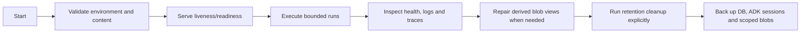
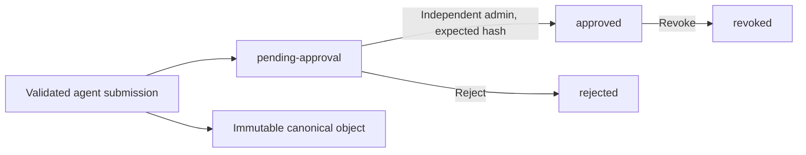

# Data access and operations

This consolidated reference preserves earlier contracts, proposals and dated observations. It is not a statement that every feature is implemented or deployed. Use the [five current guides](../../README.md) for current workflows and [AGENTS.md](../../AGENTS.md) for engineering policy. Earlier connector restrictions do not override project enablement policy.

## Contents
- [database](#database)
- [operations](#operations)
- [security model](#security-model)
- [blob storage](#blob-storage)
- [chat artifacts](#chat-artifacts)
- [browser sign in](#browser-sign-in)
- [project workspaces](#project-workspaces)
- [project access model](#project-access-model)
- [knowledge and usage](#knowledge-and-usage)

---

<a id="database"></a>

<a id="database--database-and-configuration"></a>
## Database and configuration

PostgreSQL owns application records, configuration snapshots, parameter values and file metadata. Local or GCS blobs own uploaded bytes, extracted attachment content and generated artifacts. Investigation evidence and ADK events may retain the snippets used for analysis; those are investigation records, separate from the file catalog. Repository YAML and Markdown are validated deployment templates. See the [configuration snapshot loader](../../app/configuration/database_bundle.py), [application store](../../app/persistence/store.py) and [blob provider](../../app/connectors/providers/blob.py).

<a id="database--schema-ownership"></a>
### Schema ownership

The application baseline is [001_initial.sql](../../migrations/history/001_initial.sql). The [migration runner](../../scripts/migrate.py) serializes deployment with an advisory lock, applies each migration transactionally and rejects changes to an applied migration's checksum.

| Schema | Contents and owner |
|---|---|
| `platform` | Configuration snapshots, active snapshot pointers, parameter definitions and migration ledger |
| `project` | Project names and parameter overrides |
| `runtime` | Runs, evidence, chats, attachment and artifact metadata |
| `governance` | Agent submissions, approved selections and audit records; parameter change audit |
| `optimization` | Optimization datasets, revisions and promoted selections |
| `adk` | Native ADK session and event tables |
| `mlflow` | Native MLflow tracking metadata and its migration ledger |

Application tables come from the [baseline](../../migrations/history/001_initial.sql). Native ADK table definitions are included in the baseline and used by the upstream service through [session initialization](../../app/persistence/database.py); MLflow tables are upgraded by its supported migration entry point in the [deployment job](../../scripts/deploy_database.py). Do not manually add application columns to upstream tables. MLflow artifact storage remains in project blobs through the [optimization evaluator](../../app/optimization/evaluation.py); the [offline fixture evaluation](../../scripts/eval.py) keeps its separate local tracking setup.

<a id="database--minimal-etl-metadata"></a>
### Minimal ETL metadata

Each of the 18 application tables has six tracking fields:

| Field | Meaning |
|---|---|
| `created_time` | Original insert time, preserved on updates |
| `edited_time` | Last insert/update instant as PostgreSQL `timestamptz`; use UTC for reporting |
| `etl_src_system` | Source of the write, such as `api` or `template-import` |
| `etl_batch_id` | Correlation identifier for the request or import |
| `created_by` | Original authenticated subject or job identity; preserved on updates |
| `edited_by` | Authenticated subject or job identity responsible for the latest write |

The [tracking migration](../../migrations/history/003_tracking_columns.sql) extends the baseline trigger to stamp all six fields. The [transaction context](../../app/persistence/lineage.py) carries the source, batch, and trusted writer; the [API boundary](../../app/api/application.py) supplies the authenticated subject. Jobs use `job:<source>`. Direct SQL defaults to source `database`, the PostgreSQL transaction ID, and the connected database role. Existing rows receive `legacy:unknown` for both actor fields because historical identity cannot be reliably reconstructed. For an upgrade retaining old rows, `created_time` uses the previously recorded ETL time; exact creation times begin with new rows. The creator and creation time cannot be overwritten by an ordinary update. Migration ledgers and native ADK/MLflow tables keep their own metadata.

<a id="database--platform-and-project-parameters"></a>
### Platform and project parameters

Parameters are identified by deployment tenant, tool and variable name. Project overrides add the server-authorized project ID; its display name belongs to the project record. Definitions contain a type, description, default value, override policy, icon and revision. Supported types are `string`, `integer`, `number`, `boolean`, `json` and `secret_ref`. Setting `allow_project_override=false` fixes a definition at platform level. See the [parameter models and persistence](../../app/configuration/parameters.py).

The [parameter API](../../app/api/routes/parameters.py) exposes:

- `GET /api/v1/parameters` for resolved values and their source.
- `PUT /api/v1/parameters/{tool}/{name}/definition` for authorized platform definitions.
- `PUT /api/v1/parameters/{tool}/{name}/override` for authorized project overrides.
- `DELETE /api/v1/parameters/{tool}/{name}/override?expected_revision=...` to restore inheritance.

Writes check expected revisions and record an audit event. Overrides also check the definition revision. A stale edit returns 409. Roles and tenant/project scope come from verified server membership, never request fields. Fixed definitions cannot be overridden. See [parameter authorization and validation](../../app/configuration/parameters.py).

Store only credential references such as `env://JIRA_API_TOKEN` or `env://SPLUNK_TOKEN` in credential parameters. Actual credentials belong in `.env` or a deployment secret system that supplies the referenced environment variables. The [parameter resolver](../../app/configuration/parameters.py) validates references, and the [provider secret resolver](../../app/connectors/providers/secrets.py) reads supported connector references. Parameter changes take effect after restart; explicitly supplied trusted environment settings take final precedence. Authentication and deployment scope remain environment-managed.

<a id="database--local-deployment-and-replay"></a>
### Local deployment and replay

```bash
make db-deploy
```

The [local deployment command](../../scripts/deploy_local_database.py) starts this repository's Compose PostgreSQL service, defaults to `127.0.0.1:5432`, creates missing credentials and writes private `.env` and `.env.runtime` files. The API container receives runtime credentials without the database owner's password or migration URL. The [deployment job](../../scripts/deploy_database.py) migrates, initializes native tracking, seeds missing templates and grants the API role data access without schema ownership. Repeat deployment preserves existing parameter values and the active configuration snapshot.

For an intentional clean replay of this repository's local database:

```bash
uv run python -m scripts.deploy_local_database --recreate
```

This stops the Compose API, drops and rebuilds the configured repository database, then deploys and seeds it. Database records are erased; blob files are retained. Retained blobs do not automatically restore deleted catalog records. Restart the API with `docker compose up -d --build api` when ready. This destructive development command is implemented in the [local deployment script](../../scripts/deploy_local_database.py); it is not a production upgrade or restore procedure.

<a id="database--publishing-template-changes"></a>
### Publishing template changes

The initial [seed](../../scripts/seed_database.py) imports missing definitions and a validated configuration snapshot without replacing deployed values. For a deliberate snapshot update, supply the currently active content hash:

```bash
uv run python -m scripts.seed_database --expected-bundle-hash CURRENT_ACTIVE_HASH
```

The [snapshot publisher](../../app/configuration/database_bundle.py) validates the template bundle and atomically changes its active pointer only when the expected hash matches. Restart the API to load it. Use the parameter API for parameter edits; publishing a bundle does not overwrite those definitions. Capability/model/profile/skill templates retain their existing declarative validation.

<a id="database--deployment-boundaries"></a>
### Deployment boundaries

Local deployment is a database setup, not a production certification. Before live rollout, verify trusted JWT configuration, connector/model permissions, backups and coordinated database/blob restore, and expected load. The [runtime](../../app/runtime/runner.py) has no durable worker or automatic run resumption. Retention is an explicit [cleanup command](../../scripts/cleanup.py). See [operations](data-access-and-operations.md#operations) for checks and limits.

---

<a id="operations"></a>

<a id="operations--operations"></a>
## Operations

Operational lifecycle at a glance:



The [harness lifecycle guide](runtime-and-extension-contracts.md#harness) is the canonical explanation of what each stage owns.

This release runs as one API service with PostgreSQL in Compose; SQLite remains available for offline tests and fixtures. The [local deployment command](../../scripts/deploy_local_database.py) and [database guide](data-access-and-operations.md#database) describe the seven schemas, runtime role and explicit clean replay. It has no durable background worker or restart recovery loop. Approved agent definitions and their content-addressed blobs do survive process restarts.

<a id="operations--configuration"></a>
### Configuration

Run `make db-deploy` to configure the local PostgreSQL instance and generate missing credentials in private `.env` and `.env.runtime` files; use [.env.example](../../.env.example) as the setting reference. The [deployer](../../scripts/deploy_local_database.py) excludes database owner credentials from the API container. Set `RCA_MODE=demo` for offline simulation or `RCA_MODE=live` for authenticated connector-backed runs. Configure one deployment scope with `RCA_TENANT_ID` and `RCA_PROJECT_ID`. Configure RS256 verification and server-side principals with `RCA_AUTH_ISSUER`, `RCA_AUTH_AUDIENCE`, `RCA_AUTH_PUBLIC_KEY`, and `RCA_PRINCIPALS_JSON`.

<a id="operations--health-and-observability"></a>
### Health and observability

`GET /health` is a liveness check and `GET /ready` checks storage/auth readiness. OpenTelemetry uses standard `OTEL_*` variables. MLflow uses the configured experiment identifier. Connector health is exposed at `GET /api/v1/connectors/health`. Effective redacted settings are exposed at `GET /api/v1/config` for authenticated project users.

<a id="operations--limits-and-recovery"></a>
### Limits and recovery

The service enforces `RCA_MAX_CONCURRENT_RUNS`, `RCA_RUN_TIMEOUT_SECONDS`, and `RCA_MAX_LLM_CALLS`. Request deadlines are UTC-based. The [HTTP boundary](../../app/api/application.py) limits streamed request bodies to the smaller of the configured run timeout and 60 seconds, returning 408 and releasing upload capacity on timeout. Clients should retain run IDs and retry explicitly after process failure; no durable worker resumes abandoned work. Retention cleanup is an explicit operator action: `uv run --env-file .env python -m scripts.cleanup` reports candidates; add `--apply` to delete expired terminal runs, their evidence and ADK sessions, plus expired extracted attachments and original chat artifact blobs/catalog entries. Raw artifacts expire after `RCA_RETENTION_DAYS` from upload; extracted text uses the shorter `RCA_ATTACHMENT_TTL_SECONDS`. Original cleanup is limited to the configured deployment project, and deletes bytes before metadata so failed deletions can be retried. See [artifact storage and recovery](data-access-and-operations.md#chat-artifacts). This is not scheduled automatically. Configuration blobs and approval audit records are retained separately.

Uploads are local-only and bounded. OCR requires Tesseract in the runtime image. Agent YAML blobs use local storage by default and GCS when `RCA_CONFIG_BLOB_URI` is a `gs://` URI. No remote file URLs, macros, code execution, or raw image visual semantics are supported.

Telemetry is disabled without an OTLP endpoint. Set `OTEL_EXPORTER_OTLP_TRACES_ENDPOINT` to the collector or MLflow trace ingestion URL, and `MLFLOW_EXPERIMENT_ID` when using MLflow. Standard `OTEL_EXPORTER_OTLP_HEADERS` carries deployment credentials. Exported spans retain allowlisted operational attributes and usage, stripping payload attributes, exception events, links, and arbitrary resource attributes. Export failures are visible in `/api/v1/config`; they do not fail investigations. This does not configure a remote collector for you.

The default redactor masks known credential patterns, email addresses and US SSN patterns. It is not a complete PII classifier; adapt data handling and retention to your deployment requirements. `/ready` checks local database connectivity and configured authentication; connector health and model authorization are checked separately at run preflight.

<a id="operations--database-configuration-and-template-rollout"></a>
### Database configuration and template rollout

With `RCA_DATABASE_CONFIGURATION=true`, [bootstrap](../../app/runtime/bootstrap.py) loads one validated database snapshot and resolves platform/project parameters at startup. Explicit trusted environment settings take final precedence. Restart after publishing configuration or parameter changes; active runs retain their resolved contract. Invalid configuration fails startup and acquired resources are closed.

Repository `blob_local/platform/` YAML and Markdown and administrator-managed project YAML are templates. `RCA_CONTENT_ROOT`, `RCA_CONFIG_DIR` and `RCA_PROJECTS_ROOT` select the input locations for the [seed command](../../scripts/seed_database.py). Initial deployment imports missing values without overwriting deployed configuration. Publish an intentional template update with `uv run python -m scripts.seed_database --expected-bundle-hash CURRENT_ACTIVE_HASH`, then restart. The [bundle publisher](../../app/configuration/database_bundle.py) validates content and compares the active hash atomically. See [database configuration](data-access-and-operations.md#database) for the parameter API, schema ownership and replay procedure.

Runtime optimization tracking metadata uses the PostgreSQL `mlflow` schema after local deployment; native MLflow migrations run in the [deployment job](../../scripts/deploy_database.py). Artifacts remain in project blobs through the [optimization evaluator](../../app/optimization/evaluation.py). Offline fixture evaluation keeps its own tracking store. Back up PostgreSQL and scoped blobs together and verify restoration before live rollout; local deployment does not establish production readiness.

<a id="operations--separate-project-storage"></a>
### Separate project storage

Create workspaces through the [project API and menu](data-access-and-operations.md#project-workspaces).
The [project provisioning command](../../blob_local/projects/README.md) remains an
operator template-import path. `RCA_PROJECTS_ROOT` selects local project artifacts;
optional `RCA_PROJECTS_BLOB_URI` selects the root of GCS artifact prefixes. New blobs
are separated by tenant and project. Preserve explicit legacy blob locations until
scoped migration is verified. Reference `project_1` and `project_2` are not active
scopes merely because example files exist.

Retention remains manual and project-scoped. For each project, run the cleanup
command with its `RCA_PROJECT_ID` and `RCA_DATABASE_CONFIGURATION=true`, using the
same tenant, databases and shared project artifact root as the API. Start with
the default report-only invocation, then add `--apply` after reviewing candidates.
For a newly created workspace, leave `RCA_CONFIG_BLOB_URI` and
`RCA_OPTIMIZATION_BLOB_URI` unset so its derived project paths are used; explicit
legacy locations belong only to the project they originally served. Personal
playground experiments are tenant-level and are also checked by the command.
There is no automatic all-project cleanup loop. Source: [cleanup command](../../scripts/cleanup.py),
[project artifact paths](../../app/settings.py).

---

<a id="security-model"></a>

<a id="security-model--security-model"></a>
## Security model

Authentication runs before file upload and run creation. Bearer authentication
verifies an RS256 JWT's signature, issuer, audience, expiry, and subject membership.
Reviewed browser OIDC sign-in verifies the provider's signed identity and creates
a bounded database session. Membership is resolved from server-owned project user
records. Configured bootstrap principals are imported once; later membership
changes, including deactivation, take precedence. Provider role/scope claims never grant access.
Sources: [identity checks](../../app/identity/auth.py), [browser sign-in](data-access-and-operations.md#browser-sign-in).

A deployment has one server-owned tenant from `RCA_TENANT_ID` and multiple
database-backed projects. `RCA_PROJECT_ID` identifies the bootstrap project.
`X-RCA-Project` selects a project; it cannot grant access. Each authenticated
request checks the selected project's active membership and derives its roles
from the database. With no selector, the service uses the subject's last active
selection, then an available membership. Inactive projects and memberships fail
closed even when their runtime is cached. Sources: [project membership](../../app/configuration/projects.py),
[request authentication](../../app/identity/auth.py).

Project creation and access-request bodies identify the requested project; they
do not become an authenticated scope. Creation requires a platform administrator.
An access request grants only its reviewed role after approval by a different
active owner or administrator of that project. Reactivating an inactive member
does not restore their old roles. Connector credentials remain in environment or
secret management and are redacted from effective configuration responses. New
projects receive no existing connector clients, connection bindings or credentials.
See [project workspaces](data-access-and-operations.md#project-workspaces).

File inputs are local-only. Parsers enforce size and archive-member limits, process DOCX/XLSX/PDF/text/images, and use OCR for images. They do not fetch URLs, execute macros or code, or infer visual image semantics.

Investigation tools are read-only. Jira and Splunk access is project/index scoped.
Administrative APIs separately permit authorized configuration edits, including
[skill registration](../../app/api/routes/catalog.py). New managed skills, project
knowledge, model pricing and OIDC settings use independent exact-revision review
before activation; edits do not silently become active. Specialist definitions use
independent review: authors submit data-only YAML, a different same-scope
administrator approves or rejects the expected content hash, and administrators
can revoke active definitions. Investigation tool writes and durable background
recovery are unsupported. See [agent approval](../../app/configuration/service.py)
and [per-call governance](../../app/runtime/governance.py).

Configuration inherits only explicitly delegated fields. Project permissions intersect platform ceilings; project budgets can only decrease them. User configuration is limited to permitted skill overrides and presentation preferences. Identity, credential-bearing database URLs, token settings and deployment scope are rejected in operational YAML; they must come from deployment environment. See [settings validation](../../app/settings.py), [layer resolution](../../app/configuration/layers.py), [tool catalog](../../app/tools/catalog.py) and [per-call governance](../../app/runtime/governance.py).

Real project configuration and artifacts are excluded from Git and container builds. Compose mounts platform defaults read-only and the separate project root read-write for artifact storage; operators manage project configuration permissions. Native authentication, audit, redaction and storage controls cannot be disabled by a layer. Custom agents retain separate expected-hash, same-scope, non-self administrator approval in the [approval service](../../app/configuration/service.py).

---

<a id="blob-storage"></a>

<a id="blob-storage--blob-storage-structure-stages-and-ownership"></a>
## Blob storage: structure, stages and ownership

Each project has one **framework** area and a separate **chats** area. Framework uploads are grouped by content type and approval stage. Inside each chat, uploaded material and generated material have separate roots. The same relative keys work in local storage and GCS.

The [project initializer](../../scripts/init_project.py) creates the local skeleton without overwriting existing data. [project_1](../../blob_local/projects/project_1/README.md) and [project_2](../../blob_local/projects/project_2/README.md) contain reference folders only, including a nonfunctional `chat_example`. Real scope IDs and chat IDs are assigned separately. The directory vocabulary is defined in [artifact_layout.py](../../app/connectors/providers/artifact_layout.py).

<a id="blob-storage--complete-layout"></a>
### Complete layout

```text
blob_local/
├── platform/                              Shared, deployed framework defaults
│   ├── config/                            Model profiles, prompts, limits, providers
│   ├── capabilities/                      Data-only capability contracts
│   ├── skills/                            Deployed skill instructions
│   └── layers/platform.yaml               Delegation policy
└── projects/
    ├── project_1/                         Reference only
    ├── project_2/                         Reference only
    └── <tenant-key>/<project-key>/
        ├── configuration/                 Active, operator-deployed settings
        │   ├── project.yaml
        │   └── users/<subject-key>.yaml
        ├── artifacts/
        │   ├── framework/
        │   │   ├── uploads/               ONE intake area for framework content
        │   │   │   ├── agents/
        │   │   │   ├── skills/
        │   │   │   ├── prompts/
        │   │   │   ├── capabilities/
        │   │   │   ├── configuration/
        │   │   │   │   # Each type above has:
        │   │   │   │   ├── draft/
        │   │   │   │   ├── pending-approval/
        │   │   │   │   ├── approved/
        │   │   │   │   ├── rejected/
        │   │   │   │   ├── revoked/
        │   │   │   │   └── archived/
        │   │   │   └── files/             Framework reference files, reserved
        │   │   │       ├── raw/
        │   │   │       ├── processed/
        │   │   │       ├── rejected/
        │   │   │       └── archived/
        │   │   ├── objects/
        │   │   │   └── agents/<sha256>.yaml  Immutable canonical versions
        │   │   └── optimizations/
        │   │       └── objects/<sha256>.yaml Immutable JSON datasets/report bundles
        │   └── chats/
        │       └── chat_<id>/
        │           ├── uploads/           Files supplied by the chat owner
        │           │   ├── raw/
        │           │   │   └── artifact_<id>/<sha256>.bin
        │           │   └── processed/
        │           │       └── artifact_<id>/<sha256>.json
        │           └── created/           Files produced from run records
        │               ├── completed/
        │               ├── failed/
        │               └── simulated/
        │                   # Each outcome contains run_<id>/<sha256>.json
        └── exports/                       Operator-managed external exports
```

The content-type directories each contain their own stage directories; the indented comment above abbreviates that repetition. An implemented agent stage file is `framework/uploads/agents/<stage>/draft_<id>/<sha256>.yaml`. Names and titles supplied by users never form storage paths. Tenant/project keys use a readable prefix and the full SHA-256 of the identity. [Path construction](../../app/connectors/providers/project_storage.py), [artifact storage](../../app/persistence/chat_artifacts.py).

<a id="blob-storage--framework-approval-stages"></a>
### Framework approval stages

| Stage | Meaning | Current implementation |
|---|---|---|
| `draft` | Work that has not been submitted for review | Reserved; there is no draft-save API |
| `pending-approval` | Validated submission awaiting an independent review | Agent YAML submissions enter here |
| `approved` | Exact content version approved by an administrator | Agent review moves its stage copy here |
| `rejected` | Submitted version rejected by a reviewer | Agent rejection moves its stage copy here |
| `revoked` | Previously approved version withdrawn | Agent revocation moves its stage copy here |
| `archived` | Explicitly retired historical content | Reserved; no archive transition API |

These stage folders exist for agents, skills, prompts, capabilities and configuration. **Only agents currently have an upload/review API and automatic stage movement.** Skills, prompts, capabilities and configuration remain deployed platform/project content, governed by existing configuration validation and restart requirements. Their staged upload folders are reserved and are not read by the runtime. Framework `files` is also reserved; `/api/v1/files` is exclusively for chat uploads. [Agent lifecycle](configuration-and-review-contracts.md#skill-lifecycle), [configuration service](../../app/configuration/service.py), [platform loading](../../app/configuration/platform.py).



Movement is **copy, verify SHA-256, then delete the previous stage copy**. Canonical content remains in `framework/objects/agents` for audit and pinned run snapshots. Each submission has its own `draft_id`, so reviewing identical content twice does not move another submission's files. SQLAlchemy review records and active pointers decide which version runs; putting a file in `approved` manually never activates it. Previous approved versions can remain in `approved` while a newer version is selected by the active pointer. [Stage provider](../../app/connectors/providers/framework_stages.py), [review, revocation and active selection](../../app/configuration/service.py).

Database commit and object movement are not one distributed transaction. After a durable review, the service synchronizes the stage view while locking its record. If storage fails, the review remains durable, execution still follows the database, and the error is logged without blob contents. Use the explicit repair command below to finish interrupted moves. During interruption, duplicate or stale stage copies may exist; folders are a review view, not authorization. There is no background synchronizer.

Optimization datasets and reports remain immutable objects under `framework/optimizations/objects`. Their evaluation, review and activation state stays in SQLAlchemy; there are no optimization stage-copy folders or automatic activation from files. The `.yaml` suffix is retained for compatibility with the existing blob provider even though these payloads are JSON. [Optimization implementation](../../app/optimization/service.py).

<a id="blob-storage--chat-upload-and-generated-stages"></a>
### Chat upload and generated stages

| Branch | Contents | Written when | Retention |
|---|---|---|---|
| `uploads/raw` | Byte-for-byte accepted original | Upload passes existing parsing checks | Fixed at upload using `RCA_RETENTION_DAYS` (default 90 days) |
| `uploads/processed` | Redacted extracted text, source hash, filename/type and parser warnings as JSON | Original storage succeeds; ready status follows verification of both objects | Fixed at upload using `RCA_ATTACHMENT_TTL_SECONDS` (default one day) |
| `created/completed` | Final run result and redacted evidence JSON | `SUCCEEDED` or `PARTIAL` run completes | Follows terminal run retention |
| `created/failed` | Terminal run status and any recorded redacted evidence | `FAILED`, `BLOCKED` or `CANCELLED` run finishes | Follows terminal run retention |
| `created/simulated` | Explicitly simulated run JSON | Demo run finishes | Follows terminal run retention |

Processing creates a **derivative** rather than deleting or relocating the original: both raw and processed content have a purpose and different expiry. The generated branch contains a final export for each run, with no upload originals embedded. Intermediate model events remain in the native ADK run session; no intermediate draft report files are created. Unsupported or textless uploads are rejected before they enter the ready catalog; there is no retained quarantine of rejected uploads. [Upload route](../../app/api/routes/files.py), [catalog and exports](../../app/persistence/chat_artifacts.py), [runner](../../app/runtime/runner.py).

A raw/processed catalog row is written as pending before blob writes and becomes ready only after both immutable objects pass integrity verification. Failed writes remain pending for cleanup. An upload batch can partially persist if storage fails; use an explicit chat ID so completed artifacts can be listed before retrying. An original remains downloadable after processed text expires, until its own expiry. Re-upload it to run extraction again. [Write lifecycle and cleanup](../../app/persistence/chat_artifacts.py).

Generated exports are derived from persisted terminal runs and evidence. A failed export does not change a completed investigation into a failure. The download endpoint and manual repair command can recreate missing exports. This does not resume interrupted model work. Runs abandoned before finalization become failed on a later run read; their export can then be generated. [Runner finalization](../../app/runtime/runner.py), [run deadline handling](../../app/persistence/store.py).

<a id="blob-storage--apis-ownership-and-metadata"></a>
### APIs, ownership and metadata

- `POST /api/v1/chats` creates an owned chat; `GET /api/v1/chats` lists owned chats.
- `POST /api/v1/files` accepts optional multipart `chat_id` and local files. If omitted, a new chat is created after successful parsing. The response provides chat, attachment and artifact IDs.
- `POST /api/v1/runs` accepts optional `chat_id`. Uploaded attachment IDs can supply the chat implicitly; mixing attachments from different chats is rejected.
- `GET /api/v1/chats/{chat_id}/runs` returns persisted chat run history.
- `GET /api/v1/chats/{chat_id}/artifacts` lists original-upload metadata.
- `GET /api/v1/chats/{chat_id}/artifacts/{artifact_id}/download` downloads original bytes.
- `GET /api/v1/chats/{chat_id}/created/{run_id}/download` downloads the generated run/evidence JSON.

Chat routes, original downloads and generated downloads require the authenticated chat owner, including for administrators. Existing run/evidence routes retain their project-level permissions. The database records ownership, hashes, status, filenames, byte sizes, expiry and chat/run links; native ADK sessions remain per-run. Raw originals can include sensitive material removed during extraction and require restricted storage/backup access. They are never passed directly to models or exposed through static web hosting. [Chat routes](../../app/api/routes/chats.py), [authentication](../../app/api/application.py), [persistence](../../app/persistence/store.py), [chat API details](data-access-and-operations.md#chat-artifacts).

<a id="blob-storage--initialization-cleanup-and-repair"></a>
### Initialization, cleanup and repair

```bash
# Creates actual scoped local directories; does not overwrite existing content.
python -m scripts.init_project --tenant acme --project payments --subject analyst

# Reports recoverable framework stage views and chat-created outputs.
python -m scripts.sync_artifacts
# Rebuilds them from authoritative database/canonical records.
python -m scripts.sync_artifacts --apply

# Reports expired original chat artifacts and terminal runs.
python -m scripts.cleanup
# Removes expired blobs before removing their database records.
python -m scripts.cleanup --apply
```

The last four commands require configured deployment tenant/project IDs and the same database/blob settings as the running service. They affect only that deployment scope. No real scope has been assigned to the two reference folders. The initializer creates the framework skeleton and chat container; individual chat paths are created when content is written. GCS uses prefixes, so no empty folder-marker objects are required. [Initializer](../../scripts/init_project.py), [repair](../../scripts/sync_artifacts.py), [retention](../../scripts/cleanup.py).

Cleanup deletes expired processed objects independently of raw expiry, then expired originals and their catalog records. It also removes generated run exports before their associated retained run/evidence/session records. If a blob deletion fails, the catalog/run records remain available for retry. Chat containers and empty directories can remain after cleanup. Framework canonical objects, stage copies and approval audits have no automatic deletion policy. Operator exports are managed separately.

<a id="blob-storage--deployment-and-existing-installations"></a>
### Deployment and existing installations

Default artifact roots are resolved from `RCA_PROJECTS_ROOT` or `RCA_PROJECTS_BLOB_URI`, then the configured tenant/project keys. `RCA_CONTENT_ROOT` and project `configuration` remain local deployed configuration. Provider-owned Application Default Credentials are used for GCS. Keep database volumes, session volumes and local blob volumes durable; back them up together. [Settings](../../app/settings.py), [provider](../../app/connectors/providers/blob.py), [Compose](../../docker-compose.yml).

Explicit `RCA_CONFIG_BLOB_URI` and `RCA_OPTIMIZATION_BLOB_URI` overrides continue pointing to their existing canonical stores; stage views still use the new framework upload prefix. If upgrading from flat defaults or the earlier `artifacts/agent-configurations` / `artifacts/optimizations` defaults, pin those previous absolute locations with the overrides until a verified migration is performed. Changing a root does not move old objects. Neither the initializer nor repair command migrates existing canonical blobs or recreates original uploads discarded by earlier code. New chat and catalog tables are additive; existing run/attachment table columns are unchanged.

---

<a id="chat-artifacts"></a>

<a id="chat-artifacts--chat-artifact-api"></a>
## Chat artifact API

Each chat separates **uploads** from **created outputs**. Upload originals remain byte-for-byte intact under `uploads/raw`; redacted extracted text is stored under `uploads/processed`. Generated terminal run/evidence JSON goes under `created/completed`, `created/failed` or `created/simulated`. See the [complete blob structure and lifecycle](data-access-and-operations.md#blob-storage) for folder meanings, retention, recovery and framework approval stages.

<a id="chat-artifacts--client-flow"></a>
### Client flow

1. `POST /api/v1/chats` returns a server-generated `chat_id`.
2. Send multipart `chat_id` and `files` to `POST /api/v1/files`. Omitting `chat_id` creates one after successful parsing. Each returned attachment includes `attachment_id`, `artifact_id`, filename, media type, SHA-256, byte count, expiry and extraction warnings.
3. Submit `POST /api/v1/runs` with `chat_id`, `prompt`, capability and optional `attachment_ids`. An omitted chat ID is inferred from uploaded attachments. Mixed-chat attachments are rejected. Existing ungrouped runs remain readable.
4. Read `GET /api/v1/chats/{chat_id}/runs` for run history, or `/artifacts` for original artifact metadata. `GET /api/v1/chats` lists owned chats. Listings accept `limit` (1–100) and `before` (creation timestamp).
5. Download an original using `GET /api/v1/chats/{chat_id}/artifacts/{artifact_id}/download`. Download generated JSON using `GET /api/v1/chats/{chat_id}/created/{run_id}/download`.

[Chat routes](../../app/api/routes/chats.py), [upload route](../../app/api/routes/files.py), [ownership and run links](../../app/persistence/store.py), [artifact catalog and export lifecycle](../../app/persistence/chat_artifacts.py).

All chat routes require the authenticated owner; administrators cannot download another user’s originals through this API. Existing project-level run/evidence access remains unchanged. Originals download as attachments with no MIME sniffing or caching. Unsupported and textless uploads are rejected; image extraction remains OCR-only, with no remote URL fetching, macro evaluation or code execution. [Authentication](../../app/api/application.py), [parsers](../../app/inputs/files.py).

Originals use `RCA_RETENTION_DAYS` at upload; processed copies and extracted attachments use `RCA_ATTACHMENT_TTL_SECONDS`. An original can still be downloaded after extraction expires; re-upload it to analyze it again. Generated exports follow terminal run retention and can be rebuilt from stored run/evidence records. Chat metadata remains after artifact cleanup. Native ADK sessions stay per-run; this does not add conversational model memory or background recovery. [Retention and repair commands](data-access-and-operations.md#blob-storage--initialization-cleanup-and-repair).

---

<a id="browser-sign-in"></a>

<a id="browser-sign-in--browser-sign-in"></a>
## Browser sign-in

Company sign-in uses an independently reviewed OpenID Connect (OIDC) provider.
An administrator supplies explicit HTTPS issuer, authorization, token, signing-key
and callback URLs, client ID, scopes and a bounded session lifetime. Confidential
clients refer to a server `env://` secret; the secret value never belongs in the
browser form. A different administrator in the same project reviews the exact
configuration hash before activation. Sources: [configuration lifecycle](../../app/configuration/oidc.py),
[authentication API](../../app/api/routes/authentication.py).

After sign-in, the service verifies the RS256 signature, issuer, client audience,
authorized party when required, expiry and nonce. Authorization codes are exchanged
with PKCE. A one-use database transaction binds state to the initiating browser.
The verified subject must already have active server-side project membership;
identity-provider role or scope claims do not grant project permissions. Sources:
[OIDC provider](../../app/connectors/providers/oidc.py),
[membership and authentication](../../app/identity/auth.py).

The browser receives a Secure, HttpOnly session cookie. Mutations require the
configured origin and the session's CSRF token. Membership is checked on each
request. Logout deletes the database session; expiration, provider replacement
and revocation invalidate it. The callback uses the fixed workspace destination.
Public sign-in starts have a bounded pending-transaction capacity and can return
429 when that capacity is reached. Source: [browser session service](../../app/configuration/oidc.py).

The browser session remains bound to its original approved provider configuration
and deployment project. Selecting another project verifies that subject's active
membership there and derives its roles afresh; it does not rebind the identity
provider or trust provider-supplied project claims. Logging out after a project
switch still invalidates the original session. See [project workspaces](data-access-and-operations.md#project-workspaces)
and [independent session tests](../../tests/integration/test_projects_independent_review.py).

<a id="browser-sign-in--deployment-requirements"></a>
### Deployment requirements

- Serve the application at the HTTPS origin used by the approved callback URL.
  Register its exact `/api/v1/auth/callback` URL with the identity provider.
- Provision the verified provider subject as a project member before sign-in.
- Retain the existing bearer verification/bootstrap configuration for live startup
  and administrator recovery. This release still validates that configuration in
  [Settings](../../app/settings.py), even when browser OIDC is enabled.
- Apply all shipped migrations before starting this release. Migration 024 adds
  browser sessions, 026 adds project workspaces, and 027 adds run feedback.
- Configure infrastructure access logs to omit callback authorization-code query
  strings. Application response handling cannot control reverse-proxy logs.

There is no automatic account provisioning, refresh-token storage, silent renewal,
or identity-provider logout in this release. When the bounded local session expires,
the user starts company sign-in again. Tests use a local signed issuer and verify
protocol and access boundaries; production provider setup needs validation against
the organization's actual identity service. [Integration tests](../../tests/integration/test_oidc.py).

---

<a id="project-workspaces"></a>

<a id="project-workspaces--work-with-project-workspaces"></a>
## Work with project workspaces

A project keeps a team's investigation configuration, knowledge, connections,
conversations, files, results and usage separate. One deployment supports multiple
projects in its server-owned tenant. The project menu lists only active projects
where your account has active membership. Sources: [project directory](../../app/configuration/projects.py),
[project API](../../app/api/routes/projects.py), [workspace shell](../../frontend/src/App.tsx).

<a id="project-workspaces--create-and-open-a-project"></a>
### Create and open a project

A platform administrator can create a project with a unique key, name, description
and timezone. Keys start with a letter and contain at most 64 letters, numbers,
underscores or hyphens. Creation stores the project, its initial configuration,
creator membership and audit entry in one database transaction. The creator is
its platform administrator and project owner.

The initial configuration inherits the declarative platform baseline. Managed
skills remain authoritative tenant database records and join execution only when
approved. New projects do not copy another project's members, knowledge, documents,
conversation history, project overrides or connector bindings. Configure the
project's sources before asking for external observations. A skill alone cannot
provide credentials or implement an unsupported integration.

Initial document uploads are separate bounded operations after project creation.
They become knowledge drafts and require the normal independent review before
investigations use them. A failed upload does not erase the new project; add the
failed file from Knowledge. [Document lifecycle](data-access-and-operations.md#knowledge-and-usage).

Project Setup saves incomplete edits as a versioned draft. Applying a validated
setup publishes its name, description and timezone to the project directory in
the same database transaction as its runtime configuration. A stale draft causes
the transaction to roll back. The setup's configuration-readiness display does
not deactivate project access; there is no project archive/delete workflow in
this release. [Setup API](../../app/api/routes/catalog.py),
[atomic update](../../app/configuration/projects.py).

Selecting a project checks your membership before saving your preference. The
browser clears the prior workspace and changes its project request selector.
The last active selection is remembered per account. A URL or selector can ask
to open a project, but it cannot grant a role or bypass a disabled membership.
An inactive remembered project falls back to another active membership when no
explicit project selector was supplied.

<a id="project-workspaces--request-access-or-another-role"></a>
### Request access or another role

Enter the project key, requested role and a reason. Available requested roles are
viewer, analyst, manager and owner. Requests cannot grant platform administrator
access. Unknown and unavailable project keys receive a generic access error;
the form does not disclose another team's project directory.

Your request remains pending until a different active owner or administrator of
the target project approves or rejects its exact content hash. Editing the review
request or retrying a completed review does not grant another role. A reviewer
from a different project cannot approve it. Approval adds the requested role to
an active membership; for an inactive former member, it grants only the reviewed
role and does not restore old elevated permissions. Request and review changes
are audited. Sources: [access lifecycle](../../app/configuration/project_access.py),
[access API](../../app/api/routes/project_access.py).

<a id="project-workspaces--api-contract"></a>
### API contract

| Operation | Endpoint | Result |
|---|---|---|
| List your projects | `GET /api/v1/projects` | `items`, `current_project_id`, `can_create` |
| Create project | `POST /api/v1/projects` | `201`; accepts `project_id`, `name`, `description`, `timezone` |
| Select project | `POST /api/v1/projects/{id}/select` | Verified `principal` and `project` |
| List your own or reviewable requests | `GET /api/v1/project-access-requests` | Up to 200 recent records |
| Request access | `POST /api/v1/project-access-requests` | `201`; accepts `project_id`, `requested_role`, `reason` |
| Review access | `POST /api/v1/project-access-requests/{id}/{approve\|reject}` | Accepts `expected_hash` and review `reason` |

Request statuses are `PENDING`, `APPROVED` and `REJECTED`. Role values are
`PROJECT_VIEWER`, `PROJECT_ANALYST`, `PROJECT_MANAGER` and `PROJECT_OWNER`.
`X-RCA-Project` is a selector; tenant identity and effective roles are always
resolved on the server. Browser-cookie mutations additionally require the
session's origin and CSRF token. [Authentication implementation](../../app/identity/auth.py).

<a id="project-workspaces--deployment-and-limits"></a>
### Deployment and limits

Apply migrations through 027 before starting this release. The migrator reserves
the restricted `rca_app` role without login when absent because older immutable
migrations reference it; the deployment job configures its login credentials.
Workspace creation requires data insertion privileges for the new project and
initial configuration pointer, while existing scope keys and configuration
history remain protected. Sources: [migrator](../../scripts/migrate.py),
[role provisioning](../../scripts/deploy_database.py), [workspace migration](../../migrations/history/026_project_workspaces.sql).

Each API process caches a bounded number of project runtimes. Busy contexts are
retained until their responses and investigations finish. A full busy cache
returns a retryable error instead of sharing a different project's resources.
There is no durable background worker or restart recovery contract. OIDC sessions
retain their original provider approval binding across project selections.
[Runtime isolation](runtime-and-extension-contracts.md#runtime-context), [browser sign-in](data-access-and-operations.md#browser-sign-in).

Automated checks cover simultaneous projects with separate knowledge, files and
native ADK runs; immediate membership revocation; approved-skill inheritance;
streaming resource leases; independent access review; and PostgreSQL privileges.
They use signed local identities and fixture model/provider responses, not a live
identity provider or live-model quality evaluation.
[Project checks](../../tests/integration/test_projects.py),
[independent security checks](../../tests/integration/test_projects_independent_review.py),
[PostgreSQL checks](../../tests/integration/test_project_postgres_privileges.py).

---

<a id="project-access-model"></a>

<a id="project-access-model--project-access-and-personal-experimentation"></a>
## Project access and personal experimentation

Project Viewer and Project Manager can start bounded, read-only Jira/Splunk triage,
ticket review, incident timeline, log correlation, and attachment review, upload
analysis inputs, and read project runs, live events, evidence, metrics, and
available evaluation feedback. They cannot change configuration, membership,
knowledge, feedback, connector settings, or external systems. Analysis creation
necessarily persists its run, input, and result; it does not grant configuration
or external mutation rights. Owners and platform administrators retain project
management. Existing analyst permissions remain in place. Roles combine
additively; adding Generic User does not remove an existing project membership.

The boundary runs before request-body and upload parsing. Operation-specific
endpoint and service checks continue to apply. Project capabilities remain
explicit YAML allowlists; project policy can narrow the platform baseline.
An empty allowlist denies execution. External tool mutations remain disabled
for every role.

Sources: [HTTP boundary](../../app/api/application.py),
[access policy](../../app/policy/access.py), [authoring permissions](../../app/configuration/service.py),
[capability policy](../../blob_local/platform/capabilities/incident_triage.yaml),
[resolver](../../app/capabilities/resolver.py), [tool policy](../../app/policy/engine.py).

<a id="project-access-model--generic-user"></a>
### Generic User

A generic-only identity has no project access. JWT verification and server-side
membership checks still apply; request bodies never choose identity or scope.
The authenticated principal has no project ID, and `/api/v1/me` does not return
project or tenant identifiers for this identity. The tenant remains internal to
isolate personal records between organizations. Generic-only identities may be
configured with an empty project ID. Existing generic memberships remain valid.

Allowed APIs:

| API | Behavior |
| --- | --- |
| `GET /api/v1/me` | Own identity and roles |
| `GET /api/v1/access` | Server-computed access flags |
| `GET /api/v1/playground/capabilities` | Available personal capabilities and local tools |
| `POST /api/v1/playground/tools/generic.text_metrics` | Measure supplied `text` without model access |
| `POST /api/v1/playground/tools/generic.inspect_json` | Validate supplied JSON `text` without model access |
| `POST /api/v1/playground/runs` | Run a personal experiment with `prompt` and optional `capability` |
| `GET /api/v1/playground/runs` | Own experiment history; bounded `limit` |
| `GET /api/v1/playground/runs/{run_id}` | Own experiment result |

All project APIs, including project health, knowledge, tools, notifications,
configuration, and run history, reject generic-only identities. Personal results
use a separate SQL table and native ADK application/session namespace. Other
users, including administrators, cannot read them through the playground APIs.
Project run counts and history do not include personal experiments.

The initial text-review capability uses real local text/JSON tools and a native
ADK LlmAgent/Runner using the existing fast-investigation model profile. It gets
only user-supplied text and its local tools: no project overrides, project
prompts, skills, connectors, credentials, knowledge, attachments, or sessions.
Model calls require configured model access even when project mode is demo;
there is no simulated success fallback. Direct local-tool calls need no model.
Input, context, model calls, tool calls, concurrency, and request duration are
bounded. Model failures return a persisted failure without raw exception details.

Sources: [identity](../../app/identity/auth.py), [API](../../app/api/routes/playground.py),
[execution and persistence](../../app/runtime/playground.py),
[local tools](../../app/tools/domain/generic.py),
[declarative capability](../../blob_local/platform/capabilities/playground/text_review.yaml).

<a id="project-access-model--deployment-and-limits"></a>
### Deployment and limits

Apply migration 017 before starting the new backend against PostgreSQL. For
SQLite development, startup creates the personal experiment table. Publish the
updated capability manifests and personal capability through the versioned
configuration bundle when database configuration is enabled; repository YAML is
only a deployment template. Preserve any deliberate project-level restrictions.

There is no background recovery worker. Request cancellation is terminal, and
an expired unfinished experiment is reported as interrupted. Manual retention
cleanup removes expired personal records and their native ADK sessions alongside
existing project cleanup. Backend playground APIs are available; a dedicated
playground frontend is not included in this change. This change grants read
access to existing project data APIs, not a new feedback product.

Sources: [migration](../../migrations/history/017_playground_runs.sql),
[bundle export](../../app/optimization/content.py), [cleanup](../../scripts/cleanup.py),
[boundary regressions](../../tests/integration/test_project_role_boundaries.py).

---

<a id="knowledge-and-usage"></a>

<a id="knowledge-and-usage--knowledge-and-measured-usage"></a>
## Knowledge and measured usage

<a id="knowledge-and-usage--add-reusable-project-documents"></a>
### Add reusable project documents

Project owners and platform administrators can create text documents or upload
local files from Knowledge and project setup. Supported formats and limits come
from the active file-processing configuration. The same bounded parser handles
text, CSV, DOCX, XLSX, PDF and OCR-supported images. Images provide extracted text;
the system does not interpret charts, objects or other visual meaning. It does not
fetch document URLs or execute code/macros. Sources: [file parser](../../app/inputs/files.py),
[upload route](../../app/api/routes/knowledge_uploads.py),
[document editor](../../frontend/src/components/KnowledgeDocumentForm.tsx).

1. Save a document or upload a file. It starts as **Draft**.
2. Submit the exact revision for review. Its status becomes **Pending**.
3. A different project owner or platform administrator reviews and approves or
   rejects it. The reviewer must belong to the same project.
4. Approved documents become available to project members and eligible investigations.
5. Editing or replacing a document creates a new draft revision. The previous
   revision immediately stops qualifying for new investigations. An administrator
   can also revoke an approved document.

Revision hashes prevent stale editors or reviewers from overwriting newer work.
Review history and immutable revision content are retained. Original uploaded
bytes are retained separately and can be downloaded by authorized members; draft
originals are restricted to owners/administrators. Text edits of uploaded content
keep the original file for provenance; download returns that file, not a generated
copy of edited text. Existing unreviewed legacy documents require a fresh saved
revision before submission. Source: [knowledge service](../../app/configuration/knowledge.py).

| Operation | API |
|---|---|
| List documents | `GET /api/v1/knowledge` |
| Create text draft | `POST /api/v1/knowledge` |
| Upload draft / replace file | `POST /api/v1/knowledge/upload`; replacements include `doc_id` and `expected_hash` |
| Save edited revision | `PUT /api/v1/knowledge/{id}` with `expected_hash` |
| Submit / approve / reject / revoke | `POST /api/v1/knowledge/{id}/{action}` with `expected_hash` and `reason` |
| Download retained original | `GET /api/v1/knowledge/{id}/download` |
| View audit history | `GET /api/v1/knowledge/{id}/history` |

Deletion is disabled to preserve audit history. Source: [catalog endpoints](../../app/api/routes/catalog.py).

<a id="knowledge-and-usage--how-documents-affect-an-answer"></a>
#### How documents affect an answer

Knowledge retrieval is literal keyword relevance, capped at three documents and
the active evidence/context budgets. It is not semantic search. An unrelated
question can select no documents. Selected excerpts, source IDs and hashes are
frozen with the run and captured as cited evidence. Reference guidance must be
corroborated before claiming a current incident cause. A document never expands
connector access, supplies credentials, or bypasses a capability's required
connectors. Sources: [retrieval](../../app/configuration/knowledge.py),
[snapshot and evidence capture](../../app/runtime/runner.py),
[agent instruction boundary](../../app/agents/root.py).

<a id="knowledge-and-usage--read-insights"></a>
### Read Insights

Insights reads persisted native model-call events and run/stage/tool timings.
Input, output, thinking and cached-input counters come from provider usage
metadata. The application records one final cumulative usage report per model
invocation, so streaming chunks and repeated ADK events do not inflate totals.
Only validated numeric counters bypass credential-like field names; raw secrets
retain the ordinary redaction policy. Sources: [model wrapper](../../app/models/bounded.py),
[event persistence](../../app/persistence/run_events.py),
[measurements](../../app/persistence/telemetry.py).

- Choose a UTC date range, investigation type, and live/demo mode. Group the
  breakdown by stage, model, or investigation type; the API also accepts a stage
  filter. Dates group runs by their start day; ranges are limited to 366 inclusive days.
- Token totals show recorded usage only. Missing usage is **unknown**, not zero.
  Each counter includes its own reporting coverage: a provider reporting input
  tokens alone does not establish total, output, thinking, or cached token counts.
- Cache hit/miss counts require an explicit provider cached-input count. Missing
  cache metadata is unknown. These metrics do not claim an application result cache.
- Stage filters apply to model usage. Agent and tool timings cover all selected
  runs, as stated in the response coverage notes.
- Reports analyze at most 1,000 newest matching runs and 20,000 newest events.
  Coverage indicates truncation. A limited report is not a complete invoice total.
- Older traces may have masked numeric token fields under the previous generic
  secret filter. They cannot be reconstructed and remain excluded from usage totals.
- Failed or interrupted calls can lack final provider usage. Unknown calls prevent
  a complete cost estimate, including inside chart groups.

Run records and existing trace endpoints retain the redacted question, answer,
citations and progress needed to inspect individual results. No artificial quality
or accuracy score is inferred from latency, volume or successful execution.
Sources: [run API](../../app/api/routes/runs.py), [response model](../../app/runtime/run_contract.py).

<a id="knowledge-and-usage--configure-model-prices"></a>
#### Configure model prices

Model prices start unconfigured. A platform administrator submits explicit USD
input/output rates per million tokens, plus cached-input rates when applicable.
A different platform administrator in the author's project approves the exact
proposal hash. Pending proposals preserve the currently active prices. Approved
rates are frozen at run creation; changing or revoking them does not rewrite
historical estimates. Prices live in `platform.system_configurations` and review
history uses the existing governance audit. Sources: [pricing lifecycle](../../app/configuration/model_pricing.py),
[pricing API](../../app/api/routes/telemetry.py).

`GET /api/v1/telemetry/pricing` returns active rates, catalog revision and the latest
proposal. `PUT` with `expected_revision` and `rates` submits a proposal. Review
uses `POST /api/v1/telemetry/pricing/{approve|reject|revoke}` with `expected_hash`
and `reason`. Missing rates or incomplete usage produce a null complete estimate;
known charges remain separately visible. Output-rate calculations include separately
reported thinking counters. With no cache report, the estimate prices the reported
input count at the input rate; cache-hit reporting remains unknown. These are
administrator-configured token estimates, not provider invoices or live vendor prices.

Verification: [native document lifecycle and parser tests](../../tests/integration/test_knowledge_lifecycle.py),
[measured usage and real local TLS connector tests](../../tests/integration/test_telemetry.py).
The fixture model checks execution contracts; it does not establish live model quality.

<a id="knowledge-and-usage--capture-answer-feedback"></a>
#### Capture answer feedback

A completed live answer in Chat offers **Useful** and **Needs work**, with an
optional note. Only the investigation author can record or change this rating.
Notes pass through the same bounded redaction policy as other retained text.
Updates include the expected revision; a stale edit returns a conflict and the
interface preserves the unsaved note while loading the latest revision.

Insights counts the latest rating for each selected investigation. Filters use
the investigation's start date and live/demo mode; these are self-reported
experience signals, not an accuracy metric. Feedback neither changes an agent nor
approves configuration. It expires with the associated investigation under manual
retention cleanup. Sources: [feedback API](../../app/api/routes/feedback.py),
[feedback persistence](../../app/persistence/feedback.py),
[feedback interface](../../frontend/src/components/RunFeedback.tsx),
[feedback verification](../../tests/integration/test_feedback.py).
