# Runtime and extension contracts

This consolidated reference preserves earlier contracts, proposals and dated observations. It is not a statement that every feature is implemented or deployed. Use the [five current guides](../../README.md) for current workflows and [AGENTS.md](../../AGENTS.md) for engineering policy. Earlier connector restrictions do not override project enablement policy.

## Contents
- [architecture](#architecture)
- [harness](#harness)
- [runtime context](#runtime-context)
- [plugin architecture](#plugin-architecture)
- [extending the framework](#extending-the-framework)
- [harness configuration backend](#harness-configuration-backend)
- [harness studio](#harness-studio)

---

<a id="architecture"></a>

<a id="architecture--architecture-and-execution-flows"></a>
## Architecture and execution flows

This is the implementation reference for the RCA assist harness. Read the [harness guide](runtime-and-extension-contracts.md#harness) first for the component map and lifecycle diagrams; this guide explains the same system at package, configuration, and API-flow level.

Start with the [request flow](#architecture--1-request-and-preflight-flow), then follow the [agent workflow](#architecture--2-agent-workflow) and [connector call](#architecture--3-agent-to-connector-flow). Uploads happen separately through the [file flow](#architecture--4-file-processing-flow). Project specialists enter new runs through the [approval flow](#architecture--5-project-agent-approval-and-discovery). The [result flow](#architecture--6-results-progress-and-persistence) explains what the client receives.

These diagrams describe the backend used by the React workspace. Start with
[Extend RCA assist with skills](runtime-and-extension-contracts.md#extending-the-framework) for the user-facing entry
points and extension workflow. Solid arrows show execution or data movement;
dotted arrows show configuration or access to stored data. A connector is an API
client; a tool is the typed interface an agent can call.

<a id="architecture--configuration-ownership-and-inheritance"></a>
### Configuration ownership and inheritance

The entire backend uses a platform/project/user ownership model. Google ADK is pinned to **2.9.0** in [pyproject.toml](../../pyproject.toml). Native ADK owns agent/workflow execution; application code owns authentication, resolved permissions, bounded inputs and durable records.

For the selection algorithm and element-by-element precedence rules, see [harness selection rules](runtime-and-extension-contracts.md#harness--selection-rules-by-harness-element). This table describes ownership; that section describes how the owned values become one run configuration.

| Area | Platform | Project | User |
|---|---|---|---|
| Identity, tenant/project scope and credentials | Deployment environment and server membership; immutable | Cannot replace | Cannot replace |
| Capability access | Enabled definitions, minimum role and action ceiling | May disable or narrow roles/actions | Cannot grant access |
| Connector access | Implemented Jira/Splunk providers, credentials and resource scope | May disable a provider; required-provider denial disables the capability | Cannot add providers or keys |
| Models | Stage model IDs, settings and profiles in `config/model_profiles.yaml` | Selects only explicitly delegated existing profiles per capability | Cannot select models |
| Execution budgets | Process concurrency and maximum per-run limits | May reduce model/tool calls, deadline, context and evidence limits | Cannot increase budgets |
| Workflow | Native graph, stage availability and mandatory synthesis | May disable planning, attachments, specialists or parallel evidence | Cannot alter graph |
| Stage prompts | Trusted defaults and immutable enforcement outside prompts | May replace delegated stage text; approved optimization is a baseline beneath explicit project text | Cannot replace stage prompts |
| Skills | Instruction defaults, action bindings and override policy | Permitted overrides and further restrictions | Only overrides explicitly permitted by both higher tiers |
| Presentation | Supported metadata formats and detail values | Team defaults and explicit user delegation | Permitted personal presentation/detail preferences |
| Custom agents | Data-only schema and implemented tool catalog | Durable non-self administrator approval and revocation | Cannot bypass approval |
| Persistence, input parsing and telemetry | Scoped SQLAlchemy/ADK stores, local bounded parsers, redaction and metadata export | Cannot disable safety/storage controls | Cannot disable safety/storage controls |

Later instruction/default values take priority only where delegated. Permissions intersect; limits take the smaller value; a lower tier cannot restore a denial. Preferences guide model instructions and are not permission grants. The native workflow is selected by server configuration; model planning contributes notes to synthesis, not authority to rewrite the graph.

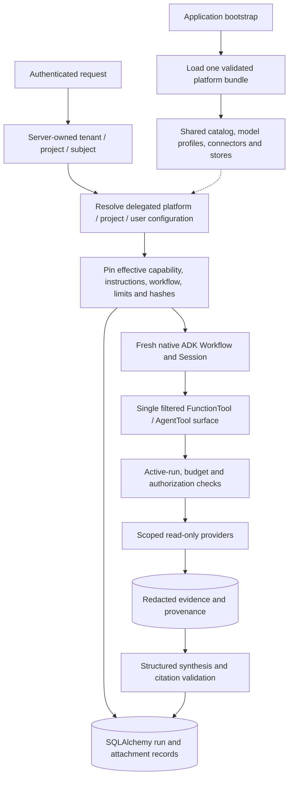

<a id="architecture--code-and-content-layout"></a>
### Code and content layout

```text
app/
  api/                 HTTP middleware, request schemas and focused route modules
  configuration/       Platform bundle, typed layers, resolution and agent approval
  capabilities/        Declarative capability registry and authorization
  identity/            RS256 verification and server-owned membership
  runtime/             Resource lifecycle, run snapshots, execution and governance
  agents/              Native ADK graph and stage factories
  tools/               One implemented action catalog and typed domain tools
  connectors/providers/ Network clients, credentials and local/GCS blobs
  persistence/         Async SQLAlchemy run, evidence and attachment store
  inputs/              Bounded local file parsing and OCR
  models/              Stage profiles and model call limiter
  policy/              Role/attribute checks, redaction and enforcement fingerprint
  optimization/        Isolated replay, MLflow evaluation and reviewed promotion
  observability/       Operational telemetry and metrics
blob_local/platform/
  config/              Platform operational defaults and model profiles
  capabilities/        Declarative capability contracts
  skills/              Default instruction assets
  layers/platform.yaml Explicit delegation policy
blob_local/projects/<tenant-key>/<project-key>/
  configuration/project.yaml  Administrator-managed project configuration
  configuration/users/        Explicitly delegated subject configuration
  artifacts/framework/objects/agents/       Immutable agent definitions
  artifacts/framework/uploads/              Content types and approval-stage views
  artifacts/framework/optimizations/objects/ Immutable datasets/evaluated bundles
  artifacts/chats/chat_<id>/uploads/         Raw originals and processed text
  artifacts/chats/chat_<id>/created/         Generated terminal run/evidence exports
  exports/                    Operator-managed exports; not automatic
```

The [ASGI application factory](../../app/api/application.py) composes the HTTP boundary. [Application bootstrap](../../app/runtime/bootstrap.py) validates and shares the [platform bundle](../../app/configuration/platform.py), owns cleanup, and creates connector clients once per process. [Routes](../../app/api/routes) call services; they do not create infrastructure. [Layer resolution](../../app/configuration/layers.py) never takes scope or filesystem paths from request bodies. [Investigation persistence](../../app/persistence/store.py) owns durable run, evidence and attachment records.

[Project initialization and storage](../../blob_local/projects/README.md) · [Project settings reference](../../blob_local/platform/layers/projects/README.md) · [User example](../../blob_local/platform/layers/users/README.md) · [Delegation policy](../../blob_local/platform/layers/platform.yaml)

Shipped baseline templates have an operator publication and restart workflow.
The workspace also exposes authenticated editors for delegated project settings,
platform controls and database-backed skill creation; see
[the extension guide](runtime-and-extension-contracts.md#extending-the-framework) and
[database configuration](data-access-and-operations.md#database). Filename conventions do not grant scope or
permission. Duplicate scopes/keys, aliases, unknown fields, invalid references and
unauthorized overrides are rejected by the relevant validators. Native guardrails
never become optional model tools.

<a id="architecture--1-request-and-preflight-flow"></a>
### 1. Request and preflight flow

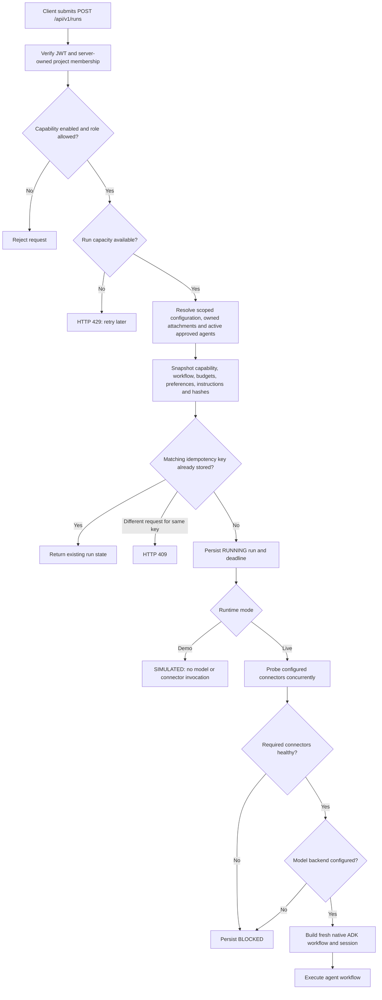

Authentication and input errors return HTTP errors before an investigation starts. Once a run exists, execution outcomes are persisted as run statuses. An unavailable optional connector needed by retained actions is omitted and recorded as a limitation; an unavailable required connector blocks execution. Preflight checks model backend configuration, not a successful live model inference.

`POST /runs` executes within its request and normally returns the completed result. It is not a durable job-queue submission. Another request can list runs, read progress, or cancel a running investigation.

**Implementation:** [authentication](../../app/identity/auth.py), [API middleware](../../app/api/application.py) and [run routes](../../app/api/routes/runs.py), [`ExecutionRunner.execute` and `_execute_contract`](../../app/runtime/runner.py), [capability resolver](../../app/capabilities/resolver.py), [run contract](../../app/runtime/run_contract.py).

<a id="architecture--2-agent-workflow"></a>
### 2. Agent workflow

This is the fullest topology for `incident_triage` with healthy Jira and Splunk, attachments, and an approved specialist. The factory omits branches that resolved project controls, capability permissions, enabled stages, inputs or available connectors do not support.

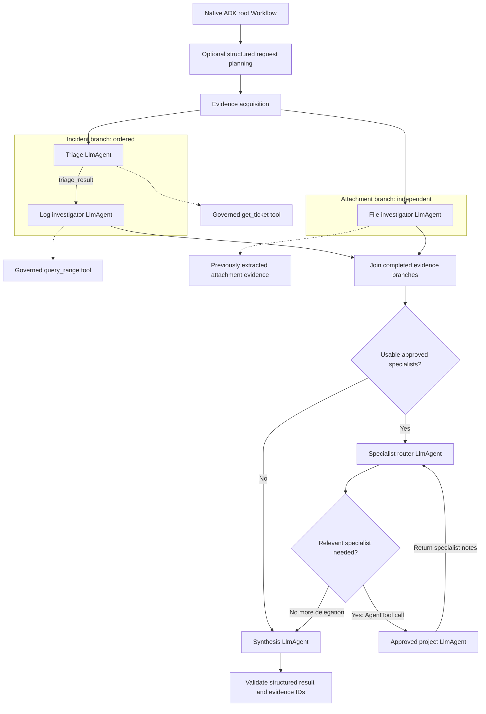

Jira triage precedes log investigation so the log agent can use `triage_result`. File summarization can run alongside the incident branch because its text is already extracted. The join waits for all included evidence branches before routing and synthesis. When the platform or project sets `parallel_evidence: false`, the evidence branches run sequentially. With one branch, no parallel join is needed.

The router can choose relevant specialists from the approved `AgentTool` list; approval does not mean every specialist runs on every request. Specialists can use only their declared existing tools, within the main run's capability permissions and shared budgets. Their results are notes, not automatically authoritative evidence.

| Stage | Receives | Produces | Default balanced profile |
|---|---|---|---|
| Planning | Request and resolved preferences | Typed `request_plan` notes | Selected triage model; no tools |
| Triage | Request, incident ID, selected skill instructions; Jira through a tool | `triage_result` | `triage`: Flash Lite, low thinking |
| Logs | Request, triage notes, configured lookback; Splunk through a tool | `logs_result` | `logs`: Flash, low thinking |
| File summary | Request and recorded attachment text | `file_result` | `extraction`: Flash Lite, minimal thinking |
| Specialist router | Request and captured evidence; approved specialist descriptions | `specialist_result` | Uses the selected profile's triage model |
| Project specialist | Request, captured evidence, approved instructions and tools | Return value to the router | Approved `model_profile` and `stage_model` |
| Synthesis | Stage notes and authoritative captured evidence | Structured findings or insufficient evidence | `synthesis`: Flash, high thinking |

Exact model IDs, thinking settings, output limits and profile mappings are in [model_profiles.yaml](../../blob_local/platform/config/model_profiles.yaml). The shared `max_parallel_models` semaphore limits simultaneous model calls across runs in one process. The resolved `max_llm_calls` and the smaller of profile/project tool limits bound each run, including specialist work. These limits do not make dependent stages parallel.

**Implementation:** [`build_root_agent`](../../app/agents/root.py), [triage factory](../../app/agents/triage.py), [log/file factories](../../app/agents/workflows/evidence_acquisition.py), [synthesis factory](../../app/agents/rca_synthesizer.py), [model limiter](../../app/models/bounded.py), [prompts](../../blob_local/platform/config/prompts.yaml).

<a id="architecture--how-capability-selection-changes-the-graph"></a>
#### How capability selection changes the graph

| Capability | Required connector | Optional connector | Included investigation stages |
|---|---|---|---|
| `incident_triage` | `itsm` | `log_search` | Jira triage, then logs if usable; file summary if supplied and enabled |
| `log_correlation` | `log_search` | `itsm` | Logs; file summary if supplied and enabled. Jira is not attached because this capability does not allow `itsm.get_ticket` |
| `database_rca` | — | — | Disabled; no database investigation runs |

Every enabled capability still reaches synthesis, with the optional approved-specialist router before it. Uploading a file does not waive the selected capability's required-connector checks. See [capability manifests](../../blob_local/platform/capabilities).

<a id="architecture--3-agent-to-connector-flow"></a>
### 3. Agent-to-connector flow

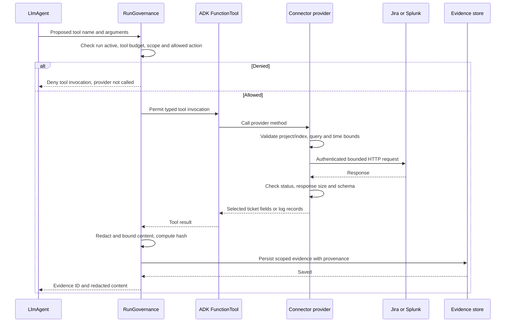

The diagram describes the ADK before/after-tool callbacks, not a second network layer. Domain tools contain no HTTP or credential handling. Providers own credentials, HTTPS clients, connection pools, request bounds and external resource scoping. Raw provider responses pass through governance before becoming model-visible tool results.

Provider failures go through `on_tool_error`: the model receives a sanitized unavailable-source message, the run records a limitation, and synthesis may continue. Policy denials fail closed. A later model, timeout or validation failure can still fail the investigation.

| Agent-facing function | Capability action | Provider method | External operation |
|---|---|---|---|
| `get_ticket(ticket_id)` | `itsm.get_ticket` | `JiraConnector.get_ticket` | Read issue from the configured Jira project |
| `query_range(query, time_range)` | `log_search.query_range` | `SplunkConnector.query_logs` | Read bounded search results from the configured Splunk index |

**Implementation:** [governance callbacks](../../app/runtime/governance.py), [ITSM tools](../../app/tools/domain/itsm.py), [log tools](../../app/tools/domain/logs.py), [Jira provider](../../app/connectors/providers/jira.py), [Splunk provider](../../app/connectors/providers/splunk.py), [evidence store](../../app/persistence/store.py). See [connector lifecycle and health flows](connector-specifications.md#connector-onboarding).

<a id="architecture--4-file-processing-flow"></a>
### 4. File-processing flow

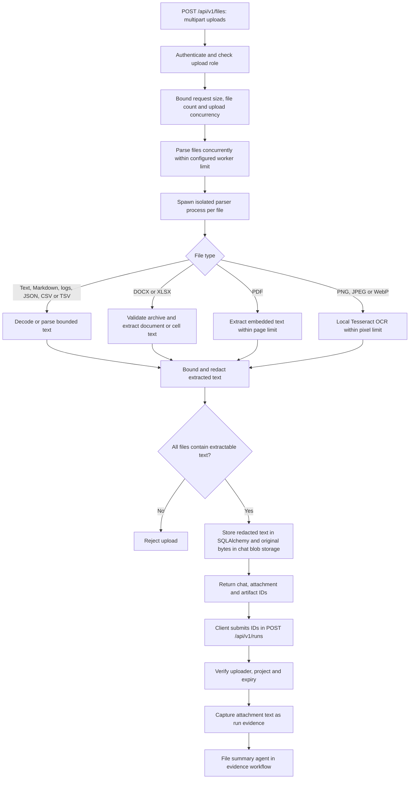

Parsing is local, occurs before investigation, and does not call an LLM. Each parser has a hard timeout and a killable child process. The upload stores redacted extracted text and metadata in SQLAlchemy, plus the exact original bytes under the project’s chat artifact prefix. Only the authenticated chat owner can list or download originals; raw bytes never enter the model context. The later file agent summarizes the stored text using its configured model.

Scanned PDFs without embedded text are rejected; the image OCR path does not automatically rasterize PDFs. Image support extracts text, not visual scene meaning. XLSX formulas are read as text rather than executed or recalculated. File warnings are carried into run limitations.

**Implementation:** [upload route](../../app/api/routes/files.py), [`parse_files` and `parse_file`](../../app/inputs/files.py), [file limits](../../blob_local/platform/config/file_processing.yaml), [`save_attachment` and `get_attachments`](../../app/persistence/store.py), [chat artifact catalog](../../app/persistence/chat_artifacts.py), [chat routes](../../app/api/routes/chats.py).

The [blob storage guide](data-access-and-operations.md#blob-storage) defines framework approval stages, upload processing stages, generated outputs and recovery.

<a id="architecture--5-project-agent-approval-and-discovery"></a>
### 5. Project agent approval and discovery

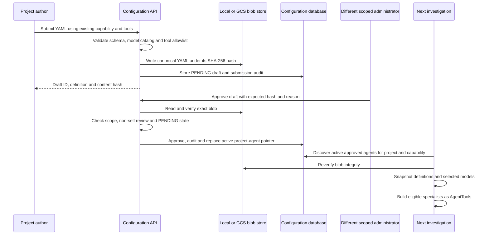

Only `PLATFORM_ADMIN` or `PROJECT_OWNER` can review, within the deployment's tenant/project scope. Authors cannot review their own drafts. Rejecting a draft never activates it. A new approval replaces the active version for that agent ID; previous approved records remain history. Revocation removes that version from future discovery. Already-running investigations retain their pinned snapshot.

<a id="architecture--approved-project-specialists"></a>
#### Approved project specialists

```yaml
id: payments_specialist
version: 1.0.0
name: Payments specialist
description: Reviews payment timeout evidence when relevant
instruction: Summarize payment failure evidence and cite recorded evidence IDs.
capability: incident_triage
model_profile: balanced-investigation
stage_model: logs
tools: [log_search.query_range]
```

`stage_model` selects a logical stage in the approved profile or an explicitly named deployment stage. YAML cannot import Python or introduce new network tools. The local/GCS blob provider stores configuration; it is not an investigation tool exposed to the model.

**Implementation:** [configuration endpoints](../../app/api/routes/agents.py), [definition schema](../../app/configuration/models.py), [approval and active-version service](../../app/configuration/service.py), [blob provider](../../app/connectors/providers/blob.py), [specialist assembly](../../app/agents/root.py). See [lifecycle and endpoints](configuration-and-review-contracts.md#skill-lifecycle).

<a id="architecture--6-results-progress-and-persistence"></a>
### 6. Results, progress and persistence

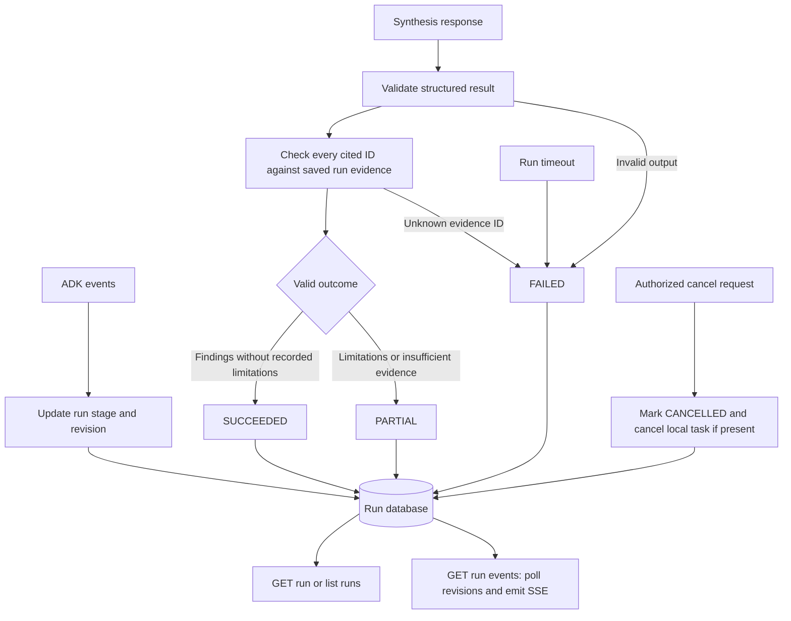

SSE exposes stored progress revisions; it is not a raw token stream. Clients can obtain a run ID from the run listing while a request is active. Terminal records cannot be overwritten by a late agent result. After a process interruption, runs are not resumed; a stale running record becomes failed when read after its deadline.

| Store or export | What it contains | Purpose |
|---|---|---|
| Run database | Immutable contract snapshot, status, stage, result and revisions | Client results, idempotency and progress |
| Evidence records | Redacted content, source/query provenance, content hash and evidence ID | Resolve and validate citations |
| Attachment records | Redacted extracted text, source hash, owner and expiry | Inputs for subsequent runs |
| Native ADK session database | Session state and execution events | ADK conversation/workflow persistence |
| Configuration database and blobs | Drafts, active pointers, review audit and canonical YAML | Approved specialist lifecycle |
| Optional OTLP export | Allowlisted operational metadata and usage | Tracing to a collector or MLflow |

Citation validation checks that IDs exist in the run's evidence; it does not independently prove causal correctness. Metadata-only telemetry is separate from the application/session databases. Retention is an explicit operator action, described in [operations](data-access-and-operations.md#operations).

**Implementation:** [event consumption and final validation](../../app/runtime/runner.py), [run/evidence persistence](../../app/persistence/store.py), [SSE and cancellation routes](../../app/api/routes/runs.py), [telemetry filtering](../../app/observability/otel.py).

<a id="architecture--prompt-and-skill-improvement"></a>
### Prompt and skill improvement

Native MLflow optimization compares an instruction candidate with the active baseline on a versioned benchmark. A separate administrator must approve a passing comparison before its immutable blob bundle becomes active for new investigations. See [the optimization workflow](configuration-and-review-contracts.md#optimization) for storage, evaluation gates, API examples and MLflow inspection.

---

<a id="harness"></a>

<a id="harness--rca-assist-harness"></a>
## RCA assist harness

This document is the operational map of the RCA assist harness. The harness is the application boundary that turns an authenticated request into a bounded, evidence-grounded ADK run and a durable result.

It is intentionally split into small components. Each component has one responsibility, one lifecycle, and one authoritative source of state.

For shared template catalogs, plugin bundles, and project resource selection, see
[the platform harness library](configuration-and-review-contracts.md#platform-library).

<a id="harness--system-view"></a>
### System view

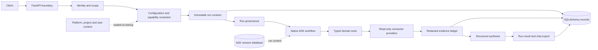

The request path is synchronous from the API caller's perspective, but model and connector work execute asynchronously inside the process. Run records and ADK sessions are durable; abandoned model work is not automatically resumed.

<a id="harness--component-map"></a>
### Component map

| Component | Responsibility | Authoritative state | Lifecycle |
|---|---|---|---|
| HTTP boundary | Authentication ordering, body limits, routing, response headers | Request and response | Request/response |
| Identity and scope | Verify RS256 tokens and server membership | Deployment environment | Startup/request |
| Configuration layers | Merge delegated platform/project/user settings | YAML content and resolved snapshot | Startup/new run |
| Capability resolver | Check enabled capability, role, actions and connectors | Capability YAML | New run |
| Run contract | Freeze input, content hashes, limits and scope | SQLAlchemy run row | Run lifetime |
| ADK workflow | Execute planning, evidence, delegation and synthesis | Native ADK events/session | Run lifetime |
| Governance | Enforce budgets, policy, redaction and evidence bounds | In-memory counters plus DB ledger | Run lifetime |
| Connector providers | Own credentials, network clients and provider behavior | Provider instance | Application lifetime |
| File pipeline | Parse local attachments and retain raw/processed derivatives | Chat artifact catalog and blob objects | Upload/retention |
| Agent approval | Review data-only project specialists | DB review record plus immutable blob | Submission lifecycle |
| Evidence and output | Persist provenance, validate citations and export results | Evidence rows and terminal run result | Run/retention |
| Optimization | Evaluate and approve prompt/skill bundles | Immutable bundle plus DB state | Candidate lifecycle |
| Operations | Health, telemetry, cleanup and repair | Metrics, logs and operator commands | Process/deployment |

<a id="harness--1-application-lifecycle"></a>
### 1. Application lifecycle

The application creates shared resources once and closes them in reverse order. Routes do not create providers, stores or model clients.

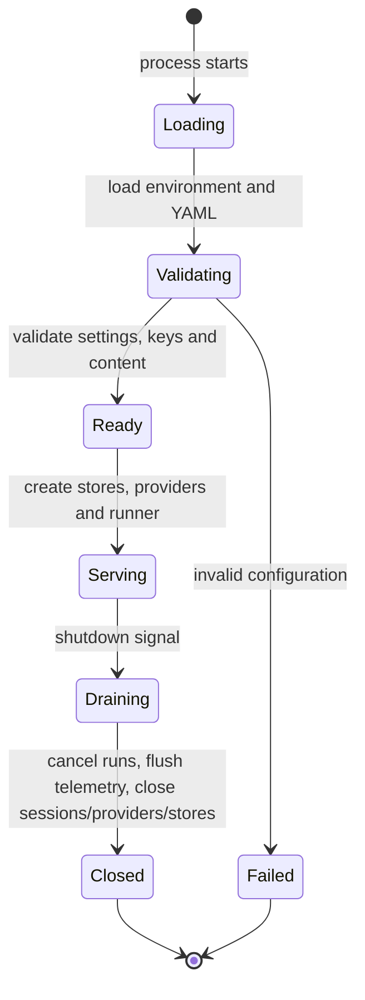

`app/runtime/bootstrap.py` owns this lifecycle. Live mode requires deployment scope, token verification settings and server-side memberships. Demo mode can start without live connector/model credentials, but it returns `SIMULATED` and performs no diagnosis.

<a id="harness--2-request-lifecycle"></a>
### 2. Request lifecycle

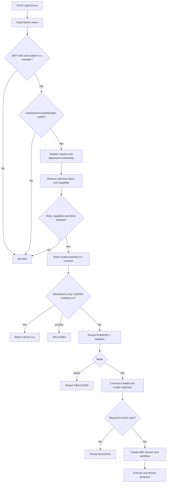

Authentication runs before multipart parsing and upload/model capacity is bounded with semaphores. A request cannot supply its own tenant, project, role, connector, model or approval state.

<a id="harness--3-configuration-lifecycle"></a>
### 3. Configuration lifecycle

Configuration is data-only. Platform content is loaded at startup; project and user layers are resolved for a principal when a run is assembled. Environment variables own identity, credentials and deployment scope.

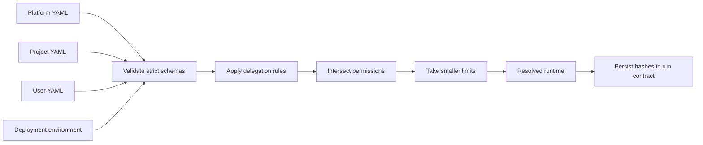

The rules are simple: lower layers may narrow a permission or limit, but cannot restore a denial or introduce a connector/model/tool. Instruction overrides are allowed only where explicitly delegated. A missing layer inherits; an unknown field, duplicate scope, alias, invalid reference or unauthorized override fails validation.

<a id="harness--selection-rules-by-harness-element"></a>
#### Selection rules by harness element

The platform is the ceiling, the project selects the effective operating profile, and the user can personalize only fields that the platform and project explicitly delegate.

| Harness element | Platform selects/owns | Project may select or narrow | User may select | Effective selection |
|---|---|---|---|---|
| Deployment identity, tenant, project, credentials | Owns completely through environment and membership | No | No | Server-owned deployment scope |
| Capability availability | Defines manifest, enabled state, roles, actions and safety | Disable, narrow actions/roles, choose delegated model profile | No | Platform capability intersected with project override |
| Required connectors | Defines capability requirements and provider configuration | Disable a connector; this disables capabilities that require it | No | Required must be healthy; optional can be omitted |
| Connector credentials and endpoints | Owns through provider configuration/environment | No | No | Shared provider instance from application startup |
| Model profiles and stage models | Defines profiles, stage IDs and limits | Choose only a profile named in `platform.yaml` | No | Capability profile, replaced only by an allowed project profile |
| Workflow switches | Defines native graph and available stages | Disable planning, attachments, parallel evidence or specialists | No | Native graph filtered by project flags and global ceilings |
| Stage prompts | Defines defaults and stage names | Replace only delegated prompt fields | No | Platform prompt plus permitted project replacement |
| Skills and skill actions | Defines instruction, immutability, actions and override policy | Replace/disable/intersect actions when delegated | Replace/disable/intersect actions only when both tiers delegate | Platform → optimization → project → user |
| User presentation/detail | Defines permitted preference names | Grant permitted preference names and set project defaults | Set own permitted values | Project default overlaid by user value |
| Approved specialists | Defines schema, allowed tools and review rules | Submit and approve project-scoped definitions | No | Active approved definitions matching capability |
| Run budgets | Defines process and safety ceilings | Reduce calls, tools, context, evidence and timeout | No | Minimum of platform settings and project limits |
| File parsing limits | Defines parser formats, size and worker bounds | No | No | Platform parser limits; project can disable attachments |
| Chat and artifact access | Defines storage layout and retention controls | Scope is fixed to deployment project | Own chats and artifacts only | Server scope plus authenticated owner check |
| Optimization | Defines evaluator and approval gates | Own scoped candidates and active pointer | No | Approved active bundle for future runs |

<a id="harness--resolution-sequence"></a>
#### Resolution sequence

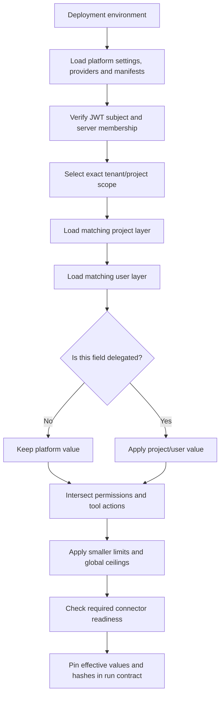

Resolution is keyed by authenticated values, never by a filename supplied by a caller. Project configuration is matched on `(tenant_id, project_id)`; user configuration is matched on `(tenant_id, project_id, subject)`. If no matching project or user layer exists, defaults remain in effect.

<a id="harness--precedence-examples"></a>
#### Precedence examples

**Capability and connector selection.** The platform enables `incident_triage` with `itsm.get_ticket` and `log_search.query_range`. A project may disable `log_search`, leaving Jira triage available but recording log investigation as unavailable. A user cannot re-enable it. If the platform-required `itsm` connector is unhealthy, the run is `BLOCKED`.

**Model selection.** The capability starts with `balanced-investigation`. A project may choose `fast-investigation` only if that profile is listed in `platform.yaml`; the user cannot choose a model. The chosen profile and every resolved stage configuration are copied into the run contract.

**Skills.** The platform defines the skill's permitted actions. A delegated project instruction replaces the platform instruction. A delegated user instruction replaces the project instruction, while action sets are intersected at every tier. Setting `enabled: false` at a higher tier cannot be undone below it.

**Budgets and workflow.** The platform process ceiling is 12 model calls and 100 evidence items. A project can reduce either value and can disable attachments or specialists. A user cannot increase limits or change the graph. The run uses the reduced values captured at creation time, even if configuration changes later.

**Optimization.** An approved optimization bundle is inserted beneath explicit project/user instruction overrides and above the platform baseline where the skill is mutable. It never changes tools, capabilities, safety policy or the workflow graph. Its revision hash is pinned per run.

<a id="harness--which-flow-runs-for-which-request"></a>
### Which flow runs for which request?

The harness does not currently have one separate root graph per capability. It builds one governed root workflow and filters its branches from the resolved capability, available connectors, attachments, and project workflow flags. This is why the diagrams can look RCA-centric even though the entry points are different.

| Flow | Entry condition | Stages that run | Current status |
|---|---|---|---|
| Incident triage | `capability=incident_triage` | Optional planning → Jira/ITSM triage → optional log investigation → optional attachments → specialists → synthesis | Implemented |
| Log correlation | `capability=log_correlation` | Optional planning → log investigation → optional attachments → optional specialists → synthesis | Implemented through the filtered root graph |
| Database RCA | `capability=database_rca` | None | Disabled; required `database_query` provider and tool are not implemented |
| Attachment-supported analysis | Any enabled capability with attachment IDs and project `workflow.attachments=true` | File extraction branch joins the capability's evidence branch, then synthesis | Implemented; upload/parsing happens before the run |
| Attachment-only request | A request has attachments but no usable connector branch | File extraction → synthesis; result may be `INSUFFICIENT_EVIDENCE` | Supported when the capability remains authorized |
| Project specialist delegation | Approved matching agents exist and `workflow.specialists=true` | Specialist router → selected `AgentTool` specialists → synthesis | Implemented; approval is project-scoped |
| Generic request classification | Any run when `workflow.planning=true` | Orchestrator classifies intent and selects relevant governed actions | Implemented as a plan plus tool-action gating, not as a separate unrestricted graph |
| Prompt/skill optimization | Optimization API, not a run request | Candidate generation → replay/evaluation → review → activation | Separate lifecycle; does not execute in the investigation graph |

<a id="harness--capability-to-flow-routing"></a>
#### Capability-to-flow routing

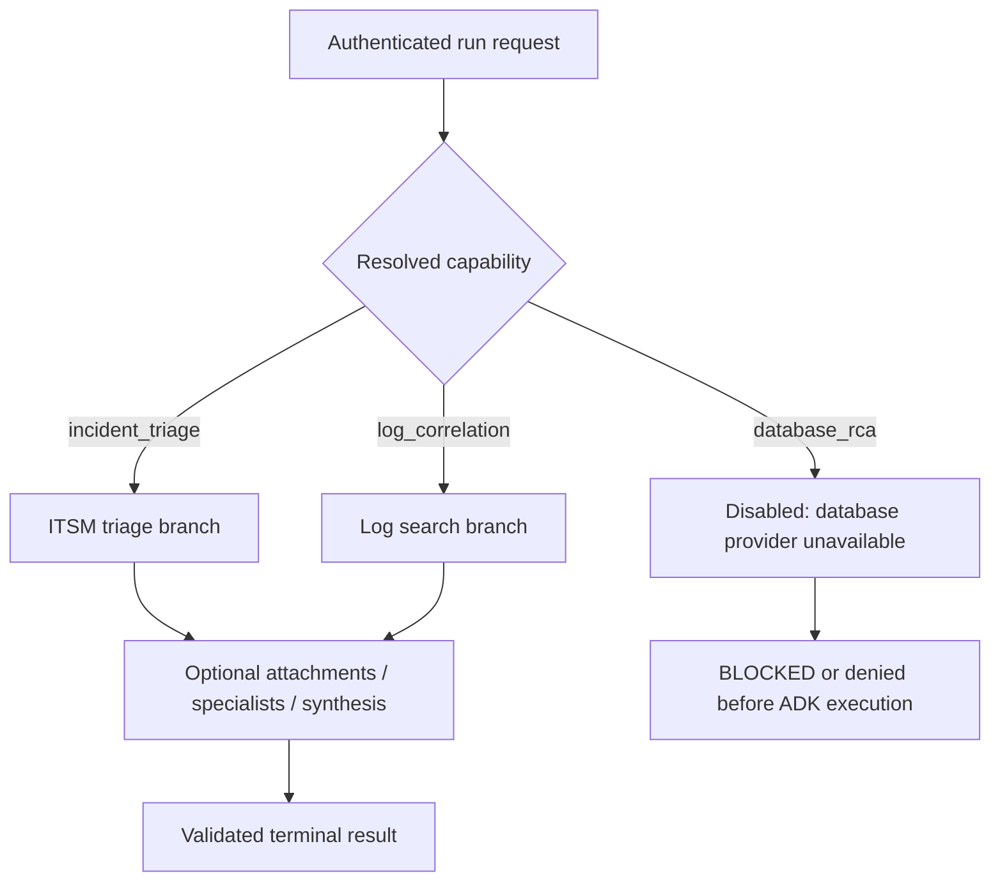

<a id="harness--why-the-flows-converge"></a>
#### Why the flows converge

The shared synthesis stage is deliberate: it gives every capability the same evidence, redaction, citation, status, timeout, and persistence guarantees. The specialization happens before synthesis through capability actions and stage availability, and during execution through the request plan. The current code selects `get_ticket` and `query_range` branches from `capability.allowed_actions`; the intent plan then governs whether each action is relevant.

The orchestrator's intent labels control which governed tool actions are relevant. `triage`, `root_cause_analysis`, `tool_data_request`, `metrics`, `sanity_check`, `project_knowledge`, `generic_answer`, `follow_up`, and `rerun` are not separate unrestricted graphs: the shared graph remains fixed, while tool callbacks reject actions that do not match the plan. Metrics currently means bounded log-derived measurements, and project knowledge currently means supplied attachments because those connectors are not enabled. A future connector or specialist must be added to the platform catalog and capability allowlist before it can be selected.

<a id="harness--4-capability-lifecycle"></a>
### 4. Capability lifecycle

A capability is a declarative contract connecting a request to skills, actions, required/optional connectors, safety settings and a model profile.

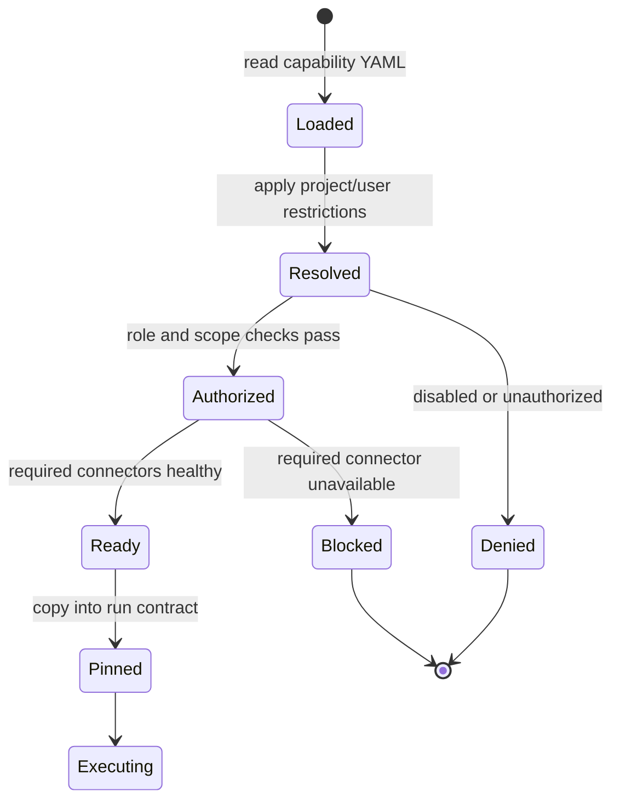

Optional connector failure does not automatically stop execution. It is recorded as a limitation and can produce `PARTIAL`. Required connector failure produces `BLOCKED` before model execution.

<a id="harness--5-agent-workflow-lifecycle"></a>
### 5. Agent workflow lifecycle

The root graph is assembled fresh for every run from the pinned contract. It uses native Google ADK `LlmAgent`, `Workflow`, `JoinNode`, `AgentTool`, `Runner`, `Session` and `Event` concepts.

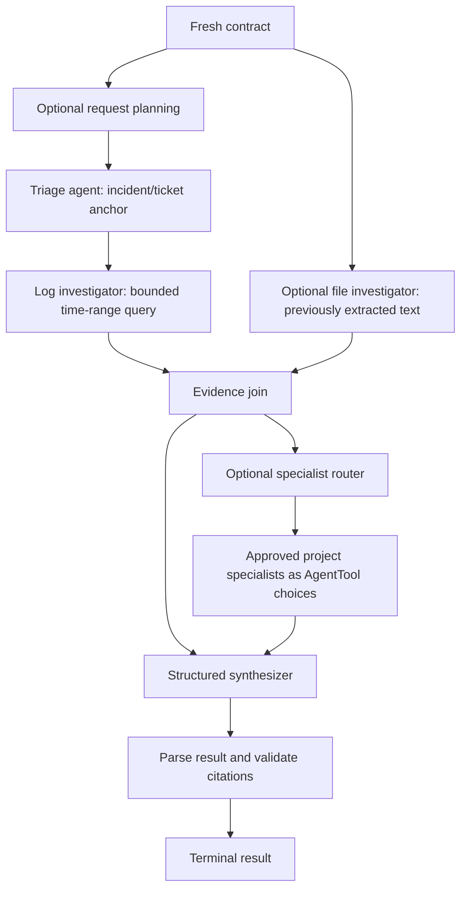

Planning notes and stage notes are untrusted context. The evidence ledger is authoritative. The synthesizer must return the structured result schema and may cite only evidence IDs saved during the same run. A capability or project can disable planning, attachments, parallel evidence or specialists; the server graph remains the authority.

<a id="harness--6-tool-and-connector-lifecycle"></a>
### 6. Tool and connector lifecycle

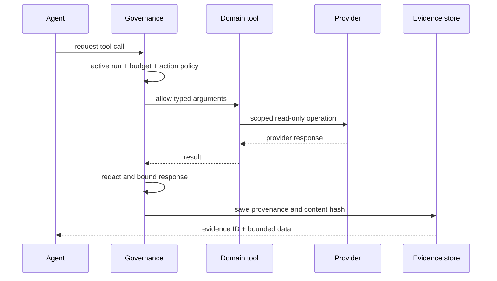

Providers own credentials, timeouts, pooled clients and health probes. Agents never receive a provider client. The current live connector boundary is read-only Jira/ITSM and Splunk/log search; database querying is disabled until its connector is implemented. The action catalog is the allowlist: a YAML action name alone cannot register executable code.

<a id="harness--7-attachment-lifecycle"></a>
### 7. Attachment lifecycle

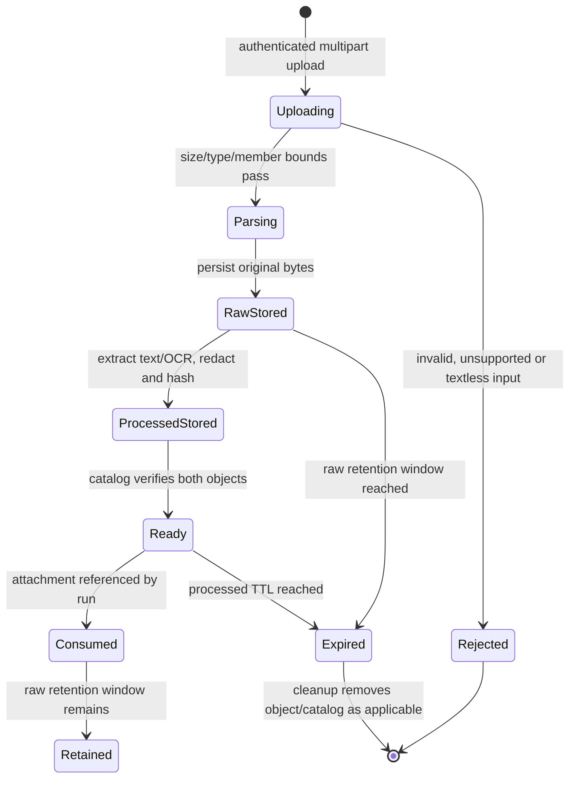

Files are local-only and bounded. Supported extraction includes text/Markdown/logs, JSON, CSV/TSV, DOCX, XLSX, PDF text and image OCR. Images are not sent for visual interpretation. Raw originals and processed text are separate derivatives with separate expiry behavior.

<a id="harness--8-project-agent-approval-lifecycle"></a>
### 8. Project-agent approval lifecycle

Project specialists are submitted as data-only YAML. The definition may reference only existing tool actions and model profiles.

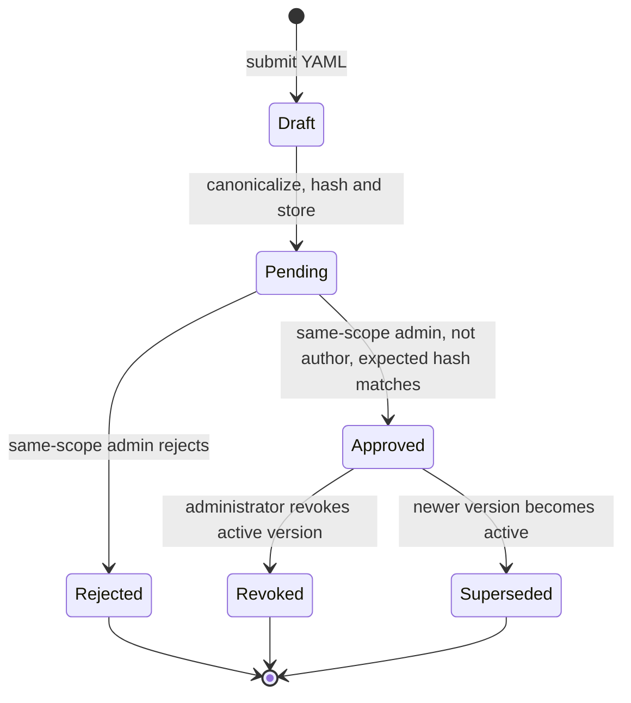

The database review record and active pointer are authoritative. Blob stage folders are synchronized views for operators and audit; manually copying a file into `approved` never activates it. In-flight runs keep their original specialist hashes. New runs discover only the active approved definitions matching the requested capability.

<a id="harness--9-run-lifecycle-and-outcomes"></a>
### 9. Run lifecycle and outcomes

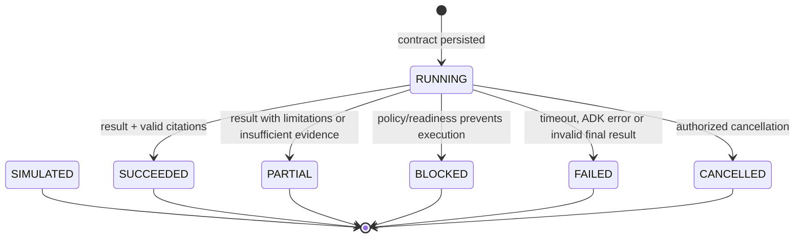

`SIMULATED` is an explicit demo outcome, not a successful diagnosis. Terminal output is saved under the chat's outcome directory when a chat is attached. SSE exposes progress events, while run and evidence endpoints read durable state. A later read marks an abandoned expired run as failed; there is no durable background worker or automatic replay.

<a id="harness--10-evidence-lifecycle"></a>
### 10. Evidence lifecycle

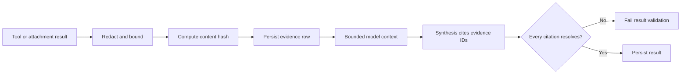

Evidence contains the run, tenant/project scope, source, operation, redacted query/data, observation time and content hash. It is never accepted from a model as authoritative. Findings that cite unknown evidence are rejected.

<a id="harness--11-optimization-lifecycle"></a>
### 11. Optimization lifecycle

```mermaid
stateDiagram-v2
    [*] --> Candidate: submit prompt/skill candidate
    Candidate --> Evaluating: replay fixed benchmark
    Evaluating --> Failed: regression or contract failure
    Evaluating --> Passing: gate passes
    Passing --> PendingApproval: store immutable bundle
    PendingApproval --> Active: administrator approves exact revision
    Active --> Replaced: newer active revision
    Failed --> [*]
    Replaced --> [*]
```

Optimization evaluates candidates in isolation. Approval changes what future runs resolve; it does not mutate an existing run contract. MLflow output is an evaluation/telemetry aid, not a live model-quality guarantee.

<a id="harness--12-operator-lifecycle"></a>
### 12. Operator lifecycle

```mermaid
flowchart TD
    H[GET /health] --> R[Readiness and provider probes]
    R --> T[Telemetry spans and metrics in live mode]
    T --> C[Inspect durable runs/evidence]
    C --> Y[Run sync/repair if blob views drift]
    Y --> X[Run cleanup after retention]
    X --> B[Back up DB, ADK sessions and scoped blobs together]
```

Use `make lint`, `make test`, `make smoke` and `make eval` before handoff. `make eval` checks offline fixture contracts; it is not a live accuracy score. Keep platform content read-only, project artifacts durable, and secrets outside YAML/blob content.

<a id="harness--source-map"></a>
### Source map

| Concern | Primary implementation |
|---|---|
| HTTP and authentication ordering | `app/api/application.py`, `app/identity/auth.py` |
| Startup/shutdown | `app/runtime/bootstrap.py` |
| Run execution and ADK sessions | `app/runtime/runner.py` |
| Graph assembly | `app/agents/root.py` |
| Capability resolution | `app/capabilities/registry.py`, `app/capabilities/resolver.py` |
| Governance and evidence capture | `app/runtime/governance.py` |
| Typed tools | `app/tools/catalog.py`, `app/tools/domain/` |
| Providers | `app/connectors/providers/` |
| Durable records | `app/persistence/` |
| File extraction | `app/inputs/files.py` |
| Project-agent review | `app/configuration/service.py` |
| Declarative content | `blob_local/platform/` |

---

<a id="runtime-context"></a>

<a id="runtime-context--runtime-context-and-tool-lifecycle"></a>
## Runtime context and tool lifecycle

The harness continues to execute through native ADK. It does not add another agent runtime, a recovery worker, or executable extensions.

<a id="runtime-context--project-runtime-isolation"></a>
### Project runtime isolation

After authentication resolves active membership, the [project runtime manager](../../app/runtime/projects.py)
binds the request to that project's settings, registry, runner, stores and artifact
paths. It changes the request's application context, never the shared application's
scope. New contexts materialize their approved database configuration into a
temporary cache; they do not reuse the bootstrap project's connector clients.

Each process caches up to 16 additional project contexts. Active HTTP and streaming
responses retain a lease through their complete response, and running investigations
also prevent eviction. The least recently used idle context is closed when capacity
is needed. If every slot is busy, a new project request receives `429` with a retry
hint. Reloading an evicted context reads its durable configuration again. This
is resource management inside an API process, not durable background recovery.
Source: [streaming and project isolation tests](../../tests/integration/test_projects.py).

<a id="runtime-context--evidence-capacity-and-tool-events"></a>
### Evidence capacity and tool events

[RunGovernance](../../app/runtime/governance.py) reserves evidence capacity before awaiting persistence. Concurrent source branches share the same per-run item limit; failed and cancelled saves release their reservations. Connector requests remain concurrent.

A `tool_completed` event follows successful evidence persistence and includes the recorded evidence ID. Handled connector errors emit a correlated `tool_failed` event, without raw exception text. Run cleanup finalizes outstanding calls as failed or cancelled. Terminal events carry the original call ID and elapsed time. These events depend on the trace database being available; they do not constitute a crash-recovery contract.

<a id="runtime-context--complete-request-budget"></a>
### Complete request budget

[Context projection](../../app/runtime/context.py) checks the serialized character count of ADK contents and generation configuration, including instructions, history, tool declarations, and the response schema. [BoundedModel](../../app/models/bounded.py) applies this check before invoking the model. `max_context_chars` is a character budget, not a provider token estimate or an output-token budget.

The [agent builder](../../app/agents/root.py) uses server-owned placeholders for evidence and attachment context. At the model boundary, the harness fills the available space with deterministically ordered evidence, rotating among sources before expanding excerpts. Evidence IDs and source labels remain attached. The stored evidence is unchanged. Context selection events record selected IDs, omission counts, and truncation; truncated projections make the final assessment partial.

Required instructions, user content, stage notes, and existing tool-call history are never silently cut. If these inputs and the required metadata cannot fit, the run fails with stage `context_limit` before that model invocation. This release uses bounded excerpts, not semantic ranking or model-generated compaction. Extremely small limits can omit all evidence.

<a id="runtime-context--follow-up-context"></a>
### Follow-up context

[The store](../../app/persistence/store.py) selects up to three recently completed runs from the same owner's chat. Historical notes are eligible only when capability identity/hash, policy hash, permitted actions, disabled connectors, environment mappings, and workflow settings match. Runs completed after the new run started are excluded.

The history is bounded to one quarter of the context character limit and contains the prior request, summary, timestamp, status, and run ID. [The runner](../../app/runtime/runner.py) freezes the selected notes into the run snapshot. The full model request still has to satisfy the overall context limit.

Historical notes are untrusted and potentially stale. They help interpret follow-up questions but do not count as newly captured evidence. Findings still require evidence IDs persisted for the current run; prior citations are not imported. Requests to rerun an investigation must retrieve supporting observations again.

<a id="runtime-context--reviewed-project-knowledge"></a>
### Reviewed project knowledge

The [knowledge service](../../app/configuration/knowledge.py) selects independently
approved documents from the authenticated tenant/project using bounded keyword
matching. At most three matching revisions are considered, within the run's
remaining evidence slots and one quarter of its context character budget. The
service verifies each immutable revision before extracting its excerpt.

The runner snapshots document IDs, revision hashes, reviewer metadata and selected
excerpts, then records their evidence IDs before model execution. This selection
is stable for that run. Revocation or editing stops the revision from being
selected by new runs; it does not rewrite completed evidence. The model receives
these documents as untrusted reference guidance, never as a user's instruction
or as proof of the current incident's cause. See [document lifecycle](data-access-and-operations.md#knowledge-and-usage).

<a id="runtime-context--verification"></a>
### Verification

[Runtime regression tests](../../tests/unit/test_runtime_governance.py) exercise real SQLite persistence and native ADK request objects for capacity, tool finalization, context projection, and chat ownership. The existing offline harness and smoke suites exercise native ADK workflows with the repository's test providers. These checks do not measure live model quality.

---

<a id="plugin-architecture"></a>

<a id="plugin-architecture--extension-architecture"></a>
## Extension architecture

Start with [Extend RCA assist with skills](runtime-and-extension-contracts.md#extending-the-framework) for the user and
administrator workflow. Database-backed skill registration, native ADK workflows,
declarative capabilities, approved specialist definitions and the implemented tool
catalog are the extension boundaries. Library bundles group existing resources;
there is no executable plugin installer.

| Extension | Location and enforcement |
|---|---|
| Platform workflow | [ADK graph factory](../../app/agents/root.py), bounded by [run governance](../../app/runtime/governance.py) |
| Project specialist | Data-only [definition schema](../../app/configuration/models.py) and [approval service](../../app/configuration/service.py); only approved definitions become `AgentTool` choices |
| Connector | [Provider registry](../../app/connectors/providers/registry.py); network clients and credentials remain provider-owned |
| Tool | [Action catalog](../../app/tools/catalog.py) and [domain tools](../../app/tools/domain); no writes or database tool are registered |
| Skill | [Catalog API](../../app/api/routes/catalog.py), database-backed registration and [scoped instruction/action resolution](../../app/configuration/layers.py) |
| Capability | [YAML manifests](../../blob_local/platform/capabilities) and [scoped resolution](../../app/capabilities/resolver.py) |
| Configuration | [Platform/project/user layers](runtime-and-extension-contracts.md#architecture--configuration-ownership-and-inheritance); delegated fields only |

Registration never grants permission. New connectors require reviewed provider code, typed domain tools and explicit capability permissions. Adding a YAML name cannot import executable code or add a network client. The [development ADK folder](../../agents/rca_analyzer/agent.py) remains inert; live investigation assembly starts at the authenticated API.

---

<a id="extending-the-framework"></a>

<a id="extending-the-framework--extend-rca-assist-with-skills"></a>
## Extend RCA assist with skills

RCA assist helps a team investigate incidents using approved evidence sources. A **skill**
is reusable guidance for an investigation: what to check, which existing tools to
use, and how to explain the result. A **capability** is the type of work a user can
start, such as reviewing a ticket or correlating logs. Adding a skill to a capability
changes the guidance used by its next investigations.

Skills can extend analysis over tools the platform already supports. Connecting a
new external system requires an implemented provider, typed tool and permission
contract. Skill text cannot create those integrations or grant more access.
Sources: [capability resolution](../../app/capabilities/resolver.py),
[agent assembly](../../app/agents/root.py), [tool inventory](../../app/tools/catalog.py).

<a id="extending-the-framework--start-here"></a>
### Start here

Open `/` for the product introduction, then choose **Open workspace**. The workspace
entry at `/workspace` uses the authenticated account's last active project selection. Project
pages use `/p/<project_key>/<page>`; administration pages use `/admins/<page>`.
The older `/admin` route remains an alias. Navigation does not grant access:
the API checks active membership and roles in the selected project for each operation.
Sources: [application routes](../../frontend/src/App.tsx),
[authentication](../../app/identity/auth.py), [API dependencies](../../app/api/dependencies.py).

Use the project menu to switch between assigned workspaces. Platform administrators
can create a project; other team members can request access or a different role
for independent review. See [project workspaces](data-access-and-operations.md#project-workspaces) for the
creation, membership and isolation contract.

| Your task | Where to work | What happens |
|---|---|---|
| Investigate an incident | Project workspace | Submit a question and optional local files, then inspect the answer, evidence and progress. |
| Add reusable investigation guidance | Skills, as a platform administrator | Create a skill and select the existing capabilities that should use it. |
| Tailor guidance for your project | Skills, as an authorized project owner | Edit a delegated skill's instructions or reduce its tools; restore inheritance when needed. |
| Select shared resources | Harness Library | Include or exclude inherited bundles, skills, capabilities and specialist templates. |
| Add a specialist agent | Agents | Submit a data-only definition for a different authorized administrator to review. |
| Change an investigation workflow | Harness Studio | Validate a source bundle, save a draft and use the review lifecycle before activation. |

These screens call the [catalog API](../../app/api/routes/catalog.py),
[library API](../../app/api/routes/harness.py),
[agent API](../../app/api/routes/agents.py) and
[workspace API](../../app/api/routes/harness_workspace.py).

<a id="extending-the-framework--create-a-skill"></a>
### Create a skill

1. Open **Skills** as a platform administrator and choose **Add skill**.
2. Give it a clear name and description. Explain when someone should use it.
3. Write the investigation steps in plain language. Require evidence references,
   distinguish observations from hypotheses, and state what to do when information
   is missing.
4. Select the capabilities that should include this guidance. Select only existing
   actions needed by the skill; every action must already be permitted by each
   selected capability.
5. Submit the skill for review. New managed skills are immutable at project scope;
   their `project_override` value must be `false`.
6. A different platform administrator in the author's project reviews the exact
   content hash and approves or rejects it. Only approved skills join capability
   execution. Administrators can revoke an approved skill for future runs.
7. Run a relevant investigation and inspect the recorded evidence and limitations.
   Saving instructions is not a live quality evaluation.

The authenticated create API is `POST /api/v1/skills`, with `id`, `name`,
`description`, `instruction`, `capabilities`, `actions`, and `project_override`.
The server validates the submitted values and resolves tenant and permissions from
the account. It stores new skill registrations in `platform.system_configurations`
with `config_type="skill"` and records the change in `governance.parameter_audit`;
no database rebuild is needed. Other API workers load the updated catalog at their
next authenticated request boundary. Creation adds a new skill; it does not
overwrite an existing ID. See the [catalog API](../../app/api/routes/catalog.py),
[skill persistence and refresh](../../app/configuration/skill_catalog.py)
and [system configuration table](../../app/configuration/parameters.py).

The create endpoint returns `201` with the `PENDING` skill. A duplicate ID returns
`409`; invalid capability/action selections return `422`; unauthorized callers
receive `403`. Platform registrations are currently creation-only through this
API: revising a managed skill means creating a new ID for review, then revoking the
older skill when appropriate. Review uses `POST /api/v1/skills/{id}/{approve|reject|revoke}`
with `expected_hash` and a reason. Rejected and revoked records remain visible for
audit. Project reset removes a shipped delegated skill's customization, not the shared skill.
Source: [skill endpoints](../../app/api/routes/catalog.py).

Project customization uses the existing `POST /api/v1/skills/{skill_id}` endpoint.
It can change delegated instructions, disable a skill, or narrow its existing
actions. It cannot expand capability permissions. The Skills screen also supports
restoring the platform version. Edits and resets send the current `effective_hash`
as `expected_hash`; an intervening change returns `409` so the editor can reload.
A skill saved with `project_override=false` is immutable for lower scopes.
See [inheritance rules](configuration-and-review-contracts.md#skill-inheritance) and
[the editor](../../frontend/src/pages/Skills.tsx).

Save responses report content validation separately from model execution and
quality evaluation. `NOT_RUN` means no model evaluation took place; it is not a
passing accuracy score. Use the separate [optimization workflow](configuration-and-review-contracts.md#optimization)
for benchmark comparisons. Source: [skill save response](../../app/api/routes/catalog.py).

<a id="extending-the-framework--what-makes-useful-instructions"></a>
#### What makes useful instructions?

Describe the decision the skill helps with, the evidence needed to make it, and the
form of the answer. For example, payment-timeout guidance might ask the investigator
to align timestamps, compare affected components, cite the captured observations,
and separate a probable cause from an untested explanation. It can use a ticket or
log action only when the selected capability already permits it.

Keep credentials and executable code out of skill text. Instructions inside
uploaded documents, tickets and logs remain evidence content; they do not become
the user's request or an administrator instruction. The runtime applies this
boundary independently of editable skills in [agent assembly](../../app/agents/root.py)
and [tool governance](../../app/runtime/governance.py).

<a id="extending-the-framework--how-a-skill-reaches-an-investigation"></a>
### How a skill reaches an investigation

```mermaid
flowchart TD
    ADMIN[Administrator submits a skill] --> REVIEW[Different administrator reviews the exact revision]
    REVIEW --> SAVE[(Approved database registration)]
    BASE[Shipped baseline templates] --> LOAD[Load the available catalog]
    SAVE --> LOAD
    LOAD --> CAP[Select the requested capability]
    PROJECT[Delegated project and user settings] --> RESOLVE[Resolve instructions and permitted actions]
    CAP --> RESOLVE
    RESOLVE --> SNAP[Save the run's configuration snapshot]
    SNAP --> ADK[Build native ADK workflow]
    ADK --> TOOLS[Read approved evidence sources]
    TOOLS --> RESULT[Answer with recorded evidence references]
```

The platform defines the access ceiling; delegated project and user settings can
tailor instructions and narrow access. Selected skill text is supplied to the
native agent stages. The run snapshots its configuration so an administrator edit
does not rewrite an investigation already underway. A skill does not create a new
agent process. Sources: [registry](../../app/capabilities/registry.py),
[layer resolver](../../app/configuration/layers.py),
[run snapshots](../../app/runtime/runner.py), [ADK assembly](../../app/agents/root.py).

Durable configuration uses database records and versioned bundles. Repository
YAML/Markdown supplies baseline templates; database-configured deployments
materialize their active bundle into a temporary directory for the existing
validators. That directory is a generated cache. Do not edit it or treat it as a
second configuration source. Parameter resolution uses the explicit project,
instance and environment precedence documented in
[the parameter implementation](../../app/configuration/parameters.py).
See [database operations](data-access-and-operations.md#database) for the existing template publication and
restart workflow.

<a id="extending-the-framework--choose-the-right-extension"></a>
### Choose the right extension

| Extension | Changes | Activation |
|---|---|---|
| Skill | Guidance and allowed use of existing tools | Independent administrator approval; shipped delegated project customizations retain their existing editor workflow |
| Project knowledge | Reference documents used as cited context | Draft, submit, independent review, approve; revisions return to draft and revocation stops future selection |
| Library bundle | Selection of existing skills, capabilities and specialist templates | Saved project selection; inclusion alone does not approve a specialist |
| Specialist agent | A focused agent for an existing capability and tools | A different scoped administrator approves the exact submitted content hash |
| Harness bundle | A validated arrangement of supported workflow components | Draft, validation and independent review |
| Provider and tool | Access to a supported external operation | Reviewed application implementation, configuration, scope checks and deployment validation |

See [specialist lifecycle](configuration-and-review-contracts.md#skill-lifecycle), [Harness Studio](runtime-and-extension-contracts.md#harness-studio)
and [connector onboarding](connector-specifications.md#connector-onboarding). A library bundle is a data
collection; it does not install packages, scripts or network clients.

For document uploads and governed usage prices, see [Knowledge and measured usage](data-access-and-operations.md#knowledge-and-usage).
For company sign-in, see [Browser sign-in](data-access-and-operations.md#browser-sign-in).

<a id="extending-the-framework--adk-feature-map"></a>
### ADK feature map

The reference diagram describes features of ADK as a toolkit. This table describes
what RCA assist actually exposes. The dependency is pinned in
[pyproject.toml](../../pyproject.toml); upstream examples do not automatically become
available product features.

| ADK area | RCA assist behavior and implementation |
|---|---|
| Agents | Native `LlmAgent` stages and eligible approved `AgentTool` specialists: [agent factory](../../app/agents/root.py). |
| Tools | Typed read-only tools filtered by capability and checked for every invocation: [catalog](../../app/tools/catalog.py), [governance](../../app/runtime/governance.py). |
| Orchestration | Native `Workflow` graphs with conditional branches and `JoinNode` for included parallel evidence: [compiler](../../app/configuration/workflow.py). |
| Callbacks | Budgets, evidence capture, redaction and stage/tool observations: [governance](../../app/runtime/governance.py). |
| Session management | Native ADK sessions and events plus application run records: [session persistence](../../app/persistence/database.py), [runner](../../app/runtime/runner.py). |
| Artifact management | Owned uploads, generated outputs and previews backed by application storage: [artifact catalog](../../app/persistence/chat_artifacts.py). |
| Memory | Bounded notes from eligible prior runs in the same owned chat, plus keyword-selected approved project references: [context guide](runtime-and-extension-contracts.md#runtime-context), [knowledge retrieval](../../app/configuration/knowledge.py). References describe guidance; current findings require current incident observations. No general semantic memory service is implied. |
| Planning | Optional structured request planning inside the governed workflow: [orchestrator](../../app/agents/orchestrator.py). |
| Evaluation | Offline contract checks and a separate reviewed benchmark comparison workflow: [evaluation command](../../scripts/eval.py), [optimization guide](configuration-and-review-contracts.md#optimization). |
| Debugging and trace | Persisted run graph, stage/tool events and measured model counters/durations with coverage-aware cost estimates: [run events](../../app/persistence/run_events.py), [usage analytics](../../app/persistence/telemetry.py), [optional operational telemetry](../../app/observability/otel.py). |
| Models | Configured stage profiles and shared call/context budgets: [profiles](../../app/models/profiles.py), [bounded model](../../app/models/bounded.py). |
| Streaming | Server-sent progress events from recorded run state: [run routes](../../app/api/routes/runs.py). This does not provide bidirectional audio/video or raw token streaming. |
| Code execution | Uploaded code and skill scripts are not executed: [bundle validation](../../app/configuration/harness_bundles.py), [file processing](../../app/inputs/files.py). |
| Deployment | FastAPI deployment with database and blob persistence; execution remains request-bound with no durable recovery worker: [bootstrap](../../app/runtime/bootstrap.py), [operations](data-access-and-operations.md#operations). |

<a id="extending-the-framework--official-examples-informing-the-design"></a>
#### Official examples informing the design

The requested [pinned sample directory](https://github.com/google/adk-python/tree/2e6ec4aad50ca4ebe60e9931f26f7ea7e466f17f/contributing/samples)
could not be retrieved during this review. The following are readable official
upstream references; they are moving documentation, not verified contents of that
commit.

- [ADK Skills](https://google.github.io/adk-docs/skills/) describes experimental
  `SkillToolset` support for discovering metadata, then loading instructions and
  resources as needed. RCA assist currently resolves skill text before native agent
  assembly; it does not expose upstream script execution.
- [Skills sample](https://github.com/google/adk-python/blob/main/contributing/samples/environment_and_skills/skills/README.md)
  demonstrates programmatic and directory-loaded skills plus activation of
  existing additional tools. The useful design principle here is explicit skill
  metadata with registered tool bindings. Its executable-script example is outside
  this application's extension contract.
- [Workflow triage sample](https://github.com/google/adk-python/blob/main/contributing/samples/patterns/workflow_triage/README.md)
  separates request selection, coordinated execution and specialist workers.
  RCA assist retains its own authenticated capability resolution and approved specialist
  selection around the native workflow.
- [Agents in Workflow sample](https://github.com/google/adk-python/blob/main/contributing/samples/workflows/agent_in_workflow/README.md)
  illustrates typed agent outputs and routing between stages. Sample fixtures are
  demonstrations; they are not live evidence integrations.
- [Session state sample](https://github.com/google/adk-python/blob/main/contributing/samples/context_management/session_state_agent/README.md)
  illustrates state flowing through callbacks and session events. RCA assist retains
  native event persistence alongside its own immutable run and evidence records.

<a id="extending-the-framework--what-still-needs-deployment-validation"></a>
### What still needs deployment validation

Live operation requires configured model credentials, authorized connector access,
trusted JWT settings, and tested database/blob persistence. A catalog entry or a
saved skill is not proof that its external source is reachable. Demo mode is
simulated. Offline instruction checks establish content properties, not model
accuracy or causal correctness. See [readiness](../../app/api/application.py),
[connector health](../../app/connectors/health.py) and [operations](data-access-and-operations.md#operations).

Autonomous retraining, scheduled knowledge refresh, general semantic memory,
bidirectional streaming and automatic recovery after a process interruption are
not delivered by registering a skill. These require separate runtime and operating
contracts. The implemented improvement path is the explicit
[evaluate, review and activate workflow](configuration-and-review-contracts.md#optimization).

---

<a id="harness-configuration-backend"></a>

<a id="harness-configuration-backend--harness-linked-backend-configuration"></a>
## Harness-linked backend configuration

Frontend integration recommendations in this document are not frontend changes.

<a id="harness-configuration-backend--sources-and-consumers"></a>
### Sources and consumers

| Configuration | Authoritative source | Backend consumer and inspection |
| --- | --- | --- |
| Runtime parameters | SQLAlchemy parameter definitions and permitted project overrides | [Parameter API](../../app/api/routes/parameters.py), [execution runner](../../app/runtime/runner.py), and [Harness workspace](../../app/configuration/harness_workspace.py) |
| Connector contracts | Published, versioned connector catalog | [Catalog resolver](../../app/configuration/connector_catalog.py), [connector API](../../app/api/routes/connectors_api.py), and [runner provider resolution](../../app/runtime/runner.py) |
| Shared connector values | Parameter definitions; permitted project and instance overrides | [Parameter resolution](../../app/configuration/parameters.py) feeds supported provider controls at run preparation |
| Managed project templates | Tenant-scoped `platform.project_templates` records | [Template API](../../app/api/routes/project_templates.py) applies delegated sections and Harness selection to the authenticated project; provenance is persisted in that same project document |
| Agent model stages and limits | `config/model_profiles.yaml` in the active platform configuration | [Model profiles](../../app/models/profiles.py), [native agent assembly](../../app/agents/root.py), and [Harness compilation](../../app/configuration/harness_workspace.py) |
| Attachment parsing limits | `config/file_processing.yaml` in the active platform configuration | [Configuration editor](../../app/api/routes/platform_configuration.py) updates upload parsing and Harness attachment context together |
| Capabilities and permissions | Declarative capability YAML and server-controlled policy | [Capability resolver](../../app/capabilities/resolver.py) determines which configuration and tools an agent may use |
| Harness workflow and specialist definitions | Approved, content-addressed bundles and agent definitions | [Workspace activation](../../app/configuration/harness_workspace.py) and [agent approval](../../app/configuration/service.py) feed native ADK execution |

Model stages and capabilities retain their existing declarative sources instead of introducing competing parameter-table copies. Authentication identity, connector authorization scope, credentials, and approval rules remain server-controlled.

<a id="harness-configuration-backend--model-and-attachment-synchronization"></a>
### Model and attachment synchronization

[Project setup](../../app/api/routes/catalog.py) now derives stage definitions from the builtin mapping used by Harness and native agents. Each stage returns its agent IDs, configured capability/model-profile bindings, model settings, source, and content hash. A binding is explicitly labeled `capability_default`; its `harness_workspace_api` points to the capability workspace where approved workflow overrides can be inspected. Clients must not treat a capability default as an override of an approved Harness bundle.

Saving attachment limits updates the platform reference held by Harness as well as the upload and execution services. The [regression check](../../tests/unit/test_platform_configuration.py) saves attachment and model limits through authenticated APIs and verifies the resulting project setup and Harness responses.

<a id="harness-configuration-backend--managed-project-templates"></a>
### Managed project templates

The [template store](../../app/configuration/project_templates.py) stores named, versioned templates with a checksum, optimistic revision, lifecycle status, actor, and timestamp. Template definitions must explicitly include `harness`, pass the existing project-policy validation, and exclude identity, connector scope, and provenance. Parameter values remain in the existing parameter tables rather than being duplicated inside project templates.

- `GET /api/v1/project-templates`: list templates; project readers see published versions.
- `PUT /api/v1/project-templates/{id}/{version}`: platform administrator creates or edits a draft, publishes it, or deprecates a version, using `expected_revision`. Published content is immutable; changes require a new version.
- `GET /api/v1/project-templates/binding`: obtain current project and Harness revisions plus the applied template's synchronization state.
- `POST /api/v1/project-templates/{id}/{version}/apply`: a project owner or platform administrator applies a published version using its revision/checksum and the current project/Harness revisions.

Apply works for initial setup and updates within the deployment's authenticated scope. It replaces only explicitly supplied sections, preserves other sections and parameter-table overrides, and persists server-owned provenance with the resulting project configuration. Applying a newer version is explicit; template publication does not silently rewrite existing projects. Provision project identity and membership through deployment setup before applying a template. This API does not create a different tenant or project from a request body.

Project setup and Harness return the applied version and synchronization state. Ordinary project edits preserve provenance and can cause `DRIFTED`; a changed Harness catalog produces `HARNESS_CHANGED`. Deprecating a project template prevents new application while existing projects retain their previously applied configuration. The [run snapshot](../../app/runtime/runner.py) captures applied template provenance, active runtime controls, and supported nonsecret provider controls with the workflow used by the agents.

PostgreSQL deployments require [migration 018](../../migrations/history/018_project_templates.sql) before startup. SQLite initializes the table through the existing SQLAlchemy startup path. [Integration coverage](../../tests/integration/test_project_templates.py) checks authorization, application, update conflicts, restart persistence, native ADK execution, source provenance, and shared provider controls.

<a id="harness-configuration-backend--connector-activation"></a>
### Connector activation

[Catalog resolution](../../app/configuration/connector_catalog.py) honors persisted lifecycle state at startup and publication. The tools, template, project-setup, parameter, and Harness APIs resolve this catalog. Shared operational controls feed newly constructed deployed native clients for subsequent runs; existing clients are not mutated. Explicitly injected providers remain owned by their caller. Connection identity defaults do not retarget clients until explicitly edited. Per-project instance resolution retains its scope, credential, environment, and availability checks.

The tools response reports unavailable usage metrics as `null`, rather than inventing zero calls or a zero error rate. Declared queries and attachment-processing controls without an implemented execution consumer remain explicitly identified in Harness; this work does not add scheduled polling or remote attachment downloads.

<a id="harness-configuration-backend--frontend-recommendations-only"></a>
### Frontend recommendations only

1. Read values and permissions from the backend endpoints above. Use returned field contracts, choices, bounds, revisions, and hashes instead of independent frontend defaults.
2. Show the source and effective value separately. Keep inherited values, permitted overrides, locked fields, inactive drafts, and restart-pending settings distinct.
3. Link configuration details to the relevant Harness workspace and display its agent, tool, model, and connector dependencies. Use the capability-specific workspace for effective workflow overrides.
4. Save with the endpoint's revision/hash guard. Preserve unsaved input on validation or conflict responses; reload affected parameter, template, project setup, and Harness queries after success.
   For project setup, select a published managed template and use its apply endpoint for both initial setup and explicit version updates. Display drift and the applied version from the binding response.
5. Use actual backend availability and probe results. A stored contract or query is not proof that a provider, scheduler, or agent operation is implemented or enabled.

The [Harness workspace projection](../../app/configuration/harness_workspace.py) adds connector-template and parameter nodes to the dependency graph. Parameter details include source revisions, template references, permitted instance provenance, and consumer links. Treat configuration relationships separately from supported runtime bindings: a field with a declared but unimplemented binding is visible for inspection, not advertised as an executing agent control. Secret and hidden values must not be rendered from this projection.

There is no new frontend implementation in this work. Existing workspace frontend changes from before this task are preserved.

---

<a id="harness-studio"></a>

<a id="harness-studio--harness-studio-source-workspace"></a>
## Harness Studio source workspace

Harness Studio edits a capability-scoped, data-only source bundle. The API
validates and compiles YAML/JSON sources into the governed RCA workflow; it
does not load uploaded Python or execute arbitrary code. Python files may be
retained as inert source for portability, but they produce a warning and are
never part of runtime execution. The source of this contract is the
[bundle model and compiler](../../app/configuration/harness_bundles.py), with
revision and review persistence in the
[workspace service](../../app/configuration/harness_workspace.py).

The workspace API is scoped from the authenticated tenant and project. The
caller supplies only a capability ID; roles, tenant, project, connector
scope, and approval state are resolved server-side.

| Operation | Endpoint | Effect |
| --- | --- | --- |
| Load workspace | `GET /api/v1/harness/workspace?capability=...` | Reads the active bundle, or the platform default when no approved draft exists |
| Validate | `POST /api/v1/harness/validate` | Validates `{files, capability}` without persisting a draft |
| Save draft | `PUT /api/v1/harness/draft` | Saves `{files, capability, expected_revision, draft_id?}` as a draft with optimistic concurrency |
| Import | `POST /api/v1/harness/import` | Reads a UTF-8 source file or ZIP multipart upload and saves a draft |
| Export | `GET /api/v1/harness/export?capability=...&draft_id=...` | Downloads a ZIP source archive; `draft_id` is optional |
| Review | `POST /api/v1/harness/drafts/{draft_id}/{submit,approve,reject,revoke}` | Applies the two-person review lifecycle with `expected_revision` and a reason |

The route implementation is in the [Harness API router](../../app/api/routes/harness_workspace.py),
and the browser client mirrors these operations in
[`harnessApi.ts`](../../frontend/src/features/harness-studio/harnessApi.ts).

<a id="harness-studio--bundle-limits"></a>
### Bundle limits

The service accepts at most 100 files, 64 KiB per file, and 512 KiB of total
source. Paths must be normalized relative POSIX paths. Hidden files,
credential-named files, PEM/key/P12 files, symlinks, encrypted ZIP entries,
duplicate paths, and invalid UTF-8 are rejected. The limits and path checks
are defined in [harness_bundles.py](../../app/configuration/harness_bundles.py).
Harness endpoints have a 1 MiB transport ceiling for JSON escaping and multipart
overhead in [application.py](../../app/api/application.py); decoded source still obeys
the tighter bundle limits. Authentication runs before either body is parsed.

<a id="harness-studio--cli"></a>
### CLI

The authenticated CLI uses `RCA_API_URL` (default `http://127.0.0.1:8000`)
and reads a bearer token from `RCA_API_TOKEN` (with `RCA_TOKEN` accepted for
compatibility). It never prints the token or uploaded file contents. The
implementation is [scripts/harness_config.py](../../scripts/harness_config.py).

```sh
export RCA_API_URL=http://127.0.0.1:8000
export RCA_API_TOKEN='…'

uv run python -m scripts.harness_config validate ./harness --capability incident_triage
uv run python -m scripts.harness_config import ./harness.zip --capability incident_triage
uv run python -m scripts.harness_config diff ./harness --capability incident_triage
uv run python -m scripts.harness_config export --capability incident_triage --output incident_triage.zip
```

`validate` is read-only. `import` creates a draft and does not submit or
approve it. `diff` exits with status 1 when source differs, which makes it
usable in review scripts. The corresponding Make targets are
`config-validate`, `config-import`, `config-diff`, and `config-export`.

<a id="harness-studio--frontend-contract-generation"></a>
### Frontend contract generation

The [type generator](../../scripts/generate_harness_types.py) consumes a local
JSON Schema or discovers the `Workspace` response component from the API's
OpenAPI document. It writes
[`workspace.generated.ts`](../../frontend/src/features/harness-studio/types/workspace.generated.ts),
which is generated output and should not be edited by hand.

```sh
# Fetch the running API's Pydantic/OpenAPI contract.
make harness-types

# Or use a checked-in/exported OpenAPI JSON document.
make harness-types HARNESS_SCHEMA=/path/to/openapi.json
```

The generator has no code-generation dependency and does not import or
execute workspace source files. Changes to the Pydantic `Workspace` response
are reflected by regenerating this file against the same API revision.

<a id="harness-studio--deployment-and-historical-records"></a>
### Deployment and historical records

Apply the versioned migrations before starting PostgreSQL deployments. The
[harness migration](../../migrations/history/007_harness_workspace.sql) adds bundle activation
and trace records; the [revision-source migration](../../migrations/history/009_harness_revision_sources.sql)
records immutable source hashes for new audit entries. Older entries have no
recoverable source hash and remain explicitly unknown. New SQLite databases
create these tables at initialization.

A run snapshots the approved source hash and exact post-preflight graph before
native execution. Default attachment branches are conditional on the request;
explicit custom DAGs requiring attachments reject a request without them.
Revocation disables the active override for subsequent runs, restoring the
platform workflow; already-started runs retain their immutable snapshot.
Agent and tool durations come from actual lifecycle observations, and missing
historical traces are reported as unavailable. These behaviors are implemented
by [the runner](../../app/runtime/runner.py), [workflow compiler](../../app/configuration/workflow.py),
and [workspace service](../../app/configuration/harness_workspace.py).

`scripts.sync_artifacts` checks active approved bundle integrity and rebuilds
exports in memory with `--apply`; archives remain derived on demand by the API,
with no separate export cache to drift. Existing chat and framework artifact
synchronization behavior is preserved.

<a id="harness-studio--component-inventory-and-canvas"></a>
### Component inventory and canvas

The [workspace catalog](../../app/configuration/harness_catalog.py) projects effective
backend configuration into Studio categories, including session context, attachment
limits, optimization gates, and governance. Source-backed bundle items can be
edited through YAML and reviewed; platform-controlled entries expose effective
values and their implementation/configuration source as read-only. The catalog
does not provision new connectors or implement long-term memory.

The canvas starts with the main workflow. Selecting a group reveals its internal
components; selecting an agent reveals its configuration relationships. Execution
traces use the persisted run graph, so an edited draft never changes an old trace.
