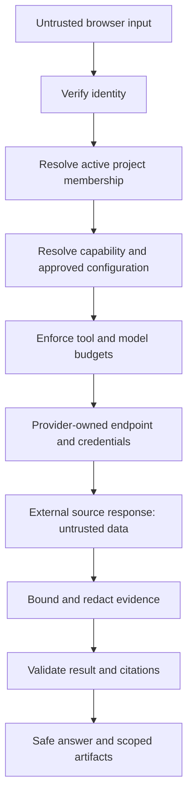

# Security boundaries and access flows

This handbook describes implementation boundaries and known gaps, not a security certification. The application permits writes to its own configuration, review and investigation records through authorized APIs; external connector operations remain read-only. See [architecture](architecture.md), [connector controls](connectors.md) and [table reference](data-model.md).

## Contents

- [Trust-boundary flow](#trust-boundary-flow)
- [Request authorization](#request-authorization)
- [Roles and project membership](#roles-and-project-membership)
- [Browser sign-in lifecycle](#browser-sign-in-lifecycle)
- [Independent review and stale writes](#independent-review-and-stale-writes)
- [Connector security boundary](#connector-security-boundary)
- [Files and untrusted content](#files-and-untrusted-content)
- [Database and storage access](#database-and-storage-access)
- [Redaction and observability](#redaction-and-observability)
- [Known security and implementation limits](#known-security-and-implementation-limits)

## Trust-boundary flow

Reading path: [authenticate](#request-authorization) → [authorize](#roles-and-project-membership) → [review](#independent-review-and-stale-writes) → [provider](#connector-security-boundary) → [safe data](#files-and-untrusted-content).

## Request authorization

For bearer authentication, the service requires a bounded token and verifies RS256 with the configured RSA public key, issuer and audience. Required claims include `exp`, `iat`, `iss`, `aud` and `sub`. The verified subject is then resolved into server-owned membership; request-provided role claims are not used as project authorization.

For browser authentication, the server resolves the `__Host-rca_session` cookie through the OIDC session service. Non-read requests require the session's CSRF/origin checks. If a bearer header is present it selects the bearer path; the session cookie does not silently override that header. Protected uploads/runs depend on authenticated principal resolution before work begins. Source: [authentication dependency](../app/identity/auth.py).

A deployment has one tenant. `RCA_PROJECT_ID` identifies the bootstrap project; `X-RCA-Project` only selects a project. The server rejects invalid selectors and verifies access to the selected project. Project runtime binding supplies project-owned settings, stores and provider context; it does not mutate another project's scope. Sources: [project service](../app/configuration/projects.py), [runtime binding](../app/runtime/projects.py).

## Roles and project membership

The built-in role vocabulary is `PLATFORM_ADMIN`, `PROJECT_OWNER`, `PROJECT_MANAGER`, `PROJECT_ANALYST`, `PROJECT_VIEWER` and `GENERIC_USER`. The exact allowed operation is defined by each endpoint/service and capability policy, not just by whether a menu item is visible.

| Boundary | Intended/current governed path |
| --- | --- |
| Create a project | Authorized project-creation service; project key accepted only there |
| Select a project | Active server-side membership; roles resolved afresh |
| Edit project setup | Project owner/platform administrator checks plus delegated-section validation |
| Change endpoint/authentication routing | Platform authority; project forms select authorized bindings |
| Launch/cancel investigation | Endpoint role/capability checks and runtime scope enforcement |
| Read chat originals | Authenticated chat owner; administrator status does not automatically grant another user's chat originals |
| Review content/access | Applicable authorized independent reviewer and exact revision/hash |
| Inspect all project records | Use the specific API's scope/role contract; ownership rules differ by resource |

A generic principal does not gain project rights by entering a project URL. Browser selection does not rebind the identity provider approval or accept provider role claims as project authority. Sources: [roles](../app/identity/principals.py), [authentication](../app/identity/auth.py), [project-access review](../app/configuration/project_access.py), [chat downloads](../app/api/routes/chats.py), [run API](../app/api/routes/runs.py).

## Browser sign-in lifecycle

```mermaid
flowchart LR
  CFG[Independently approved OIDC configuration] --> START[Start sign-in]
  START --> STATE[One-use browser-bound state and PKCE]
  STATE --> IDP[Identity provider authorization]
  IDP --> CALLBACK[Validate callback and signed identity]
  CALLBACK --> MEMBER[Resolve subject membership]
  MEMBER --> SESSION[Secure HttpOnly local session]
  SESSION --> REQUEST[CSRF and fresh membership checks]
  SESSION --> END[Logout, expiry or revocation]
  click CFG "configuration.md#workflow-configure-company-sign-in" "Configuration review"
  click START "security.md#browser-sign-in-lifecycle" "Sign-in lifecycle"
  click STATE "data-model.md#runtime-application-tables" "Login transactions"
  click IDP "configuration.md#workflow-configure-company-sign-in" "Provider configuration"
  click CALLBACK "security.md#request-authorization" "Identity checks"
  click MEMBER "security.md#roles-and-project-membership" "Membership checks"
  click SESSION "data-model.md#runtime-application-tables" "Browser sessions"
  click REQUEST "security.md#request-authorization" "Request checks"
  click END "operations.md#authentication-and-project-connections" "Operator setup"
```

Reading path: [configure](configuration.md#workflow-configure-company-sign-in) → [identity checks](#request-authorization) → [membership](#roles-and-project-membership) → [session records](data-model.md#runtime-application-tables).

The service checks issuer, client audience, authorized party where required, signature, expiry and nonce. Code exchange uses PKCE and one-use state. The bounded local session expires without silent refresh-token renewal. Logout invalidates the local session; it is not a claim of identity-provider global logout. Reverse proxies must be configured not to retain authorization-code callback query strings in access logs. Sources: [OIDC service](../app/configuration/oidc.py), [OIDC provider](../app/connectors/providers/oidc.py), [authentication routes](../app/api/routes/authentication.py).

## Independent review and stale writes

Reviewable agent definitions, harness bundles, managed knowledge, OIDC configuration and model pricing have specific lifecycle services. Each service verifies scope and the content/revision being reviewed. Independent approval prevents the author from approving their own change where that lifecycle requires it.

Expected hashes/revisions protect against approving or overwriting a different version than the one inspected. A conflict requires reloading and reviewing the new state; it is not an invitation to retry without a token. Revocation excludes content from future eligible selection; historical run snapshots remain historical evidence. Draft editing, submitting, approving and activating are different operations even when a UI groups them together.

Not every administrator setting uses independent review. Ordinary revision-checked edits must be described by their own endpoint contract instead of claiming a universal four-eyes workflow. Sources: [agent service](../app/configuration/service.py), [harness lifecycle](../app/configuration/harness_workspace.py), [knowledge](../app/configuration/knowledge.py), [OIDC](../app/configuration/oidc.py), [pricing](../app/configuration/model_pricing.py).

## Connector security boundary

| Control | Enforcement and limitation |
| --- | --- |
| Credential references | Provider resolves validated authorized references; actual secret values stay server-side |
| Endpoint host | Resolver applies deployment host policy; supported HTTPS/SSH/Kafka validation is adapter-specific |
| Resource scope | Saved binding supplies project/index/namespace/topic/path; narrowing filters cannot retarget protected fields |
| Authentication profile | Native resolver accepts implemented profiles, not every profile listed in a historical design |
| Tool action | Canonical action must belong to the capability and provider must be usable |
| Response budget | Provider enforces response/result/window/time limits; governance applies evidence limits |
| SSH identity | Unix provider requires known-host verification and supported credential references |
| MCP route | Exact governed operation mapping and resource scope; handshake is not authorization |
| Source writes | Unsupported, including Jira mutations, arbitrary SQL and shell execution |

Sources: [provider resolution](../app/connectors/providers/registry.py), [field governance](../app/configuration/connector_governance.py), [REST clients](../app/connectors/providers/evidence.py), [infrastructure clients](../app/connectors/providers/infrastructure.py), [tool governance](../app/runtime/governance.py).

Some providers retain deployment-environment configuration paths. This does not justify assuming every catalog entry already has instance-bound credentials in a target deployment. Verify the actual resolved path and deployment adapter activation requirements in the [connector handbook](connectors.md#runtime-resolution).

## Files and untrusted content

Accepted attachments are local uploads processed under configured count, byte, text, page, row/cell and parser-time limits. Parsing uses bounded concurrency and deadlines. Image support is OCR text only; the system does not reason over visual objects/charts. Spreadsheet formulas/macros and uploaded code are not executed, and arbitrary document URLs are not fetched.

Source prose, attachments, project knowledge, user messages and model output are untrusted content. None can change server roles, expand connector actions, select arbitrary credentials or override resource scope. Final model output must satisfy a structured schema and reference evidence IDs captured for that run. Schema/citation checks do not prove the semantic truth of a diagnosis.

The answer renderer treats Markdown and diagram source as untrusted. Raw HTML/scripts remain inert and remote images are not loaded. Mermaid diagrams use strict settings with bounded source and edge count. Source checks reject configuration directives, custom styles, node metadata and external assets before rendering; node clicks and callbacks are not enabled. The displayed SVG lives in an iframe with an empty sandbox and a content security policy blocking external resources. Render failures preserve source text. Source/structure limits constrain rendering work; they are not a hard execution-time deadline. Diagram rendering does not authorize code execution or establish the truth of a generated relationship; structured visual citations still undergo current-run evidence validation. Original files are separately owned downloads, not guaranteed-redacted copies. Keep raw originals out of ordinary evidence previews. Sources: [file parsing](../app/inputs/files.py), [upload API](../app/api/routes/files.py), [safe rendering](../frontend/src/components/AnswerMarkdown.tsx), [diagram boundary](../frontend/src/components/MermaidBlock.tsx), [artifact downloads](../app/api/routes/chats.py), [result validation](../app/runtime/runner.py).

## Database and storage access

Application stores scope their reads/writes with tenant/project and ownership where required. PostgreSQL's runtime role has deployed grants distinct from migration/owner privileges. Direct SQL bypasses HTTP principal checks; the [sample queries](data-model.md#read-only-sample-queries) are for authorized operators using bounded read-only diagnostics.

Do not describe the database as protected by row-level security without inspecting deployed RLS policies. Composite constraints and application filters are different mechanisms. A table under `platform` may still contain private project rows. Native ADK sessions use hashed scoped user identities and per-run IDs; blobs use scoped paths and database catalogs for access decisions.

Backups must include the corresponding database, native sessions and blobs. Content hashes identify content and protect revision comparisons; they are not encryption or access grants. The documentation does not claim encryption-at-rest configuration, network isolation or a tested restore in a particular deployment. Sources: [schema/constraints](../migrations/history/001_initial.sql), [runtime-role deployment](../scripts/deploy_database.py), [project storage](../app/connectors/providers/project_storage.py), [artifact ownership](../app/persistence/chat_artifacts.py).

## Redaction and observability

The application retains bounded redacted request/result/evidence and operational trace data. Connector errors are sanitized rather than returning raw exceptions or secret-bearing payloads. Exported OpenTelemetry attributes are allowlisted. Model usage counters are validated separately so numeric token usage can be retained without weakening secret filtering.

Logs, original files and provider infrastructure still require deployment access controls. Missing final usage remains unknown; a provider failure cannot be turned into a fabricated zero-cost call. Sources: [governance](../app/runtime/governance.py), [OpenTelemetry filtering](../app/observability/otel.py), [model events](../app/models/bounded.py), [usage aggregation](../app/persistence/telemetry.py).

## Known security and implementation limits

- The main governed run path enforces capability, provider and evidence boundaries; do not assume every newer workspace endpoint already routes through it.
- Triage follow-up execution uses the governed run path, current capability authorization and saved connector selections. Local workspace writes remain subject to server-side project roles. Local approval never authorizes source-system writes; custom-agent definitions retain their independent-review requirement.
- Oracle supports fixed bounded session diagnostics with saved instance credentials and an authorized schema. Arbitrary SQL remains forbidden; source grants and connection tests still require target verification.
- Improvement jobs persist leases and bounded restart retries, with fresh author membership checks. Interactive investigation execution does not automatically resume after process failure. Retention remains explicit; there is no automatic all-project cleanup loop.
- Passing local tests verifies exercised contracts; target SSO, secrets, database grants, source permissions and restore behavior need deployment verification.

Sources: [triage handlers](../app/api/routes/triage.py), [main run API](../app/api/routes/runs.py), [connector resolver](../app/connectors/providers/registry.py), [cleanup](../scripts/cleanup.py). These are operating boundaries; source changes and isolated tests do not certify a target deployment.

## OKF admission and trust

The [OKF implementation](knowledge.md#okf-security-and-attestation-boundary) keeps imported trust claims separate from local authorization and review. [Preview/import/export](../app/api/routes/knowledge_okf.py) use authenticated project scope, bounded data-only parsing and exact revision checks. Imported concepts start as drafts; source status and trust fields cannot approve them. Original bundles require administrative access because they may contain unreviewed concepts. Reviewed redacted exports check each selected document’s eligibility and hash.

Improvement candidate verification requires an administrator other than the recorded source author and preparation author. [Dataset publication](../app/optimization/improvement.py) freezes verified cases and eligible knowledge; [evaluation/activation](../app/optimization/service.py) rechecks provenance and current approval. Schedules never approve output. A rollback or revocation needs an independent administrator, the exact active report hash and a reason; the change is recorded durably.
