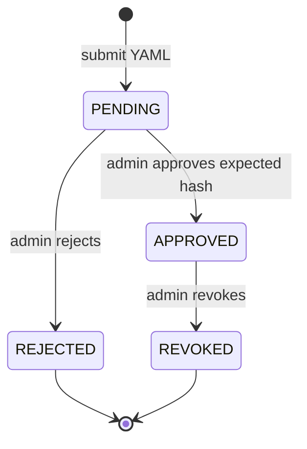

# Skill and agent configuration lifecycle

Skills are Markdown instructions under [skills](../blob_local/platform/skills), loaded as application configuration. They are versioned with the repository and selected through capability YAML. Project specialists use a separate approved YAML lifecycle. The [approval and discovery sequence](architecture.md#5-project-agent-approval-and-discovery) shows how storage, review and the orchestrator interact:

Definitions contain only data (`id`, `version`, `name`, `description`, `instruction`, `capability`, `model_profile`, `stage_model`, and existing tool names). They are canonicalized, hashed, and written to the local blob store or configured GCS before the draft record is created. Pending, rejected, and revoked definitions never reach orchestration. Approval requires same tenant/project scope, an administrator role, a matching `expected_hash`, and a reviewer different from the author.

A skill change must:

1. keep tool and output instructions consistent with the current ADK workflow;
2. avoid credentials, remote URL fetching, macros, and code execution;
3. preserve evidence citations and configured tenant/project scope;
4. pass `make lint`, `make test`, and `make smoke`;
5. be reviewed before use in live mode.

Static skill updates take effect when application configuration is updated and restarted. Custom agent definitions have a durable approval/revocation record and are loaded from their content-addressed blob; there is no traffic-splitting controller or background recovery worker.

Agent submissions also create a `framework/uploads/agents/pending-approval/<draft_id>/` stage copy. Review moves that copy to `approved` or `rejected`; revocation moves it to `revoked`. The immutable canonical version remains for audit. Folder placement never grants approval, and previous approved versions may be inactive. Skills/prompts have reserved stage folders but continue to use the deployed configuration workflow. See [storage stages and repair](blob-storage.md).

## API steps

All paths below begin with `/api/v1/agent-configurations` and require authentication.

| Step | Endpoint | Input and effect |
|---|---|---|
| Discover fields | `GET /schema` | Returns the data-only agent JSON schema |
| Submit | `POST` | JSON body with a `yaml` string; creates a canonical blob and `PENDING` draft |
| Review definitions | `GET` | Lists project-scoped draft definitions and review state for permitted roles |
| Approve | `POST /{draft_id}/approve` | `expected_hash` and `reason`; activates the exact reviewed version |
| Reject | `POST /{draft_id}/reject` | `expected_hash` and `reason`; leaves the definition inactive |
| Revoke | `POST /{draft_id}/revoke` | `reason`; removes that version from future active discovery |

Approval history and active selection are distinct: one version per agent ID is active in a project. Approving a replacement does not delete the previous approved record. Revoking an older version does not remove a newer active version. In-flight runs retain their approved snapshot; new runs discover the updated active selection.

After discovery, only definitions matching the requested capability are considered. A specialist with a disabled stage or an unavailable declared tool is omitted and recorded as a limitation. Other eligible specialists become `AgentTool` choices for the router. See the [agent workflow](architecture.md#2-agent-workflow) for when delegation happens.

**Implementation:** [configuration service](../app/configuration/service.py), [blob provider](../app/connectors/providers/blob.py), [API routes](../app/api/routes/agents.py), [run snapshot](../app/runtime/runner.py), [AgentTool assembly](../app/agents/root.py).

## Skill inheritance

Platform defaults, scoped project layers and permitted user layers resolve through the [three-tier inheritance policy](skill-inheritance.md). These deployed data-only layers have a separate lifecycle from approved agent definitions described above.
